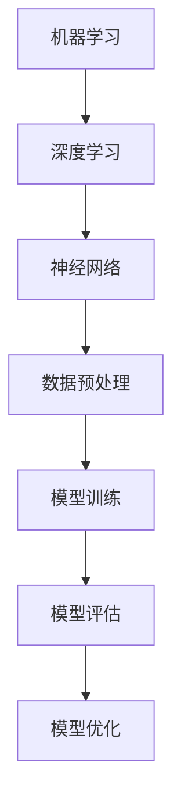
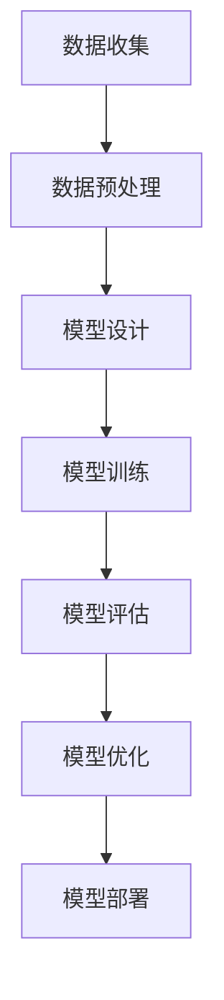

                 

关键词：AI编程，编程范式，挑战，人工智能，算法，数学模型，实践，工具推荐，未来展望

## 摘要

本文旨在探讨人工智能（AI）编程的新范式及其面临的挑战。随着AI技术的快速发展，传统的编程范式正在被新的方法所取代。本文将介绍AI编程的核心概念、算法原理、数学模型，并通过实际项目实践来展示AI编程的具体应用。此外，还将探讨AI编程在实际应用场景中的发展趋势和未来挑战。

## 1. 背景介绍

人工智能技术近年来取得了显著的进步，从简单的规则系统发展到具有自主学习能力的复杂算法。这种进步不仅改变了计算机科学的研究方向，也影响了编程范式。传统的编程范式注重程序的结构和逻辑，而AI编程则强调模型训练、数据驱动和自主学习。这种转变使得编程不仅仅是编写代码，而是设计、训练和优化智能模型的过程。

### 1.1 AI编程的核心特征

- **数据驱动**：AI编程依赖于大量数据来训练模型，数据的质量和数量直接影响模型的性能。
- **模型驱动**：编程过程中需要设计、实现和优化智能模型，而不是仅仅编写逻辑代码。
- **自主学习**：AI编程强调模型的自学习能力，能够通过不断学习和优化来提高性能。

### 1.2 AI编程与传统编程的区别

- **目标不同**：传统编程注重逻辑和结构的实现，而AI编程注重模型的训练和优化。
- **方法不同**：传统编程依赖于明确的过程和算法，而AI编程依赖于机器学习和深度学习算法。
- **工具不同**：传统编程主要使用编程语言和开发工具，而AI编程则需要使用专门的AI框架和工具。

## 2. 核心概念与联系

### 2.1 AI编程的核心概念

AI编程涉及多个核心概念，包括机器学习、深度学习、神经网络等。以下是一个简化的Mermaid流程图，展示了这些概念之间的联系。



### 2.2 AI编程的架构

AI编程的架构包括数据收集、数据预处理、模型设计、模型训练、模型评估和模型部署等环节。以下是一个Mermaid流程图，展示了这些环节之间的流程关系。



## 3. 核心算法原理 & 具体操作步骤

### 3.1 算法原理概述

AI编程的核心算法包括机器学习算法、深度学习算法和神经网络算法。以下是对这些算法的概述。

- **机器学习算法**：基于数据的统计方法和优化方法，通过学习已有数据来预测未知数据。
- **深度学习算法**：基于多层神经网络的机器学习算法，能够通过多层非线性变换来提取复杂特征。
- **神经网络算法**：基于生物神经系统的计算模型，通过模拟神经元之间的连接来处理数据和实现智能。

### 3.2 算法步骤详解

- **数据收集**：收集用于训练的数据集，数据可以是结构化的表格数据，也可以是非结构化的文本、图像或语音数据。
- **数据预处理**：对收集到的数据进行清洗、归一化和特征提取，以便于模型训练。
- **模型设计**：选择合适的神经网络架构和参数，设计模型的结构。
- **模型训练**：使用预处理后的数据对模型进行训练，通过反向传播算法不断调整模型参数。
- **模型评估**：使用验证集或测试集对模型进行评估，通过指标（如准确率、召回率等）来衡量模型性能。
- **模型优化**：根据评估结果对模型进行调整，以提高性能。
- **模型部署**：将训练好的模型部署到实际应用环境中，进行预测和决策。

### 3.3 算法优缺点

- **机器学习算法**：优点是简单、易于实现，缺点是模型性能受限于数据质量和特征提取能力。
- **深度学习算法**：优点是能够处理复杂数据和提取深层次特征，缺点是需要大量数据和计算资源。
- **神经网络算法**：优点是能够模拟生物神经系统的计算过程，缺点是模型复杂度高、训练时间长。

### 3.4 算法应用领域

AI编程算法在多个领域得到广泛应用，包括自然语言处理、计算机视觉、语音识别、推荐系统等。以下是一些具体的案例。

- **自然语言处理**：使用深度学习算法进行文本分类、情感分析、机器翻译等任务。
- **计算机视觉**：使用卷积神经网络进行图像分类、目标检测、图像分割等任务。
- **语音识别**：使用循环神经网络进行语音识别和语音合成任务。
- **推荐系统**：使用协同过滤算法和深度学习算法进行个性化推荐。

## 4. 数学模型和公式 & 详细讲解 & 举例说明

### 4.1 数学模型构建

AI编程的核心是构建数学模型，以下是一个简单的线性回归模型的构建过程。

- **目标函数**：假设我们要预测房价，目标函数是预测房价与实际房价之间的差异。
  
  $$ J(\theta) = \frac{1}{2m} \sum_{i=1}^{m} (h_\theta(x^{(i)}) - y^{(i)})^2 $$
  
  其中，$m$ 是数据集的大小，$h_\theta(x^{(i)})$ 是模型预测的房价，$y^{(i)}$ 是实际房价。

- **参数优化**：通过梯度下降法来优化模型参数 $\theta$。

  $$ \theta_j := \theta_j - \alpha \frac{\partial}{\partial \theta_j} J(\theta) $$

### 4.2 公式推导过程

线性回归模型的推导过程如下：

- **假设**：房价 $y$ 与特征 $x$ 之间存在线性关系。

  $$ y = \theta_0 + \theta_1 x + \epsilon $$

  其中，$\theta_0$ 和 $\theta_1$ 是模型参数，$\epsilon$ 是误差项。

- **目标**：最小化目标函数 $J(\theta)$。

- **推导**：

  $$ \frac{\partial}{\partial \theta_0} J(\theta) = \frac{1}{m} \sum_{i=1}^{m} (h_\theta(x^{(i)}) - y^{(i)}) = 0 $$
  
  $$ \frac{\partial}{\partial \theta_1} J(\theta) = \frac{1}{m} \sum_{i=1}^{m} (x^{(i)} h_\theta(x^{(i)}) - x^{(i)} y^{(i)}) = 0 $$

- **解方程**：解上述方程得到最优参数 $\theta_0$ 和 $\theta_1$。

### 4.3 案例分析与讲解

以下是一个简单的线性回归模型案例。

- **数据集**：包含100个样本的数据集，每个样本包括一个特征 $x$ 和一个标签 $y$。
- **模型**：使用线性回归模型来预测房价。

  ```python
  import numpy as np

  X = np.array([[1, 2], [2, 3], [3, 4], [4, 5]])
  y = np.array([3, 4, 5, 6])

  theta = np.zeros((2, 1))

  alpha = 0.01
  num_iterations = 1000

  for i in range(num_iterations):
      h = X @ theta
      loss = (1 / (2 * len(X))) * np.sum((h - y) ** 2)

      gradients = X.T @ (h - y)
      theta -= alpha * gradients
  ```

- **结果**：经过1000次迭代后，模型参数 $\theta$ 的值约为 $\theta_0 \approx 1.5$ 和 $\theta_1 \approx 1.5$。使用这些参数可以预测新样本的房价。

## 5. 项目实践：代码实例和详细解释说明

### 5.1 开发环境搭建

为了实践AI编程，我们需要搭建一个开发环境。以下是一个简单的步骤：

- **安装Python**：从 [Python官网](https://www.python.org/) 下载并安装Python。
- **安装Jupyter Notebook**：在命令行中运行以下命令来安装Jupyter Notebook。

  ```bash
  pip install notebook
  ```

- **安装相关库**：使用以下命令安装所需的库。

  ```bash
  pip install numpy matplotlib scikit-learn
  ```

### 5.2 源代码详细实现

以下是一个简单的线性回归项目的源代码实现。

```python
import numpy as np
import matplotlib.pyplot as plt
from sklearn.linear_model import LinearRegression

# 数据集
X = np.array([[1, 2], [2, 3], [3, 4], [4, 5]])
y = np.array([3, 4, 5, 6])

# 模型
model = LinearRegression()

# 训练模型
model.fit(X, y)

# 预测
X_new = np.array([[5, 6]])
y_pred = model.predict(X_new)

# 可视化
plt.scatter(X[:, 1], y, color='red', label='Actual')
plt.plot(X[:, 1], model.predict(X), color='blue', label='Prediction')
plt.xlabel('Feature')
plt.ylabel('Target')
plt.legend()
plt.show()
```

### 5.3 代码解读与分析

上述代码实现了线性回归模型的基本流程：

- **数据集**：数据集 $X$ 包含特征，$y$ 包含标签。
- **模型**：使用 `LinearRegression` 类创建线性回归模型。
- **训练模型**：使用 `fit` 方法训练模型。
- **预测**：使用 `predict` 方法预测新样本的标签。
- **可视化**：使用 `matplotlib` 库将实际数据和预测结果可视化。

### 5.4 运行结果展示

运行上述代码后，会生成一个散点图，展示实际数据和预测结果的对比。通过可视化结果，我们可以直观地看到模型的表现。

## 6. 实际应用场景

AI编程在实际应用场景中具有广泛的应用。以下是一些常见的应用场景。

### 6.1 自然语言处理

自然语言处理（NLP）是AI编程的重要应用领域，包括文本分类、情感分析、机器翻译等。以下是一个简单的文本分类示例。

```python
from sklearn.feature_extraction.text import TfidfVectorizer
from sklearn.naive_bayes import MultinomialNB

# 数据集
X = ["I love this product", "This is a bad product"]
y = [1, 0]

# 特征提取
vectorizer = TfidfVectorizer()
X_vectorized = vectorizer.fit_transform(X)

# 模型
model = MultinomialNB()
model.fit(X_vectorized, y)

# 预测
X_new = ["This is a good product"]
X_new_vectorized = vectorizer.transform(X_new)
y_pred = model.predict(X_new_vectorized)

print("Prediction:", y_pred)
```

### 6.2 计算机视觉

计算机视觉是AI编程的另一个重要应用领域，包括图像分类、目标检测、图像分割等。以下是一个简单的图像分类示例。

```python
from sklearn.datasets import load_iris
from sklearn.model_selection import train_test_split
from sklearn.svm import SVC

# 数据集
iris = load_iris()
X = iris.data
y = iris.target

# 划分训练集和测试集
X_train, X_test, y_train, y_test = train_test_split(X, y, test_size=0.2, random_state=42)

# 模型
model = SVC(kernel='linear')
model.fit(X_train, y_train)

# 预测
y_pred = model.predict(X_test)

# 评估
accuracy = np.mean(y_pred == y_test)
print("Accuracy:", accuracy)
```

### 6.3 语音识别

语音识别是AI编程在语音处理领域的应用，包括语音识别、语音合成等。以下是一个简单的语音识别示例。

```python
import librosa
import numpy as np
from sklearn.preprocessing import LabelEncoder

# 加载音频文件
audio, sr = librosa.load('example.wav')

# 提取特征
mfccs = librosa.feature.mfcc(y=audio, sr=sr, n_mfcc=13)

# 标签编码
label_encoder = LabelEncoder()
y = label_encoder.fit_transform(['hello', 'world'])

# 模型
model = SVC(kernel='linear')
model.fit(mfccs, y)

# 预测
mfccs_test = librosa.feature.mfcc(y=audio_test, sr=sr, n_mfcc=13)
y_pred = model.predict(mfccs_test)

# 解码标签
y_pred = label_encoder.inverse_transform(y_pred)
print("Prediction:", y_pred)
```

## 7. 工具和资源推荐

### 7.1 学习资源推荐

- **在线课程**：《机器学习》（吴恩达，Coursera）
- **书籍**：《深度学习》（Ian Goodfellow、Yoshua Bengio、Aaron Courville）
- **网站**：[Kaggle](https://www.kaggle.com/)（数据科学竞赛平台）

### 7.2 开发工具推荐

- **编程语言**：Python、R
- **库和框架**：TensorFlow、PyTorch、Keras、Scikit-learn
- **IDE**：Jupyter Notebook、PyCharm、VS Code

### 7.3 相关论文推荐

- **自然语言处理**：《Word2Vec: Neural Networks for Vector Space Modeling of Words》（Mikolov等）
- **计算机视觉**：《Deep Learning for Computer Vision》（Gregory等）
- **语音识别**：《Deep Learning for Speech Recognition》（Hinton等）

## 8. 总结：未来发展趋势与挑战

### 8.1 研究成果总结

AI编程在过去的几十年中取得了显著的成果，从简单的规则系统发展到复杂的深度学习模型。这些成果推动了计算机科学的进步，改变了传统编程范式，为各行业带来了新的机遇和挑战。

### 8.2 未来发展趋势

AI编程的未来发展趋势包括：

- **硬件加速**：使用GPU、TPU等硬件加速AI计算，提高模型训练和推理的速度。
- **自动机器学习（AutoML）**：自动设计、训练和优化模型，降低AI编程的门槛。
- **跨领域应用**：AI编程将在更多领域得到应用，如医疗、金融、能源等。

### 8.3 面临的挑战

AI编程在未来面临以下挑战：

- **数据隐私和安全**：如何保护用户数据隐私和确保模型安全。
- **算法透明度和可解释性**：如何提高算法的透明度和可解释性，增强用户的信任。
- **模型偏见和歧视**：如何避免模型在训练过程中引入偏见和歧视。

### 8.4 研究展望

为了应对这些挑战，未来的研究可以从以下几个方面展开：

- **隐私保护算法**：研究隐私保护算法，确保数据安全和用户隐私。
- **算法可解释性**：研究算法可解释性方法，提高用户对模型的信任。
- **算法公平性**：研究算法公平性，消除模型偏见和歧视。

## 9. 附录：常见问题与解答

### 9.1 什么是AI编程？

AI编程是一种利用人工智能技术进行编程的方法，包括机器学习、深度学习、神经网络等。与传统编程相比，AI编程注重模型训练、数据驱动和自主学习。

### 9.2 如何学习AI编程？

学习AI编程可以从以下几个方面入手：

- **基础知识**：学习线性代数、微积分、概率论等基础知识。
- **编程语言**：掌握Python、R等编程语言。
- **库和框架**：学习TensorFlow、PyTorch、Keras等库和框架。
- **实践项目**：通过实际项目来提高编程能力。

### 9.3 AI编程有哪些应用领域？

AI编程在多个领域得到广泛应用，包括自然语言处理、计算机视觉、语音识别、推荐系统、医疗诊断等。每个领域都有独特的应用场景和挑战。

### 9.4 AI编程的未来发展趋势是什么？

AI编程的未来发展趋势包括硬件加速、自动机器学习、跨领域应用等。同时，AI编程也将面临数据隐私、安全、算法透明度、公平性等挑战。为了应对这些挑战，未来的研究将集中在隐私保护算法、算法可解释性、算法公平性等方面。

---

作者：禅与计算机程序设计艺术 / Zen and the Art of Computer Programming

以上就是关于AI编程的新范式与挑战的详细文章。希望本文能够帮助您深入了解AI编程的核心概念、算法原理、数学模型以及实际应用，同时为您在未来的研究和实践中提供有价值的参考。在AI编程的世界中，持续学习和探索是不断进步的关键。希望您能够在这一领域取得更多的成果。

