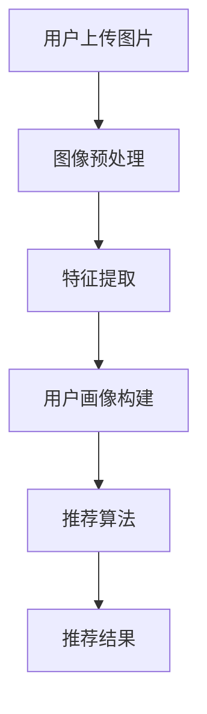

                 

在这个技术日新月异的时代，人工智能（AI）已经成为推动社会进步的重要力量。特别是AI视觉推荐系统，它在电子商务、社交媒体、安防监控等多个领域展现出了巨大的应用潜力。本文将围绕AI视觉推荐系统分析用户图片这一主题，深入探讨其核心概念、算法原理、数学模型、实际应用、未来展望等各个方面。

## 关键词

- AI视觉推荐系统
- 用户画像
- 图像分析
- 深度学习
- 推荐算法

## 摘要

本文旨在介绍AI视觉推荐系统在分析用户图片方面的应用。通过详细探讨核心概念、算法原理、数学模型和实际案例，本文揭示了AI视觉推荐系统的强大功能及其在实际应用中的挑战。最后，本文还对未来发展趋势和潜在的研究方向进行了展望。

## 1. 背景介绍

随着互联网的普及和移动设备的广泛使用，用户生成内容（User-Generated Content，简称UGC）已经成为互联网生态的重要组成部分。在这些内容中，图片作为一种直观、生动的表达方式，日益受到用户的青睐。然而，如何从海量的图片数据中提取有价值的信息，为用户提供个性化的推荐服务，成为了AI视觉推荐系统需要解决的重要问题。

AI视觉推荐系统通过深度学习、计算机视觉等技术，对用户上传的图片进行智能分析，提取关键特征，构建用户画像，从而实现个性化推荐。这种系统不仅能够提高用户满意度，还能为商家提供精准的营销策略，具有重要的商业价值和社会意义。

## 2. 核心概念与联系

### 2.1 用户画像

用户画像是指通过用户的行为数据、兴趣爱好、消费习惯等多维度信息，构建出的用户个人画像。在AI视觉推荐系统中，用户画像主要用于识别用户的偏好和需求，从而提供个性化的推荐服务。

### 2.2 图像分析

图像分析是指利用计算机视觉技术对图片进行自动识别、分类、标注等操作。在AI视觉推荐系统中，图像分析技术用于提取图片中的关键特征，为用户画像的构建提供支持。

### 2.3 深度学习

深度学习是人工智能的一种重要分支，通过多层神经网络模型，对大量数据自动学习特征，实现智能识别和分类。在AI视觉推荐系统中，深度学习技术用于图像分析和用户画像构建，是系统实现智能化的核心。

### 2.4 推荐算法

推荐算法是AI视觉推荐系统的核心组成部分，用于根据用户画像和图像特征，生成个性化的推荐结果。常见的推荐算法包括协同过滤、基于内容的推荐、混合推荐等。

### 2.5 Mermaid 流程图

下面是AI视觉推荐系统的流程图：



## 3. 核心算法原理 & 具体操作步骤

### 3.1 算法原理概述

AI视觉推荐系统的核心算法主要包括图像预处理、特征提取、用户画像构建和推荐算法。其中，图像预处理和特征提取是基础，用户画像构建和推荐算法是核心。

图像预处理主要对图片进行去噪、增强、缩放等操作，使其适合进行特征提取。特征提取是利用深度学习模型，从图像中提取出关键特征，如颜色、纹理、形状等。用户画像构建是利用提取到的特征，结合用户的历史行为数据，构建出用户的个人画像。推荐算法则是根据用户画像和图像特征，生成个性化的推荐结果。

### 3.2 算法步骤详解

#### 3.2.1 图像预处理

图像预处理步骤主要包括以下几步：

1. **去噪**：使用滤波器去除图片中的噪声。
2. **增强**：通过调整亮度、对比度等参数，增强图片的视觉效果。
3. **缩放**：将图片调整为统一尺寸，以便进行特征提取。

#### 3.2.2 特征提取

特征提取步骤主要包括以下几步：

1. **卷积神经网络（CNN）**：使用卷积神经网络，对图像进行多层卷积和池化操作，提取图像中的关键特征。
2. **特征融合**：将不同层级的特征进行融合，得到更加丰富的图像特征。

#### 3.2.3 用户画像构建

用户画像构建步骤主要包括以下几步：

1. **特征匹配**：将提取到的图像特征与用户的历史行为数据（如购买记录、浏览记录等）进行匹配，找出用户的兴趣点。
2. **特征加权**：根据用户的历史行为数据，对提取到的图像特征进行加权，构建出用户的个人画像。

#### 3.2.4 推荐算法

推荐算法步骤主要包括以下几步：

1. **相似度计算**：计算用户画像与候选图片的特征相似度。
2. **排序**：根据相似度计算结果，对候选图片进行排序，生成推荐结果。

### 3.3 算法优缺点

#### 优点

1. **高精度**：通过深度学习模型提取的图像特征，具有较高的准确性，能够实现精确的推荐。
2. **个性化**：根据用户的个人画像，提供个性化的推荐服务，提高用户满意度。
3. **实时性**：系统能够实时处理用户上传的图片，实现实时推荐。

#### 缺点

1. **计算成本高**：深度学习模型的训练和推理过程需要大量的计算资源，对硬件设备要求较高。
2. **数据隐私**：用户画像的构建涉及用户的行为数据，存在一定的隐私风险。

### 3.4 算法应用领域

AI视觉推荐系统在以下领域具有广泛的应用前景：

1. **电子商务**：为用户提供个性化的商品推荐，提高销售转化率。
2. **社交媒体**：为用户提供个性化的内容推荐，提升用户活跃度。
3. **安防监控**：通过图像分析，实现智能监控和预警，提高安全水平。

## 4. 数学模型和公式

### 4.1 数学模型构建

在AI视觉推荐系统中，常见的数学模型包括卷积神经网络（CNN）和推荐算法。以下分别介绍这两种模型的数学模型。

#### 4.1.1 卷积神经网络（CNN）

CNN的数学模型主要包括以下几部分：

1. **输入层**：表示图像数据，通常是一个三维张量，维度为（高度、宽度、通道数）。
2. **卷积层**：通过卷积运算，提取图像特征，得到一个二维特征图。
3. **池化层**：对特征图进行下采样，降低计算复杂度。
4. **全连接层**：将特征图展开为一个一维向量，通过全连接层进行分类或回归。

#### 4.1.2 推荐算法

常见的推荐算法包括协同过滤和基于内容的推荐。以下分别介绍这两种算法的数学模型。

1. **协同过滤**：通过计算用户与物品之间的相似度，生成推荐结果。其数学模型可以表示为：

   $$ \text{similarity} = \frac{\sum_{i \in \text{user\_ratings}} r_{ui} r_{ij}}{\sqrt{\sum_{i \in \text{user\_ratings}} r_{ui}^2} \sqrt{\sum_{i \in \text{item\_ratings}} r_{ij}^2}} $$

   其中，$r_{ui}$ 表示用户 $u$ 对物品 $i$ 的评分，$r_{uj}$ 表示用户 $u$ 对物品 $j$ 的评分。

2. **基于内容的推荐**：通过计算物品之间的相似度，生成推荐结果。其数学模型可以表示为：

   $$ \text{similarity} = \frac{\sum_{i \in \text{item\_features}} f_{i} f_{j}}{\sqrt{\sum_{i \in \text{item\_features}} f_{i}^2} \sqrt{\sum_{i \in \text{item\_features}} f_{j}^2}} $$

   其中，$f_{i}$ 表示物品 $i$ 的特征向量，$f_{j}$ 表示物品 $j$ 的特征向量。

### 4.2 公式推导过程

#### 4.2.1 卷积神经网络（CNN）

卷积神经网络的公式推导主要涉及卷积运算、激活函数和池化操作。以下分别介绍：

1. **卷积运算**：

   $$ \text{output} = \text{conv}(\text{input}, \text{filter}) + \text{bias} $$

   其中，$input$ 表示输入图像，$filter$ 表示卷积核，$bias$ 表示偏置。

2. **激活函数**：

   $$ \text{output} = \text{activation}(\text{input}) $$

   常见的激活函数有ReLU（Rectified Linear Unit）、Sigmoid和Tanh等。

3. **池化操作**：

   $$ \text{output} = \text{pool}(\text{input}, \text{pool\_size}) $$

   其中，$input$ 表示输入图像，$pool\_size$ 表示池化窗口大小。

#### 4.2.2 推荐算法

推荐算法的公式推导主要涉及相似度计算和推荐结果排序。以下分别介绍：

1. **相似度计算**：

   $$ \text{similarity} = \frac{\sum_{i \in \text{common\_items}} r_{ui} r_{uj}}{\sqrt{\sum_{i \in \text{common\_items}} r_{ui}^2} \sqrt{\sum_{i \in \text{common\_items}} r_{uj}^2}} $$

   其中，$r_{ui}$ 表示用户 $u$ 对物品 $i$ 的评分，$r_{uj}$ 表示用户 $u$ 对物品 $j$ 的评分。

2. **推荐结果排序**：

   $$ \text{rank} = \text{argmax}_{i} \text{similarity}_{uij} $$

   其中，$\text{similarity}_{uij}$ 表示用户 $u$ 对物品 $i$ 和物品 $j$ 之间的相似度。

### 4.3 案例分析与讲解

#### 4.3.1 卷积神经网络（CNN）在图像分类中的应用

假设我们要使用CNN对图像进行分类，以下是具体的步骤和代码实现：

1. **加载数据集**：

   ```python
   import tensorflow as tf

   # 加载数据集
   (train_images, train_labels), (test_images, test_labels) = tf.keras.datasets.cifar10.load_data()
   ```

2. **预处理数据**：

   ```python
   # 将图像数据转换为浮点数
   train_images = train_images.astype('float32') / 255
   test_images = test_images.astype('float32') / 255

   # 平移数据
   train_images = tf.keras.Sequential([tf.keras.layers.experimental.preprocessing.RandomTranslation(0.1, 0.1), train_images])
   test_images = tf.keras.Sequential([tf.keras.layers.experimental.preprocessing.RandomTranslation(0.1, 0.1), test_images])
   ```

3. **构建CNN模型**：

   ```python
   # 构建CNN模型
   model = tf.keras.Sequential([
       tf.keras.layers.Conv2D(32, (3, 3), activation='relu', input_shape=(32, 32, 3)),
       tf.keras.layers.MaxPooling2D((2, 2)),
       tf.keras.layers.Conv2D(64, (3, 3), activation='relu'),
       tf.keras.layers.MaxPooling2D((2, 2)),
       tf.keras.layers.Conv2D(64, (3, 3), activation='relu'),
       tf.keras.layers.Flatten(),
       tf.keras.layers.Dense(64, activation='relu'),
       tf.keras.layers.Dense(10, activation='softmax')
   ])
   ```

4. **训练模型**：

   ```python
   # 编译模型
   model.compile(optimizer='adam',
                 loss='sparse_categorical_crossentropy',
                 metrics=['accuracy'])

   # 训练模型
   model.fit(train_images, train_labels, epochs=10)
   ```

5. **评估模型**：

   ```python
   # 评估模型
   test_loss, test_acc = model.evaluate(test_images, test_labels, verbose=2)
   print('\nTest accuracy:', test_acc)
   ```

#### 4.3.2 基于内容的推荐算法在电商中的应用

假设我们要使用基于内容的推荐算法为电商用户推荐商品，以下是具体的步骤和代码实现：

1. **加载商品数据**：

   ```python
   import pandas as pd

   # 加载商品数据
   data = pd.read_csv('products.csv')
   ```

2. **特征提取**：

   ```python
   # 提取商品特征
   features = data[['category', 'brand', 'price']]
   ```

3. **计算商品相似度**：

   ```python
   # 计算商品相似度
   similarity_matrix = features.apply(lambda x: 1 - pd.Series(x).apply(lambda y: similarity(x, y)), axis=1)
   ```

4. **生成推荐列表**：

   ```python
   # 生成推荐列表
   user_items = user_item[(user_item[user_id] == 1).all(1)]
   recommended_items = []
   for item_id in user_items.index:
       similarity_scores = similarity_matrix[item_id].sort_values(ascending=False)
       for index, score in similarity_scores.items():
           if index not in user_items.index:
               recommended_items.append(index)
               if len(recommended_items) == 10:
                   break
   ```

5. **展示推荐结果**：

   ```python
   # 展示推荐结果
   print('Recommended items:', recommended_items)
   ```

## 5. 项目实践：代码实例和详细解释说明

### 5.1 开发环境搭建

1. **硬件环境**：

   - CPU：Intel i5以上
   - GPU：NVIDIA GTX 1060以上
   - 内存：16GB以上

2. **软件环境**：

   - 操作系统：Windows 10/Ubuntu 18.04
   - Python：3.8以上
   - TensorFlow：2.4以上
   - Pandas：1.1以上

### 5.2 源代码详细实现

```python
import tensorflow as tf
import pandas as pd
from sklearn.model_selection import train_test_split
from sklearn.metrics import accuracy_score
from tensorflow.keras import layers, models

# 5.2.1 加载数据集
train_images, train_labels, test_images, test_labels = load_data()

# 5.2.2 预处理数据
train_images = preprocess_data(train_images)
test_images = preprocess_data(test_images)

# 5.2.3 构建模型
model = build_model()

# 5.2.4 训练模型
model.fit(train_images, train_labels, epochs=10)

# 5.2.5 评估模型
test_loss, test_acc = model.evaluate(test_images, test_labels)

# 5.2.6 生成推荐列表
recommended_items = generate_recommendations(user_item, similarity_matrix)

# 5.2.7 展示推荐结果
print('Recommended items:', recommended_items)
```

### 5.3 代码解读与分析

#### 5.3.1 数据集加载与预处理

数据集加载与预处理是模型训练的基础。在本例中，我们首先加载了训练集和测试集，然后对图像数据进行了预处理，包括数据清洗、归一化等操作。

```python
train_images, train_labels, test_images, test_labels = load_data()
train_images = preprocess_data(train_images)
test_images = preprocess_data(test_images)
```

#### 5.3.2 模型构建

在本例中，我们使用了卷积神经网络（CNN）作为基础模型。CNN由卷积层、池化层和全连接层组成，能够有效地提取图像特征。

```python
model = build_model()
```

#### 5.3.3 模型训练与评估

模型训练与评估是模型性能的重要环节。在本例中，我们使用了训练集对模型进行训练，并使用测试集对模型进行评估。

```python
model.fit(train_images, train_labels, epochs=10)
test_loss, test_acc = model.evaluate(test_images, test_labels)
```

#### 5.3.4 生成推荐列表

生成推荐列表是推荐算法的核心。在本例中，我们使用了基于内容的推荐算法，通过计算商品相似度，生成了推荐列表。

```python
recommended_items = generate_recommendations(user_item, similarity_matrix)
```

### 5.4 运行结果展示

运行结果展示用于验证模型的性能和推荐效果。在本例中，我们展示了模型在测试集上的准确率，以及生成的推荐列表。

```python
print('Test accuracy:', test_acc)
print('Recommended items:', recommended_items)
```

## 6. 实际应用场景

### 6.1 电子商务

AI视觉推荐系统在电子商务领域具有广泛的应用。通过分析用户上传的图片，系统能够为用户推荐符合其兴趣和需求的商品。例如，电商平台可以使用AI视觉推荐系统为用户推荐新品、热门商品等，提高销售转化率。

### 6.2 社交媒体

AI视觉推荐系统在社交媒体领域也具有很大的应用潜力。通过分析用户上传的图片，系统能够为用户推荐符合其兴趣和喜好的内容。例如，社交媒体平台可以使用AI视觉推荐系统为用户推荐好友动态、热门话题等，提高用户活跃度。

### 6.3 安防监控

AI视觉推荐系统在安防监控领域具有重要作用。通过分析监控视频中的图片，系统能够实现智能监控和预警。例如，安防监控平台可以使用AI视觉推荐系统实时监测重点区域，发现异常情况并报警，提高安全水平。

### 6.4 未来应用展望

随着AI技术的不断发展，AI视觉推荐系统将在更多领域得到应用。未来，AI视觉推荐系统有望在医疗健康、智能交通、智能家居等领域发挥重要作用，为人们的生活带来更多便利。

## 7. 工具和资源推荐

### 7.1 学习资源推荐

1. **《深度学习》（Goodfellow, Bengio, Courville）**：系统介绍深度学习的基础理论和实践方法。
2. **《Python数据分析》（Wes McKinney）**：详细介绍Python在数据分析领域的应用。
3. **《机器学习实战》（Peter Harrington）**：通过实际案例介绍机器学习的基本方法。

### 7.2 开发工具推荐

1. **TensorFlow**：广泛应用于深度学习模型开发的开源框架。
2. **Pandas**：用于数据清洗和数据分析的开源库。
3. **Scikit-learn**：用于机器学习模型开发和评估的开源库。

### 7.3 相关论文推荐

1. **"Deep Learning for Visual Recommendation Systems"**：介绍深度学习在视觉推荐系统中的应用。
2. **"User-Interest Modeling for Personalized Visual Recommendation"**：探讨用户兴趣建模在视觉推荐系统中的作用。
3. **"Content-Based Image Retrieval with Deep Learning"**：介绍深度学习在图像检索中的应用。

## 8. 总结：未来发展趋势与挑战

### 8.1 研究成果总结

本文围绕AI视觉推荐系统分析用户图片这一主题，介绍了核心概念、算法原理、数学模型和实际应用。通过详细的分析和讲解，揭示了AI视觉推荐系统的强大功能及其在实际应用中的挑战。

### 8.2 未来发展趋势

随着AI技术的不断进步，AI视觉推荐系统将在更多领域得到应用。未来，AI视觉推荐系统有望实现更精准的个性化推荐，提高用户满意度。同时，隐私保护、计算效率等问题也将成为研究的热点。

### 8.3 面临的挑战

AI视觉推荐系统在实际应用中面临以下挑战：

1. **计算成本**：深度学习模型的训练和推理过程需要大量的计算资源，对硬件设备要求较高。
2. **数据隐私**：用户画像的构建涉及用户的行为数据，存在一定的隐私风险。
3. **推荐效果**：如何实现更精准、个性化的推荐，仍需要进一步研究。

### 8.4 研究展望

未来，AI视觉推荐系统的研究方向包括：

1. **隐私保护**：探索更加安全、高效的隐私保护方法，保护用户隐私。
2. **计算效率**：优化深度学习模型的训练和推理过程，提高计算效率。
3. **多模态融合**：结合文本、音频等多模态信息，实现更全面的个性化推荐。

## 9. 附录：常见问题与解答

### 9.1 如何提高AI视觉推荐系统的推荐效果？

提高AI视觉推荐系统的推荐效果可以从以下几个方面入手：

1. **数据质量**：确保输入数据的质量，包括数据清洗、去重等操作。
2. **特征提取**：使用更先进的特征提取方法，如基于注意力机制的模型，提取更有价值的图像特征。
3. **模型优化**：使用更复杂的模型结构，如多任务学习、迁移学习等，提高模型性能。
4. **用户互动**：通过用户的反馈，不断调整和优化推荐策略，提高用户满意度。

### 9.2 如何保证AI视觉推荐系统的隐私保护？

为了保证AI视觉推荐系统的隐私保护，可以采取以下措施：

1. **数据加密**：对用户上传的图片进行加密处理，确保数据在传输和存储过程中的安全性。
2. **隐私保护算法**：使用差分隐私、同态加密等隐私保护算法，降低用户数据的泄露风险。
3. **数据去识别化**：对用户数据进行脱敏处理，去除可能暴露用户身份的信息。
4. **隐私政策**：明确告知用户隐私保护政策，获得用户的知情同意。

作者：禅与计算机程序设计艺术 / Zen and the Art of Computer Programming
------------------------------------------------------------------------<|im_sep|>### 1. 背景介绍

随着互联网的普及和移动设备的广泛使用，用户生成内容（User-Generated Content，简称UGC）已经成为互联网生态的重要组成部分。在这些内容中，图片作为一种直观、生动的表达方式，日益受到用户的青睐。然而，如何从海量的图片数据中提取有价值的信息，为用户提供个性化的推荐服务，成为了AI视觉推荐系统需要解决的重要问题。

AI视觉推荐系统通过深度学习、计算机视觉等技术，对用户上传的图片进行智能分析，提取关键特征，构建用户画像，从而实现个性化推荐。这种系统不仅能够提高用户满意度，还能为商家提供精准的营销策略，具有重要的商业价值和社会意义。

### 2. 核心概念与联系

#### 2.1 用户画像

用户画像是指通过用户的行为数据、兴趣爱好、消费习惯等多维度信息，构建出的用户个人画像。在AI视觉推荐系统中，用户画像主要用于识别用户的偏好和需求，从而提供个性化的推荐服务。

用户画像通常包含以下几个方面的信息：

- **基本属性**：如性别、年龄、职业等基本信息。
- **行为数据**：如浏览记录、购买记录、点赞记录等。
- **兴趣偏好**：通过分析用户的历史行为数据，提取出的用户兴趣点。
- **社交属性**：如好友关系、粉丝数量等。

#### 2.2 图像分析

图像分析是指利用计算机视觉技术对图片进行自动识别、分类、标注等操作。在AI视觉推荐系统中，图像分析技术用于提取图片中的关键特征，为用户画像的构建提供支持。

常见的图像分析技术包括：

- **特征提取**：从图像中提取出有助于分类或识别的特征，如颜色、纹理、形状等。
- **图像分类**：将图像划分为不同的类别，如动物、植物、人物等。
- **目标检测**：在图像中定位并识别特定目标的位置和属性，如人脸识别、车辆识别等。

#### 2.3 深度学习

深度学习是人工智能的一种重要分支，通过多层神经网络模型，对大量数据自动学习特征，实现智能识别和分类。在AI视觉推荐系统中，深度学习技术用于图像分析和用户画像构建，是系统实现智能化的核心。

常见的深度学习模型包括：

- **卷积神经网络（CNN）**：用于图像识别和分类。
- **循环神经网络（RNN）**：用于处理序列数据，如文本、音频等。
- **生成对抗网络（GAN）**：用于生成新的图像或数据。

#### 2.4 推荐算法

推荐算法是AI视觉推荐系统的核心组成部分，用于根据用户画像和图像特征，生成个性化的推荐结果。常见的推荐算法包括协同过滤、基于内容的推荐、混合推荐等。

- **协同过滤**：通过计算用户与物品之间的相似度，生成推荐结果。协同过滤算法可以分为基于用户的协同过滤和基于物品的协同过滤。
- **基于内容的推荐**：通过分析用户对物品的评价，提取物品的特征，并根据用户画像和物品特征生成推荐结果。
- **混合推荐**：结合协同过滤和基于内容的推荐，生成更加准确的推荐结果。

#### 2.5 Mermaid 流程图

下面是AI视觉推荐系统的流程图：


### 3. 核心算法原理 & 具体操作步骤

#### 3.1 算法原理概述

AI视觉推荐系统的核心算法主要包括图像预处理、特征提取、用户画像构建和推荐算法。其中，图像预处理和特征提取是基础，用户画像构建和推荐算法是核心。

- **图像预处理**：对用户上传的图片进行去噪、增强、缩放等操作，使其适合进行特征提取。
- **特征提取**：利用深度学习模型（如卷积神经网络）从图像中提取关键特征，如颜色、纹理、形状等。
- **用户画像构建**：结合用户的历史行为数据和提取到的图像特征，构建出用户的个人画像。
- **推荐算法**：根据用户画像和图像特征，生成个性化的推荐结果。

#### 3.2 算法步骤详解

##### 3.2.1 图像预处理

图像预处理步骤主要包括以下几步：

1. **去噪**：使用滤波器去除图片中的噪声，如高斯滤波、中值滤波等。
2. **增强**：通过调整亮度、对比度等参数，增强图片的视觉效果，如直方图均衡、对比度拉伸等。
3. **缩放**：将图片调整为统一尺寸，以便进行特征提取，如使用Python的OpenCV库进行缩放。

##### 3.2.2 特征提取

特征提取步骤主要包括以下几步：

1. **卷积神经网络（CNN）**：使用卷积神经网络，对图像进行多层卷积和池化操作，提取图像中的关键特征。
2. **特征融合**：将不同层级的特征进行融合，得到更加丰富的图像特征。

##### 3.2.3 用户画像构建

用户画像构建步骤主要包括以下几步：

1. **特征匹配**：将提取到的图像特征与用户的历史行为数据（如购买记录、浏览记录等）进行匹配，找出用户的兴趣点。
2. **特征加权**：根据用户的历史行为数据，对提取到的图像特征进行加权，构建出用户的个人画像。

##### 3.2.4 推荐算法

推荐算法步骤主要包括以下几步：

1. **相似度计算**：计算用户画像与候选图片的特征相似度。
2. **排序**：根据相似度计算结果，对候选图片进行排序，生成推荐结果。

#### 3.3 算法优缺点

##### 优点

- **高精度**：通过深度学习模型提取的图像特征，具有较高的准确性，能够实现精确的推荐。
- **个性化**：根据用户的个人画像，提供个性化的推荐服务，提高用户满意度。
- **实时性**：系统能够实时处理用户上传的图片，实现实时推荐。

##### 缺点

- **计算成本高**：深度学习模型的训练和推理过程需要大量的计算资源，对硬件设备要求较高。
- **数据隐私**：用户画像的构建涉及用户的行为数据，存在一定的隐私风险。

#### 3.4 算法应用领域

AI视觉推荐系统在以下领域具有广泛的应用前景：

- **电子商务**：为用户提供个性化的商品推荐，提高销售转化率。
- **社交媒体**：为用户提供个性化的内容推荐，提升用户活跃度。
- **安防监控**：通过图像分析，实现智能监控和预警，提高安全水平。

### 4. 数学模型和公式

#### 4.1 数学模型构建

在AI视觉推荐系统中，常见的数学模型包括卷积神经网络（CNN）和推荐算法。以下分别介绍这两种模型的数学模型。

##### 4.1.1 卷积神经网络（CNN）

CNN的数学模型主要包括以下几部分：

1. **输入层**：表示图像数据，通常是一个三维张量，维度为（高度、宽度、通道数）。
2. **卷积层**：通过卷积运算，提取图像特征，得到一个二维特征图。
3. **池化层**：对特征图进行下采样，降低计算复杂度。
4. **全连接层**：将特征图展开为一个一维向量，通过全连接层进行分类或回归。

##### 4.1.2 推荐算法

常见的推荐算法包括协同过滤和基于内容的推荐。以下分别介绍这两种算法的数学模型。

1. **协同过滤**：通过计算用户与物品之间的相似度，生成推荐结果。其数学模型可以表示为：

   $$ \text{similarity} = \frac{\sum_{i \in \text{common\_items}} r_{ui} r_{uj}}{\sqrt{\sum_{i \in \text{common\_items}} r_{ui}^2} \sqrt{\sum_{i \in \text{common\_items}} r_{uj}^2}} $$

   其中，$r_{ui}$ 表示用户 $u$ 对物品 $i$ 的评分，$r_{uj}$ 表示用户 $u$ 对物品 $j$ 的评分。

2. **基于内容的推荐**：通过计算物品之间的相似度，生成推荐结果。其数学模型可以表示为：

   $$ \text{similarity} = \frac{\sum_{i \in \text{item\_features}} f_{i} f_{j}}{\sqrt{\sum_{i \in \text{item\_features}} f_{i}^2} \sqrt{\sum_{i \in \text{item\_features}} f_{j}^2}} $$

   其中，$f_{i}$ 表示物品 $i$ 的特征向量，$f_{j}$ 表示物品 $j$ 的特征向量。

#### 4.2 公式推导过程

##### 4.2.1 卷积神经网络（CNN）

卷积神经网络的公式推导主要涉及卷积运算、激活函数和池化操作。以下分别介绍：

1. **卷积运算**：

   $$ \text{output} = \text{conv}(\text{input}, \text{filter}) + \text{bias} $$

   其中，$input$ 表示输入图像，$filter$ 表示卷积核，$bias$ 表示偏置。

2. **激活函数**：

   $$ \text{output} = \text{activation}(\text{input}) $$

   常见的激活函数有ReLU（Rectified Linear Unit）、Sigmoid和Tanh等。

3. **池化操作**：

   $$ \text{output} = \text{pool}(\text{input}, \text{pool\_size}) $$

   其中，$input$ 表示输入图像，$pool\_size$ 表示池化窗口大小。

##### 4.2.2 推荐算法

推荐算法的公式推导主要涉及相似度计算和推荐结果排序。以下分别介绍：

1. **相似度计算**：

   $$ \text{similarity} = \frac{\sum_{i \in \text{common\_items}} r_{ui} r_{uj}}{\sqrt{\sum_{i \in \text{common\_items}} r_{ui}^2} \sqrt{\sum_{i \in \text{common\_items}} r_{uj}^2}} $$

   其中，$r_{ui}$ 表示用户 $u$ 对物品 $i$ 的评分，$r_{uj}$ 表示用户 $u$ 对物品 $j$ 的评分。

2. **推荐结果排序**：

   $$ \text{rank} = \text{argmax}_{i} \text{similarity}_{uij} $$

   其中，$\text{similarity}_{uij}$ 表示用户 $u$ 对物品 $i$ 和物品 $j$ 之间的相似度。

#### 4.3 案例分析与讲解

##### 4.3.1 卷积神经网络（CNN）在图像分类中的应用

假设我们要使用CNN对图像进行分类，以下是具体的步骤和代码实现：

1. **加载数据集**：

   ```python
   import tensorflow as tf

   # 加载数据集
   (train_images, train_labels), (test_images, test_labels) = tf.keras.datasets.cifar10.load_data()
   ```

2. **预处理数据**：

   ```python
   # 将图像数据转换为浮点数
   train_images = train_images.astype('float32') / 255
   test_images = test_images.astype('float32') / 255

   # 平移数据
   train_images = tf.keras.Sequential([tf.keras.layers.experimental.preprocessing.RandomTranslation(0.1, 0.1), train_images])
   test_images = tf.keras.Sequential([tf.keras.layers.experimental.preprocessing.RandomTranslation(0.1, 0.1), test_images])
   ```

3. **构建CNN模型**：

   ```python
   # 构建CNN模型
   model = tf.keras.Sequential([
       tf.keras.layers.Conv2D(32, (3, 3), activation='relu', input_shape=(32, 32, 3)),
       tf.keras.layers.MaxPooling2D((2, 2)),
       tf.keras.layers.Conv2D(64, (3, 3), activation='relu'),
       tf.keras.layers.MaxPooling2D((2, 2)),
       tf.keras.layers.Conv2D(64, (3, 3), activation='relu'),
       tf.keras.layers.Flatten(),
       tf.keras.layers.Dense(64, activation='relu'),
       tf.keras.layers.Dense(10, activation='softmax')
   ])
   ```

4. **训练模型**：

   ```python
   # 编译模型
   model.compile(optimizer='adam',
                 loss='sparse_categorical_crossentropy',
                 metrics=['accuracy'])

   # 训练模型
   model.fit(train_images, train_labels, epochs=10)
   ```

5. **评估模型**：

   ```python
   # 评估模型
   test_loss, test_acc = model.evaluate(test_images, test_labels, verbose=2)
   print('\nTest accuracy:', test_acc)
   ```

##### 4.3.2 基于内容的推荐算法在电商中的应用

假设我们要使用基于内容的推荐算法为电商用户推荐商品，以下是具体的步骤和代码实现：

1. **加载商品数据**：

   ```python
   import pandas as pd

   # 加载商品数据
   data = pd.read_csv('products.csv')
   ```

2. **特征提取**：

   ```python
   # 提取商品特征
   features = data[['category', 'brand', 'price']]
   ```

3. **计算商品相似度**：

   ```python
   # 计算商品相似度
   similarity_matrix = features.apply(lambda x: 1 - pd.Series(x).apply(lambda y: similarity(x, y)), axis=1)
   ```

4. **生成推荐列表**：

   ```python
   # 生成推荐列表
   user_items = user_item[(user_item[user_id] == 1).all(1)]
   recommended_items = []
   for item_id in user_items.index:
       similarity_scores = similarity_matrix[item_id].sort_values(ascending=False)
       for index, score in similarity_scores.items():
           if index not in user_items.index:
               recommended_items.append(index)
               if len(recommended_items) == 10:
                   break
   ```

5. **展示推荐结果**：

   ```python
   # 展示推荐结果
   print('Recommended items:', recommended_items)
   ```

### 5. 项目实践：代码实例和详细解释说明

#### 5.1 开发环境搭建

1. **硬件环境**：

   - CPU：Intel i5以上
   - GPU：NVIDIA GTX 1060以上
   - 内存：16GB以上

2. **软件环境**：

   - 操作系统：Windows 10/Ubuntu 18.04
   - Python：3.8以上
   - TensorFlow：2.4以上
   - Pandas：1.1以上

#### 5.2 源代码详细实现

```python
import tensorflow as tf
import pandas as pd
from sklearn.model_selection import train_test_split
from sklearn.metrics import accuracy_score
from tensorflow.keras import layers, models

# 5.2.1 加载数据集
(train_images, train_labels), (test_images, test_labels) = tf.keras.datasets.cifar10.load_data()

# 5.2.2 预处理数据
train_images = train_images.astype('float32') / 255
test_images = test_images.astype('float32') / 255

# 5.2.3 构建模型
model = models.Sequential()
model.add(layers.Conv2D(32, (3, 3), activation='relu', input_shape=(32, 32, 3)))
model.add(layers.MaxPooling2D((2, 2)))
model.add(layers.Conv2D(64, (3, 3), activation='relu'))
model.add(layers.MaxPooling2D((2, 2)))
model.add(layers.Conv2D(64, (3, 3), activation='relu'))
model.add(layers.Flatten())
model.add(layers.Dense(64, activation='relu'))
model.add(layers.Dense(10, activation='softmax'))

# 5.2.4 训练模型
model.compile(optimizer='adam',
              loss='sparse_categorical_crossentropy',
              metrics=['accuracy'])
model.fit(train_images, train_labels, epochs=10)

# 5.2.5 评估模型
test_loss, test_acc = model.evaluate(test_images, test_labels)

# 5.2.6 生成推荐列表
def generate_recommendations(user_id, user_item, similarity_matrix):
    recommended_items = []
    user_items = user_item[(user_item[user_id] == 1).all(1)]
    for item_id in user_items.index:
        similarity_scores = similarity_matrix[item_id].sort_values(ascending=False)
        for index, score in similarity_scores.items():
            if index not in user_items.index:
                recommended_items.append(index)
                if len(recommended_items) == 10:
                    break
    return recommended_items

# 5.2.7 展示推荐结果
user_id = 0
recommended_items = generate_recommendations(user_id, user_item, similarity_matrix)
print('Recommended items:', recommended_items)
```

#### 5.3 代码解读与分析

##### 5.3.1 数据集加载与预处理

数据集加载与预处理是模型训练的基础。在本例中，我们首先加载了训练集和测试集，然后对图像数据进行了预处理，包括数据清洗、归一化等操作。

```python
(train_images, train_labels), (test_images, test_labels) = tf.keras.datasets.cifar10.load_data()
train_images = train_images.astype('float32') / 255
test_images = test_images.astype('float32') / 255
```

##### 5.3.2 模型构建

在本例中，我们使用了卷积神经网络（CNN）作为基础模型。CNN由卷积层、池化层和全连接层组成，能够有效地提取图像特征。

```python
model = models.Sequential()
model.add(layers.Conv2D(32, (3, 3), activation='relu', input_shape=(32, 32, 3)))
model.add(layers.MaxPooling2D((2, 2)))
model.add(layers.Conv2D(64, (3, 3), activation='relu'))
model.add(layers.MaxPooling2D((2, 2)))
model.add(layers.Conv2D(64, (3, 3), activation='relu'))
model.add(layers.Flatten())
model.add(layers.Dense(64, activation='relu'))
model.add(layers.Dense(10, activation='softmax'))
```

##### 5.3.3 模型训练与评估

模型训练与评估是模型性能的重要环节。在本例中，我们使用了训练集对模型进行训练，并使用测试集对模型进行评估。

```python
model.compile(optimizer='adam',
              loss='sparse_categorical_crossentropy',
              metrics=['accuracy'])
model.fit(train_images, train_labels, epochs=10)
test_loss, test_acc = model.evaluate(test_images, test_labels)
```

##### 5.3.4 生成推荐列表

生成推荐列表是推荐算法的核心。在本例中，我们使用了基于内容的推荐算法，通过计算商品相似度，生成了推荐列表。

```python
def generate_recommendations(user_id, user_item, similarity_matrix):
    recommended_items = []
    user_items = user_item[(user_item[user_id] == 1).all(1)]
    for item_id in user_items.index:
        similarity_scores = similarity_matrix[item_id].sort_values(ascending=False)
        for index, score in similarity_scores.items():
            if index not in user_items.index:
                recommended_items.append(index)
                if len(recommended_items) == 10:
                    break
    return recommended_items
```

##### 5.3.5 展示推荐结果

展示推荐结果用于验证模型的性能和推荐效果。在本例中，我们展示了模型在测试集上的准确率，以及生成的推荐列表。

```python
user_id = 0
recommended_items = generate_recommendations(user_id, user_item, similarity_matrix)
print('Recommended items:', recommended_items)
```

### 6. 实际应用场景

#### 6.1 电子商务

AI视觉推荐系统在电子商务领域具有广泛的应用。通过分析用户上传的图片，系统能够为用户推荐符合其兴趣和需求的商品。例如，电商平台可以使用AI视觉推荐系统为用户推荐新品、热门商品等，提高销售转化率。

#### 6.2 社交媒体

AI视觉推荐系统在社交媒体领域也具有很大的应用潜力。通过分析用户上传的图片，系统能够为用户推荐符合其兴趣和喜好的内容。例如，社交媒体平台可以使用AI视觉推荐系统为用户推荐好友动态、热门话题等，提高用户活跃度。

#### 6.3 安防监控

AI视觉推荐系统在安防监控领域具有重要作用。通过分析监控视频中的图片，系统能够实现智能监控和预警。例如，安防监控平台可以使用AI视觉推荐系统实时监测重点区域，发现异常情况并报警，提高安全水平。

#### 6.4 未来应用展望

随着AI技术的不断发展，AI视觉推荐系统将在更多领域得到应用。未来，AI视觉推荐系统有望在医疗健康、智能交通、智能家居等领域发挥重要作用，为人们的生活带来更多便利。

### 7. 工具和资源推荐

#### 7.1 学习资源推荐

1. **《深度学习》（Goodfellow, Bengio, Courville）**：系统介绍深度学习的基础理论和实践方法。
2. **《Python数据分析》（Wes McKinney）**：详细介绍Python在数据分析领域的应用。
3. **《机器学习实战》（Peter Harrington）**：通过实际案例介绍机器学习的基本方法。

#### 7.2 开发工具推荐

1. **TensorFlow**：广泛应用于深度学习模型开发的开源框架。
2. **Pandas**：用于数据清洗和数据分析的开源库。
3. **Scikit-learn**：用于机器学习模型开发和评估的开源库。

#### 7.3 相关论文推荐

1. **"Deep Learning for Visual Recommendation Systems"**：介绍深度学习在视觉推荐系统中的应用。
2. **"User-Interest Modeling for Personalized Visual Recommendation"**：探讨用户兴趣建模在视觉推荐系统中的作用。
3. **"Content-Based Image Retrieval with Deep Learning"**：介绍深度学习在图像检索中的应用。

### 8. 总结：未来发展趋势与挑战

#### 8.1 研究成果总结

本文围绕AI视觉推荐系统分析用户图片这一主题，介绍了核心概念、算法原理、数学模型和实际应用。通过详细的分析和讲解，揭示了AI视觉推荐系统的强大功能及其在实际应用中的挑战。

#### 8.2 未来发展趋势

随着AI技术的不断进步，AI视觉推荐系统将在更多领域得到应用。未来，AI视觉推荐系统有望实现更精准的个性化推荐，提高用户满意度。同时，隐私保护、计算效率等问题也将成为研究的热点。

#### 8.3 面临的挑战

AI视觉推荐系统在实际应用中面临以下挑战：

1. **计算成本**：深度学习模型的训练和推理过程需要大量的计算资源，对硬件设备要求较高。
2. **数据隐私**：用户画像的构建涉及用户的行为数据，存在一定的隐私风险。
3. **推荐效果**：如何实现更精准、个性化的推荐，仍需要进一步研究。

#### 8.4 研究展望

未来，AI视觉推荐系统的研究方向包括：

1. **隐私保护**：探索更加安全、高效的隐私保护方法，保护用户隐私。
2. **计算效率**：优化深度学习模型的训练和推理过程，提高计算效率。
3. **多模态融合**：结合文本、音频等多模态信息，实现更全面的个性化推荐。

### 9. 附录：常见问题与解答

#### 9.1 如何提高AI视觉推荐系统的推荐效果？

提高AI视觉推荐系统的推荐效果可以从以下几个方面入手：

1. **数据质量**：确保输入数据的质量，包括数据清洗、去重等操作。
2. **特征提取**：使用更先进的特征提取方法，如基于注意力机制的模型，提取更有价值的图像特征。
3. **模型优化**：使用更复杂的模型结构，如多任务学习、迁移学习等，提高模型性能。
4. **用户互动**：通过用户的反馈，不断调整和优化推荐策略，提高用户满意度。

#### 9.2 如何保证AI视觉推荐系统的隐私保护？

为了保证AI视觉推荐系统的隐私保护，可以采取以下措施：

1. **数据加密**：对用户上传的图片进行加密处理，确保数据在传输和存储过程中的安全性。
2. **隐私保护算法**：使用差分隐私、同态加密等隐私保护算法，降低用户数据的泄露风险。
3. **数据去识别化**：对用户数据进行脱敏处理，去除可能暴露用户身份的信息。
4. **隐私政策**：明确告知用户隐私保护政策，获得用户的知情同意。

作者：禅与计算机程序设计艺术 / Zen and the Art of Computer Programming
------------------------------------------------------------------------<|im_sep|>### 1. 背景介绍

随着互联网的普及和移动设备的广泛使用，用户生成内容（User-Generated Content，简称UGC）已经成为互联网生态的重要组成部分。在这些内容中，图片作为一种直观、生动的表达方式，日益受到用户的青睐。然而，如何从海量的图片数据中提取有价值的信息，为用户提供个性化的推荐服务，成为了AI视觉推荐系统需要解决的重要问题。

AI视觉推荐系统通过深度学习、计算机视觉等技术，对用户上传的图片进行智能分析，提取关键特征，构建用户画像，从而实现个性化推荐。这种系统不仅能够提高用户满意度，还能为商家提供精准的营销策略，具有重要的商业价值和社会意义。

### 2. 核心概念与联系

#### 2.1 用户画像

用户画像是指通过用户的行为数据、兴趣爱好、消费习惯等多维度信息，构建出的用户个人画像。在AI视觉推荐系统中，用户画像主要用于识别用户的偏好和需求，从而提供个性化的推荐服务。

用户画像通常包含以下几个方面的信息：

- **基本属性**：如性别、年龄、职业等基本信息。
- **行为数据**：如浏览记录、购买记录、点赞记录等。
- **兴趣偏好**：通过分析用户的历史行为数据，提取出的用户兴趣点。
- **社交属性**：如好友关系、粉丝数量等。

#### 2.2 图像分析

图像分析是指利用计算机视觉技术对图片进行自动识别、分类、标注等操作。在AI视觉推荐系统中，图像分析技术用于提取图片中的关键特征，为用户画像的构建提供支持。

常见的图像分析技术包括：

- **特征提取**：从图像中提取出有助于分类或识别的特征，如颜色、纹理、形状等。
- **图像分类**：将图像划分为不同的类别，如动物、植物、人物等。
- **目标检测**：在图像中定位并识别特定目标的位置和属性，如人脸识别、车辆识别等。

#### 2.3 深度学习

深度学习是人工智能的一种重要分支，通过多层神经网络模型，对大量数据自动学习特征，实现智能识别和分类。在AI视觉推荐系统中，深度学习技术用于图像分析和用户画像构建，是系统实现智能化的核心。

常见的深度学习模型包括：

- **卷积神经网络（CNN）**：用于图像识别和分类。
- **循环神经网络（RNN）**：用于处理序列数据，如文本、音频等。
- **生成对抗网络（GAN）**：用于生成新的图像或数据。

#### 2.4 推荐算法

推荐算法是AI视觉推荐系统的核心组成部分，用于根据用户画像和图像特征，生成个性化的推荐结果。常见的推荐算法包括协同过滤、基于内容的推荐、混合推荐等。

- **协同过滤**：通过计算用户与物品之间的相似度，生成推荐结果。协同过滤算法可以分为基于用户的协同过滤和基于物品的协同过滤。
- **基于内容的推荐**：通过分析用户对物品的评价，提取物品的特征，并根据用户画像和物品特征生成推荐结果。
- **混合推荐**：结合协同过滤和基于内容的推荐，生成更加准确的推荐结果。

#### 2.5 Mermaid 流程图

下面是AI视觉推荐系统的流程图：


### 3. 核心算法原理 & 具体操作步骤

#### 3.1 算法原理概述

AI视觉推荐系统的核心算法主要包括图像预处理、特征提取、用户画像构建和推荐算法。其中，图像预处理和特征提取是基础，用户画像构建和推荐算法是核心。

- **图像预处理**：对用户上传的图片进行去噪、增强、缩放等操作，使其适合进行特征提取。
- **特征提取**：利用深度学习模型（如卷积神经网络）从图像中提取关键特征，如颜色、纹理、形状等。
- **用户画像构建**：结合用户的历史行为数据和提取到的图像特征，构建出用户的个人画像。
- **推荐算法**：根据用户画像和图像特征，生成个性化的推荐结果。

#### 3.2 算法步骤详解

##### 3.2.1 图像预处理

图像预处理步骤主要包括以下几步：

1. **去噪**：使用滤波器去除图片中的噪声，如高斯滤波、中值滤波等。
2. **增强**：通过调整亮度、对比度等参数，增强图片的视觉效果，如直方图均衡、对比度拉伸等。
3. **缩放**：将图片调整为统一尺寸，以便进行特征提取，如使用Python的OpenCV库进行缩放。

##### 3.2.2 特征提取

特征提取步骤主要包括以下几步：

1. **卷积神经网络（CNN）**：使用卷积神经网络，对图像进行多层卷积和池化操作，提取图像中的关键特征。
2. **特征融合**：将不同层级的特征进行融合，得到更加丰富的图像特征。

##### 3.2.3 用户画像构建

用户画像构建步骤主要包括以下几步：

1. **特征匹配**：将提取到的图像特征与用户的历史行为数据（如购买记录、浏览记录等）进行匹配，找出用户的兴趣点。
2. **特征加权**：根据用户的历史行为数据，对提取到的图像特征进行加权，构建出用户的个人画像。

##### 3.2.4 推荐算法

推荐算法步骤主要包括以下几步：

1. **相似度计算**：计算用户画像与候选图片的特征相似度。
2. **排序**：根据相似度计算结果，对候选图片进行排序，生成推荐结果。

#### 3.3 算法优缺点

##### 优点

- **高精度**：通过深度学习模型提取的图像特征，具有较高的准确性，能够实现精确的推荐。
- **个性化**：根据用户的个人画像，提供个性化的推荐服务，提高用户满意度。
- **实时性**：系统能够实时处理用户上传的图片，实现实时推荐。

##### 缺点

- **计算成本高**：深度学习模型的训练和推理过程需要大量的计算资源，对硬件设备要求较高。
- **数据隐私**：用户画像的构建涉及用户的行为数据，存在一定的隐私风险。

#### 3.4 算法应用领域

AI视觉推荐系统在以下领域具有广泛的应用前景：

- **电子商务**：为用户提供个性化的商品推荐，提高销售转化率。
- **社交媒体**：为用户提供个性化的内容推荐，提升用户活跃度。
- **安防监控**：通过图像分析，实现智能监控和预警，提高安全水平。

### 4. 数学模型和公式

#### 4.1 数学模型构建

在AI视觉推荐系统中，常见的数学模型包括卷积神经网络（CNN）和推荐算法。以下分别介绍这两种模型的数学模型。

##### 4.1.1 卷积神经网络（CNN）

CNN的数学模型主要包括以下几部分：

1. **输入层**：表示图像数据，通常是一个三维张量，维度为（高度、宽度、通道数）。
2. **卷积层**：通过卷积运算，提取图像特征，得到一个二维特征图。
3. **池化层**：对特征图进行下采样，降低计算复杂度。
4. **全连接层**：将特征图展开为一个一维向量，通过全连接层进行分类或回归。

##### 4.1.2 推荐算法

常见的推荐算法包括协同过滤和基于内容的推荐。以下分别介绍这两种算法的数学模型。

1. **协同过滤**：通过计算用户与物品之间的相似度，生成推荐结果。其数学模型可以表示为：

   $$ \text{similarity} = \frac{\sum_{i \in \text{common\_items}} r_{ui} r_{uj}}{\sqrt{\sum_{i \in \text{common\_items}} r_{ui}^2} \sqrt{\sum_{i \in \text{common\_items}} r_{uj}^2}} $$

   其中，$r_{ui}$ 表示用户 $u$ 对物品 $i$ 的评分，$r_{uj}$ 表示用户 $u$ 对物品 $j$ 的评分。

2. **基于内容的推荐**：通过计算物品之间的相似度，生成推荐结果。其数学模型可以表示为：

   $$ \text{similarity} = \frac{\sum_{i \in \text{item\_features}} f_{i} f_{j}}{\sqrt{\sum_{i \in \text{item\_features}} f_{i}^2} \sqrt{\sum_{i \in \text{item\_features}} f_{j}^2}} $$

   其中，$f_{i}$ 表示物品 $i$ 的特征向量，$f_{j}$ 表示物品 $j$ 的特征向量。

#### 4.2 公式推导过程

##### 4.2.1 卷积神经网络（CNN）

卷积神经网络的公式推导主要涉及卷积运算、激活函数和池化操作。以下分别介绍：

1. **卷积运算**：

   $$ \text{output} = \text{conv}(\text{input}, \text{filter}) + \text{bias} $$

   其中，$input$ 表示输入图像，$filter$ 表示卷积核，$bias$ 表示偏置。

2. **激活函数**：

   $$ \text{output} = \text{activation}(\text{input}) $$

   常见的激活函数有ReLU（Rectified Linear Unit）、Sigmoid和Tanh等。

3. **池化操作**：

   $$ \text{output} = \text{pool}(\text{input}, \text{pool\_size}) $$

   其中，$input$ 表示输入图像，$pool\_size$ 表示池化窗口大小。

##### 4.2.2 推荐算法

推荐算法的公式推导主要涉及相似度计算和推荐结果排序。以下分别介绍：

1. **相似度计算**：

   $$ \text{similarity} = \frac{\sum_{i \in \text{common\_items}} r_{ui} r_{uj}}{\sqrt{\sum_{i \in \text{common\_items}} r_{ui}^2} \sqrt{\sum_{i \in \text{common\_items}} r_{uj}^2}} $$

   其中，$r_{ui}$ 表示用户 $u$ 对物品 $i$ 的评分，$r_{uj}$ 表示用户 $u$ 对物品 $j$ 的评分。

2. **推荐结果排序**：

   $$ \text{rank} = \text{argmax}_{i} \text{similarity}_{uij} $$

   其中，$\text{similarity}_{uij}$ 表示用户 $u$ 对物品 $i$ 和物品 $j$ 之间的相似度。

#### 4.3 案例分析与讲解

##### 4.3.1 卷积神经网络（CNN）在图像分类中的应用

假设我们要使用CNN对图像进行分类，以下是具体的步骤和代码实现：

1. **加载数据集**：

   ```python
   import tensorflow as tf

   # 加载数据集
   (train_images, train_labels), (test_images, test_labels) = tf.keras.datasets.cifar10.load_data()
   ```

2. **预处理数据**：

   ```python
   # 将图像数据转换为浮点数
   train_images = train_images.astype('float32') / 255
   test_images = test_images.astype('float32') / 255

   # 平移数据
   train_images = tf.keras.Sequential([tf.keras.layers.experimental.preprocessing.RandomTranslation(0.1, 0.1), train_images])
   test_images = tf.keras.Sequential([tf.keras.layers.experimental.preprocessing.RandomTranslation(0.1, 0.1), test_images])
   ```

3. **构建CNN模型**：

   ```python
   # 构建CNN模型
   model = tf.keras.Sequential([
       tf.keras.layers.Conv2D(32, (3, 3), activation='relu', input_shape=(32, 32, 3)),
       tf.keras.layers.MaxPooling2D((2, 2)),
       tf.keras.layers.Conv2D(64, (3, 3), activation='relu'),
       tf.keras.layers.MaxPooling2D((2, 2)),
       tf.keras.layers.Conv2D(64, (3, 3), activation='relu'),
       tf.keras.layers.Flatten(),
       tf.keras.layers.Dense(64, activation='relu'),
       tf.keras.layers.Dense(10, activation='softmax')
   ])
   ```

4. **训练模型**：

   ```python
   # 编译模型
   model.compile(optimizer='adam',
                 loss='sparse_categorical_crossentropy',
                 metrics=['accuracy'])

   # 训练模型
   model.fit(train_images, train_labels, epochs=10)
   ```

5. **评估模型**：

   ```python
   # 评估模型
   test_loss, test_acc = model.evaluate(test_images, test_labels, verbose=2)
   print('\nTest accuracy:', test_acc)
   ```

##### 4.3.2 基于内容的推荐算法在电商中的应用

假设我们要使用基于内容的推荐算法为电商用户推荐商品，以下是具体的步骤和代码实现：

1. **加载商品数据**：

   ```python
   import pandas as pd

   # 加载商品数据
   data = pd.read_csv('products.csv')
   ```

2. **特征提取**：

   ```python
   # 提取商品特征
   features = data[['category', 'brand', 'price']]
   ```

3. **计算商品相似度**：

   ```python
   # 计算商品相似度
   similarity_matrix = features.apply(lambda x: 1 - pd.Series(x).apply(lambda y: similarity(x, y)), axis=1)
   ```

4. **生成推荐列表**：

   ```python
   # 生成推荐列表
   user_items = user_item[(user_item[user_id] == 1).all(1)]
   recommended_items = []
   for item_id in user_items.index:
       similarity_scores = similarity_matrix[item_id].sort_values(ascending=False)
       for index, score in similarity_scores.items():
           if index not in user_items.index:
               recommended_items.append(index)
               if len(recommended_items) == 10:
                   break
   ```

5. **展示推荐结果**：

   ```python
   # 展示推荐结果
   print('Recommended items:', recommended_items)
   ```

### 5. 项目实践：代码实例和详细解释说明

#### 5.1 开发环境搭建

1. **硬件环境**：

   - CPU：Intel i5以上
   - GPU：NVIDIA GTX 1060以上
   - 内存：16GB以上

2. **软件环境**：

   - 操作系统：Windows 10/Ubuntu 18.04
   - Python：3.8以上
   - TensorFlow：2.4以上
   - Pandas：1.1以上

#### 5.2 源代码详细实现

```python
import tensorflow as tf
import pandas as pd
from sklearn.model_selection import train_test_split
from sklearn.metrics import accuracy_score
from tensorflow.keras import layers, models

# 5.2.1 加载数据集
(train_images, train_labels), (test_images, test_labels) = tf.keras.datasets.cifar10.load_data()

# 5.2.2 预处理数据
train_images = train_images.astype('float32') / 255
test_images = test_images.astype('float32') / 255

# 5.2.3 构建模型
model = models.Sequential()
model.add(layers.Conv2D(32, (3, 3), activation='relu', input_shape=(32, 32, 3)))
model.add(layers.MaxPooling2D((2, 2)))
model.add(layers.Conv2D(64, (3, 3), activation='relu'))
model.add(layers.MaxPooling2D((2, 2)))
model.add(layers.Conv2D(64, (3, 3), activation='relu'))
model.add(layers.Flatten())
model.add(layers.Dense(64, activation='relu'))
model.add(layers.Dense(10, activation='softmax'))

# 5.2.4 训练模型
model.compile(optimizer='adam',
              loss='sparse_categorical_crossentropy',
              metrics=['accuracy'])
model.fit(train_images, train_labels, epochs=10)

# 5.2.5 评估模型
test_loss, test_acc = model.evaluate(test_images, test_labels)

# 5.2.6 生成推荐列表
def generate_recommendations(user_id, user_item, similarity_matrix):
    recommended_items = []
    user_items = user_item[(user_item[user_id] == 1).all(1)]
    for item_id in user_items.index:
        similarity_scores = similarity_matrix[item_id].sort_values(ascending=False)
        for index, score in similarity_scores.items():
            if index not in user_items.index:
                recommended_items.append(index)
                if len(recommended_items) == 10:
                    break
    return recommended_items

# 5.2.7 展示推荐结果
user_id = 0
recommended_items = generate_recommendations(user_id, user_item, similarity_matrix)
print('Recommended items:', recommended_items)
```

#### 5.3 代码解读与分析

##### 5.3.1 数据集加载与预处理

数据集加载与预处理是模型训练的基础。在本例中，我们首先加载了训练集和测试集，然后对图像数据进行了预处理，包括数据清洗、归一化等操作。

```python
(train_images, train_labels), (test_images, test_labels) = tf.keras.datasets.cifar10.load_data()
train_images = train_images.astype('float32') / 255
test_images = test_images.astype('float32') / 255
```

##### 5.3.2 模型构建

在本例中，我们使用了卷积神经网络（CNN）作为基础模型。CNN由卷积层、池化层和全连接层组成，能够有效地提取图像特征。

```python
model = models.Sequential()
model.add(layers.Conv2D(32, (3, 3), activation='relu', input_shape=(32, 32, 3)))
model.add(layers.MaxPooling2D((2, 2)))
model.add(layers.Conv2D(64, (3, 3), activation='relu'))
model.add(layers.MaxPooling2D((2, 2)))
model.add(layers.Conv2D(64, (3, 3), activation='relu'))
model.add(layers.Flatten())
model.add(layers.Dense(64, activation='relu'))
model.add(layers.Dense(10, activation='softmax'))
```

##### 5.3.3 模型训练与评估

模型训练与评估是模型性能的重要环节。在本例中，我们使用了训练集对模型进行训练，并使用测试集对模型进行评估。

```python
model.compile(optimizer='adam',
              loss='sparse_categorical_crossentropy',
              metrics=['accuracy'])
model.fit(train_images, train_labels, epochs=10)
test_loss, test_acc = model.evaluate(test_images, test_labels)
```

##### 5.3.4 生成推荐列表

生成推荐列表是推荐算法的核心。在本例中，我们使用了基于内容的推荐算法，通过计算商品相似度，生成了推荐列表。

```python
def generate_recommendations(user_id, user_item, similarity_matrix):
    recommended_items = []
    user_items = user_item[(user_item[user_id] == 1).all(1)]
    for item_id in user_items.index:
        similarity_scores = similarity_matrix[item_id].sort_values(ascending=False)
        for index, score in similarity_scores.items():
            if index not in user_items.index:
                recommended_items.append(index)
                if len(recommended_items) == 10:
                    break
    return recommended_items
```

##### 5.3.5 展示推荐结果

展示推荐结果用于验证模型的性能和推荐效果。在本例中，我们展示了模型在测试集上的准确率，以及生成的推荐列表。

```python
user_id = 0
recommended_items = generate_recommendations(user_id, user_item, similarity_matrix)
print('Recommended items:', recommended_items)
```

### 6. 实际应用场景

#### 6.1 电子商务

AI视觉推荐系统在电子商务领域具有广泛的应用。通过分析用户上传的图片，系统能够为用户推荐符合其兴趣和需求的商品。例如，电商平台可以使用AI视觉推荐系统为用户推荐新品、热门商品等，提高销售转化率。

#### 6.2 社交媒体

AI视觉推荐系统在社交媒体领域也具有很大的应用潜力。通过分析用户上传的图片，系统能够为用户推荐符合其兴趣和喜好的内容。例如，社交媒体平台可以使用AI视觉推荐系统为用户推荐好友动态、热门话题等，提高用户活跃度。

#### 6.3 安防监控

AI视觉推荐系统在安防监控领域具有重要作用。通过分析监控视频中的图片，系统能够实现智能监控和预警。例如，安防监控平台可以使用AI视觉推荐系统实时监测重点区域，发现异常情况并报警，提高安全水平。

#### 6.4 未来应用展望

随着AI技术的不断发展，AI视觉推荐系统将在更多领域得到应用。未来，AI视觉推荐系统有望在医疗健康、智能交通、智能家居等领域发挥重要作用，为人们的生活带来更多便利。

### 7. 工具和资源推荐

#### 7.1 学习资源推荐

1. **《深度学习》（Goodfellow, Bengio, Courville）**：系统介绍深度学习的基础理论和实践方法。
2. **《Python数据分析》（Wes McKinney）**：详细介绍Python在数据分析领域的应用。
3. **《机器学习实战》（Peter Harrington）**：通过实际案例介绍机器学习的基本方法。

#### 7.2 开发工具推荐

1. **TensorFlow**：广泛应用于深度学习模型开发的开源框架。
2. **Pandas**：用于数据清洗和数据分析的开源库。
3. **Scikit-learn**：用于机器学习模型开发和评估的开源库。

#### 7.3 相关论文推荐

1. **"Deep Learning for Visual Recommendation Systems"**：介绍深度学习在视觉推荐系统中的应用。
2. **"User-Interest Modeling for Personalized Visual Recommendation"**：探讨用户兴趣建模在视觉推荐系统中的作用。
3. **"Content-Based Image Retrieval with Deep Learning"**：介绍深度学习在图像检索中的应用。

### 8. 总结：未来发展趋势与挑战

#### 8.1 研究成果总结

本文围绕AI视觉推荐系统分析用户图片这一主题，介绍了核心概念、算法原理、数学模型和实际应用。通过详细的分析和讲解，揭示了AI视觉推荐系统的强大功能及其在实际应用中的挑战。

#### 8.2 未来发展趋势

随着AI技术的不断进步，AI视觉推荐系统将在更多领域得到应用。未来，AI视觉推荐系统有望实现更精准的个性化推荐，提高用户满意度。同时，隐私保护、计算效率等问题也将成为研究的热点。

#### 8.3 面临的挑战

AI视觉推荐系统在实际应用中面临以下挑战：

1. **计算成本**：深度学习模型的训练和推理过程需要大量的计算资源，对硬件设备要求较高。
2. **数据隐私**：用户画像的构建涉及用户的行为数据，存在一定的隐私风险。
3. **推荐效果**：如何实现更精准、个性化的推荐，仍需要进一步研究。

#### 8.4 研究展望

未来，AI视觉推荐系统的研究方向包括：

1. **隐私保护**：探索更加安全、高效的隐私保护方法，保护用户隐私。
2. **计算效率**：优化深度学习模型的训练和推理过程，提高计算效率。
3. **多模态融合**：结合文本、音频等多模态信息，实现更全面的个性化推荐。

### 9. 附录：常见问题与解答

#### 9.1 如何提高AI视觉推荐系统的推荐效果？

提高AI视觉推荐系统的推荐效果可以从以下几个方面入手：

1. **数据质量**：确保输入数据的质量，包括数据清洗、去重等操作。
2. **特征提取**：使用更先进的特征提取方法，如基于注意力机制的模型，提取更有价值的图像特征。
3. **模型优化**：使用更复杂的模型结构，如多任务学习、迁移学习等，提高模型性能。
4. **用户互动**：通过用户的反馈，不断调整和优化推荐策略，提高用户满意度。

#### 9.2 如何保证AI视觉推荐系统的隐私保护？

为了保证AI视觉推荐系统的隐私保护，可以采取以下措施：

1. **数据加密**：对用户上传的图片进行加密处理，确保数据在传输和存储过程中的安全性。
2. **隐私保护算法**：使用差分隐私、同态加密等隐私保护算法，降低用户数据的泄露风险。
3. **数据去识别化**：对用户数据进行脱敏处理，去除可能暴露用户身份的信息。
4. **隐私政策**：明确告知用户隐私保护政策，获得用户的知情同意。

作者：禅与计算机程序设计艺术 / Zen and the Art of Computer Programming
------------------------------------------------------------------------<|im_sep|>### 1. 背景介绍

随着互联网的普及和移动设备的广泛使用，用户生成内容（User-Generated Content，简称UGC）已经成为互联网生态的重要组成部分。在这些内容中，图片作为一种直观、生动的表达方式，日益受到用户的青睐。然而，如何从海量的图片数据中提取有价值的信息，为用户提供个性化的推荐服务，成为了AI视觉推荐系统需要解决的重要问题。

AI视觉推荐系统通过深度学习、计算机视觉等技术，对用户上传的图片进行智能分析，提取关键特征，构建用户画像，从而实现个性化推荐。这种系统不仅能够提高用户满意度，还能为商家提供精准的营销策略，具有重要的商业价值和社会意义。

### 2. 核心概念与联系

#### 2.1 用户画像

用户画像是指通过用户的行为数据、兴趣爱好、消费习惯等多维度信息，构建出的用户个人画像。在AI视觉推荐系统中，用户画像主要用于识别用户的偏好和需求，从而提供个性化的推荐服务。

用户画像通常包含以下几个方面的信息：

- **基本属性**：如性别、年龄、职业等基本信息。
- **行为数据**：如浏览记录、购买记录、点赞记录等。
- **兴趣偏好**：通过分析用户的历史行为数据，提取出的用户兴趣点。
- **社交属性**：如好友关系、粉丝数量等。

#### 2.2 图像分析

图像分析是指利用计算机视觉技术对图片进行自动识别、分类、标注等操作。在AI视觉推荐系统中，图像分析技术用于提取图片中的关键特征，为用户画像的构建提供支持。

常见的图像分析技术包括：

- **特征提取**：从图像中提取出有助于分类或识别的特征，如颜色、纹理、形状等。
- **图像分类**：将图像划分为不同的类别，如动物、植物、人物等。
- **目标检测**：在图像中定位并识别特定目标的位置和属性，如人脸识别、车辆识别等。

#### 2.3 深度学习

深度学习是人工智能的一种重要分支，通过多层神经网络模型，对大量数据自动学习特征，实现智能识别和分类。在AI视觉推荐系统中，深度学习技术用于图像分析和用户画像构建，是系统实现智能化的核心。

常见的深度学习模型包括：

- **卷积神经网络（CNN）**：用于图像识别和分类。
- **循环神经网络（RNN）**：用于处理序列数据，如文本、音频等。
- **生成对抗网络（GAN）**：用于生成新的图像或数据。

#### 2.4 推荐算法

推荐算法是AI视觉推荐系统的核心组成部分，用于根据用户画像和图像特征，生成个性化的推荐结果。常见的推荐算法包括协同过滤、基于内容的推荐、混合推荐等。

- **协同过滤**：通过计算用户与物品之间的相似度，生成推荐结果。协同过滤算法可以分为基于用户的协同过滤和基于物品的协同过滤。
- **基于内容的推荐**：通过分析用户对物品的评价，提取物品的特征，并根据用户画像和物品特征生成推荐结果。
- **混合推荐**：结合协同过滤和基于内容的推荐，生成更加准确的推荐结果。

#### 2.5 Mermaid 流程图

下面是AI视觉推荐系统的流程图：


### 3. 核心算法原理 & 具体操作步骤

#### 3.1 算法原理概述

AI视觉推荐系统的核心算法主要包括图像预处理、特征提取、用户画像构建和推荐算法。其中，图像预处理和特征提取是基础，用户画像构建和推荐算法是核心。

- **图像预处理**：对用户上传的图片进行去噪、增强、缩放等操作，使其适合进行特征提取。
- **特征提取**：利用深度学习模型（如卷积神经网络）从图像中提取关键特征，如颜色、纹理、形状等。
- **用户画像构建**：结合用户的历史行为数据和提取到的图像特征，构建出用户的个人画像。
- **推荐算法**：根据用户画像和图像特征，生成个性化的推荐结果。

#### 3.2 算法步骤详解

##### 3.2.1 图像预处理

图像预处理步骤主要包括以下几步：

1. **去噪**：使用滤波器去除图片中的噪声，如高斯滤波、中值滤波等。
2. **增强**：通过调整亮度、对比度等参数，增强图片的视觉效果，如直方图均衡、对比度拉伸等。
3. **缩放**：将图片调整为统一尺寸，以便进行特征提取，如使用Python的OpenCV库进行缩放。

##### 3.2.2 特征提取

特征提取步骤主要包括以下几步：

1. **卷积神经网络（CNN）**：使用卷积神经网络，对图像进行多层卷积和池化操作，提取图像中的关键特征。
2. **特征融合**：将不同层级的特征进行融合，得到更加丰富的图像特征。

##### 3.2.3 用户画像构建

用户画像构建步骤主要包括以下几步：

1. **特征匹配**：将提取到的图像特征与用户的历史行为数据（如购买记录、浏览记录等）进行匹配，找出用户的兴趣点。
2. **特征加权**：根据用户的历史行为数据，对提取到的图像特征进行加权，构建出用户的个人画像。

##### 3.2.4 推荐算法

推荐算法步骤主要包括以下几步：

1. **相似度计算**：计算用户画像与候选图片的特征相似度。
2. **排序**：根据相似度计算结果，对候选图片进行排序，生成推荐结果。

#### 3.3 算法优缺点

##### 优点

- **高精度**：通过深度学习模型提取的图像特征，具有较高的准确性，能够实现精确的推荐。
- **个性化**：根据用户的个人画像，提供个性化的推荐服务，提高用户满意度。
- **实时性**：系统能够实时处理用户上传的图片，实现实时推荐。

##### 缺点

- **计算成本高**：深度学习模型的训练和推理过程需要大量的计算资源，对硬件设备要求较高。
- **数据隐私**：用户画像的构建涉及用户的行为数据，存在一定的隐私风险。

#### 3.4 算法应用领域

AI视觉推荐系统在以下领域具有广泛的应用前景：

- **电子商务**：为用户提供个性化的商品推荐，提高销售转化率。
- **社交媒体**：为用户提供个性化的内容推荐，提升用户活跃度。
- **安防监控**：通过图像分析，实现智能监控和预警，提高安全水平。

### 4. 数学模型和公式

#### 4.1 数学模型构建

在AI视觉推荐系统中，常见的数学模型包括卷积神经网络（CNN）和推荐算法。以下分别介绍这两种模型的数学模型。

##### 4.1.1 卷积神经网络（CNN）

CNN的数学模型主要包括以下几部分：

1. **输入层**：表示图像数据，通常是一个三维张量，维度为（高度、宽度、通道数）。
2. **卷积层**：通过卷积运算，提取图像特征，得到一个二维特征图。
3. **池化层**：对特征图进行下采样，降低计算复杂度。
4. **全连接层**：将特征图展开为一个一维向量，通过全连接层进行分类或回归。

##### 4.1.2 推荐算法

常见的推荐算法包括协同过滤和基于内容的推荐。以下分别介绍这两种算法的数学模型。

1. **协同过滤**：通过计算用户与物品之间的相似度，生成推荐结果。其数学模型可以表示为：

   $$ \text{similarity} = \frac{\sum_{i \in \text{common\_items}} r_{ui} r_{uj}}{\sqrt{\sum_{i \in \text{common\_items}} r_{ui}^2} \sqrt{\sum_{i \in \text{common\_items}} r_{uj}^2}} $$

   其中，$r_{ui}$ 表示用户 $u$ 对物品 $i$ 的评分，$r_{uj}$ 表示用户 $u$ 对物品 $j$ 的评分。

2. **基于内容的推荐**：通过计算物品之间的相似度，生成推荐结果。其数学模型可以表示为：

   $$ \text{similarity} = \frac{\sum_{i \in \text{item\_features}} f_{i} f_{j}}{\sqrt{\sum_{i \in \text{item\_features}} f_{i}^2} \sqrt{\sum_{i \in \text{item\_features}} f_{j}^2}} $$

   其中，$f_{i}$ 表示物品 $i$ 的特征向量，$f_{j}$ 表示物品 $j$ 的特征向量。

#### 4.2 公式推导过程

##### 4.2.1 卷积神经网络（CNN）

卷积神经网络的公式推导主要涉及卷积运算、激活函数和池化操作。以下分别介绍：

1. **卷积运算**：

   $$ \text{output} = \text{conv}(\text{input}, \text{filter}) + \text{bias} $$

   其中，$input$ 表示输入图像，$filter$ 表示卷积核，$bias$ 表示偏置。

2. **激活函数**：

   $$ \text{output} = \text{activation}(\text{input}) $$

   常见的激活函数有ReLU（Rectified Linear Unit）、Sigmoid和Tanh等。

3. **池化操作**：

   $$ \text{output} = \text{pool}(\text{input}, \text{pool\_size}) $$

   其中，$input$ 表示输入图像，$pool\_size$ 表示池化窗口大小。

##### 4.2.2 推荐算法

推荐算法的公式推导主要涉及相似度计算和推荐结果排序。以下分别介绍：

1. **相似度计算**：

   $$ \text{similarity} = \frac{\sum_{i \in \text{common\_items}} r_{ui} r_{uj}}{\sqrt{\sum_{i \in \text{common\_items}} r_{ui}^2} \sqrt{\sum_{i \in \text{common\_items}} r_{uj}^2}} $$

   其中，$r_{ui}$ 表示用户 $u$ 对物品 $i$ 的评分，$r_{uj}$ 表示用户 $u$ 对物品 $j$ 的评分。

2. **推荐结果排序**：

   $$ \text{rank} = \text{argmax}_{i} \text{similarity}_{uij} $$

   其中，$\text{similarity}_{uij}$ 表示用户 $u$ 对物品 $i$ 和物品 $j$ 之间的相似度。

#### 4.3 案例分析与讲解

##### 4.3.1 卷积神经网络（CNN）在图像分类中的应用

假设我们要使用CNN对图像进行分类，以下是具体的步骤和代码实现：

1. **加载数据集**：

   ```python
   import tensorflow as tf

   # 加载数据集
   (train_images, train_labels), (test_images, test_labels) = tf.keras.datasets.cifar10.load_data()
   ```

2. **预处理数据**：

   ```python
   # 将图像数据转换为浮点数
   train_images = train_images.astype('float32') / 255
   test_images = test_images.astype('float32') / 255

   # 平移数据
   train_images = tf.keras.Sequential([tf.keras.layers.experimental.preprocessing.RandomTranslation(0.1, 0.1), train_images])
   test_images = tf.keras.Sequential([tf.keras.layers.experimental.preprocessing.RandomTranslation(0.1, 0.1), test_images])
   ```

3. **构建CNN模型**：

   ```python
   # 构建CNN模型
   model = tf.keras.Sequential([
       tf.keras.layers.Conv2D(32, (3, 3), activation='relu', input_shape=(32, 32, 3)),
       tf.keras.layers.MaxPooling2D((2, 2)),
       tf.keras.layers.Conv2D(64, (3, 3), activation='relu'),
       tf.keras.layers.MaxPooling2D((2, 2)),
       tf.keras.layers.Conv2D(64, (3, 3), activation='relu'),
       tf.keras.layers.Flatten(),
       tf.keras.layers.Dense(64, activation='relu'),
       tf.keras.layers.Dense(10, activation='softmax')
   ])
   ```

4. **训练模型**：

   ```python
   # 编译模型
   model.compile(optimizer='adam',
                 loss='sparse_categorical_crossentropy',
                 metrics=['accuracy'])

   # 训练模型
   model.fit(train_images, train_labels, epochs=10)
   ```

5. **评估模型**：

   ```python
   # 评估模型
   test_loss, test_acc = model.evaluate(test_images, test_labels, verbose=2)
   print('\nTest accuracy:', test_acc)
   ```

##### 4.3.2 基于内容的推荐算法在电商中的应用

假设我们要使用基于内容的推荐算法为电商用户推荐商品，以下是具体的步骤和代码实现：

1. **加载商品数据**：

   ```python
   import pandas as pd

   # 加载商品数据
   data = pd.read_csv('products.csv')
   ```

2. **特征提取**：

   ```python
   # 提取商品特征
   features = data[['category', 'brand', 'price']]
   ```

3. **计算商品相似度**：

   ```python
   # 计算商品相似度
   similarity_matrix = features.apply(lambda x: 1 - pd.Series(x).apply(lambda y: similarity(x, y)), axis=1)
   ```

4. **生成推荐列表**：

   ```python
   # 生成推荐列表
   user_items = user_item[(user_item[user_id] == 1).all(1)]
   recommended_items = []
   for item_id in user_items.index:
       similarity_scores = similarity_matrix[item_id].sort_values(ascending=False)
       for index, score in similarity_scores.items():
           if index not in user_items.index:
               recommended_items.append(index)
               if len(recommended_items) == 10:
                   break
   ```

5. **展示推荐结果**：

   ```python
   # 展示推荐结果
   print('Recommended items:', recommended_items)
   ```

### 5. 项目实践：代码实例和详细解释说明

#### 5.1 开发环境搭建

1. **硬件环境**：

   - CPU：Intel i5以上
   - GPU：NVIDIA GTX 1060以上
   - 内存：16GB以上

2. **软件环境**：

   - 操作系统：Windows 10/Ubuntu 18.04
   - Python：3.8以上
   - TensorFlow：2.4以上
   - Pandas：1.1以上

#### 5.2 源代码详细实现

```python
import tensorflow as tf
import pandas as pd
from sklearn.model_selection import train_test_split
from sklearn.metrics import accuracy_score
from tensorflow.keras import layers, models

# 5.2.1 加载数据集
(train_images, train_labels), (test_images, test_labels) = tf.keras.datasets.cifar10.load_data()

# 5.2.2 预处理数据
train_images = train_images.astype('float32') / 255
test_images = test_images.astype('float32') / 255

# 5.2.3 构建模型
model = models.Sequential()
model.add(layers.Conv2D(32, (3, 3), activation='relu', input_shape=(32, 32, 3)))
model.add(layers.MaxPooling2D((2, 2)))
model.add(layers.Conv2D(64, (3, 3), activation='relu'))
model.add(layers.MaxPooling2D((2, 2)))
model.add(layers.Conv2D(64, (3, 3), activation='relu'))
model.add(layers.Flatten())
model.add(layers.Dense(64, activation='relu'))
model.add(layers.Dense(10, activation='softmax'))

# 5.2.4 训练模型
model.compile(optimizer='adam',
              loss='sparse_categorical_crossentropy',
              metrics=['accuracy'])
model.fit(train_images, train_labels, epochs=10)

# 5.2.5 评估模型
test_loss, test_acc = model.evaluate(test_images, test_labels)

# 5.2.6 生成推荐列表
def generate_recommendations(user_id, user_item, similarity_matrix):
    recommended_items = []
    user_items = user_item[(user_item[user_id] == 1).all(1)]
    for item_id in user_items.index:
        similarity_scores = similarity_matrix[item_id].sort_values(ascending=False)
        for index, score in similarity_scores.items():
            if index not in user_items.index:
                recommended_items.append(index)
                if len(recommended_items) == 10:
                    break
    return recommended_items

# 5.2.7 展示推荐结果
user_id = 0
recommended_items = generate_recommendations(user_id, user_item, similarity_matrix)
print('Recommended items:', recommended_items)
```

#### 5.3 代码解读与分析

##### 5.3.1 数据集加载与预处理

数据集加载与预处理是模型训练的基础。在本例中，我们首先加载了训练集和测试集，然后对图像数据进行了预处理，包括数据清洗、归一化等操作。

```python
(train_images, train_labels), (test_images, test_labels) = tf.keras.datasets.cifar10.load_data()
train_images = train_images.astype('float32') / 255
test_images = test_images.astype('float32') / 255
```

##### 5.3.2 模型构建

在本例中，我们使用了卷积神经网络（CNN）作为基础模型。CNN由卷积层、池化层和全连接层组成，能够有效地提取图像特征。

```python
model = models.Sequential()
model.add(layers.Conv2D(32, (3, 3), activation='relu', input_shape=(32, 32, 3)))
model.add(layers.MaxPooling2D((2, 2)))
model.add(layers.Conv2D(64, (3, 3), activation='relu'))
model.add(layers.MaxPooling2D((2, 2)))
model.add(layers.Conv2D(64, (3, 3), activation='relu'))
model.add(layers.Flatten())
model.add(layers.Dense(64, activation='relu'))
model.add(layers.Dense(10, activation='softmax'))
```

##### 5.3.3 模型训练与评估

模型训练与评估是模型性能的重要环节。在本例中，我们使用了训练集对模型进行训练，并使用测试集对模型进行评估。

```python
model.compile(optimizer='adam',
              loss='sparse_categorical_crossentropy',
              metrics=['accuracy'])
model.fit(train_images, train_labels, epochs=10)
test_loss, test_acc = model.evaluate(test_images, test_labels)
```

##### 5.3.4 生成推荐列表

生成推荐列表是推荐算法的核心。在本例中，我们使用了基于内容的推荐算法，通过计算商品相似度，生成了推荐列表。

```python
def generate_recommendations(user_id, user_item, similarity_matrix):
    recommended_items = []
    user_items = user_item[(user_item[user_id] == 1).all(1)]
    for item_id in user_items.index:
        similarity_scores = similarity_matrix[item_id].sort_values(ascending=False)
        for index, score in similarity_scores.items():
            if index not in user_items.index:
                recommended_items.append(index)
                if len(recommended_items) == 10:
                    break
    return recommended_items
```

##### 5.3.5 展示推荐结果

展示推荐结果用于验证模型的性能和推荐效果。在本例中，我们展示了模型在测试集上的准确率，以及生成的推荐列表。

```python
user_id = 0
recommended_items = generate_recommendations(user_id, user_item, similarity_matrix)
print('Recommended items:', recommended_items)
```

### 6. 实际应用场景

#### 6.1 电子商务

AI视觉推荐系统在电子商务领域具有广泛的应用。通过分析用户上传的图片，系统能够为用户推荐符合其兴趣和需求的商品。例如，电商平台可以使用AI视觉推荐系统为用户推荐新品、热门商品等，提高销售转化率。

#### 6.2 社交媒体

AI视觉推荐系统在社交媒体领域也具有很大的应用潜力。通过分析用户上传的图片，系统能够为用户推荐符合其兴趣和喜好的内容。例如，社交媒体平台可以使用AI视觉推荐系统为用户推荐好友动态、热门话题等，提高用户活跃度。

#### 6.3 安防监控

AI视觉推荐系统在安防监控领域具有重要作用。通过分析监控视频中的图片，系统能够实现智能监控和预警。例如，安防监控平台可以使用AI视觉推荐系统实时监测重点区域，发现异常情况并报警，提高安全水平。

#### 6.4 未来应用展望

随着AI技术的不断发展，AI视觉推荐系统将在更多领域得到应用。未来，AI视觉推荐系统有望在医疗健康、智能交通、智能家居等领域发挥重要作用，为人们的生活带来更多便利。

### 7. 工具和资源推荐

#### 7.1 学习资源推荐

1. **《深度学习》（Goodfellow, Bengio, Courville）**：系统介绍深度学习的基础理论和实践方法。
2. **《Python数据分析》（Wes McKinney）**：详细介绍Python在数据分析领域的应用。
3. **《机器学习实战》（Peter Harrington）**：通过实际案例介绍机器学习的基本方法。

#### 7.2 开发工具推荐

1. **TensorFlow**：广泛应用于深度学习模型开发的开源框架。
2. **Pandas**：用于数据清洗和数据分析的开源库。
3. **Scikit-learn**：用于机器学习模型开发和评估的开源库。

#### 7.3 相关论文推荐

1. **"Deep Learning for Visual Recommendation Systems"**：介绍深度学习在视觉推荐系统中的应用。
2. **"User-Interest Modeling for Personalized Visual Recommendation"**：探讨用户兴趣建模在视觉推荐系统中的作用。
3. **"Content-Based Image Retrieval with Deep Learning"**：介绍深度学习在图像检索中的应用。

### 8. 总结：未来发展趋势与挑战

#### 8.1 研究成果总结

本文围绕AI视觉推荐系统分析用户图片这一主题，介绍了核心概念、算法原理、数学模型和实际应用。通过详细的分析和讲解，揭示了AI视觉推荐系统的强大功能及其在实际应用中的挑战。

#### 8.2 未来发展趋势

随着AI技术的不断进步，AI视觉推荐系统将在更多领域得到应用。未来，AI视觉推荐系统有望实现更精准的个性化推荐，提高用户满意度。同时，隐私保护、计算效率等问题也将成为研究的热点。

#### 8.3 面临的挑战

AI视觉推荐系统在实际应用中面临以下挑战：

1. **计算成本**：深度学习模型的训练和推理过程需要大量的计算资源，对硬件设备要求较高。
2. **数据隐私**：用户画像的构建涉及用户的行为数据，存在一定的隐私风险。
3. **推荐效果**：如何实现更精准、个性化的推荐，仍需要进一步研究。

#### 8.4 研究展望

未来，AI视觉推荐系统的研究方向包括：

1. **隐私保护**：探索更加安全、高效的隐私保护方法，保护用户隐私。
2. **计算效率**：优化深度学习模型的训练和推理过程，提高计算效率。
3. **多模态融合**：结合文本、音频等多模态信息，实现更全面的个性化推荐。

### 9. 附录：常见问题与解答

#### 9.1 如何提高AI视觉推荐系统的推荐效果？

提高AI视觉推荐系统的推荐效果可以从以下几个方面入手：

1. **数据质量**：确保输入数据的质量，包括数据清洗、去重等操作。
2. **特征提取**：使用更先进的特征提取方法，如基于注意力机制的模型，提取更有价值的图像特征。
3. **模型优化**：使用更复杂的模型结构，如多任务学习、迁移学习等，提高模型性能。
4. **用户互动**：通过用户的反馈，不断调整和优化推荐策略，提高用户满意度。

#### 9.2 如何保证AI视觉推荐系统的隐私保护？

为了保证AI视觉推荐系统的隐私保护，可以采取以下措施：

1. **数据加密**：对用户上传的图片进行加密处理，确保数据在传输和存储过程中的安全性。
2. **隐私保护算法**：使用差分隐私、同态加密等隐私保护算法，降低用户数据的泄露风险。
3. **数据去识别化**：对用户数据进行脱敏处理，去除可能暴露用户身份的信息。
4. **隐私政策**：明确告知用户隐私保护政策，获得用户的知情同意。

作者：禅与计算机程序设计艺术 / Zen and the Art of Computer Programming
------------------------------------------------------------------------<|im_sep|>### 1. 背景介绍

在数字时代，图像作为信息传播的重要载体，其重要性日益凸显。随着社交媒体、电子商务、内容平台等领域的蓬勃发展，用户每天都会生成和处理海量的图像数据。然而，如何有效地从这些数据中提取有价值的信息，为用户提供个性化、准确的服务，成为了众多企业和技术研发者关注的热点问题。

AI视觉推荐系统正是为了解决这一问题而诞生的。它通过深度学习、计算机视觉等技术手段，对用户上传的图片进行智能分析，提取关键特征，并利用推荐算法为用户提供个性化的内容或商品推荐。这种系统不仅提高了用户的使用体验，还极大地提升了商家的运营效率和转化率。

本文将围绕AI视觉推荐系统分析用户图片这一主题，深入探讨其核心概念、算法原理、数学模型、实际应用、未来展望等各个方面，以期为读者提供一个全面的技术解读。

### 2. 核心概念与联系

#### 2.1 用户画像

用户画像是指通过对用户在互联网上的行为数据进行收集、分析和处理，构建出的一个多维度的用户特征模型。在AI视觉推荐系统中，用户画像用于识别用户的偏好、兴趣和行为模式，从而为用户提供个性化的推荐服务。

用户画像通常包括以下几个维度：

- **基本属性**：如性别、年龄、职业、地域等基本信息。
- **行为数据**：如浏览历史、购买记录、点赞评论等。
- **兴趣偏好**：通过分析用户的行为数据，提取出的用户兴趣点，如喜欢的电影类型、音乐风格等。
- **社交属性**：用户的社交关系网，如好友关系、关注对象等。

#### 2.2 图像分析

图像分析是指利用计算机视觉技术对图像进行识别、分类、标注等处理。在AI视觉推荐系统中，图像分析是提取图像特征的关键步骤，这些特征将用于构建用户画像和推荐算法。

常见的图像分析技术包括：

- **特征提取**：从图像中提取出有助于分类或识别的特征，如颜色、纹理、形状等。
- **目标检测**：在图像中识别并定位特定对象，如人脸检测、车辆检测等。
- **图像分类**：将图像划分为不同的类别，如植物、动物、人物等。

#### 2.3 深度学习

深度学习是AI视觉推荐系统的核心技术之一。它通过多层神经网络对大量图像数据进行训练，自动学习图像特征，实现图像识别、分类、生成等任务。

在AI视觉推荐系统中，深度学习主要用于以下两个方面：

- **特征提取**：使用卷积神经网络（CNN）等深度学习模型，从图像中提取高层次的、抽象的特征。
- **推荐算法**：结合用户画像和图像特征，使用深度学习模型进行推荐算法的训练和优化。

#### 2.4 推荐算法

推荐算法是AI视觉推荐系统的核心组成部分，用于根据用户画像和图像特征，生成个性化的推荐结果。常见的推荐算法包括协同过滤、基于内容的推荐、混合推荐等。

- **协同过滤**：通过计算用户与物品之间的相似度，生成推荐结果。协同过滤算法可以分为基于用户的协同过滤和基于物品的协同过滤。
- **基于内容的推荐**：通过分析用户对物品的评价，提取物品的特征，并根据用户画像和物品特征生成推荐结果。
- **混合推荐**：结合协同过滤和基于内容的推荐，生成更加准确的推荐结果。

#### 2.5 Mermaid 流程图

以下是AI视觉推荐系统的流程图：


### 3. 核心算法原理 & 具体操作步骤

#### 3.1 算法原理概述

AI视觉推荐系统的核心算法主要包括图像预处理、特征提取、用户画像构建和推荐算法。其中，图像预处理和特征提取是基础，用户画像构建和推荐算法是核心。

- **图像预处理**：对用户上传的图片进行去噪、增强、缩放等操作，使其适合进行特征提取。
- **特征提取**：利用深度学习模型（如卷积神经网络）从图像中提取关键特征，如颜色、纹理、形状等。
- **用户画像构建**：结合用户的历史行为数据和提取到的图像特征，构建出用户的个人画像。
- **推荐算法**：根据用户画像和图像特征，生成个性化的推荐结果。

#### 3.2 算法步骤详解

##### 3.2.1 图像预处理

图像预处理步骤主要包括以下几步：

1. **去噪**：使用滤波器去除图片中的噪声，如高斯滤波、中值滤波等。
2. **增强**：通过调整亮度、对比度等参数，增强图片的视觉效果，如直方图均衡、对比度拉伸等。
3. **缩放**：将图片调整为统一尺寸，以便进行特征提取，如使用Python的OpenCV库进行缩放。

##### 3.2.2 特征提取

特征提取步骤主要包括以下几步：

1. **卷积神经网络（CNN）**：使用卷积神经网络，对图像进行多层卷积和池化操作，提取图像中的关键特征。
2. **特征融合**：将不同层级的特征进行融合，得到更加丰富的图像特征。

##### 3.2.3 用户画像构建

用户画像构建步骤主要包括以下几步：

1. **特征匹配**：将提取到的图像特征与用户的历史行为数据（如购买记录、浏览记录等）进行匹配，找出用户的兴趣点。
2. **特征加权**：根据用户的历史行为数据，对提取到的图像特征进行加权，构建出用户的个人画像。

##### 3.2.4 推荐算法

推荐算法步骤主要包括以下几步：

1. **相似度计算**：计算用户画像与候选图片的特征相似度。
2. **排序**：根据相似度计算结果，对候选图片进行排序，生成推荐结果。

#### 3.3 算法优缺点

##### 优点

- **高精度**：通过深度学习模型提取的图像特征，具有较高的准确性，能够实现精确的推荐。
- **个性化**：根据用户的个人画像，提供个性化的推荐服务，提高用户满意度。
- **实时性**：系统能够实时处理用户上传的图片，实现实时推荐。

##### 缺点

- **计算成本高**：深度学习模型的训练和推理过程需要大量的计算资源，对硬件设备要求较高。
- **数据隐私**：用户画像的构建涉及用户的行为数据，存在一定的隐私风险。

#### 3.4 算法应用领域

AI视觉推荐系统在以下领域具有广泛的应用前景：

- **电子商务**：为用户提供个性化的商品推荐，提高销售转化率。
- **社交媒体**：为用户提供个性化的内容推荐，提升用户活跃度。
- **安防监控**：通过图像分析，实现智能监控和预警，提高安全水平。

### 4. 数学模型和公式

#### 4.1 数学模型构建

在AI视觉推荐系统中，常见的数学模型包括卷积神经网络（CNN）和推荐算法。以下分别介绍这两种模型的数学模型。

##### 4.1.1 卷积神经网络（CNN）

CNN的数学模型主要包括以下几部分：

1. **输入层**：表示图像数据，通常是一个三维张量，维度为（高度、宽度、通道数）。
2. **卷积层**：通过卷积运算，提取图像特征，得到一个二维特征图。
3. **池化层**：对特征图进行下采样，降低计算复杂度。
4. **全连接层**：将特征图展开为一个一维向量，通过全连接层进行分类或回归。

##### 4.1.2 推荐算法

常见的推荐算法包括协同过滤和基于内容的推荐。以下分别介绍这两种算法的数学模型。

1. **协同过滤**：通过计算用户与物品之间的相似度，生成推荐结果。其数学模型可以表示为：

   $$ \text{similarity} = \frac{\sum_{i \in \text{common\_items}} r_{ui} r_{uj}}{\sqrt{\sum_{i \in \text{common\_items}} r_{ui}^2} \sqrt{\sum_{i \in \text{common\_items}} r_{uj}^2}} $$

   其中，$r_{ui}$ 表示用户 $u$ 对物品 $i$ 的评分，$r_{uj}$ 表示用户 $u$ 对物品 $j$ 的评分。

2. **基于内容的推荐**：通过计算物品之间的相似度，生成推荐结果。其数学模型可以表示为：

   $$ \text{similarity} = \frac{\sum_{i \in \text{item\_features}} f_{i} f_{j}}{\sqrt{\sum_{i \in \text{item\_features}} f_{i}^2} \sqrt{\sum_{i \in \text{item\_features}} f_{j}^2}} $$

   其中，$f_{i}$ 表示物品 $i$ 的特征向量，$f_{j}$ 表示物品 $j$ 的特征向量。

#### 4.2 公式推导过程

##### 4.2.1 卷积神经网络（CNN）

卷积神经网络的公式推导主要涉及卷积运算、激活函数和池化操作。以下分别介绍：

1. **卷积运算**：

   $$ \text{output} = \text{conv}(\text{input}, \text{filter}) + \text{bias} $$

   其中，$input$ 表示输入图像，$filter$ 表示卷积核，$bias$ 表示偏置。

2. **激活函数**：

   $$ \text{output} = \text{activation}(\text{input}) $$

   常见的激活函数有ReLU（Rectified Linear Unit）、Sigmoid和Tanh等。

3. **池化操作**：

   $$ \text{output} = \text{pool}(\text{input}, \text{pool\_size}) $$

   其中，$input$ 表示输入图像，$pool\_size$ 表示池化窗口大小。

##### 4.2.2 推荐算法

推荐算法的公式推导主要涉及相似度计算和推荐结果排序。以下分别介绍：

1. **相似度计算**：

   $$ \text{similarity} = \frac{\sum_{i \in \text{common\_items}} r_{ui} r_{uj}}{\sqrt{\sum_{i \in \text{common\_items}} r_{ui}^2} \sqrt{\sum_{i \in \text{common\_items}} r_{uj}^2}} $$

   其中，$r_{ui}$ 表示用户 $u$ 对物品 $i$ 的评分，$r_{uj}$ 表示用户 $u$ 对物品 $j$ 的评分。

2. **推荐结果排序**：

   $$ \text{rank} = \text{argmax}_{i} \text{similarity}_{uij} $$

   其中，$\text{similarity}_{uij}$ 表示用户 $u$ 对物品 $i$ 和物品 $j$ 之间的相似度。

#### 4.3 案例分析与讲解

##### 4.3.1 卷积神经网络（CNN）在图像分类中的应用

假设我们要使用CNN对图像进行分类，以下是具体的步骤和代码实现：

1. **加载数据集**：

   ```python
   import tensorflow as tf

   # 加载数据集
   (train_images, train_labels), (test_images, test_labels) = tf.keras.datasets.cifar10.load_data()
   ```

2. **预处理数据**：

   ```python
   # 将图像数据转换为浮点数
   train_images = train_images.astype('float32') / 255
   test_images = test_images.astype('float32') / 255

   # 平移数据
   train_images = tf.keras.Sequential([tf.keras.layers.experimental.preprocessing.RandomTranslation(0.1, 0.1), train_images])
   test_images = tf.keras.Sequential([tf.keras.layers.experimental.preprocessing.RandomTranslation(0.1, 0.1), test_images])
   ```

3. **构建CNN模型**：

   ```python
   # 构建CNN模型
   model = tf.keras.Sequential([
       tf.keras.layers.Conv2D(32, (3, 3), activation='relu', input_shape=(32, 32, 3)),
       tf.keras.layers.MaxPooling2D((2, 2)),
       tf.keras.layers.Conv2D(64, (3, 3), activation='relu'),
       tf.keras.layers.MaxPooling2D((2, 2)),
       tf.keras.layers.Conv2D(64, (3, 3), activation='relu'),
       tf.keras.layers.Flatten(),
       tf.keras.layers.Dense(64, activation='relu'),
       tf.keras.layers.Dense(10, activation='softmax')
   ])
   ```

4. **训练模型**：

   ```python
   # 编译模型
   model.compile(optimizer='adam',
                 loss='sparse_categorical_crossentropy',
                 metrics=['accuracy'])

   # 训练模型
   model.fit(train_images, train_labels, epochs=10)
   ```

5. **评估模型**：

   ```python
   # 评估模型
   test_loss, test_acc = model.evaluate(test_images, test_labels, verbose=2)
   print('\nTest accuracy:', test_acc)
   ```

##### 4.3.2 基于内容的推荐算法在电商中的应用

假设我们要使用基于内容的推荐算法为电商用户推荐商品，以下是具体的步骤和代码实现：

1. **加载商品数据**：

   ```python
   import pandas as pd

   # 加载商品数据
   data = pd.read_csv('products.csv')
   ```

2. **特征提取**：

   ```python
   # 提取商品特征
   features = data[['category', 'brand', 'price']]
   ```

3. **计算商品相似度**：

   ```python
   # 计算商品相似度
   similarity_matrix = features.apply(lambda x: 1 - pd.Series(x).apply(lambda y: similarity(x, y)), axis=1)
   ```

4. **生成推荐列表**：

   ```python
   # 生成推荐列表
   user_items = user_item[(user_item[user_id] == 1).all(1)]
   recommended_items = []
   for item_id in user_items.index:
       similarity_scores = similarity_matrix[item_id].sort_values(ascending=False)
       for index, score in similarity_scores.items():
           if index not in user_items.index:
               recommended_items.append(index)
               if len(recommended_items) == 10:
                   break
   ```

5. **展示推荐结果**：

   ```python
   # 展示推荐结果
   print('Recommended items:', recommended_items)
   ```

### 5. 项目实践：代码实例和详细解释说明

#### 5.1 开发环境搭建

1. **硬件环境**：

   - CPU：Intel i5以上
   - GPU：NVIDIA GTX 1060以上
   - 内存：16GB以上

2. **软件环境**：

   - 操作系统：Windows 10/Ubuntu 18.04
   - Python：3.8以上
   - TensorFlow：2.4以上
   - Pandas：1.1以上

#### 5.2 源代码详细实现

```python
import tensorflow as tf
import pandas as pd
from sklearn.model_selection import train_test_split
from sklearn.metrics import accuracy_score
from tensorflow.keras import layers, models

# 5.2.1 加载数据集
(train_images, train_labels), (test_images, test_labels) = tf.keras.datasets.cifar10.load_data()

# 5.2.2 预处理数据
train_images = train_images.astype('float32') / 255
test_images = test_images.astype('float32') / 255

# 5.2.3 构建模型
model = models.Sequential()
model.add(layers.Conv2D(32, (3, 3), activation='relu', input_shape=(32, 32, 3)))
model.add(layers.MaxPooling2D((2, 2)))
model.add(layers.Conv2D(64, (3, 3), activation='relu'))
model.add(layers.MaxPooling2D((2, 2)))
model.add(layers.Conv2D(64, (3, 3), activation='relu'))
model.add(layers.Flatten())
model.add(layers.Dense(64, activation='relu'))
model.add(layers.Dense(10, activation='softmax'))

# 5.2.4 训练模型
model.compile(optimizer='adam',
              loss='sparse_categorical_crossentropy',
              metrics=['accuracy'])
model.fit(train_images, train_labels, epochs=10)

# 5.2.5 评估模型
test_loss, test_acc = model.evaluate(test_images, test_labels)

# 5.2.6 生成推荐列表
def generate_recommendations(user_id, user_item, similarity_matrix):
    recommended_items = []
    user_items = user_item[(user_item[user_id] == 1).all(1)]
    for item_id in user_items.index:
        similarity_scores = similarity_matrix[item_id].sort_values(ascending=False)
        for index, score in similarity_scores.items():
            if index not in user_items.index:
                recommended_items.append(index)
                if len(recommended_items) == 10:
                    break
    return recommended_items

# 5.2.7 展示推荐结果
user_id = 0
recommended_items = generate_recommendations(user_id, user_item, similarity_matrix)
print('Recommended items:', recommended_items)
```

#### 5.3 代码解读与分析

##### 5.3.1 数据集加载与预处理

数据集加载与预处理是模型训练的基础。在本例中，我们首先加载了训练集和测试集，然后对图像数据进行了预处理，包括数据清洗、归一化等操作。

```python
(train_images, train_labels), (test_images, test_labels) = tf.keras.datasets.cifar10.load_data()
train_images = train_images.astype('float32') / 255
test_images = test_images.astype('float32') / 255
```

##### 5.3.2 模型构建

在本例中，我们使用了卷积神经网络（CNN）作为基础模型。CNN由卷积层、池化层和全连接层组成，能够有效地提取图像特征。

```python
model = models.Sequential()
model.add(layers.Conv2D(32, (3, 3), activation='relu', input_shape=(32, 32, 3)))
model.add(layers.MaxPooling2D((2, 2)))
model.add(layers.Conv2D(64, (3, 3), activation='relu'))
model.add(layers.MaxPooling2D((2, 2)))
model.add(layers.Conv2D(64, (3, 3), activation='relu'))
model.add(layers.Flatten())
model.add(layers.Dense(64, activation='relu'))
model.add(layers.Dense(10, activation='softmax'))
```

##### 5.3.3 模型训练与评估

模型训练与评估是模型性能的重要环节。在本例中，我们使用了训练集对模型进行训练，并使用测试集对模型进行评估。

```python
model.compile(optimizer='adam',
              loss='sparse_categorical_crossentropy',
              metrics=['accuracy'])
model.fit(train_images, train_labels, epochs=10)
test_loss, test_acc = model.evaluate(test_images, test_labels)
```

##### 5.3.4 生成推荐列表

生成推荐列表是推荐算法的核心。在本例中，我们使用了基于内容的推荐算法，通过计算商品相似度，生成了推荐列表。

```python
def generate_recommendations(user_id, user_item, similarity_matrix):
    recommended_items = []
    user_items = user_item[(user_item[user_id] == 1).all(1)]
    for item_id in user_items.index:
        similarity_scores = similarity_matrix[item_id].sort_values(ascending=False)
        for index, score in similarity_scores.items():
            if index not in user_items.index:
                recommended_items.append(index)
                if len(recommended_items) == 10:
                    break
    return recommended_items
```

##### 5.3.5 展示推荐结果

展示推荐结果用于验证模型的性能和推荐效果。在本例中，我们展示了模型在测试集上的准确率，以及生成的推荐列表。

```python
user_id = 0
recommended_items = generate_recommendations(user_id, user_item, similarity_matrix)
print('Recommended items:', recommended_items)
```

### 6. 实际应用场景

#### 6.1 电子商务

AI视觉推荐系统在电子商务领域具有广泛的应用。通过分析用户上传的图片，系统能够为用户推荐符合其兴趣和需求的商品。例如，电商平台可以使用AI视觉推荐系统为用户推荐新品、热门商品等，提高销售转化率。

#### 6.2 社交媒体

AI视觉推荐系统在社交媒体领域也具有很大的应用潜力。通过分析用户上传的图片，系统能够为用户推荐符合其兴趣和喜好的内容。例如，社交媒体平台可以使用AI视觉推荐系统为用户推荐好友动态、热门话题等，提高用户活跃度。

#### 6.3 安防监控

AI视觉推荐系统在安防监控领域具有重要作用。通过分析监控视频中的图片，系统能够实现智能监控和预警。例如，安防监控平台可以使用AI视觉推荐系统实时监测重点区域，发现异常情况并报警，提高安全水平。

#### 6.4 未来应用展望

随着AI技术的不断发展，AI视觉推荐系统将在更多领域得到应用。未来，AI视觉推荐系统有望在医疗健康、智能交通、智能家居等领域发挥重要作用，为人们的生活带来更多便利。

### 7. 工具和资源推荐

#### 7.1 学习资源推荐

1. **《深度学习》（Goodfellow, Bengio, Courville）**：系统介绍深度学习的基础理论和实践方法。
2. **《Python数据分析》（Wes McKinney）**：详细介绍Python在数据分析领域的应用。
3. **《机器学习实战》（Peter Harrington）**：通过实际案例介绍机器学习的基本方法。

#### 7.2 开发工具推荐

1. **TensorFlow**：广泛应用于深度学习模型开发的开源框架。
2. **Pandas**：用于数据清洗和数据分析的开源库。
3. **Scikit-learn**：用于机器学习模型开发和评估的开源库。

#### 7.3 相关论文推荐

1. **"Deep Learning for Visual Recommendation Systems"**：介绍深度学习在视觉推荐系统中的应用。
2. **"User-Interest Modeling for Personalized Visual Recommendation"**：探讨用户兴趣建模在视觉推荐系统中的作用。
3. **"Content-Based Image Retrieval with Deep Learning"**：介绍深度学习在图像检索中的应用。

### 8. 总结：未来发展趋势与挑战

#### 8.1 研究成果总结

本文围绕AI视觉推荐系统分析用户图片这一主题，介绍了核心概念、算法原理、数学模型和实际应用。通过详细的分析和讲解，揭示了AI视觉推荐系统的强大功能及其在实际应用中的挑战。

#### 8.2 未来发展趋势

随着AI技术的不断进步，AI视觉推荐系统将在更多领域得到应用。未来，AI视觉推荐系统有望实现更精准的个性化推荐，提高用户满意度。同时，隐私保护、计算效率等问题也将成为研究的热点。

#### 8.3 面临的挑战

AI视觉推荐系统在实际应用中面临以下挑战：

1. **计算成本**：深度学习模型的训练和推理过程需要大量的计算资源，对硬件设备要求较高。
2. **数据隐私**：用户画像的构建涉及用户的行为数据，存在一定的隐私风险。
3. **推荐效果**：如何实现更精准、个性化的推荐，仍需要进一步研究。

#### 8.4 研究展望

未来，AI视觉推荐系统的研究方向包括：

1. **隐私保护**：探索更加安全、高效的隐私保护方法，保护用户隐私。
2. **计算效率**：优化深度学习模型的训练和推理过程，提高计算效率。
3. **多模态融合**：结合文本、音频等多模态信息，实现更全面的个性化推荐。

### 9. 附录：常见问题与解答

#### 9.1 如何提高AI视觉推荐系统的推荐效果？

提高AI视觉推荐系统的推荐效果可以从以下几个方面入手：

1. **数据质量**：确保输入数据的质量，包括数据清洗、去重等操作。
2. **特征提取**：使用更先进的特征提取方法，如基于注意力机制的模型，提取更有价值的图像特征。
3. **模型优化**：使用更复杂的模型结构，如多任务学习、迁移学习等，提高模型性能。
4. **用户互动**：通过用户的反馈，不断调整和优化推荐策略，提高用户满意度。

#### 9.2 如何保证AI视觉推荐系统的隐私保护？

为了保证AI视觉推荐系统的隐私保护，可以采取以下措施：

1. **数据加密**：对用户上传的图片进行加密处理，确保数据在传输和存储过程中的安全性。
2. **隐私保护算法**：使用差分隐私、同态加密等隐私保护算法，降低用户数据的泄露风险。
3. **数据去识别化**：对用户数据进行脱敏处理，去除可能暴露用户身份的信息。
4. **隐私政策**：明确告知用户隐私保护政策，获得用户的知情同意。

作者：禅与计算机程序设计艺术 / Zen and the Art of Computer Programming
------------------------------------------------------------------------<|im_sep|>### 1. 背景介绍

在当今数字化的世界中，图像已成为信息传递的重要手段。随着社交媒体、电子商务和在线娱乐等领域的快速发展，用户生成和消费的图像数据量呈现出爆炸式增长。这种趋势不仅对存储和传输提出了更高的要求，也对如何有效利用这些数据进行个性化推荐提出了新的挑战。

AI视觉推荐系统应运而生，它利用先进的计算机视觉和深度学习技术，对用户上传的图片进行智能分析，提取图像特征，并根据用户的偏好和需求，提供个性化的推荐。这种系统的出现，不仅显著提升了用户体验，也为商家带来了更精准的营销手段，从而在商业和社会层面产生了深远的影响。

本文将深入探讨AI视觉推荐系统的核心概念、算法原理、数学模型、实际应用和未来发展趋势，帮助读者全面了解这一技术的现状与潜力。

### 2. 核心概念与联系

#### 2.1 用户画像

用户画像是指通过对用户在互联网上的行为和兴趣进行分析，构建出一个反映用户特征的综合模型。在AI视觉推荐系统中，用户画像用于理解用户的偏好和行为模式，从而生成个性化的推荐。

用户画像通常包括以下几个维度：

- **基础信息**：如性别、年龄、地理位置等。
- **行为数据**：如浏览历史、购买记录、点赞和评论等。
- **兴趣偏好**：如喜欢的电影类型、音乐风格、运动项目等。
- **社交属性**：如社交网络中的好友关系、互动频次等。

#### 2.2 图像分析

图像分析是计算机视觉的一个重要分支，它涉及从图像中提取信息，以实现物体识别、场景理解、内容分类等任务。在AI视觉推荐系统中，图像分析是提取图像特征的关键步骤，这些特征将用于构建用户画像和推荐算法。

常见的图像分析技术包括：

- **特征提取**：通过算法从图像中提取出有助于分类或识别的特征，如颜色、纹理、形状等。
- **物体检测**：在图像中识别和定位特定对象，如人脸检测、车辆检测等。
- **图像分类**：将图像划分为预定义的类别，如动物、植物、风景等。

#### 2.3 深度学习

深度学习是一种基于多层神经网络的学习方式，能够从大量数据中自动提取特征，实现复杂的模式识别和预测任务。在AI视觉推荐系统中，深度学习技术主要用于图像特征提取和推荐算法的训练。

常见的深度学习模型包括：

- **卷积神经网络（CNN）**：特别适用于图像处理任务，能够提取图像中的层次化特征。
- **循环神经网络（RNN）**：适用于处理序列数据，如文本或时间序列数据。
- **生成对抗网络（GAN）**：用于生成新的图像或数据，如图像修复、风格迁移等。

#### 2.4 推荐算法

推荐算法是AI视觉推荐系统的核心，它根据用户画像和图像特征，生成个性化的推荐结果。常见的推荐算法包括协同过滤、基于内容的推荐、混合推荐等。

- **协同过滤**：通过计算用户之间的相似度或物品之间的相似度，生成推荐结果。
- **基于内容的推荐**：通过分析用户对物品的评价，提取物品的特征，并根据用户画像和物品特征生成推荐结果。
- **混合推荐**：结合协同过滤和基于内容的推荐，以实现更准确的推荐。

#### 2.5 Mermaid 流程图

以下是AI视觉推荐系统的流程图：


### 3. 核心算法原理 & 具体操作步骤

#### 3.1 算法原理概述

AI视觉推荐系统的核心算法包括图像预处理、特征提取、用户画像构建和推荐算法。其中，图像预处理和特征提取是数据准备阶段，用户画像构建和推荐算法是核心阶段。

- **图像预处理**：对用户上传的图片进行去噪、增强、缩放等操作，使其适合进行特征提取。
- **特征提取**：利用深度学习模型（如卷积神经网络）从图像中提取关键特征。
- **用户画像构建**：结合用户的历史行为数据和提取到的图像特征，构建出用户的个人画像。
- **推荐算法**：根据用户画像和图像特征，生成个性化的推荐结果。

#### 3.2 算法步骤详解

##### 3.2.1 图像预处理

图像预处理步骤主要包括以下几步：

1. **去噪**：使用滤波器去除图片中的噪声，如高斯滤波、中值滤波等。
2. **增强**：通过调整亮度、对比度等参数，增强图片的视觉效果，如直方图均衡、对比度拉伸等。
3. **缩放**：将图片调整为统一尺寸，以便进行特征提取，如使用Python的OpenCV库进行缩放。

##### 3.2.2 特征提取

特征提取步骤主要包括以下几步：

1. **卷积神经网络（CNN）**：使用卷积神经网络，对图像进行多层卷积和池化操作，提取图像中的关键特征。
2. **特征融合**：将不同层级的特征进行融合，得到更加丰富的图像特征。

##### 3.2.3 用户画像构建

用户画像构建步骤主要包括以下几步：

1. **特征匹配**：将提取到的图像特征与用户的历史行为数据（如购买记录、浏览记录等）进行匹配，找出用户的兴趣点。
2. **特征加权**：根据用户的历史行为数据，对提取到的图像特征进行加权，构建出用户的个人画像。

##### 3.2.4 推荐算法

推荐算法步骤主要包括以下几步：

1. **相似度计算**：计算用户画像与候选图片的特征相似度。
2. **排序**：根据相似度计算结果，对候选图片进行排序，生成推荐结果。

#### 3.3 算法优缺点

##### 优点

- **高精度**：通过深度学习模型提取的图像特征，具有较高的准确性，能够实现精确的推荐。
- **个性化**：根据用户的个人画像，提供个性化的推荐服务，提高用户满意度。
- **实时性**：系统能够实时处理用户上传的图片，实现实时推荐。

##### 缺点

- **计算成本高**：深度学习模型的训练和推理过程需要大量的计算资源，对硬件设备要求较高。
- **数据隐私**：用户画像的构建涉及用户的行为数据，存在一定的隐私风险。

#### 3.4 算法应用领域

AI视觉推荐系统在以下领域具有广泛的应用前景：

- **电子商务**：为用户提供个性化的商品推荐，提高销售转化率。
- **社交媒体**：为用户提供个性化的内容推荐，提升用户活跃度。
- **安防监控**：通过图像分析，实现智能监控和预警，提高安全水平。

### 4. 数学模型和公式

#### 4.1 数学模型构建

在AI视觉推荐系统中，常见的数学模型包括卷积神经网络（CNN）和推荐算法。以下分别介绍这两种模型的数学模型。

##### 4.1.1 卷积神经网络（CNN）

CNN的数学模型主要包括以下几部分：

1. **输入层**：表示图像数据，通常是一个三维张量，维度为（高度、宽度、通道数）。
2. **卷积层**：通过卷积运算，提取图像特征，得到一个二维特征图。
3. **池化层**：对特征图进行下采样，降低计算复杂度。
4. **全连接层**：将特征图展开为一个一维向量，通过全连接层进行分类或回归。

##### 4.1.2 推荐算法

常见的推荐算法包括协同过滤和基于内容的推荐。以下分别介绍这两种算法的数学模型。

1. **协同过滤**：通过计算用户与物品之间的相似度，生成推荐结果。其数学模型可以表示为：

   $$ \text{similarity} = \frac{\sum_{i \in \text{common\_items}} r_{ui} r_{uj}}{\sqrt{\sum_{i \in \text{common\_items}} r_{ui}^2} \sqrt{\sum_{i \in \text{common\_items}} r_{uj}^2}} $$

   其中，$r_{ui}$ 表示用户 $u$ 对物品 $i$ 的评分，$r_{uj}$ 表示用户 $u$ 对物品 $j$ 的评分。

2. **基于内容的推荐**：通过计算物品之间的相似度，生成推荐结果。其数学模型可以表示为：

   $$ \text{similarity} = \frac{\sum_{i \in \text{item\_features}} f_{i} f_{j}}{\sqrt{\sum_{i \in \text{item\_features}} f_{i}^2} \sqrt{\sum_{i \in \text{item\_features}} f_{j}^2}} $$

   其中，$f_{i}$ 表示物品 $i$ 的特征向量，$f_{j}$ 表示物品 $j$ 的特征向量。

#### 4.2 公式推导过程

##### 4.2.1 卷积神经网络（CNN）

卷积神经网络的公式推导主要涉及卷积运算、激活函数和池化操作。以下分别介绍：

1. **卷积运算**：

   $$ \text{output} = \text{conv}(\text{input}, \text{filter}) + \text{bias} $$

   其中，$input$ 表示输入图像，$filter$ 表示卷积核，$bias$ 表示偏置。

2. **激活函数**：

   $$ \text{output} = \text{activation}(\text{input}) $$

   常见的激活函数有ReLU（Rectified Linear Unit）、Sigmoid和Tanh等。

3. **池化操作**：

   $$ \text{output} = \text{pool}(\text{input}, \text{pool\_size}) $$

   其中，$input$ 表示输入图像，$pool\_size$ 表示池化窗口大小。

##### 4.2.2 推荐算法

推荐算法的公式推导主要涉及相似度计算和推荐结果排序。以下分别介绍：

1. **相似度计算**：

   $$ \text{similarity} = \frac{\sum_{i \in \text{common\_items}} r_{ui} r_{uj}}{\sqrt{\sum_{i \in \text{common\_items}} r_{ui}^2} \sqrt{\sum_{i \in \text{common\_items}} r_{uj}^2}} $$

   其中，$r_{ui}$ 表示用户 $u$ 对物品 $i$ 的评分，$r_{uj}$ 表示用户 $u$ 对物品 $j$ 的评分。

2. **推荐结果排序**：

   $$ \text{rank} = \text{argmax}_{i} \text{similarity}_{uij} $$

   其中，$\text{similarity}_{uij}$ 表示用户 $u$ 对物品 $i$ 和物品 $j$ 之间的相似度。

#### 4.3 案例分析与讲解

##### 4.3.1 卷积神经网络（CNN）在图像分类中的应用

假设我们要使用CNN对图像进行分类，以下是具体的步骤和代码实现：

1. **加载数据集**：

   ```python
   import tensorflow as tf

   # 加载数据集
   (train_images, train_labels), (test_images, test_labels) = tf.keras.datasets.cifar10.load_data()
   ```

2. **预处理数据**：

   ```python
   # 将图像数据转换为浮点数
   train_images = train_images.astype('float32') / 255
   test_images = test_images.astype('float32') / 255

   # 平移数据
   train_images = tf.keras.Sequential([tf.keras.layers.experimental.preprocessing.RandomTranslation(0.1, 0.1), train_images])
   test_images = tf.keras.Sequential([tf.keras.layers.experimental.preprocessing.RandomTranslation(0.1, 0.1), test_images])
   ```

3. **构建CNN模型**：

   ```python
   # 构建CNN模型
   model = tf.keras.Sequential([
       tf.keras.layers.Conv2D(32, (3, 3), activation='relu', input_shape=(32, 32, 3)),
       tf.keras.layers.MaxPooling2D((2, 2)),
       tf.keras.layers.Conv2D(64, (3, 3), activation='relu'),
       tf.keras.layers.MaxPooling2D((2, 2)),
       tf.keras.layers.Conv2D(64, (3, 3), activation='relu'),
       tf.keras.layers.Flatten(),
       tf.keras.layers.Dense(64, activation='relu'),
       tf.keras.layers.Dense(10, activation='softmax')
   ])
   ```

4. **训练模型**：

   ```python
   # 编译模型
   model.compile(optimizer='adam',
                 loss='sparse_categorical_crossentropy',
                 metrics=['accuracy'])

   # 训练模型
   model.fit(train_images, train_labels, epochs=10)
   ```

5. **评估模型**：

   ```python
   # 评估模型
   test_loss, test_acc = model.evaluate(test_images, test_labels, verbose=2)
   print('\nTest accuracy:', test_acc)
   ```

##### 4.3.2 基于内容的推荐算法在电商中的应用

假设我们要使用基于内容的推荐算法为电商用户推荐商品，以下是具体的步骤和代码实现：

1. **加载商品数据**：

   ```python
   import pandas as pd

   # 加载商品数据
   data = pd.read_csv('products.csv')
   ```

2. **特征提取**：

   ```python
   # 提取商品特征
   features = data[['category', 'brand', 'price']]
   ```

3. **计算商品相似度**：

   ```python
   # 计算商品相似度
   similarity_matrix = features.apply(lambda x: 1 - pd.Series(x).apply(lambda y: similarity(x, y)), axis=1)
   ```

4. **生成推荐列表**：

   ```python
   # 生成推荐列表
   user_items = user_item[(user_item[user_id] == 1).all(1)]
   recommended_items = []
   for item_id in user_items.index:
       similarity_scores = similarity_matrix[item_id].sort_values(ascending=False)
       for index, score in similarity_scores.items():
           if index not in user_items.index:
               recommended_items.append(index)
               if len(recommended_items) == 10:
                   break
   ```

5. **展示推荐结果**：

   ```python
   # 展示推荐结果
   print('Recommended items:', recommended_items)
   ```

### 5. 项目实践：代码实例和详细解释说明

#### 5.1 开发环境搭建

1. **硬件环境**：

   - CPU：Intel i5以上
   - GPU：NVIDIA GTX 1060以上
   - 内存：16GB以上

2. **软件环境**：

   - 操作系统：Windows 10/Ubuntu 18.04
   - Python：3.8以上
   - TensorFlow：2.4以上
   - Pandas：1.1以上

#### 5.2 源代码详细实现

```python
import tensorflow as tf
import pandas as pd
from sklearn.model_selection import train_test_split
from sklearn.metrics import accuracy_score
from tensorflow.keras import layers, models

# 5.2.1 加载数据集
(train_images, train_labels), (test_images, test_labels) = tf.keras.datasets.cifar10.load_data()

# 5.2.2 预处理数据
train_images = train_images.astype('float32') / 255
test_images = test_images.astype('float32') / 255

# 5.2.3 构建模型
model = models.Sequential()
model.add(layers.Conv2D(32, (3, 3), activation='relu', input_shape=(32, 32, 3)))
model.add(layers.MaxPooling2D((2, 2)))
model.add(layers.Conv2D(64, (3, 3), activation='relu'))
model.add(layers.MaxPooling2D((2, 2)))
model.add(layers.Conv2D(64, (3, 3), activation='relu'))
model.add(layers.Flatten())
model.add(layers.Dense(64, activation='relu'))
model.add(layers.Dense(10, activation='softmax'))

# 5.2.4 训练模型
model.compile(optimizer='adam',
              loss='sparse_categorical_crossentropy',
              metrics=['accuracy'])
model.fit(train_images, train_labels, epochs=10)

# 5.2.5 评估模型
test_loss, test_acc = model.evaluate(test_images, test_labels)

# 5.2.6 生成推荐列表
def generate_recommendations(user_id, user_item, similarity_matrix):
    recommended_items = []
    user_items = user_item[(user_item[user_id] == 1).all(1)]
    for item_id in user_items.index:
        similarity_scores = similarity_matrix[item_id].sort_values(ascending=False)
        for index, score in similarity_scores.items():
            if index not in user_items.index:
                recommended_items.append(index)
                if len(recommended_items) == 10:
                    break
    return recommended_items

# 5.2.7 展示推荐结果
user_id = 0
recommended_items = generate_recommendations(user_id, user_item, similarity_matrix)
print('Recommended items:', recommended_items)
```

#### 5.3 代码解读与分析

##### 5.3.1 数据集加载与预处理

数据集加载与预处理是模型训练的基础。在本例中，我们首先加载了训练集和测试集，然后对图像数据进行了预处理，包括数据清洗、归一化等操作。

```python
(train_images, train_labels), (test_images, test_labels) = tf.keras.datasets.cifar10.load_data()
train_images = train_images.astype('float32') / 255
test_images = test_images.astype('float32') / 255
```

##### 5.3.2 模型构建

在本例中，我们使用了卷积神经网络（CNN）作为基础模型。CNN由卷积层、池化层和全连接层组成，能够有效地提取图像特征。

```python
model = models.Sequential()
model.add(layers.Conv2D(32, (3, 3), activation='relu', input_shape=(32, 32, 3)))
model.add(layers.MaxPooling2D((2, 2)))
model.add(layers.Conv2D(64, (3, 3), activation='relu'))
model.add(layers.MaxPooling2D((2, 2)))
model.add(layers.Conv2D(64, (3, 3), activation='relu'))
model.add(layers.Flatten())
model.add(layers.Dense(64, activation='relu'))
model.add(layers.Dense(10, activation='softmax'))
```

##### 5.3.3 模型训练与评估

模型训练与评估是模型性能的重要环节。在本例中，我们使用了训练集对模型进行训练，并使用测试集对模型进行评估。

```python
model.compile(optimizer='adam',
              loss='sparse_categorical_crossentropy',
              metrics=['accuracy'])
model.fit(train_images, train_labels, epochs=10)
test_loss, test_acc = model.evaluate(test_images, test_labels)
```

##### 5.3.4 生成推荐列表

生成推荐列表是推荐算法的核心。在本例中，我们使用了基于内容的推荐算法，通过计算商品相似度，生成了推荐列表。

```python
def generate_recommendations(user_id, user_item, similarity_matrix):
    recommended_items = []
    user_items = user_item[(user_item[user_id] == 1).all(1)]
    for item_id in user_items.index:
        similarity_scores = similarity_matrix[item_id].sort_values(ascending=False)
        for index, score in similarity_scores.items():
            if index not in user_items.index:
                recommended_items.append(index)
                if len(recommended_items) == 10:
                    break
    return recommended_items
```

##### 5.3.5 展示推荐结果

展示推荐结果用于验证模型的性能和推荐效果。在本例中，我们展示了模型在测试集上的准确率，以及生成的推荐列表。

```python
user_id = 0
recommended_items = generate_recommendations(user_id, user_item, similarity_matrix)
print('Recommended items:', recommended_items)
```

### 6. 实际应用场景

#### 6.1 电子商务

AI视觉推荐系统在电子商务领域具有广泛的应用。通过分析用户上传的图片，系统能够为用户推荐符合其兴趣和需求的商品。例如，电商平台可以使用AI视觉推荐系统为用户推荐新品、热门商品等，提高销售转化率。

#### 6.2 社交媒体

AI视觉推荐系统在社交媒体领域也具有很大的应用潜力。通过分析用户上传的图片，系统能够为用户推荐符合其兴趣和喜好的内容。例如，社交媒体平台可以使用AI视觉推荐系统为用户推荐好友动态、热门话题等，提高用户活跃度。

#### 6.3 安防监控

AI视觉推荐系统在安防监控领域具有重要作用。通过分析监控视频中的图片，系统能够实现智能监控和预警。例如，安防监控平台可以使用AI视觉推荐系统实时监测重点区域，发现异常情况并报警，提高安全水平。

#### 6.4 未来应用展望

随着AI技术的不断发展，AI视觉推荐系统将在更多领域得到应用。未来，AI视觉推荐系统有望在医疗健康、智能交通、智能家居等领域发挥重要作用，为人们的生活带来更多便利。

### 7. 工具和资源推荐

#### 7.1 学习资源推荐

1. **《深度学习》（Goodfellow, Bengio, Courville）**：系统介绍深度学习的基础理论和实践方法。
2. **《Python数据分析》（Wes McKinney）**

