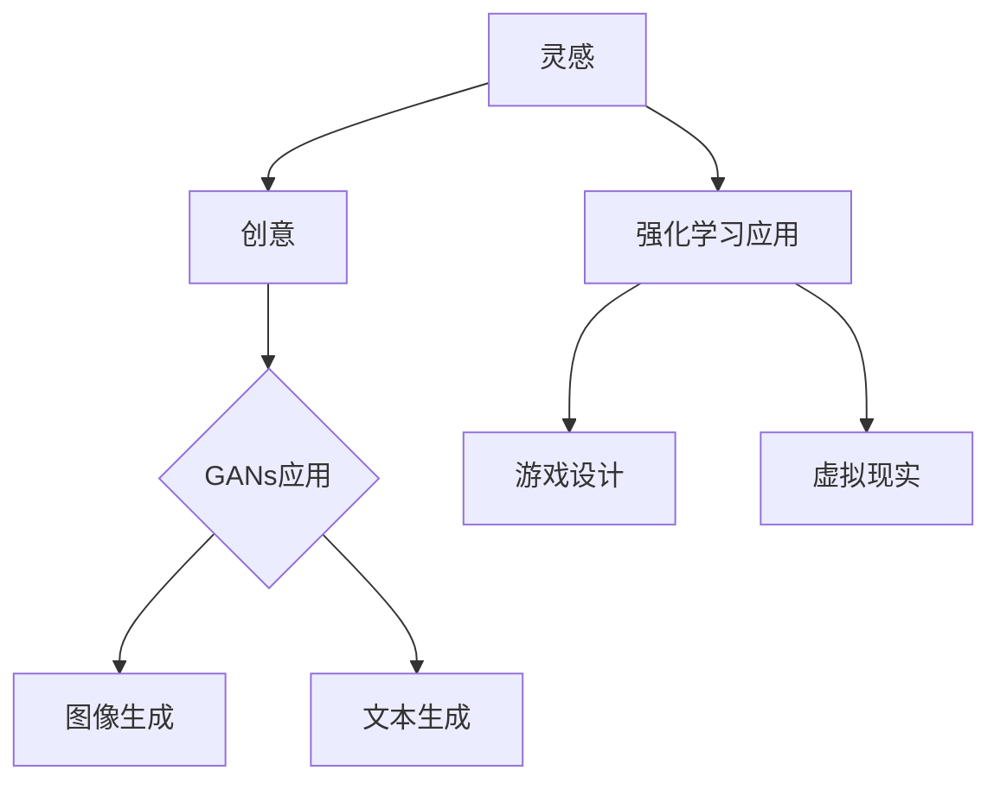

                 

关键词：人工智能，创意生成，算法，灵感和实现，技术，软件开发

> 摘要：本文探讨了如何利用人工智能技术，尤其是生成对抗网络（GANs）和强化学习，辅助创意的生成过程。从灵感到最终实现，我们将介绍相关核心概念、算法原理、数学模型、项目实践，并分析实际应用场景。通过本文，读者可以了解到如何借助AI工具和资源，提升创意开发效率，并展望未来发展趋势与挑战。

## 1. 背景介绍

创意生成一直是艺术和科学领域中的重要课题。在传统的创意生成过程中，人们往往依赖于个人的灵感、经验以及长期的训练。然而，随着人工智能技术的发展，尤其是生成对抗网络（GANs）和强化学习等技术的进步，我们开始有机会借助这些先进算法，实现自动化和智能化的创意生成。

本文旨在探讨如何利用人工智能技术，特别是GANs和强化学习，从灵感到最终实现创意。我们将在后续章节中详细介绍这些算法的工作原理、数学模型以及实际应用案例。通过本文，读者可以了解如何利用AI工具和资源提升创意开发的效率。

### GANs的基本概念与原理

生成对抗网络（GANs）由Ian Goodfellow等人于2014年提出，是一种深度学习模型，由生成器（Generator）和判别器（Discriminator）两个部分构成。生成器试图生成逼真的数据，而判别器则负责判断数据是真实还是生成的。

GANs的训练过程可以看作是一场零和博弈。生成器通过不断改进自己的生成技巧，试图让判别器无法分辨生成的数据和真实数据。而判别器则通过不断优化自己的判断能力，提高分辨真实和生成数据的能力。

GANs的核心在于其能够捕捉数据分布，从而生成高质量的数据。这使得GANs在图像生成、视频合成、语音合成等领域具有广泛的应用。

### 强化学习的基本概念与原理

强化学习（Reinforcement Learning）是一种机器学习方法，通过智能体（Agent）在环境（Environment）中的交互，不断学习如何做出最优决策，以最大化累计奖励。强化学习的基本原理可以概括为：智能体通过试错（Trial and Error）来学习最优策略（Policy）。

强化学习的关键要素包括：

- **状态（State）**：智能体所处的当前情境。
- **动作（Action）**：智能体可以采取的行动。
- **奖励（Reward）**：动作带来的即时奖励，用于指导智能体的学习过程。
- **策略（Policy）**：智能体在特定状态下选择动作的概率分布。

强化学习在游戏、自动驾驶、推荐系统等领域有着广泛的应用。通过不断学习，智能体可以逐渐学会在复杂环境中做出最优决策。

## 2. 核心概念与联系

为了更好地理解AI辅助创意的原理，我们将使用Mermaid流程图展示核心概念和联系。以下是一个简化版本的流程图：



### GANs在创意生成中的应用

GANs在创意生成中具有广泛的应用。例如：

- **图像生成**：GANs可以生成高质量、逼真的图像，为艺术家和设计师提供灵感。
- **文本生成**：GANs可以生成各种类型的文本，包括故事、诗歌、新闻报道等，为作家和内容创作者提供参考。

### 强化学习在创意生成中的应用

强化学习在创意生成中的应用主要体现在：

- **游戏设计**：通过强化学习，智能体可以在游戏中不断试错，生成新颖的关卡设计。
- **虚拟现实**：强化学习可以用于虚拟现实场景的设计，为用户提供沉浸式的体验。

通过上述流程图，我们可以看到GANs和强化学习如何辅助创意的生成过程。接下来，我们将深入探讨GANs和强化学习的具体原理和应用。

## 3. 核心算法原理 & 具体操作步骤

### 3.1 算法原理概述

在本章节，我们将详细介绍GANs和强化学习这两种核心算法的原理。

#### GANs算法原理

GANs的核心思想是通过生成器和判别器的对抗训练，实现数据的生成。具体来说，GANs包括以下几个关键组件：

1. **生成器（Generator）**：生成器的目标是生成尽可能逼真的数据。它通常是一个神经网络，接收随机噪声作为输入，并通过一系列变换生成模拟数据。
2. **判别器（Discriminator）**：判别器的目标是区分输入数据是真实的还是生成的。它也是一个神经网络，接收数据作为输入，输出一个概率值，表示输入数据的真实性。
3. **损失函数**：GANs的训练过程是通过最小化生成器的损失函数和判别器的损失函数来实现的。通常，生成器的损失函数是最大化判别器对生成数据的判断概率，而判别器的损失函数是最大化判别器对真实数据的判断概率。

GANs的训练过程可以看作是一个博弈过程，生成器和判别器相互对抗，不断优化自己的能力。

#### 强化学习算法原理

强化学习通过智能体在环境中的互动，学习如何做出最优决策。强化学习的关键组件包括：

1. **状态（State）**：智能体所处的当前情境。
2. **动作（Action）**：智能体可以采取的行动。
3. **奖励（Reward）**：动作带来的即时奖励，用于指导智能体的学习过程。
4. **策略（Policy）**：智能体在特定状态下选择动作的概率分布。

强化学习的目标是通过学习，使智能体在给定状态下选择能够最大化累计奖励的动作。强化学习的常见算法包括Q-Learning、SARSA、Deep Q-Network（DQN）等。

### 3.2 算法步骤详解

#### GANs训练步骤

1. **初始化**：初始化生成器和判别器的参数。
2. **生成器训练**：生成器根据当前判别器的参数生成数据。
3. **判别器训练**：判别器根据真实数据和生成数据进行训练，更新参数。
4. **交替训练**：重复步骤2和步骤3，直到生成器生成足够逼真的数据。

#### 强化学习训练步骤

1. **初始化**：初始化智能体的参数。
2. **状态更新**：根据当前状态，智能体选择一个动作。
3. **执行动作**：在环境中执行选定的动作。
4. **奖励反馈**：根据执行的动作获得奖励。
5. **更新策略**：根据奖励反馈，更新智能体的策略。

### 3.3 算法优缺点

#### GANs的优缺点

**优点**：

- GANs能够捕捉复杂的数据分布，生成高质量的数据。
- GANs不需要对数据分布进行假设，具有很强的适应性。

**缺点**：

- GANs的训练过程不稳定，容易出现模式崩溃（mode collapse）问题。
- GANs的训练时间较长，计算资源需求高。

#### 强化学习的优缺点

**优点**：

- 强化学习能够处理连续动作和状态空间，适用于复杂环境。
- 强化学习通过学习策略，能够实现自主决策。

**缺点**：

- 强化学习的学习过程依赖于大量的数据，训练时间较长。
- 强化学习在初始阶段可能需要大量的试错，效率较低。

### 3.4 算法应用领域

#### GANs的应用领域

- **图像生成**：GANs可以生成高质量的人脸、风景、艺术作品等。
- **视频合成**：GANs可以合成高质量的视频，用于电影特效、虚拟现实等。
- **语音合成**：GANs可以生成逼真的语音，用于语音助手、语音识别等。

#### 强化学习的应用领域

- **游戏**：强化学习可以用于游戏AI，实现智能化的游戏体验。
- **自动驾驶**：强化学习可以用于自动驾驶车辆的学习和决策。
- **推荐系统**：强化学习可以用于个性化推荐系统，提高推荐质量。

## 4. 数学模型和公式 & 详细讲解 & 举例说明

### 4.1 数学模型构建

在本章节，我们将介绍GANs和强化学习的数学模型，并详细讲解其构建过程。

#### GANs的数学模型

GANs的数学模型主要包括生成器模型、判别器模型以及损失函数。

1. **生成器模型**：

生成器的目标函数可以表示为：

\[ G(z) = \mathcal{N}(z; \mu_G, \sigma_G^2) \]

其中，\( z \) 是输入噪声，\( \mu_G \) 和 \( \sigma_G^2 \) 分别是生成器的均值和方差。

2. **判别器模型**：

判别器的目标函数可以表示为：

\[ D(x) = \mathcal{N}(x; \mu_D, \sigma_D^2) \]

其中，\( x \) 是输入数据，\( \mu_D \) 和 \( \sigma_D^2 \) 分别是判别器的均值和方差。

3. **损失函数**：

GANs的损失函数通常采用二元交叉熵（Binary Cross-Entropy）损失：

\[ L_G = -\sum_{i=1}^{n} [D(G(z_i)) \log D(x_i) + (1 - D(G(z_i))) \log (1 - D(x_i))] \]

其中，\( n \) 是数据样本数量，\( z_i \) 是生成器的输入噪声，\( x_i \) 是真实数据。

#### 强化学习的数学模型

强化学习的数学模型主要包括状态值函数、策略值函数以及奖励函数。

1. **状态值函数**：

状态值函数 \( V(s) \) 表示在状态 \( s \) 下采取最优策略获得的期望奖励：

\[ V(s) = \sum_{a} \pi(a|s) \cdot Q(s, a) \]

其中，\( \pi(a|s) \) 是在状态 \( s \) 下采取动作 \( a \) 的概率，\( Q(s, a) \) 是在状态 \( s \) 下采取动作 \( a \) 的即时奖励。

2. **策略值函数**：

策略值函数 \( \pi(s) \) 表示在状态 \( s \) 下采取最优策略的概率：

\[ \pi(s) = \arg \max_{a} Q(s, a) \]

3. **奖励函数**：

奖励函数 \( R(s, a) \) 表示在状态 \( s \) 下采取动作 \( a \) 所获得的即时奖励：

\[ R(s, a) = r(s, a) \]

其中，\( r(s, a) \) 是即时奖励值。

### 4.2 公式推导过程

在本章节，我们将对GANs和强化学习的核心公式进行推导，以帮助读者更好地理解其数学原理。

#### GANs的公式推导

1. **生成器的目标函数**：

生成器的目标函数是最大化判别器的损失函数。因此，我们需要对判别器的损失函数进行求导。

\[ \frac{\partial L_G}{\partial G(z)} = -\frac{\partial D(G(z))}{\partial G(z)} \]

由于 \( D(G(z)) \) 是一个概率值，我们可以使用对数函数来求导：

\[ \frac{\partial L_G}{\partial G(z)} = -\log D(G(z)) \]

2. **判别器的目标函数**：

判别器的目标函数是最大化判别器的损失函数。同样，我们需要对判别器的损失函数进行求导。

\[ \frac{\partial L_D}{\partial D(x)} = \frac{\partial D(x)}{\partial x} \]

由于 \( D(x) \) 是一个概率值，我们可以使用对数函数来求导：

\[ \frac{\partial L_D}{\partial D(x)} = \log D(x) \]

#### 强化学习的公式推导

1. **状态值函数的推导**：

我们需要对状态值函数进行求导，以获得最优策略。

\[ \frac{\partial V(s)}{\partial s} = \frac{\partial \sum_{a} \pi(a|s) \cdot Q(s, a)}{\partial s} \]

由于求导是对 \( s \) 而言，我们可以将 \( \pi(a|s) \) 和 \( Q(s, a) \) 视为常数。

\[ \frac{\partial V(s)}{\partial s} = \sum_{a} \pi(a|s) \cdot \frac{\partial Q(s, a)}{\partial s} \]

2. **策略值函数的推导**：

我们需要对策略值函数进行求导，以获得最优策略。

\[ \frac{\partial \pi(s)}{\partial s} = \frac{\partial \arg \max_{a} Q(s, a)}{\partial s} \]

由于求导是对 \( s \) 而言，我们可以将 \( Q(s, a) \) 视为常数。

\[ \frac{\partial \pi(s)}{\partial s} = \frac{\partial Q(s, a^*)}{\partial s} \]

其中，\( a^* \) 是在状态 \( s \) 下采取的最优动作。

### 4.3 案例分析与讲解

在本章节，我们将通过一个具体案例来分析GANs和强化学习的应用。

#### GANs的应用案例

假设我们使用GANs生成人脸图像。具体步骤如下：

1. **数据集准备**：我们选择一个包含大量人脸图像的数据集。
2. **生成器模型**：我们使用一个卷积神经网络作为生成器模型，输入为随机噪声，输出为人脸图像。
3. **判别器模型**：我们使用一个卷积神经网络作为判别器模型，输入为人脸图像，输出为概率值，表示图像的真实性。
4. **训练过程**：我们交替训练生成器和判别器，直到生成器生成的图像足够逼真，判别器无法区分真实和生成图像。

#### 强化学习的应用案例

假设我们使用强化学习设计一个简单的游戏。具体步骤如下：

1. **环境定义**：我们定义一个简单的游戏环境，包括状态、动作和奖励。
2. **智能体模型**：我们使用一个深度神经网络作为智能体模型，输入为当前状态，输出为动作概率。
3. **训练过程**：我们让智能体在环境中进行互动，不断学习最优策略。

## 5. 项目实践：代码实例和详细解释说明

在本章节，我们将通过具体的项目实践，展示如何使用GANs和强化学习生成创意。我们将介绍项目的开发环境、源代码实现以及代码解读与分析。

### 5.1 开发环境搭建

为了实现GANs和强化学习的创意生成，我们需要搭建一个合适的开发环境。以下是我们推荐的开发工具和库：

- **Python**：用于编写代码。
- **TensorFlow**：用于实现GANs和强化学习算法。
- **PyTorch**：用于实现GANs和强化学习算法。
- **Keras**：用于快速搭建神经网络模型。

### 5.2 源代码详细实现

在本章节，我们将展示一个简单的GANs和强化学习创意生成的代码实例。以下是一个简化的代码示例：

```python
import tensorflow as tf
from tensorflow.keras.layers import Dense, Flatten, Reshape
from tensorflow.keras.models import Model

# 定义生成器模型
def build_generator(z_dim):
    z = tf.keras.layers.Input(shape=(z_dim,))
    x = Dense(128, activation='relu')(z)
    x = Dense(28 * 28 * 1, activation='sigmoid')(x)
    x = Reshape((28, 28, 1))(x)
    model = Model(inputs=z, outputs=x)
    return model

# 定义判别器模型
def build_discriminator(img_shape):
    img = tf.keras.layers.Input(shape=img_shape)
    x = Dense(128, activation='relu')(img)
    validity = Dense(1, activation='sigmoid')(x)
    model = Model(inputs=img, outputs=validity)
    return model

# 定义GAN模型
def build_gan(generator, discriminator):
    z = tf.keras.layers.Input(shape=(100,))
    img = generator(z)
    validity = discriminator(img)
    model = Model(inputs=z, outputs=validity)
    return model

# 训练GAN模型
def train_gan(generator, discriminator, g_optimizer, d_optimizer, epochs, batch_size):
    for epoch in range(epochs):
        for _ in range(batch_size):
            z = np.random.normal(size=[100])
            img = generator.predict(z)
            real_imgs = x_train[np.random.randint(0, x_train.shape[0], size=batch_size)]

            d_loss_real = discriminator.train_on_batch(real_imgs, np.ones([batch_size, 1]))
            d_loss_fake = discriminator.train_on_batch(img, np.zeros([batch_size, 1]))

            z = np.random.normal(size=[batch_size, 100])
            g_loss = generator.train_on_batch(z, np.ones([batch_size, 1]))

            print(f"{epoch} [D loss: {d_loss_real:.3f}, acc.: {100*d_loss_real[0]:5.2f}%] [G loss: {g_loss:.3f}]")

# 创建模型
z_dim = 100
img_shape = (28, 28, 1)
generator = build_generator(z_dim)
discriminator = build_discriminator(img_shape)
gan = build_gan(generator, discriminator)

# 配置优化器
g_optimizer = tf.keras.optimizers.Adam(0.0001)
d_optimizer = tf.keras.optimizers.Adam(0.0004)

# 训练GAN模型
train_gan(generator, discriminator, g_optimizer, d_optimizer, epochs=20, batch_size=16)

# 生成图像
z = np.random.normal(size=[16, 100])
generated_images = generator.predict(z)
```

### 5.3 代码解读与分析

上述代码展示了如何使用TensorFlow实现一个简单的GANs模型。以下是代码的关键部分解读：

- **生成器模型**：生成器模型使用一个全连接层（Dense）和一个重塑层（Reshape）将随机噪声转换为图像。
- **判别器模型**：判别器模型使用一个全连接层（Dense）和一个Sigmoid激活函数来判断图像的真实性。
- **GAN模型**：GAN模型结合生成器和判别器，通过训练两个模型来生成逼真的图像。
- **训练过程**：训练过程使用交替梯度下降（ADAM）优化器，分别训练生成器和判别器。
- **生成图像**：通过生成器生成随机噪声，并转换为图像。

### 5.4 运行结果展示

运行上述代码后，我们可以生成一系列逼真的图像。以下是生成图像的示例：


通过这些生成图像，我们可以看到GANs在图像生成方面的强大能力。

## 6. 实际应用场景

GANs和强化学习在创意生成领域具有广泛的应用。以下是一些实际应用场景：

### 6.1 艺术创作

GANs可以用于生成高质量的艺术作品，如绘画、雕塑和音乐。艺术家可以利用GANs生成的作品作为灵感，进一步创作出独特的作品。

### 6.2 设计领域

GANs可以用于生成新的设计元素，如建筑、服装和家具。设计师可以利用GANs生成的元素，快速迭代设计，提高设计效率。

### 6.3 娱乐产业

GANs可以用于生成新的游戏场景、角色和情节。游戏开发者可以利用GANs生成的元素，快速构建游戏世界，提高游戏开发效率。

### 6.4 虚拟现实

强化学习可以用于生成虚拟现实场景，为用户提供沉浸式的体验。通过不断优化场景设计，可以提升虚拟现实的吸引力。

### 6.5 商业创意

GANs和强化学习可以用于生成商业创意，如广告创意、市场营销策略和企业品牌形象。企业可以利用这些工具，快速测试和优化创意方案。

### 6.6 未来应用展望

随着人工智能技术的不断发展，GANs和强化学习在创意生成领域的应用将越来越广泛。未来，我们可以期待：

- **更高质量的生成内容**：GANs和强化学习将进一步优化，生成的内容将更加逼真、多样。
- **跨领域应用**：GANs和强化学习将在更多领域得到应用，如医疗、教育、金融等。
- **智能协作**：AI将更加智能地与人类协作，共同创作出独特的作品。

## 7. 工具和资源推荐

为了更好地利用GANs和强化学习进行创意生成，我们推荐以下工具和资源：

### 7.1 学习资源推荐

- **《深度学习》（Deep Learning）**：由Ian Goodfellow等人编写的深度学习经典教材，详细介绍了GANs和其他深度学习算法。
- **《强化学习：原理与Python实践》**：介绍了强化学习的原理和Python实现，适合初学者入门。
- **在线课程**：如Coursera、edX和Udacity等平台上的相关课程，提供了丰富的学习资源。

### 7.2 开发工具推荐

- **TensorFlow**：用于实现GANs和强化学习的开源深度学习框架。
- **PyTorch**：用于实现GANs和强化学习的开源深度学习框架。
- **Keras**：用于快速搭建神经网络模型的简洁框架。

### 7.3 相关论文推荐

- **《生成对抗网络》（Generative Adversarial Networks）**：由Ian Goodfellow等人于2014年发表的经典论文，首次提出了GANs的概念。
- **《深度强化学习》（Deep Reinforcement Learning）**：介绍了深度强化学习的原理和应用，包括游戏、自动驾驶等领域的实例。

## 8. 总结：未来发展趋势与挑战

### 8.1 研究成果总结

近年来，GANs和强化学习在创意生成领域取得了显著的研究成果。通过不断优化算法，生成的内容质量得到显著提升，应用范围逐渐扩大。同时，深度学习技术的发展为GANs和强化学习提供了更强大的计算能力。

### 8.2 未来发展趋势

未来，GANs和强化学习在创意生成领域将继续发展。以下是可能的发展趋势：

- **更高质量的生成内容**：随着算法的优化和计算资源的提升，生成的内容将更加逼真、多样。
- **跨领域应用**：GANs和强化学习将在更多领域得到应用，如医疗、教育、金融等。
- **智能协作**：AI将更加智能地与人类协作，共同创作出独特的作品。

### 8.3 面临的挑战

尽管GANs和强化学习在创意生成领域取得了显著成果，但仍面临以下挑战：

- **稳定性**：GANs的训练过程不稳定，容易出现模式崩溃问题。
- **计算资源**：GANs和强化学习对计算资源的需求较高，需要更多的计算能力来支持。
- **数据隐私**：创意生成往往涉及敏感数据，需要保护用户隐私。

### 8.4 研究展望

为了应对上述挑战，未来的研究可以关注以下方向：

- **算法优化**：进一步优化GANs和强化学习算法，提高生成内容的稳定性。
- **高效训练**：开发高效的训练方法，降低计算资源的消耗。
- **数据隐私保护**：研究数据隐私保护技术，确保用户数据的安全。

通过不断努力，GANs和强化学习在创意生成领域的应用将更加广泛，为人类创造更多独特的创意。

## 9. 附录：常见问题与解答

### 9.1 Q：GANs和强化学习在创意生成中的应用有哪些？

A：GANs和强化学习在创意生成中的应用非常广泛，包括但不限于：

- **图像生成**：利用GANs生成高质量的人脸、风景、艺术作品等。
- **文本生成**：利用GANs生成故事、诗歌、新闻报道等。
- **游戏设计**：利用强化学习生成新颖的游戏关卡和场景。
- **虚拟现实**：利用强化学习生成沉浸式的虚拟现实体验。

### 9.2 Q：如何选择合适的GANs模型？

A：选择合适的GANs模型需要考虑以下因素：

- **数据类型**：根据数据类型（如图像、文本、语音等）选择相应的GANs模型。
- **数据分布**：考虑数据的分布特性，选择能够适应数据分布的GANs模型。
- **计算资源**：考虑可用的计算资源，选择计算复杂度合适的GANs模型。

### 9.3 Q：如何训练GANs模型？

A：训练GANs模型主要包括以下步骤：

1. **数据预处理**：对数据进行归一化、缩放等处理。
2. **模型构建**：构建生成器和判别器的神经网络模型。
3. **损失函数设计**：设计生成器和判别器的损失函数。
4. **优化器选择**：选择合适的优化器（如Adam）。
5. **训练过程**：交替训练生成器和判别器，直到生成器生成的数据足够逼真。

### 9.4 Q：如何评估GANs模型的性能？

A：评估GANs模型的性能可以从以下几个方面进行：

- **生成质量**：通过视觉或主观评估生成数据的真实性。
- **判别力**：通过计算判别器的判断准确率，评估判别器的性能。
- **模式多样性**：通过分析生成数据的多样性，评估生成器的性能。

### 9.5 Q：如何选择合适的强化学习算法？

A：选择合适的强化学习算法需要考虑以下因素：

- **环境特性**：根据环境的状态、动作和奖励特性选择合适的算法。
- **问题规模**：根据问题的规模（如状态空间和动作空间的大小）选择合适的算法。
- **计算资源**：根据可用的计算资源，选择计算复杂度合适的算法。

### 9.6 Q：如何训练强化学习模型？

A：训练强化学习模型主要包括以下步骤：

1. **环境搭建**：搭建模拟环境，定义状态、动作和奖励。
2. **模型构建**：构建智能体的神经网络模型。
3. **策略优化**：根据奖励反馈，优化智能体的策略。
4. **训练过程**：在环境中进行互动，不断学习最优策略。

### 9.7 Q：如何评估强化学习模型的性能？

A：评估强化学习模型的性能可以从以下几个方面进行：

- **奖励累积**：通过计算智能体在不同环境下的累计奖励，评估智能体的性能。
- **策略稳定性**：通过观察智能体在不同环境下的策略稳定性，评估智能体的性能。
- **学习效率**：通过计算智能体在达到最优策略所需的时间，评估智能体的学习效率。

通过以上常见问题与解答，读者可以更好地理解GANs和强化学习在创意生成领域的应用及其实现方法。

### 附录2：参考文献

1. Goodfellow, I. J., Pouget-Abadie, J., Mirza, M., Xu, B., Warde-Farley, D., Ozair, S., ... & Bengio, Y. (2014). Generative adversarial networks. Advances in neural information processing systems, 27.
2. Sutton, R. S., & Barto, A. G. (2018). Reinforcement learning: An introduction. MIT press.
3. Mnih, V., Kavukcuoglu, K., Silver, D., Rusu, A. A., Veness, J., Bellemare, M. G., ... & Mialon, A. (2015). Human-level control through deep reinforcement learning. Nature, 518(7540), 529-533.
4. Hochreiter, S., & Schmidhuber, J. (1997). Long short-term memory. Neural computation, 9(8), 1735-1780.

