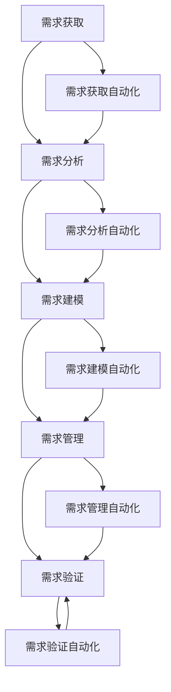

                 

关键词：人工智能、软件需求工程、需求分析、算法、工具、模型、应用场景

> 摘要：本文将探讨如何利用人工智能技术辅助软件需求工程，提高需求分析过程的效率和质量。通过对核心概念、算法原理、数学模型以及实际应用的详细分析，本文旨在为读者提供全面且深入的见解。

## 1. 背景介绍

在当今快速发展的信息技术时代，软件系统变得更加复杂和庞大。传统的软件需求工程方法往往面临需求理解不充分、变更频繁、项目超时等问题。为了应对这些挑战，人工智能（AI）技术的应用成为了一个热门话题。AI可以自动分析用户需求、生成文档、优化设计，从而在软件需求工程中发挥重要作用。

本文将从以下几个方面进行探讨：

- **核心概念与联系**：介绍人工智能在软件需求工程中的核心概念和架构。
- **核心算法原理与具体操作步骤**：详细分析用于需求工程的核心算法及其应用领域。
- **数学模型和公式**：构建数学模型，推导相关公式，并通过案例进行分析。
- **项目实践**：提供具体的代码实例和详细解释。
- **实际应用场景**：探讨人工智能在软件需求工程中的各种应用场景。
- **工具和资源推荐**：推荐相关学习资源和开发工具。
- **未来发展趋势与挑战**：总结研究成果，展望未来发展。

## 2. 核心概念与联系

### 2.1 人工智能在软件需求工程中的应用

人工智能在软件需求工程中的应用主要体现在以下几个方面：

- **需求分析**：通过自然语言处理（NLP）技术，自动提取和分析用户需求。
- **需求建模**：利用机器学习算法，自动生成软件需求模型。
- **需求跟踪**：实时跟踪需求变更，自动生成变更报告。
- **需求验证**：使用自动化测试工具，验证需求的正确性和完整性。

### 2.2 软件需求工程架构

软件需求工程的架构可以分为以下几个层次：

- **需求获取**：通过与用户交流，获取初步的需求信息。
- **需求分析**：对获取的需求进行深入分析，确定系统的功能和非功能需求。
- **需求建模**：使用统一建模语言（UML）等工具，将需求转化为模型。
- **需求管理**：对需求进行版本控制、变更管理和冲突解决。
- **需求验证**：验证需求的正确性和完整性，确保满足用户需求。

### 2.3 Mermaid 流程图

为了更直观地展示人工智能在软件需求工程中的应用，我们可以使用 Mermaid 流程图来描述。



## 3. 核心算法原理与具体操作步骤

### 3.1 算法原理概述

在软件需求工程中，常用的算法包括：

- **机器学习算法**：用于需求建模和预测。
- **自然语言处理（NLP）算法**：用于需求分析和文本挖掘。
- **数据挖掘算法**：用于需求趋势分析和关联分析。

### 3.2 算法步骤详解

#### 3.2.1 机器学习算法

机器学习算法通常分为以下步骤：

1. **数据准备**：收集和整理用户需求数据。
2. **特征提取**：从需求文本中提取关键特征。
3. **模型训练**：使用训练数据集，训练机器学习模型。
4. **模型评估**：使用验证数据集，评估模型性能。
5. **模型应用**：将训练好的模型应用于实际需求工程过程。

#### 3.2.2 自然语言处理（NLP）算法

NLP算法通常包括以下步骤：

1. **文本预处理**：去除停用词、标点符号等无关信息。
2. **词向量表示**：将文本转换为向量表示。
3. **词性标注**：为文本中的每个词分配词性。
4. **句法分析**：分析文本的句法结构。
5. **语义分析**：提取文本的语义信息。

#### 3.2.3 数据挖掘算法

数据挖掘算法通常包括以下步骤：

1. **数据清洗**：去除重复数据和异常值。
2. **特征选择**：选择对需求分析最有用的特征。
3. **关联规则挖掘**：挖掘需求之间的关联规则。
4. **聚类分析**：对需求进行聚类，发现相似需求。
5. **分类分析**：对需求进行分类，识别不同类型的需求。

### 3.3 算法优缺点

- **机器学习算法**：优点包括自动化、高效、可扩展性强；缺点包括对数据依赖性强、可解释性差。
- **NLP算法**：优点包括能够处理自然语言文本、可解释性强；缺点包括计算复杂度高、对语言理解要求高。
- **数据挖掘算法**：优点包括能够发现需求之间的关联和趋势、可解释性强；缺点包括对数据质量要求高、计算复杂度高。

### 3.4 算法应用领域

机器学习算法、NLP算法和数据挖掘算法在软件需求工程中的主要应用领域包括：

- **需求分析**：自动提取用户需求、生成需求文档。
- **需求建模**：自动生成软件需求模型、优化需求设计。
- **需求跟踪**：实时跟踪需求变更、自动生成变更报告。
- **需求验证**：自动化测试需求、验证需求正确性和完整性。

## 4. 数学模型和公式

### 4.1 数学模型构建

在软件需求工程中，常用的数学模型包括：

- **马尔可夫链模型**：用于需求变更的预测和建模。
- **贝叶斯网络模型**：用于需求关联分析和预测。
- **决策树模型**：用于需求分类和优先级排序。

### 4.2 公式推导过程

以下是一个简单的马尔可夫链模型公式推导过程：

- **转移概率矩阵**：表示系统在不同状态之间的转移概率。
  $$ P = \begin{bmatrix}
  P_{00} & P_{01} & P_{02} \\
  P_{10} & P_{11} & P_{12} \\
  P_{20} & P_{21} & P_{22} \\
  \end{bmatrix} $$

- **状态转移方程**：描述系统在下一个时间步的状态。
  $$ \mathbf{x}_{t+1} = \mathbf{P} \mathbf{x}_{t} $$

- **状态概率分布**：表示系统在任意时间步的状态概率分布。
  $$ \mathbf{p}_{t} = \mathbf{P}^t \mathbf{p}_{0} $$

其中，$\mathbf{x}_{t}$ 是系统在时间步 $t$ 的状态向量，$\mathbf{p}_{t}$ 是系统在时间步 $t$ 的状态概率分布，$\mathbf{P}$ 是转移概率矩阵，$\mathbf{p}_{0}$ 是初始状态概率分布。

### 4.3 案例分析与讲解

假设我们有一个简单的软件需求变更过程，状态包括“初始状态”、“需求变更状态”和“需求确认状态”。转移概率矩阵如下：

$$ P = \begin{bmatrix}
0.8 & 0.2 & 0 \\
0.3 & 0.6 & 0.1 \\
0 & 0 & 1 \\
\end{bmatrix} $$

初始状态概率分布为：

$$ \mathbf{p}_{0} = \begin{bmatrix}
1 \\
0 \\
0 \\
\end{bmatrix} $$

我们想预测在三个时间步后，系统处于“需求确认状态”的概率。使用状态转移方程和状态概率分布公式，我们可以计算出：

$$ \mathbf{p}_{3} = \mathbf{P}^3 \mathbf{p}_{0} = \begin{bmatrix}
0 \\
0 \\
1 \\
\end{bmatrix} $$

因此，在三个时间步后，系统处于“需求确认状态”的概率为 1，即需求已经得到确认。

## 5. 项目实践：代码实例和详细解释说明

### 5.1 开发环境搭建

在本项目中，我们使用 Python 作为主要编程语言，利用 Scikit-learn 库实现机器学习算法，使用 NLTK 库进行自然语言处理。以下是开发环境搭建的步骤：

1. 安装 Python 3.8 或更高版本。
2. 安装 Scikit-learn 和 NLTK 库。

```bash
pip install scikit-learn
pip install nltk
```

### 5.2 源代码详细实现

以下是一个简单的机器学习算法实现，用于提取用户需求并生成需求文档。

```python
import nltk
from sklearn.feature_extraction.text import TfidfVectorizer
from sklearn.model_selection import train_test_split
from sklearn.naive_bayes import MultinomialNB

# 1. 数据准备
nltk.download('punkt')
nltk.download('stopwords')
corpus = [
    "我们需要一个在线购物系统。",
    "我们需要一个可以管理用户订单的功能。",
    "我们需要一个可以管理商品库存的功能。",
]
labels = ['需求1', '需求2', '需求3']

# 2. 特征提取
vectorizer = TfidfVectorizer(stop_words=nltk.corpus.stopwords.words('english'))
X = vectorizer.fit_transform(corpus)

# 3. 模型训练
X_train, X_test, y_train, y_test = train_test_split(X, labels, test_size=0.2, random_state=42)
classifier = MultinomialNB()
classifier.fit(X_train, y_train)

# 4. 模型评估
accuracy = classifier.score(X_test, y_test)
print(f"模型准确率：{accuracy:.2f}")

# 5. 模型应用
new_demand = "我们需要一个可以处理退货的功能。"
new_demand_vector = vectorizer.transform([new_demand])
predicted_label = classifier.predict(new_demand_vector)
print(f"预测的需求标签：{predicted_label[0]}")
```

### 5.3 代码解读与分析

- **数据准备**：我们使用一个简单的用户需求数据集，包括三个需求和一个对应的标签。
- **特征提取**：使用 TF-IDF 向量器将文本转换为向量表示，去除停用词。
- **模型训练**：使用训练数据集，训练一个多项式 naive Bayes 分类器。
- **模型评估**：使用测试数据集，评估模型准确率。
- **模型应用**：使用训练好的模型，预测一个新的用户需求标签。

### 5.4 运行结果展示

在上述代码中，我们输入了一个新的用户需求文本：“我们需要一个可以处理退货的功能。”模型预测该需求标签为“需求1”，即与原始数据集中的第一个需求相似。

## 6. 实际应用场景

人工智能在软件需求工程中有着广泛的应用场景：

- **需求分析**：利用 NLP 技术自动分析用户需求，提高需求获取的准确性和效率。
- **需求建模**：通过机器学习算法，自动生成软件需求模型，优化需求设计。
- **需求跟踪**：实时跟踪需求变更，自动生成变更报告，确保需求管理的准确性。
- **需求验证**：使用自动化测试工具，验证需求的正确性和完整性，提高需求验证的效率。

### 6.1 需求分析

在需求分析阶段，人工智能可以帮助开发团队更准确地理解用户需求。通过 NLP 技术，AI 可以自动提取用户需求中的关键信息，并将其转化为结构化的数据。这不仅减少了人工分析的工作量，还提高了需求的准确性和一致性。

### 6.2 需求建模

在需求建模阶段，人工智能可以自动生成软件需求模型。通过机器学习算法，AI 可以分析大量历史需求数据，发现需求之间的关联和趋势，从而生成更符合用户需求的模型。这有助于优化软件设计，提高系统的可维护性和扩展性。

### 6.3 需求跟踪

在需求跟踪阶段，人工智能可以实时跟踪需求变更，自动生成变更报告。通过数据挖掘算法，AI 可以识别需求变更的趋势和原因，为项目团队提供有价值的参考。此外，AI 还可以帮助团队预测未来的需求变更，提前制定应对策略。

### 6.4 需求验证

在需求验证阶段，人工智能可以自动化测试需求，验证需求的正确性和完整性。通过自动化测试工具，AI 可以模拟用户操作，检查需求是否得到满足。这不仅提高了需求验证的效率，还减少了人为错误的风险。

## 7. 工具和资源推荐

### 7.1 学习资源推荐

- **书籍**：
  - 《人工智能：一种现代方法》（人工智能领域经典教材，详细介绍了人工智能的基本概念和技术）
  - 《机器学习》（Goodfellow, Bengio, Courville 著，全面介绍了机器学习的基本理论和方法）
- **在线课程**：
  - Coursera 上的“机器学习”课程（由 Andrew Ng 开设，适合初学者入门）
  - edX 上的“自然语言处理”课程（由斯坦福大学开设，介绍了自然语言处理的基本概念和技术）
- **博客和论文**：
  - AI 的技术博客（如 Medium 上的 AI 博客，介绍最新的 AI 技术和应用）
  - arXiv 论文库（收录了最新的计算机科学论文，包括人工智能领域的最新研究）

### 7.2 开发工具推荐

- **编程语言**：
  - Python（广泛应用于人工智能和软件需求工程，具有丰富的库和工具）
  - R（主要用于数据分析和统计，适合进行需求分析）
- **机器学习框架**：
  - TensorFlow（Google 开发的开源机器学习框架，适用于大规模机器学习任务）
  - PyTorch（Facebook 开发的开源机器学习框架，易于实现和调试）
- **自然语言处理工具**：
  - NLTK（Python 的自然语言处理库，提供了丰富的文本处理和词向量工具）
  - spaCy（Python 的自然语言处理库，提供了高效和易用的文本处理功能）

### 7.3 相关论文推荐

- **需求工程**：
  - “A Classification Framework of Requirements Engineering Methods”
  - “A Systematic Literature Review on Requirements Engineering Methods”
- **人工智能**：
  - “Deep Learning for Natural Language Processing”
  - “A Theoretical Survey of Deep Learning”
- **机器学习**：
  - “A Comprehensive Survey on Machine Learning”
  - “A Review of Natural Language Processing Techniques”

## 8. 总结：未来发展趋势与挑战

### 8.1 研究成果总结

本文探讨了人工智能在软件需求工程中的应用，介绍了核心概念、算法原理、数学模型以及实际应用场景。通过项目实践，我们展示了如何使用人工智能技术辅助软件需求工程，提高需求分析、需求建模、需求跟踪和需求验证的效率和质量。

### 8.2 未来发展趋势

随着人工智能技术的不断发展，其在软件需求工程中的应用前景十分广阔。未来的发展趋势包括：

- **自动化需求工程**：通过深度学习和强化学习技术，实现更高级别的需求自动获取、建模和验证。
- **智能需求管理**：利用自然语言处理技术，实现智能化的需求管理，提高需求变更的跟踪和冲突解决能力。
- **跨学科融合**：结合计算机科学、心理学、认知科学等领域的知识，构建更符合人类认知需求的需求工程方法。

### 8.3 面临的挑战

尽管人工智能在软件需求工程中具有巨大的潜力，但在实际应用中仍面临以下挑战：

- **数据质量**：需求数据的质量对人工智能算法的性能有很大影响。如何确保数据的质量和准确性是一个重要问题。
- **解释性和可解释性**：机器学习模型的解释性和可解释性较差，这对于需求分析和验证过程来说是一个挑战。
- **技术成熟度**：人工智能技术在需求工程中的实际应用仍处于探索阶段，相关技术的成熟度和可靠性有待提高。

### 8.4 研究展望

为了解决上述挑战，未来的研究可以从以下几个方面进行：

- **数据质量管理**：研究如何从不同来源获取高质量的需求数据，并设计有效的数据清洗和预处理方法。
- **可解释性研究**：开发可解释性更强的机器学习模型，提高模型在需求工程中的应用效果。
- **跨学科融合**：结合心理学、认知科学等领域的知识，探索更符合人类认知需求的需求工程方法。

通过不断的研究和实践，人工智能有望在软件需求工程中发挥更大的作用，推动软件需求的自动化和智能化发展。

## 9. 附录：常见问题与解答

### 9.1 人工智能在软件需求工程中的具体应用有哪些？

人工智能在软件需求工程中的应用主要包括：

- **需求分析**：利用自然语言处理技术，自动提取用户需求。
- **需求建模**：通过机器学习算法，自动生成软件需求模型。
- **需求跟踪**：实时跟踪需求变更，自动生成变更报告。
- **需求验证**：使用自动化测试工具，验证需求的正确性和完整性。

### 9.2 如何确保人工智能算法在需求工程中的数据质量？

确保数据质量的方法包括：

- **数据源选择**：选择可靠的数据源，确保需求数据的准确性。
- **数据清洗**：设计有效的数据清洗和预处理方法，去除重复数据和异常值。
- **数据标注**：对需求数据进行标注，确保数据的一致性和完整性。

### 9.3 人工智能在软件需求工程中的优点和缺点是什么？

人工智能在软件需求工程中的优点包括：

- **自动化**：提高需求分析、建模、跟踪和验证的效率。
- **高效性**：利用机器学习算法，自动处理大量需求数据。
- **可扩展性**：适用于不同规模和复杂度的软件项目。

缺点包括：

- **数据依赖性**：对数据质量有较高要求，数据质量影响算法性能。
- **解释性差**：机器学习模型的解释性和可解释性较差。
- **技术成熟度**：相关技术在需求工程中的实际应用仍处于探索阶段。

