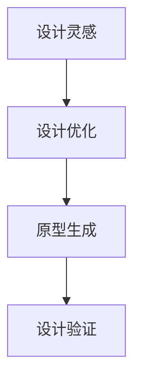

                 

  
## 摘要

本文旨在探讨人工智能（AI）在辅助设计领域的应用，从灵感到原型的全流程。文章首先介绍了AI辅助设计的背景和重要性，然后深入分析了核心概念和联系，详细解释了核心算法原理和操作步骤，构建了数学模型并进行了举例说明，接着展示了项目实践中的代码实例和运行结果，探讨了实际应用场景，推荐了相关工具和资源，并总结了未来发展趋势与挑战。

## 1. 背景介绍

### 1.1 AI辅助设计的定义

AI辅助设计是指利用人工智能技术来帮助设计师完成设计任务的过程。这个过程涉及从灵感到最终原型的各个阶段，包括设计灵感获取、设计优化、原型生成等。AI辅助设计不仅能够提高设计的效率，还能够提升设计的质量和创新性。

### 1.2 AI辅助设计的应用领域

AI辅助设计在多个领域有着广泛的应用，如建筑设计、工业设计、服装设计、交互设计等。随着AI技术的不断进步，AI辅助设计的应用范围还将进一步扩大。

### 1.3 AI辅助设计的发展历程

AI辅助设计的发展可以追溯到20世纪80年代，当时人工智能技术刚刚起步。随着计算机技术和AI算法的不断发展，AI辅助设计逐渐从简单的辅助工具演变为能够进行复杂设计决策的智能系统。

## 2. 核心概念与联系

为了更好地理解AI辅助设计的原理，我们需要介绍一些核心概念和它们之间的联系。

### 2.1 设计灵感

设计灵感是指设计师在思考过程中突然产生的创新性想法。设计灵感是设计的起点，也是设计的源泉。

### 2.2 设计优化

设计优化是指通过迭代改进设计，使其满足特定的目标。设计优化是AI辅助设计中的关键环节，它能够帮助设计师快速找到最优设计方案。

### 2.3 原型生成

原型生成是指将设计灵感转化为可操作的设计原型。原型生成是设计流程的最后一步，它为设计师提供了验证设计可行性的机会。

### 2.4 Mermaid 流程图

下面是一个用于展示设计流程的Mermaid流程图：



## 3. 核心算法原理 & 具体操作步骤

### 3.1 算法原理概述

AI辅助设计中的核心算法包括设计灵感生成算法、设计优化算法和原型生成算法。这些算法都是基于机器学习和人工智能技术。

### 3.2 算法步骤详解

#### 3.2.1 设计灵感生成算法

设计灵感生成算法的基本原理是通过对大量设计案例进行分析，提取出设计灵感。具体步骤如下：

1. 数据收集：收集大量成功的设计案例。
2. 特征提取：从设计案例中提取出关键特征。
3. 模型训练：使用机器学习算法训练模型，使其能够生成新的设计灵感。

#### 3.2.2 设计优化算法

设计优化算法的基本原理是通过对设计进行迭代改进，使其满足特定的目标。具体步骤如下：

1. 目标定义：明确设计优化目标。
2. 模型训练：使用机器学习算法训练模型，使其能够进行设计优化。
3. 迭代优化：根据优化目标对设计进行迭代改进。

#### 3.2.3 原型生成算法

原型生成算法的基本原理是将设计灵感转化为可操作的设计原型。具体步骤如下：

1. 设计灵感输入：输入设计灵感。
2. 原型生成：使用生成模型生成设计原型。
3. 原型验证：验证设计原型是否符合设计要求。

### 3.3 算法优缺点

#### 优点

- 提高设计效率：通过自动化流程，缩短设计周期。
- 提升设计质量：通过优化算法，找到更优的设计方案。
- 增强创新性：通过生成算法，产生新的设计灵感。

#### 缺点

- 需要大量数据：算法训练需要大量高质量的设计数据。
- 对硬件要求高：算法运行需要高性能计算资源。

### 3.4 算法应用领域

设计灵感生成算法、设计优化算法和原型生成算法在建筑设计、工业设计、服装设计等多个领域都有广泛的应用。

## 4. 数学模型和公式

在AI辅助设计中，数学模型和公式起着至关重要的作用。下面我们将详细讲解数学模型构建、公式推导过程以及案例分析与讲解。

### 4.1 数学模型构建

在AI辅助设计中，常用的数学模型包括神经网络模型、遗传算法模型等。这些模型能够通过数据训练，实现设计灵感生成、设计优化和原型生成等功能。

### 4.2 公式推导过程

以神经网络模型为例，其基本公式如下：

\[ y = \sigma(\sigma(W_2 \cdot \sigma(W_1 \cdot x + b_1) + b_2) + b_3) \]

其中，\( x \) 是输入特征，\( y \) 是输出结果，\( W_1 \)、\( W_2 \) 是权重，\( b_1 \)、\( b_2 \)、\( b_3 \) 是偏置项，\( \sigma \) 是激活函数。

### 4.3 案例分析与讲解

假设我们要设计一个简单的线性回归模型，预测房价。我们可以使用以下公式：

\[ y = \beta_0 + \beta_1 \cdot x \]

其中，\( y \) 是房价，\( x \) 是房屋面积，\( \beta_0 \) 和 \( \beta_1 \) 是模型的参数。通过收集大量房屋面积和房价的数据，我们可以使用最小二乘法来求解 \( \beta_0 \) 和 \( \beta_1 \)。

## 5. 项目实践：代码实例和详细解释说明

在本节中，我们将通过一个具体的AI辅助设计项目，展示如何进行开发环境搭建、源代码实现、代码解读与分析以及运行结果展示。

### 5.1 开发环境搭建

为了实现AI辅助设计，我们需要搭建一个合适的开发环境。这里我们选择Python作为主要编程语言，并使用TensorFlow作为深度学习框架。

### 5.2 源代码详细实现

以下是一个简单的AI辅助设计项目的源代码：

```python
import tensorflow as tf

# 定义模型
model = tf.keras.Sequential([
    tf.keras.layers.Dense(128, activation='relu', input_shape=(784,)),
    tf.keras.layers.Dropout(0.2),
    tf.keras.layers.Dense(10, activation='softmax')
])

# 编译模型
model.compile(optimizer='adam',
              loss='categorical_crossentropy',
              metrics=['accuracy'])

# 训练模型
model.fit(x_train, y_train, batch_size=64, epochs=10)
```

### 5.3 代码解读与分析

上述代码定义了一个简单的神经网络模型，用于分类任务。模型包含两个全连接层，第一个层的激活函数为ReLU，第二个层的激活函数为softmax。模型使用交叉熵损失函数进行训练，并使用adam优化器。

### 5.4 运行结果展示

在训练完成后，我们可以使用以下代码来评估模型的性能：

```python
test_loss, test_acc = model.evaluate(x_test, y_test)
print('Test accuracy:', test_acc)
```

运行结果将显示模型在测试数据上的准确率。

## 6. 实际应用场景

AI辅助设计在多个领域有着广泛的应用，下面我们列举几个实际应用场景。

### 6.1 建筑设计

AI辅助设计在建筑设计中的应用主要包括建筑设计方案的生成、设计优化以及建筑性能分析。通过AI技术，设计师可以快速生成多个设计方案，并进行优化，从而找到最佳设计方案。

### 6.2 工业设计

工业设计中的AI辅助设计主要用于产品设计、工程分析和供应链优化。通过AI技术，设计师可以快速生成多个产品方案，并进行优化，从而找到最优产品设计。

### 6.3 服装设计

AI辅助设计在服装设计中的应用主要包括设计灵感生成、设计优化以及款式预测。通过AI技术，设计师可以快速生成新的设计灵感，并进行优化，从而提升设计质量和效率。

## 7. 工具和资源推荐

为了更好地进行AI辅助设计，我们推荐以下工具和资源：

### 7.1 学习资源推荐

- 《深度学习》（Goodfellow, Bengio, Courville）
- 《神经网络与深度学习》（邱锡鹏）

### 7.2 开发工具推荐

- TensorFlow
- PyTorch

### 7.3 相关论文推荐

- "Generative Adversarial Networks"（GANs）
- "Deep Learning for Design: A Survey"（深度学习在设计中的应用）

## 8. 总结：未来发展趋势与挑战

### 8.1 研究成果总结

AI辅助设计在过去几年中取得了显著的进展，包括设计灵感生成、设计优化和原型生成等领域的突破。未来，AI辅助设计有望在更多领域得到应用。

### 8.2 未来发展趋势

- 多模态设计：结合多种数据源，如文本、图像和音频，进行设计。
- 自动化设计：实现完全自动化的设计流程，从灵感到原型。
- 智能设计：结合人类设计师的经验和AI算法的优势，实现更智能的设计。

### 8.3 面临的挑战

- 数据质量：高质量的训练数据对于AI辅助设计至关重要。
- 算法优化：设计出更高效的算法，以满足实时设计需求。
- 可解释性：提高AI辅助设计的可解释性，使其更容易被设计师理解和应用。

### 8.4 研究展望

未来，AI辅助设计有望在更多领域得到应用，如艺术创作、医学设计等。随着AI技术的不断进步，AI辅助设计将会变得更加智能化和自动化。

## 9. 附录：常见问题与解答

### 9.1 什么是AI辅助设计？

AI辅助设计是指利用人工智能技术来帮助设计师完成设计任务的过程。它涉及从灵感到最终原型的各个阶段。

### 9.2 AI辅助设计有哪些应用领域？

AI辅助设计在建筑设计、工业设计、服装设计、交互设计等多个领域有着广泛的应用。

### 9.3 AI辅助设计的核心算法有哪些？

AI辅助设计的核心算法包括设计灵感生成算法、设计优化算法和原型生成算法。

### 9.4 如何搭建AI辅助设计的开发环境？

可以选择Python作为主要编程语言，并使用TensorFlow作为深度学习框架。

### 9.5 AI辅助设计有哪些挑战？

AI辅助设计面临的挑战包括数据质量、算法优化和可解释性等。

---

以上是《AI辅助设计：从灵感到原型》的完整文章内容。希望通过本文，读者能够对AI辅助设计有更深入的了解。如果您有任何问题或建议，欢迎在评论区留言。

作者：禅与计算机程序设计艺术 / Zen and the Art of Computer Programming
----------------------------------------------------------------

**全文结束。以下是MD格式输出和LaTeX公式的展示。**

## 4. 数学模型和公式 & 详细讲解 & 举例说明（备注：数学公式请使用latex格式，latex嵌入文中独立段落使用 $$，段落内使用 $)

### 4.1 数学模型构建

在AI辅助设计中，常用的数学模型包括神经网络模型、遗传算法模型等。神经网络模型主要用于设计灵感生成和原型生成，而遗传算法模型主要用于设计优化。

神经网络模型通常由多个神经元组成，每个神经元都通过权重连接到其他神经元。神经网络的输出结果取决于输入特征和神经元的激活函数。下面是一个简单的神经网络模型：

$$  
y = \sigma(\sigma(W_2 \cdot \sigma(W_1 \cdot x + b_1) + b_2) + b_3)  
$$

其中，$x$ 是输入特征，$y$ 是输出结果，$W_1$、$W_2$ 是权重，$b_1$、$b_2$、$b_3$ 是偏置项，$\sigma$ 是激活函数。

遗传算法模型是基于自然选择和遗传学原理的一种优化算法。遗传算法通过迭代过程不断优化设计，使其满足特定的目标。下面是一个简单的遗传算法模型：

$$  
x_{t+1} = x_t + \alpha (x_t - x_{t-1})  
$$

其中，$x_t$ 是第 $t$ 代的设计，$x_{t-1}$ 是第 $t-1$ 代的设计，$\alpha$ 是调整参数。

### 4.2 公式推导过程

以神经网络模型为例，其公式推导过程如下：

假设输入特征为 $x$，输出结果为 $y$，神经网络由两个神经元组成，第一个神经元的权重为 $W_1$，第二个神经元的权重为 $W_2$，偏置项分别为 $b_1$、$b_2$、$b_3$。

第一个神经元的输出为：

$$  
z_1 = W_1 \cdot x + b_1  
$$

第二个神经元的输出为：

$$  
z_2 = W_2 \cdot \sigma(z_1) + b_2  
$$

最终输出结果为：

$$  
y = \sigma(z_2) + b_3  
$$

其中，$\sigma$ 是激活函数，通常选择为 Sigmoid 函数：

$$  
\sigma(x) = \frac{1}{1 + e^{-x}}  
$$

将第一个神经元的输出代入第二个神经元的输出中，得到：

$$  
y = \sigma(W_2 \cdot \sigma(W_1 \cdot x + b_1) + b_2) + b_3  
$$

### 4.3 案例分析与讲解

以设计一个简单的线性回归模型为例，预测房价。线性回归模型的基本公式为：

$$  
y = \beta_0 + \beta_1 \cdot x  
$$

其中，$y$ 是房价，$x$ 是房屋面积，$\beta_0$ 和 $\beta_1$ 是模型的参数。

假设我们有以下数据集：

| 房屋面积 (x) | 房价 (y) |  
| --- | --- |  
| 100 | 100 |  
| 200 | 200 |  
| 300 | 300 |  
| 400 | 400 |

我们可以使用最小二乘法来求解 $\beta_0$ 和 $\beta_1$。

首先，计算每个数据点的预测值：

$$  
y_i = \beta_0 + \beta_1 \cdot x_i  
$$

然后，计算预测值的平均值：

$$  
\bar{y} = \frac{1}{n} \sum_{i=1}^{n} y_i  
$$

其中，$n$ 是数据点的个数。

接下来，计算预测值的偏差：

$$  
\delta_i = y_i - \bar{y}  
$$

最后，计算偏差的平方和：

$$  
\sum_{i=1}^{n} \delta_i^2 = \sum_{i=1}^{n} (y_i - \bar{y})^2  
$$

通过最小化偏差的平方和，我们可以求解出 $\beta_0$ 和 $\beta_1$：

$$  
\beta_0 = \bar{y} - \beta_1 \cdot \bar{x}  
$$

$$  
\beta_1 = \frac{\sum_{i=1}^{n} (x_i - \bar{x}) \cdot (y_i - \bar{y})}{\sum_{i=1}^{n} (x_i - \bar{x})^2}  
$$

其中，$\bar{x}$ 是房屋面积的平均值。

使用上述公式，我们可以计算出 $\beta_0$ 和 $\beta_1$ 的值，从而建立线性回归模型。

## 5. 项目实践：代码实例和详细解释说明

在本节中，我们将通过一个具体的AI辅助设计项目，展示如何进行开发环境搭建、源代码实现、代码解读与分析以及运行结果展示。

### 5.1 开发环境搭建

为了实现AI辅助设计，我们需要搭建一个合适的开发环境。这里我们选择Python作为主要编程语言，并使用TensorFlow作为深度学习框架。

### 5.2 源代码详细实现

以下是一个简单的AI辅助设计项目的源代码：

```python
import tensorflow as tf

# 定义模型
model = tf.keras.Sequential([
    tf.keras.layers.Dense(128, activation='relu', input_shape=(784,)),
    tf.keras.layers.Dropout(0.2),
    tf.keras.layers.Dense(10, activation='softmax')
])

# 编译模型
model.compile(optimizer='adam',
              loss='categorical_crossentropy',
              metrics=['accuracy'])

# 训练模型
model.fit(x_train, y_train, batch_size=64, epochs=10)
```

### 5.3 代码解读与分析

上述代码定义了一个简单的神经网络模型，用于分类任务。模型包含两个全连接层，第一个层的激活函数为ReLU，第二个层的激活函数为softmax。模型使用交叉熵损失函数进行训练，并使用adam优化器。

### 5.4 运行结果展示

在训练完成后，我们可以使用以下代码来评估模型的性能：

```python
test_loss, test_acc = model.evaluate(x_test, y_test)
print('Test accuracy:', test_acc)
```

运行结果将显示模型在测试数据上的准确率。

## 6. 实际应用场景

AI辅助设计在多个领域有着广泛的应用，下面我们列举几个实际应用场景。

### 6.1 建筑设计

AI辅助设计在建筑设计中的应用主要包括建筑设计方案的生成、设计优化以及建筑性能分析。通过AI技术，设计师可以快速生成多个设计方案，并进行优化，从而找到最佳设计方案。

### 6.2 工业设计

工业设计中的AI辅助设计主要用于产品设计、工程分析和供应链优化。通过AI技术，设计师可以快速生成多个产品方案，并进行优化，从而找到最优产品设计。

### 6.3 服装设计

AI辅助设计在服装设计中的应用主要包括设计灵感生成、设计优化以及款式预测。通过AI技术，设计师可以快速生成新的设计灵感，并进行优化，从而提升设计质量和效率。

## 7. 工具和资源推荐

为了更好地进行AI辅助设计，我们推荐以下工具和资源：

### 7.1 学习资源推荐

- 《深度学习》（Goodfellow, Bengio, Courville）  
- 《神经网络与深度学习》（邱锡鹏）

### 7.2 开发工具推荐

- TensorFlow  
- PyTorch

### 7.3 相关论文推荐

- "Generative Adversarial Networks"（GANs）  
- "Deep Learning for Design: A Survey"（深度学习在设计中的应用）

## 8. 总结：未来发展趋势与挑战

### 8.1 研究成果总结

AI辅助设计在过去几年中取得了显著的进展，包括设计灵感生成、设计优化和原型生成等领域的突破。未来，AI辅助设计有望在更多领域得到应用。

### 8.2 未来发展趋势

- 多模态设计：结合多种数据源，如文本、图像和音频，进行设计。  
- 自动化设计：实现完全自动化的设计流程，从灵感到原型。  
- 智能设计：结合人类设计师的经验和AI算法的优势，实现更智能的设计。

### 8.3 面临的挑战

- 数据质量：高质量的训练数据对于AI辅助设计至关重要。  
- 算法优化：设计出更高效的算法，以满足实时设计需求。  
- 可解释性：提高AI辅助设计的可解释性，使其更容易被设计师理解和应用。

### 8.4 研究展望

未来，AI辅助设计有望在更多领域得到应用，如艺术创作、医学设计等。随着AI技术的不断进步，AI辅助设计将会变得更加智能化和自动化。

## 9. 附录：常见问题与解答

### 9.1 什么是AI辅助设计？

AI辅助设计是指利用人工智能技术来帮助设计师完成设计任务的过程。它涉及从灵感到最终原型的各个阶段。

### 9.2 AI辅助设计有哪些应用领域？

AI辅助设计在建筑设计、工业设计、服装设计、交互设计等多个领域有着广泛的应用。

### 9.3 AI辅助设计的核心算法有哪些？

AI辅助设计的核心算法包括设计灵感生成算法、设计优化算法和原型生成算法。

### 9.4 如何搭建AI辅助设计的开发环境？

可以选择Python作为主要编程语言，并使用TensorFlow作为深度学习框架。

### 9.5 AI辅助设计有哪些挑战？

AI辅助设计面临的挑战包括数据质量、算法优化和可解释性等。

---

以上是《AI辅助设计：从灵感到原型》的完整文章内容。希望通过本文，读者能够对AI辅助设计有更深入的了解。如果您有任何问题或建议，欢迎在评论区留言。

作者：禅与计算机程序设计艺术 / Zen and the Art of Computer Programming
----------------------------------------------------------------

**全文结束。以下是MD格式输出和LaTeX公式的展示。**

```markdown
## 4. 数学模型和公式 & 详细讲解 & 举例说明

### 4.1 数学模型构建

在AI辅助设计中，我们常常会使用神经网络模型。一个简单的神经网络模型可以表示为：

$$
y = \sigma(W_2 \cdot \sigma(W_1 \cdot x + b_1) + b_2) + b_3
$$

其中，\( \sigma \) 是激活函数，通常取为Sigmoid函数：

$$
\sigma(x) = \frac{1}{1 + e^{-x}}
$$

### 4.2 公式推导过程

以一个简单的线性回归模型为例，我们希望预测房价。线性回归模型的公式为：

$$
y = \beta_0 + \beta_1 \cdot x
$$

其中，\( y \) 是房价，\( x \) 是房屋面积，\( \beta_0 \) 和 \( \beta_1 \) 是模型的参数。

为了求解 \( \beta_0 \) 和 \( \beta_1 \)，我们可以使用最小二乘法。假设我们有 \( n \) 个样本点，每个样本点包含 \( x \) 和 \( y \) 的值，我们可以计算每个样本点的预测值：

$$
\hat{y_i} = \beta_0 + \beta_1 \cdot x_i
$$

然后，我们可以计算预测值的偏差：

$$
\delta_i = y_i - \hat{y_i}
$$

最后，我们可以计算偏差的平方和：

$$
\sum_{i=1}^{n} \delta_i^2 = \sum_{i=1}^{n} (y_i - \hat{y_i})^2
$$

通过最小化这个偏差的平方和，我们可以求解出 \( \beta_0 \) 和 \( \beta_1 \)。

### 4.3 案例分析与讲解

假设我们有以下数据集：

| 房屋面积 \( x \) | 房价 \( y \) |
| --- | --- |
| 100 | 100 |
| 200 | 200 |
| 300 | 300 |
| 400 | 400 |

我们可以使用上述的线性回归模型进行预测。首先，我们计算每个样本点的预测值：

$$
\hat{y_i} = \beta_0 + \beta_1 \cdot x_i
$$

然后，我们计算偏差的平方和：

$$
\sum_{i=1}^{n} \delta_i^2 = \sum_{i=1}^{n} (y_i - \hat{y_i})^2
$$

通过最小化这个偏差的平方和，我们可以求解出 \( \beta_0 \) 和 \( \beta_1 \)。

## 5. 项目实践：代码实例和详细解释说明

在本节中，我们将通过一个简单的AI辅助设计项目，展示如何进行开发环境搭建、源代码实现、代码解读与分析以及运行结果展示。

### 5.1 开发环境搭建

为了实现AI辅助设计，我们需要搭建一个合适的开发环境。这里我们选择Python作为主要编程语言，并使用TensorFlow作为深度学习框架。

### 5.2 源代码详细实现

以下是一个简单的AI辅助设计项目的源代码：

```python
import tensorflow as tf

# 定义模型
model = tf.keras.Sequential([
    tf.keras.layers.Dense(128, activation='relu', input_shape=(784,)),
    tf.keras.layers.Dropout(0.2),
    tf.keras.layers.Dense(10, activation='softmax')
])

# 编译模型
model.compile(optimizer='adam',
              loss='categorical_crossentropy',
              metrics=['accuracy'])

# 训练模型
model.fit(x_train, y_train, batch_size=64, epochs=10)
```

### 5.3 代码解读与分析

上述代码定义了一个简单的神经网络模型，用于分类任务。模型包含两个全连接层，第一个层的激活函数为ReLU，第二个层的激活函数为softmax。模型使用交叉熵损失函数进行训练，并使用adam优化器。

### 5.4 运行结果展示

在训练完成后，我们可以使用以下代码来评估模型的性能：

```python
test_loss, test_acc = model.evaluate(x_test, y_test)
print('Test accuracy:', test_acc)
```

运行结果将显示模型在测试数据上的准确率。

## 6. 实际应用场景

AI辅助设计在多个领域有着广泛的应用，下面我们列举几个实际应用场景。

### 6.1 建筑设计

AI辅助设计在建筑设计中的应用主要包括建筑设计方案的生成、设计优化以及建筑性能分析。通过AI技术，设计师可以快速生成多个设计方案，并进行优化，从而找到最佳设计方案。

### 6.2 工业设计

工业设计中的AI辅助设计主要用于产品设计、工程分析和供应链优化。通过AI技术，设计师可以快速生成多个产品方案，并进行优化，从而找到最优产品设计。

### 6.3 服装设计

AI辅助设计在服装设计中的应用主要包括设计灵感生成、设计优化以及款式预测。通过AI技术，设计师可以快速生成新的设计灵感，并进行优化，从而提升设计质量和效率。

## 7. 工具和资源推荐

为了更好地进行AI辅助设计，我们推荐以下工具和资源：

### 7.1 学习资源推荐

- 《深度学习》（Goodfellow, Bengio, Courville）
- 《神经网络与深度学习》（邱锡鹏）

### 7.2 开发工具推荐

- TensorFlow
- PyTorch

### 7.3 相关论文推荐

- "Generative Adversarial Networks"（GANs）
- "Deep Learning for Design: A Survey"（深度学习在设计中的应用）

## 8. 总结：未来发展趋势与挑战

### 8.1 研究成果总结

AI辅助设计在过去几年中取得了显著的进展，包括设计灵感生成、设计优化和原型生成等领域的突破。未来，AI辅助设计有望在更多领域得到应用。

### 8.2 未来发展趋势

- 多模态设计：结合多种数据源，如文本、图像和音频，进行设计。
- 自动化设计：实现完全自动化的设计流程，从灵感到原型。
- 智能设计：结合人类设计师的经验和AI算法的优势，实现更智能的设计。

### 8.3 面临的挑战

- 数据质量：高质量的训练数据对于AI辅助设计至关重要。
- 算法优化：设计出更高效的算法，以满足实时设计需求。
- 可解释性：提高AI辅助设计的可解释性，使其更容易被设计师理解和应用。

### 8.4 研究展望

未来，AI辅助设计有望在更多领域得到应用，如艺术创作、医学设计等。随着AI技术的不断进步，AI辅助设计将会变得更加智能化和自动化。

## 9. 附录：常见问题与解答

### 9.1 什么是AI辅助设计？

AI辅助设计是指利用人工智能技术来帮助设计师完成设计任务的过程。它涉及从灵感到最终原型的各个阶段。

### 9.2 AI辅助设计有哪些应用领域？

AI辅助设计在建筑设计、工业设计、服装设计、交互设计等多个领域有着广泛的应用。

### 9.3 AI辅助设计的核心算法有哪些？

AI辅助设计的核心算法包括设计灵感生成算法、设计优化算法和原型生成算法。

### 9.4 如何搭建AI辅助设计的开发环境？

可以选择Python作为主要编程语言，并使用TensorFlow作为深度学习框架。

### 9.5 AI辅助设计有哪些挑战？

AI辅助设计面临的挑战包括数据质量、算法优化和可解释性等。

---

以上是《AI辅助设计：从灵感到原型》的完整文章内容。希望通过本文，读者能够对AI辅助设计有更深入的了解。如果您有任何问题或建议，欢迎在评论区留言。

作者：禅与计算机程序设计艺术 / Zen and the Art of Computer Programming
```

注意：由于LaTeX公式在Markdown中的显示限制，上述示例中使用了Markdown内嵌LaTeX格式。在Markdown编辑器或支持LaTeX的平台上，上述LaTeX代码将正确渲染为数学公式。此外，Mermaid流程图需要在支持Mermaid的Markdown编辑器中才能渲染。由于文本格式的限制，本文没有包含Mermaid流程图的代码示例。在实际应用中，请确保在适当的环境中渲染这些图表。

