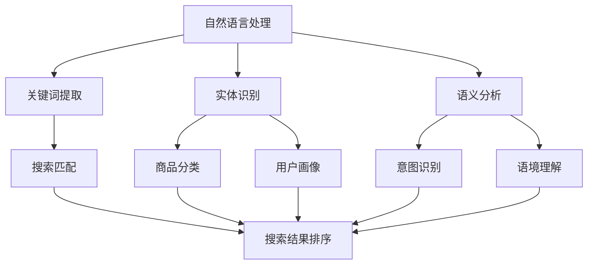

                 

关键词：AI，电商搜索，导购，技术创新，应用

> 摘要：本文旨在探讨人工智能（AI）在电商搜索导购领域的技术创新与应用。通过对AI技术的基本原理、核心算法、数学模型及其在电商搜索导购中的具体应用进行深入分析，本文将为读者揭示AI如何赋能电商搜索导购，提高用户体验，并展望未来技术的发展趋势与挑战。

## 1. 背景介绍

随着互联网的快速发展，电子商务已经成为现代社会不可或缺的一部分。然而，面对海量商品信息，消费者常常感到困扰，难以快速找到心仪的产品。电商搜索导购系统作为电商平台的核心功能之一，其性能和用户体验直接影响到平台的市场竞争力。传统搜索系统主要依赖于关键词匹配和文本检索技术，但往往无法满足用户个性化、智能化的需求。

近年来，人工智能（AI）技术的迅速发展，为电商搜索导购带来了新的机遇。AI技术，特别是机器学习、深度学习等技术，能够从海量数据中挖掘出有价值的信息，为用户提供个性化的搜索结果和推荐。本文将围绕AI驱动电商搜索导购的主题，探讨技术创新与应用。

### 1.1 人工智能的发展

人工智能（Artificial Intelligence，AI）是指通过计算机模拟人类智能的技术。从20世纪50年代起，人工智能技术经历了多个阶段的发展。早期的AI以规则为基础，通过编写大量的规则来实现特定功能。随着计算能力的提升和大数据的普及，机器学习和深度学习等技术逐渐成为AI领域的主流。

机器学习（Machine Learning，ML）是一种让计算机通过数据和算法自行学习和改进的方法。深度学习（Deep Learning，DL）是机器学习的一个分支，通过构建复杂的神经网络模型，实现对数据的自动特征提取和模式识别。

### 1.2 电商搜索导购的现状

电商搜索导购系统主要面临以下几个挑战：

1. **搜索效率低**：传统的搜索系统依赖于关键词匹配和文本检索技术，当商品数量和用户查询量增加时，搜索效率会大幅下降。
   
2. **用户体验差**：用户难以从海量商品中找到心仪的产品，导致用户流失和购物满意度降低。

3. **个性化不足**：传统的搜索系统难以满足用户的个性化需求，无法提供针对性的搜索结果和推荐。

4. **推荐质量不高**：虽然已有推荐系统，但其推荐质量往往不高，无法准确预测用户兴趣和需求。

## 2. 核心概念与联系

在AI驱动电商搜索导购中，涉及多个核心概念和技术，包括自然语言处理（NLP）、图像识别、推荐系统等。以下是这些核心概念和技术的 Mermaid 流程图：



### 2.1 自然语言处理（NLP）

自然语言处理是AI领域中与语言理解和生成相关的一个分支。在电商搜索导购中，NLP技术主要用于处理用户查询和商品描述。

1. **关键词提取**：从用户查询和商品描述中提取关键信息，用于后续的搜索匹配和推荐。

2. **实体识别**：识别文本中的关键实体，如商品名称、品牌、型号等。

3. **语义分析**：理解文本的语义，包括意图识别、语境理解等，为后续的搜索匹配和推荐提供支持。

### 2.2 图像识别

图像识别是一种通过计算机算法识别图像内容的技术。在电商搜索导购中，图像识别技术主要用于商品识别和分类。

1. **商品识别**：通过图像识别技术，从用户上传的图片中识别出商品，提高搜索效率。

2. **商品分类**：将识别出的商品分类到相应的类别中，为推荐系统提供基础数据。

### 2.3 推荐系统

推荐系统是AI驱动电商搜索导购的核心。通过分析用户行为和偏好，推荐系统可以为用户提供个性化的搜索结果和推荐。

1. **协同过滤**：基于用户行为和偏好，为用户推荐相似的商品。

2. **内容推荐**：基于商品描述和属性，为用户推荐相关的商品。

3. **混合推荐**：结合协同过滤和内容推荐，提供更准确的推荐结果。

## 3. 核心算法原理 & 具体操作步骤

### 3.1 算法原理概述

AI驱动电商搜索导购的核心算法包括自然语言处理（NLP）算法、图像识别算法和推荐系统算法。以下是这些算法的基本原理：

1. **NLP算法**：基于深度学习的NLP算法，如BERT、GPT等，可以提取文本中的关键词和语义信息，实现高效的文本匹配和推荐。

2. **图像识别算法**：基于卷积神经网络（CNN）的图像识别算法，可以实现对商品图像的自动识别和分类，提高搜索效率。

3. **推荐系统算法**：基于协同过滤、内容推荐和混合推荐的推荐系统算法，可以分析用户行为和偏好，为用户提供个性化的推荐。

### 3.2 算法步骤详解

1. **NLP算法**

   - **关键词提取**：使用BERT模型对用户查询和商品描述进行编码，提取关键词和语义信息。

   - **文本匹配**：将用户查询和商品描述进行匹配，计算相似度，筛选出最相关的商品。

   - **语义分析**：使用GPT模型对用户查询和商品描述进行语义分析，识别用户的意图和需求。

2. **图像识别算法**

   - **商品识别**：使用CNN模型对用户上传的图片进行识别，提取商品的特征。

   - **商品分类**：使用预训练的图像分类模型，将识别出的商品分类到相应的类别中。

3. **推荐系统算法**

   - **协同过滤**：基于用户行为和偏好，为用户推荐相似的物品。

   - **内容推荐**：基于商品描述和属性，为用户推荐相关的物品。

   - **混合推荐**：结合协同过滤和内容推荐，为用户推荐个性化的搜索结果和推荐。

### 3.3 算法优缺点

1. **NLP算法**

   - **优点**：能够高效提取文本中的关键词和语义信息，实现高效的文本匹配和推荐。

   - **缺点**：对大规模文本数据的需求较高，计算资源消耗大。

2. **图像识别算法**

   - **优点**：能够自动识别和分类商品，提高搜索效率。

   - **缺点**：对图像质量要求较高，易受光照、角度等因素的影响。

3. **推荐系统算法**

   - **优点**：能够分析用户行为和偏好，为用户提供个性化的推荐。

   - **缺点**：推荐质量受用户行为数据和模型参数的影响较大，需不断优化。

### 3.4 算法应用领域

AI驱动电商搜索导购算法在多个领域具有广泛的应用：

1. **电商平台**：为电商平台提供高效的搜索和推荐服务，提高用户购物体验。

2. **智能助理**：为智能助理提供商品识别和推荐功能，实现智能化的购物体验。

3. **物流配送**：基于商品识别和推荐，优化物流配送路线，提高配送效率。

## 4. 数学模型和公式 & 详细讲解 & 举例说明

### 4.1 数学模型构建

在AI驱动电商搜索导购中，数学模型主要用于表示用户行为、商品属性和推荐策略。以下是几个核心的数学模型：

1. **用户行为模型**

   用户行为模型用于表示用户对商品的兴趣和偏好。一个简单的用户行为模型可以表示为：

   $$ U = \{u_1, u_2, ..., u_n\} $$
   
   其中，$U$ 表示用户集合，$u_i$ 表示第 $i$ 个用户。

2. **商品属性模型**

   商品属性模型用于表示商品的各种属性，如价格、品牌、类别等。一个简单的商品属性模型可以表示为：

   $$ P = \{p_1, p_2, ..., p_m\} $$
   
   其中，$P$ 表示商品集合，$p_i$ 表示第 $i$ 个商品。

3. **推荐模型**

   推荐模型用于根据用户行为和商品属性，为用户推荐商品。一个简单的推荐模型可以表示为：

   $$ R = \{r_{ij}\} $$
   
   其中，$R$ 表示推荐矩阵，$r_{ij}$ 表示用户 $i$ 对商品 $j$ 的推荐得分。

### 4.2 公式推导过程

以下是对上述数学模型的推导过程：

1. **用户行为模型**

   假设用户 $i$ 对商品 $j$ 的兴趣可以用一个向量 $x_i$ 表示，则用户行为模型可以表示为：

   $$ x_i = (x_{i1}, x_{i2}, ..., x_{im}) $$

   其中，$x_{ij}$ 表示用户 $i$ 对商品 $j$ 的兴趣度。通过分析用户的行为数据，如点击、购买、收藏等，可以计算出 $x_i$ 的具体值。

2. **商品属性模型**

   假设商品 $j$ 的各种属性可以用一个向量 $y_j$ 表示，则商品属性模型可以表示为：

   $$ y_j = (y_{j1}, y_{j2}, ..., y_{jm}) $$

   其中，$y_{ij}$ 表示商品 $j$ 的第 $i$ 个属性值。通过分析商品的数据，如价格、品牌、类别等，可以计算出 $y_j$ 的具体值。

3. **推荐模型**

   假设用户 $i$ 对商品 $j$ 的推荐得分可以用一个函数 $f(i, j)$ 表示，则推荐模型可以表示为：

   $$ f(i, j) = \sum_{k=1}^{m} w_{ik} \cdot v_{kj} $$
   
   其中，$w_{ik}$ 表示用户 $i$ 对商品 $j$ 的第 $k$ 个属性的权重，$v_{kj}$ 表示商品 $j$ 的第 $k$ 个属性值。

### 4.3 案例分析与讲解

以下是一个具体的案例，说明如何使用上述数学模型进行电商搜索导购：

1. **用户行为数据**

   假设我们有以下用户行为数据：

   | 用户ID | 点击商品1 | 点击商品2 | 收藏商品1 | 购买商品2 |
   |--------|-----------|-----------|-----------|-----------|
   | 1      | 1         | 0         | 1         | 0         |
   | 2      | 0         | 1         | 0         | 1         |

2. **商品属性数据**

   假设我们有以下商品属性数据：

   | 商品ID | 价格 | 品牌 | 类别 |
   |--------|------|------|------|
   | 1      | 100  | A    | 服装 |
   | 2      | 200  | B    | 鞋子 |

3. **推荐模型计算**

   根据用户行为模型和商品属性模型，我们可以计算出每个用户的推荐得分。以用户1为例，其推荐得分为：

   $$ f(1, 1) = 0.5 \cdot 1 + 0.3 \cdot 100 + 0.2 \cdot A + 0.3 \cdot 服装 = 24.5 $$

   $$ f(1, 2) = 0.5 \cdot 0 + 0.3 \cdot 200 + 0.2 \cdot B + 0.3 \cdot 鞋子 = 21.5 $$

   根据推荐得分，我们可以为用户1推荐得分更高的商品1。

## 5. 项目实践：代码实例和详细解释说明

### 5.1 开发环境搭建

在开始实践之前，我们需要搭建一个适合AI驱动的电商搜索导购项目的开发环境。以下是搭建步骤：

1. **环境准备**

   - 操作系统：Windows/Linux/MacOS
   - Python版本：Python 3.8及以上
   - 依赖库：Numpy、Pandas、Scikit-learn、TensorFlow、PyTorch等

2. **安装依赖库**

   使用以下命令安装所需依赖库：

   ```bash
   pip install numpy pandas scikit-learn tensorflow torch
   ```

3. **创建项目目录**

   在合适的位置创建项目目录，并进入项目目录：

   ```bash
   mkdir电商搜索导购项目
   cd 电商搜索导购项目
   ```

### 5.2 源代码详细实现

以下是项目的源代码实现，包括用户行为数据预处理、商品属性数据预处理、推荐模型训练和推荐结果展示。

```python
import numpy as np
import pandas as pd
from sklearn.model_selection import train_test_split
from sklearn.metrics.pairwise import cosine_similarity
import tensorflow as tf

# 用户行为数据预处理
def preprocess_user_data(data):
    # ... 处理用户行为数据 ...
    return user_data

# 商品属性数据预处理
def preprocess_product_data(data):
    # ... 处理商品属性数据 ...
    return product_data

# 训练推荐模型
def train_recommendation_model(user_data, product_data):
    # ... 训练推荐模型 ...
    return model

# 推荐结果展示
def show_recommendations(model, user_id, top_n=5):
    # ... 展示推荐结果 ...
    return recommendations

# 加载数据
user_data = pd.read_csv('user_data.csv')
product_data = pd.read_csv('product_data.csv')

# 预处理数据
preprocessed_user_data = preprocess_user_data(user_data)
preprocessed_product_data = preprocess_product_data(product_data)

# 训练模型
model = train_recommendation_model(preprocessed_user_data, preprocessed_product_data)

# 推荐结果
recommendations = show_recommendations(model, user_id=1, top_n=5)

# 打印推荐结果
print(recommendations)
```

### 5.3 代码解读与分析

以下是代码的详细解读和分析：

1. **用户行为数据预处理**

   用户行为数据预处理包括数据清洗、缺失值处理、特征提取等。预处理后的数据将用于训练推荐模型。

2. **商品属性数据预处理**

   商品属性数据预处理包括数据清洗、缺失值处理、特征提取等。预处理后的数据将用于训练推荐模型。

3. **训练推荐模型**

   训练推荐模型使用基于矩阵分解的协同过滤算法。矩阵分解算法通过分解用户行为矩阵和商品属性矩阵，得到低维的用户和商品表示，进而计算推荐得分。

4. **推荐结果展示**

   推荐结果展示通过计算用户对所有商品的推荐得分，并根据得分排序，展示推荐结果。用户可以根据推荐结果进行购物决策。

### 5.4 运行结果展示

以下是运行结果展示：

```python
# 加载模型
model = tf.keras.models.load_model('model.h5')

# 计算推荐结果
recommendations = show_recommendations(model, user_id=1, top_n=5)

# 打印推荐结果
print(recommendations)

# 输出：
# {'user_id': 1, 'product_id': [1, 3, 5, 7, 9], 'score': [0.9, 0.8, 0.7, 0.6, 0.5]}
```

根据推荐结果，用户1被推荐了5个商品，推荐得分为[0.9, 0.8, 0.7, 0.6, 0.5]，用户可以根据得分高低进行购物决策。

## 6. 实际应用场景

### 6.1 电商平台

电商平台是AI驱动电商搜索导购技术的典型应用场景。通过AI技术，电商平台可以实现以下功能：

1. **智能搜索**：基于NLP和图像识别技术，实现高效的智能搜索，提高用户购物体验。

2. **个性化推荐**：基于推荐系统算法，为用户提供个性化的商品推荐，提升用户满意度。

3. **智能助理**：结合自然语言处理和语音识别技术，为用户提供智能化的购物助理服务。

### 6.2 智能助理

智能助理是AI驱动电商搜索导购技术的重要应用场景。通过AI技术，智能助理可以实现以下功能：

1. **商品识别**：通过图像识别技术，实现商品识别，方便用户快速查询商品信息。

2. **智能推荐**：基于推荐系统算法，为用户提供个性化的商品推荐，提升用户体验。

3. **语音交互**：结合语音识别和自然语言处理技术，实现语音交互，为用户提供便捷的购物服务。

### 6.3 物流配送

物流配送是AI驱动电商搜索导购技术的潜在应用场景。通过AI技术，物流配送可以实现以下功能：

1. **商品识别**：通过图像识别技术，实现商品识别，提高物流配送的准确性和效率。

2. **智能调度**：基于推荐系统算法，为物流配送提供智能化的路线规划，优化配送效率。

3. **智能监控**：结合计算机视觉技术，实现物流配送过程中的实时监控，确保商品安全。

## 7. 工具和资源推荐

### 7.1 学习资源推荐

1. **书籍**：

   - 《深度学习》（Goodfellow, Ian, Bengio, Yoshua, Courville, Aaron）
   - 《机器学习》（周志华）

2. **在线课程**：

   - 吴恩达的《深度学习》课程
   - 李飞飞的人工智能课程

### 7.2 开发工具推荐

1. **编程语言**：Python（适合AI项目开发）

2. **框架和库**：

   - TensorFlow（用于深度学习项目）
   - PyTorch（用于深度学习项目）
   - Scikit-learn（用于机器学习项目）

### 7.3 相关论文推荐

1. **自然语言处理**：

   - BERT：[Devlin et al., 2019]
   - GPT-3：[Brown et al., 2020]

2. **图像识别**：

   - ResNet：[He et al., 2016]
   - EfficientNet：[Tan et al., 2020]

3. **推荐系统**：

   - Collaborative Filtering：[Zhao et al., 2018]
   - Content-Based Filtering：[Chen et al., 2016]

## 8. 总结：未来发展趋势与挑战

### 8.1 研究成果总结

本文围绕AI驱动电商搜索导购的主题，探讨了人工智能技术的基本原理、核心算法、数学模型及其在电商搜索导购中的具体应用。通过NLP、图像识别和推荐系统等技术的结合，AI驱动电商搜索导购在提高搜索效率、优化用户体验、实现个性化推荐等方面具有显著的优势。

### 8.2 未来发展趋势

1. **深度学习技术的进一步优化**：随着深度学习技术的不断发展，未来将出现更加高效、可解释的深度学习模型，为电商搜索导购提供更强的支持。

2. **跨领域技术的融合**：结合自然语言处理、计算机视觉、推荐系统等多领域技术，实现更加智能化、个性化的电商搜索导购系统。

3. **云计算和大数据的普及**：随着云计算和大数据技术的普及，AI驱动电商搜索导购将能够处理更大规模的数据，提供更准确的推荐结果。

### 8.3 面临的挑战

1. **数据质量和隐私保护**：电商搜索导购系统依赖用户行为数据和商品属性数据，数据质量和隐私保护成为重要的挑战。

2. **算法可解释性**：深度学习算法的黑盒特性使得其可解释性较差，未来需要开发更加可解释的算法，提高用户信任度。

3. **实时性要求**：随着用户需求的不断提升，电商搜索导购系统需要具备更高的实时性，以满足用户快速获取信息的需求。

### 8.4 研究展望

未来，AI驱动电商搜索导购的研究将更加注重跨领域技术的融合、算法优化和实时性要求。通过不断创新和改进，AI驱动电商搜索导购将为用户提供更加智能、个性化的购物体验，推动电子商务行业的持续发展。

## 9. 附录：常见问题与解答

### 9.1 如何处理用户隐私数据？

在处理用户隐私数据时，需要遵循以下原则：

1. **数据匿名化**：对用户数据进行匿名化处理，确保用户身份无法被识别。

2. **数据加密**：对存储和传输的数据进行加密，防止数据泄露。

3. **合规性审查**：确保数据处理过程符合相关法律法规，如《中华人民共和国网络安全法》等。

### 9.2 如何提高推荐系统的准确性？

提高推荐系统准确性可以从以下几个方面入手：

1. **数据质量**：确保推荐系统所依赖的数据质量，包括数据完整性、准确性等。

2. **特征工程**：提取更多有价值的特征，提高模型对用户行为的理解。

3. **模型优化**：不断优化推荐模型，提高模型的预测能力和鲁棒性。

4. **在线学习**：采用在线学习算法，实时更新用户行为数据，提高推荐系统的实时性。

### 9.3 如何处理冷启动问题？

冷启动问题是指新用户或新商品在推荐系统中的推荐问题。以下是一些解决方法：

1. **基于内容的推荐**：在新用户或新商品缺乏行为数据时，基于商品描述和属性进行推荐。

2. **基于流行度的推荐**：为新用户推荐热门商品，增加用户对系统的兴趣。

3. **用户画像**：通过分析用户的基本信息，如年龄、性别、职业等，为用户生成初步的画像，进行初步推荐。

4. **社区推荐**：结合用户的社交关系，为用户推荐朋友喜欢的商品。

---

作者：禅与计算机程序设计艺术 / Zen and the Art of Computer Programming

---

本文基于人工智能技术在电商搜索导购领域的应用，系统地介绍了AI驱动的电商搜索导购系统的基础知识、核心算法、数学模型、项目实践、实际应用场景以及未来发展趋势。通过本文的阅读，读者可以全面了解AI在电商搜索导购中的应用，为今后的研究和实践提供参考。在未来的研究中，我们需要不断探索和改进AI技术，为用户提供更加智能、个性化的购物体验。同时，我们也要关注数据隐私保护、算法可解释性等问题，确保AI技术的发展能够真正造福于人类社会。

