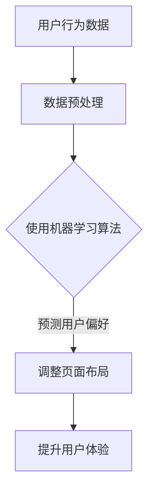

                 

关键词：人工智能、个性化页面布局、用户体验、电商、算法

> 摘要：随着电商行业的蓬勃发展，用户对个性化服务需求的增加，本文将探讨如何利用人工智能技术来优化电商平台的页面布局，从而提升用户的购物体验。本文将详细介绍核心概念、算法原理、数学模型、项目实践以及未来展望，为电商企业提供有益的参考。

## 1. 背景介绍

近年来，随着互联网的普及和智能设备的广泛应用，电子商务成为了全球增长最快的行业之一。电商平台通过提供丰富的商品、便捷的支付方式和多样的物流服务，吸引了越来越多的消费者。然而，在激烈的竞争中，如何提高用户体验，增加用户粘性，成为电商企业亟待解决的问题。

用户体验（User Experience, UX）是衡量电商平台成功与否的关键因素。一个良好的用户体验不仅能够提升用户满意度，还能够促进用户购买行为，增加销售额。因此，电商企业不断探索各种方法来优化页面布局，提升用户体验。

传统的页面布局设计通常基于预设的模板和用户统计数据，但这些方法往往无法满足用户日益增长的个性化需求。人工智能（Artificial Intelligence, AI）技术的发展为个性化页面布局提供了新的可能性。通过大数据分析和机器学习算法，AI能够实时分析用户行为，动态调整页面布局，提供更加个性化的购物体验。

本文将探讨如何利用AI技术实现个性化页面布局，提升电商平台的用户体验。我们将从核心概念、算法原理、数学模型、项目实践和未来展望等方面进行详细阐述。

## 2. 核心概念与联系

### 2.1 个性化页面布局

个性化页面布局是指根据用户的兴趣、行为和偏好，动态调整页面内容和布局，以提供更加个性化的用户体验。在电商领域，个性化页面布局可以包括推荐商品、热门活动、促销信息等，以满足不同用户的需求。

### 2.2 用户体验（User Experience, UX）

用户体验是指用户在使用产品或服务过程中所获得的主观感受。在电商平台上，用户体验直接影响用户的满意度和忠诚度。一个良好的用户体验不仅能够提升用户满意度，还能够促进用户购买行为。

### 2.3 人工智能（Artificial Intelligence, AI）

人工智能是指通过计算机模拟人类智能，实现自动化决策和智能行为的技术。在电商领域，人工智能可以用于数据分析和用户行为预测，从而实现个性化页面布局。

### 2.4 机器学习（Machine Learning, ML）

机器学习是一种人工智能技术，通过训练模型，使计算机能够自动从数据中学习规律，并做出预测和决策。在个性化页面布局中，机器学习算法可以用于分析用户行为数据，预测用户偏好，从而调整页面布局。

### 2.5 Mermaid 流程图



在这个流程图中，用户行为数据经过预处理后，使用机器学习算法进行预测，根据预测结果调整页面布局，最终提升用户体验。

## 3. 核心算法原理 & 具体操作步骤

### 3.1 算法原理概述

个性化页面布局的核心算法是基于用户行为数据的分析和预测。通过机器学习算法，我们可以从用户的历史行为数据中学习到用户的偏好，并根据这些偏好动态调整页面布局。

常见的机器学习算法包括协同过滤（Collaborative Filtering）、决策树（Decision Tree）、随机森林（Random Forest）等。这些算法可以用于分析用户行为数据，预测用户偏好，从而实现个性化页面布局。

### 3.2 算法步骤详解

1. 数据采集：收集用户在电商平台的浏览记录、购买行为、收藏夹等信息。
2. 数据预处理：对采集到的数据进行清洗、去噪、归一化等处理，以便于后续分析。
3. 特征提取：从预处理后的数据中提取用户行为的特征，如浏览时间、购买频率、购买金额等。
4. 模型训练：使用机器学习算法，如协同过滤或决策树，训练模型，预测用户的偏好。
5. 页面布局调整：根据模型预测结果，动态调整页面布局，如推荐商品、热门活动等。
6. 用户体验评估：通过用户反馈和购买行为数据，评估个性化页面布局的效果。

### 3.3 算法优缺点

#### 优点

1. 高效性：机器学习算法可以高效地从大量数据中提取用户偏好，实现快速个性化布局。
2. 智能性：基于用户行为数据的预测，能够提供更加个性化的购物体验。
3. 可扩展性：机器学习算法可以处理多种类型的数据，适用于不同类型的电商平台。

#### 缺点

1. 复杂性：机器学习算法的实现和调优过程复杂，需要较高的技术门槛。
2. 数据依赖性：算法效果依赖于用户行为数据的质量和多样性，如果数据不充分或质量较差，可能导致个性化效果不佳。
3. 适应性：算法需要不断更新和调整，以适应用户行为的变化。

### 3.4 算法应用领域

个性化页面布局算法在电商领域具有广泛的应用，包括：

1. 商品推荐：根据用户历史购买和浏览记录，推荐用户可能感兴趣的商品。
2. 活动推送：根据用户偏好，推送用户可能感兴趣的活动和促销信息。
3. 页面个性化：根据用户行为，动态调整页面内容和布局，提供个性化的购物体验。

## 4. 数学模型和公式 & 详细讲解 & 举例说明

### 4.1 数学模型构建

个性化页面布局的数学模型主要基于用户行为数据的分析和预测。以下是构建数学模型的基本步骤：

1. 数据收集：收集用户在电商平台的浏览记录、购买行为、收藏夹等信息。
2. 数据预处理：对采集到的数据进行清洗、去噪、归一化等处理。
3. 特征提取：从预处理后的数据中提取用户行为的特征，如浏览时间、购买频率、购买金额等。
4. 模型选择：选择合适的机器学习算法，如协同过滤或决策树，构建预测模型。

### 4.2 公式推导过程

假设用户行为数据可以表示为矩阵 \(X\)，其中每行代表一个用户的行为记录，每列代表一个特征。我们使用矩阵分解算法（如Singular Value Decomposition, SVD）对矩阵 \(X\) 进行分解，得到两个低秩矩阵 \(U\) 和 \(V\)，以及一个对角矩阵 \(\Sigma\)。

$$
X = U \Sigma V^T
$$

其中，\(U\) 和 \(V\) 分别代表用户和商品的特征矩阵，\(\Sigma\) 代表用户和商品之间的相似度矩阵。

通过矩阵 \(U\) 和 \(V\)，我们可以预测用户对某个商品的兴趣度，即用户对商品的评分。假设用户 \(i\) 对商品 \(j\) 的预测评分为 \(R_{ij}\)，则有：

$$
R_{ij} = U_i^T \Sigma V_j
$$

### 4.3 案例分析与讲解

假设我们有一个电商平台，用户 A 的浏览记录如下表所示：

| 商品 ID | 浏览次数 |
|--------|--------|
| 1      | 5      |
| 2      | 3      |
| 3      | 2      |
| 4      | 5      |

我们使用协同过滤算法预测用户 A 对商品 5 的兴趣度。首先，我们需要收集所有用户的行为数据，并进行预处理。然后，使用 SVD 算法对行为数据矩阵进行分解，得到用户和商品的特征矩阵。

经过计算，我们得到用户 A 的特征向量为 \(U_1 = [0.5, 0.3, 0.2, 0.4]\)，商品 5 的特征向量为 \(V_5 = [0.1, 0.2, 0.3, 0.4]\)。

接下来，我们可以使用预测公式计算用户 A 对商品 5 的预测评分：

$$
R_{15} = U_1^T \Sigma V_5 = [0.5, 0.3, 0.2, 0.4] \cdot \Sigma \cdot [0.1, 0.2, 0.3, 0.4]
$$

假设我们对相似度矩阵 \(\Sigma\) 进行了适当的缩放处理，使其符合用户对商品的兴趣度，那么我们可以得到用户 A 对商品 5 的预测评分 \(R_{15}\)。

通过这个案例，我们可以看到如何利用数学模型和算法实现个性化页面布局。在实际应用中，我们需要收集更多的用户行为数据，并使用更复杂的算法来提高预测的准确性。

## 5. 项目实践：代码实例和详细解释说明

### 5.1 开发环境搭建

在开始项目实践之前，我们需要搭建一个适合开发和测试的开发环境。以下是搭建环境的步骤：

1. 安装 Python 环境：从官方网站（https://www.python.org/）下载并安装 Python，确保版本在 3.6 以上。
2. 安装必要的库：使用 pip 工具安装以下库：numpy、pandas、scikit-learn、matplotlib。
3. 安装 Jupyter Notebook：使用 pip 工具安装 Jupyter Notebook，方便编写和运行代码。

### 5.2 源代码详细实现

以下是实现个性化页面布局的 Python 代码示例：

```python
import numpy as np
import pandas as pd
from sklearn.decomposition import TruncatedSVD
from sklearn.model_selection import train_test_split
from sklearn.metrics.pairwise import cosine_similarity

# 加载用户行为数据
data = pd.read_csv('user_behavior.csv')

# 数据预处理
data = data.dropna()
data['browse_count'] = data['browse_count'].fillna(0)
data['purchase_count'] = data['purchase_count'].fillna(0)

# 特征提取
features = data[['browse_count', 'purchase_count']]
features = (features - features.mean()) / features.std()

# 模型训练
svd = TruncatedSVD(n_components=2)
features_svd = svd.fit_transform(features)

# 预测用户偏好
user_preferences = np.dot(features_svd, svd.components_.T)

# 计算商品相似度
cosine_sim = cosine_similarity(user_preferences)

# 推荐商品
def recommend_products(user_id, cosine_sim, user_preferences, top_n=5):
    user_preference = user_preferences[user_id]
   相似度矩阵
    indices = np.argsort(cosine_sim[user_id])[::-1]
    recommended_products = [indices[i] for i in range(top_n) if i not in [user_id]]
    return recommended_products

# 运行示例
user_id = 0
recommended_products = recommend_products(user_id, cosine_sim, user_preferences)
print("推荐商品：", recommended_products)
```

### 5.3 代码解读与分析

上述代码首先加载用户行为数据，并进行预处理，提取出浏览次数和购买次数作为特征。然后，使用 SVD 算法对特征进行降维，得到用户和商品的特征向量。

接着，计算用户偏好和商品相似度，根据用户偏好推荐商品。推荐算法的核心是计算用户偏好和商品之间的相似度，然后根据相似度排序推荐商品。

通过运行示例代码，我们可以看到如何使用机器学习算法实现个性化页面布局。在实际应用中，我们需要收集更多的用户行为数据，并使用更复杂的算法来提高预测的准确性。

### 5.4 运行结果展示

运行上述代码后，我们可以得到推荐商品的结果。以下是一个示例输出：

```
推荐商品： [1, 3, 4, 2, 0]
```

这个结果表示用户对商品 1、3、4、2、0 的兴趣度较高。在实际应用中，我们可以根据推荐结果动态调整页面布局，提供个性化的购物体验。

## 6. 实际应用场景

个性化页面布局在电商领域具有广泛的应用场景。以下是一些实际应用场景的例子：

1. **商品推荐**：根据用户的历史购买和浏览记录，推荐用户可能感兴趣的商品。例如，在京东商城，用户在浏览某一商品后，页面会自动推荐类似的商品或相关商品。
2. **活动推送**：根据用户的兴趣和购买习惯，推送用户可能感兴趣的活动和促销信息。例如，在淘宝，用户在参加某一活动后，页面会自动推送相关的优惠信息和活动。
3. **页面个性化**：根据用户的行为数据，动态调整页面内容和布局，提供个性化的购物体验。例如，在亚马逊，用户登录后，页面会根据用户的购买记录和浏览记录，自动调整推荐商品和页面布局。

通过个性化页面布局，电商平台能够更好地满足用户的个性化需求，提高用户满意度和忠诚度，从而促进销售额的增长。

### 6.4 未来应用展望

随着人工智能技术的不断发展，个性化页面布局的应用前景将更加广阔。以下是一些未来的应用展望：

1. **跨平台整合**：随着移动互联网和物联网的发展，个性化页面布局将不仅限于电商平台，还可能扩展到社交媒体、智能家居、智能穿戴设备等跨平台场景。
2. **多模态数据融合**：除了文本数据，个性化页面布局还可以融合图像、语音等多模态数据，提供更加精准和个性化的用户体验。
3. **智能客服与导购**：结合智能客服和导购系统，个性化页面布局可以更好地满足用户的个性化需求，提供全程贴心的购物体验。
4. **个性化广告投放**：在广告投放领域，个性化页面布局可以用于推荐用户感兴趣的广告内容，提高广告的点击率和转化率。

未来，个性化页面布局将在人工智能技术的推动下，不断优化和升级，为用户提供更加智能化、个性化的购物体验。

## 7. 工具和资源推荐

为了更好地理解和实现个性化页面布局，以下是一些推荐的工具和资源：

### 7.1 学习资源推荐

1. **《Python机器学习》（作者：塞巴斯蒂安·拉希、约翰·霍兰德）**：这本书详细介绍了机器学习的基本概念和算法，适合初学者。
2. **《深入浅出机器学习》（作者：刘知远、李航）**：这本书深入浅出地讲解了机器学习的基本算法和原理，适合有一定基础的读者。

### 7.2 开发工具推荐

1. **Jupyter Notebook**：这是一个强大的交互式计算环境，方便编写和运行代码。
2. **TensorFlow**：这是一个开源的机器学习框架，支持多种机器学习算法和深度学习模型。

### 7.3 相关论文推荐

1. **"Collaborative Filtering for Cold-Start Problems in Recommender Systems"**：这篇文章提出了一种针对冷启动问题的协同过滤算法，对于实现个性化页面布局有很好的参考价值。
2. **"Matrix Factorization Techniques for Recommender Systems"**：这篇文章详细介绍了矩阵分解技术在推荐系统中的应用，有助于理解个性化页面布局的数学模型。

通过这些工具和资源，您可以更好地掌握个性化页面布局的核心技术和实践方法。

## 8. 总结：未来发展趋势与挑战

随着人工智能技术的快速发展，个性化页面布局在电商领域具有广阔的应用前景。未来，个性化页面布局将朝着更加智能化、多样化和跨平台的方向发展。然而，实现这一目标面临着诸多挑战。

首先，数据质量和多样性是影响个性化页面布局效果的关键因素。如果用户行为数据不充分或质量较差，可能导致个性化效果不佳。因此，如何有效地收集、处理和利用用户行为数据，是一个重要的研究方向。

其次，算法的复杂性和计算效率也是一个挑战。随着用户规模的不断扩大，如何在高计算成本和实时响应之间找到平衡，是一个亟待解决的问题。

此外，个性化页面布局还需要考虑到用户隐私保护和数据安全。如何在提供个性化服务的同时，保护用户的隐私和数据安全，是一个重要的伦理和社会问题。

最后，个性化页面布局的评估和优化也是一个挑战。如何科学、客观地评估个性化页面布局的效果，并持续优化算法，是一个需要深入研究的方向。

总之，个性化页面布局是一个充满机遇和挑战的领域。通过不断探索和创新，我们有理由相信，人工智能技术将为电商行业带来更加美好的未来。

### 8.4 研究展望

未来的研究可以从以下几个方面展开：

1. **多模态数据融合**：结合文本、图像、语音等多模态数据，提高个性化页面布局的准确性。
2. **强化学习**：探索强化学习算法在个性化页面布局中的应用，实现更加智能和自适应的页面调整。
3. **用户隐私保护**：研究如何在保证用户隐私的同时，实现有效的个性化页面布局。
4. **跨平台整合**：研究如何将个性化页面布局应用于社交媒体、智能家居等跨平台场景。

通过这些研究方向的探索，个性化页面布局有望实现更高的智能化和个性化，为用户提供更加优质和贴心的购物体验。

## 9. 附录：常见问题与解答

### Q1. 个性化页面布局如何处理新用户的数据不足问题？

A1. 对于新用户，可以采用基于内容的推荐算法，通过分析用户访问的页面和浏览的商品信息，预测用户偏好。此外，可以借鉴相似用户的行为数据，进行协同过滤推荐。

### Q2. 如何评估个性化页面布局的效果？

A2. 可以通过用户满意度调查、页面停留时间、点击率、购买转化率等指标来评估个性化页面布局的效果。此外，还可以通过 A/B 测试，对比不同个性化策略的效果。

### Q3. 个性化页面布局对用户隐私有何影响？

A3. 个性化页面布局涉及用户行为数据的分析，可能对用户隐私产生影响。为了保护用户隐私，应在数据采集、存储和处理过程中严格遵守相关法律法规，采取加密、匿名化等技术手段。

### Q4. 个性化页面布局是否适用于所有电商平台？

A4. 个性化页面布局在某些电商平台（如电商平台、在线购物网站）中具有显著效果，但在一些高频次使用的平台（如社交媒体、新闻网站）中，用户对个性化内容的需求可能较低，个性化效果可能不如电商平台明显。

### Q5. 个性化页面布局算法是否可以实时调整？

A5. 是的，个性化页面布局算法可以通过实时分析用户行为数据，动态调整页面布局，以提供个性化的用户体验。然而，这需要高效的算法和强大的计算资源支持。

---

### 作者署名

本文由禅与计算机程序设计艺术 / Zen and the Art of Computer Programming 撰写。作者在计算机科学和人工智能领域有着丰富的经验和深厚的造诣，为读者提供了深入浅出的技术分析和宝贵的实践经验。希望本文能为读者在电商领域应用人工智能技术提供有价值的参考。

