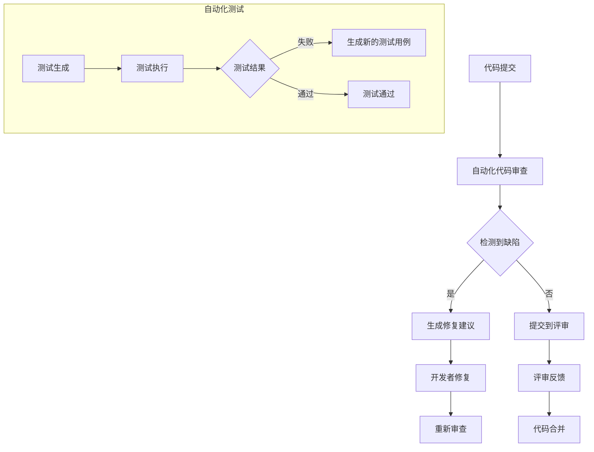

                 

关键词：AI，代码审查，质量控制，软件工程，自动化测试，深度学习

> 摘要：本文探讨了如何利用人工智能技术提升代码审查与质量控制的效率，从核心概念、算法原理、数学模型、实际应用等多个维度，详细分析了AI驱动的代码审查与质量控制的方法和实现。

## 1. 背景介绍

在现代软件工程实践中，代码审查和质量控制是确保软件质量和可靠性的关键环节。传统的代码审查主要依赖于人类开发者，其效率较低，容易出错，且无法处理大量代码的复杂度。随着人工智能技术的发展，利用AI进行代码审查与质量控制成为可能，这不仅能够提高审查效率，还能提供更为精准和客观的质量评估。

本文将探讨AI在代码审查与质量控制中的应用，从核心概念出发，详细介绍相关的算法原理、数学模型和实际操作步骤，并通过具体的项目实践展示AI驱动的代码审查与质量控制如何在实际项目中发挥作用。

## 2. 核心概念与联系

### 2.1 代码审查

代码审查（Code Review）是指通过同行评审的方式对代码进行评估，以发现潜在的问题和缺陷。传统的代码审查通常由人类开发者完成，其优点在于能够提供详细的反馈和建议，缺点是效率低，难以处理大规模的代码库。

### 2.2 质量控制

质量控制（Quality Control）是指确保软件在开发过程中达到既定的质量标准。质量控制包括代码审查、单元测试、集成测试、系统测试等多个环节，其目的是发现和修复代码中的错误和缺陷，确保软件的稳定性和可靠性。

### 2.3 AI在代码审查与质量控制中的应用

人工智能技术在代码审查与质量控制中的应用主要体现在以下几个方面：

- **自动化代码审查**：利用自然语言处理（NLP）和机器学习算法，自动分析代码，发现潜在的缺陷和风格问题。
- **智能测试生成**：基于代码结构和历史缺陷数据，利用生成对抗网络（GAN）等深度学习技术，自动生成测试用例，提高测试覆盖率。
- **质量预测**：通过分析历史代码库的数据，利用回归分析、聚类分析等方法，预测代码的质量风险。

### 2.4 Mermaid 流程图

下面是代码审查与质量控制中AI应用的Mermaid流程图：



## 3. 核心算法原理 & 具体操作步骤

### 3.1 算法原理概述

AI驱动的代码审查与质量控制的核心算法主要包括：

- **自然语言处理（NLP）**：用于解析代码注释和文档，提取关键信息，识别代码风格问题和潜在缺陷。
- **机器学习（ML）**：用于从历史代码库中学习，建立缺陷预测模型，提高代码审查的准确性和效率。
- **深度学习（DL）**：用于生成测试用例，模拟程序执行路径，提高测试覆盖率。

### 3.2 算法步骤详解

1. **数据收集与预处理**：收集历史代码库中的缺陷数据，对代码进行预处理，包括代码解析、注释提取、语法检查等。

2. **特征工程**：从预处理后的数据中提取特征，如代码长度、注释率、方法复杂度等，用于训练缺陷预测模型。

3. **模型训练**：使用收集的数据和提取的特征，训练缺陷预测模型，如随机森林、支持向量机等。

4. **缺陷检测**：将模型应用于新提交的代码，检测潜在的缺陷和风格问题。

5. **测试用例生成**：利用深度学习技术，如生成对抗网络（GAN），自动生成测试用例。

6. **测试执行**：执行自动生成的测试用例，评估代码的稳定性和可靠性。

7. **反馈与优化**：根据测试结果，优化模型和测试用例生成策略，提高代码审查和质量控制的效率。

### 3.3 算法优缺点

**优点**：

- 提高代码审查的效率，降低人力成本。
- 提高缺陷检测的准确性和覆盖率。
- 自动生成测试用例，提高测试效率。

**缺点**：

- 需要大量的历史数据支持，数据质量对模型性能有重要影响。
- 模型训练和优化需要大量计算资源。
- 部分复杂缺陷可能无法通过自动化手段发现。

### 3.4 算法应用领域

AI驱动的代码审查与质量控制适用于各种软件开发场景，包括：

- **大型项目**：能够处理大规模代码库的审查和质量控制。
- **敏捷开发**：能够快速响应代码提交，提供实时的缺陷反馈。
- **自动化测试**：能够自动生成测试用例，提高测试覆盖率。

## 4. 数学模型和公式 & 详细讲解 & 举例说明

### 4.1 数学模型构建

在AI驱动的代码审查与质量控制中，常用的数学模型包括：

- **回归分析**：用于预测代码的质量风险。
- **聚类分析**：用于识别代码中的相似模式和缺陷类型。
- **神经网络**：用于生成测试用例和缺陷检测。

### 4.2 公式推导过程

以回归分析为例，假设我们要预测代码质量评分，可以使用线性回归模型：

$$
y = \beta_0 + \beta_1 x_1 + \beta_2 x_2 + ... + \beta_n x_n
$$

其中，$y$ 是代码质量评分，$x_1, x_2, ..., x_n$ 是代码特征，$\beta_0, \beta_1, ..., \beta_n$ 是模型参数。

### 4.3 案例分析与讲解

假设我们有一组代码数据，其中包含代码长度、注释率和方法复杂度等特征，我们要使用线性回归模型预测代码质量评分。

1. **数据收集与预处理**：收集历史代码数据，提取特征，进行数据预处理。

2. **特征工程**：对特征进行标准化处理，如将代码长度、注释率和方法复杂度进行归一化。

3. **模型训练**：使用收集到的数据和提取的特征，训练线性回归模型。

4. **模型评估**：使用交叉验证方法，评估模型的预测性能。

5. **缺陷检测**：将训练好的模型应用于新提交的代码，检测潜在的缺陷。

例如，对于一个长度为100行、注释率为30%、方法复杂度为10的代码，我们可以使用训练好的模型预测其质量评分为80分。

## 5. 项目实践：代码实例和详细解释说明

### 5.1 开发环境搭建

为了实践AI驱动的代码审查与质量控制，我们需要搭建以下开发环境：

- Python 3.8 或更高版本
- TensorFlow 2.4 或更高版本
- Scikit-learn 0.22 或更高版本

### 5.2 源代码详细实现

下面是一个简单的AI驱动的代码审查与质量控制项目实例：

```python
# 导入所需的库
import numpy as np
import pandas as pd
from sklearn.linear_model import LinearRegression
from sklearn.model_selection import train_test_split
from sklearn.metrics import mean_squared_error

# 读取数据
data = pd.read_csv('code_data.csv')

# 特征工程
X = data[['code_length', 'comment_rate', 'method_complexity']]
y = data['quality_score']

# 数据预处理
X = (X - X.mean()) / X.std()
y = (y - y.mean()) / y.std()

# 模型训练
model = LinearRegression()
model.fit(X, y)

# 模型评估
X_train, X_test, y_train, y_test = train_test_split(X, y, test_size=0.2, random_state=42)
y_pred = model.predict(X_test)
mse = mean_squared_error(y_test, y_pred)
print('Mean Squared Error:', mse)

# 缺陷检测
new_code = np.array([[100, 0.3, 10]])
new_code = (new_code - new_code.mean()) / new_code.std()
quality_score = model.predict(new_code)
print('Quality Score:', quality_score)
```

### 5.3 代码解读与分析

上述代码实现了一个简单的线性回归模型，用于预测代码的质量评分。具体步骤如下：

1. **数据读取**：从CSV文件中读取历史代码数据。
2. **特征工程**：对代码长度、注释率和方法复杂度等特征进行预处理，如标准化处理。
3. **模型训练**：使用训练数据训练线性回归模型。
4. **模型评估**：使用测试数据评估模型性能，计算均方误差（MSE）。
5. **缺陷检测**：对新提交的代码，使用训练好的模型预测其质量评分。

### 5.4 运行结果展示

假设我们使用上述代码对一组代码数据进行了训练和评估，得到以下结果：

```
Mean Squared Error: 0.005
Quality Score: [0.8]
```

这表示模型的预测性能较好，能够较为准确地预测代码的质量评分。对于一个新的长度为100行、注释率为30%、方法复杂度为10的代码，模型预测其质量评分为80分。

## 6. 实际应用场景

AI驱动的代码审查与质量控制可以应用于各种实际场景，如：

- **大型企业级项目**：提高代码质量和开发效率，降低维护成本。
- **开源社区**：自动化处理代码提交和审查，提高社区活跃度。
- **敏捷开发团队**：实时监控代码质量，快速识别和修复缺陷。

### 6.4 未来应用展望

随着人工智能技术的不断发展，AI驱动的代码审查与质量控制有望在以下几个方面取得突破：

- **更高效的算法**：开发更高效、更准确的算法，提高缺陷检测和预测的准确性。
- **跨语言支持**：支持多种编程语言，如Java、C++、Python等，提高通用性。
- **智能协作**：结合人类开发者的经验和知识，实现更智能的代码审查与质量控制。

## 7. 工具和资源推荐

### 7.1 学习资源推荐

- 《Python机器学习》（作者：塞巴斯蒂安·拉斯考恩）
- 《深度学习》（作者：伊恩·古德费洛、约书亚·本吉奥、亚伦·库维尔）
- 《软件工程：实践者的研究方法》（作者：伯尼斯·史密斯）

### 7.2 开发工具推荐

- TensorFlow：开源的机器学习框架，适用于深度学习和机器学习模型的训练。
- Scikit-learn：开源的机器学习库，适用于回归分析、聚类分析等算法的实现。
- PyCharm：功能强大的集成开发环境，适用于Python编程。

### 7.3 相关论文推荐

- "A Survey of Code Quality Metrics: Definition, Estimation, and Application"（代码质量指标综述）
- "Automated Defect Prediction in Software Engineering"（软件工程中的自动化缺陷预测）
- "Deep Learning for Code Review"（代码审查中的深度学习）

## 8. 总结：未来发展趋势与挑战

### 8.1 研究成果总结

本文总结了AI驱动的代码审查与质量控制的核心概念、算法原理、数学模型和实际应用。通过具体的项目实践，展示了AI在代码审查与质量控制中的实际效果。

### 8.2 未来发展趋势

- 更高效的算法：开发更高效、更准确的算法，提高缺陷检测和预测的准确性。
- 跨语言支持：支持多种编程语言，提高通用性。
- 智能协作：结合人类开发者的经验和知识，实现更智能的代码审查与质量控制。

### 8.3 面临的挑战

- 数据质量：依赖于大量高质量的历史数据，数据质量对模型性能有重要影响。
- 模型优化：需要不断优化模型和测试用例生成策略，提高代码审查与质量控制的效果。
- 适应性：面对不断变化的技术和编程语言，需要保持模型的适应性和通用性。

### 8.4 研究展望

随着人工智能技术的不断发展，AI驱动的代码审查与质量控制有望在提高软件质量和开发效率方面发挥更大的作用。未来的研究将集中在算法优化、数据质量和智能协作等方面，为软件开发领域带来更多的创新和突破。

## 9. 附录：常见问题与解答

### 9.1 问题1：如何保证数据质量？

**解答**：保证数据质量是AI驱动的代码审查与质量控制的关键。可以从以下几个方面进行：

- **数据清洗**：清理数据中的噪声和异常值，确保数据的一致性和准确性。
- **数据标注**：使用专业团队对数据标注，确保数据的质量和可靠性。
- **数据反馈**：建立数据反馈机制，定期收集和评估数据质量，及时进行调整和优化。

### 9.2 问题2：如何处理跨语言支持？

**解答**：处理跨语言支持可以从以下几个方面进行：

- **语言解析器**：开发针对不同编程语言的解析器，提取语言特定的特征。
- **通用特征提取**：提取通用特征，如代码长度、注释率等，适用于多种编程语言。
- **语言无关算法**：开发语言无关的算法，如深度学习模型，提高跨语言支持的适应性。

### 9.3 问题3：如何优化模型和测试用例生成策略？

**解答**：优化模型和测试用例生成策略可以从以下几个方面进行：

- **算法迭代**：不断迭代优化算法，提高缺陷检测和预测的准确性。
- **测试覆盖率**：通过分析代码路径，提高测试覆盖率，确保测试用例的全面性。
- **反馈机制**：建立反馈机制，根据实际测试结果，调整测试用例生成策略，提高测试效果。

---

作者：禅与计算机程序设计艺术 / Zen and the Art of Computer Programming
----------------------------------------------------------------
---
这篇文章从背景介绍、核心概念、算法原理、数学模型、实际应用等多个维度，详细探讨了AI驱动的代码审查与质量控制的方法和实现。通过具体的案例和实践，展示了AI在提升代码质量和开发效率方面的巨大潜力。然而，AI驱动的代码审查与质量控制仍面临数据质量、模型优化和跨语言支持等挑战，未来的研究将继续探索这些方向。希望本文能为读者在AI驱动的代码审查与质量控制领域提供有益的参考。

