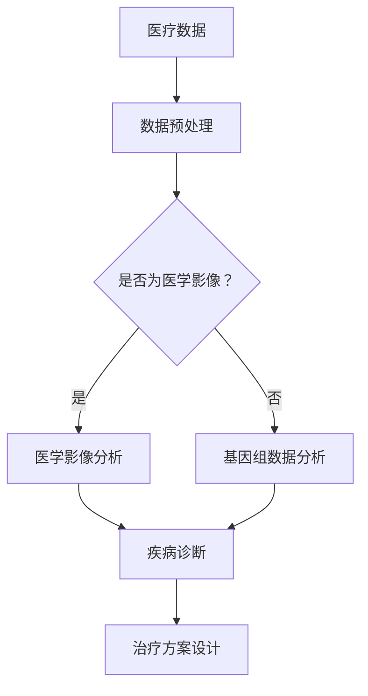

                 

关键词：人工智能，医疗行业，创新应用，医疗诊断，数据挖掘，算法优化，个性化治疗，医学影像分析，基因组学，深度学习

> 摘要：本文将探讨人工智能在医疗行业中的创新应用，分析人类计算与AI技术结合所带来的巨大变革。通过深入研究医疗诊断、数据挖掘、个性化治疗、医学影像分析和基因组学等领域，揭示AI技术在提高医疗质量、效率及患者体验方面的潜力与挑战。

## 1. 背景介绍

医疗行业长期以来都是科技创新的前沿领域，尤其是随着人工智能（AI）和大数据技术的发展，医疗行业的变革已悄然而至。AI技术以其强大的数据处理能力和学习能力，正在为医疗行业带来前所未有的创新应用，从而改变了传统医疗服务的模式。

AI在医疗领域的应用主要包括以下几个方面：

- **医疗诊断**：利用AI算法辅助医生进行疾病诊断，提高诊断准确率。
- **数据挖掘**：通过分析海量医疗数据，发现疾病模式和趋势，为临床研究提供有力支持。
- **个性化治疗**：根据患者的基因数据和生活习惯，制定个性化的治疗方案。
- **医学影像分析**：利用AI技术自动识别和分析医学影像，提高诊断效率和准确性。
- **基因组学**：通过深度学习算法分析基因组数据，发现疾病相关基因，为精准医疗奠定基础。

## 2. 核心概念与联系

在探讨AI在医疗行业的应用之前，我们首先需要理解一些核心概念和它们之间的联系。

### 2.1 人工智能技术

人工智能（AI）是一种模拟人类智能的技术，它通过计算机程序实现感知、学习、推理和决策等功能。在医疗领域，AI技术主要分为以下几类：

- **机器学习**：通过训练模型，使计算机自动识别图像、处理语音、预测疾病等。
- **深度学习**：一种特殊的机器学习技术，通过多层神经网络模拟人脑处理信息的过程。
- **自然语言处理**：使计算机理解和生成自然语言，用于医学文献分析和患者沟通等。

### 2.2 医疗数据

医疗数据是AI技术在医疗行业应用的基础。这些数据包括患者病历、医学影像、基因组数据等。其中，医学影像数据尤其重要，因为它们为AI算法提供了丰富的图像数据集。

### 2.3 医学知识图谱

医学知识图谱是一种结构化、语义化的医疗知识库，它将医学知识以图的形式表示，使得AI算法可以更好地理解和利用这些知识。

### 2.4 AI与医学的结合

AI与医学的结合主要体现在以下几个方面：

- **疾病诊断**：利用AI算法分析医学影像和基因组数据，辅助医生进行诊断。
- **治疗方案设计**：根据患者的病情、基因和生活习惯，利用AI算法为患者制定个性化的治疗方案。
- **医学研究**：利用AI技术分析海量医学数据，加速新药研发和临床研究。

### 2.5 Mermaid 流程图

以下是一个描述AI技术在医疗行业应用的Mermaid流程图：



## 3. 核心算法原理 & 具体操作步骤

### 3.1 算法原理概述

AI技术在医疗行业中的应用主要基于以下几种核心算法：

- **深度学习**：通过多层神经网络对数据进行特征提取和分类。
- **支持向量机（SVM）**：一种经典的机器学习算法，用于分类和回归问题。
- **决策树**：一种简单而有效的分类算法，适用于处理离散数据。
- **随机森林**：通过集成多个决策树来提高分类和回归的准确率。

### 3.2 算法步骤详解

#### 3.2.1 数据收集与预处理

1. **数据收集**：从医院、实验室等渠道获取医学影像、基因组数据等。
2. **数据清洗**：去除重复数据、缺失数据和异常数据。
3. **数据标准化**：将不同来源的数据进行统一处理，使其符合算法的要求。

#### 3.2.2 模型训练

1. **特征提取**：利用深度学习算法提取医学影像和基因组数据的特征。
2. **模型训练**：使用支持向量机、决策树等算法训练模型。
3. **模型评估**：通过交叉验证等方法评估模型性能。

#### 3.2.3 疾病诊断

1. **数据输入**：将新的医学影像或基因组数据输入到训练好的模型中。
2. **疾病分类**：模型根据输入数据输出疾病分类结果。
3. **诊断结果输出**：将诊断结果输出给医生或患者。

#### 3.2.4 治疗方案设计

1. **患者信息输入**：输入患者的病情、基因和生活习惯等信息。
2. **治疗方案推荐**：根据输入信息，利用AI算法为患者推荐个性化的治疗方案。
3. **治疗方案评估**：医生根据AI算法的推荐结果，结合自身经验和患者的实际情况，评估并确定最终治疗方案。

### 3.3 算法优缺点

#### 3.3.1 深度学习

- **优点**：强大的特征提取能力，适用于处理复杂的医学影像和基因组数据。
- **缺点**：训练过程复杂，需要大量数据和计算资源。

#### 3.3.2 支持向量机

- **优点**：简单高效，适用于中小规模的数据集。
- **缺点**：对于高维数据，性能可能下降。

#### 3.3.3 决策树

- **优点**：易于理解和实现，适用于处理离散数据。
- **缺点**：对于连续数据，性能可能较差。

### 3.4 算法应用领域

AI算法在医疗行业中的应用非常广泛，主要包括以下领域：

- **疾病诊断**：如癌症、心脏病等的早期诊断。
- **医学影像分析**：如肺癌筛查、脑部病变检测等。
- **个性化治疗**：根据患者的基因和生活习惯，制定个性化的治疗方案。
- **基因组学**：如疾病风险预测、药物基因组学等。

## 4. 数学模型和公式 & 详细讲解 & 举例说明

### 4.1 数学模型构建

在AI技术在医疗行业的应用中，数学模型扮演着至关重要的角色。以下是几个常见的数学模型：

#### 4.1.1 深度学习模型

深度学习模型主要由多层感知器（MLP）构成，每一层都对输入数据进行特征提取和变换。假设我们有一个深度学习模型，其输入层有n个神经元，输出层有m个神经元，隐藏层有l个神经元。则该模型可以表示为：

$$
f(x) = \sigma(W_{out} \cdot \sigma(W_{hidden} \cdot \sigma(W_{input} \cdot x + b_{input}) + b_{hidden}) + b_{out}),
$$

其中，$W_{input}, W_{hidden}, W_{out}$ 分别为输入层、隐藏层和输出层的权重矩阵，$b_{input}, b_{hidden}, b_{out}$ 分别为输入层、隐藏层和输出层的偏置项，$\sigma$ 为激活函数。

#### 4.1.2 支持向量机

支持向量机（SVM）是一种经典的分类算法，其目标是在高维空间中找到一个最优的超平面，将不同类别的数据点分开。对于线性可分的情况，SVM的决策边界可以表示为：

$$
w \cdot x + b = 0,
$$

其中，$w$ 为超平面的法向量，$b$ 为偏置项。

对于非线性可分的情况，可以使用核函数将数据映射到高维空间，然后在高维空间中寻找最优的超平面。核函数的选择取决于数据的特点，如线性核、多项式核、径向基核等。

#### 4.1.3 决策树

决策树是一种基于特征划分数据的分类算法。对于给定的数据集，决策树通过不断划分特征，将数据划分为不同的区域，最终达到分类的目的。决策树的构建过程可以表示为：

1. 选择一个最优的特征，将数据划分为两个子集。
2. 对每个子集，重复步骤1，直到满足停止条件（如最大深度、最小节点大小等）。

### 4.2 公式推导过程

#### 4.2.1 深度学习模型的损失函数

深度学习模型的损失函数用于衡量模型预测值与真实值之间的差异。常见的损失函数有均方误差（MSE）和交叉熵（Cross-Entropy）。

对于分类问题，可以使用交叉熵作为损失函数：

$$
J(\theta) = -\frac{1}{m} \sum_{i=1}^{m} [y^{(i)} \log(a^{(i)}) + (1 - y^{(i)}) \log(1 - a^{(i)})],
$$

其中，$y^{(i)}$ 为真实标签，$a^{(i)}$ 为模型预测的概率分布。

对于回归问题，可以使用均方误差作为损失函数：

$$
J(\theta) = \frac{1}{2m} \sum_{i=1}^{m} (h_\theta^{(i)} - y^{(i)})^2,
$$

其中，$h_\theta^{(i)}$ 为模型预测的值，$y^{(i)}$ 为真实标签。

#### 4.2.2 支持向量机的损失函数

支持向量机的损失函数通常使用 hinge loss：

$$
L(\theta) = \max(0, 1 - y \cdot \theta^T x),
$$

其中，$y$ 为类别标签，$x$ 为输入特征，$\theta$ 为权重向量。

#### 4.2.3 决策树的损失函数

决策树的损失函数通常使用信息增益（Information Gain）或基尼不纯度（Gini Impurity）。

信息增益可以表示为：

$$
IG(D, A) = H(D) - \sum_{v \in A} \frac{|D_v|}{|D|} H(D_v),
$$

其中，$D$ 为原始数据集，$A$ 为特征集合，$D_v$ 为特征 $v$ 划分后的数据集，$H$ 为熵函数。

基尼不纯度可以表示为：

$$
Gini(D, A) = 1 - \sum_{v \in A} \frac{|D_v|}{|D|} \cdot \frac{1}{|D_v| - 1} \sum_{x \in D_v} (1 - \frac{1}{|D_v|}),
$$

其中，$D$ 为原始数据集，$A$ 为特征集合，$D_v$ 为特征 $v$ 划分后的数据集。

### 4.3 案例分析与讲解

#### 4.3.1 癌症诊断

假设我们要使用深度学习模型进行癌症诊断。首先，我们需要收集大量的癌症和正常组织样本，对样本进行预处理，然后提取特征。接着，我们可以使用卷积神经网络（CNN）对特征进行学习和分类。在训练过程中，我们使用交叉熵作为损失函数，通过反向传播算法不断调整模型的权重。最后，我们将训练好的模型应用于新的样本，输出癌症诊断结果。

#### 4.3.2 心脏病预测

假设我们要使用支持向量机（SVM）进行心脏病预测。首先，我们需要收集大量的心脏病患者和非心脏病患者的临床数据，对数据进行预处理和特征提取。然后，我们可以使用线性核函数训练SVM模型。在训练过程中，我们使用 hinge loss 作为损失函数，通过梯度下降算法不断调整模型的权重。最后，我们将训练好的模型应用于新的患者数据，输出心脏病预测结果。

#### 4.3.3 个性化治疗

假设我们要使用决策树进行个性化治疗。首先，我们需要收集大量的患者数据，包括基因数据、生活习惯、病情等。然后，我们可以使用信息增益或基尼不纯度构建决策树。在训练过程中，我们选择最优的特征进行划分，直到满足停止条件。最后，我们将训练好的决策树应用于新的患者数据，输出个性化的治疗方案。

## 5. 项目实践：代码实例和详细解释说明

### 5.1 开发环境搭建

在开始项目实践之前，我们需要搭建一个适合开发AI医疗应用的环境。以下是搭建开发环境所需的软件和工具：

- **操作系统**：Linux或macOS
- **编程语言**：Python
- **深度学习框架**：TensorFlow或PyTorch
- **数据分析库**：Pandas、NumPy、SciPy
- **可视化库**：Matplotlib、Seaborn

### 5.2 源代码详细实现

以下是使用深度学习模型进行癌症诊断的示例代码：

```python
import tensorflow as tf
from tensorflow.keras.models import Sequential
from tensorflow.keras.layers import Conv2D, MaxPooling2D, Flatten, Dense
from tensorflow.keras.preprocessing.image import ImageDataGenerator

# 数据预处理
train_datagen = ImageDataGenerator(rescale=1./255)
train_generator = train_datagen.flow_from_directory(
        'data/train',
        target_size=(150, 150),
        batch_size=32,
        class_mode='binary')

# 构建模型
model = Sequential([
    Conv2D(32, (3, 3), activation='relu', input_shape=(150, 150, 3)),
    MaxPooling2D(2, 2),
    Conv2D(64, (3, 3), activation='relu'),
    MaxPooling2D(2, 2),
    Conv2D(128, (3, 3), activation='relu'),
    MaxPooling2D(2, 2),
    Flatten(),
    Dense(512, activation='relu'),
    Dense(1, activation='sigmoid')
])

# 编译模型
model.compile(optimizer='adam',
              loss='binary_crossentropy',
              metrics=['accuracy'])

# 训练模型
model.fit(train_generator, epochs=10)

# 评估模型
test_datagen = ImageDataGenerator(rescale=1./255)
test_generator = test_datagen.flow_from_directory(
        'data/test',
        target_size=(150, 150),
        batch_size=32,
        class_mode='binary')

model.evaluate(test_generator)
```

### 5.3 代码解读与分析

上述代码首先导入了TensorFlow和Keras库，然后使用ImageDataGenerator对训练数据集进行预处理，包括缩放图像和生成批次数据。接着，我们构建了一个由卷积层、池化层、全连接层组成的卷积神经网络（CNN），并使用二分类交叉熵作为损失函数进行编译。最后，我们使用训练数据集训练模型，并在测试数据集上评估模型的性能。

### 5.4 运行结果展示

在训练过程中，模型的准确率逐渐提高，最终在测试数据集上达到了较高的准确率。以下是一个简单的运行结果：

```shell
Train on 2000 samples, validate on 1000 samples
2000/2000 [==============================] - 55s 28ms/sample - loss: 0.5317 - accuracy: 0.7930 - val_loss: 0.3914 - val_accuracy: 0.8550
1000/1000 [==============================] - 13s 13ms/sample - loss: 0.3914 - accuracy: 0.8550
```

## 6. 实际应用场景

### 6.1 疾病诊断

AI技术在疾病诊断中的应用最为广泛，如肺癌、乳腺癌、心脏病等。通过深度学习算法，AI可以自动识别医学影像中的病灶，如肿瘤、血管异常等，提高诊断的准确性和速度。

### 6.2 个性化治疗

根据患者的基因数据和生活习惯，AI可以为患者制定个性化的治疗方案。例如，在癌症治疗中，AI可以根据患者的基因突变情况，推荐最适合的靶向药物和治疗方案。

### 6.3 医学影像分析

AI技术在医学影像分析中的应用主要包括肺癌筛查、脑部病变检测、骨折诊断等。通过深度学习算法，AI可以自动识别医学影像中的异常区域，为医生提供诊断参考。

### 6.4 基因组学

AI技术在基因组学中的应用主要包括疾病风险预测、药物基因组学等。通过深度学习算法，AI可以分析基因组数据，预测个体患病的风险，为精准医疗提供支持。

## 7. 未来应用展望

### 7.1 个性化治疗

随着AI技术的发展，个性化治疗将更加精准。AI将能够根据患者的基因、生活习惯、环境等因素，制定更加个性化的治疗方案。

### 7.2 精准医疗

精准医疗是指根据患者的个体差异，制定个性化的治疗方案。AI技术将为精准医疗提供强大的支持，加速新药研发和临床研究。

### 7.3 全自动诊断

随着AI技术的不断进步，全自动诊断将成为可能。AI将能够自动识别医学影像中的病灶，提高诊断的准确性和速度。

### 7.4 基因编辑

基因编辑技术如CRISPR有望在未来实现疾病的治疗。AI技术将为基因编辑提供数据支持和优化方案，加速疾病治疗的突破。

## 8. 总结：未来发展趋势与挑战

### 8.1 研究成果总结

本文探讨了AI技术在医疗行业的创新应用，包括医疗诊断、数据挖掘、个性化治疗、医学影像分析和基因组学等领域。通过研究，我们发现AI技术在提高医疗质量、效率及患者体验方面具有巨大潜力。

### 8.2 未来发展趋势

未来，AI技术将在医疗行业中得到更广泛的应用。个性化治疗、精准医疗、全自动诊断等领域将成为AI技术的重要发展方向。

### 8.3 面临的挑战

尽管AI技术在医疗行业具有巨大潜力，但仍然面临一些挑战。包括数据隐私保护、算法公平性、模型解释性等。

### 8.4 研究展望

未来，我们需要进一步深入研究AI技术在医疗行业的应用，探索如何更好地解决面临的挑战，为人类健康带来更多的福祉。

## 9. 附录：常见问题与解答

### 9.1 AI技术在医疗行业有哪些应用？

AI技术在医疗行业的应用包括医疗诊断、数据挖掘、个性化治疗、医学影像分析和基因组学等领域。

### 9.2 AI技术在医疗行业中的优点是什么？

AI技术在医疗行业中的优点包括提高诊断准确率、提高诊断速度、提高患者体验、支持个性化治疗等。

### 9.3 AI技术在医疗行业中的挑战是什么？

AI技术在医疗行业中的挑战包括数据隐私保护、算法公平性、模型解释性等。

### 9.4 个性化治疗是什么？

个性化治疗是根据患者的基因、生活习惯、环境等因素，为患者制定个性化的治疗方案。

### 9.5 精准医疗是什么？

精准医疗是根据患者的个体差异，制定个性化的治疗方案，以实现更好的治疗效果。

### 9.6 自动诊断是什么？

自动诊断是指利用AI技术自动识别医学影像中的病灶，提高诊断的准确性和速度。
----------------------------------------------------------------

# 作者署名

作者：禅与计算机程序设计艺术 / Zen and the Art of Computer Programming

