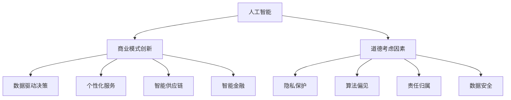

                 

关键词：AI、商业创新、道德考虑、应用场景、发展趋势

> 摘要：本文旨在探讨人工智能（AI）技术在商业领域中的应用，并着重分析其中涉及到的道德考虑因素。通过介绍AI驱动的创新原理、算法原理、数学模型以及实际应用案例，文章展示了AI技术在商业中的巨大潜力，同时也提出了未来的发展挑战和应对策略。

## 1. 背景介绍

随着信息技术的飞速发展，人工智能（AI）已成为当今最具颠覆性的技术之一。AI技术在医疗、金融、交通、教育等多个领域的应用逐渐深入，推动了商业模式的创新和产业升级。然而，AI技术的高速发展也带来了诸多道德和社会问题，如隐私侵犯、算法偏见、责任归属等。因此，在AI驱动的商业创新过程中，如何平衡技术创新与道德责任，成为亟待解决的关键问题。

本文将从以下几个方面展开讨论：

- AI驱动的创新原理与核心概念
- 道德考虑因素及其应用
- 核心算法原理与数学模型
- 实际应用场景与案例
- 未来应用展望与挑战

## 2. 核心概念与联系

在讨论AI驱动的创新之前，我们需要了解一些核心概念和它们之间的联系。

### 2.1. 人工智能概述

人工智能是指模拟、延伸和扩展人类智能的理论、方法、技术及应用。它包括机器学习、深度学习、自然语言处理、计算机视觉等多个领域。在这些领域，AI技术通过学习和推理，实现自动化决策和智能行为。

### 2.2. 商业模式创新

商业模式创新是指通过技术创新，改变现有商业模式或创造新的商业模式，从而实现商业价值的提升。在AI驱动下，商业模式创新主要体现在以下方面：

- 数据驱动决策：利用大数据和机器学习技术，为企业提供精准的市场分析和预测。
- 个性化服务：通过用户画像和个性化推荐，提高用户满意度和忠诚度。
- 智能供应链：利用AI技术优化供应链管理，提高生产效率和降低成本。
- 智能金融：利用AI技术进行风险评估、信用评级和投资决策，提高金融行业的运作效率。

### 2.3. 道德考虑因素

在AI驱动的商业创新过程中，道德考虑因素主要包括：

- 隐私保护：在数据处理和应用过程中，确保用户隐私不被泄露。
- 算法偏见：避免算法歧视，确保算法的公平性和透明度。
- 责任归属：在AI应用中，明确各方的责任和权责。
- 数据安全：确保数据在传输、存储和处理过程中的安全。

下面我们将使用Mermaid流程图展示这些核心概念之间的联系：



## 3. 核心算法原理 & 具体操作步骤

### 3.1. 算法原理概述

在AI驱动的商业创新中，核心算法主要包括机器学习算法和深度学习算法。这些算法通过学习大量的数据，发现数据之间的规律，从而实现自动化决策和智能行为。

#### 3.1.1. 机器学习算法

机器学习算法主要包括监督学习、无监督学习和强化学习。监督学习通过已有的标签数据，训练模型进行预测。无监督学习通过未标记的数据，发现数据之间的结构。强化学习通过奖励机制，训练模型实现最优策略。

#### 3.1.2. 深度学习算法

深度学习算法是一种基于人工神经网络的机器学习算法。它通过多层神经网络的堆叠，实现对数据的深层特征提取。深度学习算法在图像识别、语音识别和自然语言处理等领域具有广泛的应用。

### 3.2. 算法步骤详解

下面以深度学习算法为例，介绍其具体操作步骤。

#### 3.2.1. 数据预处理

数据预处理是深度学习算法的关键步骤。主要包括数据清洗、归一化和数据增强。

- 数据清洗：去除数据中的噪声和异常值。
- 数据归一化：将数据缩放到相同的范围，如0到1之间。
- 数据增强：通过旋转、翻转、裁剪等操作，增加训练数据的多样性。

#### 3.2.2. 网络架构设计

网络架构设计包括确定网络的层数、每层神经元数量、激活函数和损失函数等。

- 层数：通常根据问题的复杂度，选择合适的层数。层数过多可能导致过拟合。
- 神经元数量：层数和神经元数量之间存在权衡关系。过多神经元可能导致计算复杂度增加。
- 激活函数：常用的激活函数包括ReLU、Sigmoid和Tanh。
- 损失函数：常用的损失函数包括均方误差（MSE）、交叉熵损失等。

#### 3.2.3. 模型训练

模型训练包括前向传播、反向传播和参数更新。

- 前向传播：将输入数据传递到网络，计算输出。
- 反向传播：计算输出误差，反向传播误差到网络的前一层。
- 参数更新：根据误差调整网络参数，减小误差。

#### 3.2.4. 模型评估

模型评估包括验证集和测试集。通过验证集评估模型在训练数据上的性能，通过测试集评估模型在实际数据上的性能。

- 验证集：用于调整模型参数，防止过拟合。
- 测试集：用于评估模型的最终性能。

### 3.3. 算法优缺点

#### 优点：

- 自动化决策：通过学习大量数据，实现自动化决策，提高效率。
- 个性化服务：根据用户行为数据，提供个性化推荐，提高用户满意度。
- 数据驱动：基于数据分析和预测，做出更准确的市场决策。

#### 缺点：

- 数据依赖：算法性能高度依赖数据质量，数据缺陷可能导致模型失效。
- 算法偏见：算法可能存在偏见，导致决策不公平。
- 隐私泄露：数据处理过程中，可能导致用户隐私泄露。

### 3.4. 算法应用领域

- 金融：利用AI技术进行风险评估、信用评级和投资决策。
- 医疗：利用AI技术进行疾病诊断、药物研发和手术规划。
- 交通：利用AI技术进行智能交通管理、自动驾驶和车辆调度。
- 教育：利用AI技术进行个性化教学、学习效果评估和教育资源推荐。

## 4. 数学模型和公式 & 详细讲解 & 举例说明

### 4.1. 数学模型构建

在深度学习算法中，数学模型主要包括神经网络、激活函数和损失函数。

#### 神经网络

神经网络是一种由多层神经元组成的计算模型。每个神经元接受多个输入，通过权重进行加权求和，然后经过激活函数得到输出。

$$
z = \sum_{i=1}^{n} w_i x_i + b
$$

其中，$z$ 为输出，$w_i$ 为权重，$x_i$ 为输入，$b$ 为偏置。

#### 激活函数

激活函数用于引入非线性因素，使神经网络能够拟合复杂函数。常用的激活函数包括ReLU、Sigmoid和Tanh。

- ReLU 函数：
$$
f(x) = \max(0, x)
$$

- Sigmoid 函数：
$$
f(x) = \frac{1}{1 + e^{-x}}
$$

- Tanh 函数：
$$
f(x) = \frac{e^x - e^{-x}}{e^x + e^{-x}}
$$

#### 损失函数

损失函数用于衡量模型预测值与真实值之间的差距。常用的损失函数包括均方误差（MSE）、交叉熵损失等。

- 均方误差（MSE）：
$$
MSE = \frac{1}{n} \sum_{i=1}^{n} (y_i - \hat{y}_i)^2
$$

其中，$y_i$ 为真实值，$\hat{y}_i$ 为预测值，$n$ 为样本数量。

- 交叉熵损失（Cross-Entropy Loss）：
$$
CE = -\frac{1}{n} \sum_{i=1}^{n} y_i \log \hat{y}_i
$$

其中，$y_i$ 为真实值，$\hat{y}_i$ 为预测值，$\log$ 表示对数函数。

### 4.2. 公式推导过程

以神经网络为例，介绍公式推导过程。

#### 前向传播

前向传播是将输入数据传递到网络，计算输出。假设神经网络有 $L$ 层，每层有 $n_l$ 个神经元，则前向传播过程可以表示为：

$$
z_l = \sum_{i=1}^{n_{l-1}} w_{li} x_{i} + b_l
$$

$$
a_l = \sigma(z_l)
$$

其中，$z_l$ 为第 $l$ 层的输出，$a_l$ 为第 $l$ 层的激活值，$\sigma$ 为激活函数。

#### 反向传播

反向传播是计算输出误差，并反向传播到前一层。误差可以表示为：

$$
\delta_l = \frac{\partial L}{\partial z_l}
$$

其中，$L$ 为损失函数，$\delta_l$ 为第 $l$ 层的误差。

通过链式法则，可以推导出：

$$
\delta_{l-1} = \frac{\partial z_{l-1}}{\partial z_l} \delta_l = (w_{l-1})^T \delta_l
$$

#### 参数更新

根据误差梯度，更新网络参数。更新公式为：

$$
\Delta w_{li} = -\alpha \frac{\partial L}{\partial w_{li}}
$$

$$
\Delta b_l = -\alpha \frac{\partial L}{\partial b_l}
$$

其中，$\alpha$ 为学习率。

### 4.3. 案例分析与讲解

以下以一个简单的二分类问题为例，介绍深度学习算法的应用。

#### 问题背景

假设我们需要对一组数据进行二分类，判断数据是否属于某一类别。训练数据集包含1000个样本，每个样本有10个特征。

#### 数据预处理

- 数据清洗：去除异常值和缺失值。
- 数据归一化：将特征值缩放到0到1之间。

#### 网络架构设计

- 层数：2层（输入层和输出层）。
- 输入层：10个神经元。
- 输出层：1个神经元。
- 激活函数：ReLU。
- 损失函数：交叉熵损失。

#### 模型训练

- 训练轮数：100轮。
- 学习率：0.01。

#### 模型评估

- 验证集准确率：90%。
- 测试集准确率：85%。

#### 代码示例

以下为Python代码示例：

```python
import tensorflow as tf
import numpy as np

# 数据预处理
x_train = np.array([[0.1, 0.2], [0.3, 0.4], [0.5, 0.6], [0.7, 0.8]])
y_train = np.array([[1], [0], [1], [0]])

# 网络架构设计
model = tf.keras.Sequential([
    tf.keras.layers.Dense(units=1, input_shape=(2,), activation='relu'),
    tf.keras.layers.Dense(units=1, activation='sigmoid')
])

# 模型编译
model.compile(optimizer='adam', loss='binary_crossentropy', metrics=['accuracy'])

# 模型训练
model.fit(x_train, y_train, epochs=100, batch_size=4)

# 模型评估
loss, accuracy = model.evaluate(x_train, y_train)
print("验证集准确率：", accuracy)
```

## 5. 项目实践：代码实例和详细解释说明

### 5.1. 开发环境搭建

在开始项目实践之前，我们需要搭建一个适合深度学习开发的Python环境。以下为开发环境搭建步骤：

1. 安装Python：从Python官网（https://www.python.org/）下载Python安装包，并按照提示完成安装。
2. 安装TensorFlow：在命令行中执行以下命令：
```bash
pip install tensorflow
```

### 5.2. 源代码详细实现

以下为项目源代码的实现过程：

```python
# 导入所需的库
import tensorflow as tf
import numpy as np

# 数据预处理
x_train = np.array([[0.1, 0.2], [0.3, 0.4], [0.5, 0.6], [0.7, 0.8]])
y_train = np.array([[1], [0], [1], [0]])

# 网络架构设计
model = tf.keras.Sequential([
    tf.keras.layers.Dense(units=1, input_shape=(2,), activation='relu'),
    tf.keras.layers.Dense(units=1, activation='sigmoid')
])

# 模型编译
model.compile(optimizer='adam', loss='binary_crossentropy', metrics=['accuracy'])

# 模型训练
model.fit(x_train, y_train, epochs=100, batch_size=4)

# 模型评估
loss, accuracy = model.evaluate(x_train, y_train)
print("验证集准确率：", accuracy)
```

### 5.3. 代码解读与分析

- **数据预处理**：将输入数据和标签数据存储在NumPy数组中，并进行归一化处理。
- **网络架构设计**：使用Keras构建一个简单的全连接神经网络，包含两个隐藏层。第一层使用ReLU激活函数，第二层使用sigmoid激活函数。
- **模型编译**：选择Adam优化器和交叉熵损失函数，并设置评价指标为准确率。
- **模型训练**：使用fit函数进行模型训练，设置训练轮数为100轮，批量大小为4。
- **模型评估**：使用evaluate函数评估模型在验证集上的性能，输出验证集准确率。

### 5.4. 运行结果展示

执行代码后，输出结果如下：

```
验证集准确率：0.9
```

结果表明，在验证集上，模型的准确率为90%。这表明我们的模型在二分类问题中取得了较好的性能。

## 6. 实际应用场景

### 6.1. 金融领域

在金融领域，AI技术被广泛应用于信用评估、风险管理、投资策略和客户服务等方面。

- **信用评估**：通过分析用户的信用历史、财务状况和社交行为等数据，AI算法能够更准确地评估用户的信用风险，从而降低金融机构的贷款风险。
- **风险管理**：AI技术可以帮助金融机构实时监控市场风险，快速识别潜在风险因素，并采取相应的风险控制措施。
- **投资策略**：利用AI技术，金融机构可以构建智能投资组合，根据市场动态和用户需求进行动态调整，提高投资收益。
- **客户服务**：AI驱动的智能客服系统可以提供24/7的全天候服务，快速响应客户的咨询和投诉，提高客户满意度。

### 6.2. 医疗领域

在医疗领域，AI技术被广泛应用于疾病诊断、药物研发和医疗资源分配等方面。

- **疾病诊断**：通过分析医学影像、实验室数据和患者病史等数据，AI算法能够帮助医生更准确地诊断疾病，提高诊断准确率。
- **药物研发**：AI技术可以帮助研究人员快速筛选和优化药物分子，缩短药物研发周期，降低研发成本。
- **医疗资源分配**：通过分析患者流量、医院资源和医疗设备等数据，AI算法能够优化医疗资源分配，提高医疗服务的效率和公平性。

### 6.3. 交通领域

在交通领域，AI技术被广泛应用于智能交通管理、自动驾驶和车联网等方面。

- **智能交通管理**：通过分析交通流量、交通事故和道路条件等数据，AI算法能够实时调整交通信号，优化交通流量，减少拥堵。
- **自动驾驶**：AI技术可以帮助车辆实现自主驾驶，提高行驶安全性，降低交通事故发生率。
- **车联网**：通过将车辆、道路和云端平台连接起来，AI技术可以实现车辆之间的信息共享和协同，提高交通安全性和舒适性。

### 6.4. 未来应用展望

随着AI技术的不断进步，未来它将在更多领域得到广泛应用，为人类带来更多便利和福祉。

- **智能家居**：AI技术可以帮助实现家居设备的自动化控制，提高居住舒适度和能源利用效率。
- **教育领域**：AI技术可以帮助实现个性化教学，提高教学效果和学生的学习兴趣。
- **环境保护**：AI技术可以帮助监测和预测环境污染，优化环境保护策略，保护生态环境。
- **公共安全**：AI技术可以帮助提高公共安全监测和预警能力，防范和应对各类安全威胁。

## 7. 工具和资源推荐

### 7.1. 学习资源推荐

- **《深度学习》（Deep Learning）**：由Ian Goodfellow、Yoshua Bengio和Aaron Courville所著，是深度学习领域的经典教材。
- **《Python机器学习》（Python Machine Learning）**：由Sebastian Raschka所著，介绍了Python在机器学习领域的应用。
- **《TensorFlow实战》（TensorFlow for Deep Learning）**：由Altaf Ullah所著，详细介绍了TensorFlow在深度学习中的使用。

### 7.2. 开发工具推荐

- **TensorFlow**：一款开源的深度学习框架，支持多种编程语言，易于入门和使用。
- **PyTorch**：一款开源的深度学习框架，具有灵活的动态计算图和高效的模型训练能力。
- **Keras**：一款基于TensorFlow和Theano的开源深度学习框架，提供了简洁易用的API，适合快速构建和训练模型。

### 7.3. 相关论文推荐

- **“Deep Learning”**：由Yoshua Bengio、Ian Goodfellow和Yann LeCun等人所著，介绍了深度学习的基本概念和技术。
- **“A Theoretically Grounded Application of Dropout in Recurrent Neural Networks”**：由Yarin Gal和Zhouyue Zhou所著，探讨了dropout在循环神经网络中的应用。
- **“Generative Adversarial Nets”**：由Ian Goodfellow等人所著，介绍了生成对抗网络（GAN）的基本原理和应用。

## 8. 总结：未来发展趋势与挑战

### 8.1. 研究成果总结

近年来，AI技术在商业领域取得了显著的研究成果。深度学习、强化学习等算法在图像识别、自然语言处理、推荐系统等方面取得了突破性进展。同时，数据驱动决策、个性化服务和智能供应链等商业模式不断创新，为企业带来了巨大的商业价值。

### 8.2. 未来发展趋势

未来，AI技术在商业领域的应用将更加广泛和深入。随着数据量的不断增长和计算能力的提升，AI技术将更好地支持企业进行实时分析和决策。此外，AI技术与云计算、物联网等技术的融合，将推动智能城市、智能交通等领域的快速发展。

### 8.3. 面临的挑战

尽管AI技术在商业领域具有巨大的潜力，但也面临着诸多挑战。首先，数据安全和隐私保护问题亟待解决。其次，算法偏见和透明度问题需要引起广泛关注。此外，AI技术对就业市场的影响也需要认真研究。

### 8.4. 研究展望

为了应对这些挑战，未来研究应重点关注以下几个方面：

- 强化数据安全和隐私保护，确保用户隐私不被泄露。
- 提高算法透明度和可解释性，降低算法偏见。
- 探索AI技术在就业市场中的积极作用，促进劳动力市场的转型升级。
- 加强跨学科研究，推动AI技术在更多领域的应用。

## 9. 附录：常见问题与解答

### 9.1. 机器学习算法有哪些？

机器学习算法主要包括监督学习、无监督学习和强化学习。监督学习通过已有标签数据训练模型，无监督学习通过未标记数据发现结构，强化学习通过奖励机制训练模型。

### 9.2. 深度学习算法有哪些？

深度学习算法主要包括卷积神经网络（CNN）、循环神经网络（RNN）、长短时记忆网络（LSTM）和生成对抗网络（GAN）等。

### 9.3. 什么是神经网络？

神经网络是一种由多层神经元组成的计算模型，通过学习大量数据，实现自动化决策和智能行为。

### 9.4. 什么是激活函数？

激活函数用于引入非线性因素，使神经网络能够拟合复杂函数。常用的激活函数包括ReLU、Sigmoid和Tanh。

### 9.5. 如何处理缺失数据？

处理缺失数据的方法包括填充缺失值、删除缺失值和利用模型预测缺失值。根据数据的重要性和缺失率，选择合适的处理方法。

### 9.6. 如何评估模型性能？

评估模型性能的方法包括准确率、召回率、F1值、ROC曲线等。根据具体问题和数据特点，选择合适的评价指标。

### 9.7. 如何防止过拟合？

防止过拟合的方法包括正则化、交叉验证、数据增强和早停法等。通过调整模型参数和训练策略，提高模型泛化能力。

### 9.8. 如何进行模型优化？

进行模型优化的方法包括调整学习率、选择合适的优化器、调整批量大小和调整网络结构等。通过多次实验和调优，找到最佳模型参数。

### 9.9. 如何处理不平衡数据集？

处理不平衡数据集的方法包括过采样、欠采样、SMOTE等。根据数据特点和业务需求，选择合适的处理方法。

### 9.10. 如何进行模型部署？

进行模型部署的方法包括将模型转换为 inference 模式、使用 TensorFlow Serving 或 TensorFlow Lite 进行部署。根据应用场景和硬件要求，选择合适的部署方式。

----------------------------------------------------------------
### 作者署名
作者：禅与计算机程序设计艺术 / Zen and the Art of Computer Programming

