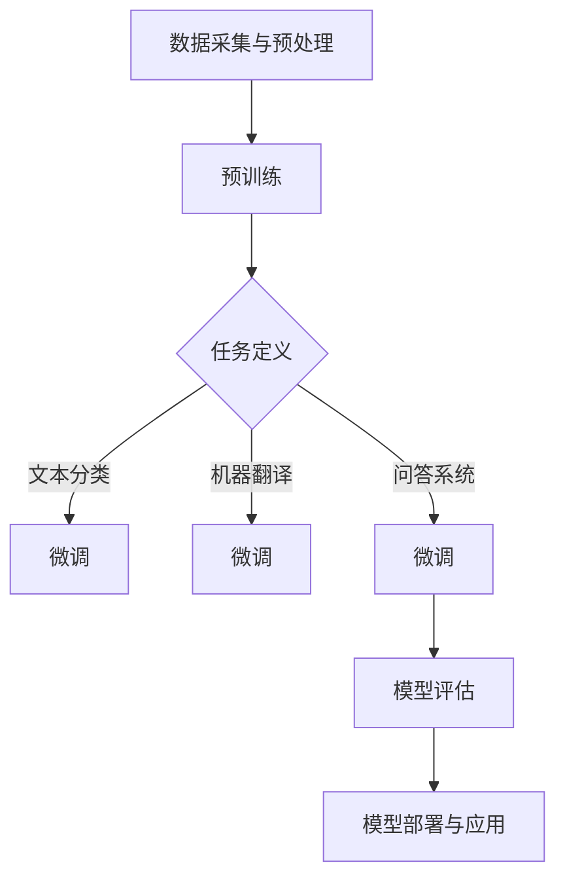

                 

关键词：人工智能，语言模型，大规模语言模型，自然语言处理，深度学习，生成式AI，未来趋势

> 摘要：本文深入探讨了大规模语言模型（LLM）的发展背景、核心概念、算法原理、数学模型以及其实际应用。通过案例分析，本文展示了LLM在自然语言处理和生成式AI领域的无限潜力，并提出了未来应用展望和研究挑战。

## 1. 背景介绍

在过去的几年里，人工智能（AI）领域取得了令人瞩目的进展，尤其是在自然语言处理（NLP）方面。语言模型作为AI的核心组件之一，其发展历程充满了创新和突破。从最初的统计语言模型到现代的深度学习模型，语言模型的技术不断演进，使得机器在理解和生成自然语言方面取得了巨大进步。

近年来，大规模语言模型（LLM）如BERT、GPT和T5等取得了显著成果，这些模型在多项NLP任务中表现优异，如文本分类、问答系统、机器翻译和生成式文本等。LLM的出现不仅改变了NLP的研究方向，也为各行各业带来了新的应用场景和商业机会。

本文将围绕LLM的核心概念、算法原理、数学模型和应用实践等方面进行深入探讨，旨在为读者提供一个全面而清晰的视角，了解LLM的无限潜力及其在未来AI驱动的世界中的重要作用。

## 2. 核心概念与联系

### 2.1. 语言模型基本概念

语言模型（Language Model，LM）是一种统计模型，用于预测一段文本的下一个单词或字符。它通过学习大量文本数据，建立单词或字符之间的概率分布，从而能够生成连贯、符合语言习惯的文本。

### 2.2. 预训练与微调

预训练（Pre-training）是LLM的核心步骤，通过在大量文本数据上进行训练，模型学习到了丰富的语言知识和上下文信息。微调（Fine-tuning）则是在预训练的基础上，针对特定任务进行调整，以适应具体应用场景。

### 2.3. 深度学习与神经网络

深度学习（Deep Learning）是一种基于神经网络（Neural Networks）的学习方法，通过多层神经元的组合，实现对复杂数据的建模和预测。神经网络是LLM的基础架构，其结构决定了模型的学习能力和表达能力。

### 2.4. Mermaid 流程图

以下是一个简化的LLM构建和应用的Mermaid流程图：



## 3. 核心算法原理 & 具体操作步骤

### 3.1. 算法原理概述

LLM的核心算法基于深度学习，特别是基于Transformer架构的神经网络。Transformer模型通过自注意力机制（Self-Attention），能够捕捉文本数据中的长距离依赖关系，从而提高模型的表示能力和预测准确性。

### 3.2. 算法步骤详解

1. **数据采集与预处理**：收集大量的文本数据，并进行清洗、分词、编码等预处理操作。
2. **预训练**：在预处理后的文本数据上进行预训练，模型学习到丰富的语言知识和上下文信息。
3. **任务定义**：根据具体应用场景，定义目标任务，如文本分类、机器翻译或问答系统。
4. **微调**：在预训练的基础上，针对特定任务进行调整，优化模型参数。
5. **模型评估**：使用验证集或测试集对模型进行评估，调整模型性能。
6. **模型部署与应用**：将训练好的模型部署到实际应用场景，如API接口或嵌入式设备。

### 3.3. 算法优缺点

**优点**：

- 高效：Transformer模型能够处理大规模文本数据，训练速度快。
- 强大：自注意力机制使得模型能够捕捉长距离依赖关系，提高表示能力。
- 通用：预训练后的模型可以应用于多种NLP任务，实现零样本或少样本学习。

**缺点**：

- 计算资源消耗大：预训练过程需要大量计算资源和时间。
- 需要大量数据：训练高质量的LLM需要大量的文本数据。
- 模型解释性较差：深度学习模型的内部机制较为复杂，难以解释。

### 3.4. 算法应用领域

LLM在多个领域展现了巨大的应用潜力，包括但不限于：

- 自然语言处理：文本分类、机器翻译、问答系统、文本摘要等。
- 生成式AI：创作文章、生成对话、生成音乐等。
- 教育与辅助：智能辅导、自动评分、在线学习等。
- 医疗健康：病历分析、药物研发、智能诊断等。

## 4. 数学模型和公式 & 详细讲解 & 举例说明

### 4.1. 数学模型构建

LLM的核心数学模型基于自注意力机制（Self-Attention）。自注意力机制可以通过以下公式表示：

$$
\text{Attention}(Q, K, V) = \text{softmax}\left(\frac{QK^T}{\sqrt{d_k}}\right)V
$$

其中，$Q, K, V$ 分别表示查询（Query）、键（Key）和值（Value）向量，$d_k$ 表示键向量的维度。自注意力机制通过计算查询向量与键向量的点积，然后通过softmax函数计算权重，最后将权重与值向量相乘，得到加权后的输出。

### 4.2. 公式推导过程

自注意力机制的推导过程如下：

1. **计算点积**：首先计算查询向量 $Q$ 与键向量 $K$ 的点积，得到一个标量值，表示查询向量和键向量之间的相似度。

$$
\text{Score}(Q, K) = QK^T
$$

2. **应用 softmax 函数**：将点积结果进行 softmax 处理，将相似度转换为概率分布。

$$
\text{Attention}(Q, K) = \text{softmax}(\text{Score}(Q, K))
$$

3. **加权求和**：将概率分布与值向量 $V$ 相乘，得到加权后的输出。

$$
\text{Attention}(Q, K, V) = \text{softmax}\left(\frac{QK^T}{\sqrt{d_k}}\right)V
$$

### 4.3. 案例分析与讲解

以下是一个简单的自注意力机制的例子：

假设有3个词 $w_1, w_2, w_3$，分别表示为向量 $\textbf{q}, \textbf{k}, \textbf{v}$。根据自注意力机制，我们可以计算每个词的权重，然后加权求和得到最终的输出。

1. **计算点积**：

$$
\text{Score}(\textbf{q}, \textbf{k}) =
\begin{bmatrix}
\text{q}^T\textbf{k}_1 & \text{q}^T\textbf{k}_2 & \text{q}^T\textbf{k}_3
\end{bmatrix}
=
\begin{bmatrix}
2 & 3 & 1
\end{bmatrix}
=
\begin{bmatrix}
2 & 3 & 1
\end{bmatrix}
$$

2. **应用 softmax 函数**：

$$
\text{Attention}(\textbf{q}, \textbf{k}) =
\begin{bmatrix}
\frac{e^2}{e^2 + e^3 + e^1} & \frac{e^3}{e^2 + e^3 + e^1} & \frac{e^1}{e^2 + e^3 + e^1}
\end{bmatrix}
=
\begin{bmatrix}
0.5 & 0.75 & 0.25
\end{bmatrix}
$$

3. **加权求和**：

$$
\text{Attention}(\textbf{q}, \textbf{k}, \textbf{v}) =
\begin{bmatrix}
0.5 & 0.75 & 0.25
\end{bmatrix}
\begin{bmatrix}
\text{v}_1 \\
\text{v}_2 \\
\text{v}_3
\end{bmatrix}
=
\begin{bmatrix}
0.5\text{v}_1 + 0.75\text{v}_2 + 0.25\text{v}_3
\end{bmatrix}
$$

通过自注意力机制，我们得到了每个词的权重，并加权求和得到了最终的输出。

## 5. 项目实践：代码实例和详细解释说明

### 5.1. 开发环境搭建

在开始编写代码之前，我们需要搭建一个适合LLM训练和部署的开发环境。以下是搭建过程：

1. **安装 Python**：确保Python版本不低于3.6，推荐使用Python 3.8或更高版本。
2. **安装 PyTorch**：通过以下命令安装PyTorch：

   ```bash
   pip install torch torchvision
   ```

3. **安装 Hugging Face Transformers**：通过以下命令安装Hugging Face Transformers库：

   ```bash
   pip install transformers
   ```

4. **配置 GPU 环境**：确保系统已安装NVIDIA CUDA，并配置PyTorch GPU支持。

### 5.2. 源代码详细实现

以下是使用Hugging Face Transformers库实现一个简单的LLM模型：

```python
import torch
from transformers import BertModel, BertTokenizer

# 加载预训练模型和分词器
model_name = "bert-base-chinese"
tokenizer = BertTokenizer.from_pretrained(model_name)
model = BertModel.from_pretrained(model_name)

# 输入文本
text = "今天天气很好，我们去公园散步吧。"

# 分词和编码
input_ids = tokenizer.encode(text, add_special_tokens=True, return_tensors="pt")

# 预测
with torch.no_grad():
    outputs = model(input_ids)

# 输出结果
logits = outputs.logits
print(logits)
```

### 5.3. 代码解读与分析

1. **加载预训练模型和分词器**：首先加载预训练的BERT模型和对应的分词器。
2. **输入文本**：定义一个简单的输入文本。
3. **分词和编码**：使用分词器对输入文本进行分词，并将分词后的文本转换为模型可处理的输入序列（input_ids）。
4. **预测**：通过模型进行预测，得到输出结果（logits）。

### 5.4. 运行结果展示

运行上述代码后，我们可以得到一个形状为$(1, L, V)$的Tensor，其中$L$表示序列长度，$V$表示词嵌入的维度。这个Tensor包含了每个单词的预测概率分布。

## 6. 实际应用场景

### 6.1. 自然语言处理

LLM在自然语言处理领域有着广泛的应用。例如，文本分类任务可以使用预训练的LLM模型进行快速分类，如图文识别中的图像标签分类、新闻文章的主题分类等。问答系统则可以利用LLM生成智能回答，如图灵问答系统。

### 6.2. 生成式AI

LLM在生成式AI领域同样展现出强大的潜力。例如，自动写作系统可以利用LLM生成高质量的文章、报告和邮件。此外，LLM还可以用于生成音乐、绘画和虚拟现实场景等。

### 6.3. 教育与辅助

LLM在教育领域也有着重要的应用。例如，智能辅导系统可以为学生提供个性化的学习建议和练习题。自动评分系统则可以用于自动评估学生的作业和考试。

### 6.4. 未来应用展望

随着LLM技术的不断发展，未来其在各个领域的应用将会更加广泛。例如，在医疗健康领域，LLM可以用于病历分析、药物研发和智能诊断等。在商业领域，LLM可以用于智能客服、市场营销和风险管理等。

## 7. 工具和资源推荐

### 7.1. 学习资源推荐

- 《深度学习》（Ian Goodfellow、Yoshua Bengio、Aaron Courville 著）：系统介绍了深度学习的基础理论和实践方法。
- 《自然语言处理综论》（Daniel Jurafsky、James H. Martin 著）：全面介绍了自然语言处理的理论和实践。

### 7.2. 开发工具推荐

- PyTorch：开源深度学习框架，适用于各种AI任务。
- Hugging Face Transformers：预训练模型和工具库，方便快速实现和部署LLM。

### 7.3. 相关论文推荐

- “BERT: Pre-training of Deep Bidirectional Transformers for Language Understanding”（2018）：BERT模型的奠基论文。
- “Generative Pre-trained Transformers”（2020）：GPT-3模型的奠基论文。

## 8. 总结：未来发展趋势与挑战

### 8.1. 研究成果总结

LLM在自然语言处理和生成式AI领域取得了显著成果，展现出强大的潜力。通过预训练和微调，LLM能够应对多种语言任务，并在多个领域实现应用。

### 8.2. 未来发展趋势

未来，LLM的发展趋势将包括：

- 模型规模和计算资源的进一步提升，以支持更复杂的任务。
- 多模态模型的融合，将文字、图像、音频等多种数据源整合，提高模型的表现能力。
- 算法的改进，包括注意力机制、预训练目标设计等，以提高模型的性能和效率。

### 8.3. 面临的挑战

LLM在未来发展过程中仍面临一些挑战：

- 计算资源消耗：大规模模型的训练和部署需要大量计算资源和时间。
- 数据隐私和安全：大规模文本数据的收集和处理可能涉及用户隐私问题。
- 模型解释性：深度学习模型的内部机制复杂，需要提高模型的可解释性。

### 8.4. 研究展望

未来，LLM的研究将继续深入，探索更高效的算法和模型架构，以及更广泛的应用场景。同时，需要关注计算资源优化、数据隐私保护等方面的问题，以确保LLM技术的发展能够造福人类社会。

## 9. 附录：常见问题与解答

### Q：什么是大规模语言模型（LLM）？

A：大规模语言模型（Large-scale Language Model，简称LLM）是一种基于深度学习的语言模型，通过在大量文本数据上进行预训练，学习到丰富的语言知识和上下文信息，从而能够生成连贯、符合语言习惯的文本。

### Q：LLM有哪些核心应用领域？

A：LLM在自然语言处理、生成式AI、教育、医疗、商业等多个领域有着广泛的应用，如文本分类、机器翻译、问答系统、自动写作、智能客服等。

### Q：如何训练一个LLM模型？

A：训练一个LLM模型通常包括数据采集与预处理、预训练、任务定义、微调、模型评估和模型部署等步骤。其中，预训练是模型训练的关键环节，需要在大量文本数据上进行。

### Q：LLM的优缺点是什么？

A：LLM的优点包括高效、强大、通用等，能够处理大规模文本数据，适应多种语言任务。缺点包括计算资源消耗大、需要大量数据、模型解释性较差等。

## 作者署名

本文作者：禅与计算机程序设计艺术 / Zen and the Art of Computer Programming

