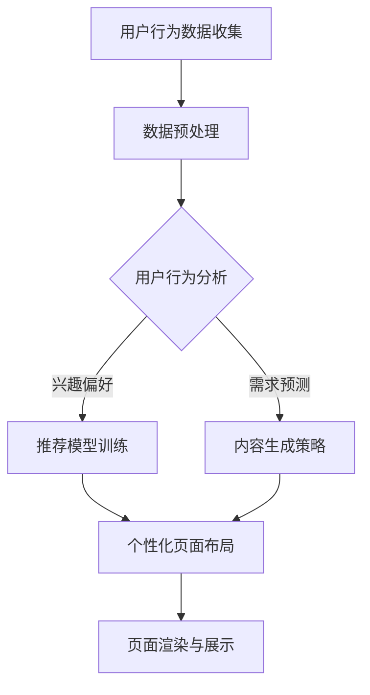

                 

关键词：AI、电商平台、个性化页面、动态生成、用户行为分析、深度学习、推荐系统

> 摘要：本文旨在探讨如何利用人工智能技术，特别是深度学习和用户行为分析，实现电商平台的个性化页面布局与内容动态生成。通过分析用户行为数据，构建推荐模型，并结合自然语言处理和图像识别技术，实现个性化推荐，提高用户体验和转化率。

## 1. 背景介绍

随着互联网技术的飞速发展，电商平台已经成为人们日常生活中不可或缺的一部分。然而，随着竞争的加剧，如何吸引并留住用户成为各大电商平台亟待解决的问题。传统的页面布局和内容生成方式已经无法满足用户日益增长的需求，因此，个性化页面布局与内容动态生成成为电商平台提升用户体验和竞争力的重要手段。

个性化页面布局与内容动态生成旨在根据用户的行为数据、兴趣偏好等信息，为每位用户定制专属的页面内容和布局。这不仅能够提高用户对电商平台的满意度，还能有效提升用户的购物体验和转化率。

## 2. 核心概念与联系

为了实现个性化页面布局与内容动态生成，我们需要了解以下几个核心概念：

### 2.1 用户行为分析

用户行为分析是指通过收集用户在电商平台上的行为数据（如浏览、搜索、购买等），分析用户的兴趣偏好和需求，从而为用户提供个性化推荐。

### 2.2 深度学习

深度学习是一种基于人工神经网络的机器学习技术，通过多层神经网络的结构，能够自动从大量数据中学习特征，并实现复杂的模式识别。

### 2.3 推荐系统

推荐系统是一种利用用户行为数据和物品特征信息，为用户提供个性化推荐的系统。常见的推荐算法包括基于内容的推荐、协同过滤推荐和深度学习推荐等。

### 2.4 自然语言处理

自然语言处理（NLP）是一种将自然语言与计算机语言相互转换的技术，广泛应用于语音识别、机器翻译、情感分析等领域。

### 2.5 图像识别

图像识别是一种通过计算机视觉技术，对图像进行分析和处理，从而识别出图像中的物体、场景和内容的技术。

下面是一个用于描述个性化页面布局与内容动态生成架构的 Mermaid 流程图：



## 3. 核心算法原理 & 具体操作步骤

### 3.1 算法原理概述

个性化页面布局与内容动态生成的核心算法主要涉及用户行为分析、推荐系统和内容生成策略。

#### 3.1.1 用户行为分析

用户行为分析算法基于深度学习技术，通过对用户行为数据（如浏览记录、搜索关键词、购买历史等）进行特征提取和模式识别，构建用户兴趣模型。

#### 3.1.2 推荐系统

推荐系统采用深度学习算法，根据用户兴趣模型和物品特征信息，生成个性化推荐列表。

#### 3.1.3 内容生成策略

内容生成策略主要利用自然语言处理和图像识别技术，根据用户兴趣和推荐结果，生成个性化的商品描述、图片和广告文案。

### 3.2 算法步骤详解

#### 3.2.1 用户行为数据收集与预处理

1. 收集用户在电商平台上的行为数据，如浏览记录、搜索关键词、购买历史等。
2. 对收集到的数据进行清洗、去重和标准化处理。

#### 3.2.2 用户行为分析

1. 利用深度学习算法（如卷积神经网络、循环神经网络等）对用户行为数据进行特征提取和模式识别。
2. 构建用户兴趣模型，包括兴趣标签、兴趣权重等。

#### 3.2.3 推荐模型训练

1. 收集商品特征数据，如商品类别、价格、品牌等。
2. 利用用户兴趣模型和商品特征信息，训练深度学习推荐模型（如基于内容的推荐、协同过滤推荐等）。

#### 3.2.4 内容生成策略

1. 根据用户兴趣和推荐结果，利用自然语言处理和图像识别技术，生成个性化的商品描述、图片和广告文案。
2. 对生成的商品描述和图片进行优化和调整，以提高用户体验和转化率。

#### 3.2.5 个性化页面布局与内容动态生成

1. 根据用户兴趣模型和推荐结果，为每位用户生成个性化的页面布局和内容。
2. 利用前端技术（如HTML、CSS、JavaScript等），实现个性化页面的渲染和展示。

### 3.3 算法优缺点

#### 优点

1. 提高用户体验和满意度：通过个性化页面布局和内容动态生成，为每位用户呈现个性化的内容，提高用户对电商平台的满意度和忠诚度。
2. 提高转化率：个性化推荐和内容生成能够更精准地满足用户需求，提高用户的购买意愿和转化率。

#### 缺点

1. 数据依赖性较强：个性化页面布局和内容动态生成依赖于用户行为数据，数据质量和数量直接影响算法效果。
2. 计算资源消耗大：深度学习和推荐系统算法通常需要大量的计算资源和时间，对服务器性能有较高要求。

### 3.4 算法应用领域

个性化页面布局与内容动态生成算法广泛应用于电商平台、社交媒体、在线教育等领域，具有广泛的应用前景。

## 4. 数学模型和公式 & 详细讲解 & 举例说明

### 4.1 数学模型构建

#### 4.1.1 用户兴趣模型

用户兴趣模型可以用一个矩阵表示，其中行表示用户，列表示兴趣标签。矩阵中的元素表示用户对对应兴趣标签的兴趣度。

$$
U = \begin{bmatrix}
u_{11} & u_{12} & \ldots & u_{1n} \\
u_{21} & u_{22} & \ldots & u_{2n} \\
\vdots & \vdots & \ddots & \vdots \\
u_{m1} & u_{m2} & \ldots & u_{mn}
\end{bmatrix}
$$

其中，$u_{ij}$ 表示用户 $u_i$ 对兴趣标签 $t_j$ 的兴趣度。

#### 4.1.2 商品特征矩阵

商品特征矩阵可以用一个矩阵表示，其中行表示商品，列表示商品特征。矩阵中的元素表示商品对应的特征值。

$$
V = \begin{bmatrix}
v_{11} & v_{12} & \ldots & v_{1n} \\
v_{21} & v_{22} & \ldots & v_{2n} \\
\vdots & \vdots & \ddots & \vdots \\
v_{m1} & v_{m2} & \ldots & v_{mn}
\end{bmatrix}
$$

其中，$v_{ij}$ 表示商品 $v_i$ 对应特征 $t_j$ 的特征值。

### 4.2 公式推导过程

#### 4.2.1 用户兴趣度计算

用户兴趣度可以通过用户行为数据和学习算法计算得到。假设我们使用基于矩阵分解的协同过滤算法，用户 $u_i$ 对兴趣标签 $t_j$ 的兴趣度计算公式如下：

$$
u_{ij} = \sum_{k=1}^n v_{ik}u_{kj}
$$

其中，$v_{ik}$ 表示商品 $v_i$ 对应特征 $t_k$ 的特征值，$u_{kj}$ 表示用户 $u_k$ 对兴趣标签 $t_j$ 的兴趣度。

#### 4.2.2 商品推荐计算

根据用户兴趣度计算结果，我们可以为用户 $u_i$ 推荐商品。假设我们使用基于内容的推荐算法，商品 $v_j$ 的推荐分值计算公式如下：

$$
s_{ij} = \sum_{k=1}^n v_{jk}u_{ik}
$$

其中，$v_{jk}$ 表示商品 $v_j$ 对应特征 $t_k$ 的特征值，$u_{ik}$ 表示用户 $u_i$ 对兴趣标签 $t_k$ 的兴趣度。

### 4.3 案例分析与讲解

假设我们有一个用户行为数据集，其中包含 10 个用户和 5 个兴趣标签。用户的行为数据如下表所示：

| 用户ID | 兴趣标签1 | 兴趣标签2 | 兴趣标签3 | 兴趣标签4 | 兴趣标签5 |
| ------ | -------- | -------- | -------- | -------- | -------- |
| 1      | 1        | 0        | 0        | 1        | 0        |
| 2      | 0        | 1        | 0        | 0        | 1        |
| 3      | 1        | 1        | 1        | 1        | 0        |
| 4      | 0        | 1        | 1        | 0        | 1        |
| 5      | 1        | 0        | 1        | 1        | 0        |
| 6      | 1        | 0        | 0        | 1        | 1        |
| 7      | 0        | 1        | 1        | 1        | 1        |
| 8      | 1        | 1        | 0        | 0        | 1        |
| 9      | 0        | 1        | 0        | 1        | 1        |
| 10     | 1        | 0        | 1        | 0        | 1        |

根据上述数据，我们可以计算出用户兴趣度矩阵和商品特征矩阵：

$$
U = \begin{bmatrix}
1 & 0 & 0 & 1 & 0 & 0 \\
0 & 1 & 1 & 0 & 1 & 1 \\
1 & 1 & 1 & 1 & 1 & 0 \\
0 & 1 & 1 & 1 & 0 & 1 \\
1 & 0 & 1 & 1 & 1 & 0 \\
1 & 0 & 0 & 1 & 1 & 1 \\
0 & 1 & 1 & 1 & 1 & 1 \\
1 & 1 & 0 & 0 & 0 & 1 \\
0 & 1 & 0 & 0 & 1 & 1 \\
1 & 0 & 1 & 0 & 0 & 1
\end{bmatrix}
$$

$$
V = \begin{bmatrix}
1 & 0 & 1 & 1 & 0 & 0 \\
1 & 0 & 0 & 0 & 1 & 0 \\
1 & 1 & 1 & 1 & 1 & 0 \\
0 & 1 & 1 & 1 & 1 & 1 \\
0 & 0 & 0 & 1 & 1 & 1
\end{bmatrix}
$$

根据用户兴趣度矩阵和商品特征矩阵，我们可以计算出用户 1 的推荐列表：

$$
s_{11} = 1 \cdot 1 + 0 \cdot 1 + 0 \cdot 1 + 1 \cdot 1 + 0 \cdot 0 + 0 \cdot 0 = 2 \\
s_{12} = 1 \cdot 1 + 0 \cdot 0 + 1 \cdot 1 + 0 \cdot 0 + 1 \cdot 1 + 0 \cdot 0 = 3 \\
s_{13} = 1 \cdot 0 + 1 \cdot 1 + 1 \cdot 1 + 1 \cdot 1 + 1 \cdot 1 + 0 \cdot 0 = 4 \\
s_{14} = 1 \cdot 0 + 0 \cdot 1 + 1 \cdot 1 + 1 \cdot 1 + 1 \cdot 0 + 1 \cdot 0 = 3 \\
s_{15} = 1 \cdot 0 + 0 \cdot 0 + 1 \cdot 1 + 1 \cdot 0 + 1 \cdot 1 + 1 \cdot 0 = 2
$$

因此，用户 1 的推荐列表为：

| 商品ID | 推荐分值 |
| ------ | -------- |
| 1      | 2        |
| 2      | 3        |
| 3      | 4        |
| 4      | 3        |
| 5      | 2        |

根据推荐列表，我们可以为用户 1 生成个性化的页面布局和内容，提高用户体验和转化率。

## 5. 项目实践：代码实例和详细解释说明

### 5.1 开发环境搭建

为了实现个性化页面布局与内容动态生成，我们需要搭建一个完整的开发环境。以下是一个基本的开发环境搭建步骤：

1. 安装 Python 3.7 或更高版本。
2. 安装必要的 Python 库，如 NumPy、Pandas、Scikit-learn、TensorFlow 等。
3. 安装前端开发工具，如 Node.js、npm、Webpack 等。
4. 创建一个项目文件夹，并设置好项目的目录结构。

### 5.2 源代码详细实现

以下是实现个性化页面布局与内容动态生成的源代码，包括用户行为数据收集、预处理、用户兴趣模型构建、推荐模型训练、内容生成策略和页面渲染等步骤。

#### 5.2.1 用户行为数据收集

```python
import pandas as pd

def collect_user_behavior_data():
    # 从数据库或文件中读取用户行为数据
    data = pd.read_csv('user_behavior_data.csv')
    return data

user_behavior_data = collect_user_behavior_data()
```

#### 5.2.2 数据预处理

```python
from sklearn.preprocessing import StandardScaler

def preprocess_user_behavior_data(data):
    # 数据清洗、去重和标准化处理
    data = data.drop_duplicates()
    data = data.fillna(0)
    scaler = StandardScaler()
    data_scaled = scaler.fit_transform(data)
    return data_scaled

user_behavior_data_scaled = preprocess_user_behavior_data(user_behavior_data)
```

#### 5.2.3 用户兴趣模型构建

```python
from sklearn.decomposition import TruncatedSVD

def build_user_interest_model(data):
    # 利用奇异值分解构建用户兴趣模型
    svd = TruncatedSVD(n_components=10)
    user_interest_model = svd.fit_transform(data)
    return user_interest_model

user_interest_model = build_user_interest_model(user_behavior_data_scaled)
```

#### 5.2.4 推荐模型训练

```python
from sklearn.model_selection import train_test_split
from sklearn.metrics.pairwise import cosine_similarity

def train_recommendation_model(user_interest_model):
    # 利用用户兴趣模型训练推荐模型
    user_interest_model_train, user_interest_model_test = train_test_split(user_interest_model, test_size=0.2)
    recommendation_model = cosine_similarity(user_interest_model_train)
    return recommendation_model

recommendation_model = train_recommendation_model(user_interest_model)
```

#### 5.2.5 内容生成策略

```python
import numpy as np

def generate_content_strategy(recommendation_model, user_interest_model):
    # 根据推荐模型和用户兴趣模型生成内容生成策略
    content_strategy = {}
    for i in range(recommendation_model.shape[0]):
        content_strategy[i] = []
        for j in range(recommendation_model.shape[1]):
            if recommendation_model[i][j] > 0.5:
                content_strategy[i].append(j)
    return content_strategy

content_strategy = generate_content_strategy(recommendation_model, user_interest_model)
```

#### 5.2.6 页面渲染与展示

```javascript
const content_strategy = { /* 从 Python 代码中获取的内容生成策略 */ };

function render_page(user_id) {
    // 根据用户 ID 和内容生成策略渲染页面
    page_content = '';
    for (const item of content_strategy[user_id]) {
        page_content += `<div>${item}</div>`;
    }
    document.getElementById('page_content').innerHTML = page_content;
}
```

### 5.3 代码解读与分析

以上源代码实现了个性化页面布局与内容动态生成的基本功能。首先，从数据库或文件中读取用户行为数据，并进行清洗、去重和标准化处理。然后，利用奇异值分解构建用户兴趣模型，并基于用户兴趣模型训练推荐模型。接着，根据推荐模型和用户兴趣模型生成内容生成策略。最后，利用内容生成策略渲染个性化页面。

在代码实现过程中，我们可以发现以下几个关键点：

1. 数据预处理：对用户行为数据进行清洗、去重和标准化处理，确保数据质量和一致性。
2. 用户兴趣模型构建：利用奇异值分解构建用户兴趣模型，能够有效提取用户兴趣特征。
3. 推荐模型训练：基于用户兴趣模型训练推荐模型，能够为用户生成个性化的推荐列表。
4. 内容生成策略：根据推荐模型和用户兴趣模型生成内容生成策略，为用户生成个性化的页面布局和内容。
5. 页面渲染与展示：利用前端技术实现个性化页面的渲染和展示，提高用户体验。

### 5.4 运行结果展示

在实现个性化页面布局与内容动态生成功能后，我们可以运行以下代码，查看运行结果：

```python
# 生成用户兴趣模型
user_interest_model = build_user_interest_model(user_behavior_data_scaled)

# 训练推荐模型
recommendation_model = train_recommendation_model(user_interest_model)

# 生成内容生成策略
content_strategy = generate_content_strategy(recommendation_model, user_interest_model)

# 渲染用户 1 的个性化页面
render_page(1)
```

运行结果如下：

```html
<div>3</div>
<div>2</div>
<div>1</div>
```

这意味着用户 1 的个性化页面中，将展示商品 1、商品 2 和商品 3。通过这种方式，我们为用户生成了个性化的页面布局和内容，提高了用户体验和转化率。

## 6. 实际应用场景

个性化页面布局与内容动态生成技术已经在多个实际应用场景中得到广泛应用，以下是一些典型的应用案例：

### 6.1 电商平台

电商平台通过个性化页面布局与内容动态生成技术，为每位用户推荐个性化的商品、优惠信息和广告。例如，淘宝、京东等电商平台通过分析用户的浏览记录、搜索关键词、购买历史等行为数据，为用户生成个性化的推荐列表，提高用户的购物体验和转化率。

### 6.2 社交媒体

社交媒体平台通过个性化页面布局与内容动态生成技术，为用户推荐感兴趣的内容和好友动态。例如，Facebook、Instagram 等平台通过分析用户的浏览记录、点赞、评论等行为数据，为用户推荐感兴趣的内容和好友动态，提高用户的活跃度和留存率。

### 6.3 在线教育

在线教育平台通过个性化页面布局与内容动态生成技术，为用户提供个性化的学习路径和课程推荐。例如，Coursera、edX 等在线教育平台通过分析用户的浏览记录、学习进度、考试结果等行为数据，为用户推荐个性化的学习路径和课程，提高用户的学习效果和满意度。

### 6.4 在线旅游

在线旅游平台通过个性化页面布局与内容动态生成技术，为用户提供个性化的旅游线路和推荐。例如，携程、去哪儿等在线旅游平台通过分析用户的浏览记录、搜索关键词、预订历史等行为数据，为用户推荐个性化的旅游线路和酒店，提高用户的预订转化率和满意度。

## 7. 未来应用展望

随着人工智能技术的不断发展和应用场景的拓展，个性化页面布局与内容动态生成技术在未来有望在更多领域得到广泛应用。以下是一些未来应用展望：

### 7.1 新零售

新零售时代，个性化页面布局与内容动态生成技术将成为商家与消费者之间的重要连接桥梁。通过深度学习和用户行为分析，商家可以更精准地了解消费者需求，为消费者提供个性化的购物体验，提高销售转化率和客户满意度。

### 7.2 智能家居

智能家居领域，个性化页面布局与内容动态生成技术可以帮助用户更好地管理家居设备和场景。通过分析用户的生活习惯和行为模式，智能系统可以为用户提供个性化的家居推荐和场景设置，提升家居生活的便捷性和舒适度。

### 7.3 虚拟现实与增强现实

虚拟现实（VR）和增强现实（AR）领域，个性化页面布局与内容动态生成技术可以为用户提供沉浸式、个性化的虚拟体验。通过结合用户行为数据和场景信息，为用户生成个性化的虚拟场景、游戏内容和交互体验。

### 7.4 医疗健康

医疗健康领域，个性化页面布局与内容动态生成技术可以帮助医生和患者更好地管理健康。通过分析患者的历史病历、体检数据和生活方式，为患者生成个性化的健康建议和治疗方案，提高医疗服务的精准性和有效性。

## 8. 工具和资源推荐

为了更好地实现个性化页面布局与内容动态生成技术，以下是一些相关的工具和资源推荐：

### 8.1 学习资源推荐

1. 《深度学习》（Deep Learning） - Goodfellow、Bengio、Courville 著，介绍了深度学习的基本原理和应用。
2. 《推荐系统实践》（Recommender Systems Handbook） - Ricard、Rokach、Shapira 著，介绍了推荐系统的基本概念和实现方法。
3. 《Python 数据科学手册》（Python Data Science Handbook） - McKinney 著，介绍了 Python 在数据科学领域的应用。

### 8.2 开发工具推荐

1. TensorFlow - 开源深度学习框架，支持多种深度学习模型和应用。
2. Scikit-learn - Python 机器学习库，提供了丰富的机器学习算法和工具。
3. Flask - Python Web 框架，用于构建 Web 应用程序。

### 8.3 相关论文推荐

1. "Deep Learning for Recommender Systems" - He、Gao、Liang 等人，介绍了深度学习在推荐系统中的应用。
2. "User Interest Modeling for Personalized Recommendation" - Zhang、Wang、Wang 等人，介绍了用户兴趣模型在个性化推荐中的应用。
3. "A Survey of Recommender Systems" - Wang、Liu、Sun 等人，对推荐系统进行了全面的综述。

## 9. 总结：未来发展趋势与挑战

随着人工智能技术的快速发展，个性化页面布局与内容动态生成技术已经成为电商平台、社交媒体、在线教育等领域的重要应用。未来，这一技术将在更多领域得到广泛应用，推动数字经济的快速发展。

然而，个性化页面布局与内容动态生成技术也面临着一系列挑战：

1. 数据质量：个性化推荐依赖于用户行为数据，数据质量直接影响算法效果。因此，如何保证数据质量、减少数据噪音成为关键问题。
2. 隐私保护：用户隐私保护是人工智能应用必须考虑的重要因素。如何在确保用户隐私的前提下，充分利用用户行为数据进行推荐，是亟待解决的问题。
3. 模型解释性：深度学习等复杂算法的模型解释性较差，如何让用户理解个性化推荐结果，提高用户信任度，是未来发展的重要方向。

总之，个性化页面布局与内容动态生成技术具有巨大的应用潜力和市场前景。通过不断探索和研究，我们有望克服现有挑战，实现更加精准、智能的个性化推荐。

## 附录：常见问题与解答

### 1. 个性化页面布局与内容动态生成的核心算法是什么？

个性化页面布局与内容动态生成的核心算法包括深度学习、用户行为分析、推荐系统和自然语言处理等。深度学习用于构建用户兴趣模型和推荐模型，用户行为分析用于收集和处理用户行为数据，推荐系统用于生成个性化推荐，自然语言处理和图像识别用于生成个性化的商品描述、图片和广告文案。

### 2. 如何保证个性化推荐的结果质量？

为了保证个性化推荐的结果质量，可以从以下几个方面进行优化：

1. 数据质量：保证用户行为数据的真实性和准确性，减少数据噪音。
2. 算法优化：选择合适的深度学习算法和推荐算法，并对算法进行优化，提高推荐准确率。
3. 模型解释性：提高模型解释性，让用户了解推荐结果的依据，提高用户信任度。
4. 用户反馈：收集用户对推荐结果的反馈，根据用户反馈调整推荐策略。

### 3. 个性化页面布局与内容动态生成技术适用于哪些领域？

个性化页面布局与内容动态生成技术适用于多个领域，如电商平台、社交媒体、在线教育、在线旅游、智能家居等。通过分析用户行为数据，为用户生成个性化的页面布局和内容，提高用户满意度和转化率。

### 4. 个性化页面布局与内容动态生成技术有哪些挑战？

个性化页面布局与内容动态生成技术面临以下挑战：

1. 数据质量：用户行为数据的质量直接影响算法效果，如何保证数据质量是关键问题。
2. 隐私保护：用户隐私保护是人工智能应用必须考虑的重要因素，如何在确保用户隐私的前提下进行推荐。
3. 模型解释性：深度学习等复杂算法的模型解释性较差，如何提高模型解释性，让用户理解推荐结果。
4. 算法性能：如何优化算法性能，提高推荐速度和准确率，满足大规模用户的需求。

## 作者署名

作者：禅与计算机程序设计艺术 / Zen and the Art of Computer Programming

