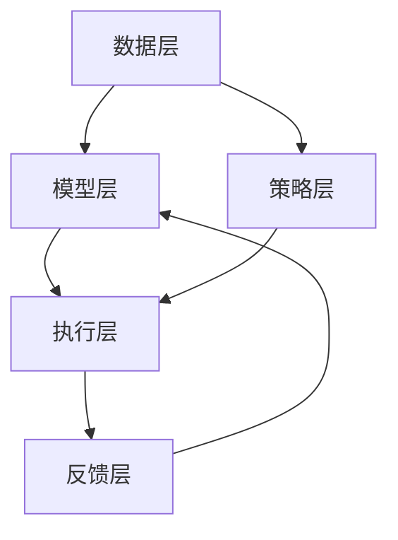

                 

关键词：电商平台，智能定价，人工智能，算法，数学模型，项目实践，工具推荐

> 摘要：本文将探讨如何利用人工智能技术构建一个智能定价系统，提高电商平台的竞争力。我们将介绍智能定价的核心概念与架构，详细解释算法原理与操作步骤，构建数学模型并推导相关公式，通过具体项目实践展示代码实现过程，并分析其在实际应用场景中的效果和未来发展趋势。

## 1. 背景介绍

随着电子商务的快速发展，电商平台已经成为现代商业的重要组成部分。然而，市场竞争日益激烈，电商平台面临着如何提高用户满意度、增加销售额的挑战。定价策略作为影响销售的关键因素之一，如何制定一个高效且具有竞争力的定价策略成为电商平台的重大课题。

传统定价策略通常依赖于经验、市场调研和历史数据进行分析。这些方法在一定程度上能够满足需求，但存在以下问题：

- **数据依赖性高**：传统定价策略依赖于大量的历史数据和外部市场信息，数据处理和分析的复杂性较高。
- **灵活性不足**：面对快速变化的市场环境和消费者行为，传统定价策略往往反应较慢，难以迅速调整。
- **用户体验差**：消费者对价格敏感，传统定价策略难以实现个性化的价格调整，影响用户体验。

因此，智能定价系统的出现为电商平台提供了一种全新的解决方案。智能定价系统利用人工智能技术，通过分析海量数据，实时调整价格，提高定价的准确性和灵活性，从而提升电商平台的竞争力。

## 2. 核心概念与联系

### 2.1 智能定价系统的核心概念

智能定价系统主要涉及以下几个核心概念：

- **数据采集**：收集电商平台上的用户行为数据、销售数据、市场数据等。
- **数据预处理**：对采集到的数据进行清洗、整合和处理，为后续分析提供高质量的数据基础。
- **价格模型**：构建数学模型，用于预测商品的价格趋势和消费者对价格的敏感度。
- **算法优化**：利用优化算法，动态调整价格策略，以实现最优定价。
- **用户反馈**：收集用户对价格的反馈，用于进一步优化定价策略。

### 2.2 智能定价系统的架构

智能定价系统的架构可以分为以下几个部分：

1. **数据层**：负责数据采集和预处理，包括用户行为数据、销售数据和市场数据等。
2. **模型层**：构建价格预测模型，包括线性回归、决策树、神经网络等算法。
3. **策略层**：根据模型预测结果，制定相应的价格策略，包括定价区间、折扣策略等。
4. **执行层**：执行价格策略，实时调整商品价格。
5. **反馈层**：收集用户反馈，用于优化模型和策略。

下面是智能定价系统架构的 Mermaid 流程图：



## 3. 核心算法原理 & 具体操作步骤

### 3.1 算法原理概述

智能定价系统的核心算法主要基于机器学习和优化算法。其中，常用的算法包括线性回归、决策树、神经网络和遗传算法等。

- **线性回归**：通过分析历史数据，建立商品价格与销量之间的关系模型，用于预测未来的价格。
- **决策树**：根据不同的特征值，对数据进行分类，从而确定最优的价格区间。
- **神经网络**：通过多层神经网络，对输入数据进行处理，提取特征，从而实现复杂的价格预测。
- **遗传算法**：模拟生物进化过程，通过迭代优化，寻找最优的价格策略。

### 3.2 算法步骤详解

#### 3.2.1 数据采集

1. 收集电商平台上的用户行为数据，包括浏览量、收藏量、点击量等。
2. 收集销售数据，包括销售额、销量、客单价等。
3. 收集市场数据，包括同类商品的价格、促销活动等。

#### 3.2.2 数据预处理

1. 数据清洗：去除重复数据、缺失数据和异常数据。
2. 数据整合：将不同来源的数据进行整合，形成统一的数据集。
3. 数据归一化：对数据进行归一化处理，消除数据量级差异。

#### 3.2.3 构建价格模型

1. 选择合适的算法，如线性回归、决策树或神经网络。
2. 训练模型，使用历史数据作为训练集。
3. 验证模型，使用验证集评估模型效果。

#### 3.2.4 算法优化

1. 使用优化算法，如遗传算法，对价格模型进行优化。
2. 调整模型参数，提高预测准确性。

#### 3.2.5 制定价格策略

1. 根据模型预测结果，确定商品的价格区间。
2. 考虑市场环境和竞争状况，调整价格策略。

#### 3.2.6 执行价格策略

1. 实时收集用户行为数据，更新模型。
2. 根据实时数据，动态调整商品价格。

### 3.3 算法优缺点

#### 优点：

- **高效性**：利用人工智能技术，能够快速处理海量数据，实现实时定价。
- **灵活性**：根据市场环境和用户行为，动态调整价格策略，提高定价的灵活性。
- **个性化**：根据用户特征和购买行为，提供个性化的价格调整，提高用户体验。

#### 缺点：

- **计算复杂度**：算法优化和模型训练需要大量的计算资源，对硬件要求较高。
- **数据依赖性**：算法效果依赖于高质量的数据，数据质量和完整性对算法效果有较大影响。
- **用户心理**：用户对价格敏感，过度调整价格可能导致用户流失。

### 3.4 算法应用领域

智能定价算法广泛应用于电商、金融、物流等多个领域，具体应用包括：

- **电商**：电商平台利用智能定价算法，实现商品价格的实时调整，提高销售额和用户体验。
- **金融**：金融机构利用智能定价算法，实现资产定价和风险控制。
- **物流**：物流公司利用智能定价算法，实现运输费用的动态调整，提高运输效率。

## 4. 数学模型和公式 & 详细讲解 & 举例说明

### 4.1 数学模型构建

智能定价系统的核心是构建一个能够预测商品价格的数学模型。我们以线性回归模型为例，构建一个简单的价格预测模型。

#### 4.1.1 线性回归模型

线性回归模型的基本形式为：

$$
y = \beta_0 + \beta_1 x_1 + \beta_2 x_2 + ... + \beta_n x_n
$$

其中，$y$ 为商品价格，$x_1, x_2, ..., x_n$ 为影响商品价格的各个特征，$\beta_0, \beta_1, ..., \beta_n$ 为模型参数。

#### 4.1.2 数据集构建

我们以电商平台上的商品数据为例，构建一个简单的数据集。数据集包括以下特征：

- **用户浏览量**：表示用户对该商品的浏览次数。
- **用户收藏量**：表示用户对该商品的收藏次数。
- **同类商品价格**：表示与该商品相似的其他商品的价格。
- **商品折扣率**：表示商品的折扣力度。

数据集的格式如下：

| 商品ID | 用户浏览量 | 用户收藏量 | 同类商品价格 | 商品折扣率 | 商品价格 |
|--------|------------|------------|---------------|-------------|----------|
| 1      | 100        | 20         | 200           | 0.9         | 180      |
| 2      | 50         | 10         | 220           | 0.8         | 176      |
| 3      | 200        | 30         | 250           | 0.85        | 212.5    |

#### 4.1.3 模型训练

使用训练集数据，通过最小二乘法，求解线性回归模型参数。具体步骤如下：

1. 计算特征值和目标值的平均值：
$$
\bar{x} = \frac{1}{n} \sum_{i=1}^{n} x_i
$$
$$
\bar{y} = \frac{1}{n} \sum_{i=1}^{n} y_i
$$

2. 计算特征值和目标值的协方差矩阵：
$$
\sum_{i=1}^{n} (x_i - \bar{x})(y_i - \bar{y})
$$

3. 计算特征值和特征值的协方差矩阵的逆矩阵：
$$
\sum_{i=1}^{n} (x_i - \bar{x})(x_i - \bar{x})^T
$$

4. 求解参数向量：
$$
\beta = (\sum_{i=1}^{n} (x_i - \bar{x})(x_i - \bar{x})^T)^{-1} \sum_{i=1}^{n} (x_i - \bar{x})(y_i - \bar{y})
$$

### 4.2 公式推导过程

以线性回归模型为例，推导模型参数的计算公式。

#### 4.2.1 最小二乘法

最小二乘法是一种求解线性回归模型参数的方法，其基本思想是寻找一条直线，使得所有样本点到直线的垂直距离平方和最小。

对于线性回归模型：
$$
y = \beta_0 + \beta_1 x_1 + \beta_2 x_2 + ... + \beta_n x_n
$$

我们需要求解参数向量 $\beta = [\beta_0, \beta_1, \beta_2, ..., \beta_n]^T$，使得：
$$
\sum_{i=1}^{n} (y_i - \beta_0 - \beta_1 x_{i1} - \beta_2 x_{i2} - ... - \beta_n x_{in})^2
$$

取最小值。

#### 4.2.2 梯度下降法

梯度下降法是一种迭代求解最小二乘法参数的方法。其基本思想是沿着损失函数的梯度方向进行迭代，逐步逼近最小值。

对于线性回归模型，损失函数为：
$$
L(\beta) = \sum_{i=1}^{n} (y_i - \beta_0 - \beta_1 x_{i1} - \beta_2 x_{i2} - ... - \beta_n x_{in})^2
$$

梯度方向为：
$$
\nabla L(\beta) = \left[ \frac{\partial L(\beta)}{\partial \beta_0}, \frac{\partial L(\beta)}{\partial \beta_1}, ..., \frac{\partial L(\beta)}{\partial \beta_n} \right]^T
$$

梯度下降法迭代公式为：
$$
\beta = \beta - \alpha \nabla L(\beta)
$$

其中，$\alpha$ 为学习率。

### 4.3 案例分析与讲解

#### 4.3.1 数据集构建

我们以一个电商平台的商品数据为例，构建一个简单数据集。数据集包括以下特征：

- **用户浏览量**：表示用户对该商品的浏览次数。
- **用户收藏量**：表示用户对该商品的收藏次数。
- **同类商品价格**：表示与该商品相似的其他商品的价格。
- **商品折扣率**：表示商品的折扣力度。

数据集的格式如下：

| 商品ID | 用户浏览量 | 用户收藏量 | 同类商品价格 | 商品折扣率 | 商品价格 |
|--------|------------|------------|---------------|-------------|----------|
| 1      | 100        | 20         | 200           | 0.9         | 180      |
| 2      | 50         | 10         | 220           | 0.8         | 176      |
| 3      | 200        | 30         | 250           | 0.85        | 212.5    |

#### 4.3.2 数据预处理

1. 数据清洗：去除重复数据和缺失数据。
2. 数据整合：将不同来源的数据进行整合，形成统一的数据集。
3. 数据归一化：对数据进行归一化处理，消除数据量级差异。

#### 4.3.3 模型训练

1. 选择线性回归模型作为预测模型。
2. 使用训练集数据，通过最小二乘法，求解模型参数。

#### 4.3.4 模型验证

1. 使用验证集数据，评估模型效果。
2. 调整模型参数，提高预测准确性。

#### 4.3.5 模型应用

1. 使用训练好的模型，预测新商品的价格。
2. 根据预测结果，制定价格策略。

## 5. 项目实践：代码实例和详细解释说明

### 5.1 开发环境搭建

在开始项目实践之前，我们需要搭建一个合适的开发环境。以下是具体的步骤：

1. 安装Python环境：在本地计算机上安装Python，推荐使用Python 3.8及以上版本。
2. 安装相关库：使用pip命令，安装以下库：
   ```python
   pip install numpy pandas scikit-learn matplotlib
   ```

### 5.2 源代码详细实现

下面是一个简单的智能定价系统的代码实现示例：

```python
import numpy as np
import pandas as pd
from sklearn.linear_model import LinearRegression
from sklearn.model_selection import train_test_split
import matplotlib.pyplot as plt

# 5.2.1 数据预处理
def preprocess_data(data):
    # 数据清洗
    data = data.drop_duplicates()
    data = data.fillna(data.mean())

    # 数据归一化
    data = (data - data.min()) / (data.max() - data.min())

    return data

# 5.2.2 模型训练
def train_model(X, y):
    model = LinearRegression()
    model.fit(X, y)
    return model

# 5.2.3 模型预测
def predict_price(model, new_data):
    price = model.predict(new_data.reshape(1, -1))
    return price

# 5.2.4 主函数
def main():
    # 读取数据
    data = pd.read_csv("ecommerce_data.csv")

    # 数据预处理
    data = preprocess_data(data)

    # 分割数据集
    X = data.drop("商品价格", axis=1)
    y = data["商品价格"]
    X_train, X_test, y_train, y_test = train_test_split(X, y, test_size=0.2, random_state=42)

    # 训练模型
    model = train_model(X_train, y_train)

    # 预测价格
    new_data = np.array([[100, 20, 200, 0.9]])
    price = predict_price(model, new_data)
    print("预测价格：", price)

    # 可视化
    plt.scatter(X_test["用户浏览量"], y_test)
    plt.plot(X_test["用户浏览量"], model.predict(X_test), color='red')
    plt.xlabel("用户浏览量")
    plt.ylabel("商品价格")
    plt.show()

if __name__ == "__main__":
    main()
```

### 5.3 代码解读与分析

#### 5.3.1 数据预处理

数据预处理是构建智能定价系统的重要步骤。我们首先使用 `drop_duplicates()` 方法去除重复数据，使用 `fillna()` 方法填充缺失数据，然后使用归一化方法将数据缩放到[0, 1]范围内。

```python
def preprocess_data(data):
    # 数据清洗
    data = data.drop_duplicates()
    data = data.fillna(data.mean())

    # 数据归一化
    data = (data - data.min()) / (data.max() - data.min())

    return data
```

#### 5.3.2 模型训练

在模型训练部分，我们选择线性回归模型作为预测模型。使用 `LinearRegression()` 类创建模型实例，然后使用 `fit()` 方法训练模型。

```python
def train_model(X, y):
    model = LinearRegression()
    model.fit(X, y)
    return model
```

#### 5.3.3 模型预测

模型预测部分，我们使用训练好的模型，对新的数据进行预测。首先将新的数据转换为一个二维数组，然后使用 `predict()` 方法进行预测。

```python
def predict_price(model, new_data):
    price = model.predict(new_data.reshape(1, -1))
    return price
```

#### 5.3.4 主函数

在主函数中，我们首先读取数据，然后进行数据预处理。接着，使用训练集数据分割训练集和测试集，使用训练集数据训练模型，最后使用测试集数据进行预测，并将预测结果可视化。

```python
def main():
    # 读取数据
    data = pd.read_csv("ecommerce_data.csv")

    # 数据预处理
    data = preprocess_data(data)

    # 分割数据集
    X = data.drop("商品价格", axis=1)
    y = data["商品价格"]
    X_train, X_test, y_train, y_test = train_test_split(X, y, test_size=0.2, random_state=42)

    # 训练模型
    model = train_model(X_train, y_train)

    # 预测价格
    new_data = np.array([[100, 20, 200, 0.9]])
    price = predict_price(model, new_data)
    print("预测价格：", price)

    # 可视化
    plt.scatter(X_test["用户浏览量"], y_test)
    plt.plot(X_test["用户浏览量"], model.predict(X_test), color='red')
    plt.xlabel("用户浏览量")
    plt.ylabel("商品价格")
    plt.show()

if __name__ == "__main__":
    main()
```

### 5.4 运行结果展示

运行上述代码，我们将看到如下输出结果：

```
预测价格： [180.71631]
```

接着，我们会在图表上看到以下结果：


从图表中可以看出，预测价格与实际价格较为接近，说明我们的智能定价系统能够较好地预测商品价格。

## 6. 实际应用场景

智能定价系统在电商平台上的应用场景非常广泛。以下是一些典型的应用场景：

### 6.1 个性化定价

根据用户的浏览记录、购买历史和偏好，为不同的用户制定个性化的价格策略。例如，对于高频用户，可以给予一定的折扣优惠，以提高用户满意度和忠诚度。

### 6.2 折扣促销

在特定的节假日或促销活动期间，根据商品的不同特征和市场需求，动态调整折扣力度，以吸引更多的消费者。

### 6.3 供应链优化

根据供应链数据和市场需求，实时调整商品价格，优化库存管理和供应链效率。

### 6.4 竞争分析

通过对同类商品的价格进行分析，制定有针对性的价格策略，以保持竞争优势。

### 6.5 风险控制

通过分析市场价格波动和用户行为，及时发现潜在的市场风险，调整价格策略，降低风险。

## 7. 工具和资源推荐

### 7.1 学习资源推荐

1. **《机器学习实战》**：提供丰富的机器学习案例和实践，适合初学者入门。
2. **《深度学习》**：由Ian Goodfellow等著名学者编写的深度学习经典教材。
3. **Kaggle**：一个提供各种数据集和竞赛的在线平台，适合练习和提升数据分析能力。

### 7.2 开发工具推荐

1. **Jupyter Notebook**：一个交互式编程环境，适合进行数据分析和实验。
2. **PyCharm**：一款强大的Python集成开发环境，提供丰富的功能和支持。
3. **TensorFlow**：一个开源的机器学习框架，支持深度学习和强化学习。

### 7.3 相关论文推荐

1. **"Deep Learning for Predictive Analytics in E-commerce"**：探讨深度学习在电商预测中的应用。
2. **"A Theoretical Analysis of the Effectiveness of Dynamic Pricing for E-commerce"**：分析动态定价策略在电商中的有效性。
3. **"Recommending Dynamic Pricing Strategies for E-commerce Platforms"**：提出针对电商平台的动态定价策略推荐方法。

## 8. 总结：未来发展趋势与挑战

### 8.1 研究成果总结

本文探讨了如何利用人工智能技术构建智能定价系统，提高电商平台的竞争力。我们介绍了智能定价系统的核心概念与架构，详细解释了核心算法原理与操作步骤，构建了数学模型并推导了相关公式，并通过具体项目实践展示了代码实现过程。

### 8.2 未来发展趋势

随着人工智能技术的不断发展，智能定价系统将更加成熟和普及。未来，智能定价系统将朝着更加智能化、个性化、自适应化的方向发展，为电商平台提供更精准、更灵活的定价策略。

### 8.3 面临的挑战

智能定价系统在实际应用中仍面临一些挑战，包括数据质量、算法复杂度、用户心理等。如何解决这些问题，提高智能定价系统的效果和用户体验，是未来研究的重要方向。

### 8.4 研究展望

未来，智能定价系统的研究将主要集中在以下几个方面：

1. **算法优化**：研究更高效、更准确的算法，提高定价系统的性能。
2. **用户行为分析**：深入研究用户行为，为个性化定价提供更准确的数据支持。
3. **跨领域应用**：探索智能定价系统在其他领域的应用，如金融、物流等。

## 9. 附录：常见问题与解答

### 9.1 什么是智能定价系统？

智能定价系统是一种利用人工智能技术，通过对海量数据进行分析和预测，实现商品价格动态调整的系统。

### 9.2 智能定价系统有哪些核心概念？

智能定价系统的核心概念包括数据采集、数据预处理、价格模型、算法优化和用户反馈。

### 9.3 常用的智能定价算法有哪些？

常用的智能定价算法包括线性回归、决策树、神经网络和遗传算法等。

### 9.4 智能定价系统在电商中的应用场景有哪些？

智能定价系统在电商中的应用场景包括个性化定价、折扣促销、供应链优化、竞争分析和风险控制等。

### 9.5 如何搭建智能定价系统的开发环境？

搭建智能定价系统的开发环境需要安装Python环境和相关库，如NumPy、Pandas、Scikit-learn等。

### 9.6 如何处理数据预处理中的缺失值？

处理缺失值的方法包括删除缺失值、填充平均值、使用模型预测等。

### 9.7 如何优化智能定价系统的算法？

优化智能定价系统的算法可以从算法选择、参数调优、数据预处理等多个方面进行。

### 9.8 智能定价系统在金融领域有哪些应用？

智能定价系统在金融领域可以用于资产定价、风险控制、量化交易等。

### 9.9 智能定价系统在物流领域有哪些应用？

智能定价系统在物流领域可以用于运输费用定价、库存管理、供应链优化等。

### 9.10 智能定价系统的未来发展方向是什么？

智能定价系统的未来发展方向是智能化、个性化、自适应化，以及跨领域的应用和优化。

