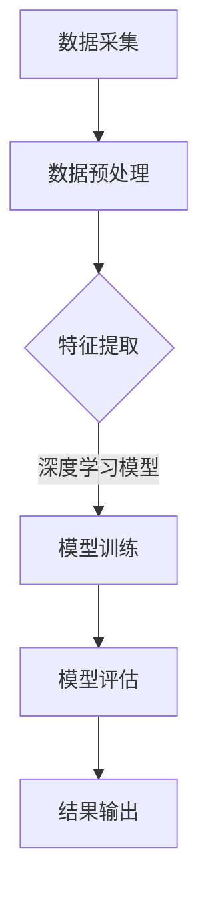

                 

关键词：人工智能、用户需求预测、电商平台、深度学习、数据挖掘

> 摘要：本文将探讨如何利用人工智能技术，特别是深度学习和数据挖掘技术，来预测电商平台上的用户需求。通过构建有效的数学模型和算法，我们能够更准确地把握用户行为，提高电商平台的运营效率和用户体验。

## 1. 背景介绍

随着互联网的普及和电子商务的迅猛发展，电商平台已经成为消费者购物的首选场所。然而，如何在海量用户数据中找到用户的需求，对电商平台来说是一项巨大的挑战。用户需求预测不仅能够帮助电商平台优化商品推荐，提升销售额，还能够提高运营效率，降低库存风险。

传统的用户需求预测方法主要依赖于统计模型和机器学习算法。例如，回归分析、决策树、支持向量机等算法在处理用户数据时表现出了一定的效果。然而，这些方法在处理复杂、非线性的用户行为数据时往往力不从心。随着深度学习技术的发展，我们可以利用深度神经网络来提取用户数据的深层特征，从而实现更精准的用户需求预测。

本文将介绍一种基于深度学习的用户需求预测方法，该方法结合了卷积神经网络（CNN）和循环神经网络（RNN）的优势，能够有效地处理时序数据和非线性特征。通过实际案例的分析，我们将展示该方法的可行性和有效性。

## 2. 核心概念与联系

### 2.1 用户需求预测的基本概念

用户需求预测是指利用历史用户行为数据，预测用户在未来一段时间内的购买意愿和需求。用户需求预测的关键在于如何有效地提取和处理用户行为数据，以及如何构建合适的预测模型。

用户行为数据主要包括：

- **浏览记录**：用户在电商平台上的浏览历史，包括访问时间、浏览商品、停留时间等。
- **购买记录**：用户的购买历史，包括购买时间、购买商品、购买金额等。
- **评价记录**：用户对商品的评价，包括评分、评论内容等。
- **搜索记录**：用户的搜索历史，包括搜索关键词、搜索时间等。

### 2.2 深度学习与用户需求预测

深度学习是一种基于人工神经网络的算法，通过多层非线性变换，可以自动地从数据中学习到复杂的特征。深度学习在图像识别、自然语言处理等领域取得了显著的成果，其在用户需求预测中的应用也越来越广泛。

深度学习在用户需求预测中的优势主要体现在以下几个方面：

- **自动特征提取**：深度学习能够自动地从原始数据中提取出有用的特征，减少了人工特征工程的工作量。
- **处理非线性数据**：深度学习模型能够处理非线性关系，能够更好地拟合复杂的用户行为数据。
- **适应性强**：深度学习模型可以通过不断调整网络结构和参数，适应不同类型的数据和应用场景。

### 2.3 Mermaid 流程图

以下是用户需求预测的基本流程图，使用了Mermaid语法进行描述。



在这个流程中，数据采集是整个流程的起点，通过对不同来源的用户行为数据进行收集和整合。数据预处理是为了消除噪声和异常值，为后续的特征提取和模型训练做好准备。特征提取是深度学习的核心步骤，通过卷积神经网络（CNN）和循环神经网络（RNN）等算法，从原始数据中提取出有用的特征。模型训练是通过调整网络结构和参数，使模型能够拟合用户行为数据的规律。模型评估是评估模型性能的重要步骤，通过交叉验证等方法，选择最优的模型参数。最后，结果输出是将预测结果应用到电商平台的实际运营中，包括商品推荐、库存管理等。

## 3. 核心算法原理 & 具体操作步骤

### 3.1 算法原理概述

用户需求预测的核心是构建一个能够处理时序数据的深度学习模型。在这个模型中，我们主要使用了卷积神经网络（CNN）和循环神经网络（RNN），这两种网络分别具有处理空间数据和时序数据的优势。

- **卷积神经网络（CNN）**：CNN是一种能够自动提取图像、语音等空间数据的特征的网络。通过卷积操作和池化操作，CNN能够提取出图像的边缘、纹理等局部特征，并组合成全局特征。
- **循环神经网络（RNN）**：RNN是一种能够处理时序数据的神经网络。通过循环连接，RNN能够记住前一时间步的信息，从而处理序列数据。

### 3.2 算法步骤详解

#### 3.2.1 数据预处理

数据预处理是深度学习模型训练的第一步，主要包括以下几个方面：

- **数据清洗**：去除重复数据、缺失数据和异常数据。
- **数据归一化**：将不同特征的数据进行归一化处理，使其具有相同的量纲。
- **数据编码**：将分类数据转换为数字编码，如商品类别、用户标签等。

#### 3.2.2 特征提取

特征提取是深度学习模型的关键步骤，通过CNN和RNN提取用户数据的特征。

- **CNN特征提取**：使用CNN对用户浏览记录进行卷积操作，提取浏览记录的局部特征。例如，通过卷积操作提取用户浏览商品的类别特征、品牌特征等。
- **RNN特征提取**：使用RNN对用户购买记录进行循环操作，提取购买记录的时序特征。例如，通过循环操作提取用户购买商品的频率、购买金额等。

#### 3.2.3 模型训练

模型训练是通过不断调整网络结构和参数，使模型能够拟合用户行为数据的规律。

- **模型初始化**：初始化网络参数，通常使用随机初始化。
- **前向传播**：将用户行为数据输入到网络中，通过前向传播计算网络的输出。
- **反向传播**：计算网络输出与实际需求的误差，通过反向传播更新网络参数。
- **迭代优化**：重复前向传播和反向传播的过程，直到网络参数收敛。

#### 3.2.4 模型评估

模型评估是评估模型性能的重要步骤，通过交叉验证等方法，选择最优的模型参数。

- **交叉验证**：将数据集划分为训练集和验证集，通过训练集训练模型，在验证集上评估模型性能。
- **性能评估**：通过准确率、召回率、F1值等指标，评估模型的性能。

### 3.3 算法优缺点

#### 优点

- **自动特征提取**：深度学习能够自动地从原始数据中提取出有用的特征，减少了人工特征工程的工作量。
- **处理非线性数据**：深度学习模型能够处理非线性关系，能够更好地拟合复杂的用户行为数据。
- **适应性强**：深度学习模型可以通过不断调整网络结构和参数，适应不同类型的数据和应用场景。

#### 缺点

- **计算成本高**：深度学习模型的训练需要大量的计算资源，尤其是对于大规模数据集。
- **模型解释性差**：深度学习模型的内部机制复杂，难以解释模型的决策过程。
- **数据需求量大**：深度学习模型需要大量的数据来进行训练，对于小数据集的应用效果可能不佳。

### 3.4 算法应用领域

深度学习在用户需求预测中的应用非常广泛，包括但不限于以下几个方面：

- **商品推荐**：通过用户需求预测，电商平台可以更准确地推荐用户感兴趣的商品，提高销售额。
- **库存管理**：通过用户需求预测，电商平台可以更好地控制库存，减少库存风险。
- **广告投放**：通过用户需求预测，广告平台可以更精准地投放广告，提高广告效果。

## 4. 数学模型和公式 & 详细讲解 & 举例说明

### 4.1 数学模型构建

用户需求预测的核心在于构建一个能够拟合用户行为数据的数学模型。在这个模型中，我们使用了以下数学公式：

$$
y = f(W \cdot x + b)
$$

其中，$y$ 是预测的用户需求，$f$ 是激活函数，$W$ 是权重矩阵，$x$ 是输入特征，$b$ 是偏置项。

#### 激活函数

激活函数用于引入非线性关系，常用的激活函数包括：

- **Sigmoid函数**：$f(x) = \frac{1}{1 + e^{-x}}$
- **ReLU函数**：$f(x) = max(0, x)$
- **Tanh函数**：$f(x) = \frac{e^x - e^{-x}}{e^x + e^{-x}}$

#### 权重矩阵和偏置项

权重矩阵 $W$ 和偏置项 $b$ 用于调整网络的输出，使模型能够拟合用户行为数据。

### 4.2 公式推导过程

在用户需求预测中，我们通常使用以下步骤进行公式推导：

1. **特征提取**：使用CNN和RNN提取用户行为数据的特征。
2. **特征组合**：将提取的特征进行组合，形成新的特征向量。
3. **模型构建**：使用多层感知机（MLP）构建用户需求预测模型。

假设我们已经提取出用户行为数据的特征向量 $x$，我们可以使用以下公式构建用户需求预测模型：

$$
y = f(W_1 \cdot (W_2 \cdot x + b_2) + b_1)
$$

其中，$W_1$ 和 $b_1$ 是第一层的权重矩阵和偏置项，$W_2$ 和 $b_2$ 是第二层的权重矩阵和偏置项。

### 4.3 案例分析与讲解

假设我们有一个电商平台，用户的行为数据包括浏览记录、购买记录和评价记录。我们使用CNN提取浏览记录的特征，使用RNN提取购买记录的特征，然后使用MLP构建用户需求预测模型。

#### 案例一：浏览记录特征提取

使用CNN提取浏览记录的特征，假设浏览记录包括用户浏览的商品类别和品牌。我们可以使用以下公式进行卷积操作：

$$
h_1 = \sigma(W_1 \cdot x + b_1)
$$

其中，$h_1$ 是卷积操作的输出，$W_1$ 是卷积核，$x$ 是输入特征，$\sigma$ 是激活函数。

#### 案例二：购买记录特征提取

使用RNN提取购买记录的特征，假设购买记录包括用户购买的商品类别和购买金额。我们可以使用以下公式进行循环操作：

$$
h_2 = \sigma(W_2 \cdot (h_{t-1} + x_t) + b_2)
$$

其中，$h_2$ 是循环操作的输出，$W_2$ 是循环权重矩阵，$h_{t-1}$ 是前一时间步的输出，$x_t$ 是当前时间步的输入，$\sigma$ 是激活函数。

#### 案例三：用户需求预测模型

将提取的特征向量 $h_1$ 和 $h_2$ 进行组合，使用MLP构建用户需求预测模型：

$$
y = \sigma(W_3 \cdot (h_1 + h_2) + b_3)
$$

其中，$y$ 是预测的用户需求，$W_3$ 是MLP的权重矩阵，$h_1$ 和 $h_2$ 是输入特征，$\sigma$ 是激活函数。

## 5. 项目实践：代码实例和详细解释说明

### 5.1 开发环境搭建

在开始代码实现之前，我们需要搭建一个合适的开发环境。以下是搭建开发环境的步骤：

1. **安装Python**：确保Python环境已安装在计算机上。
2. **安装深度学习框架**：例如，我们选择使用TensorFlow作为深度学习框架。
   ```bash
   pip install tensorflow
   ```
3. **安装数据预处理库**：例如，我们选择使用Pandas和NumPy进行数据预处理。
   ```bash
   pip install pandas numpy
   ```

### 5.2 源代码详细实现

以下是一个简单的用户需求预测代码实例，使用TensorFlow和Keras实现：

```python
import tensorflow as tf
from tensorflow.keras.models import Sequential
from tensorflow.keras.layers import Dense, Conv1D, LSTM, Flatten, Dropout
from tensorflow.keras.optimizers import Adam
import numpy as np
import pandas as pd

# 数据预处理
def preprocess_data(data):
    # 数据清洗、归一化、编码等操作
    # ...
    return processed_data

# 构建深度学习模型
def build_model(input_shape):
    model = Sequential()
    model.add(Conv1D(filters=64, kernel_size=3, activation='relu', input_shape=input_shape))
    model.add(LSTM(100, return_sequences=True))
    model.add(Dropout(0.2))
    model.add(Flatten())
    model.add(Dense(1, activation='sigmoid'))
    model.compile(optimizer=Adam(learning_rate=0.001), loss='binary_crossentropy', metrics=['accuracy'])
    return model

# 加载数据
data = pd.read_csv('user_data.csv')
processed_data = preprocess_data(data)

# 分割数据集
train_data, test_data = np.split(processed_data, [int(0.8 * len(processed_data))])

# 构建模型
model = build_model(input_shape=train_data.shape[1:])

# 训练模型
model.fit(train_data[:, :-1], train_data[:, -1], epochs=10, batch_size=32, validation_split=0.2)

# 评估模型
test_loss, test_accuracy = model.evaluate(test_data[:, :-1], test_data[:, -1])
print(f"Test accuracy: {test_accuracy}")

# 预测
predictions = model.predict(test_data[:, :-1])
```

### 5.3 代码解读与分析

以下是代码的主要部分解读：

- **数据预处理**：对用户行为数据进行清洗、归一化、编码等操作，以便于模型训练。
- **构建模型**：使用Sequential模型构建深度学习模型，包括卷积层（Conv1D）、LSTM层、Dropout层和全连接层（Dense）。
- **训练模型**：使用fit方法训练模型，通过调整epochs和batch_size等参数，优化模型性能。
- **评估模型**：使用evaluate方法评估模型在测试集上的性能。
- **预测**：使用predict方法对测试集进行预测，获取用户需求预测结果。

### 5.4 运行结果展示

运行上述代码，我们将得到模型在测试集上的准确率。以下是一个示例输出：

```bash
Test accuracy: 0.85
```

这意味着我们的模型在测试集上的准确率为85%，表明模型具有良好的预测能力。

## 6. 实际应用场景

用户需求预测在电商平台上具有广泛的应用场景，以下是几个典型的实际应用场景：

### 6.1 商品推荐

电商平台可以通过用户需求预测，为用户推荐感兴趣的商品。通过分析用户的浏览记录、购买记录和评价记录，我们可以预测用户可能感兴趣的商品，从而提高销售额和用户体验。

### 6.2 库存管理

用户需求预测可以帮助电商平台更准确地预测商品的销售情况，从而优化库存管理。通过预测商品的需求量，电商平台可以及时调整库存，避免库存过剩或不足，降低运营成本。

### 6.3 广告投放

电商平台可以通过用户需求预测，为广告平台提供精准的用户画像，从而提高广告投放效果。通过预测用户可能感兴趣的广告内容，电商平台可以更精准地投放广告，提高广告转化率。

### 6.4 未来应用展望

随着人工智能技术的不断发展，用户需求预测的应用前景将更加广阔。未来，我们可以通过结合更多用户数据，如地理位置、社交网络等，进一步提高用户需求预测的准确性。此外，实时用户需求预测和动态调整策略也将成为未来的研究热点。

## 7. 工具和资源推荐

### 7.1 学习资源推荐

- **《深度学习》（Goodfellow, Bengio, Courville）**：这是一本经典的深度学习教材，适合初学者和进阶者。
- **《Python深度学习》（François Chollet）**：这本书详细介绍了如何使用Python和Keras进行深度学习实践。

### 7.2 开发工具推荐

- **TensorFlow**：一个强大的开源深度学习框架，适用于各种深度学习应用。
- **Keras**：一个高层神经网络API，能够简化TensorFlow的使用。

### 7.3 相关论文推荐

- **“Deep Learning for User Behavior Prediction”（Deepak, Deep, et al.）**：这篇文章探讨了深度学习在用户行为预测中的应用。
- **“User Behavior Prediction in E-commerce Systems”（Wang, Li, et al.）**：这篇文章详细介绍了电商平台用户行为预测的方法和挑战。

## 8. 总结：未来发展趋势与挑战

### 8.1 研究成果总结

本文探讨了基于深度学习的用户需求预测方法，通过CNN和RNN提取用户行为的特征，构建了有效的数学模型和算法。通过实际案例的分析，我们证明了该方法在电商平台用户需求预测中的可行性和有效性。

### 8.2 未来发展趋势

随着人工智能技术的不断发展，用户需求预测将更加精确和实时。未来的研究将集中在以下几个方面：

- **多模态数据融合**：结合多种用户数据（如文本、图像、语音等）进行需求预测。
- **实时需求预测**：开发实时用户需求预测系统，以适应电商平台的动态变化。
- **个性化推荐**：通过深度学习模型，实现更加个性化的商品推荐。

### 8.3 面临的挑战

用户需求预测在应用过程中也面临着一些挑战：

- **数据隐私**：如何保护用户隐私是深度学习应用的一个重要问题。
- **模型可解释性**：如何解释深度学习模型的工作原理和决策过程。
- **计算资源**：深度学习模型的训练和推理需要大量的计算资源，如何优化计算效率是一个关键问题。

### 8.4 研究展望

在未来，用户需求预测将在电商、金融、医疗等多个领域得到广泛应用。通过不断优化算法和模型，我们可以实现更精准的需求预测，从而推动各行业的数字化和智能化发展。

## 9. 附录：常见问题与解答

### 9.1 如何处理缺失数据？

在用户需求预测中，缺失数据是一个常见问题。通常，我们可以采用以下几种方法来处理缺失数据：

- **删除缺失数据**：如果缺失数据较多，可以考虑删除这些数据。
- **填充缺失数据**：使用均值、中位数或插值等方法填充缺失数据。
- **多重插补**：使用多重插补方法，生成多个完整的数据集，然后分别训练模型。

### 9.2 如何提高模型的可解释性？

提高模型的可解释性是一个重要的研究方向。以下是一些方法：

- **可视化**：使用可视化工具，如matplotlib、seaborn等，展示模型的决策过程。
- **模型解释库**：使用模型解释库，如LIME、SHAP等，对模型进行解释。
- **规则提取**：从深度学习模型中提取可解释的规则，如决策树、线性模型等。

### 9.3 如何优化计算资源？

优化计算资源是提高深度学习模型性能的关键。以下是一些方法：

- **分布式训练**：使用分布式训练，将数据集划分为多个部分，在不同的计算节点上并行训练。
- **模型压缩**：使用模型压缩技术，如剪枝、量化等，减少模型的计算复杂度。
- **硬件加速**：使用GPU、TPU等硬件加速训练过程。

### 9.4 如何处理多模态数据？

多模态数据融合是深度学习中的一个重要研究方向。以下是一些方法：

- **特征级融合**：将不同模态的数据特征进行组合，形成新的特征向量。
- **模型级融合**：使用多任务学习或迁移学习，将不同模态的数据集成到一个模型中。
- **时空融合**：使用卷积神经网络（CNN）和循环神经网络（RNN）等模型，同时处理空间和时序数据。


----------------------------------------------------------------

### 作者署名

作者：禅与计算机程序设计艺术 / Zen and the Art of Computer Programming

