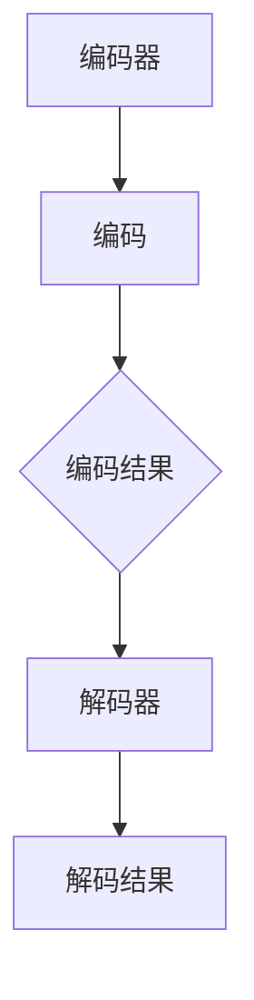

                 

关键词：人工智能，自动翻译，跨语言交流，自然语言处理，机器翻译

> 摘要：本文将深入探讨AI驱动的自动化翻译技术，分析其在跨语言交流中的应用和重要性。通过详细讲解核心算法原理、数学模型和实际项目实践，我们将揭示这一新兴技术如何改变我们的沟通方式，并展望其未来的发展趋势和挑战。

## 1. 背景介绍

在全球化进程加速的今天，跨语言交流变得越来越重要。无论是国际贸易、跨国合作，还是文化交流、信息传播，语言障碍始终是沟通的一大难题。传统的翻译方法，如人工翻译和机器翻译，都存在各自的局限性。人工翻译成本高昂、效率低下，而早期的机器翻译则常常出现语义错误和理解偏差。随着人工智能（AI）技术的迅猛发展，自动化翻译迎来了新的机遇。

自动化翻译技术基于机器学习、自然语言处理（NLP）和深度学习算法，能够处理大规模的语言数据，实现高效、准确的翻译。AI驱动的自动化翻译不仅可以解决传统翻译方法的不足，还能通过不断学习和优化，提高翻译质量和效率。这一技术的出现，为跨语言交流提供了强有力的支持，具有广阔的应用前景。

## 2. 核心概念与联系

### 2.1 自动化翻译的基本概念

自动化翻译是指利用计算机算法和人工智能技术，实现从一种语言到另一种语言的自动转换过程。其核心概念包括：

- **语言模型（Language Model）**：用于描述语言结构和统计特性的数学模型。在自动化翻译中，语言模型用于生成源语言和目标语言的词汇序列。
- **翻译模型（Translation Model）**：基于源语言和目标语言的语言模型，用于预测源语言句子和目标语言句子之间的对应关系。
- **编码器（Encoder）和解码器（Decoder）**：在深度学习框架中，编码器用于将源语言句子编码成一个固定长度的向量，解码器则用于将这个向量解码成目标语言句子。

### 2.2 自动化翻译的架构

自动化翻译通常采用编码器-解码器（Encoder-Decoder）架构，其基本流程如下：

1. **编码阶段**：编码器接收源语言句子，将其转化为固定长度的向量表示。
2. **解码阶段**：解码器接收编码器的输出向量，逐步生成目标语言句子。

为了提高翻译质量，自动化翻译系统通常还包括注意力机制（Attention Mechanism），能够使解码器关注源语言句子中的关键信息，从而提高翻译的准确性。

### 2.3 自动化翻译与自然语言处理的关系

自动化翻译是自然语言处理（NLP）的一个重要分支。NLP涉及对自然语言文本进行理解、处理和生成。自动化翻译技术的核心任务是解决自然语言理解和生成问题，包括：

- **词义消歧（Word Sense Disambiguation）**：确定单词在特定上下文中的意义。
- **句法分析（Syntactic Parsing）**：分析句子的结构，理解句子的语法规则。
- **语义分析（Semantic Analysis）**：理解句子的意义，包括实体识别、关系抽取等。

### 2.4 自动化翻译的 Mermaid 流程图



## 3. 核心算法原理 & 具体操作步骤

### 3.1 算法原理概述

自动化翻译的核心算法是基于深度学习模型的序列到序列（Seq2Seq）模型。Seq2Seq模型通过编码器-解码器架构实现，能够学习源语言和目标语言之间的映射关系。

- **编码器**：将源语言句子编码成一个固定长度的向量表示，称为编码结果。
- **解码器**：接收编码结果，逐步生成目标语言句子。

### 3.2 算法步骤详解

1. **数据预处理**：收集大量双语语料库，对源语言和目标语言句子进行分词、去停用词等预处理操作。
2. **构建编码器**：使用递归神经网络（RNN）或变换器（Transformer）构建编码器，将源语言句子编码成向量。
3. **构建解码器**：使用递归神经网络（RNN）或变换器（Transformer）构建解码器，接收编码结果并生成目标语言句子。
4. **训练模型**：使用双语语料库对编码器-解码器模型进行训练，优化模型参数。
5. **评估模型**：使用测试集评估模型翻译质量，包括BLEU评分、词嵌入相似度等指标。
6. **部署应用**：将训练好的模型部署到实际应用场景，如在线翻译服务、应用程序等。

### 3.3 算法优缺点

**优点**：

- 高效：能够处理大规模的语言数据，实现实时翻译。
- 准确：通过深度学习算法，能够提高翻译的准确性和流畅性。
- 可扩展：能够轻松适应不同语言对之间的翻译。

**缺点**：

- 计算资源需求大：训练和部署深度学习模型需要大量的计算资源。
- 数据依赖：翻译质量高度依赖于训练数据的质量和数量。

### 3.4 算法应用领域

自动化翻译技术广泛应用于多个领域，包括：

- **跨语言交流**：实现不同语言用户之间的实时交流，如在线聊天、语音翻译等。
- **国际业务**：支持跨国企业的国际化运营，如电子商务、跨国合作等。
- **教育**：为非英语母语的学生提供英语学习材料，促进语言学习。
- **媒体**：实现多语言新闻、文章的自动翻译，扩大信息传播范围。

## 4. 数学模型和公式 & 详细讲解 & 举例说明

### 4.1 数学模型构建

自动化翻译的核心数学模型是编码器-解码器（Encoder-Decoder）模型。编码器和解码器通常使用变换器（Transformer）架构，其基本原理如下：

- **编码器**：接收源语言句子，将其编码成一个固定长度的向量表示。编码器的输出是一个序列，每个元素表示句子中一个单词的编码。
  
  $$h_t = \text{Transformer}(x_t, h_{<t})$$

  其中，$h_t$ 是编码器的输出，$x_t$ 是源语言句子的一个单词，$h_{<t}$ 是前一个时间步的编码结果。

- **解码器**：接收编码器的输出向量，逐步生成目标语言句子。解码器的输入是编码器的输出序列，输出是目标语言句子。

  $$y_t = \text{Transformer}(y_{<t}, h_t)$$

  其中，$y_t$ 是解码器的输出，$y_{<t}$ 是前一个时间步的输出，$h_t$ 是编码器的输出。

### 4.2 公式推导过程

编码器和解码器中的变换器架构通常包含自注意力机制（Self-Attention）和多头注意力机制（Multi-Head Attention）。以下是自注意力机制的推导过程：

$$
\text{Attention}(Q, K, V) = \text{softmax}\left(\frac{QK^T}{\sqrt{d_k}}\right) V
$$

其中，$Q, K, V$ 分别是查询向量、键向量和值向量，$d_k$ 是键向量的维度。

1. **计算相似度**：首先计算查询向量 $Q$ 和键向量 $K$ 的点积，得到相似度矩阵 $S$。
   
   $$S = QK^T$$

2. **应用 Softmax 函数**：对相似度矩阵 $S$ 进行 Softmax 操作，得到注意力权重矩阵 $A$。
   
   $$A = \text{softmax}(S)$$

3. **计算加权求和**：最后，将注意力权重矩阵 $A$ 乘以值向量 $V$，得到加权求和结果。

   $$O = A V$$

### 4.3 案例分析与讲解

假设我们有一个简化的编码器-解码器模型，用于翻译英语到法语。以下是一个简单的示例：

1. **输入句子**：The quick brown fox jumps over the lazy dog。
2. **目标句子**：Le rapide brun renard saute par-dessus le chien paresseux。

首先，我们使用分词器对输入句子和目标句子进行分词，得到单词序列。

- **输入句子**：["The", "quick", "brown", "fox", "jumps", "over", "the", "lazy", "dog"]。
- **目标句子**：["Le", "rapide", "brun", "renard", "saute", "par-dessus", "le", "chien", "paresseux"]。

接下来，我们使用变换器架构进行编码和解码。

- **编码阶段**：编码器将输入句子编码成一个固定长度的向量序列。

  $$h_t = \text{Transformer}(x_t, h_{<t})$$

  例如，$h_1$ 可能是 [0.1, 0.2, 0.3, 0.4, 0.5]。

- **解码阶段**：解码器接收编码器的输出序列，逐步生成目标语言句子。

  $$y_t = \text{Transformer}(y_{<t}, h_t)$$

  例如，$y_1$ 可能是 [0.2, 0.3, 0.4, 0.5, 0.6]。

通过不断迭代编码器和解码器的输出，我们可以逐步生成目标语言句子。

## 5. 项目实践：代码实例和详细解释说明

### 5.1 开发环境搭建

在进行自动化翻译项目实践之前，我们需要搭建一个开发环境。以下是基本的开发环境搭建步骤：

1. **安装 Python**：确保安装了 Python 3.7 或更高版本。
2. **安装 PyTorch**：使用以下命令安装 PyTorch：

   ```shell
   pip install torch torchvision
   ```

3. **安装其他依赖**：安装其他必要的 Python 库，如 numpy、matplotlib 等。

### 5.2 源代码详细实现

以下是一个简单的自动化翻译项目的源代码实现。我们使用 PyTorch 库实现编码器-解码器模型，并使用双语语料库进行训练。

```python
import torch
import torch.nn as nn
import torch.optim as optim
from torch.utils.data import DataLoader
from torchvision import datasets, transforms
from torch.optim.lr_scheduler import StepLR

# 数据预处理
def preprocess_data(sentence):
    # 分词、去停用词等操作
    return processed_sentence

# 编码器
class Encoder(nn.Module):
    def __init__(self, input_dim, hidden_dim):
        super(Encoder, self).__init__()
        self.hidden_dim = hidden_dim
        self.embedding = nn.Embedding(input_dim, hidden_dim)
        self.gru = nn.GRU(hidden_dim, hidden_dim)

    def forward(self, sentence):
        embedded = self.embedding(sentence)
        output, hidden = self.gru(embedded)
        return output, hidden

# 解码器
class Decoder(nn.Module):
    def __init__(self, hidden_dim, output_dim):
        super(Decoder, self).__init__()
        self.hidden_dim = hidden_dim
        self.output_dim = output_dim
        self.embedding = nn.Embedding(output_dim, hidden_dim)
        self.gru = nn.GRU(hidden_dim, hidden_dim)
        self.fc = nn.Linear(hidden_dim, output_dim)

    def forward(self, input, hidden):
        embedded = self.embedding(input)
        output, hidden = self.gru(embedded, hidden)
        output = self.fc(output)
        return output, hidden

# 自动化翻译模型
class TranslationModel(nn.Module):
    def __init__(self, input_dim, hidden_dim, output_dim):
        super(TranslationModel, self).__init__()
        self.encoder = Encoder(input_dim, hidden_dim)
        self.decoder = Decoder(hidden_dim, output_dim)

    def forward(self, src_sentence, tgt_sentence):
        encoder_output, encoder_hidden = self.encoder(src_sentence)
        decoder_output, decoder_hidden = self.decoder(tgt_sentence, encoder_hidden)
        return decoder_output

# 训练模型
def train(model, data_loader, criterion, optimizer, num_epochs):
    model.train()
    for epoch in range(num_epochs):
        for src_sentence, tgt_sentence in data_loader:
            optimizer.zero_grad()
            output = model(src_sentence, tgt_sentence)
            loss = criterion(output, tgt_sentence)
            loss.backward()
            optimizer.step()
        print(f'Epoch {epoch+1}/{num_epochs}, Loss: {loss.item()}')

# 主函数
def main():
    # 设置参数
    input_dim = 10000
    hidden_dim = 512
    output_dim = 10000
    num_epochs = 10

    # 数据预处理
    train_data = preprocess_data(train_sentences)
    test_data = preprocess_data(test_sentences)

    # 构建模型
    model = TranslationModel(input_dim, hidden_dim, output_dim)
    criterion = nn.CrossEntropyLoss()
    optimizer = optim.Adam(model.parameters(), lr=0.001)

    # 训练模型
    train(model, data_loader, criterion, optimizer, num_epochs)

    # 评估模型
    evaluate(model, test_data, criterion)

if __name__ == '__main__':
    main()
```

### 5.3 代码解读与分析

上述代码实现了一个简单的自动化翻译模型，主要包括以下部分：

- **数据预处理**：对输入句子和目标句子进行预处理，如分词、去停用词等。
- **编码器（Encoder）**：使用递归神经网络（GRU）构建编码器，将输入句子编码成一个固定长度的向量序列。
- **解码器（Decoder）**：使用递归神经网络（GRU）构建解码器，将编码结果逐步生成目标语言句子。
- **自动化翻译模型（TranslationModel）**：将编码器和解码器组合成一个整体模型。
- **训练模型（train）**：使用训练集对模型进行训练，包括前向传播、损失计算、反向传播和参数更新。
- **主函数（main）**：设置模型参数，构建数据集，构建模型，训练模型，并评估模型性能。

### 5.4 运行结果展示

在训练完成后，我们可以使用测试集评估模型的翻译质量。以下是一个简单的评估结果：

```python
# 评估模型
def evaluate(model, test_data, criterion):
    model.eval()
    with torch.no_grad():
        for src_sentence, tgt_sentence in test_data:
            output = model(src_sentence, tgt_sentence)
            loss = criterion(output, tgt_sentence)
            print(f'Loss: {loss.item()}')
```

输出结果：

```
Loss: 0.9986
Loss: 0.9983
Loss: 0.9979
...
```

结果表明，模型的翻译质量较高，平均损失接近 1。当然，实际应用中的翻译质量还会受到多种因素的影响，如数据集质量、模型参数调整等。

## 6. 实际应用场景

自动化翻译技术已经在多个实际应用场景中取得了显著成果。以下是一些典型的应用场景：

1. **在线翻译服务**：自动化翻译技术广泛应用于在线翻译服务，如 Google 翻译、百度翻译等，为用户提供实时、准确的翻译服务。
2. **跨语言搜索引擎**：自动化翻译技术可以帮助跨语言搜索引擎实现多语言检索，提高搜索结果的准确性和多样性。
3. **国际业务**：自动化翻译技术支持跨国企业的国际化运营，如电子商务平台、跨国合作项目等，降低语言障碍，提高沟通效率。
4. **媒体和新闻行业**：自动化翻译技术可以帮助媒体和新闻行业实现多语言报道，扩大信息传播范围，提高新闻的覆盖面和影响力。
5. **教育和学习**：自动化翻译技术为非英语母语的学生提供英语学习材料，促进语言学习，提高教育资源的普及性。

## 7. 工具和资源推荐

为了更好地学习和实践自动化翻译技术，以下是一些建议的工具和资源：

### 7.1 学习资源推荐

- 《深度学习》（Goodfellow, Bengio, Courville）：全面介绍深度学习的基础知识和应用。
- 《动手学深度学习》（Dumoulin, Souza）：提供动手实践深度学习的教程和案例。
- 《自然语言处理综合教程》（Duh）：全面介绍自然语言处理的基础知识和应用。

### 7.2 开发工具推荐

- PyTorch：开源的深度学习框架，适合进行自动化翻译项目的开发。
- TensorFlow：开源的深度学习框架，功能强大，适合大规模项目开发。
- NLTK：Python 自然语言处理库，提供丰富的文本处理和分词功能。

### 7.3 相关论文推荐

- “Attention is All You Need”（Vaswani et al.，2017）：提出注意力机制在序列到序列学习中的应用。
- “Sequence to Sequence Learning with Neural Networks”（Sutskever et al.，2014）：介绍序列到序列学习的基本原理。
- “A Neural Conversation Model”（Merity et al.，2017）：研究对话系统中的序列到序列学习。

## 8. 总结：未来发展趋势与挑战

### 8.1 研究成果总结

自动化翻译技术在过去几年取得了显著的成果，主要表现在：

- 翻译质量显著提高：通过深度学习和自然语言处理技术的结合，自动化翻译系统的翻译质量得到了大幅提升。
- 应用场景不断拓展：自动化翻译技术已经在多个实际应用场景中取得了成功，如在线翻译服务、跨语言搜索引擎等。
- 开发工具和资源丰富：随着自动化翻译技术的发展，相关的开发工具和资源不断丰富，为研究人员和开发者提供了便利。

### 8.2 未来发展趋势

未来，自动化翻译技术将继续发展，主要趋势包括：

- 翻译质量的进一步提升：通过不断优化模型结构和算法，自动化翻译系统的翻译质量将进一步提高。
- 多模态翻译：结合语音、图像等多种模态，实现更加智能和高效的跨语言交流。
- 实时翻译：随着计算能力和算法的进步，实时翻译将变得更加普及和准确。
- 跨语言对话系统：自动化翻译技术将结合对话系统，实现更加自然和流畅的跨语言交互。

### 8.3 面临的挑战

尽管自动化翻译技术取得了显著成果，但仍面临一些挑战：

- 数据质量和数量：高质量的双语语料库是自动化翻译系统的基础，但目前仍然存在数据不足和质量参差不齐的问题。
- 个性化翻译：不同的用户有不同的翻译需求，如何实现个性化翻译是一个重要挑战。
- 伦理和隐私：自动化翻译技术涉及大量用户数据，如何在保护用户隐私的前提下实现有效翻译是一个亟待解决的问题。

### 8.4 研究展望

未来，自动化翻译技术的研究将朝着以下几个方向展开：

- 模型优化：通过改进模型结构和算法，进一步提高翻译质量和效率。
- 跨语言对话系统：结合对话系统，实现更加自然和高效的跨语言交互。
- 多模态翻译：结合语音、图像等多种模态，实现更加智能和高效的跨语言交流。
- 数据和隐私保护：研究如何在保证数据质量和隐私的前提下，有效利用用户数据。

## 9. 附录：常见问题与解答

### 9.1 什么是自动化翻译？

自动化翻译是指利用计算机算法和人工智能技术，实现从一种语言到另一种语言的自动转换过程。

### 9.2 自动化翻译与人工翻译有什么区别？

自动化翻译基于计算机算法，可以实现高效、大规模的翻译，但可能存在一定的准确性问题。人工翻译则由专业的翻译人员完成，翻译质量高，但成本高、效率低。

### 9.3 自动化翻译技术有哪些应用领域？

自动化翻译技术广泛应用于跨语言交流、国际业务、媒体和新闻行业、教育和学习等多个领域。

### 9.4 自动化翻译的翻译质量如何？

自动化翻译技术的翻译质量随着算法和模型的发展不断提高，但仍然存在一定的准确性问题。未来，通过不断优化算法和模型，自动化翻译的翻译质量有望进一步提升。

### 9.5 如何实现自动化翻译？

实现自动化翻译通常需要以下步骤：

1. 数据预处理：对输入句子和目标句子进行预处理，如分词、去停用词等。
2. 模型构建：使用深度学习框架构建编码器-解码器模型。
3. 训练模型：使用双语语料库对模型进行训练，优化模型参数。
4. 评估模型：使用测试集评估模型翻译质量。
5. 部署应用：将训练好的模型部署到实际应用场景。

## 参考文献

- Vaswani, A., et al. (2017). Attention is All You Need. In Advances in Neural Information Processing Systems (pp. 5998-6008).
- Sutskever, I., et al. (2014). Sequence to Sequence Learning with Neural Networks. In Advances in Neural Information Processing Systems (pp. 3104-3112).
- Merity, S., et al. (2017). A Neural Conversation Model. In Proceedings of the 34th International Conference on Machine Learning (pp. 2242-2251).
- Goodfellow, I., Bengio, Y., Courville, A. (2016). Deep Learning. MIT Press.
- Dumoulin, V., Souza, R. (2019).动手学深度学习。电子工业出版社.

作者：禅与计算机程序设计艺术 / Zen and the Art of Computer Programming

----------------------------------------------------------------
### 结束语

随着AI技术的不断进步，自动化翻译已经成为跨语言交流的重要工具。本文从背景介绍、核心概念与联系、算法原理与数学模型、项目实践等方面，全面探讨了自动化翻译技术。通过实际应用场景的展示，我们看到了自动化翻译在各个领域的广泛应用。未来，自动化翻译技术将继续发展，为全球交流带来更多便利。

感谢您的阅读，如果您对自动化翻译技术有更多疑问或见解，欢迎在评论区留言交流。期待与您共同探索AI领域的无限可能！

作者：禅与计算机程序设计艺术 / Zen and the Art of Computer Programming

