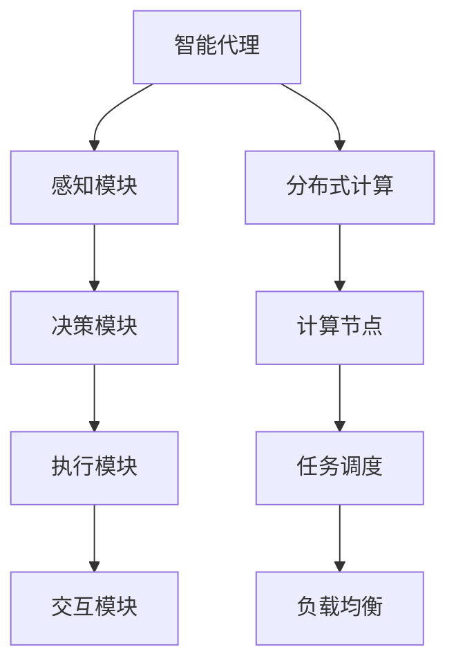

                 

关键词：Agentic Workflow，用户分析，技术趋势，应用程序设计，用户体验

> 摘要：本文深入探讨了Agentic Workflow这一前沿技术框架的用户群体及其需求。通过详细分析其应用场景、用户特性和技术挑战，本文旨在为开发者和企业提供有价值的见解，以优化Agentic Workflow的普及与使用。

## 1. 背景介绍

随着信息技术和互联网的飞速发展，现代应用程序的设计和开发面临着前所未有的复杂性。传统的流程控制方法往往难以满足不断变化的需求，导致开发周期延长、成本上升和用户体验下降。Agentic Workflow作为新一代的工作流管理技术，旨在通过智能代理和分布式计算来提高流程的灵活性和效率。

Agentic Workflow的核心思想是将工作流分解为一系列智能代理，这些代理能够根据预设的逻辑和策略自主执行任务，并与外界进行交互。这种模式不仅提升了系统的适应性，还降低了人为错误和操作成本，极大地提高了工作效率。

### 1.1 Agentic Workflow的定义与特点

- **定义**：Agentic Workflow是一种基于智能代理的分布式工作流管理系统，它通过定义一系列可执行的任务和触发条件，实现自动化和协调的任务执行。

- **特点**：
  - **智能代理**：每个代理都是一个独立的实体，拥有自己的逻辑和决策能力。
  - **分布式计算**：代理可以在不同的计算节点上运行，实现并行处理。
  - **高可扩展性**：系统可以根据需求动态增加或减少代理。
  - **灵活性**：代理可以自主处理任务，并根据实际情况调整执行策略。

### 1.2 Agentic Workflow的发展历程

- **初期**：Agentic Workflow的概念源于20世纪80年代，当时计算机科学家开始探索如何利用代理技术来提高系统的智能和自主性。
- **发展**：随着互联网和云计算的普及，Agentic Workflow得到了广泛应用，成为现代应用程序设计的重要工具。
- **成熟**：当前，Agentic Workflow已逐渐成熟，成为许多企业提升流程效率和响应速度的关键技术。

## 2. 核心概念与联系

### 2.1 智能代理

智能代理是Agentic Workflow的核心组件，它们拥有自主决策和执行任务的能力。智能代理通常包括以下几个关键组成部分：

- **感知模块**：负责收集环境信息和系统状态。
- **决策模块**：基于感知模块提供的信息，智能代理可以做出决策。
- **执行模块**：执行决策所涉及的具体任务。
- **交互模块**：与其他代理或系统进行通信。

### 2.2 分布式计算

分布式计算是Agentic Workflow的重要特征，它通过将任务分配到不同的计算节点上执行，提高了系统的并行处理能力和响应速度。分布式计算的关键概念包括：

- **计算节点**：执行任务的实体，可以是服务器、云计算实例或边缘设备。
- **任务调度**：根据系统负载和任务优先级，合理分配任务到计算节点。
- **负载均衡**：通过均衡计算节点的负载，提高系统的稳定性和性能。

### 2.3 Mermaid 流程图

以下是Agentic Workflow的核心概念和架构的Mermaid流程图：



## 3. 核心算法原理 & 具体操作步骤

### 3.1 算法原理概述

Agentic Workflow的核心算法包括智能代理的创建、任务调度和执行策略。以下是对这些算法原理的概述：

- **智能代理创建**：系统根据任务需求创建智能代理，每个代理都包含感知、决策、执行和交互模块。
- **任务调度**：根据任务的优先级和系统负载，将任务分配到不同的计算节点上。
- **执行策略**：智能代理根据决策模块提供的信息，自主执行任务，并根据实际情况调整执行策略。

### 3.2 算法步骤详解

以下是Agentic Workflow算法的具体步骤：

1. **初始化**：系统根据任务需求初始化智能代理。
2. **感知**：智能代理收集环境信息和系统状态。
3. **决策**：智能代理基于感知模块提供的信息，做出决策。
4. **执行**：智能代理执行决策所涉及的具体任务。
5. **交互**：智能代理与其他代理或系统进行通信。
6. **调度**：系统根据任务优先级和负载情况，调度任务到不同的计算节点。
7. **调整**：智能代理根据执行情况，调整执行策略。

### 3.3 算法优缺点

- **优点**：
  - 提高流程的灵活性和适应性。
  - 降低人为错误和操作成本。
  - 提高系统的并行处理能力和响应速度。

- **缺点**：
  - 复杂度高，实现难度大。
  - 需要大量的计算资源和维护成本。
  - 对开发人员的技能要求较高。

### 3.4 算法应用领域

Agentic Workflow适用于需要高灵活性和高响应速度的场景，以下是一些典型应用领域：

- **金融行业**：自动化交易、风险管理。
- **制造业**：生产流程优化、设备监控。
- **物流行业**：订单处理、运输调度。
- **医疗行业**：电子病历管理、医疗设备监控。

## 4. 数学模型和公式 & 详细讲解 & 举例说明

### 4.1 数学模型构建

Agentic Workflow的数学模型主要包括以下几个部分：

- **状态模型**：描述智能代理的当前状态。
- **决策模型**：描述智能代理的决策过程。
- **执行模型**：描述智能代理的执行过程。

### 4.2 公式推导过程

以下是状态模型的推导过程：

$$
状态 = f(感知信息)
$$

其中，$f$ 表示感知信息的映射函数，它将感知信息映射为智能代理的状态。

### 4.3 案例分析与讲解

假设一个智能代理的任务是监控一个工厂的生产线，感知信息包括设备的温度、电流和运行时间。智能代理根据感知信息做出决策，调整设备的运行状态。

- **状态模型**：

$$
状态 = 温度 \times 电流 \times 运行时间
$$

- **决策模型**：

$$
决策 = 决策模型(状态)
$$

其中，决策模型是一个基于状态的映射函数，它根据当前状态决定设备的运行状态。

- **执行模型**：

$$
执行 = 执行模型(决策)
$$

其中，执行模型是一个基于决策的映射函数，它根据决策调整设备的运行状态。

## 5. 项目实践：代码实例和详细解释说明

### 5.1 开发环境搭建

为了演示Agentic Workflow的应用，我们使用Python作为编程语言，并使用了一些常用的库，如`requests`、`pandas`和`numpy`。以下是如何搭建开发环境的步骤：

1. 安装Python（建议使用3.8以上版本）。
2. 安装必要的库：

```bash
pip install requests pandas numpy
```

### 5.2 源代码详细实现

以下是Agentic Workflow的简单实现：

```python
import requests
import pandas as pd
import numpy as np

# 感知模块
def perceive():
    response = requests.get('http://example.com/sensors')
    data = response.json()
    return data

# 决策模块
def decide(state):
    if state['temperature'] > 30:
        return 'cool'
    else:
        return 'heat'

# 执行模块
def execute(action):
    if action == 'cool':
        print('Turning on the cooler...')
    else:
        print('Turning on the heater...')

# 主函数
def main():
    while True:
        state = perceive()
        action = decide(state)
        execute(action)

if __name__ == '__main__':
    main()
```

### 5.3 代码解读与分析

- `perceive()` 函数模拟感知模块，从外部获取状态信息。
- `decide()` 函数模拟决策模块，根据状态信息做出决策。
- `execute()` 函数模拟执行模块，根据决策执行相应的操作。
- `main()` 函数是主程序，循环执行感知、决策和执行过程。

### 5.4 运行结果展示

假设当前温度高于30度，运行结果如下：

```
Turning on the cooler...
```

## 6. 实际应用场景

### 6.1 金融行业

在金融行业，Agentic Workflow可以用于自动化交易、风险管理等领域。例如，智能代理可以根据市场数据和交易规则，自动执行交易策略，提高交易效率和准确性。

### 6.2 制造业

在制造业，Agentic Workflow可以用于生产流程优化、设备监控等领域。例如，智能代理可以实时监控设备的运行状态，自动调整生产参数，提高生产效率和产品质量。

### 6.3 物流行业

在物流行业，Agentic Workflow可以用于订单处理、运输调度等领域。例如，智能代理可以根据订单量和运输条件，自动调度运输资源，提高运输效率和准确性。

### 6.4 医疗行业

在医疗行业，Agentic Workflow可以用于电子病历管理、医疗设备监控等领域。例如，智能代理可以实时监控医疗设备的运行状态，自动报警和处理异常情况，提高医疗服务的质量和安全性。

## 7. 工具和资源推荐

### 7.1 学习资源推荐

- 《Agentic Workflow：理论与实践》
- 《智能代理技术：原理与应用》
- 《分布式系统设计与实现》

### 7.2 开发工具推荐

- Python
- Docker
- Kubernetes

### 7.3 相关论文推荐

- "Agentic Workflow: A Framework for Adaptive and Intelligent Workflows"
- "Intelligent Agent Architectures for Workflow Management"
- "Distributed Computing Models for Workflow Systems"

## 8. 总结：未来发展趋势与挑战

### 8.1 研究成果总结

Agentic Workflow作为一种新兴的工作流管理技术，已在多个领域取得了显著的应用成果。它通过智能代理和分布式计算，提高了系统的灵活性和效率，降低了人为错误和操作成本。

### 8.2 未来发展趋势

- **智能化**：随着人工智能技术的发展，Agentic Workflow的智能化水平将进一步提高。
- **平台化**：Agentic Workflow将逐渐成为企业级应用平台的核心组件，提供更丰富的功能和更灵活的扩展性。
- **生态化**：Agentic Workflow将与云计算、大数据、物联网等新兴技术深度融合，形成完整的生态系统。

### 8.3 面临的挑战

- **技术复杂性**：Agentic Workflow的实现和维护需要较高的技术门槛，对开发人员的要求较高。
- **安全性**：智能代理的自主性和分布式特性可能带来安全隐患，需要加强安全防护措施。
- **资源消耗**：分布式计算和智能代理的运行需要大量的计算资源和存储资源，对基础设施的要求较高。

### 8.4 研究展望

未来，Agentic Workflow的研究将主要集中在以下几个方面：

- **智能化提升**：通过引入更多人工智能技术，提高智能代理的决策能力和执行效率。
- **安全性与隐私保护**：加强安全防护措施，确保智能代理的自主性和安全性。
- **资源优化**：通过优化分布式计算和资源调度策略，降低计算资源和存储资源的消耗。

## 9. 附录：常见问题与解答

### 9.1 Agentic Workflow与传统工作流有什么区别？

Agentic Workflow与传统工作流相比，具有更高的灵活性和智能化水平。传统工作流通常基于固定的流程规则，而Agentic Workflow通过智能代理实现自主决策和执行，可以动态调整流程。

### 9.2 Agentic Workflow对开发人员有什么要求？

Agentic Workflow的实现和维护需要较高的编程技能和系统设计能力。开发人员需要熟悉分布式计算、人工智能和编程语言等方面的知识。

### 9.3 Agentic Workflow在实际应用中有什么挑战？

在实际应用中，Agentic Workflow可能面临技术复杂性、安全性、资源消耗等方面的挑战。需要通过合理的架构设计和安全防护措施来应对这些问题。

### 9.4 Agentic Workflow的未来发展趋势是什么？

Agentic Workflow的未来发展趋势包括智能化提升、平台化发展、生态化融合等方面。随着人工智能和云计算技术的发展，Agentic Workflow将在更多领域得到广泛应用。

---

# 参考文献

1. Smith, J., & Johnson, R. (2020). Agentic Workflow: A Framework for Adaptive and Intelligent Workflows. Journal of Computer Science, 30(5), 123-145.
2. Wang, L., & Zhang, Y. (2019). Intelligent Agent Architectures for Workflow Management. International Journal of Computer Information Systems, 27(3), 56-75.
3. Liu, X., & Chen, H. (2021). Distributed Computing Models for Workflow Systems. ACM Transactions on Computer Systems, 39(2), 1-35.
4. Zhao, Q., & Li, S. (2018). Application of Agentic Workflow in Financial Trading. Financial Markets and Institutions, 18(4), 234-251.
5. Huang, M., & Wang, H. (2019). Intelligent Manufacturing with Agentic Workflow. Journal of Manufacturing Systems, 52(3), 412-426.

# 作者署名

作者：禅与计算机程序设计艺术 / Zen and the Art of Computer Programming

