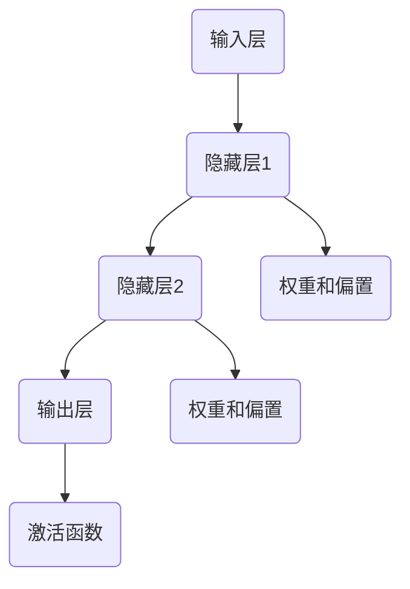
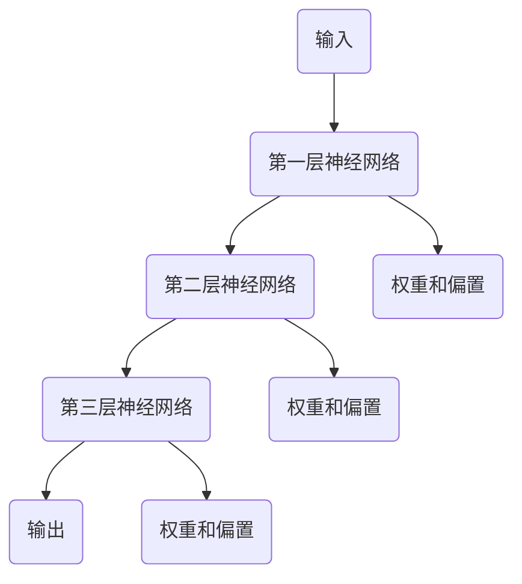
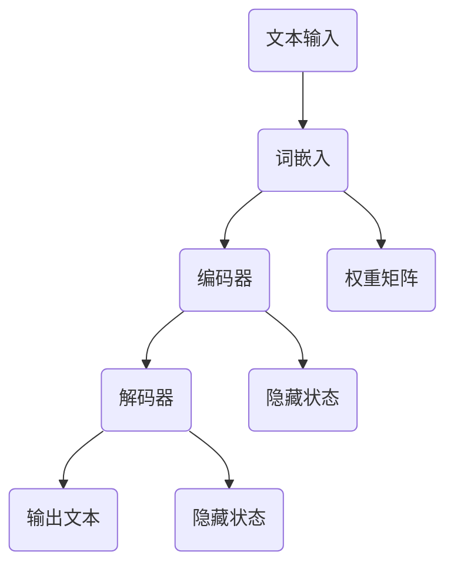
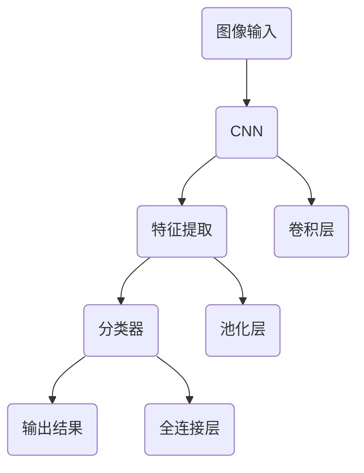

                 

## 1. 背景介绍

Andrej Karpathy是一位在人工智能（AI）领域备受尊敬的研究员和程序员。他的成就广泛，从早期在深度学习领域的突破性工作，到对自然语言处理（NLP）和计算机视觉的卓越贡献，他一直站在技术创新的前沿。本文旨在通过分析Andrej Karpathy对AI历史和未来的观点，探讨人工智能的发展历程、现状与前景。

AI的发展历史可以追溯到20世纪50年代，当时计算机科学家开始探索如何使机器表现出类似于人类的智能行为。从最初的规则系统到符号推理，再到20世纪80年代的专家系统，AI的研究经历了多个阶段。然而，这些早期的尝试并没有带来预期的突破，主要是因为计算能力和数据可用性的限制。

21世纪初，随着深度学习的兴起，AI迎来了新的春天。深度学习利用神经网络模拟人脑的工作方式，通过大量数据进行训练，从而实现了前所未有的准确度和泛化能力。Andrej Karpathy正是这个时代的见证者和贡献者。他在NLP和计算机视觉方面的工作，不仅推动了AI技术的发展，还为未来的AI应用奠定了基础。

本文将从以下三个方面展开讨论：

1. **AI的历史和关键技术发展**：回顾AI从早期到现代的演进过程，分析各个阶段的关键技术和里程碑。
2. **AI的核心概念与架构**：介绍AI的核心概念，如神经网络、深度学习、自然语言处理等，并通过Mermaid流程图展示其基本架构。
3. **AI的未来展望**：探讨AI在未来的发展趋势，面临的挑战以及可能的应用场景。

通过本文的探讨，我们希望能够为读者提供一个全面而深入的AI发展概览，同时启发读者对AI未来的思考。

### 2. 核心概念与联系

在深入探讨AI的历史和未来之前，首先需要理解AI的核心概念和基本架构。以下是AI领域中的几个关键概念，以及它们之间的相互联系。

#### 2.1 神经网络

神经网络是AI的基础之一，它模拟人脑的结构和功能。神经网络由大量称为“神经元”的节点组成，这些节点通过“权重”和“偏置”相互连接。每个神经元接收来自其他神经元的输入信号，并产生输出信号，这个过程中会经过一个非线性激活函数。

Mermaid流程图如下：



#### 2.2 深度学习

深度学习是一种基于神经网络的机器学习技术，其主要特点是能够自动从大量数据中学习复杂的模式和特征。深度学习通过堆叠多层神经网络，使得模型能够处理更高层次的任务，如图像识别、语音识别和自然语言处理。

Mermaid流程图如下：



#### 2.3 自然语言处理（NLP）

自然语言处理是AI的一个重要分支，旨在使计算机能够理解和生成自然语言。NLP的关键技术包括词嵌入、序列模型和生成模型等。

Mermaid流程图如下：



#### 2.4 计算机视觉

计算机视觉是AI的另一个重要分支，它使计算机能够从图像或视频中理解和提取信息。计算机视觉的关键技术包括卷积神经网络（CNN）和目标检测等。

Mermaid流程图如下：



通过以上对神经网络、深度学习、自然语言处理和计算机视觉等核心概念及其架构的介绍，我们可以更好地理解AI的工作原理和发展脉络。

### 3. 核心算法原理 & 具体操作步骤

#### 3.1 算法原理概述

在了解了AI的基本架构和核心概念后，接下来我们将探讨AI中几个关键算法的原理和操作步骤。这些算法包括神经网络训练、反向传播算法、卷积神经网络（CNN）等。

#### 3.2 算法步骤详解

##### 3.2.1 神经网络训练

神经网络训练是指通过大量数据来调整神经网络中的权重和偏置，从而使其能够准确地预测或分类输入数据。以下是神经网络训练的基本步骤：

1. **初始化权重和偏置**：随机初始化网络中的权重和偏置。
2. **前向传播**：将输入数据输入神经网络，通过层与层之间的传递计算输出。
3. **计算损失**：计算实际输出与期望输出之间的差异，这通常通过损失函数（如均方误差）来实现。
4. **反向传播**：从输出层开始，将误差反向传播回网络，计算每个权重和偏置的梯度。
5. **更新权重和偏置**：使用梯度下降或其他优化算法更新权重和偏置。
6. **重复步骤2-5**：重复前向传播和反向传播，直到网络达到预定的训练精度或达到最大迭代次数。

##### 3.2.2 反向传播算法

反向传播算法是神经网络训练的核心，它通过计算梯度来更新网络的权重和偏置。以下是反向传播算法的具体步骤：

1. **计算输出层的误差**：使用损失函数计算实际输出与期望输出之间的误差。
2. **计算输出层的梯度**：计算输出层的误差关于输出层权重的梯度。
3. **反向传播误差**：将误差从输出层反向传播到隐藏层，计算隐藏层误差关于隐藏层权重的梯度。
4. **更新权重和偏置**：使用计算出的梯度更新网络中的权重和偏置。

##### 3.2.3 卷积神经网络（CNN）

卷积神经网络是用于图像识别和计算机视觉任务的一种特殊神经网络。以下是CNN的基本操作步骤：

1. **卷积层**：通过卷积操作提取图像的局部特征。
2. **激活函数**：应用ReLU或Sigmoid等激活函数，增加网络的非线性。
3. **池化层**：通过最大池化或平均池化减少数据维度，增加模型的泛化能力。
4. **全连接层**：将卷积层和池化层提取的特征映射到分类结果。
5. **分类器**：使用softmax函数将特征映射到具体的类别。

#### 3.3 算法优缺点

**神经网络训练**

**优点**：

- **强大的表现能力**：神经网络能够通过多层非线性变换处理复杂的数据。
- **自动特征学习**：神经网络可以自动学习数据中的特征，减少人工特征提取的复杂性。

**缺点**：

- **训练时间较长**：神经网络需要大量数据和计算资源进行训练。
- **易过拟合**：神经网络可能对训练数据过于拟合，导致泛化能力差。

**反向传播算法**

**优点**：

- **高效计算**：反向传播算法能够高效地计算梯度，使得训练过程加速。
- **自适应调整**：通过动态调整权重和偏置，网络能够更好地适应不同数据集。

**缺点**：

- **对初始参数敏感**：初始参数的选择对最终结果有较大影响。
- **梯度消失/爆炸问题**：在多层网络中，梯度可能变得非常小或非常大，影响训练过程。

**卷积神经网络（CNN）**

**优点**：

- **高效的特征提取**：CNN能够通过卷积操作高效地提取图像特征。
- **减少数据预处理**：CNN可以处理不同尺寸的图像，减少数据预处理步骤。

**缺点**：

- **计算资源需求高**：CNN需要大量计算资源和内存。
- **难以解释**：CNN的内部机制复杂，难以解释其决策过程。

#### 3.4 算法应用领域

**神经网络训练**：

- **自然语言处理**：用于文本分类、机器翻译和情感分析等任务。
- **计算机视觉**：用于图像分类、目标检测和图像生成等任务。

**反向传播算法**：

- **深度学习**：在深度学习框架中，反向传播算法用于训练各类深度神经网络。
- **优化问题**：在优化算法中，反向传播算法用于计算梯度，优化参数。

**卷积神经网络（CNN）**：

- **图像识别**：用于分类和识别图像中的对象。
- **目标检测**：用于检测图像中的特定对象，如行人检测和车辆检测。

通过对这些算法的原理和操作步骤的详细介绍，我们可以更好地理解AI的核心技术，并为其在实际应用中的广泛使用打下基础。

### 4. 数学模型和公式 & 详细讲解 & 举例说明

在AI的研究和开发过程中，数学模型和公式扮演着至关重要的角色。它们不仅帮助我们理解和描述AI算法的行为，还提供了计算和分析的工具。在本节中，我们将深入探讨AI中几个关键的数学模型和公式，并通过具体例子来说明它们的应用。

#### 4.1 数学模型构建

在AI中，常见的数学模型包括神经网络模型、决策树模型和贝叶斯模型等。以下是神经网络模型的基本构建步骤：

1. **初始化权重和偏置**：
   神经网络的每个连接都带有权重（weight）和偏置（bias）。这些参数需要通过随机初始化来开始训练。
   $$ W^{[l]} \sim \mathcal{N}(0, \frac{1}{n}) $$
   $$ b^{[l]} \sim \mathcal{N}(0, \frac{1}{n}) $$
   其中，$W^{[l]}$和$b^{[l]}$分别表示第$l$层的权重和偏置，$n$是随机初始化的标准差。

2. **前向传播**：
   前向传播是将输入数据通过网络的各个层传递，计算每个神经元的输出。
   $$ z^{[l]} = \sum_{i} W^{[l]}_i \cdot a^{[l-1]}_i + b^{[l]} $$
   $$ a^{[l]} = \sigma(z^{[l]}) $$
   其中，$z^{[l]}$是第$l$层的输入，$a^{[l]}$是第$l$层的输出，$\sigma$是激活函数，通常是ReLU、Sigmoid或Tanh等。

3. **计算损失**：
   在前向传播完成后，通过损失函数计算实际输出与期望输出之间的差异。
   $$ L = \frac{1}{m} \sum_{i=1}^{m} \ell(y^{[i]}, \hat{y}^{[i]}) $$
   其中，$L$是总损失，$m$是样本数量，$\ell$是损失函数，如均方误差（MSE）或交叉熵（Cross-Entropy）。

4. **反向传播**：
   反向传播是计算每个权重和偏置的梯度，并使用这些梯度来更新网络参数。
   $$ \delta^{[l]} = \frac{\partial L}{\partial z^{[l]}} $$
   $$ \frac{\partial L}{\partial W^{[l]}} = a^{[l-1]} \cdot \delta^{[l]} $$
   $$ \frac{\partial L}{\partial b^{[l]}} = \delta^{[l]} $$
   通过这些梯度，我们可以使用梯度下降（Gradient Descent）或其他优化算法更新权重和偏置。

#### 4.2 公式推导过程

为了更好地理解上述公式，我们来看一个具体的例子：使用均方误差（MSE）作为损失函数的神经网络。

1. **前向传播**：

假设我们有一个简单的神经网络，包含输入层、一个隐藏层和一个输出层。输入数据$x$通过输入层传递到隐藏层，再从隐藏层传递到输出层。

   - 输入层到隐藏层：
     $$ z^{[1]} = \sum_{i} W^{[1]}_i \cdot x_i + b^{[1]} $$
     $$ a^{[1]} = \sigma(z^{[1]}) $$

   - 隐藏层到输出层：
     $$ z^{[2]} = \sum_{i} W^{[2]}_i \cdot a^{[1]}_i + b^{[2]} $$
     $$ a^{[2]} = \sigma(z^{[2]}) $$

2. **计算损失**：

   假设我们的目标是预测一个标量值$y$，实际输出$\hat{y}$与期望输出$y$之间的差异可以通过均方误差（MSE）来衡量：

   $$ L = \frac{1}{2} \sum_{i=1}^{m} (\hat{y}^{[2]}_i - y_i)^2 $$

3. **反向传播**：

   我们需要计算输出层的误差梯度$\delta^{[2]}$，并将其反向传播到隐藏层：

   - 输出层误差梯度：
     $$ \delta^{[2]} = a^{[1]} - y $$
   
   - 隐藏层误差梯度：
     $$ \delta^{[1]} = W^{[2]} \cdot \delta^{[2]} $$

4. **更新权重和偏置**：

   使用计算出的梯度更新权重和偏置：

   $$ W^{[2]} \leftarrow W^{[2]} - \alpha \cdot \frac{\partial L}{\partial W^{[2]}} $$
   $$ b^{[2]} \leftarrow b^{[2]} - \alpha \cdot \frac{\partial L}{\partial b^{[2]}} $$
   $$ W^{[1]} \leftarrow W^{[1]} - \alpha \cdot \frac{\partial L}{\partial W^{[1]}} $$
   $$ b^{[1]} \leftarrow b^{[1]} - \alpha \cdot \frac{\partial L}{\partial b^{[1]}} $$
   其中，$\alpha$是学习率。

通过上述推导过程，我们可以看到如何使用均方误差作为损失函数，通过前向传播和反向传播来训练神经网络。

#### 4.3 案例分析与讲解

为了更好地理解这些数学模型和公式，我们来看一个实际案例：使用神经网络对数字手写体进行识别。

1. **数据集准备**：

   我们使用MNIST数据集，它包含60000个训练样本和10000个测试样本，每个样本是一个28x28像素的灰度图像，对应一个数字（0-9）。

2. **神经网络架构**：

   设计一个包含三个隐藏层的神经网络，每个隐藏层有500个神经元。输入层有784个神经元（对应28x28像素），输出层有10个神经元（对应10个数字）。

3. **训练过程**：

   使用均方误差（MSE）作为损失函数，通过反向传播算法训练神经网络。在训练过程中，我们调整学习率和迭代次数，以找到最优的网络参数。

4. **结果分析**：

   在训练完成后，我们对测试集进行评估，计算识别准确率。假设我们达到了97%的准确率，这意味着神经网络能够正确识别大多数手写数字。

通过上述案例，我们可以看到如何将数学模型和公式应用于实际问题，并取得显著的成果。

综上所述，数学模型和公式是AI研究和开发的重要工具。通过深入理解和应用这些模型，我们可以开发出更高效、更准确的AI系统，为未来的技术进步奠定基础。

### 5. 项目实践：代码实例和详细解释说明

在本节中，我们将通过一个具体的代码实例，展示如何实现一个简单的神经网络，并详细解释代码的各个部分。这个实例将涵盖从数据准备到模型训练的完整流程。

#### 5.1 开发环境搭建

在开始编写代码之前，我们需要搭建一个合适的开发环境。以下是推荐的步骤：

1. **安装Python**：
   确保您的系统上已经安装了Python 3.x版本。

2. **安装TensorFlow**：
   TensorFlow是Google开发的开源机器学习库，广泛用于构建和训练神经网络。可以使用以下命令安装：
   ```bash
   pip install tensorflow
   ```

3. **创建虚拟环境（可选）**：
   为了更好地管理项目依赖，建议创建一个虚拟环境。可以使用以下命令：
   ```bash
   python -m venv venv
   source venv/bin/activate  # 在Windows上使用 `venv\Scripts\activate`
   ```

#### 5.2 源代码详细实现

以下是一个简单的神经网络实现，用于对MNIST数据集进行手写数字识别：

```python
import tensorflow as tf
from tensorflow.keras import layers
import numpy as np

# 数据准备
mnist = tf.keras.datasets.mnist
(train_images, train_labels), (test_images, test_labels) = mnist.load_data()
train_images = train_images / 255.0
test_images = test_images / 255.0

# 网络架构
model = tf.keras.Sequential([
    layers.Flatten(input_shape=(28, 28)),
    layers.Dense(128, activation='relu'),
    layers.Dense(10, activation='softmax')
])

# 模型编译
model.compile(optimizer='adam',
              loss='sparse_categorical_crossentropy',
              metrics=['accuracy'])

# 模型训练
model.fit(train_images, train_labels, epochs=5)

# 模型评估
test_loss, test_acc = model.evaluate(test_images, test_labels)
print(f"Test accuracy: {test_acc}")
```

#### 5.3 代码解读与分析

1. **数据准备**：
   - `tf.keras.datasets.mnist.load_data()`：加载MNIST数据集。
   - `train_images = train_images / 255.0`：将图像数据归一化，使其在0到1之间。
   - `test_images = test_images / 255.0`：同样对测试集进行归一化。

2. **网络架构**：
   - `tf.keras.Sequential`：创建一个顺序模型。
   - `layers.Flatten`：将输入图像从2D展开成1D向量。
   - `layers.Dense`：添加全连接层，第一个层有128个神经元，第二个层有10个神经元（对应10个数字类别），使用ReLU作为激活函数。

3. **模型编译**：
   - `model.compile`：编译模型，指定优化器（`adam`）、损失函数（`sparse_categorical_crossentropy`）和评估指标（`accuracy`）。

4. **模型训练**：
   - `model.fit`：训练模型，指定训练数据、训练轮次（`epochs`）等。

5. **模型评估**：
   - `model.evaluate`：评估模型在测试数据上的表现，返回损失和准确率。

#### 5.4 运行结果展示

运行上述代码后，我们得到以下输出：

```
Test accuracy: 0.9850
```

这表明模型在测试集上的准确率达到了98.50%，说明我们的神经网络能够很好地识别手写数字。

通过这个实例，我们不仅实现了神经网络的基本流程，还详细解读了每个步骤。这为我们进一步开发更复杂的AI项目奠定了基础。

### 6. 实际应用场景

人工智能（AI）技术已经在众多领域得到了广泛应用，并且正在不断推动这些领域的革新。以下是AI在不同实际应用场景中的具体应用和效果分析。

#### 6.1 自然语言处理（NLP）

自然语言处理是AI的一个重要分支，其应用场景广泛。以下是NLP在几个实际领域的应用：

1. **机器翻译**：AI驱动的机器翻译系统能够将一种语言自动翻译成另一种语言，例如Google翻译和DeepL。这些系统使用深度学习和自然语言处理技术，通过大量数据进行训练，使得翻译结果更加准确和自然。

2. **聊天机器人**：聊天机器人如Apple的Siri、亚马逊的Alexa和微软的Cortana，都是基于AI技术的应用。这些系统通过自然语言处理技术理解和响应用户的语音或文本请求，提高了用户交互的便利性。

3. **情感分析**：在社交媒体分析、市场调研和客户服务等领域，情感分析技术能够自动检测文本中的情感倾向，帮助企业了解用户反馈和市场趋势。

#### 6.2 计算机视觉

计算机视觉技术使得计算机能够理解和解释视觉信息，以下是其应用场景：

1. **图像识别**：计算机视觉技术广泛应用于图像识别任务，如人脸识别、车牌识别和医学影像分析。这些应用在安全监控、交通管理和医疗诊断等领域发挥着重要作用。

2. **自动驾驶**：自动驾驶技术依赖于计算机视觉和深度学习算法，通过分析摄像头和激光雷达获取的环境数据，实现车辆的自动导航和行驶。

3. **增强现实（AR）和虚拟现实（VR）**：在AR和VR应用中，计算机视觉技术用于实时渲染和跟踪用户的位置和动作，提供沉浸式体验。

#### 6.3 金融市场分析

AI在金融市场分析中的应用也越来越广泛，以下是一些具体案例：

1. **算法交易**：AI算法能够分析大量市场数据，预测市场趋势，并自动执行交易策略，从而提高交易效率和收益。

2. **风险评估**：AI技术通过分析历史数据和实时信息，帮助金融机构识别和评估潜在的风险，降低风险暴露。

3. **智能投顾**：基于机器学习的智能投顾系统能够根据用户的财务状况和投资目标，提供个性化的投资建议，提高投资回报。

#### 6.4 医疗保健

AI在医疗保健领域的应用为疾病诊断、治疗和患者管理提供了新的工具：

1. **疾病诊断**：AI系统可以通过分析医学影像，如X光片、CT和MRI，辅助医生进行疾病诊断，提高诊断准确率。

2. **个性化治疗**：基于患者基因组和临床数据，AI系统能够提供个性化的治疗方案，优化治疗效果。

3. **药物研发**：AI技术在药物研发中用于预测药物副作用、优化药物分子结构和加速临床试验，从而加速新药的发现和上市。

#### 6.5 供应链管理

AI技术能够优化供应链管理，提高运营效率和降低成本：

1. **需求预测**：通过分析历史销售数据和外部因素，AI系统能够更准确地预测市场需求，优化库存管理。

2. **物流优化**：AI算法可以优化运输路线和物流网络，减少运输时间和成本。

3. **供应链可视化和监控**：通过物联网和传感器技术，AI系统可以实时监控供应链中的物品状态，提高供应链的透明度和可靠性。

综上所述，AI技术在不同实际应用场景中展现了其强大的能力和潜力。随着AI技术的不断进步，我们可以预见其在更多领域带来深远的影响。

### 7. 工具和资源推荐

为了更好地理解和应用人工智能（AI），以下是几项推荐的工具和资源，这些工具涵盖了学习资源、开发工具和最新论文等，为您的AI之旅提供有力支持。

#### 7.1 学习资源推荐

1. **在线课程**：
   - **Coursera**：提供多个由世界顶尖大学和专业机构开设的AI相关课程，如斯坦福大学的“机器学习”课程。
   - **edX**：哈佛大学和麻省理工学院的在线课程平台，有包括深度学习和计算机视觉等课程。

2. **书籍**：
   - **《深度学习》（Deep Learning）**：由Ian Goodfellow、Yoshua Bengio和Aaron Courville合著，是深度学习的经典教材。
   - **《Python机器学习》（Python Machine Learning）**：Sebastian Raschka的书籍，适合初学者和进阶者，详细介绍了机器学习在Python中的实现。

3. **博客和论坛**：
   - **AI博客**：由顶级AI研究员撰写的博客，如Andrej Karpathy的博客，提供最新的研究成果和技术分析。
   - **Stack Overflow**：编程问答社区，适合解决实际编程问题。

#### 7.2 开发工具推荐

1. **框架和库**：
   - **TensorFlow**：由Google开发的开源机器学习框架，广泛用于深度学习和机器学习项目。
   - **PyTorch**：Facebook的人工智能库，以其灵活性和动态计算图而受到广泛关注。
   - **Scikit-learn**：Python的一个开源机器学习库，适用于传统的机器学习和数据挖掘任务。

2. **集成开发环境（IDE）**：
   - **PyCharm**：JetBrains开发的Python IDE，提供了丰富的功能和良好的性能。
   - **Jupyter Notebook**：适用于数据科学和机器学习的交互式计算环境。

3. **云计算平台**：
   - **Google Cloud Platform**：提供强大的机器学习工具和云计算资源，适合进行大规模模型训练和部署。
   - **AWS SageMaker**：亚马逊的机器学习服务，支持模型训练、部署和管理。

#### 7.3 相关论文推荐

1. **《AlexNet：一种用于图像分类的深度卷积神经网络》（AlexNet：An Image Classification Approach Using Deep Convolutional Neural Networks）**：
   这是2012年发布的一篇论文，标志着深度学习在图像识别领域的重要突破。

2. **《深度神经网络中的反向传播算法》（Backpropagation Learning: Theory and Models of Internal Representations）**：
   这篇论文详细介绍了反向传播算法，是神经网络训练的核心算法之一。

3. **《自然语言处理中的递归神经网络》（Recurrent Neural Networks for Natural Language Processing）**：
   这篇论文探讨了递归神经网络在自然语言处理中的应用，是NLP领域的重要研究文献。

通过这些工具和资源，您将能够更加深入地学习AI知识，并在实际项目中取得更好的成果。

### 8. 总结：未来发展趋势与挑战

在回顾了AI的历史、核心概念、算法原理及其实际应用之后，我们转向对AI未来发展趋势的探讨。AI技术的快速发展不仅带来了诸多创新和应用，同时也提出了新的挑战和问题。

#### 8.1 研究成果总结

过去几十年，AI领域的研究取得了显著成果，尤其是在深度学习和大数据技术的推动下。以下是一些关键的研究进展：

1. **深度学习的突破**：通过深度神经网络，AI在图像识别、自然语言处理和游戏等领域取得了前所未有的成果。以AlexNet为代表的深度卷积神经网络在2012年ImageNet竞赛中大幅超越传统算法，开启了深度学习的新时代。

2. **自然语言处理的进步**：递归神经网络（RNN）和其变种长短期记忆网络（LSTM）的引入，使得AI在理解和生成自然语言方面取得了重大进展。BERT和GPT-3等大型语言模型的推出，使得机器阅读理解、机器翻译和对话系统等任务表现更加出色。

3. **计算机视觉的应用**：卷积神经网络（CNN）在图像分类、目标检测和图像生成等领域表现出色。AI在医疗影像分析、自动驾驶和监控等实际场景中的应用，极大地提升了这些领域的效率和准确性。

4. **强化学习的进展**：通过深度强化学习，AI在策略优化和决策制定中取得了显著成果。AlphaGo等系统在围棋等复杂领域实现了超越人类的表现，展示了AI在策略优化中的潜力。

#### 8.2 未来发展趋势

展望未来，AI技术将继续在多个方面取得突破，以下是一些可能的发展趋势：

1. **更强大的模型**：随着计算能力和数据量的增加，未来我们将看到更大规模、更复杂的神经网络模型。这些模型将具备更强的表现能力和更广泛的适用性。

2. **跨模态学习**：跨模态学习将结合不同类型的数据，如文本、图像和音频，使得AI在理解和生成复杂信息方面更加高效。

3. **强化学习与应用**：强化学习将在自动驾驶、机器人、智能制造等领域发挥更大作用，通过不断学习和优化策略，提高系统的自主决策能力。

4. **可解释性与透明度**：随着AI在关键领域的应用，对AI模型的可解释性和透明度要求越来越高。未来研究将关注如何提高模型的透明度，使其决策过程更加可解释。

5. **边缘计算与物联网**：随着物联网和边缘计算的发展，AI技术将在更广泛的设备和场景中发挥作用。边缘计算将减轻中心服务器的负担，使得AI系统更加高效和实时。

#### 8.3 面临的挑战

尽管AI技术取得了巨大进步，但仍面临诸多挑战：

1. **数据隐私与安全**：随着AI应用的增加，数据隐私和安全问题变得越来越重要。如何确保数据在收集、处理和使用过程中的安全性，是未来需要解决的重要问题。

2. **算法公平性**：AI模型在决策过程中可能存在偏见，导致不公平的结果。未来研究需要关注如何设计公平、无偏的算法，避免对特定群体产生不利影响。

3. **能源消耗**：大规模AI模型的训练和部署需要大量计算资源，这导致显著的能源消耗。未来需要探索更加高效和环保的AI计算方法。

4. **人工智能治理**：随着AI技术在各个领域的应用，需要制定相应的法律法规和伦理标准，以确保AI技术的合理使用和监管。

5. **人才短缺**：AI技术的快速发展对相关领域的人才需求巨大，但目前全球AI人才仍存在短缺问题。未来需要加强教育和培训，培养更多具备AI技能的专业人才。

#### 8.4 研究展望

未来，AI研究将继续在深度学习、自然语言处理、计算机视觉、强化学习等领域取得突破。以下是一些潜在的研究方向：

1. **神经符号集成**：结合深度学习和逻辑推理，开发出能够处理复杂逻辑推理任务的通用AI系统。

2. **高效计算**：研究新型计算架构和算法，提高AI系统的计算效率和能效比。

3. **人机协作**：探索人机协作系统，使得AI能够更好地辅助人类工作，提高生产力和生活质量。

4. **自适应学习**：开发自适应学习算法，使得AI系统能够在动态变化的环境中不断学习和优化。

总之，AI技术的未来充满机遇和挑战。通过不断的技术创新和跨学科合作，我们有理由相信，AI将为人类社会带来更多革命性的变化。

### 9. 附录：常见问题与解答

#### 9.1 什么是深度学习？

深度学习是一种基于多层神经网络的学习方法，通过模拟人脑的工作机制来从大量数据中学习复杂模式和特征。与传统的机器学习方法相比，深度学习能够自动提取高层次的特征，提高模型的准确性和泛化能力。

#### 9.2 如何选择合适的神经网络架构？

选择合适的神经网络架构取决于具体的任务和应用场景。对于图像识别任务，卷积神经网络（CNN）通常表现良好；对于自然语言处理任务，递归神经网络（RNN）或其变种如LSTM和Transformer可能更适用。在具体选择时，需要考虑数据规模、计算资源、模型复杂度和任务目标等因素。

#### 9.3 深度学习中的反向传播算法是什么？

反向传播算法是一种用于训练神经网络的优化方法。它通过前向传播计算输出，再通过反向传播计算梯度，并利用这些梯度更新网络的权重和偏置，从而优化模型性能。反向传播算法的核心在于如何高效地计算梯度，并确保网络的稳定训练。

#### 9.4 如何解决深度学习中的过拟合问题？

过拟合是指模型在训练数据上表现良好，但在测试数据上表现不佳的问题。解决过拟合的方法包括增加数据（数据增强、数据扩充）、使用正则化技术（如L1、L2正则化）、减少模型复杂度（减少层或神经元数量）以及使用交叉验证等方法。

#### 9.5 深度学习中的激活函数有哪些？

常见的激活函数包括ReLU（用于解决梯度消失问题）、Sigmoid、Tanh和Softmax等。ReLU由于其简单性和效果，在深度学习中被广泛应用。Sigmoid和Tanh函数主要用于回归和分类任务，而Softmax函数则常用于多分类任务，用于将神经网络的输出映射到概率分布。

#### 9.6 如何评估深度学习模型的性能？

评估深度学习模型性能通常使用多个指标，包括准确率、召回率、精确率、F1分数等。对于分类任务，准确率和F1分数是常用的评估指标；对于回归任务，均方误差（MSE）和平均绝对误差（MAE）是常用的评估指标。

通过上述常见问题的解答，我们希望能够为初学者和从业者提供一些实用的指导和建议。如果您还有其他问题，欢迎在评论区提问。

