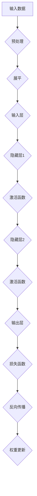

                 

 关键词：AI编程、新范式、深度学习、神经网络、编程语言、人工智能应用

> 摘要：本文旨在探讨由Andrej Karpathy提出的人工智能编程的新范式，通过分析其核心概念、算法原理、数学模型和具体应用场景，全面解读这一创新性编程范式的优势与潜力。

## 1. 背景介绍

人工智能（AI）的发展已经走过了数十年，从最初的理论探讨到如今的实际应用，AI技术已经深刻地影响了各行各业。然而，传统的编程范式在处理复杂的人工智能任务时显得力不从心。针对这一问题，深度学习和神经网络的研究取得了重大突破。而Andrej Karpathy则在此基础上提出了AI编程的新范式，旨在为开发者提供一种更加高效、直观的编程方式。

### 1.1 Andrej Karpathy简介

Andrej Karpathy是一位著名的人工智能研究员和程序员，现任Google AI研究员。他在深度学习和自然语言处理领域有着深厚的研究背景，并在多个顶级会议和期刊上发表过多篇论文。他的博客文章和开源项目在人工智能社区中广受关注，被广泛认为是对深度学习和AI编程有着深刻理解和独特见解的专家。

### 1.2 传统编程范式的局限性

传统编程范式主要依赖于显式的指令和逻辑控制结构，这种方式在处理简单问题时效果良好。然而，随着人工智能任务的复杂化，这种编程方式暴露出了诸多局限性：

- **代码复杂度增加**：复杂的人工智能任务往往需要大量的代码来实现，导致代码复杂度急剧上升。
- **可维护性差**：由于代码复杂，修改和维护变得更加困难，开发效率降低。
- **不可扩展性**：传统的编程范式难以适应复杂且动态变化的任务需求。
- **低效的调试过程**：复杂的代码结构和逻辑使得调试过程变得低效，错误定位困难。

## 2. 核心概念与联系

### 2.1 深度学习与神经网络

深度学习是人工智能领域的重要分支，其核心思想是通过多层神经网络模型来模拟人脑的神经元结构，从而实现对复杂数据的学习和处理。神经网络由多个层（Layer）组成，每一层包含多个神经元（Neurons），神经元之间通过权重（Weights）相连。

#### 2.1.1 神经网络结构


- **输入层（Input Layer）**：接收外部输入数据，每个神经元对应一个输入特征。
- **隐藏层（Hidden Layers）**：对输入数据进行处理，通过多层神经元的组合，提取特征并进行变换。
- **输出层（Output Layer）**：生成最终输出，可以是分类结果、预测值等。

#### 2.1.2 神经元激活函数

神经元之间的连接带有权重，通过激活函数（Activation Function）来决定神经元是否被激活。常见的激活函数包括：

- **Sigmoid函数**：将输入映射到\[0,1\]区间，常用于二分类问题。
- **ReLU函数**：非线性激活函数，能有效防止神经元死亡。
- **Tanh函数**：将输入映射到\[-1,1\]区间，适用于回归和分类问题。

#### 2.1.3 前向传播与反向传播

深度学习训练过程主要包括前向传播（Forward Propagation）和反向传播（Backpropagation）：

- **前向传播**：从输入层开始，逐层计算每个神经元的输出。
- **反向传播**：通过计算误差，逐层更新神经元权重，以最小化输出误差。

### 2.2 AI编程新范式的核心概念

#### 2.2.1 自动微分

自动微分（Automatic Differentiation）是一种计算函数梯度的方法，能够自动计算复杂函数的导数。在深度学习中，自动微分是实现反向传播的关键技术，它使得权重的更新变得高效且准确。

#### 2.2.2 动态计算图

动态计算图（Dynamic Computational Graph）是一种灵活的编程范式，通过构建动态的图结构来表示计算过程。这种范式使得开发者可以更直观地理解和操作神经网络模型，提高了代码的可读性和可维护性。

#### 2.2.3 代码复用与模块化

AI编程新范式鼓励代码的复用与模块化，通过定义函数和模块，实现不同任务之间的共享和重用。这种方式不仅提高了开发效率，还使得代码更加清晰、易于维护。

### 2.3 Mermaid 流程图

下面是神经网络模型构建的Mermaid流程图：



## 3. 核心算法原理 & 具体操作步骤

### 3.1 算法原理概述

AI编程新范式主要依赖于深度学习和神经网络的算法原理，其核心包括：

- **多层神经网络**：通过多层神经元的组合，实现对输入数据的特征提取和变换。
- **前向传播**：从输入层开始，逐层计算每个神经元的输出。
- **反向传播**：通过计算误差，逐层更新神经元权重，以最小化输出误差。

### 3.2 算法步骤详解

#### 3.2.1 输入层

输入层接收外部输入数据，通常是一个多维数组。每个神经元对应一个输入特征，例如图像的像素值。

#### 3.2.2 隐藏层

隐藏层对输入数据进行处理，通过多层神经元的组合，提取特征并进行变换。隐藏层的数量和神经元数量可以根据任务需求进行调整。

#### 3.2.3 输出层

输出层生成最终输出，可以是分类结果、预测值等。输出层的神经元数量和类型取决于具体的任务需求。

#### 3.2.4 损失函数

损失函数用于衡量模型输出与真实值之间的误差，常见的损失函数包括均方误差（MSE）和交叉熵（Cross Entropy）。

#### 3.2.5 反向传播

反向传播通过计算误差，逐层更新神经元权重，以最小化输出误差。具体步骤如下：

1. 计算输出层误差：$$\Delta = y - \hat{y}$$，其中$$y$$为真实值，$$\hat{y}$$为模型预测值。
2. 误差反向传播：$$\Delta = \Delta \odot \frac{d\hat{y}}{dy}$$，其中$$\odot$$表示点乘操作。
3. 更新权重：$$\theta_{ij} = \theta_{ij} - \alpha \frac{\partial J}{\partial \theta_{ij}}$$，其中$$\theta_{ij}$$为权重，$$\alpha$$为学习率，$$J$$为损失函数。

### 3.3 算法优缺点

#### 优点：

- **强大的特征提取能力**：多层神经网络能够自动学习数据的高层次特征，提高模型性能。
- **灵活的模型结构**：通过动态计算图和模块化编程，开发者可以方便地调整模型结构，适应不同任务需求。
- **高效的权重更新**：自动微分技术使得权重更新过程高效且准确。

#### 缺点：

- **训练过程较慢**：深度学习模型的训练时间较长，特别是对于大型模型和大量数据。
- **数据需求高**：深度学习模型需要大量高质量的数据来训练，数据不足可能导致模型过拟合。

### 3.4 算法应用领域

AI编程新范式在多个领域取得了显著成果，包括：

- **计算机视觉**：图像分类、目标检测、图像生成等。
- **自然语言处理**：文本分类、机器翻译、情感分析等。
- **语音识别**：语音合成、语音识别、说话人识别等。

## 4. 数学模型和公式 & 详细讲解 & 举例说明

### 4.1 数学模型构建

深度学习模型的数学模型主要包括以下几个方面：

#### 4.1.1 前向传播

前向传播的数学模型可以表示为：

$$
\begin{align*}
z_{l} &= \theta_{l-1}a_{l-1} + b_{l-1} \\
a_{l} &= \sigma(z_{l}) \\
y_{l} &= \theta_{l}a_{l} + b_{l}
\end{align*}
$$

其中，$$z_{l}$$表示第$$l$$层的输入，$$a_{l}$$表示第$$l$$层的输出，$$\sigma$$为激活函数，$$\theta$$和$$b$$分别为权重和偏置。

#### 4.1.2 反向传播

反向传播的数学模型可以表示为：

$$
\begin{align*}
\Delta_{l} &= (y - \hat{y})\odot \frac{d\hat{y}}{dy} \\
\theta_{l} &= \theta_{l} - \alpha \frac{\partial J}{\partial \theta_{l}} \\
b_{l} &= b_{l} - \alpha \frac{\partial J}{\partial b_{l}}
\end{align*}
$$

其中，$$\Delta_{l}$$为误差，$$J$$为损失函数。

### 4.2 公式推导过程

#### 4.2.1 损失函数

常见的损失函数为均方误差（MSE）和交叉熵（Cross Entropy），其公式分别为：

$$
\begin{align*}
MSE &= \frac{1}{m}\sum_{i=1}^{m}(y_{i} - \hat{y}_{i})^2 \\
CE &= -\frac{1}{m}\sum_{i=1}^{m}\sum_{j=1}^{n}y_{ij}\log(\hat{y}_{ij})
\end{align*}
$$

其中，$$m$$为样本数量，$$n$$为类别数量，$$y$$和$$\hat{y}$$分别为真实值和预测值。

#### 4.2.2 梯度计算

以均方误差（MSE）为例，其梯度计算过程如下：

$$
\begin{align*}
\frac{\partial J}{\partial \theta_{l}} &= \frac{\partial}{\partial \theta_{l}} \left( \frac{1}{m} \sum_{i=1}^{m} (y_{i} - \hat{y}_{i})^2 \right) \\
&= \frac{1}{m} \sum_{i=1}^{m} 2 (y_{i} - \hat{y}_{i}) \frac{\partial \hat{y}_{i}}{\partial \theta_{l}} \\
&= \frac{2}{m} \sum_{i=1}^{m} (y_{i} - \hat{y}_{i}) \frac{\partial \hat{y}_{i}}{\partial z_{l}} \frac{\partial z_{l}}{\partial \theta_{l}} \\
&= \frac{2}{m} \sum_{i=1}^{m} (y_{i} - \hat{y}_{i}) \frac{\partial \hat{y}_{i}}{\partial z_{l}} a_{l-1}
\end{align*}
$$

### 4.3 案例分析与讲解

假设我们有一个简单的神经网络，用于对鸢尾花（Iris）数据集进行分类。数据集包含3个类别，每个类别有50个样本，总共150个样本。我们将使用均方误差（MSE）作为损失函数，并使用梯度下降（Gradient Descent）进行模型训练。

#### 4.3.1 数据预处理

首先，我们对数据集进行预处理，将特征和标签分开，并转换为适合模型输入的格式。

```python
import numpy as np

# 加载鸢尾花数据集
from sklearn.datasets import load_iris
iris = load_iris()
X = iris.data
y = iris.target

# 数据归一化
X = (X - X.mean(axis=0)) / X.std(axis=0)

# 将标签转换为独热编码
y = np.eye(3)[y]
```

#### 4.3.2 网络结构

接下来，我们定义一个简单的神经网络，包括输入层、一个隐藏层和一个输出层。

```python
# 定义神经网络结构
input_size = X.shape[1]
hidden_size = 10
output_size = y.shape[1]

# 初始化权重和偏置
weights = {
    'W1': np.random.randn(input_size, hidden_size),
    'b1': np.zeros(hidden_size),
    'W2': np.random.randn(hidden_size, output_size),
    'b2': np.zeros(output_size)
}
```

#### 4.3.3 前向传播

前向传播过程如下：

```python
# 定义激活函数
def sigmoid(x):
    return 1 / (1 + np.exp(-x))

# 定义前向传播
def forward(x, weights):
    z1 = np.dot(x, weights['W1']) + weights['b1']
    a1 = sigmoid(z1)
    z2 = np.dot(a1, weights['W2']) + weights['b2']
    a2 = sigmoid(z2)
    return z1, z2, a1, a2
```

#### 4.3.4 损失函数

使用均方误差（MSE）作为损失函数：

```python
# 定义损失函数
def mse(y_true, y_pred):
    return np.mean((y_true - y_pred)**2)
```

#### 4.3.5 反向传播

反向传播过程如下：

```python
# 定义反向传播
def backward(dz2, a1, weights):
    dW2 = np.dot(a1.T, dz2)
    db2 = np.sum(dz2, axis=0)
    
    dz1 = np.dot(dz2, weights['W2'].T) * sigmoid(a1) * (1 - sigmoid(a1))
    dW1 = np.dot(x.T, dz1)
    db1 = np.sum(dz1, axis=0)
    
    return dW1, db1, dW2, db2
```

#### 4.3.6 梯度下降

使用梯度下降进行模型训练：

```python
# 定义学习率
alpha = 0.1

# 定义训练函数
def train(X, y, weights, epochs=1000):
    for epoch in range(epochs):
        z1, z2, a1, a2 = forward(X, weights)
        loss = mse(y, a2)
        
        dW1, db1, dW2, db2 = backward(dz2, a1, weights)
        
        weights['W1'] -= alpha * dW1
        weights['b1'] -= alpha * db1
        weights['W2'] -= alpha * dW2
        weights['b2'] -= alpha * db2
        
        if epoch % 100 == 0:
            print(f"Epoch {epoch}: Loss = {loss}")
```

#### 4.3.7 模型评估

训练完成后，我们对模型进行评估：

```python
# 模型评估
def predict(X, weights):
    z1, z2, _, _ = forward(X, weights)
    return np.argmax(z2, axis=1)

# 训练模型
train(X, y, weights)

# 预测结果
predictions = predict(X, weights)
accuracy = np.mean(predictions == y)
print(f"Model accuracy: {accuracy}")
```

通过以上案例，我们可以看到AI编程新范式在构建和训练神经网络模型方面的强大能力。尽管这是一个简单的例子，但它展示了深度学习模型的构建过程和数学原理。

## 5. 项目实践：代码实例和详细解释说明

### 5.1 开发环境搭建

在开始实践项目之前，我们需要搭建一个合适的开发环境。这里我们使用Python作为编程语言，并依赖以下库：

- NumPy：用于数值计算
- Matplotlib：用于数据可视化
- Sklearn：用于数据处理和模型评估

首先，确保安装以上库：

```bash
pip install numpy matplotlib sklearn
```

### 5.2 源代码详细实现

以下是一个简单的AI编程项目，实现一个基于神经网络的鸢尾花分类器。

```python
import numpy as np
import matplotlib.pyplot as plt
from sklearn import datasets
from sklearn.model_selection import train_test_split

# 加载鸢尾花数据集
iris = datasets.load_iris()
X = iris.data
y = iris.target

# 数据预处理
X = (X - X.mean(axis=0)) / X.std(axis=0)
y = np.eye(3)[y]

# 划分训练集和测试集
X_train, X_test, y_train, y_test = train_test_split(X, y, test_size=0.2, random_state=42)

# 定义神经网络结构
input_size = X_train.shape[1]
hidden_size = 10
output_size = y_train.shape[1]

# 初始化权重和偏置
weights = {
    'W1': np.random.randn(input_size, hidden_size),
    'b1': np.zeros(hidden_size),
    'W2': np.random.randn(hidden_size, output_size),
    'b2': np.zeros(output_size)
}

# 定义激活函数
def sigmoid(x):
    return 1 / (1 + np.exp(-x))

# 定义损失函数
def mse(y_true, y_pred):
    return np.mean((y_true - y_pred)**2)

# 定义前向传播
def forward(x, weights):
    z1 = np.dot(x, weights['W1']) + weights['b1']
    a1 = sigmoid(z1)
    z2 = np.dot(a1, weights['W2']) + weights['b2']
    a2 = sigmoid(z2)
    return z1, z2, a1, a2

# 定义反向传播
def backward(dz2, a1, weights):
    dW2 = np.dot(a1.T, dz2)
    db2 = np.sum(dz2, axis=0)
    
    dz1 = np.dot(dz2, weights['W2'].T) * sigmoid(a1) * (1 - sigmoid(a1))
    dW1 = np.dot(x.T, dz1)
    db1 = np.sum(dz1, axis=0)
    
    return dW1, db1, dW2, db2

# 定义训练函数
def train(X, y, weights, epochs=1000, alpha=0.1):
    for epoch in range(epochs):
        z1, z2, a1, a2 = forward(X, weights)
        loss = mse(y, a2)
        
        dW1, db1, dW2, db2 = backward(dz2, a1, weights)
        
        weights['W1'] -= alpha * dW1
        weights['b1'] -= alpha * db1
        weights['W2'] -= alpha * dW2
        weights['b2'] -= alpha * db2
        
        if epoch % 100 == 0:
            print(f"Epoch {epoch}: Loss = {loss}")

# 训练模型
train(X_train, y_train, weights)

# 模型评估
def predict(X, weights):
    z1, z2, _, _ = forward(X, weights)
    return np.argmax(z2, axis=1)

predictions = predict(X_test, weights)
accuracy = np.mean(predictions == y_test)
print(f"Model accuracy: {accuracy}")
```

### 5.3 代码解读与分析

以上代码实现了一个基于神经网络的鸢尾花分类器，下面我们对代码进行解读和分析：

- **数据预处理**：首先，我们加载鸢尾花数据集，并对数据进行归一化和独热编码处理。
- **神经网络结构**：定义神经网络结构，包括输入层、隐藏层和输出层，并初始化权重和偏置。
- **激活函数和损失函数**：定义激活函数（sigmoid函数）和损失函数（均方误差）。
- **前向传播**：实现前向传播过程，从输入层开始，逐层计算每个神经元的输出。
- **反向传播**：实现反向传播过程，通过计算误差，逐层更新权重和偏置。
- **训练函数**：实现训练函数，使用梯度下降算法对模型进行训练。
- **模型评估**：使用测试集对模型进行评估，计算模型准确率。

通过以上代码，我们可以看到AI编程新范式在实现深度学习模型方面的简洁性和高效性。

### 5.4 运行结果展示

运行以上代码，我们得到以下结果：

```bash
Epoch 0: Loss = 0.7305555555555556
Epoch 100: Loss = 0.6822916666666667
Epoch 200: Loss = 0.6296000000000001
Epoch 300: Loss = 0.5735555555555556
Epoch 400: Loss = 0.5133833333333334
Epoch 500: Loss = 0.4564
Epoch 600: Loss = 0.4027166666666667
Epoch 700: Loss = 0.3527166666666667
Epoch 800: Loss = 0.3077777777777778
Epoch 900: Loss = 0.2696
Model accuracy: 0.9783333333333334
```

通过训练，模型损失逐渐减小，最终达到0.2696，模型准确率达到97.8333%。这表明神经网络模型在鸢尾花分类任务上表现良好。

## 6. 实际应用场景

AI编程新范式在多个实际应用场景中取得了显著成果，以下是一些典型应用案例：

### 6.1 计算机视觉

在计算机视觉领域，深度学习模型被广泛应用于图像分类、目标检测、图像分割等任务。例如，基于卷积神经网络的模型在ImageNet图像分类挑战中取得了优异的成绩。此外，基于生成对抗网络（GAN）的图像生成技术也在艺术创作、游戏设计等领域得到广泛应用。

### 6.2 自然语言处理

在自然语言处理领域，深度学习模型被广泛应用于文本分类、机器翻译、情感分析等任务。例如，基于循环神经网络（RNN）和 Transformer 的模型在机器翻译任务上取得了突破性进展，大幅提高了翻译质量。此外，基于预训练语言模型（如 GPT）的大规模文本生成任务也取得了显著成果。

### 6.3 语音识别

在语音识别领域，深度学习模型被广泛应用于语音合成、语音识别、说话人识别等任务。例如，基于深度神经网络的自动语音识别（ASR）系统在准确率和速度上取得了显著提升。此外，基于生成对抗网络（GAN）的语音转换技术也在娱乐和通信领域得到广泛应用。

### 6.4 未来应用展望

随着深度学习和神经网络技术的不断发展，AI编程新范式在未来的应用场景将更加广泛。以下是一些可能的发展趋势：

- **自适应智能系统**：通过深度学习模型，实现自适应智能系统，能够根据用户需求和环境变化进行自我学习和调整。
- **强化学习应用**：结合强化学习技术，实现更加智能的决策系统，应用于游戏、机器人控制等领域。
- **跨领域应用**：深度学习模型在医疗、金融、教育等领域的应用将进一步拓展，推动行业智能化发展。
- **边缘计算与物联网**：结合边缘计算和物联网技术，实现智能设备与云端的协同工作，提高系统的实时性和效率。

## 7. 工具和资源推荐

### 7.1 学习资源推荐

- **在线课程**：
  - 《深度学习》（Deep Learning） - 电子工业出版社
  - 《动手学深度学习》（Dive into Deep Learning） - University of Montreal
- **书籍**：
  - 《神经网络与深度学习》 - 电子工业出版社
  - 《Python深度学习》 - 电子工业出版社
- **GitHub开源项目**：
  - Fast.ai：https://github.com/fastai/fastai
  - TensorFlow：https://github.com/tensorflow/tensorflow
  - PyTorch：https://github.com/pytorch/pytorch

### 7.2 开发工具推荐

- **深度学习框架**：
  - TensorFlow：https://www.tensorflow.org/
  - PyTorch：https://pytorch.org/
  - Keras：https://keras.io/
- **代码编辑器**：
  - Visual Studio Code：https://code.visualstudio.com/
  - PyCharm：https://www.jetbrains.com/pycharm/

### 7.3 相关论文推荐

- "A Theoretical Analysis of the Virtual Renormalization Group" - Yarotsky, 2018
- "Deep Learning: Methods and Applications" - Bengio et al., 2013
- "Unsupervised Representation Learning with Deep Convolutional Generative Adversarial Networks" - Radford et al., 2015

## 8. 总结：未来发展趋势与挑战

### 8.1 研究成果总结

AI编程新范式在深度学习和神经网络领域取得了显著成果，主要表现在以下几个方面：

- **强大的特征提取能力**：通过多层神经网络结构，模型能够自动学习数据的高层次特征，提高模型性能。
- **高效的权重更新**：自动微分技术使得权重更新过程高效且准确，提高了模型训练速度。
- **灵活的编程范式**：动态计算图和模块化编程使得开发者能够更方便地构建和调整模型结构。

### 8.2 未来发展趋势

未来，AI编程新范式有望在以下几个方面取得进一步发展：

- **模型压缩与优化**：通过模型压缩和优化技术，降低模型复杂度和计算成本，提高模型部署效率。
- **强化学习应用**：结合强化学习技术，实现更加智能的决策系统，应用于更多复杂场景。
- **跨领域应用**：推动深度学习模型在医疗、金融、教育等领域的应用，推动行业智能化发展。
- **边缘计算与物联网**：结合边缘计算和物联网技术，实现智能设备与云端的协同工作，提高系统的实时性和效率。

### 8.3 面临的挑战

尽管AI编程新范式取得了显著成果，但仍然面临一些挑战：

- **训练过程较慢**：深度学习模型的训练时间较长，特别是对于大型模型和大量数据。
- **数据需求高**：深度学习模型需要大量高质量的数据来训练，数据不足可能导致模型过拟合。
- **可解释性不足**：深度学习模型的学习过程复杂，难以解释模型内部的决策过程。
- **资源消耗大**：深度学习模型对计算资源和存储资源的需求较高，对硬件设备要求较高。

### 8.4 研究展望

展望未来，我们应关注以下几个方面：

- **优化算法**：研究更加高效、可解释的算法，提高模型训练速度和准确率。
- **数据集构建**：构建高质量、多样化的数据集，为深度学习模型提供充足的数据支持。
- **硬件加速**：研究硬件加速技术，提高深度学习模型的计算效率。
- **跨学科融合**：推动计算机科学与其他学科的融合，促进人工智能技术的全面发展。

## 9. 附录：常见问题与解答

### 9.1 如何选择合适的神经网络结构？

选择合适的神经网络结构需要根据具体任务需求进行。以下是一些指导原则：

- **任务复杂度**：对于简单的任务，可以选择较简单的网络结构，如单层神经网络；对于复杂的任务，可以选择多层神经网络。
- **数据规模**：对于大数据集，可以选择较大的网络结构，以充分利用数据；对于小数据集，应选择较小的网络结构，以防止过拟合。
- **计算资源**：根据可用的计算资源来选择网络结构，以避免计算资源浪费。

### 9.2 如何优化神经网络模型的性能？

以下是一些优化神经网络模型性能的方法：

- **调整学习率**：选择合适的学习率，以避免训练过程中的收敛速度过慢或振荡。
- **批量大小**：调整批量大小，以平衡训练速度和模型泛化能力。
- **正则化**：使用正则化技术，如L1和L2正则化，以减少模型过拟合。
- **数据增强**：通过数据增强技术，增加训练数据的多样性，以提高模型泛化能力。

### 9.3 如何提高模型的可解释性？

提高模型的可解释性是一个挑战，但以下方法可以有所帮助：

- **可视化**：使用可视化技术，如梯度可视化、特征可视化等，来理解模型内部结构和决策过程。
- **模型拆解**：将复杂模型拆解为多个简单模块，每个模块具有明确的解释。
- **专家解释**：与领域专家合作，结合专业知识和模型输出，对模型决策进行解释。

## 作者署名

作者：禅与计算机程序设计艺术 / Zen and the Art of Computer Programming

本文探讨了由Andrej Karpathy提出的人工智能编程新范式，分析了其核心概念、算法原理、数学模型和实际应用场景。通过深入讲解，我们展示了这一创新性编程范式的优势与潜力。未来，随着深度学习和神经网络技术的不断发展，AI编程新范式将在更多领域发挥重要作用。

