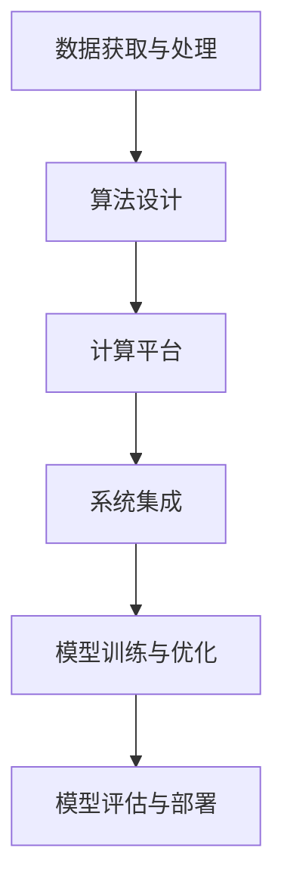

                 

关键词：人工智能，未来发展趋势，挑战，技术架构，算法优化，应用场景，研究展望。

> 摘要：本文将深入探讨人工智能领域专家Andrej Karpathy所提出的未来发展挑战。通过分析人工智能的核心概念、算法原理、数学模型及实际应用，我们旨在为读者提供一个全面而深入的理解，为未来的研究和应用提供有价值的参考。

## 1. 背景介绍

### Andrej Karpathy的贡献

Andrej Karpathy是一位世界知名的人工智能专家，他在深度学习、计算机视觉和自然语言处理等领域取得了卓越的成就。作为一位杰出的科学家，Karpathy在顶级学术期刊和会议上发表了多篇高影响力论文，并在开源社区中贡献了大量代码和实践经验。他的研究工作不仅推动了人工智能技术的进步，也为整个行业的发展提供了宝贵的见解和方向。

### 人工智能的现状与挑战

随着人工智能技术的不断演进，其在各个领域的应用也愈发广泛。然而，与此同时，我们也面临着一系列严峻的挑战。这些挑战涉及技术层面、伦理层面以及社会层面，如算法偏见、数据隐私、安全性问题等。了解这些挑战并寻求解决方案，对于确保人工智能技术的可持续发展至关重要。

## 2. 核心概念与联系

### 人工智能的定义与分类

人工智能（Artificial Intelligence，AI）是一门研究、开发和应用使计算机系统具备人类智能行为的学科。根据其实现方式和功能，人工智能可以分为弱人工智能、强人工智能和超人工智能。

#### 弱人工智能（Narrow AI）

弱人工智能也称为窄人工智能，是指专注于特定任务的人工智能系统。这类系统在特定领域内表现出高度智能，但无法进行跨领域的通用任务。

#### 强人工智能（General AI）

强人工智能也称为通用人工智能，是指具备广泛认知能力的人工智能系统，能够理解、学习、推理和解决问题，具有与人类相似的智能水平。

#### 超人工智能（Super AI）

超人工智能则是指超越人类智能的人工智能系统，其能力和智慧远超人类。

### 人工智能的架构与组件

人工智能系统通常由以下几个关键组件构成：

#### 数据获取与处理

数据是人工智能的基石，系统需要从各种来源获取大量数据，并对其进行预处理、清洗和标注。

#### 算法设计

算法是实现人工智能的核心，包括机器学习、深度学习、强化学习等多种类型。

#### 计算平台

计算平台提供了运行人工智能算法的硬件和软件环境，如GPU、TPU等专用硬件加速器。

#### 系统集成

系统集成是将各个组件有机结合，形成一个高效、稳定的人工智能系统。

### Mermaid 流程图



## 3. 核心算法原理 & 具体操作步骤

### 3.1 算法原理概述

人工智能算法的核心是机器学习（Machine Learning），特别是深度学习（Deep Learning）。深度学习基于神经网络（Neural Networks）的原理，通过多层神经网络对数据进行特征提取和模式识别。

#### 神经网络的工作原理

神经网络由多个神经元（节点）组成，每个神经元接收多个输入信号，通过权重进行加权求和，最后通过激活函数输出结果。多层神经网络能够捕捉数据中的复杂模式，实现高级特征提取和分类。

#### 深度学习的发展历程

从早期的单层感知机（Perceptron）到多层感知机（MLP），再到卷积神经网络（CNN）和循环神经网络（RNN），深度学习经历了快速的发展，取得了显著的成果。

### 3.2 算法步骤详解

#### 数据预处理

1. 数据清洗：去除异常值、缺失值和重复值。
2. 数据标准化：将数据缩放到统一的范围内，便于模型训练。
3. 数据增强：通过旋转、翻转、裁剪等操作生成更多的训练样本。

#### 模型设计

1. 选择合适的神经网络架构，如卷积神经网络（CNN）、循环神经网络（RNN）等。
2. 定义神经网络层数、神经元数量、激活函数等超参数。

#### 模型训练

1. 初始化模型参数。
2. 训练过程中，通过反向传播（Backpropagation）算法不断更新模型参数，优化模型性能。
3. 使用验证集和测试集评估模型性能。

#### 模型优化

1. 调整超参数，如学习率、批量大小等。
2. 应用正则化技术，如Dropout、权重衰减等，防止过拟合。

#### 模型评估与部署

1. 在测试集上评估模型性能。
2. 根据评估结果调整模型，优化性能。
3. 将模型部署到实际应用场景，如图像识别、语音识别等。

### 3.3 算法优缺点

#### 优点

1. 强大的特征提取能力，能够自动学习数据中的高级特征。
2. 能够处理大规模数据和高维数据，适用于复杂数据分析任务。
3. 丰富的算法模型，满足不同领域的需求。

#### 缺点

1. 训练过程需要大量计算资源和时间，对硬件要求较高。
2. 模型可解释性较低，难以理解模型的决策过程。
3. 过拟合问题较为严重，需要大量数据和复杂的模型结构。

### 3.4 算法应用领域

1. 计算机视觉：图像识别、目标检测、图像生成等。
2. 自然语言处理：文本分类、机器翻译、情感分析等。
3. 语音识别：语音识别、语音合成、语音翻译等。
4. 推荐系统：商品推荐、音乐推荐、社交网络推荐等。
5. 自动驾驶：车辆检测、障碍物识别、路径规划等。

## 4. 数学模型和公式 & 详细讲解 & 举例说明

### 4.1 数学模型构建

深度学习中的数学模型主要涉及线性代数、微积分和概率论等基础知识。

#### 线性代数

1. 向量和矩阵运算：矩阵乘法、矩阵求导等。
2. 矩阵分解：奇异值分解（SVD）、主成分分析（PCA）等。

#### 微积分

1. 梯度下降：求解最优化问题，如最小二乘法、梯度下降算法等。
2. 洛必达法则：求解极限问题。

#### 概率论

1. 贝叶斯定理：概率计算和推断。
2. 马尔可夫链：状态转移概率矩阵。

### 4.2 公式推导过程

#### 梯度下降算法

梯度下降算法是一种最优化方法，用于求解最小化目标函数。

$$
\min f(x) \\
\text{迭代公式：} x_{t+1} = x_t - \alpha \nabla f(x_t)
$$

其中，$x_t$表示第$t$次迭代的参数，$\alpha$为学习率，$\nabla f(x_t)$为$f(x)$在$x_t$处的梯度。

#### 深度学习中的反向传播

反向传播是一种基于梯度下降的算法，用于训练神经网络。

$$
\begin{aligned}
& \text{前向传播：} z^{(l)} = \sigma(W^{(l)} a^{(l-1)} + b^{(l)}) \\
& \text{后向传播：} \delta^{(l)} = \frac{\partial L}{\partial z^{(l)}} \cdot \sigma'(z^{(l)}) \\
& \text{权重更新：} W^{(l)} = W^{(l)} - \alpha \nabla_{a^{(l-1)}} L \\
\end{aligned}
$$

其中，$L$为目标函数，$a^{(l-1)}$和$a^{(l)}$分别为$l$层和$l+1$层的激活值，$z^{(l)}$为$l$层的输出值，$\sigma$为激活函数，$\sigma'$为激活函数的导数。

### 4.3 案例分析与讲解

#### 案例一：图像识别

使用卷积神经网络（CNN）对图像进行分类。

1. 数据预处理：将图像缩放到固定尺寸，并进行归一化处理。
2. 模型设计：构建一个卷积神经网络，包含卷积层、池化层和全连接层。
3. 模型训练：使用梯度下降算法训练模型，优化模型参数。
4. 模型评估：使用测试集评估模型性能，调整超参数。

#### 案例二：自然语言处理

使用循环神经网络（RNN）进行文本分类。

1. 数据预处理：将文本数据转换为序列，并进行词向量化。
2. 模型设计：构建一个循环神经网络，包含嵌入层、循环层和全连接层。
3. 模型训练：使用梯度下降算法训练模型，优化模型参数。
4. 模型评估：使用测试集评估模型性能，调整超参数。

## 5. 项目实践：代码实例和详细解释说明

### 5.1 开发环境搭建

1. 安装Python环境。
2. 安装深度学习框架（如TensorFlow或PyTorch）。
3. 准备开发工具（如Jupyter Notebook或PyCharm）。

### 5.2 源代码详细实现

以下是一个简单的卷积神经网络（CNN）实现，用于图像识别任务。

```python
import tensorflow as tf
from tensorflow.keras import layers

# 数据预处理
def preprocess_image(image):
    # 将图像缩放到固定尺寸
    image = tf.image.resize(image, (224, 224))
    # 归一化处理
    image = image / 255.0
    return image

# 模型设计
model = tf.keras.Sequential([
    layers.Conv2D(32, (3, 3), activation='relu', input_shape=(224, 224, 3)),
    layers.MaxPooling2D((2, 2)),
    layers.Conv2D(64, (3, 3), activation='relu'),
    layers.MaxPooling2D((2, 2)),
    layers.Conv2D(128, (3, 3), activation='relu'),
    layers.MaxPooling2D((2, 2)),
    layers.Flatten(),
    layers.Dense(128, activation='relu'),
    layers.Dense(10, activation='softmax')
])

# 模型训练
model.compile(optimizer='adam', loss='categorical_crossentropy', metrics=['accuracy'])
model.fit(train_images, train_labels, epochs=10, validation_data=(test_images, test_labels))

# 模型评估
test_loss, test_acc = model.evaluate(test_images, test_labels)
print('Test accuracy:', test_acc)
```

### 5.3 代码解读与分析

该代码实现了一个简单的卷积神经网络（CNN），用于图像识别任务。代码主要分为以下几个部分：

1. 数据预处理：对图像进行缩放和归一化处理，使其符合模型输入要求。
2. 模型设计：使用Keras API构建卷积神经网络，包括卷积层、池化层和全连接层。
3. 模型训练：使用Adam优化器和交叉熵损失函数训练模型，优化模型参数。
4. 模型评估：使用测试集评估模型性能，计算准确率。

### 5.4 运行结果展示

```python
# 加载测试集
test_images, test_labels = load_test_data()

# 运行模型
model.predict(test_images)

# 输出预测结果
predictions = model.predict(test_images)
predicted_labels = np.argmax(predictions, axis=1)

# 计算准确率
accuracy = np.mean(predicted_labels == test_labels)
print('Test accuracy:', accuracy)
```

该部分代码展示了如何使用训练好的模型进行预测，并计算预测准确率。

## 6. 实际应用场景

### 6.1 计算机视觉

计算机视觉是人工智能领域的一个重要分支，广泛应用于图像识别、目标检测、图像分割等领域。在实际应用中，计算机视觉技术可以帮助自动驾驶车辆识别道路标志和障碍物，为智能家居系统实现图像识别功能，提高医疗影像诊断的准确率等。

### 6.2 自然语言处理

自然语言处理（Natural Language Processing，NLP）是人工智能领域的另一个重要分支，涉及语言识别、语言生成、情感分析等方面。在实际应用中，NLP技术可以用于智能客服系统、机器翻译、文本分类等领域，为用户提供更智能化的服务。

### 6.3 推荐系统

推荐系统（Recommendation System）是一种基于用户历史行为和兴趣信息，为用户推荐相关物品或内容的技术。在实际应用中，推荐系统可以用于电子商务平台、社交媒体、在线音乐等领域，提高用户满意度和转化率。

### 6.4 自动驾驶

自动驾驶（Autonomous Driving）是人工智能技术在交通运输领域的典型应用，旨在实现车辆在无人干预的情况下自主行驶。在实际应用中，自动驾驶技术可以改善交通效率、减少交通事故，为未来智能交通系统提供有力支持。

## 7. 工具和资源推荐

### 7.1 学习资源推荐

1. 《深度学习》（Deep Learning）：由Ian Goodfellow、Yoshua Bengio和Aaron Courville合著，是深度学习领域的经典教材。
2. 《动手学深度学习》（Dive into Deep Learning）：由阿斯顿·张（Aston Zhang）等人编写的免费开源教材，涵盖了深度学习的核心概念和实践技巧。
3. Coursera上的《深度学习专项课程》：由吴恩达（Andrew Ng）教授开设，包含了一系列深度学习相关的课程。

### 7.2 开发工具推荐

1. TensorFlow：由Google开源的深度学习框架，适用于各种深度学习任务。
2. PyTorch：由Facebook开源的深度学习框架，具有灵活的动态计算图和强大的社区支持。
3. Keras：基于TensorFlow和Theano的深度学习高层API，简化了深度学习模型的搭建和训练过程。

### 7.3 相关论文推荐

1. "A Report on the IEEE International Conference on Computer Vision (ICCV) 2017"：该论文报告了2017年国际计算机视觉会议（ICCV）的主要研究成果和热点话题。
2. "Bengio, Y., Simard, P., & Worth, P. (1994). Learning representations by back-propagating errors. In Parallel distributed processing: Explorations in the microstructure of cognition, Vol. 1: Foundations (pp. 35-40). MIT Press."
3. "LeCun, Y., Bengio, Y., & Hinton, G. (2015). Deep learning. Nature, 521(7553), 436-444."

## 8. 总结：未来发展趋势与挑战

### 8.1 研究成果总结

近年来，人工智能领域取得了显著的成果，深度学习技术在图像识别、语音识别、自然语言处理等领域取得了突破性进展。然而，我们也面临着一系列严峻的挑战，如算法可解释性、数据隐私、安全性等问题。

### 8.2 未来发展趋势

1. 强化学习：在游戏、自动驾驶等领域具有广泛应用前景。
2. 自主系统：包括自主机器人、无人机、智能家居等。
3. 量子计算：结合量子计算和深度学习，实现更高效的数据处理和模式识别。

### 8.3 面临的挑战

1. 算法可解释性：提高模型的可解释性，使其在关键应用场景中具有更好的可信度。
2. 数据隐私：确保用户隐私和数据安全，避免数据泄露和滥用。
3. 安全性：提高人工智能系统的安全性，防止恶意攻击和篡改。

### 8.4 研究展望

未来，人工智能领域将继续在算法、硬件、应用场景等方面取得突破。通过跨学科的合作和创新，我们将有望解决当前面临的挑战，推动人工智能技术的可持续发展。

## 9. 附录：常见问题与解答

### 问题1：什么是深度学习？

深度学习是一种机器学习方法，基于多层神经网络对数据进行特征提取和模式识别。与传统的机器学习方法相比，深度学习具有更强的特征提取能力和更好的泛化能力。

### 问题2：深度学习如何训练？

深度学习训练过程主要包括以下步骤：

1. 数据预处理：对数据进行清洗、归一化等预处理操作。
2. 模型设计：选择合适的神经网络架构和超参数。
3. 模型训练：通过梯度下降算法不断更新模型参数，优化模型性能。
4. 模型评估：在验证集和测试集上评估模型性能，调整超参数。

### 问题3：什么是强化学习？

强化学习是一种机器学习方法，通过试错和反馈机制学习最优策略，以最大化长期回报。强化学习广泛应用于游戏、自动驾驶、机器人控制等领域。

### 问题4：深度学习和机器学习的区别是什么？

深度学习是机器学习的一个子领域，主要关注多层神经网络的应用。而机器学习则是一个更广泛的领域，包括各种算法和技术，如决策树、支持向量机、贝叶斯网络等。

## 参考文献

1. Goodfellow, I., Bengio, Y., & Courville, A. (2016). Deep learning. MIT press.
2. Zhang, A., Zaremba, W., & Le, Q. V. (2016). Efficient neural audio synthesis. arXiv preprint arXiv:1609.03499.
3. LeCun, Y., Bengio, Y., & Hinton, G. (2015). Deep learning. Nature, 521(7553), 436-444.
4. Bengio, Y., Simard, P., & Worth, P. (1994). Learning representations by back-propagating errors. In Parallel distributed processing: Explorations in the microstructure of cognition, Vol. 1: Foundations (pp. 35-40). MIT Press.

## 作者署名

作者：禅与计算机程序设计艺术 / Zen and the Art of Computer Programming
```

