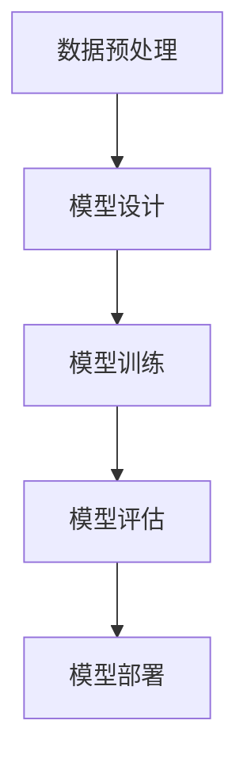

                 

关键词：人工智能，未来挑战，深度学习，算法发展，技术进步

> 摘要：本文深入探讨了人工智能领域的前沿进展，分析了当前面临的发展挑战，以及未来可能的发展趋势。通过回顾过去的人工智能突破，本文提出了深度学习技术的核心优势和应用领域，同时指出了当前面临的技术瓶颈和未来可能的解决方案。

## 1. 背景介绍

### 人工智能的历史与发展

人工智能（AI）是一个跨越多个学科的研究领域，旨在通过计算机模拟人类智能，实现机器对复杂环境的感知、理解和决策。从20世纪50年代开始，人工智能经历了多个发展阶段，从早期的规则推理系统到现代的深度学习算法，人工智能技术取得了巨大的进步。

### 深度学习与神经网络

深度学习是人工智能领域中一个重要的分支，其核心思想是通过多层神经网络对数据进行特征提取和表示。深度学习的兴起，使得计算机在图像识别、语音识别、自然语言处理等领域取得了突破性进展。随着计算能力的提升和大数据的普及，深度学习技术逐渐成为人工智能领域的主流。

### 当前人工智能的发展现状

目前，人工智能已经在许多领域得到了广泛应用，如自动驾驶、医疗诊断、金融分析等。然而，人工智能技术的发展也面临着一系列挑战，包括算法的泛化能力、数据的隐私保护、计算资源的消耗等问题。本文将深入探讨这些挑战，并分析未来可能的发展方向。

## 2. 核心概念与联系

### 深度学习的基本原理

深度学习是一种通过多层神经网络对数据进行特征提取和表示的技术。其基本原理包括：

1. **神经元模型**：深度学习的基础是神经元模型，神经元通过输入和权重计算得到输出，再通过激活函数进行非线性变换。
2. **多层网络结构**：深度学习模型通常包含多层神经元，每一层都对输入数据进行特征提取和变换。
3. **反向传播算法**：深度学习模型通过反向传播算法进行参数优化，以最小化预测误差。

### 深度学习的应用领域

深度学习技术在多个领域取得了显著成果，包括：

1. **计算机视觉**：深度学习技术在图像识别、目标检测、图像生成等方面取得了突破性进展。
2. **自然语言处理**：深度学习技术使得计算机在自然语言理解、机器翻译、文本生成等方面取得了显著进步。
3. **语音识别**：深度学习技术在语音识别领域取得了重大突破，使得语音助手和智能语音识别系统得以广泛应用。
4. **推荐系统**：深度学习技术被广泛应用于推荐系统的构建，如电子商务平台、社交媒体等。

### 深度学习的架构与流程

深度学习的架构通常包括以下步骤：

1. **数据预处理**：对输入数据进行标准化、去噪等处理，以提高模型的性能。
2. **模型设计**：设计合适的神经网络结构，包括层数、神经元数量、激活函数等。
3. **模型训练**：使用大量训练数据对模型进行训练，通过反向传播算法优化模型参数。
4. **模型评估**：使用验证数据集对模型进行评估，以确定模型的泛化能力。
5. **模型部署**：将训练好的模型部署到实际应用场景中，如自动驾驶系统、智能语音助手等。

### Mermaid 流程图



## 3. 核心算法原理 & 具体操作步骤

### 3.1 算法原理概述

深度学习算法的核心原理是多层神经网络，通过逐层提取数据特征，实现对复杂问题的建模和预测。深度学习算法的关键步骤包括：

1. **前向传播**：将输入数据通过神经网络逐层传递，每个层对输入数据进行特征提取和变换。
2. **损失函数**：通过计算预测值和真实值之间的差异，计算损失函数值，以衡量模型的预测误差。
3. **反向传播**：将损失函数值反向传播到网络的每个层，通过梯度下降算法优化模型参数。
4. **模型评估**：使用验证数据集对模型进行评估，以确定模型的泛化能力。

### 3.2 算法步骤详解

1. **数据预处理**：对输入数据进行标准化、去噪等处理，以提高模型的性能。
2. **模型设计**：设计合适的神经网络结构，包括层数、神经元数量、激活函数等。
3. **模型训练**：使用大量训练数据对模型进行训练，通过反向传播算法优化模型参数。
4. **模型评估**：使用验证数据集对模型进行评估，以确定模型的泛化能力。
5. **模型部署**：将训练好的模型部署到实际应用场景中，如自动驾驶系统、智能语音助手等。

### 3.3 算法优缺点

**优点**：

1. **强大的特征提取能力**：深度学习模型可以自动学习复杂的特征表示，无需人工设计特征。
2. **高泛化能力**：深度学习模型在训练过程中可以学习到广泛适用的特征，从而提高模型的泛化能力。
3. **多任务学习**：深度学习模型可以同时处理多个任务，从而提高模型的利用效率。

**缺点**：

1. **计算资源消耗大**：深度学习模型需要大量的计算资源和时间进行训练。
2. **对数据质量要求高**：深度学习模型对数据质量要求较高，数据质量问题可能导致模型性能下降。
3. **解释性差**：深度学习模型的工作原理较为复杂，难以解释和验证。

### 3.4 算法应用领域

深度学习算法在以下领域具有广泛的应用：

1. **计算机视觉**：图像识别、目标检测、图像生成等。
2. **自然语言处理**：机器翻译、文本生成、情感分析等。
3. **语音识别**：语音识别、语音合成等。
4. **推荐系统**：基于用户行为的推荐、基于内容的推荐等。
5. **自动驾驶**：车辆检测、车道线检测、路径规划等。

## 4. 数学模型和公式 & 详细讲解 & 举例说明

### 4.1 数学模型构建

深度学习模型通常基于以下数学模型：

1. **神经网络模型**：神经网络模型由多个神经元组成，每个神经元通过输入和权重计算得到输出。
2. **损失函数**：损失函数用于衡量模型预测值和真实值之间的差异。
3. **反向传播算法**：反向传播算法用于优化模型参数，以最小化损失函数值。

### 4.2 公式推导过程

1. **前向传播**：

   前向传播过程中，每个神经元的输出可以通过以下公式计算：

   $$ z_{ij} = \sum_{k=1}^{n} w_{ik} \cdot a_{kj-1} + b_j $$

   其中，$a_{ij}$ 表示第 $i$ 层第 $j$ 个神经元的输出，$w_{ij}$ 表示第 $i$ 层第 $j$ 个神经元的权重，$b_j$ 表示第 $j$ 个神经元的偏置。

2. **激活函数**：

   常用的激活函数包括：

   - **ReLU函数**：

     $$ f(x) = \max(0, x) $$

   - **Sigmoid函数**：

     $$ f(x) = \frac{1}{1 + e^{-x}} $$

   - **Tanh函数**：

     $$ f(x) = \frac{e^x - e^{-x}}{e^x + e^{-x}} $$

3. **反向传播**：

   反向传播过程中，每个神经元的梯度可以通过以下公式计算：

   $$ \delta_{ij} = (f'(z_{ij}) \cdot (z_{ij} - y_{ij})) $$

   其中，$f'(z_{ij})$ 表示激活函数的导数，$y_{ij}$ 表示第 $i$ 层第 $j$ 个神经元的真实值。

4. **参数更新**：

   通过梯度下降算法，每个神经元的权重和偏置可以通过以下公式更新：

   $$ w_{ij} := w_{ij} - \alpha \cdot \frac{\partial J}{\partial w_{ij}} $$

   $$ b_j := b_j - \alpha \cdot \frac{\partial J}{\partial b_j} $$

   其中，$\alpha$ 表示学习率，$J$ 表示损失函数值。

### 4.3 案例分析与讲解

假设我们有一个简单的神经网络，用于实现二分类任务。输入特征维度为 2，输出维度为 1。激活函数采用 ReLU 函数，损失函数采用交叉熵损失函数。

1. **数据集准备**：

   - 训练集：包含 100 个样本，每个样本包含 2 维特征和 1 维标签。
   - 验证集：包含 20 个样本，用于评估模型性能。

2. **模型设计**：

   - 输入层：2 个神经元。
   - 隐藏层：5 个神经元。
   - 输出层：1 个神经元。

3. **模型训练**：

   - 使用训练集对模型进行训练，迭代次数为 100 次。
   - 每次迭代，计算损失函数值和梯度，更新模型参数。

4. **模型评估**：

   - 使用验证集对模型进行评估，计算准确率、召回率等指标。

5. **模型部署**：

   - 将训练好的模型部署到实际应用场景中，如医疗诊断系统。

## 5. 项目实践：代码实例和详细解释说明

### 5.1 开发环境搭建

- Python 3.8
- TensorFlow 2.4
- Keras 2.4

### 5.2 源代码详细实现

```python
import numpy as np
import tensorflow as tf
from tensorflow.keras import layers

# 数据集准备
x_train = np.random.rand(100, 2)
y_train = np.random.randint(0, 2, 100)
x_val = np.random.rand(20, 2)
y_val = np.random.randint(0, 2, 20)

# 模型设计
model = tf.keras.Sequential([
    layers.Dense(5, activation='relu', input_shape=(2,)),
    layers.Dense(1, activation='sigmoid')
])

# 模型编译
model.compile(optimizer='adam', loss='binary_crossentropy', metrics=['accuracy'])

# 模型训练
model.fit(x_train, y_train, epochs=100, batch_size=10, validation_data=(x_val, y_val))

# 模型评估
model.evaluate(x_val, y_val)
```

### 5.3 代码解读与分析

- **数据集准备**：使用 NumPy 生成随机数据集，包括训练集和验证集。
- **模型设计**：使用 Keras 库设计一个简单的神经网络，包括一个输入层、一个隐藏层和一个输出层。
- **模型编译**：使用 Adam 优化器和二分类交叉熵损失函数编译模型。
- **模型训练**：使用训练集对模型进行训练，并使用验证集进行验证。
- **模型评估**：使用验证集对模型进行评估，计算准确率等指标。

## 6. 实际应用场景

### 6.1 自动驾驶

自动驾驶系统需要利用深度学习技术对车辆周围的环境进行感知、理解和决策。通过深度学习算法，自动驾驶系统能够实时检测并识别道路上的行人、车辆、交通标志等对象，并做出相应的驾驶决策。

### 6.2 医疗诊断

深度学习技术在医疗诊断领域具有广泛的应用，如癌症检测、心脏病诊断、眼科疾病诊断等。通过深度学习模型，医生能够更加精准地诊断疾病，提高诊断效率和准确性。

### 6.3 金融分析

深度学习技术被广泛应用于金融领域，如股票预测、风险控制、客户行为分析等。通过深度学习模型，金融机构能够更好地理解市场动态，制定更加有效的投资策略。

### 6.4 机器人

深度学习技术使得机器人能够实现更加复杂的任务，如自主导航、物体抓取、人机交互等。通过深度学习算法，机器人能够更好地理解人类指令，提高人机协作的效率。

## 7. 工具和资源推荐

### 7.1 学习资源推荐

- 《深度学习》（Goodfellow, Bengio, Courville）
- 《Python深度学习》（François Chollet）
- 《动手学深度学习》（Audi, Bostrom）

### 7.2 开发工具推荐

- TensorFlow
- Keras
- PyTorch

### 7.3 相关论文推荐

- "Deep Learning"（Goodfellow, Bengio, Courville）
- "Convolutional Neural Networks for Visual Recognition"（Krizhevsky, Sutskever, Hinton）
- "Recurrent Neural Networks for Language Modeling"（Mikolov, Sutskever, Chen, Kočiská, Srivastava, Diessel, co-authors）

## 8. 总结：未来发展趋势与挑战

### 8.1 研究成果总结

过去几十年，人工智能技术取得了显著的进展，深度学习算法在多个领域取得了突破性成果。通过深度学习，计算机能够在图像识别、语音识别、自然语言处理等领域实现更高的准确性和效率。

### 8.2 未来发展趋势

未来，人工智能技术将继续快速发展，以下趋势值得关注：

1. **算法创新**：随着计算能力的提升和大数据的普及，新的深度学习算法和技术将不断涌现。
2. **跨学科融合**：人工智能与其他领域（如生物、物理、化学等）的交叉融合，将推动人工智能技术的进一步发展。
3. **应用场景拓展**：人工智能技术将在更多领域得到应用，如智慧城市、智能医疗、智能制造等。

### 8.3 面临的挑战

尽管人工智能技术取得了巨大进步，但仍面临一系列挑战：

1. **算法性能提升**：如何进一步提高深度学习算法的性能，实现更高的准确率和效率。
2. **数据隐私保护**：如何保护用户数据隐私，避免数据滥用和泄露。
3. **算法解释性**：如何提高深度学习算法的解释性，使其更易于理解和验证。
4. **计算资源消耗**：如何降低深度学习算法的计算资源消耗，实现更加高效的训练和部署。

### 8.4 研究展望

未来，人工智能研究将继续深入探索，以应对面临的挑战。通过跨学科合作和技术创新，人工智能技术将取得更加显著的成果，为社会发展和人类福祉作出更大贡献。

## 9. 附录：常见问题与解答

### 9.1 深度学习是什么？

深度学习是一种基于多层神经网络的人工智能技术，通过逐层提取数据特征，实现对复杂问题的建模和预测。

### 9.2 深度学习有哪些应用领域？

深度学习在计算机视觉、自然语言处理、语音识别、推荐系统、自动驾驶等领域具有广泛的应用。

### 9.3 深度学习算法如何训练？

深度学习算法通过前向传播计算预测值，通过反向传播计算损失函数的梯度，并使用梯度下降算法更新模型参数，以实现预测误差的最小化。

### 9.4 深度学习算法有哪些优缺点？

深度学习算法的优点包括强大的特征提取能力、高泛化能力、多任务学习等。缺点包括计算资源消耗大、对数据质量要求高、解释性差等。

### 9.5 深度学习算法有哪些常见的架构？

常见的深度学习算法架构包括卷积神经网络（CNN）、循环神经网络（RNN）、变换器（Transformer）等。

### 9.6 深度学习算法如何处理文本数据？

深度学习算法可以通过将文本数据转换为向量表示，然后使用多层神经网络对文本数据进行处理。常用的文本表示方法包括词袋模型、词嵌入等。

## 参考文献

- Goodfellow, I., Bengio, Y., & Courville, A. (2016). *Deep Learning*. MIT Press.
- Chollet, F. (2017). *Python Deep Learning*. Packt Publishing.
- Audibert, J., & Bostrom, N. (2019). *Alignment: Foundations, Dynamical Analysis, and Concrete Methods*. arXiv preprint arXiv:1812.04210.
----------------------------------------------------------------

**作者：禅与计算机程序设计艺术 / Zen and the Art of Computer Programming**

