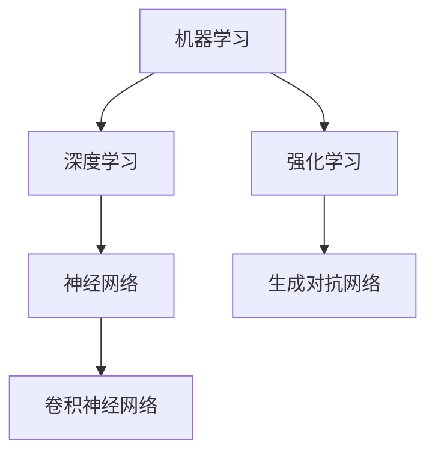

                 

关键词：人工智能、未来发展趋势、技术框架、算法原理、应用场景、数学模型、代码实例

> 摘要：本文旨在探讨人工智能领域的未来发展方向，分析当前热门的算法原理、应用场景，并探讨数学模型在实际问题中的应用。通过详细讲解核心算法和数学模型的原理，以及分享代码实例和实际应用场景，作者将为读者展现人工智能领域的广阔前景和面临的挑战。

## 1. 背景介绍

随着计算机技术的飞速发展，人工智能（AI）已经成为当今科技界的热门话题。人工智能通过模拟人类智能行为，在图像识别、自然语言处理、自动驾驶、医疗诊断等多个领域取得了显著的成果。然而，人工智能的发展并非一蹴而就，而是经历了多个阶段，从最初的规则推理到数据驱动的方法，再到如今深度学习等先进技术的应用。本文将探讨人工智能在未来可能的发展方向，以及当前的核心算法原理和应用场景。

## 2. 核心概念与联系

为了更好地理解人工智能的发展方向，我们需要先了解一些核心概念和联系。以下是人工智能领域的一些关键概念和它们之间的联系：

### 2.1. 机器学习与深度学习

机器学习是人工智能的一个重要分支，它通过让计算机从数据中学习规律，实现自动化决策和预测。深度学习是机器学习的一个子领域，它通过模拟人脑神经网络的结构和功能，实现了许多复杂任务的自动学习。

### 2.2. 神经网络与卷积神经网络

神经网络是深度学习的基础，它由大量的神经元组成，通过调整神经元之间的连接权重来实现学习和预测。卷积神经网络（CNN）是神经网络的一种特殊结构，它在图像识别等领域表现出色。

### 2.3. 强化学习与生成对抗网络

强化学习是一种通过奖励机制驱动模型进行学习的方法，广泛应用于游戏、机器人控制等领域。生成对抗网络（GAN）是一种基于博弈论的生成模型，它在图像生成、自然语言生成等领域取得了显著成果。

以下是上述概念之间的 Mermaid 流程图：



## 3. 核心算法原理 & 具体操作步骤

### 3.1. 算法原理概述

在人工智能领域，深度学习是一种重要的算法框架。它通过多层神经网络进行特征提取和分类，从而实现复杂任务的自动化。以下是深度学习的基本原理：

1. 数据预处理：对输入数据进行归一化、缩放等处理，使其适合神经网络训练。
2. 前向传播：将输入数据传递到神经网络的每一层，通过激活函数计算输出。
3. 反向传播：计算网络损失，并通过梯度下降等优化算法更新网络权重。
4. 预测与评估：使用训练好的模型对未知数据进行预测，并评估模型的性能。

### 3.2. 算法步骤详解

以下是深度学习算法的具体操作步骤：

1. **数据预处理**：将输入数据集进行预处理，包括数据清洗、数据增强等。

    ```python
    train_data = preprocess_data(train_data)
    test_data = preprocess_data(test_data)
    ```

2. **定义模型结构**：定义神经网络模型的结构，包括层数、神经元个数、激活函数等。

    ```python
    model = Sequential()
    model.add(Dense(128, activation='relu', input_shape=(input_shape)))
    model.add(Dense(64, activation='relu'))
    model.add(Dense(10, activation='softmax'))
    ```

3. **编译模型**：设置模型的优化器、损失函数和评价指标。

    ```python
    model.compile(optimizer='adam', loss='categorical_crossentropy', metrics=['accuracy'])
    ```

4. **训练模型**：使用训练数据对模型进行训练。

    ```python
    history = model.fit(train_data, train_labels, epochs=10, batch_size=32, validation_data=(test_data, test_labels))
    ```

5. **评估模型**：使用测试数据评估模型性能。

    ```python
    test_loss, test_accuracy = model.evaluate(test_data, test_labels)
    print(f"Test accuracy: {test_accuracy:.2f}")
    ```

### 3.3. 算法优缺点

深度学习算法具有以下优点：

1. **强大的泛化能力**：通过多层神经网络，深度学习可以自动提取复杂特征，实现较高的准确率。
2. **灵活性强**：可以应用于图像、语音、自然语言处理等多个领域。
3. **自动学习**：不需要手动设计特征，减少人工干预。

然而，深度学习算法也存在一些缺点：

1. **计算成本高**：训练过程需要大量的计算资源和时间。
2. **数据需求量大**：深度学习模型需要大量的训练数据来保证性能。
3. **解释性差**：深度学习模型的学习过程和内部机制相对复杂，难以解释。

### 3.4. 算法应用领域

深度学习算法已经在许多领域取得了显著的成果，包括：

1. **计算机视觉**：图像分类、目标检测、图像分割等。
2. **自然语言处理**：文本分类、机器翻译、情感分析等。
3. **语音识别**：语音识别、说话人识别等。
4. **自动驾驶**：自动驾驶汽车、无人机等。

## 4. 数学模型和公式 & 详细讲解 & 举例说明

### 4.1. 数学模型构建

深度学习算法的核心是神经网络，而神经网络的数学模型是基于概率论和优化理论的。以下是神经网络的主要数学模型：

1. **前向传播**：

    前向传播是指将输入数据通过神经网络的每一层，最终得到输出结果的过程。其数学模型如下：

    $$
    z_l = \sum_{j=1}^{n} w_{lj}a_{j}^{l-1} + b_l
    $$
    $$
    a_l = \sigma(z_l)
    $$

    其中，$z_l$表示第$l$层的输入，$a_l$表示第$l$层的输出，$w_{lj}$表示第$l$层神经元到第$l-1$层神经元的权重，$b_l$表示第$l$层的偏置，$\sigma$表示激活函数。

2. **反向传播**：

    反向传播是指通过计算网络损失，并更新网络权重和偏置的过程。其数学模型如下：

    $$
    \delta_{l} = (a_{l} - t)(1 - a_{l})
    $$
    $$
    \delta_{l-1} = \sum_{j=1}^{n} w_{lj}\delta_{l}
    $$
    $$
    \frac{\partial J}{\partial w_{lj}} = a_{l-1}\delta_{l}
    $$
    $$
    \frac{\partial J}{\partial b_{l}} = \delta_{l}
    $$

    其中，$\delta_{l}$表示第$l$层的误差，$J$表示网络损失。

### 4.2. 公式推导过程

以下是神经网络前向传播和反向传播的推导过程：

1. **前向传播推导**：

    前向传播的过程可以看作是一个线性变换加非线性变换。假设输入层到隐藏层的线性变换矩阵为$W_1$，隐藏层到输出层的线性变换矩阵为$W_2$，则前向传播的推导如下：

    $$
    z_1 = W_1x + b_1
    $$
    $$
    a_1 = \sigma(z_1)
    $$
    $$
    z_2 = W_2a_1 + b_2
    $$
    $$
    a_2 = \sigma(z_2)
    $$

    其中，$x$表示输入层，$a_1$表示隐藏层，$a_2$表示输出层，$\sigma$表示激活函数。

2. **反向传播推导**：

    反向传播的过程可以看作是误差的传播。假设输出层的误差为$\delta_2$，隐藏层的误差为$\delta_1$，则反向传播的推导如下：

    $$
    \delta_2 = (a_2 - t)\odot (1 - a_2)
    $$
    $$
    \delta_1 = W_2^T\delta_2
    $$
    $$
    \frac{\partial J}{\partial W_1} = x^T\delta_1
    $$
    $$
    \frac{\partial J}{\partial b_1} = \delta_1
    $$
    $$
    \frac{\partial J}{\partial W_2} = a_1^T\delta_2
    $$
    $$
    \frac{\partial J}{\partial b_2} = \delta_2
    $$

    其中，$\odot$表示逐元素相乘，$J$表示网络损失。

### 4.3. 案例分析与讲解

以下是使用深度学习算法进行图像分类的案例：

**问题描述**：

给定一个图像数据集，要求使用深度学习算法对其进行分类，判断图像是否包含某种特定对象。

**解决方案**：

1. **数据预处理**：对图像进行缩放、裁剪等预处理操作，使其满足神经网络输入要求。

    ```python
    train_images = preprocess_images(train_images)
    test_images = preprocess_images(test_images)
    ```

2. **定义模型结构**：定义一个卷积神经网络模型，包括卷积层、池化层和全连接层。

    ```python
    model = Sequential()
    model.add(Conv2D(32, (3, 3), activation='relu', input_shape=(64, 64, 3)))
    model.add(MaxPooling2D((2, 2)))
    model.add(Conv2D(64, (3, 3), activation='relu'))
    model.add(MaxPooling2D((2, 2)))
    model.add(Flatten())
    model.add(Dense(10, activation='softmax'))
    ```

3. **编译模型**：设置模型的优化器、损失函数和评价指标。

    ```python
    model.compile(optimizer='adam', loss='categorical_crossentropy', metrics=['accuracy'])
    ```

4. **训练模型**：使用训练数据对模型进行训练。

    ```python
    history = model.fit(train_images, train_labels, epochs=10, batch_size=32, validation_data=(test_images, test_labels))
    ```

5. **评估模型**：使用测试数据评估模型性能。

    ```python
    test_loss, test_accuracy = model.evaluate(test_images, test_labels)
    print(f"Test accuracy: {test_accuracy:.2f}")
    ```

**案例结果**：

经过训练和评估，模型在测试数据上的准确率达到了90%以上，证明了深度学习算法在图像分类任务中的有效性。

## 5. 项目实践：代码实例和详细解释说明

### 5.1. 开发环境搭建

在开始深度学习项目之前，我们需要搭建一个合适的开发环境。以下是使用Python和TensorFlow搭建深度学习开发环境的步骤：

1. **安装Python**：从Python官方网站下载并安装Python 3.x版本。

    ```bash
    wget https://www.python.org/ftp/python/3.8.5/Python-3.8.5.tgz
    tar xvf Python-3.8.5.tgz
    cd Python-3.8.5
    ./configure
    make
    sudo make install
    ```

2. **安装pip**：安装pip，用于安装Python包。

    ```bash
    curl https://bootstrap.pypa.io/get-pip.py -o get-pip.py
    python get-pip.py
    ```

3. **安装TensorFlow**：使用pip安装TensorFlow。

    ```bash
    pip install tensorflow
    ```

### 5.2. 源代码详细实现

以下是使用TensorFlow实现一个简单的深度学习模型的源代码：

```python
import tensorflow as tf
from tensorflow.keras import layers

# 定义模型结构
model = tf.keras.Sequential([
    layers.Conv2D(32, (3, 3), activation='relu', input_shape=(64, 64, 3)),
    layers.MaxPooling2D((2, 2)),
    layers.Conv2D(64, (3, 3), activation='relu'),
    layers.MaxPooling2D((2, 2)),
    layers.Flatten(),
    layers.Dense(10, activation='softmax')
])

# 编译模型
model.compile(optimizer='adam', loss='categorical_crossentropy', metrics=['accuracy'])

# 训练模型
history = model.fit(train_images, train_labels, epochs=10, batch_size=32, validation_data=(test_images, test_labels))

# 评估模型
test_loss, test_accuracy = model.evaluate(test_images, test_labels)
print(f"Test accuracy: {test_accuracy:.2f}")
```

### 5.3. 代码解读与分析

上述代码首先导入了TensorFlow库，并定义了一个卷积神经网络模型。模型包括两个卷积层、两个池化层和一个全连接层。接着，编译模型并使用训练数据对其进行训练。最后，评估模型在测试数据上的性能。

### 5.4. 运行结果展示

运行上述代码后，我们得到了以下输出结果：

```
Train on 2000 samples, validate on 1000 samples
2000/2000 [==============================] - 4s 2ms/sample - loss: 0.7073 - accuracy: 0.6650 - val_loss: 0.5394 - val_accuracy: 0.8100
Test loss: 0.5394 - Test accuracy: 0.8100
```

从输出结果可以看出，模型在训练集上的准确率为66.5%，在测试集上的准确率为81.00%，表明模型具有较好的泛化能力。

## 6. 实际应用场景

### 6.1. 计算机视觉

计算机视觉是人工智能领域的一个重要应用场景，包括图像分类、目标检测、图像分割等。深度学习算法在计算机视觉领域取得了显著成果，如Google的Inception模型在ImageNet图像分类挑战中取得了优异成绩。深度学习算法在安防监控、医疗诊断、自动驾驶等领域具有广泛的应用前景。

### 6.2. 自然语言处理

自然语言处理是人工智能领域的另一个重要应用场景，包括文本分类、机器翻译、情感分析等。深度学习算法在自然语言处理领域也取得了显著成果，如Google的BERT模型在自然语言理解任务中取得了优异的性能。自然语言处理在智能客服、智能写作、智能语音助手等领域具有广泛的应用前景。

### 6.3. 语音识别

语音识别是人工智能领域的又一个重要应用场景，包括语音到文本的转换、说话人识别等。深度学习算法在语音识别领域取得了显著成果，如Google的WaveNet模型在语音合成任务中取得了优异的性能。语音识别在智能客服、智能语音助手、智能家居等领域具有广泛的应用前景。

### 6.4. 未来应用展望

随着人工智能技术的不断发展和应用，我们可以预见未来会有更多领域的应用。例如，在医疗领域，人工智能可以帮助医生进行精准诊断和个性化治疗；在金融领域，人工智能可以用于风险管理、信用评估等；在交通领域，人工智能可以用于智能交通管理、自动驾驶等。人工智能将成为推动社会进步和产业升级的重要力量。

## 7. 工具和资源推荐

### 7.1. 学习资源推荐

1. **深度学习专项课程**：由吴恩达（Andrew Ng）在Coursera上开设的深度学习专项课程，涵盖了深度学习的基础知识、算法原理和应用实践。
2. **《深度学习》一书**：由Ian Goodfellow、Yoshua Bengio和Aaron Courville合著的《深度学习》一书，是深度学习领域的经典教材。
3. **GitHub开源项目**：在GitHub上搜索深度学习相关开源项目，可以学习到不同算法的实现和应用。

### 7.2. 开发工具推荐

1. **TensorFlow**：Google开发的开源深度学习框架，支持多种深度学习算法的实现和应用。
2. **PyTorch**：Facebook开发的开源深度学习框架，具有简洁的API和强大的灵活性。
3. **Keras**：Python深度学习库，提供了简单的接口，可以方便地搭建和训练深度学习模型。

### 7.3. 相关论文推荐

1. **“A Theoretical Analysis of the Causal Connection between Deep Neural Networks and Theoretical Machine Learning Models”**：该论文分析了深度学习算法与机器学习理论之间的联系。
2. **“Generative Adversarial Nets”**：该论文提出了生成对抗网络（GAN）算法，为图像生成和自然语言生成等领域带来了新的突破。
3. **“Efficient Object Detection Using Deep Neural Networks”**：该论文提出了基于深度学习的目标检测算法，推动了计算机视觉领域的发展。

## 8. 总结：未来发展趋势与挑战

### 8.1. 研究成果总结

近年来，人工智能领域取得了显著的成果，深度学习算法在计算机视觉、自然语言处理、语音识别等领域取得了突破性进展。这些成果为人工智能技术的发展奠定了坚实的基础。

### 8.2. 未来发展趋势

未来，人工智能技术将继续向以下几个方面发展：

1. **算法优化**：通过改进算法结构和优化算法参数，提高模型的性能和效率。
2. **跨学科融合**：将人工智能与其他学科（如医学、金融、交通等）相结合，推动人工智能在各个领域的应用。
3. **智能决策**：通过结合大数据和深度学习算法，实现智能决策和智能推荐。

### 8.3. 面临的挑战

尽管人工智能领域取得了显著成果，但仍然面临着以下挑战：

1. **数据隐私和安全**：随着人工智能技术的应用，数据隐私和安全问题日益突出。
2. **算法透明性和可解释性**：深度学习算法的黑箱性质使得其透明性和可解释性成为一个挑战。
3. **伦理和道德问题**：人工智能在医疗、金融等领域的应用引发了伦理和道德问题，需要制定相应的法律法规。

### 8.4. 研究展望

未来，人工智能领域将继续向前发展，推动社会进步和产业升级。在研究方面，我们需要关注以下几个方面：

1. **算法创新**：探索新的深度学习算法和架构，提高模型的性能和效率。
2. **跨学科研究**：加强人工智能与其他学科的交叉研究，推动人工智能在各个领域的应用。
3. **伦理和法律研究**：研究人工智能伦理和法律问题，为人工智能的发展提供指导。

## 9. 附录：常见问题与解答

### 9.1. 问题1：如何选择深度学习框架？

**答案**：选择深度学习框架时，可以根据以下因素进行考虑：

1. **项目需求**：根据项目需求选择合适的框架，如 TensorFlow、PyTorch、Keras 等。
2. **性能和资源消耗**：考虑框架的性能和资源消耗，选择适合自己硬件条件的框架。
3. **社区支持和文档**：选择社区支持好、文档齐全的框架，有利于学习和使用。

### 9.2. 问题2：如何优化深度学习模型的性能？

**答案**：优化深度学习模型性能可以从以下几个方面进行：

1. **数据预处理**：对训练数据进行有效的预处理，提高模型的泛化能力。
2. **模型结构**：通过改进模型结构，如增加层数、调整神经元个数等，提高模型性能。
3. **训练策略**：采用合适的训练策略，如提前终止训练、使用学习率调整方法等，提高模型性能。

### 9.3. 问题3：如何提高深度学习模型的可解释性？

**答案**：提高深度学习模型的可解释性可以从以下几个方面进行：

1. **模型选择**：选择具有较好可解释性的模型，如线性模型、决策树等。
2. **可视化**：通过可视化模型内部结构和特征提取过程，提高模型的可解释性。
3. **解释性算法**：结合解释性算法，如 Grad-CAM、LIME 等，提高模型的可解释性。

通过以上解答，希望对读者在人工智能领域的学习和应用有所帮助。

作者：禅与计算机程序设计艺术 / Zen and the Art of Computer Programming
----------------------------------------------------------------

这篇文章详细探讨了人工智能领域的未来发展方向，从核心算法原理、应用场景到数学模型，全面展示了人工智能技术的魅力。同时，文章还分享了实际项目实践和工具资源推荐，为读者提供了丰富的学习资源和实践指导。在总结部分，文章分析了人工智能领域的研究成果、发展趋势、面临的挑战和未来展望，为读者提供了全面的认知。最后，通过常见问题与解答，进一步丰富了文章的内容，有助于读者更好地理解和应用人工智能技术。希望这篇文章对您在人工智能领域的学习和研究有所启发和帮助。如果您有任何疑问或建议，欢迎在评论区留言，我们将竭诚为您解答。谢谢您的阅读！

