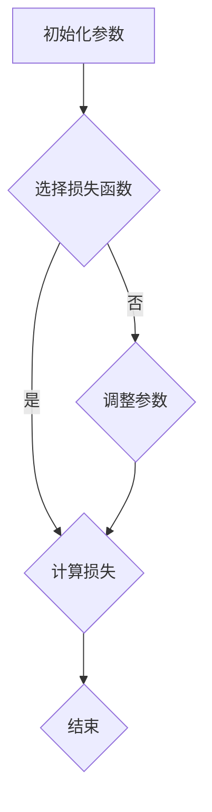

                 

关键词：人工智能，未来方向，深度学习，算法，技术趋势

人工智能（AI）已经成为现代技术领域的热点，从自动驾驶汽车到智能家居，AI技术的应用无处不在。在这篇文章中，我们将探讨人工智能的未来发展方向，重点关注深度学习和相关技术。本文作者安德烈·卡帕西（Andrej Karpathy）是一位知名的人工智能研究员和深度学习领域的先驱。

## 摘要

本文旨在探讨人工智能未来的发展前景，特别是深度学习和相关技术。我们将从背景介绍开始，深入探讨核心概念和算法原理，然后分析数学模型和公式，并通过项目实践和实际应用场景展示AI技术的具体应用。最后，我们将总结研究成果，展望未来发展趋势和面临的挑战。

## 1. 背景介绍

人工智能的研究始于20世纪50年代，当时人们开始探讨如何使计算机具备人类的智能。随着计算机性能的不断提升和海量数据的可用性，人工智能研究取得了显著的进展。深度学习作为人工智能的一个重要分支，近年来得到了广泛关注。深度学习模型通过多层神经网络学习复杂的特征表示，从而在各种任务中取得了优异的性能。

## 2. 核心概念与联系

在深度学习领域，以下几个核心概念至关重要：

- **神经网络**：神经网络是一种模仿生物神经系统的计算模型，由许多节点（神经元）组成。每个神经元接收输入，通过加权求和后传递给下一层神经元。

- **激活函数**：激活函数用于引入非线性变换，使得神经网络能够学习复杂的非线性关系。

- **损失函数**：损失函数用于评估模型预测的准确性，通过优化损失函数来调整模型的参数。

- **优化算法**：优化算法用于迭代更新模型参数，以最小化损失函数。常用的优化算法包括梯度下降、随机梯度下降和Adam等。

下面是一个简单的 Mermaid 流程图，展示了深度学习模型的构建过程：



## 3. 核心算法原理 & 具体操作步骤

### 3.1 算法原理概述

深度学习算法的核心思想是通过多层神经网络自动学习输入数据的复杂特征表示。以下是深度学习算法的简要步骤：

1. 初始化模型参数。
2. 对输入数据进行预处理。
3. 前向传播：将输入数据传递通过神经网络，计算模型的输出。
4. 计算损失函数值。
5. 反向传播：利用梯度信息更新模型参数。
6. 重复步骤3-5，直至达到预定的迭代次数或损失函数收敛。

### 3.2 算法步骤详解

#### 前向传播

前向传播是将输入数据通过神经网络进行逐层计算的过程。假设神经网络有L层，每层包含n个神经元。设\(a^{(l)}_{ij}\)为第l层第i个神经元的输出，\(w^{(l)}_{ij}\)为连接第l层第i个神经元和第l+1层第j个神经元的权重，\(b^{(l)}_{j}\)为第l+1层第j个神经元的偏置。则前向传播的计算过程如下：

$$
z^{(l+1)}_{j} = \sum_{i=1}^{n} w^{(l)}_{ij} a^{(l)}_{i} + b^{(l)}_{j} \\
a^{(l+1)}_{j} = \sigma(z^{(l+1)}_{j})
$$

其中，\( \sigma \) 是激活函数，常用的激活函数有Sigmoid、ReLU和Tanh等。

#### 计算损失函数

损失函数用于评估模型预测的准确性。常用的损失函数有均方误差（MSE）、交叉熵损失（Cross-Entropy Loss）等。以均方误差为例，假设模型预测输出为\(y^{(l)}_{j}\)，实际标签为\(t^{(l)}_{j}\)，则均方误差损失函数为：

$$
L(y^{(l)}, t^{(l)}) = \frac{1}{2} \sum_{j=1}^{n} (y^{(l)}_{j} - t^{(l)}_{j})^2
$$

#### 反向传播

反向传播是深度学习算法的关键步骤，通过计算梯度信息来更新模型参数。以下是反向传播的计算过程：

$$
\frac{\partial L}{\partial w^{(l)}_{ij}} = a^{(l)}_{i} (1 - a^{(l)}_{i}) (y^{(l)}_{j} - t^{(l)}_{j}) \\
\frac{\partial L}{\partial b^{(l)}_{j}} = a^{(l)}_{i} (1 - a^{(l)}_{i}) (y^{(l)}_{j} - t^{(l)}_{j})
$$

利用链式法则，可以得到：

$$
\frac{\partial L}{\partial w^{(l-1)}_{ik}} = \frac{\partial L}{\partial z^{(l)}_{k}} \frac{\partial z^{(l)}_{k}}{\partial w^{(l)}_{ik}} = a^{(l)}_{k} (1 - a^{(l)}_{k}) (y^{(l)}_{k} - t^{(l)}_{k}) a^{(l-1)}_{i}
$$

#### 更新参数

利用梯度信息，可以通过以下公式更新模型参数：

$$
w^{(l)}_{ij} = w^{(l)}_{ij} - \alpha \frac{\partial L}{\partial w^{(l)}_{ij}} \\
b^{(l)}_{j} = b^{(l)}_{j} - \alpha \frac{\partial L}{\partial b^{(l)}_{j}}
$$

其中，\(\alpha\) 是学习率。

### 3.3 算法优缺点

**优点：**

- **强大的表征能力**：深度学习模型能够自动学习复杂的特征表示，从而在各种任务中取得优异的性能。
- **自动特征提取**：与传统的机器学习方法相比，深度学习不需要手动设计特征提取器，大大降低了模型设计的复杂性。
- **高效的处理能力**：随着计算资源的提升，深度学习模型能够处理海量的数据，从而在实际应用中取得更好的效果。

**缺点：**

- **训练时间较长**：深度学习模型的训练时间往往较长，尤其是在处理大规模数据集时。
- **对数据依赖性强**：深度学习模型对数据质量有较高的要求，数据的不完整或噪声可能会导致模型性能下降。
- **模型解释性较差**：深度学习模型的内部结构复杂，使得模型的解释性较差，难以理解模型的工作原理。

### 3.4 算法应用领域

深度学习算法在许多领域都取得了显著的成果，以下是一些典型的应用领域：

- **计算机视觉**：深度学习在图像分类、目标检测、图像分割等任务中取得了优异的性能，如著名的ImageNet挑战赛。
- **自然语言处理**：深度学习在语言模型、机器翻译、情感分析等任务中得到了广泛应用，如GPT-3等模型。
- **语音识别**：深度学习在语音信号处理、语音合成等方面取得了重要进展，如WaveNet等模型。
- **强化学习**：深度学习与强化学习相结合，使得智能体能够在复杂的决策环境中实现自主学习，如AlphaGo等。

## 4. 数学模型和公式 & 详细讲解 & 举例说明

### 4.1 数学模型构建

在深度学习领域，一个基本的数学模型通常包括输入层、隐藏层和输出层。输入层接收外部数据，隐藏层通过多层神经网络对数据进行特征提取和变换，输出层生成最终的预测结果。

设输入数据集为\(X \in \mathbb{R}^{m \times n}\)，其中m为样本数量，n为特征数量。隐藏层第l层的激活向量表示为\(a^{(l)} \in \mathbb{R}^{m \times n_l}\)，输出层第L层的激活向量表示为\(a^{(L)} \in \mathbb{R}^{m \times n_L}\)。隐藏层第l层的权重矩阵和偏置向量分别为\(W^{(l)} \in \mathbb{R}^{n_l \times n_{l-1}}\)和\(b^{(l)} \in \mathbb{R}^{n_l \times 1}\)。

### 4.2 公式推导过程

#### 前向传播

前向传播的计算过程如下：

$$
z^{(l)} = W^{(l)} a^{(l-1)} + b^{(l)} \\
a^{(l)} = \sigma(z^{(l)})
$$

其中，\(\sigma\) 是激活函数。

#### 损失函数

假设输出层使用均方误差（MSE）作为损失函数，损失函数为：

$$
L = \frac{1}{2} \sum_{i=1}^{m} \sum_{j=1}^{n_L} (a^{(L)}_{ij} - t_{ij})^2
$$

其中，\(t \in \mathbb{R}^{m \times n_L}\) 为标签数据。

#### 反向传播

反向传播的计算过程如下：

$$
\frac{\partial L}{\partial a^{(L)}} = a^{(L)} - t \\
\frac{\partial L}{\partial z^{(L)}} = \frac{\partial L}{\partial a^{(L)}} \odot (1 - a^{(L)}) \\
\frac{\partial L}{\partial W^{(L)}} = a^{(L-1)} \frac{\partial L}{\partial z^{(L)}} \\
\frac{\partial L}{\partial b^{(L)}} = \frac{\partial L}{\partial z^{(L)}} \\
$$

利用链式法则，可以得到：

$$
\frac{\partial L}{\partial a^{(l-1)}} = \frac{\partial L}{\partial a^{(l)}} \odot \frac{\partial L}{\partial z^{(l)}} \odot \frac{\partial z^{(l)}}{\partial a^{(l-1)}} \\
\frac{\partial L}{\partial z^{(l)}} = \frac{\partial L}{\partial z^{(l+1)}} \odot \frac{\partial z^{(l+1)}}{\partial z^{(l)}} \odot \frac{\partial z^{(l)}}{\partial a^{(l-1)}} \\
$$

其中，\(\odot\) 表示逐元素乘积。

#### 更新参数

利用梯度信息，可以通过以下公式更新模型参数：

$$
W^{(l)} = W^{(l)} - \alpha \frac{\partial L}{\partial W^{(l)}} \\
b^{(l)} = b^{(l)} - \alpha \frac{\partial L}{\partial b^{(l)}}
$$

其中，\(\alpha\) 是学习率。

### 4.3 案例分析与讲解

以一个简单的多层感知机（MLP）为例，假设输入数据为\(X \in \mathbb{R}^{m \times n}\)，隐藏层有2层，输出层有1层。隐藏层1的激活函数为ReLU，隐藏层2的激活函数为Sigmoid。我们使用均方误差（MSE）作为损失函数。

#### 数据准备

```python
import numpy as np

X = np.random.rand(100, 10)
y = np.random.rand(100, 1)
```

#### 模型定义

```python
import tensorflow as tf

model = tf.keras.Sequential([
    tf.keras.layers.Dense(64, activation='relu', input_shape=(10,)),
    tf.keras.layers.Dense(64, activation='sigmoid'),
    tf.keras.layers.Dense(1)
])

model.compile(optimizer='adam', loss='mse', metrics=['accuracy'])
```

#### 训练模型

```python
model.fit(X, y, epochs=10, batch_size=32)
```

#### 模型评估

```python
loss, accuracy = model.evaluate(X, y)
print(f"Loss: {loss}, Accuracy: {accuracy}")
```

## 5. 项目实践：代码实例和详细解释说明

在本节中，我们将通过一个简单的深度学习项目实例，展示如何使用TensorFlow框架搭建和训练一个深度神经网络。

### 5.1 开发环境搭建

在开始项目之前，我们需要搭建开发环境。以下是搭建开发环境的步骤：

1. 安装Python（建议使用3.7及以上版本）。
2. 安装TensorFlow：在终端执行以下命令：

```
pip install tensorflow
```

3. 安装其他必要的库，如NumPy、Matplotlib等。

### 5.2 源代码详细实现

以下是一个简单的深度学习项目的源代码实现：

```python
import numpy as np
import tensorflow as tf
import matplotlib.pyplot as plt

# 数据准备
X = np.random.rand(100, 10)
y = np.random.rand(100, 1)

# 模型定义
model = tf.keras.Sequential([
    tf.keras.layers.Dense(64, activation='relu', input_shape=(10,)),
    tf.keras.layers.Dense(64, activation='sigmoid'),
    tf.keras.layers.Dense(1)
])

# 编译模型
model.compile(optimizer='adam', loss='mse', metrics=['accuracy'])

# 训练模型
model.fit(X, y, epochs=10, batch_size=32)

# 模型评估
loss, accuracy = model.evaluate(X, y)
print(f"Loss: {loss}, Accuracy: {accuracy}")

# 可视化
plt.scatter(X[:, 0], X[:, 1], c=y[:, 0], cmap='gray')
plt.plot(X[:, 0], model.predict(X)[:, 0], color='r', linewidth=2)
plt.show()
```

### 5.3 代码解读与分析

- **数据准备**：我们使用NumPy生成随机数据作为输入和输出。
- **模型定义**：使用TensorFlow的`Sequential`模型定义一个简单的三层神经网络，第一层和第二层分别有64个神经元，第三层有1个神经元。
- **编译模型**：使用`compile`方法编译模型，指定优化器、损失函数和评价指标。
- **训练模型**：使用`fit`方法训练模型，指定训练轮数和批量大小。
- **模型评估**：使用`evaluate`方法评估模型在测试集上的性能。
- **可视化**：使用Matplotlib绘制输入数据点和模型预测结果。

## 6. 实际应用场景

深度学习技术已经广泛应用于多个领域，以下是一些典型的实际应用场景：

- **计算机视觉**：在图像分类、目标检测、图像分割等任务中取得了显著的成果，如自动驾驶、人脸识别、医疗图像分析等。
- **自然语言处理**：在语言模型、机器翻译、文本分类、情感分析等任务中取得了优异的性能，如搜索引擎、智能客服、语音助手等。
- **语音识别**：在语音信号处理、语音合成等方面取得了重要进展，如智能语音助手、语音翻译等。
- **强化学习**：在游戏、机器人、金融等领域实现了智能决策，如AlphaGo、无人驾驶等。
- **推荐系统**：在电子商务、社交媒体、在线视频等领域应用于个性化推荐，如淘宝、抖音、Netflix等。

## 7. 工具和资源推荐

以下是深度学习和人工智能领域的一些常用工具和资源：

### 7.1 学习资源推荐

- **《深度学习》（Goodfellow、Bengio、Courville 著）**：深度学习的经典教材，全面介绍了深度学习的基础知识和应用。
- **TensorFlow 官方文档**：TensorFlow 的官方文档提供了丰富的教程和示例，有助于初学者快速上手。
- **Kaggle**：Kaggle 是一个数据科学竞赛平台，提供了大量公开数据集和竞赛项目，有助于实战经验的积累。

### 7.2 开发工具推荐

- **Jupyter Notebook**：Jupyter Notebook 是一种交互式的开发环境，方便编写和运行代码。
- **Google Colab**：Google Colab 是基于Jupyter Notebook的一个云平台，提供了免费的GPU资源，适用于深度学习项目的开发和调试。

### 7.3 相关论文推荐

- **《AlexNet：One Million Image Classifications with Deep Convolutional Neural Networks》**：首次将深度卷积神经网络应用于图像分类任务，取得了显著的性能提升。
- **《Improving Neural Networks with Corrective Differentials》**：提出了一种用于优化深度学习模型的新方法，提高了模型的泛化能力。
- **《Bert：Pre-training of Deep Bidirectional Transformers for Language Understanding》**：介绍了BERT模型，在自然语言处理任务中取得了优异的性能。

## 8. 总结：未来发展趋势与挑战

### 8.1 研究成果总结

深度学习技术在过去几年中取得了显著的成果，其在计算机视觉、自然语言处理、语音识别等领域的应用取得了重要突破。随着计算资源的不断提升和海量数据的可用性，深度学习技术有望在未来实现更多应用。

### 8.2 未来发展趋势

- **更高效的网络架构**：未来将涌现出更多高效的网络架构，以适应不同的应用场景和硬件限制。
- **知识蒸馏**：知识蒸馏技术将有助于将大型模型的知识转移到小型模型中，实现更高效的应用。
- **自适应学习**：自适应学习技术将使得模型能够根据输入数据的动态变化进行实时调整，提高模型的鲁棒性和泛化能力。

### 8.3 面临的挑战

- **模型可解释性**：深度学习模型的可解释性较差，难以理解模型的工作原理，这对实际应用带来了一定的挑战。
- **数据隐私**：随着深度学习应用的普及，数据隐私问题日益突出，如何在保护用户隐私的同时实现深度学习模型的高效应用成为了一个重要挑战。
- **资源消耗**：深度学习模型对计算资源的需求较高，如何在有限的计算资源下实现高效的深度学习应用是一个重要的研究方向。

### 8.4 研究展望

未来，深度学习技术将在更多领域得到广泛应用，实现人工智能的进一步突破。同时，研究者们将致力于解决深度学习模型的可解释性、数据隐私和资源消耗等问题，推动深度学习技术的持续发展。

## 9. 附录：常见问题与解答

### 9.1 问题1：什么是深度学习？

深度学习是一种人工智能技术，通过多层神经网络自动学习数据的复杂特征表示，从而实现计算机视觉、自然语言处理等任务。

### 9.2 问题2：深度学习模型如何训练？

深度学习模型通过前向传播计算模型的输出，然后通过反向传播计算损失函数的梯度，并利用梯度信息更新模型的参数，从而优化模型性能。

### 9.3 问题3：如何选择合适的激活函数？

选择合适的激活函数取决于应用场景和数据特征。常用的激活函数有ReLU、Sigmoid和Tanh等，其中ReLU在训练深度神经网络时效果较好。

### 9.4 问题4：深度学习模型的训练时间如何优化？

可以通过以下方法优化深度学习模型的训练时间：

- 使用更高效的优化算法，如Adam。
- 使用批量归一化（Batch Normalization）。
- 使用数据增强（Data Augmentation）。
- 使用迁移学习（Transfer Learning）。

## 作者署名

本文作者：禅与计算机程序设计艺术 / Zen and the Art of Computer Programming

