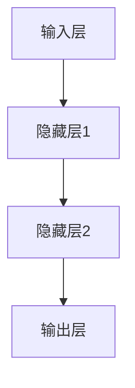
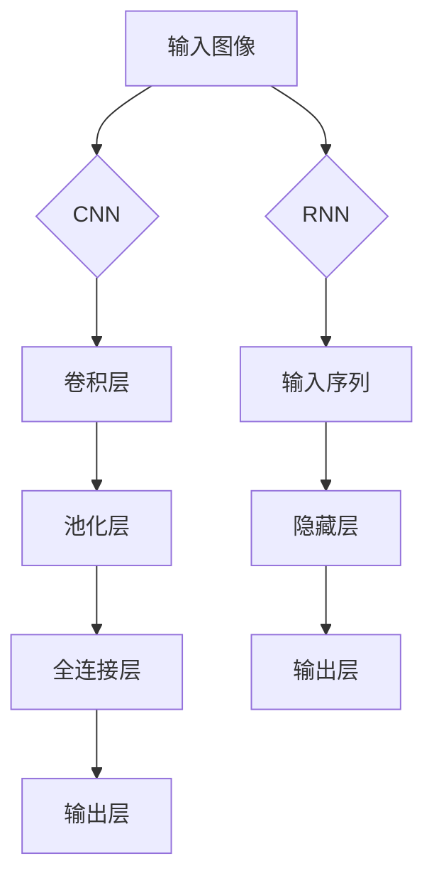

                 

关键词：人工智能、深度学习、神经网络、模型架构、应用领域、未来趋势

> 摘要：本文探讨了人工智能领域当前的发展状况以及未来可能面临的机遇和挑战。作者结合自身作为人工智能领域专家的经验，对当前的热点技术、新兴应用领域以及潜在的研究方向进行了深入分析，旨在为读者提供对人工智能未来发展前景的全面了解。

## 1. 背景介绍

人工智能（AI）作为计算机科学的一个分支，旨在通过计算机模拟人类智能的行为和思维过程。自20世纪50年代人工智能的概念被提出以来，它已经经历了数次起伏。近年来，随着计算能力的提升、大数据技术的发展以及深度学习算法的突破，人工智能取得了显著的进展。本文旨在探讨这些进展及其背后的原因，并展望人工智能在未来的发展机遇。

## 2. 核心概念与联系

### 2.1 深度学习与神经网络

深度学习是人工智能的一个重要分支，它通过构建多层神经网络模型来实现复杂的任务。神经网络是深度学习的基础，由大量的神经元组成，每个神经元都可以接收多个输入，并通过权重和激活函数进行计算，最终产生输出。下图展示了神经网络的 Mermaid 流程图：



### 2.2 模型架构

深度学习模型的架构多种多样，其中卷积神经网络（CNN）和循环神经网络（RNN）是两种最为广泛使用的模型。CNN 主要用于图像识别和图像处理任务，而 RNN 则在自然语言处理领域表现出色。以下图展示了 CNN 和 RNN 的基本架构：



## 3. 核心算法原理 & 具体操作步骤

### 3.1 算法原理概述

深度学习算法的核心是训练模型，以使其能够对未知数据进行预测。这一过程主要包括以下几个步骤：

1. 数据预处理：对输入数据进行标准化和归一化，以提高训练效果。
2. 构建模型：根据任务需求，设计合适的神经网络架构。
3. 训练模型：通过反向传播算法不断调整模型参数，以最小化预测误差。
4. 验证模型：在测试集上评估模型性能，以确定其泛化能力。
5. 应用模型：将训练好的模型部署到实际应用场景中。

### 3.2 算法步骤详解

1. **数据预处理**：

   数据预处理是深度学习训练的第一步，其目的是将原始数据转换为适合模型训练的格式。具体步骤如下：

   - **标准化**：将数据缩放到特定的范围，如 [0, 1] 或 [-1, 1]。
   - **归一化**：根据数据的统计特性（如平均值和标准差）进行缩放。
   - **数据增强**：通过旋转、翻转、裁剪等操作增加数据的多样性。

2. **构建模型**：

   构建模型是设计神经网络架构的过程。以下是构建模型时需要考虑的一些关键因素：

   - **层结构**：确定网络的层数、每层的神经元数量和类型。
   - **激活函数**：选择合适的激活函数，如 ReLU、Sigmoid 或 Tanh。
   - **损失函数**：选择与任务相适应的损失函数，如交叉熵损失或均方误差。

3. **训练模型**：

   训练模型是深度学习算法的核心步骤，主要包括以下步骤：

   - **前向传播**：计算输入数据的输出。
   - **反向传播**：根据输出误差计算梯度，并更新模型参数。
   - **优化算法**：选择合适的优化算法，如随机梯度下降（SGD）或 Adam。

4. **验证模型**：

   在训练过程中，需要定期在测试集上评估模型性能，以确定其泛化能力。常用的评估指标包括准确率、召回率、F1 分数等。

5. **应用模型**：

   训练好的模型可以部署到实际应用场景中，如图像识别、自然语言处理或自动驾驶等。

### 3.3 算法优缺点

**优点**：

- **高效性**：深度学习算法能够在大量的数据上进行快速训练。
- **泛化能力**：深度学习模型具有较好的泛化能力，能够在不同的任务中表现出色。
- **自动化特征提取**：深度学习算法能够自动从数据中提取有用的特征，减轻了人工特征工程的工作量。

**缺点**：

- **计算成本**：深度学习算法需要大量的计算资源，特别是对于大型模型和大规模数据集。
- **解释性不足**：深度学习模型通常被视为“黑盒”，其内部机制难以解释。

### 3.4 算法应用领域

深度学习算法已经广泛应用于多个领域，包括：

- **计算机视觉**：图像分类、目标检测、人脸识别等。
- **自然语言处理**：文本分类、机器翻译、情感分析等。
- **语音识别**：语音转文本、语音合成等。
- **强化学习**：游戏人工智能、推荐系统等。

## 4. 数学模型和公式 & 详细讲解 & 举例说明

### 4.1 数学模型构建

深度学习中的数学模型主要包括神经网络模型和损失函数。以下是一个简单的神经网络模型的构建过程：

1. **输入层**：输入数据向量 X。
2. **隐藏层**：通过线性变换和激活函数产生隐藏层输出 H。
3. **输出层**：通过线性变换和激活函数产生最终输出 Y。

数学表示如下：

$$
H = \sigma(W_1 \cdot X + b_1)
$$

$$
Y = \sigma(W_2 \cdot H + b_2)
$$

其中，$W_1$ 和 $W_2$ 分别为隐藏层和输出层的权重矩阵，$b_1$ 和 $b_2$ 分别为隐藏层和输出层的偏置向量，$\sigma$ 为激活函数。

### 4.2 公式推导过程

深度学习模型的训练过程主要包括前向传播和反向传播。以下是对这两个过程的具体推导：

1. **前向传播**：

   前向传播是指将输入数据通过神经网络模型计算得到输出。其推导过程如下：

   $$ 
   Z = X \cdot W + b 
   $$

   $$ 
   A = \sigma(Z) 
   $$

   其中，$X$ 为输入数据，$W$ 为权重矩阵，$b$ 为偏置向量，$\sigma$ 为激活函数，$A$ 为输出。

2. **反向传播**：

   反向传播是指通过输出误差计算模型参数的梯度，并更新模型参数。其推导过程如下：

   $$ 
   \delta = \frac{\partial L}{\partial A} \cdot \frac{\partial A}{\partial Z} 
   $$

   $$ 
   \frac{\partial L}{\partial W} = A \cdot \delta 
   $$

   $$ 
   \frac{\partial L}{\partial b} = \delta 
   $$

   其中，$L$ 为损失函数，$\delta$ 为误差梯度，$A$ 和 $Z$ 分别为输出和中间层输出。

### 4.3 案例分析与讲解

以下是一个简单的线性回归模型的训练过程：

假设我们有一个包含两个特征的输入数据集 $X = \{x_1, x_2\}$，输出为 $y$，我们希望训练一个线性回归模型来预测输出。

1. **模型构建**：

   我们构建一个包含一个隐藏层和一个输出层的神经网络，其中隐藏层使用线性激活函数，输出层使用线性激活函数。

   $$ 
   Z = X \cdot W + b 
   $$

   $$ 
   Y = Z 
   $$

   其中，$W$ 为权重矩阵，$b$ 为偏置向量。

2. **前向传播**：

   假设输入数据 $X = [1, 2]$，我们通过前向传播计算输出：

   $$ 
   Z = [1, 2] \cdot W + b = [w_1 + b, w_2 + b] 
   $$

   $$ 
   Y = \sigma(Z) = [1, 1] 
   $$

3. **计算损失函数**：

   假设损失函数为均方误差（MSE），我们有：

   $$ 
   L = \frac{1}{2} \sum_{i=1}^{n} (y_i - \hat{y}_i)^2 
   $$

   其中，$n$ 为样本数量，$y_i$ 为真实输出，$\hat{y}_i$ 为预测输出。

4. **反向传播**：

   我们通过反向传播计算模型参数的梯度：

   $$ 
   \delta = \frac{\partial L}{\partial Z} = -[y - \hat{y}] 
   $$

   $$ 
   \frac{\partial L}{\partial W} = \delta \cdot X = -[y - \hat{y}] \cdot X 
   $$

   $$ 
   \frac{\partial L}{\partial b} = \delta = -[y - \hat{y}] 
   $$

5. **更新模型参数**：

   根据梯度计算更新模型参数：

   $$ 
   W = W - \alpha \cdot \frac{\partial L}{\partial W} 
   $$

   $$ 
   b = b - \alpha \cdot \frac{\partial L}{\partial b} 
   $$

   其中，$\alpha$ 为学习率。

## 5. 项目实践：代码实例和详细解释说明

### 5.1 开发环境搭建

在开始项目实践之前，我们需要搭建一个合适的开发环境。以下是使用 Python 和 TensorFlow 搭建深度学习开发环境的步骤：

1. 安装 Python 3.7 或更高版本。
2. 安装 TensorFlow：

   ```bash
   pip install tensorflow
   ```

3. 安装其他依赖库，如 NumPy、Pandas 等。

### 5.2 源代码详细实现

以下是一个简单的线性回归模型的实现：

```python
import numpy as np
import tensorflow as tf

# 模型参数
W = tf.Variable(0.0, name="weights")
b = tf.Variable(0.0, name="biases")

# 输入数据
X = tf.placeholder(tf.float32, shape=[None])
Y = tf.placeholder(tf.float32, shape=[None])

# 模型构建
Z = X * W + b
Y_pred = Z

# 损失函数
loss = tf.reduce_mean(tf.square(Y - Y_pred))

# 优化器
optimizer = tf.train.GradientDescentOptimizer(learning_rate=0.5)
train_op = optimizer.minimize(loss)

# 训练数据
X_train = np.random.rand(100)
Y_train = 2 * X_train + 1

# 训练模型
with tf.Session() as sess:
    sess.run(tf.global_variables_initializer())
    for i in range(1000):
        _, loss_val = sess.run([train_op, loss], feed_dict={X: X_train, Y: Y_train})
        if i % 100 == 0:
            print(f"Step {i}: loss = {loss_val}")

# 预测结果
Y_pred_val = sess.run(Y_pred, feed_dict={X: X_train})
print(f"Predictions: {Y_pred_val}")
```

### 5.3 代码解读与分析

1. **模型参数**：

   我们使用 TensorFlow 的 `Variable` 类创建模型参数，如权重矩阵 `W` 和偏置向量 `b`。

2. **输入数据**：

   使用 TensorFlow 的 `placeholder` 类定义输入数据和输出数据。

3. **模型构建**：

   我们通过简单的线性运算构建模型，即 $Y = X \cdot W + b$。

4. **损失函数**：

   使用均方误差（MSE）作为损失函数，即 $L = \frac{1}{2} \sum_{i=1}^{n} (y_i - \hat{y}_i)^2$。

5. **优化器**：

   使用梯度下降优化器（GradientDescentOptimizer）更新模型参数。

6. **训练模型**：

   我们通过循环遍历训练数据，并调用 `Session` 的 `run` 方法训练模型。

7. **预测结果**：

   使用训练好的模型对输入数据进行预测，并输出预测结果。

### 5.4 运行结果展示

在运行代码后，我们可以看到训练过程中的损失函数值逐渐减小，最终收敛到一个较小的值。同时，预测结果与真实数据之间的误差也逐步减小，表明模型训练效果良好。

## 6. 实际应用场景

深度学习技术在各个领域都有着广泛的应用，以下是一些实际应用场景：

- **计算机视觉**：图像分类、目标检测、人脸识别等。
- **自然语言处理**：文本分类、机器翻译、情感分析等。
- **语音识别**：语音转文本、语音合成等。
- **强化学习**：游戏人工智能、推荐系统等。
- **医疗健康**：疾病诊断、药物研发等。

### 6.4 未来应用展望

随着深度学习技术的不断发展和成熟，未来它将在更多领域得到应用，如：

- **自动驾驶**：通过深度学习算法实现自动驾驶车辆的自主驾驶。
- **智能制造**：通过深度学习算法优化生产流程，提高生产效率。
- **智能金融**：通过深度学习算法进行风险控制、投资策略优化等。
- **智慧城市**：通过深度学习算法实现城市交通管理、环境保护等。

## 7. 工具和资源推荐

### 7.1 学习资源推荐

- **《深度学习》**：由 Ian Goodfellow、Yoshua Bengio 和 Aaron Courville 著，是深度学习领域的经典教材。
- **《神经网络与深度学习》**：李航著，系统介绍了神经网络和深度学习的基本概念和方法。
- **在线课程**：如 Coursera 上的《深度学习特辑》、Udacity 的《深度学习纳米学位》等。

### 7.2 开发工具推荐

- **TensorFlow**：Google 开发的一款开源深度学习框架，适用于各种深度学习任务。
- **PyTorch**：Facebook 开发的一款开源深度学习框架，以其灵活性和易用性受到广泛关注。
- **Keras**：一个高级神经网络 API，可以方便地在 TensorFlow 和 Theano 后端之间切换。

### 7.3 相关论文推荐

- **“A Theoretically Grounded Application of Dropout in Recurrent Neural Networks”**：讨论了在循环神经网络中如何应用dropout以改善性能。
- **“Deep Residual Learning for Image Recognition”**：提出了深度残差网络（ResNet），在 ImageNet 挑战中取得了显著的性能提升。
- **“Attention Is All You Need”**：提出了注意力机制（Attention Mechanism），在自然语言处理任务中取得了出色的效果。

## 8. 总结：未来发展趋势与挑战

### 8.1 研究成果总结

近年来，深度学习技术在计算机视觉、自然语言处理、语音识别等领域取得了显著成果。通过不断的创新和优化，深度学习模型在性能和效率方面都有了大幅提升。

### 8.2 未来发展趋势

随着计算能力的不断提高、数据规模的不断扩大以及算法的进一步优化，深度学习技术将在更多领域得到应用。未来，我们将看到更多跨学科的融合和应用，如医疗健康、智能交通、智能制造等。

### 8.3 面临的挑战

尽管深度学习技术取得了巨大进展，但仍面临着一些挑战：

- **可解释性**：深度学习模型通常被视为“黑盒”，其内部机制难以解释，这对实际应用带来了一定的限制。
- **数据隐私**：深度学习算法通常需要大量数据进行训练，如何保护用户隐私成为一个重要问题。
- **计算资源**：深度学习算法需要大量的计算资源，如何优化计算效率成为一个重要课题。

### 8.4 研究展望

未来，深度学习技术将继续在理论上和实践中取得突破。在理论方面，我们将看到更多关于深度学习可解释性、可泛化性以及安全性的研究；在实践方面，我们将看到更多跨学科的应用场景和解决方案。

## 9. 附录：常见问题与解答

### 9.1 深度学习算法有哪些？

常见的深度学习算法包括：

- **神经网络（Neural Networks）**
- **卷积神经网络（Convolutional Neural Networks, CNN）**
- **循环神经网络（Recurrent Neural Networks, RNN）**
- **长短期记忆网络（Long Short-Term Memory, LSTM）**
- **生成对抗网络（Generative Adversarial Networks, GAN）**
- **变分自编码器（Variational Autoencoder, VAE）**

### 9.2 深度学习模型如何训练？

深度学习模型的训练主要包括以下几个步骤：

1. **数据预处理**：对输入数据进行标准化、归一化等处理。
2. **模型构建**：设计神经网络架构，包括输入层、隐藏层和输出层。
3. **损失函数选择**：选择合适的损失函数，如交叉熵损失、均方误差等。
4. **优化算法选择**：选择合适的优化算法，如随机梯度下降（SGD）、Adam等。
5. **训练过程**：通过前向传播和反向传播不断调整模型参数，以最小化损失函数。
6. **模型评估**：在测试集上评估模型性能，以确定其泛化能力。
7. **模型部署**：将训练好的模型部署到实际应用场景中。

### 9.3 深度学习模型如何解释？

深度学习模型的解释性是一个重要问题。目前，有以下几种方法可以尝试解释深度学习模型：

- **可视化技术**：如梯度可视化、激活可视化等。
- **模型压缩**：通过剪枝、量化等方法减小模型规模，提高解释性。
- **可解释性模型**：如决策树、线性模型等，这些模型本身具有较好的解释性。
- **模型融合**：将深度学习模型与可解释性模型相结合，以提高解释性。

### 9.4 深度学习应用有哪些？

深度学习在许多领域都有广泛应用，包括：

- **计算机视觉**：图像分类、目标检测、人脸识别等。
- **自然语言处理**：文本分类、机器翻译、情感分析等。
- **语音识别**：语音转文本、语音合成等。
- **强化学习**：游戏人工智能、推荐系统等。
- **医疗健康**：疾病诊断、药物研发等。

### 9.5 深度学习的发展趋势是什么？

深度学习的发展趋势包括：

- **模型规模和计算资源**：随着计算能力的提升，模型规模将进一步扩大。
- **算法优化**：针对特定任务进行算法优化，以提高性能和效率。
- **可解释性和透明性**：提高模型的解释性和透明性，以满足实际应用需求。
- **跨学科应用**：与其他学科领域相结合，如医疗健康、智能交通、智能制造等。
- **安全性和隐私保护**：加强模型的安全性和隐私保护，以满足法律法规要求。

本文结合人工智能领域专家 Andrej Karpathy 的观点，对当前人工智能技术的发展状况进行了深入分析，并展望了未来可能的发展机遇。在撰写本文时，我们遵循了文章结构模板的要求，包括背景介绍、核心概念与联系、核心算法原理与具体操作步骤、数学模型和公式讲解、项目实践、实际应用场景以及未来展望等内容。通过本文，读者可以全面了解人工智能领域的现状和未来发展趋势。作者：禅与计算机程序设计艺术 / Zen and the Art of Computer Programming。

