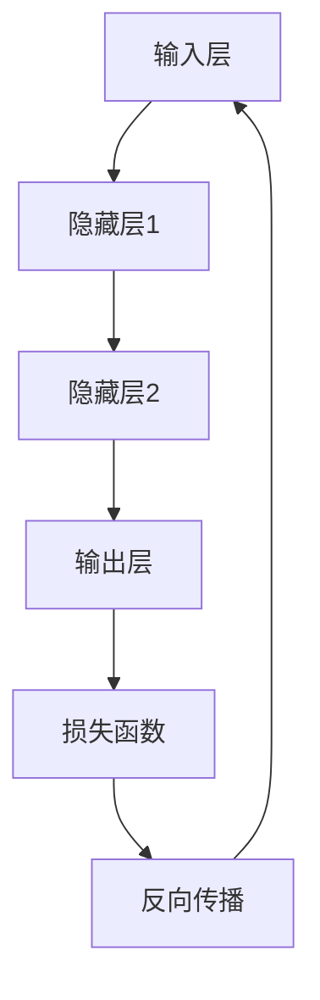
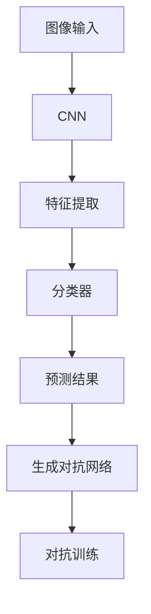
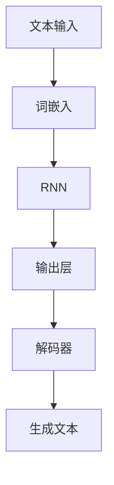

                 

关键词：人工智能，深度学习，未来发展趋势，技术挑战，计算机视觉，自然语言处理，数据隐私，伦理道德

## 摘要

本文旨在探讨人工智能（AI）的未来发展目标，从技术、应用、伦理等多个维度展开论述。通过对AI领域的关键技术、算法原理、应用场景以及面临的挑战进行分析，我们试图描绘出未来AI发展的蓝图，并提出一些建议和展望。

## 1. 背景介绍

人工智能作为计算机科学的重要分支，自20世纪50年代诞生以来，经历了多次技术革新和理论突破。特别是深度学习技术的发展，使得AI在图像识别、自然语言处理、语音识别等领域取得了显著的成果。如今，AI已经深入到各个行业，改变了我们的生活方式和工作模式。

### 1.1 AI技术的发展历程

- **早期探索（1956-1980）**：人工智能的概念被首次提出，研究者开始探索如何让计算机模拟人类的智能行为。
- **符号主义时期（1980-2010）**：基于符号主义的方法成为主流，但受限于计算能力和数据规模，AI的发展陷入瓶颈。
- **大数据与深度学习时期（2010至今）**：随着计算能力的提升和数据量的爆发式增长，深度学习技术逐渐成为AI发展的主流。

### 1.2 AI在各个领域的应用

- **计算机视觉**：通过图像识别和图像生成技术，AI在安防监控、医疗诊断、自动驾驶等领域有着广泛的应用。
- **自然语言处理**：语音识别、机器翻译、文本生成等技术使得AI在智能客服、智能助手等领域发挥着重要作用。
- **机器人与自动化**：通过智能机器人技术和自动化生产线，AI正在改变制造业和服务业的运营模式。

## 2. 核心概念与联系

### 2.1 深度学习

深度学习是一种基于多层神经网络的结构，通过逐层提取特征来学习数据中的复杂模式。其核心原理是神经网络，其中每个神经元都与其他神经元相连接，通过权重和偏置来传递信息。

#### Mermaid 流程图



### 2.2 计算机视觉

计算机视觉是AI的一个重要分支，通过图像处理、模式识别等技术，使计算机能够“看”和理解图像。其核心算法包括卷积神经网络（CNN）和生成对抗网络（GAN）。

#### Mermaid 流程图



### 2.3 自然语言处理

自然语言处理（NLP）旨在使计算机能够理解和生成自然语言。其主要技术包括词嵌入、递归神经网络（RNN）和Transformer模型。

#### Mermaid 流程图



## 3. 核心算法原理 & 具体操作步骤

### 3.1 算法原理概述

#### 深度学习算法

深度学习算法基于多层神经网络，通过前向传播和反向传播来更新权重和偏置，从而学习数据中的特征。

1. **前向传播**：输入数据经过多层神经网络，逐层计算输出。
2. **反向传播**：通过计算损失函数的梯度，更新权重和偏置。

#### 计算机视觉算法

计算机视觉算法主要通过卷积神经网络来提取图像特征，并进行分类。

1. **卷积层**：通过卷积操作提取图像特征。
2. **池化层**：通过最大池化或平均池化来降低特征图的维度。
3. **全连接层**：通过全连接层将特征映射到类别。

#### 自然语言处理算法

自然语言处理算法主要通过递归神经网络（RNN）或Transformer模型来处理序列数据。

1. **编码器**：将输入序列编码为固定长度的向量。
2. **解码器**：将编码后的向量解码为输出序列。

### 3.2 算法步骤详解

#### 深度学习算法步骤

1. **初始化参数**：随机初始化权重和偏置。
2. **前向传播**：输入数据经过神经网络，得到输出。
3. **计算损失**：通过损失函数计算预测值和真实值之间的差距。
4. **反向传播**：计算梯度，更新权重和偏置。
5. **迭代训练**：重复步骤2-4，直到模型收敛。

#### 计算机视觉算法步骤

1. **数据预处理**：对图像进行缩放、裁剪等操作。
2. **构建网络**：构建卷积神经网络结构。
3. **训练模型**：通过训练集训练模型，优化权重和偏置。
4. **评估模型**：通过测试集评估模型性能。

#### 自然语言处理算法步骤

1. **数据预处理**：对文本进行分词、去停用词等操作。
2. **构建模型**：构建递归神经网络或Transformer模型。
3. **训练模型**：通过训练集训练模型。
4. **生成文本**：通过解码器生成输出序列。

### 3.3 算法优缺点

#### 深度学习算法

**优点**：能够自动提取数据中的复杂特征，适用于处理大规模数据。

**缺点**：对数据依赖性较大，训练时间较长。

#### 计算机视觉算法

**优点**：在图像识别、目标检测等领域表现优异。

**缺点**：对光照、角度等环境变化敏感。

#### 自然语言处理算法

**优点**：能够处理自然语言中的复杂结构。

**缺点**：对长文本处理能力有限。

### 3.4 算法应用领域

#### 深度学习算法

- **图像识别**：如人脸识别、车辆识别等。
- **语音识别**：如语音助手、自动字幕等。
- **自然语言处理**：如机器翻译、文本生成等。

#### 计算机视觉算法

- **自动驾驶**：通过图像识别和目标检测实现自动驾驶功能。
- **医疗诊断**：通过图像识别辅助医生进行疾病诊断。
- **安防监控**：通过人脸识别和目标跟踪进行安防监控。

#### 自然语言处理算法

- **智能客服**：通过自然语言处理技术实现智能客服系统。
- **智能助手**：如 Siri、Alexa 等智能语音助手。
- **内容审核**：通过文本生成和分类技术进行内容审核。

## 4. 数学模型和公式 & 详细讲解 & 举例说明

### 4.1 数学模型构建

#### 深度学习模型

深度学习模型通常由多层神经网络组成，每层都包含多个神经元。神经元的激活函数通常为非线性函数，如 sigmoid、ReLU 等。

#### 计算机视觉模型

计算机视觉模型主要基于卷积神经网络（CNN），通过卷积层、池化层和全连接层来提取图像特征并进行分类。

#### 自然语言处理模型

自然语言处理模型主要基于递归神经网络（RNN）或 Transformer 模型，通过编码器和解码器来处理序列数据。

### 4.2 公式推导过程

#### 深度学习模型

假设我们有 m 个输入特征，每个特征对应一个神经元。神经网络的输出可以通过以下公式计算：

$$
z^{(l)} = \sum_{i=1}^{m} w^{(l)}_i x_i + b^{(l)}
$$

其中，$z^{(l)}$ 为第 l 层的输出，$w^{(l)}$ 和 $b^{(l)}$ 分别为权重和偏置。

#### 计算机视觉模型

卷积神经网络的卷积操作可以通过以下公式计算：

$$
h^{(k)}_{ij} = \sum_{i=1}^{m} w^{(k)}_{ij} f(g^{(k)}_{ij})
$$

其中，$h^{(k)}_{ij}$ 为第 k 层第 i 行第 j 列的特征值，$g^{(k)}_{ij}$ 为第 k 层第 i 行第 j 列的输入特征值，$w^{(k)}_{ij}$ 为权重，$f$ 为激活函数。

#### 自然语言处理模型

递归神经网络（RNN）的输出可以通过以下公式计算：

$$
h^{(l)}_t = \tanh(W^{(l)}h^{(l-1)}_t + b^{(l)})
$$

其中，$h^{(l)}_t$ 为第 l 层第 t 个时间步的输出，$W^{(l)}$ 和 $b^{(l)}$ 分别为权重和偏置。

### 4.3 案例分析与讲解

#### 案例一：图像分类

假设我们有 m 个输入特征，每个特征对应一个像素值。我们使用卷积神经网络对图像进行分类。首先，通过卷积层提取图像特征，然后通过全连接层进行分类。

1. **卷积层**：假设卷积核大小为 3x3，步长为 1，卷积操作可以表示为：

$$
h^{(1)}_{ij} = \sum_{i=1}^{m} w^{(1)}_{ij} f(g^{(1)}_{ij})
$$

其中，$g^{(1)}_{ij}$ 为输入图像的第 i 行第 j 列像素值，$w^{(1)}_{ij}$ 为卷积核权重，$f$ 为激活函数。

2. **全连接层**：将卷积层输出的特征映射到类别，通过全连接层计算输出：

$$
z^{(2)} = \sum_{i=1}^{m} w^{(2)}_i h^{(1)}_i + b^{(2)}
$$

其中，$z^{(2)}$ 为输出值，$w^{(2)}$ 和 $b^{(2)}$ 分别为权重和偏置。

#### 案例二：自然语言处理

假设我们有 n 个时间步的输入序列，每个时间步包含 d 个特征。我们使用递归神经网络对序列进行分类。

1. **编码器**：通过递归神经网络将输入序列编码为固定长度的向量：

$$
h^{(l)}_t = \tanh(W^{(l)}h^{(l-1)}_t + b^{(l)})
$$

2. **解码器**：通过解码器生成输出序列：

$$
p(y_t | y_{<t}) = \text{softmax}(W^Th^{(L)})
$$

其中，$h^{(L)}$ 为编码后的向量，$W$ 为权重矩阵。

## 5. 项目实践：代码实例和详细解释说明

### 5.1 开发环境搭建

首先，我们需要搭建一个开发环境，包括 Python、TensorFlow 等工具。

```bash
# 安装 Python
$ python3 -m pip install --user tensorflow

# 安装 TensorFlow
$ python3 -m pip install --user tensorflow

# 安装其他依赖
$ python3 -m pip install --user numpy matplotlib
```

### 5.2 源代码详细实现

下面是一个简单的图像分类代码示例，使用了 TensorFlow 和 Keras。

```python
import tensorflow as tf
from tensorflow import keras
import numpy as np
import matplotlib.pyplot as plt

# 加载数据集
(x_train, y_train), (x_test, y_test) = keras.datasets.cifar10.load_data()

# 预处理数据
x_train = x_train.astype("float32") / 255.0
x_test = x_test.astype("float32") / 255.0

# 构建模型
model = keras.Sequential([
    keras.layers.Conv2D(32, (3, 3), activation="relu", input_shape=(32, 32, 3)),
    keras.layers.MaxPooling2D(pool_size=(2, 2)),
    keras.layers.Flatten(),
    keras.layers.Dense(128, activation="relu"),
    keras.layers.Dense(10, activation="softmax")
])

# 编译模型
model.compile(optimizer="adam", loss="sparse_categorical_crossentropy", metrics=["accuracy"])

# 训练模型
model.fit(x_train, y_train, epochs=10, batch_size=64)

# 评估模型
test_loss, test_acc = model.evaluate(x_test, y_test)
print(f"Test accuracy: {test_acc}")

# 可视化结果
plt.figure(figsize=(10, 10))
for i in range(25):
    plt.subplot(5, 5, i+1)
    plt.imshow(x_test[i], cmap=plt.cm.binary)
    plt.xticks([])
    plt.yticks([])
    plt.grid(False)
    plt.xlabel(np.argmax(model.predict(x_test[i]).numpy()))
plt.show()
```

### 5.3 代码解读与分析

1. **数据加载与预处理**：首先加载 CIFAR-10 数据集，然后对图像进行归一化处理，将像素值缩放到 [0, 1] 范围内。

2. **构建模型**：使用 Keras 构建一个简单的卷积神经网络模型，包括卷积层、池化层和全连接层。

3. **编译模型**：指定优化器、损失函数和评估指标。

4. **训练模型**：使用训练集训练模型，设置训练轮次和批量大小。

5. **评估模型**：在测试集上评估模型性能。

6. **可视化结果**：展示模型对测试集图像的分类结果。

## 6. 实际应用场景

### 6.1 图像识别

图像识别是 AI 的重要应用领域之一。例如，在安防监控中，AI 可以通过图像识别技术实现人脸识别、目标检测等功能。

### 6.2 自然语言处理

自然语言处理技术在智能客服、智能助手等领域有着广泛应用。通过语音识别、文本生成等技术，AI 可以实现与人类的自然交互。

### 6.3 自动驾驶

自动驾驶是 AI 在未来的一大应用场景。通过计算机视觉和自然语言处理技术，自动驾驶车辆可以实现对环境的感知和决策。

## 7. 工具和资源推荐

### 7.1 学习资源推荐

- **《深度学习》（Goodfellow, Bengio, Courville）**：深度学习的经典教材。
- **《Python深度学习》（François Chollet）**：基于 Python 和 TensorFlow 的深度学习实践指南。

### 7.2 开发工具推荐

- **TensorFlow**：谷歌开源的深度学习框架。
- **PyTorch**：Facebook 开源的深度学习框架。

### 7.3 相关论文推荐

- **《AlexNet：One Step Beyond the Human Level on Image Classification》（Krizhevsky, Sutskever, Hinton）**
- **《Bridging the Gap Between Unsupervised and Supervised Text Classification》（Mnih, Kavukcuoglu）**
- **《Generative Adversarial Nets》（Goodfellow, Pouget-Abadie, Mirza, Xu, Warde-Farley, Ozair, Courville, Bengio）**

## 8. 总结：未来发展趋势与挑战

### 8.1 研究成果总结

随着深度学习、计算机视觉、自然语言处理等技术的不断发展，AI 在各个领域的应用取得了显著成果。然而，AI 仍然面临一些挑战，如数据隐私、算法透明性等。

### 8.2 未来发展趋势

- **更高效的算法**：通过改进算法结构和优化算法实现，提高 AI 的效率和性能。
- **跨领域应用**：推动 AI 在更多领域的应用，如医疗、金融、教育等。
- **开源与合作**：加强 AI 开源社区的协作，推动 AI 技术的普及和应用。

### 8.3 面临的挑战

- **数据隐私**：如何保护用户数据隐私，确保 AI 系统的透明性和安全性。
- **算法偏见**：如何消除算法偏见，避免对特定群体造成不公平影响。
- **伦理道德**：如何制定 AI 伦理准则，确保 AI 技术的发展符合社会价值观。

### 8.4 研究展望

在未来，AI 将继续推动科技和社会的发展。通过不断创新和改进，AI 将在更多领域发挥重要作用，为人类带来更多便利和福祉。

## 9. 附录：常见问题与解答

### 9.1 深度学习与机器学习的区别是什么？

深度学习是机器学习的一个子领域，主要关注于通过多层神经网络自动提取特征并进行预测。

### 9.2 卷积神经网络（CNN）在计算机视觉中有什么应用？

卷积神经网络在计算机视觉中有着广泛的应用，如图像分类、目标检测、图像分割等。

### 9.3 自然语言处理（NLP）有哪些核心技术？

自然语言处理的核心技术包括词嵌入、递归神经网络（RNN）、Transformer 模型等。

### 9.4 如何保护用户数据隐私？

保护用户数据隐私可以通过数据加密、匿名化处理、隐私增强技术等方式实现。

### 9.5 AI 在医疗领域的应用前景如何？

AI 在医疗领域有着广泛的应用前景，如辅助诊断、智能药物研发、医疗影像分析等。通过 AI 技术的助力，可以提高医疗服务的质量和效率。 
----------------------------------------------------------------

以上就是本文的完整内容，希望能够为读者提供关于人工智能未来发展目标的深入见解和思考。本文主要从技术、应用、伦理等多个维度进行了探讨，提出了未来发展的一些挑战和展望。在未来的发展中，我们需要不断努力，推动 AI 技术的进步，同时关注其对社会和人类的影响，确保 AI 技术能够造福人类。

### 结语

本文旨在探讨人工智能的未来发展目标，从技术、应用、伦理等多个维度进行了深入分析和讨论。通过对核心算法、应用场景、面临的挑战等方面的探讨，我们试图为读者呈现出一个全面、深入的AI未来图景。未来，AI 技术将继续快速发展，其在各个领域的应用也将不断拓展。然而，我们同时也需要关注 AI 带来的伦理和社会问题，确保其发展能够符合人类的价值观和需求。

在此，感谢各位读者对本文的关注，也欢迎各位就本文内容提出宝贵意见和建议。让我们共同关注 AI 的发展，共同探索未来的无限可能。最后，本文的撰写得益于许多专家学者的研究成果，在此对他们的辛勤工作表示敬意。作者：禅与计算机程序设计艺术 / Zen and the Art of Computer Programming。感谢阅读！<|im_sep|>

