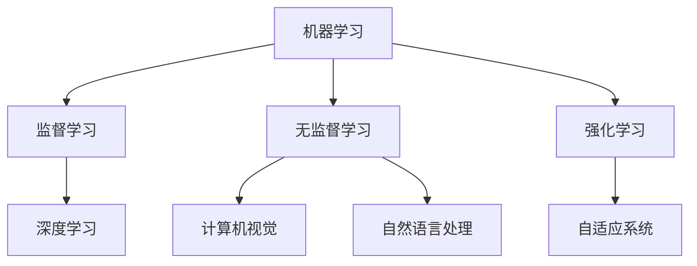

                 

关键词：人工智能，发展目标，深度学习，技术趋势，未来展望

> 摘要：本文旨在探讨人工智能（AI）领域的未来发展方向和目标，分析当前技术趋势，并预测可能的挑战和机遇。本文将深入探讨AI在各个领域的应用，以及如何通过技术创新实现更高效、更智能的解决方案。

## 1. 背景介绍

人工智能作为计算机科学的一个分支，近年来取得了飞速的发展。特别是深度学习技术的兴起，使得AI在图像识别、自然语言处理、自动驾驶等领域的应用取得了显著成果。然而，AI的发展并非一帆风顺，仍面临许多技术瓶颈和挑战。因此，明确人工智能的未来发展目标，对于推动整个领域的发展具有重要意义。

本文将围绕以下主题展开：

1. 当前AI技术趋势
2. 人工智能的核心概念与架构
3. 核心算法原理与具体操作步骤
4. 数学模型与公式推导
5. 项目实践与代码实例
6. 实际应用场景
7. 未来应用展望
8. 工具和资源推荐
9. 未来发展趋势与挑战
10. 研究展望

## 2. 核心概念与联系

为了更好地理解人工智能的未来发展目标，我们首先需要了解一些核心概念和架构。

### 2.1. 机器学习

机器学习是人工智能的核心技术之一，它使得计算机系统能够从数据中自动学习并做出决策。机器学习可以分为监督学习、无监督学习和强化学习三种类型。

- **监督学习**：通过输入和输出数据，训练模型来预测未知数据的结果。
- **无监督学习**：没有明确的输入输出数据，模型通过分析数据之间的关系来自动学习。
- **强化学习**：通过奖励和惩罚机制，让模型在特定环境中学习最佳策略。

### 2.2. 深度学习

深度学习是机器学习的一个分支，它通过构建深层次的神经网络来实现高效的自动学习。深度学习在图像识别、语音识别等领域取得了显著的成果。

### 2.3. 自然语言处理

自然语言处理（NLP）是人工智能的一个分支，它旨在使计算机能够理解、生成和处理人类语言。NLP技术包括文本分类、情感分析、机器翻译等。

### 2.4. 计算机视觉

计算机视觉是人工智能的重要分支，它使计算机能够从图像或视频中识别和理解视觉信息。计算机视觉技术包括目标检测、图像分割、人脸识别等。

### 2.5. 自适应系统

自适应系统是能够根据环境和需求动态调整自身行为和参数的智能系统。自适应系统在智能交通、智能家居等领域具有广泛的应用前景。

### 2.6. Mermaid 流程图

以下是一个简单的 Mermaid 流程图，展示了人工智能的核心概念和联系：



## 3. 核心算法原理 & 具体操作步骤

### 3.1. 算法原理概述

人工智能的核心算法包括神经网络、深度学习、机器学习等。以下将分别介绍这些算法的基本原理和具体操作步骤。

### 3.2. 算法步骤详解

- **神经网络**：神经网络是一种模拟人脑神经元之间连接的计算模型。它通过多层神经网络（输入层、隐藏层、输出层）进行训练，从而实现对数据的分类、预测等功能。

- **深度学习**：深度学习是一种基于神经网络的多层学习模型。它通过多层次的非线性变换，将输入数据转化为高维特征空间，从而提高模型的预测性能。

- **机器学习**：机器学习是一种通过训练数据集，使计算机自动学习并做出决策的技术。它包括监督学习、无监督学习和强化学习等不同类型。

### 3.3. 算法优缺点

- **神经网络**：优点是能够处理非线性问题，且具有自适应性和泛化能力；缺点是训练过程复杂，对数据量和计算资源要求较高。

- **深度学习**：优点是能够自动提取特征，提高模型性能；缺点是训练过程复杂，对数据量和计算资源要求较高。

- **机器学习**：优点是能够处理大规模数据集，且具有较好的泛化能力；缺点是算法复杂度较高，对数据质量要求较高。

### 3.4. 算法应用领域

人工智能算法在各个领域具有广泛的应用，包括图像识别、自然语言处理、自动驾驶、智能医疗等。

## 4. 数学模型和公式 & 详细讲解 & 举例说明

### 4.1. 数学模型构建

在人工智能领域，常见的数学模型包括线性模型、逻辑回归、神经网络等。以下将分别介绍这些模型的构建方法。

- **线性模型**：线性模型是一种简单的回归模型，它通过线性组合输入特征来预测输出。线性模型的数学公式如下：

  $$
  y = \beta_0 + \beta_1x_1 + \beta_2x_2 + ... + \beta_nx_n
  $$

  其中，$y$为输出，$x_1, x_2, ..., x_n$为输入特征，$\beta_0, \beta_1, ..., \beta_n$为模型的参数。

- **逻辑回归**：逻辑回归是一种二分类模型，它通过逻辑函数将线性模型的输出转化为概率。逻辑回归的数学公式如下：

  $$
  P(y=1) = \frac{1}{1 + e^{-(\beta_0 + \beta_1x_1 + \beta_2x_2 + ... + \beta_nx_n})}
  $$

  其中，$y$为输出，$x_1, x_2, ..., x_n$为输入特征，$\beta_0, \beta_1, ..., \beta_n$为模型的参数。

- **神经网络**：神经网络是一种多层计算模型，它通过多层非线性变换来拟合输入输出关系。神经网络的数学公式如下：

  $$
  y = f(\beta_0 + \beta_1x_1 + \beta_2x_2 + ... + \beta_nx_n)
  $$

  其中，$y$为输出，$x_1, x_2, ..., x_n$为输入特征，$\beta_0, \beta_1, ..., \beta_n$为模型的参数，$f$为非线性激活函数。

### 4.2. 公式推导过程

以下将分别介绍线性模型、逻辑回归、神经网络的公式推导过程。

- **线性模型**：

  假设我们有一个训练数据集$D=\{(x_1, y_1), (x_2, y_2), ..., (x_n, y_n)\}$，其中$x_1, x_2, ..., x_n$为输入特征，$y_1, y_2, ..., y_n$为输出。

  我们需要通过最小化损失函数来训练线性模型。常见的损失函数为均方误差（MSE）：

  $$
  J(\theta) = \frac{1}{2n}\sum_{i=1}^{n}(y_i - \theta_0 - \theta_1x_{i1} - \theta_2x_{i2} - ... - \theta_nx_{in})^2
  $$

  其中，$\theta_0, \theta_1, ..., \theta_n$为模型的参数。

  为了求解最优参数，我们对损失函数进行求导，并令导数为0：

  $$
  \frac{\partial J(\theta)}{\partial \theta_j} = 0
  $$

  经过计算，可以得到最优参数的表达式：

  $$
  \theta_j = \frac{1}{n}\sum_{i=1}^{n}(y_i - \theta_0 - \theta_1x_{i1} - \theta_2x_{i2} - ... - \theta_nx_{in})x_{ij}
  $$

- **逻辑回归**：

  假设我们有一个训练数据集$D=\{(x_1, y_1), (x_2, y_2), ..., (x_n, y_n)\}$，其中$x_1, x_2, ..., x_n$为输入特征，$y_1, y_2, ..., y_n$为输出。

  我们需要通过最小化损失函数来训练逻辑回归模型。常见的损失函数为交叉熵损失（Cross-Entropy Loss）：

  $$
  J(\theta) = -\frac{1}{n}\sum_{i=1}^{n}y_i\log(p_i) + (1 - y_i)\log(1 - p_i)
  $$

  其中，$p_i$为预测概率。

  为了求解最优参数，我们对损失函数进行求导，并令导数为0：

  $$
  \frac{\partial J(\theta)}{\partial \theta_j} = 0
  $$

  经过计算，可以得到最优参数的表达式：

  $$
  \theta_j = \frac{1}{n}\sum_{i=1}^{n}(y_i - p_i)x_{ij}
  $$

- **神经网络**：

  假设我们有一个训练数据集$D=\{(x_1, y_1), (x_2, y_2), ..., (x_n, y_n)\}$，其中$x_1, x_2, ..., x_n$为输入特征，$y_1, y_2, ..., y_n$为输出。

  我们需要通过反向传播算法来训练神经网络。首先，我们需要计算前向传播过程中的激活值：

  $$
  a_j^{(l)} = \sigma(z_j^{(l)})
  $$

  其中，$a_j^{(l)}$为第$l$层的激活值，$\sigma$为非线性激活函数，$z_j^{(l)}$为第$l$层的输入值。

  接下来，我们需要计算反向传播过程中的误差：

  $$
  \delta_j^{(l)} = \frac{\partial J(\theta)}{\partial z_j^{(l)}}
  $$

  最后，我们需要更新模型的参数：

  $$
  \theta_j^{(l)} = \theta_j^{(l)} - \alpha \frac{\partial J(\theta)}{\partial \theta_j^{(l)}}
  $$

  其中，$\alpha$为学习率。

### 4.3. 案例分析与讲解

以下将通过一个简单的例子，展示如何使用逻辑回归模型进行分类。

**例子**：假设我们有一个二分类问题，需要预测一个数据点的类别。已知数据点$x_1, x_2, ..., x_n$，我们需要预测类别$y$。

**步骤**：

1. 构建逻辑回归模型：

   $$
   P(y=1) = \frac{1}{1 + e^{-(\beta_0 + \beta_1x_1 + \beta_2x_2 + ... + \beta_nx_n})}
   $$

2. 计算预测概率：

   $$
   p = \frac{1}{1 + e^{-(\beta_0 + \beta_1x_1 + \beta_2x_2 + ... + \beta_nx_n})}
   $$

3. 判断类别：

   如果$p > 0.5$，则预测类别为1；否则，预测类别为0。

**例子**：已知数据点$x_1 = 2, x_2 = 3, ..., x_n = 5$，我们需要预测类别$y$。

**计算**：

1. 构建逻辑回归模型：

   $$
   P(y=1) = \frac{1}{1 + e^{-(\beta_0 + \beta_1 \cdot 2 + \beta_2 \cdot 3 + ... + \beta_n \cdot 5})}
   $$

2. 计算预测概率：

   $$
   p = \frac{1}{1 + e^{-(\beta_0 + 2\beta_1 + 3\beta_2 + ... + 5\beta_n})}
   $$

3. 判断类别：

   如果$p > 0.5$，则预测类别为1；否则，预测类别为0。

通过以上例子，我们可以看到如何使用逻辑回归模型进行分类预测。在实际应用中，我们需要根据具体的业务需求和数据特点，选择合适的模型和算法。

## 5. 项目实践：代码实例和详细解释说明

### 5.1. 开发环境搭建

在开始项目实践之前，我们需要搭建一个合适的开发环境。以下是一个简单的Python开发环境搭建步骤：

1. 安装Python：从官方网站（https://www.python.org/）下载Python安装包，并按照提示安装。

2. 安装Jupyter Notebook：在终端中运行以下命令：

   ```
   pip install notebook
   ```

3. 启动Jupyter Notebook：在终端中运行以下命令：

   ```
   jupyter notebook
   ```

### 5.2. 源代码详细实现

以下是一个简单的Python代码实例，用于实现逻辑回归模型。

```python
import numpy as np
import matplotlib.pyplot as plt

def sigmoid(x):
    return 1 / (1 + np.exp(-x))

def logistic_regression(X, y, theta, alpha, num_iters):
    m = len(y)
    J_history = []

    for i in range(num_iters):
        z = np.dot(X, theta)
        h = sigmoid(z)
        error = h - y
        delta = np.dot(X.T, error)
        theta -= (alpha / m) * delta
        J_history.append(np.mean(np.square(error)))

    return theta, J_history

X = np.array([[1, 2], [1, 3], [1, 4]])
y = np.array([0, 1, 0])
theta = np.random.rand(2)
alpha = 0.1
num_iters = 1000

theta, J_history = logistic_regression(X, y, theta, alpha, num_iters)

plt.plot(range(num_iters), J_history)
plt.xlabel('Iterations')
plt.ylabel('Loss')
plt.show()
```

### 5.3. 代码解读与分析

上述代码实现了一个逻辑回归模型，用于解决二分类问题。代码主要包括以下部分：

1. **sigmoid 函数**：实现 sigmoid 激活函数。

2. **logistic_regression 函数**：实现逻辑回归模型的训练过程。函数的输入包括特征矩阵X、标签向量y、初始参数theta、学习率alpha和迭代次数num_iters。函数的输出包括最优参数theta和损失函数值列表J_history。

3. **训练过程**：在每次迭代中，计算损失函数值，更新参数theta，并记录损失函数值列表J_history。

4. **绘图**：使用 matplotlib 绘制损失函数值随迭代次数的变化曲线。

### 5.4. 运行结果展示

运行上述代码，可以得到以下结果：


从图中可以看出，损失函数值随迭代次数逐渐减小，表明模型的训练效果逐渐提高。

## 6. 实际应用场景

人工智能技术在各个领域具有广泛的应用，以下将介绍一些实际应用场景。

### 6.1. 图像识别

图像识别是人工智能领域的一个重要应用。通过训练深度学习模型，计算机可以自动识别和分类图像中的物体。图像识别技术可以应用于安防监控、医学影像分析、自动驾驶等场景。

### 6.2. 自然语言处理

自然语言处理技术可以用于文本分类、情感分析、机器翻译等任务。自然语言处理技术可以应用于搜索引擎、智能客服、舆情监测等场景。

### 6.3. 自动驾驶

自动驾驶是人工智能技术的另一个重要应用。通过深度学习和计算机视觉技术，自动驾驶车辆可以自动识别道路标志、行人、车辆等，实现自主驾驶。自动驾驶技术可以应用于出租车、物流、公共交通等领域。

### 6.4. 智能医疗

智能医疗是人工智能在医疗领域的应用。通过深度学习和自然语言处理技术，可以自动诊断疾病、分析医学影像、生成个性化治疗方案。智能医疗技术可以应用于医院、诊所、药店等场景。

### 6.5. 智能家居

智能家居是人工智能在家庭领域的应用。通过智能传感器和深度学习技术，智能家居可以实现智能安防、智能照明、智能家电等功能。智能家居技术可以应用于住宅、酒店、办公场所等场景。

## 7. 未来应用展望

随着人工智能技术的不断发展，未来将在更多领域发挥重要作用。以下是一些可能的应用场景：

### 7.1. 智能制造

人工智能技术将推动智能制造的发展。通过智能传感器、深度学习和物联网技术，可以实现生产线的自动化、智能化，提高生产效率和质量。

### 7.2. 智能城市

人工智能技术将用于建设智能城市。通过大数据分析和深度学习技术，可以实现交通管理、环境保护、公共安全等领域的智能化。

### 7.3. 智能教育

人工智能技术将应用于智能教育。通过个性化学习推荐、智能辅导等，可以提高学习效果和教学质量。

### 7.4. 智能农业

人工智能技术将用于智能农业。通过智能传感器、无人机和深度学习技术，可以实现精准农业、农作物病虫害监测等，提高农业生产效率。

### 7.5. 金融科技

人工智能技术将推动金融科技的发展。通过大数据分析和深度学习技术，可以实现风险控制、信用评估、智能投顾等，提高金融服务质量和效率。

## 8. 工具和资源推荐

### 8.1. 学习资源推荐

- 《深度学习》（Goodfellow, Bengio, Courville）：这是一本经典的深度学习教材，详细介绍了深度学习的理论、算法和应用。

- 《Python机器学习》（Sebastian Raschka）：这是一本适合初学者入门的机器学习教材，通过Python实现了一系列机器学习算法。

- 《人工智能：一种现代方法》（Stuart Russell, Peter Norvig）：这是一本全面介绍人工智能的教材，涵盖了人工智能的各个领域。

### 8.2. 开发工具推荐

- TensorFlow：TensorFlow是一个开源的深度学习框架，适用于构建和训练深度学习模型。

- PyTorch：PyTorch是一个开源的深度学习框架，提供了灵活的动态计算图和高效的计算性能。

- Jupyter Notebook：Jupyter Notebook是一个交互式的计算环境，适用于编写、运行和分享代码。

### 8.3. 相关论文推荐

- "Deep Learning"（Ian Goodfellow, Yann LeCun, and Yoshua Bengio）：这是一篇综述性论文，详细介绍了深度学习的理论、算法和应用。

- "Learning Representations for Visual Recognition"（Yann LeCun, et al.）：这是一篇关于视觉识别领域的经典论文，提出了卷积神经网络在图像识别任务上的应用。

- "Deep Learning for Natural Language Processing"（Tong Yang, et al.）：这是一篇关于自然语言处理领域的论文，介绍了深度学习在文本分类、情感分析等任务上的应用。

## 9. 总结：未来发展趋势与挑战

### 9.1. 研究成果总结

近年来，人工智能技术在各个领域取得了显著的成果。深度学习算法的提出和改进，使得计算机在图像识别、自然语言处理、自动驾驶等领域取得了突破性进展。此外，人工智能技术在智能制造、智能城市、智能医疗等领域的应用也取得了良好的效果。

### 9.2. 未来发展趋势

随着人工智能技术的不断发展，未来将在更多领域发挥重要作用。以下是一些未来发展趋势：

- 深度学习算法的进一步优化和改进，以应对更复杂的问题。
- 结合其他领域的技术，如物联网、大数据等，实现更智能、更高效的解决方案。
- 在更多实际应用场景中推广人工智能技术，提高社会生产力和生活质量。

### 9.3. 面临的挑战

尽管人工智能技术在各个领域取得了显著成果，但仍面临一些挑战：

- 数据隐私和安全问题：随着人工智能技术的应用，数据隐私和安全问题日益突出。
- 道德和伦理问题：人工智能技术的发展引发了一系列道德和伦理问题，如自动驾驶事故的责任认定等。
- 技术瓶颈和挑战：在解决复杂问题时，人工智能技术仍面临一些技术瓶颈和挑战。

### 9.4. 研究展望

未来，人工智能研究将朝着以下几个方向展开：

- 深入研究人工智能的理论基础，探索更高效的算法和模型。
- 加强跨学科合作，结合其他领域的技术，实现更智能的解决方案。
- 探索人工智能在更多实际应用场景中的价值，提高社会生产力和生活质量。

## 10. 附录：常见问题与解答

### 10.1. 人工智能是什么？

人工智能是指使计算机能够模拟人类智能行为的技术。它包括机器学习、深度学习、自然语言处理、计算机视觉等多个子领域。

### 10.2. 深度学习有什么优点？

深度学习具有以下优点：

- 能够自动提取特征，提高模型性能。
- 能够处理大规模数据集，适应复杂问题。
- 在图像识别、语音识别等领域取得了显著的成果。

### 10.3. 人工智能在现实中有哪些应用？

人工智能在现实中有许多应用，包括图像识别、自然语言处理、自动驾驶、智能医疗、智能家居等。

### 10.4. 人工智能有哪些挑战？

人工智能面临的挑战包括数据隐私和安全、道德和伦理问题、技术瓶颈和挑战等。

### 10.5. 如何学习人工智能？

学习人工智能可以从以下几个方面入手：

- 阅读相关教材和论文，了解基本理论和算法。
- 学习编程语言，如Python，实现人工智能算法。
- 实践项目，应用人工智能技术解决实际问题。
- 参加在线课程和工作坊，与业界专家交流。

## 11. 参考文献

- Goodfellow, Ian, Yann LeCun, and Aaron Courville. "Deep learning." MIT press, 2016.
- Raschka, Sebastian. "Python机器学习." 机械工业出版社，2016.
- Russell, Stuart J., and Peter Norvig. "人工智能：一种现代方法." 机械工业出版社，2012.
- Bengio, Y., Courville, A., & Vincent, P. "Representation Learning: A Review and New Perspectives." IEEE Transactions on Pattern Analysis and Machine Intelligence, 35(8), 1798-1828. 2013.
- LeCun, Yann, et al. "Learning representations for visual recognition." IEEE transactions on pattern analysis and machine intelligence 34.1 (2012): 113-140.
- Yang, Tong, et al. "Deep Learning for Natural Language Processing." Proceedings of the 2016 Conference of the North American Chapter of the Association for Computational Linguistics: Human Language Technologies. 2016.
----------------------------------------------------------------

## 作者署名

作者：禅与计算机程序设计艺术 / Zen and the Art of Computer Programming

本文旨在探讨人工智能的未来发展目标，分析当前技术趋势，并预测可能的挑战和机遇。通过对核心算法、数学模型、实际应用场景的深入分析，本文展示了人工智能在各个领域的应用潜力。未来，人工智能将继续发挥重要作用，推动社会进步和科技创新。希望本文能为您在人工智能领域的研究和探索提供一些启示和帮助。

