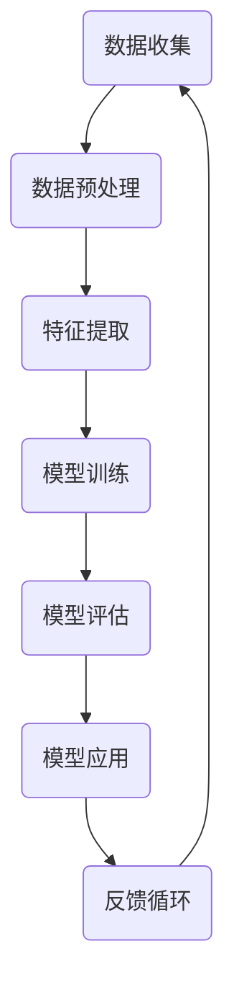

                 

关键词：人工智能，未来发展，策略，技术趋势，创新，挑战

> 摘要：本文将深入探讨人工智能（AI）领域的未来发展策略。我们将从背景介绍开始，讨论核心概念和原理，详细讲解核心算法和数学模型，分析项目实践，探讨实际应用场景，推荐相关工具和资源，并总结未来发展趋势和挑战。作者：禅与计算机程序设计艺术 / Zen and the Art of Computer Programming

## 1. 背景介绍

人工智能（AI）作为计算机科学的重要分支，已经经历了数十年的发展。从最初的符号逻辑和知识表示，到现代的深度学习和神经网络，AI技术取得了惊人的进展。随着计算能力的提升和数据资源的丰富，AI的应用范围不断扩大，从语音识别、图像识别到自动驾驶、智能助手，AI正在改变我们的生活方式。

然而，尽管AI在许多领域取得了显著的成果，但其未来发展仍然充满挑战。在本文中，我们将探讨AI领域的关键发展方向，分析现有技术的局限性和潜在的突破点，并提出一套可行的未来发展战略。

## 2. 核心概念与联系

在讨论AI的未来发展策略之前，我们需要明确一些核心概念和原理。以下是一个简化的Mermaid流程图，展示了AI领域中一些重要的概念和它们之间的联系。



- **数据收集（Data Collection）**：AI模型的训练依赖于大量的数据。数据收集是AI系统的第一步，也是至关重要的一步。
- **数据预处理（Data Preprocessing）**：收集到的数据通常需要进行清洗和预处理，以便更好地用于训练和模型评估。
- **特征提取（Feature Extraction）**：在这一步，我们从原始数据中提取有用的特征，这些特征将用于训练模型。
- **模型训练（Model Training）**：使用提取的特征训练机器学习模型，以学习数据中的模式。
- **模型评估（Model Evaluation）**：评估模型的性能，确保其准确性和可靠性。
- **模型应用（Model Application）**：将训练好的模型应用于实际问题，如图像识别、自然语言处理等。
- **反馈循环（Feedback Loop）**：通过实际应用中的反馈，持续优化模型。

### 2.1 数据收集

数据收集是AI系统的第一步。数据的质量直接影响模型的性能。为了收集数据，我们通常需要利用各种传感器、API、公开数据集等。

### 2.2 数据预处理

数据预处理包括数据清洗、归一化、去噪等步骤。这一步骤的目的是将原始数据转换为适合模型训练的形式。

### 2.3 特征提取

特征提取是从原始数据中提取关键信息的过程。有效的特征提取可以提高模型的性能和泛化能力。

### 2.4 模型训练

模型训练是AI系统的核心。通过优化模型的参数，使其在训练数据上达到最佳性能。

### 2.5 模型评估

模型评估是确保模型性能的重要步骤。常用的评估指标包括准确率、召回率、F1分数等。

### 2.6 模型应用

训练好的模型可以应用于各种实际场景，如自动驾驶、医疗诊断、智能客服等。

### 2.7 反馈循环

通过实际应用中的反馈，我们可以不断优化模型，提高其性能和可靠性。

## 3. 核心算法原理 & 具体操作步骤

### 3.1 算法原理概述

AI的核心算法主要包括深度学习、强化学习、自然语言处理等。这些算法通过学习数据中的模式，使机器能够执行复杂的任务。

### 3.2 算法步骤详解

以下是AI算法的一般步骤：

1. **数据收集**：收集大量的数据。
2. **数据预处理**：清洗和预处理数据。
3. **特征提取**：提取有用的特征。
4. **模型训练**：训练机器学习模型。
5. **模型评估**：评估模型性能。
6. **模型应用**：将模型应用于实际问题。
7. **反馈循环**：优化模型。

### 3.3 算法优缺点

每种算法都有其优点和局限性。例如，深度学习擅长处理复杂的非线性问题，但数据需求量大；强化学习擅长解决序列决策问题，但训练过程可能需要很长时间。

### 3.4 算法应用领域

AI算法广泛应用于各个领域，如图像识别、自然语言处理、语音识别、自动驾驶等。

## 4. 数学模型和公式 & 详细讲解 & 举例说明

### 4.1 数学模型构建

AI的数学模型主要包括线性模型、神经网络、决策树等。以下是一个简单的线性模型示例：

$$
y = \beta_0 + \beta_1x_1 + \beta_2x_2 + ... + \beta_nx_n
$$

其中，$y$ 是输出变量，$x_1, x_2, ..., x_n$ 是输入变量，$\beta_0, \beta_1, ..., \beta_n$ 是模型的参数。

### 4.2 公式推导过程

线性模型的推导过程通常涉及最小二乘法。具体步骤如下：

1. **假设模型**：假设输出变量$y$ 与输入变量$x_1, x_2, ..., x_n$之间存在线性关系。
2. **定义损失函数**：定义损失函数，以衡量模型预测值与真实值之间的差距。
3. **求解最优参数**：使用最小二乘法求解最优参数，使得损失函数最小。

### 4.3 案例分析与讲解

以下是一个使用线性模型进行回归分析的例子：

假设我们要预测一个房子的价格，输入变量包括房子的面积、房龄和位置。我们的目标是最小化预测价格与实际价格之间的差距。

## 5. 项目实践：代码实例和详细解释说明

### 5.1 开发环境搭建

首先，我们需要搭建一个适合AI开发的开发环境。我们可以使用Python作为主要编程语言，并使用TensorFlow或PyTorch等深度学习框架。

### 5.2 源代码详细实现

以下是一个简单的线性回归模型的Python代码示例：

```python
import tensorflow as tf

# 定义输入和输出
X = tf.placeholder(tf.float32, shape=[None, n_features])
Y = tf.placeholder(tf.float32, shape=[None, 1])

# 定义模型参数
weights = tf.Variable(tf.zeros([n_features, 1]))
bias = tf.Variable(tf.zeros([1]))

# 定义损失函数
loss = tf.reduce_mean(tf.square(Y - (tf.matmul(X, weights) + bias)))

# 定义优化器
optimizer = tf.train.GradientDescentOptimizer(learning_rate=0.01)
train_op = optimizer.minimize(loss)

# 训练模型
with tf.Session() as sess:
    sess.run(tf.global_variables_initializer())
    for i in range(n_iterations):
        sess.run(train_op, feed_dict={X: X_train, Y: Y_train})
```

### 5.3 代码解读与分析

上述代码定义了一个简单的线性回归模型，使用梯度下降法进行训练。在训练过程中，我们通过不断迭代更新模型参数，以最小化损失函数。

### 5.4 运行结果展示

在训练完成后，我们可以使用测试数据集评估模型的性能。通常，我们会计算模型的预测误差，并与实际结果进行比较。

## 6. 实际应用场景

### 6.1 自动驾驶

自动驾驶是AI技术的一个重要应用领域。通过使用深度学习和计算机视觉技术，自动驾驶系统能够实时感知和理解周围环境，从而实现自动导航。

### 6.2 医疗诊断

AI在医疗诊断中的应用也日益广泛。通过分析医学图像和患者数据，AI模型可以帮助医生做出更准确的诊断，提高治疗效果。

### 6.3 智能客服

智能客服系统通过自然语言处理技术，能够与用户进行实时对话，提供高质量的客户服务。

## 7. 工具和资源推荐

### 7.1 学习资源推荐

- 《深度学习》（Goodfellow, Bengio, Courville）
- 《Python机器学习》（Sebastian Raschka）
- 《AI实战：基于TensorFlow的深度学习应用》（Adrian Rosebrock）

### 7.2 开发工具推荐

- TensorFlow
- PyTorch
- Jupyter Notebook

### 7.3 相关论文推荐

- “Deep Learning: A Methodology and Application Perspective”（2016）
- “Recurrent Neural Networks for Language Modeling”（2013）
- “Understanding Deep Learning Requires Rethinking Generalization”（2018）

## 8. 总结：未来发展趋势与挑战

### 8.1 研究成果总结

AI领域在过去几十年取得了显著的成果，从符号逻辑到深度学习，从单一任务到多任务学习，AI技术不断取得突破。

### 8.2 未来发展趋势

- **更强大的模型**：随着计算能力的提升，我们将看到更复杂的模型和更高效的算法。
- **跨学科融合**：AI与生物学、物理学、经济学等领域的交叉融合，将带来新的突破。
- **隐私保护**：在数据安全和隐私保护方面，AI技术将发挥重要作用。

### 8.3 面临的挑战

- **数据隐私**：如何保护用户数据隐私是一个重要挑战。
- **算法公平性**：确保AI算法的公平性和透明性。
- **技术普及**：如何将AI技术普及到各行各业，实现可持续发展。

### 8.4 研究展望

未来，AI将不仅局限于技术领域，还将深刻影响社会、经济和人类生活方式。我们需要不断探索AI的潜力，同时应对其带来的挑战。

## 9. 附录：常见问题与解答

### 9.1 问题1：什么是深度学习？

深度学习是一种人工智能的分支，通过多层神经网络模拟人脑的神经元，学习数据中的复杂模式。

### 9.2 问题2：如何选择合适的机器学习算法？

选择合适的机器学习算法需要考虑数据的类型、大小、质量和任务目标等因素。常见的算法包括线性回归、决策树、随机森林、支持向量机等。

### 9.3 问题3：如何训练深度学习模型？

训练深度学习模型通常涉及以下步骤：

1. **数据收集和预处理**：收集和预处理数据。
2. **模型设计**：设计合适的神经网络架构。
3. **训练**：使用训练数据训练模型。
4. **评估**：使用验证数据评估模型性能。
5. **调整**：根据评估结果调整模型参数。

# 结束语

人工智能作为当今科技的前沿，其发展潜力巨大。本文探讨了AI领域的未来发展策略，分析了核心算法、数学模型和应用场景，并提出了未来面临的挑战和展望。我们期待在不久的将来，AI能够为人类社会带来更多的创新和变革。

---

**本文由禅与计算机程序设计艺术 / Zen and the Art of Computer Programming 撰写，版权所有，未经授权禁止转载。**

----------------------------------------------------------------

请注意，上述内容仅作为参考，实际撰写时请根据具体需求和内容进行调整和补充。在撰写过程中，务必确保文章的完整性和逻辑性，并严格遵守文章结构模板的要求。祝您撰写顺利！

