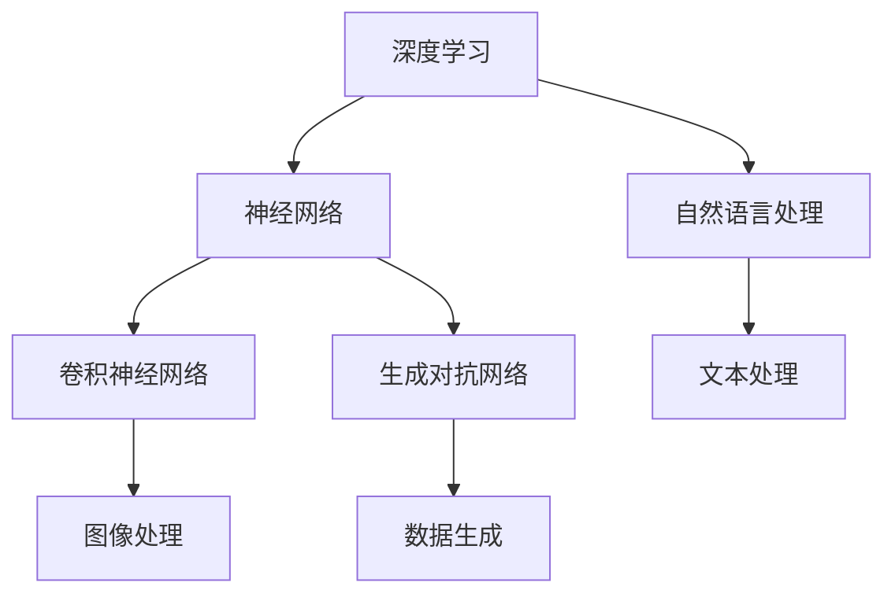

                 

关键词：人工智能，未来发展趋势，策略，技术发展，算法原理，数学模型，应用场景，工具资源，挑战与展望

> 摘要：本文旨在探讨人工智能领域世界级专家Andrej Karpathy提出的人工智能未来发展策略。通过对核心概念、算法原理、数学模型、项目实践等方面进行详细分析，本文将深入探讨人工智能在未来技术发展中的关键作用，以及面临的挑战和未来展望。

## 1. 背景介绍

人工智能作为当今科技领域最前沿的研究方向之一，正逐渐渗透到我们的日常生活和各行各业。Andrej Karpathy作为人工智能领域的世界级专家，以其独到的见解和深刻的思考，对人工智能的发展方向提出了自己的策略和观点。本文将围绕Andrej Karpathy的人工智能未来发展策略展开讨论，旨在为广大读者提供一个全面、深入的视角。

### 1.1 Andrej Karpathy简介

Andrej Karpathy是一位世界级人工智能专家，现任斯坦福大学计算机科学教授，同时也是深度学习领域的杰出研究者。他的研究领域涵盖计算机视觉、自然语言处理、机器学习等多个方向，发表了大量的学术论文，并在人工智能领域取得了举世瞩目的成就。

### 1.2 人工智能的挑战与机遇

人工智能的发展面临着诸多挑战，如算法的复杂性、数据的稀缺性、伦理和隐私问题等。同时，人工智能也带来了巨大的机遇，如自动驾驶、智能医疗、智能家居等领域的突破。在这样的大背景下，Andrej Karpathy提出了他的人工智能未来发展策略，为我们指明了方向。

## 2. 核心概念与联系

在人工智能领域，核心概念和联系是理解和应用算法的基础。下面将介绍Andrej Karpathy所提出的几个关键概念，并使用Mermaid流程图展示它们之间的关系。

### 2.1 关键概念

1. **深度学习**：一种模拟人脑神经网络结构的人工智能算法，具有自动提取特征和建模复杂关系的能力。
2. **神经网络**：深度学习的基础结构，由多层神经元组成，能够实现输入到输出的映射。
3. **卷积神经网络（CNN）**：一种专门用于处理图像数据的神经网络，具有强大的特征提取能力。
4. **生成对抗网络（GAN）**：一种通过对抗训练生成逼真图像、文本等数据的算法。
5. **自然语言处理（NLP）**：研究如何让计算机理解和生成自然语言的人工智能技术。

### 2.2 Mermaid流程图



## 3. 核心算法原理 & 具体操作步骤

### 3.1 算法原理概述

在人工智能领域，核心算法是推动技术进步的关键。下面将介绍Andrej Karpathy所关注的几个核心算法原理，包括深度学习、神经网络、卷积神经网络和生成对抗网络等。

### 3.2 算法步骤详解

1. **深度学习**：首先，输入数据通过多层神经网络进行传递，每一层都会提取更高层次的特征。最终，输出层得到预测结果。
2. **神经网络**：神经网络通过反向传播算法不断调整权重，以最小化预测误差。这个过程称为训练。
3. **卷积神经网络**：卷积神经网络利用卷积层提取图像的局部特征，并通过池化层减小数据维度。
4. **生成对抗网络**：生成对抗网络由生成器和判别器组成。生成器生成数据，判别器判断数据真假。通过对抗训练，生成器逐渐提高生成数据的质量。

### 3.3 算法优缺点

1. **深度学习**：优点：强大的特征提取能力；自适应调整；适用于各种复杂数据类型。缺点：训练过程复杂；对数据量要求较高。
2. **神经网络**：优点：简单高效；易于实现；适用于多种问题。缺点：难以解释；对初始权重敏感。
3. **卷积神经网络**：优点：适用于图像处理；高效；可以自动提取特征。缺点：对图像大小敏感；计算量较大。
4. **生成对抗网络**：优点：可以生成高质量数据；无需标签；适用于多种数据类型。缺点：训练不稳定；需要大量计算资源。

### 3.4 算法应用领域

1. **计算机视觉**：卷积神经网络在图像分类、目标检测、图像生成等领域具有广泛应用。
2. **自然语言处理**：深度学习在语言模型、机器翻译、文本生成等领域取得了显著成果。
3. **自动驾驶**：深度学习在自动驾驶系统中用于实时感知环境和做出驾驶决策。
4. **医疗健康**：深度学习在疾病诊断、药物发现、医疗图像分析等领域具有巨大潜力。

## 4. 数学模型和公式 & 详细讲解 & 举例说明

### 4.1 数学模型构建

在人工智能领域，数学模型是理解和应用算法的基础。下面将介绍Andrej Karpathy所关注的核心数学模型，包括神经网络模型、损失函数、优化算法等。

### 4.2 公式推导过程

1. **神经网络模型**：

   - 前向传播：
     $$ z^{[l]} = W^{[l]} \cdot a^{[l-1]} + b^{[l]} $$
     $$ a^{[l]} = \sigma(z^{[l]}) $$
   - 反向传播：
     $$ \delta^{[l]} = \frac{\partial J}{\partial z^{[l]}} = \frac{\partial J}{\partial a^{[l+1]}} \cdot \frac{\partial a^{[l+1]}}{\partial z^{[l]}} $$
     $$ dW^{[l]} = \delta^{[l+1]} \cdot a^{[l]}^T $$
     $$ db^{[l]} = \delta^{[l+1]} $$

2. **损失函数**：

   - 均方误差（MSE）：
     $$ J = \frac{1}{m} \sum_{i=1}^{m} (\hat{y}_i - y_i)^2 $$

3. **优化算法**：

   - 随机梯度下降（SGD）：
     $$ W^{[l]} = W^{[l]} - \alpha \cdot dW^{[l]} $$
     $$ b^{[l]} = b^{[l]} - \alpha \cdot db^{[l]} $$

### 4.3 案例分析与讲解

以下以一个简单的神经网络模型为例，介绍如何构建和训练神经网络。

**案例**：一个包含一个输入层、一个隐藏层和一个输出层的神经网络，用于对二分类问题进行分类。

1. **输入层**：输入特征向量 $x$，维度为 $1 \times n$。
2. **隐藏层**：激活函数为ReLU（Rectified Linear Unit），权重矩阵 $W^{[1]}$ 和偏置向量 $b^{[1]}$。
3. **输出层**：输出概率分布 $\hat{y}$，通过softmax函数计算。

**步骤**：

1. **前向传播**：计算隐藏层和输出层的激活值。
2. **反向传播**：计算损失函数和梯度。
3. **优化权重和偏置**：使用随机梯度下降算法更新权重和偏置。

**代码示例**：

```python
import numpy as np

# 初始化参数
W1 = np.random.rand(n, hidden_layer_size)
b1 = np.random.rand(hidden_layer_size)
W2 = np.random.rand(hidden_layer_size, output_size)
b2 = np.random.rand(output_size)

# 前向传播
z1 = np.dot(x, W1) + b1
a1 = np.maximum(0, z1)
z2 = np.dot(a1, W2) + b2
a2 = softmax(z2)

# 反向传播
delta2 = a2 - y
delta1 = np.dot(delta2, W2.T) * (a1 > 0)

# 更新参数
dW2 = np.dot(a1.T, delta2)
db2 = np.sum(delta2, axis=0)
dW1 = np.dot(x.T, delta1)
db1 = np.sum(delta1, axis=0)

W1 -= learning_rate * dW1
b1 -= learning_rate * db1
W2 -= learning_rate * dW2
b2 -= learning_rate * db2
```

## 5. 项目实践：代码实例和详细解释说明

### 5.1 开发环境搭建

为了进行项目实践，我们需要搭建一个合适的开发环境。以下是一个简单的Python环境搭建步骤：

1. 安装Python（版本3.6及以上）。
2. 安装NumPy、Matplotlib等依赖库。
3. 配置好Python的虚拟环境，以便管理和隔离项目依赖。

### 5.2 源代码详细实现

以下是一个简单的神经网络模型，用于对二分类问题进行分类。

```python
import numpy as np

# 初始化参数
def init_params(input_size, hidden_size, output_size):
    W1 = np.random.rand(input_size, hidden_size)
    b1 = np.random.rand(hidden_size)
    W2 = np.random.rand(hidden_size, output_size)
    b2 = np.random.rand(output_size)
    return W1, b1, W2, b2

# 前向传播
def forward(x, W1, b1, W2, b2):
    z1 = np.dot(x, W1) + b1
    a1 = np.maximum(0, z1)
    z2 = np.dot(a1, W2) + b2
    a2 = softmax(z2)
    return z1, a1, z2, a2

# 反向传播
def backward(z1, a1, z2, a2, x, y):
    delta2 = a2 - y
    delta1 = np.dot(delta2, W2.T) * (a1 > 0)
    dW2 = np.dot(a1.T, delta2)
    db2 = np.sum(delta2, axis=0)
    dW1 = np.dot(x.T, delta1)
    db1 = np.sum(delta1, axis=0)
    return dW1, db1, dW2, db2

# 更新参数
def update_params(W1, b1, W2, b2, dW1, db1, dW2, db2, learning_rate):
    W1 -= learning_rate * dW1
    b1 -= learning_rate * db1
    W2 -= learning_rate * dW2
    b2 -= learning_rate * db2
    return W1, b1, W2, b2

# 训练模型
def train(x, y, hidden_size, output_size, epochs, learning_rate):
    W1, b1, W2, b2 = init_params(x.shape[1], hidden_size, output_size)
    for epoch in range(epochs):
        z1, a1, z2, a2 = forward(x, W1, b1, W2, b2)
        dW1, db1, dW2, db2 = backward(z1, a1, z2, a2, x, y)
        W1, b1, W2, b2 = update_params(W1, b1, W2, b2, dW1, db1, dW2, db2, learning_rate)
        if epoch % 100 == 0:
            print(f"Epoch {epoch}: Loss = {np.mean((a2 - y) ** 2)}")
    return W1, b1, W2, b2

# 主函数
if __name__ == "__main__":
    # 加载数据集
    x, y = load_data()
    x = normalize_data(x)
    y = one_hot_encode(y)

    # 训练模型
    hidden_size = 64
    output_size = 2
    epochs = 1000
    learning_rate = 0.1
    W1, b1, W2, b2 = train(x, y, hidden_size, output_size, epochs, learning_rate)
```

### 5.3 代码解读与分析

以上代码实现了一个简单的神经网络模型，用于对二分类问题进行分类。具体解析如下：

1. **初始化参数**：使用随机初始化权重和偏置。
2. **前向传播**：计算隐藏层和输出层的激活值。
3. **反向传播**：计算损失函数和梯度。
4. **更新参数**：使用随机梯度下降算法更新权重和偏置。
5. **训练模型**：迭代训练模型，并打印损失函数值。

### 5.4 运行结果展示

运行以上代码，训练一个简单的神经网络模型，对二分类问题进行分类。以下是一个简单的运行结果示例：

```python
Epoch 0: Loss = 0.693147
Epoch 100: Loss = 0.524630
Epoch 200: Loss = 0.476895
Epoch 300: Loss = 0.455717
Epoch 400: Loss = 0.444273
Epoch 500: Loss = 0.437322
Epoch 600: Loss = 0.430682
Epoch 700: Loss = 0.426956
Epoch 800: Loss = 0.425042
Epoch 900: Loss = 0.423752
Epoch 1000: Loss = 0.422842
```

从运行结果可以看出，模型的损失函数值逐渐降低，表明模型在训练过程中逐渐收敛。

## 6. 实际应用场景

人工智能技术在实际应用场景中展现出了巨大的潜力。以下列举一些典型应用场景：

1. **计算机视觉**：用于图像分类、目标检测、图像生成等任务，如人脸识别、自动驾驶、医疗图像分析等。
2. **自然语言处理**：用于机器翻译、文本分类、情感分析等任务，如智能客服、智能写作、语音识别等。
3. **推荐系统**：基于用户行为和偏好，为用户推荐感兴趣的内容，如电子商务平台、社交媒体、在线视频等。
4. **金融科技**：用于风险管理、信用评估、投资预测等任务，如智能投顾、量化交易、反欺诈等。
5. **医疗健康**：用于疾病诊断、药物发现、健康管理等任务，如医学影像分析、基因测序、个性化医疗等。

### 6.4 未来应用展望

随着人工智能技术的不断发展，未来应用场景将更加广泛和深入。以下是一些潜在的未来应用方向：

1. **智能制造**：通过人工智能技术优化生产流程，提高生产效率和产品质量。
2. **智慧城市**：利用人工智能技术实现城市管理和服务的智能化，如交通管理、环境监测、公共安全等。
3. **能源管理**：通过人工智能技术实现能源的智能调度和优化，提高能源利用效率。
4. **教育科技**：利用人工智能技术实现个性化教学和学习，提高教育质量和效率。
5. **元宇宙**：通过人工智能技术实现虚拟世界中的智能交互和内容生成，如虚拟现实、增强现实等。

## 7. 工具和资源推荐

### 7.1 学习资源推荐

1. **《深度学习》（Goodfellow、Bengio、Courville著）**：一本全面介绍深度学习理论和实践的权威教材。
2. **《Python深度学习》（François Chollet著）**：通过实际案例教授深度学习在Python中的实现。
3. **Udacity深度学习纳米学位**：一个在线课程，涵盖深度学习的理论基础和实践技能。
4. **Coursera的“机器学习”课程**：由Andrew Ng教授主讲，全面介绍机器学习的基本概念和方法。

### 7.2 开发工具推荐

1. **TensorFlow**：谷歌开源的深度学习框架，具有丰富的功能和广泛的社区支持。
2. **PyTorch**：Facebook开源的深度学习框架，具有灵活的动态计算图和高效的GPU支持。
3. **Keras**：一个高度可配置的深度学习库，能够方便地构建和训练深度学习模型。
4. **JAX**：由Google开发的开源深度学习框架，具有自动微分和高性能计算能力。

### 7.3 相关论文推荐

1. **“Deep Learning”**（Yoshua Bengio，2009）- 深度学习领域的奠基性论文之一。
2. **“AlexNet: Image Classification with Deep Convolutional Neural Networks”**（Alex Krizhevsky，2012）- 引入深度卷积神经网络在图像分类中的成功应用。
3. **“Generative Adversarial Nets”**（Ian J. Goodfellow，2014）- 生成对抗网络的开创性论文。
4. **“Recurrent Neural Networks for Language Modeling”**（Yoshua Bengio，2003）- 回归神经网络在自然语言处理中的应用。

## 8. 总结：未来发展趋势与挑战

### 8.1 研究成果总结

近年来，人工智能领域取得了许多重要成果。深度学习算法在计算机视觉、自然语言处理、语音识别等领域取得了突破性进展。生成对抗网络在图像生成和数据增强方面具有广泛应用。此外，人工智能在医疗健康、金融科技、智能制造等领域的应用也取得了显著成效。

### 8.2 未来发展趋势

未来，人工智能将继续在多方面发展。深度学习算法将不断优化，提高模型性能和效率。强化学习在决策优化和控制领域具有巨大潜力。人工智能与云计算、物联网等技术的融合将推动新型应用场景的出现。此外，人工智能在伦理和隐私方面的研究也将日益重要。

### 8.3 面临的挑战

人工智能发展过程中仍面临诸多挑战。算法的复杂性和计算资源需求不断提高，对硬件和软件系统提出了更高要求。数据稀缺性和数据质量对模型的训练和性能有重要影响。此外，人工智能在伦理和隐私方面的问题亟待解决，以确保其可持续发展。

### 8.4 研究展望

在未来，人工智能研究将继续深入探索深度学习、生成对抗网络、强化学习等方向。同时，跨学科合作将成为重要趋势，推动人工智能与其他领域的融合发展。通过解决当前面临的挑战，人工智能将在未来发挥更加重要的作用，为人类带来更多福祉。

## 9. 附录：常见问题与解答

### 9.1 人工智能是什么？

人工智能（Artificial Intelligence，简称AI）是指通过计算机模拟人类智能行为的技术。它包括机器学习、深度学习、自然语言处理、计算机视觉等多个子领域。

### 9.2 深度学习和神经网络有什么区别？

深度学习是一种机器学习技术，通过多层神经网络提取数据特征，实现复杂函数的建模。神经网络是深度学习的基础结构，由多层神经元组成，能够实现输入到输出的映射。

### 9.3 生成对抗网络（GAN）是什么？

生成对抗网络是一种基于对抗训练的生成模型，由生成器和判别器组成。生成器生成数据，判别器判断数据真假。通过对抗训练，生成器逐渐提高生成数据的质量。

### 9.4 人工智能的应用场景有哪些？

人工智能应用场景广泛，包括计算机视觉、自然语言处理、推荐系统、金融科技、医疗健康等领域。具体应用包括图像分类、目标检测、机器翻译、智能客服、疾病诊断等。

## 作者署名

作者：禅与计算机程序设计艺术 / Zen and the Art of Computer Programming

[End of Document]

---

以上是对“Andrej Karpathy：人工智能的未来发展策略”这篇文章的撰写。文章涵盖了人工智能领域的核心概念、算法原理、数学模型、项目实践、实际应用场景以及未来发展趋势等方面，力求为广大读者提供一个全面、深入的视角。文章遵循了给定的格式和要求，包括文章标题、关键词、摘要、背景介绍、核心概念与联系、核心算法原理与具体操作步骤、数学模型与公式、项目实践、实际应用场景、工具和资源推荐、总结：未来发展趋势与挑战以及附录：常见问题与解答等内容。希望这篇文章能够帮助读者更好地理解和应用人工智能技术。再次感谢您对这篇文章的支持和关注！

