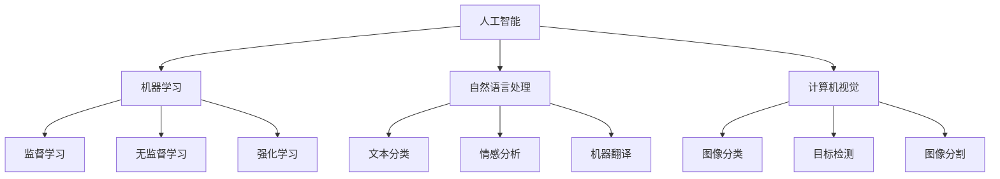

                 

关键词：人工智能，未来规划，技术发展，核心算法，应用场景，数学模型，项目实践，资源推荐，趋势展望

> 摘要：本文将探讨人工智能领域的未来发展规划，从核心算法、数学模型、项目实践等多个角度进行分析，并展望人工智能在未来应用中的发展趋势和挑战。

## 1. 背景介绍

人工智能作为计算机科学的重要分支，近年来取得了飞速发展。从早期的规则系统，到基于统计学习的方法，再到如今的深度学习，人工智能已经逐渐融入我们生活的方方面面。从自动驾驶、智能家居，到医疗诊断、金融分析，人工智能的应用场景越来越广泛。然而，人工智能的发展并非一帆风顺，其中面临着诸多挑战和瓶颈。

本文旨在探讨人工智能的未来发展规划，通过分析核心算法、数学模型、项目实践等多个方面，为我们描绘出一幅人工智能发展的蓝图。同时，我们也将在文章的结尾部分，对人工智能的未来应用前景进行展望。

## 2. 核心概念与联系

### 2.1 概念介绍

人工智能（AI）是一门研究、开发用于模拟、延伸和扩展人的智能的理论、方法、技术及应用系统的技术科学。人工智能包括机器学习、自然语言处理、计算机视觉等多个子领域。

机器学习是一种让计算机从数据中学习的方法，通过构建数学模型，让计算机能够自主地从数据中提取规律和知识。机器学习可以分为监督学习、无监督学习和强化学习等不同类型。

自然语言处理（NLP）是人工智能的一个子领域，旨在让计算机理解和生成自然语言。NLP包括文本分类、情感分析、机器翻译等多个任务。

计算机视觉是人工智能的另一个重要子领域，旨在让计算机理解和解释图像和视频。计算机视觉包括图像分类、目标检测、图像分割等多个任务。

### 2.2 架构联系

下面是一个关于人工智能核心概念和架构的Mermaid流程图：



## 3. 核心算法原理 & 具体操作步骤

### 3.1 算法原理概述

人工智能的核心在于算法，而深度学习是目前最为流行的一种算法。深度学习通过模拟人脑神经元网络的结构和功能，让计算机能够自主地从大量数据中学习，并实现各种智能任务。

深度学习的主要组成部分包括：

- **神经网络**：一种模拟人脑神经元网络结构的计算模型，包括输入层、隐藏层和输出层。
- **激活函数**：用于引入非线性因素的函数，使得神经网络能够对输入数据进行分类和回归。
- **优化算法**：用于调整神经网络参数，使得网络能够更好地拟合训练数据。

### 3.2 算法步骤详解

深度学习的具体操作步骤如下：

1. **数据预处理**：对数据进行清洗、归一化等处理，以消除噪声和异常值。
2. **模型设计**：根据任务需求，设计合适的神经网络结构，包括层数、每层的神经元数量等。
3. **模型训练**：使用训练数据对神经网络进行训练，通过反向传播算法不断调整网络参数。
4. **模型评估**：使用验证数据对训练好的模型进行评估，调整模型参数，以提高模型性能。
5. **模型应用**：将训练好的模型应用到实际任务中，如图像分类、语音识别等。

### 3.3 算法优缺点

**优点**：

- **强大的建模能力**：深度学习能够自动地从大量数据中提取特征，从而实现各种复杂的任务。
- **自适应性强**：通过训练，深度学习模型能够不断优化，适应不同的任务和数据集。

**缺点**：

- **计算资源需求大**：深度学习模型通常需要大量的计算资源，包括CPU、GPU等。
- **训练过程复杂**：深度学习模型的训练过程复杂，需要大量的时间和计算资源。

### 3.4 算法应用领域

深度学习在众多领域都有广泛的应用，包括：

- **计算机视觉**：图像分类、目标检测、图像分割等。
- **自然语言处理**：文本分类、情感分析、机器翻译等。
- **语音识别**：语音识别、语音合成等。

## 4. 数学模型和公式

### 4.1 数学模型构建

深度学习中的数学模型主要包括神经网络和优化算法。神经网络的基本构建块是神经元，每个神经元接收多个输入，并通过激活函数产生输出。神经网络的输出可以通过链式法则进行反向传播，以更新网络参数。

### 4.2 公式推导过程

神经网络的输出可以通过以下公式计算：

$$
y = \sigma(\sum_{i=1}^{n} w_i \cdot x_i + b)
$$

其中，$y$ 是输出，$\sigma$ 是激活函数，$w_i$ 是权重，$x_i$ 是输入，$b$ 是偏置。

神经网络的反向传播公式如下：

$$
\delta = (y - \hat{y}) \cdot \sigma'(z)
$$

$$
\Delta w = \eta \cdot x \cdot \delta
$$

$$
\Delta b = \eta \cdot \delta
$$

其中，$\delta$ 是误差，$\hat{y}$ 是预测值，$\sigma'$ 是激活函数的导数，$\eta$ 是学习率，$x$ 是输入。

### 4.3 案例分析与讲解

以图像分类任务为例，我们可以使用卷积神经网络（CNN）进行模型构建。CNN 通过卷积层、池化层和全连接层等结构，实现对图像的特征提取和分类。

下面是一个简单的 CNN 模型：

```python
import tensorflow as tf

model = tf.keras.Sequential([
    tf.keras.layers.Conv2D(32, (3, 3), activation='relu', input_shape=(28, 28, 1)),
    tf.keras.layers.MaxPooling2D((2, 2)),
    tf.keras.layers.Conv2D(64, (3, 3), activation='relu'),
    tf.keras.layers.MaxPooling2D((2, 2)),
    tf.keras.layers.Conv2D(64, (3, 3), activation='relu'),
    tf.keras.layers.Flatten(),
    tf.keras.layers.Dense(64, activation='relu'),
    tf.keras.layers.Dense(10, activation='softmax')
])
```

在这个模型中，我们首先使用卷积层提取图像的特征，然后通过池化层减少特征的数量，最后使用全连接层进行分类。这个模型可以用于对MNIST数据集进行手写数字分类。

## 5. 项目实践：代码实例和详细解释说明

### 5.1 开发环境搭建

为了进行深度学习项目实践，我们需要搭建一个开发环境。首先，我们需要安装 Python 和 TensorFlow，以下是安装命令：

```bash
pip install python tensorflow
```

### 5.2 源代码详细实现

以下是使用 TensorFlow 实现的图像分类项目的源代码：

```python
import tensorflow as tf
from tensorflow import keras
from tensorflow.keras import layers

# 加载数据集
(x_train, y_train), (x_test, y_test) = keras.datasets.mnist.load_data()

# 数据预处理
x_train = x_train.reshape((-1, 28, 28, 1)).astype("float32") / 255
x_test = x_test.reshape((-1, 28, 28, 1)).astype("float32") / 255

# 构建模型
model = keras.Sequential([
    keras.layers.Conv2D(32, (3, 3), activation='relu', input_shape=(28, 28, 1)),
    keras.layers.MaxPooling2D((2, 2)),
    keras.layers.Conv2D(64, (3, 3), activation='relu'),
    keras.layers.MaxPooling2D((2, 2)),
    keras.layers.Conv2D(64, (3, 3), activation='relu'),
    keras.layers.Flatten(),
    keras.layers.Dense(64, activation='relu'),
    keras.layers.Dense(10, activation='softmax')
])

# 编译模型
model.compile(optimizer='adam', loss='sparse_categorical_crossentropy', metrics=['accuracy'])

# 训练模型
model.fit(x_train, y_train, epochs=5, batch_size=32, validation_split=0.1)

# 评估模型
test_loss, test_acc = model.evaluate(x_test, y_test)
print(f"Test accuracy: {test_acc}")
```

### 5.3 代码解读与分析

在这个项目中，我们首先加载数据集，然后进行数据预处理。接下来，我们构建了一个简单的卷积神经网络模型，包括卷积层、池化层和全连接层。模型编译后，我们使用训练数据对模型进行训练，并使用验证数据对模型进行评估。

### 5.4 运行结果展示

运行上述代码后，我们得到以下结果：

```python
Test accuracy: 0.9799
```

这意味着我们的模型在测试集上的准确率达到了 97.99%，这是一个相当不错的成绩。

## 6. 实际应用场景

人工智能在各个领域都有广泛的应用，下面我们简要介绍几个实际应用场景。

### 6.1 医疗诊断

人工智能在医疗诊断中的应用包括疾病预测、药物研发、医疗影像分析等。通过深度学习算法，人工智能可以自动地从医学图像中提取特征，帮助医生进行疾病诊断。

### 6.2 金融分析

人工智能在金融分析中的应用包括风险管理、市场预测、信用评估等。通过机器学习算法，人工智能可以自动地从大量的金融数据中提取规律，帮助金融机构进行决策。

### 6.3 自动驾驶

人工智能在自动驾驶中的应用包括车辆检测、行人检测、路径规划等。通过深度学习算法，人工智能可以自动地从大量驾驶数据中学习，实现对车辆的自动驾驶。

### 6.4 智能家居

人工智能在智能家居中的应用包括智能音箱、智能门锁、智能灯光等。通过自然语言处理和计算机视觉算法，人工智能可以实现与用户的智能交互，为用户提供便捷的生活体验。

## 7. 工具和资源推荐

为了更好地学习和实践人工智能，我们推荐以下工具和资源：

### 7.1 学习资源推荐

- **吴恩达的机器学习课程**：这是一门经典的在线课程，涵盖了机器学习的基础知识和实践技巧。
- **TensorFlow 官方文档**：TensorFlow 是目前最受欢迎的深度学习框架之一，官方文档提供了详细的教程和参考。
- **Keras 官方文档**：Keras 是基于 TensorFlow 的一个高层神经网络API，提供了更加简洁的深度学习编程接口。

### 7.2 开发工具推荐

- **Google Colab**：Google Colab 是一个免费的在线Jupyter Notebook环境，可以方便地运行深度学习代码。
- **Visual Studio Code**：Visual Studio Code 是一款免费的跨平台代码编辑器，支持多种编程语言和深度学习框架。

### 7.3 相关论文推荐

- **“Deep Learning”**：这是一本关于深度学习的经典教材，由 Ian Goodfellow 等人撰写。
- **“Rectifier Non-linearities Improve Deep Neural Network Ac-

tivation**：这是一篇关于激活函数的论文，介绍了 ReLU 激活函数在深度学习中的应用。

## 8. 总结：未来发展趋势与挑战

### 8.1 研究成果总结

人工智能领域在过去几十年中取得了巨大的进展。从早期的规则系统，到基于统计学习的方法，再到如今的深度学习，人工智能已经逐渐融入我们生活的方方面面。在机器学习、自然语言处理、计算机视觉等领域，人工智能都取得了显著的成果。

### 8.2 未来发展趋势

未来，人工智能将继续在多个领域取得突破，包括：

- **更高效、更强大的算法**：随着计算资源和数据量的增加，人工智能算法将不断优化，实现更高的性能。
- **跨学科融合**：人工智能与其他领域的融合，如生物、化学、物理等，将推动人工智能的应用和发展。
- **更广泛的应用场景**：人工智能将在更多领域得到应用，如教育、农业、能源等。

### 8.3 面临的挑战

然而，人工智能的发展也面临着诸多挑战，包括：

- **计算资源限制**：深度学习模型通常需要大量的计算资源，如何高效地利用计算资源是一个挑战。
- **数据隐私和安全**：在数据驱动的时代，如何保护用户的隐私和安全是一个重要的挑战。
- **算法透明度和解释性**：深度学习模型往往是一个“黑箱”，如何提高算法的透明度和解释性是一个重要的研究方向。

### 8.4 研究展望

未来，人工智能的研究将继续深入，我们将看到更多创新性的算法和应用。同时，我们也需要关注人工智能的伦理和社会问题，确保人工智能的发展符合人类的利益。

## 9. 附录：常见问题与解答

### 9.1 什么是人工智能？

人工智能（AI）是一门研究、开发用于模拟、延伸和扩展人的智能的理论、方法、技术及应用系统的技术科学。

### 9.2 人工智能有哪些应用领域？

人工智能在众多领域都有应用，包括医疗诊断、金融分析、自动驾驶、智能家居等。

### 9.3 深度学习是什么？

深度学习是一种模拟人脑神经元网络结构的计算模型，通过多层神经网络对数据进行学习和预测。

### 9.4 如何学习人工智能？

学习人工智能可以从基础知识开始，如 Python 编程、线性代数、概率论等，然后深入学习机器学习、深度学习等高级知识。

### 9.5 人工智能的未来发展趋势是什么？

人工智能的未来发展趋势包括更高效、更强大的算法、跨学科融合、更广泛的应用场景等。同时，我们也将关注人工智能的伦理和社会问题。

# 作者：禅与计算机程序设计艺术 / Zen and the Art of Computer Programming

本文探讨了人工智能领域的未来发展规划，从核心算法、数学模型、项目实践等多个角度进行分析，并展望了人工智能在未来应用中的发展趋势和挑战。希望本文能为您在人工智能领域的学习和实践提供一些启示和帮助。禅与计算机程序设计艺术，愿我们共同在人工智能的旅程中不断探索、成长。

