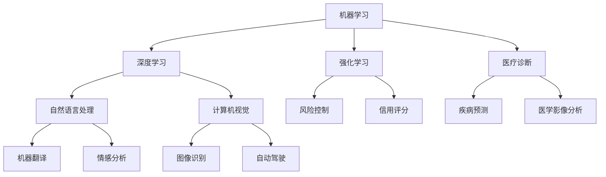

                 

关键词：人工智能，未来规划，技术发展，核心算法，数学模型，项目实践，应用场景，工具推荐

## 摘要

本文旨在探讨人工智能领域的未来发展趋势，通过对当前核心算法原理的深入剖析，以及数学模型和具体应用场景的详细讲解，旨在为读者呈现一幅清晰、全面的人工智能未来图景。文章将围绕人工智能的发展历程、核心算法原理、数学模型构建、项目实践和实际应用等多个方面进行探讨，并结合未来展望，分析人工智能领域面临的挑战和机遇。

## 1. 背景介绍

人工智能（Artificial Intelligence，简称AI）是一门探索如何使计算机模拟人类智能行为的科学。从20世纪50年代起，人工智能经历了多次起伏，随着计算能力的提升和算法的进步，人工智能迎来了新的发展高潮。现今，人工智能已经广泛应用于图像识别、自然语言处理、自动驾驶、医疗诊断等多个领域，成为推动社会进步的重要力量。

本文将主要探讨以下几个核心问题：

1. 人工智能的核心算法原理是什么？
2. 人工智能的数学模型如何构建？
3. 人工智能在各个领域的应用实践有哪些？
4. 人工智能的未来发展趋势如何？

通过对上述问题的深入分析，我们将试图描绘出一幅全面、清晰的人工智能未来图景。

### 1.1 人工智能的发展历程

人工智能的发展历程可以分为几个关键阶段：

- **初期探索阶段（1956-1969年）**：人工智能概念的提出和初步研究，主要探索如何使计算机模拟人类思维。
- **蓬勃发展阶段（1970-1989年）**：人工智能迎来了快速发展，主要集中在专家系统和机器学习领域。
- **低谷期（1990-2000年）**：由于技术瓶颈和实际应用难题，人工智能发展进入低谷。
- **新纪元（2000年至今）**：随着计算能力的提升、大数据的涌现和算法的突破，人工智能迎来了新的发展高潮。

### 1.2 人工智能的核心概念

人工智能的核心概念包括：

- **机器学习**：使计算机通过数据学习并改进性能的技术。
- **深度学习**：一种基于神经网络的机器学习技术，通过多层神经网络进行特征提取和模式识别。
- **自然语言处理**：使计算机能够理解、生成和处理自然语言的技术。
- **计算机视觉**：使计算机能够识别和理解图像和视频的技术。
- **强化学习**：通过不断试错和奖励机制，使计算机在特定环境中学习最优策略的技术。

### 1.3 人工智能的应用领域

人工智能已经广泛应用于以下领域：

- **图像识别**：例如人脸识别、物体检测等。
- **自然语言处理**：例如机器翻译、情感分析等。
- **自动驾驶**：例如自动驾驶汽车、无人机等。
- **医疗诊断**：例如疾病预测、医学影像分析等。
- **金融科技**：例如风险控制、信用评分等。
- **智能家居**：例如智能音箱、智能门锁等。

## 2. 核心概念与联系

为了更好地理解人工智能的核心概念，我们需要借助Mermaid流程图来展示各个核心概念之间的联系。



### 2.1 机器学习与深度学习

机器学习是人工智能的核心技术之一，它使计算机通过数据学习并改进性能。深度学习是机器学习的一种特殊形式，通过多层神经网络进行特征提取和模式识别，具有强大的表达能力和自学习能力。

### 2.2 自然语言处理与计算机视觉

自然语言处理（NLP）和计算机视觉（CV）是人工智能的两个重要分支。NLP旨在使计算机能够理解、生成和处理自然语言，例如机器翻译、情感分析等。CV旨在使计算机能够识别和理解图像和视频，例如人脸识别、物体检测等。

### 2.3 机器学习与强化学习

强化学习是机器学习的一种特殊形式，通过不断试错和奖励机制，使计算机在特定环境中学习最优策略。强化学习在金融科技、医疗诊断等领域具有广泛应用，例如风险控制和疾病预测。

### 2.4 图像识别、自动驾驶与自然语言处理

图像识别和自动驾驶是人工智能在特定领域的应用，它们依赖于计算机视觉和自然语言处理技术。图像识别使计算机能够识别和理解图像中的物体，自动驾驶使计算机能够在复杂环境中导航和避障。

## 3. 核心算法原理 & 具体操作步骤

### 3.1 算法原理概述

人工智能的核心算法包括机器学习、深度学习、自然语言处理和计算机视觉等。下面我们将分别介绍这些算法的基本原理。

### 3.1.1 机器学习

机器学习是一种通过数据驱动的方法，使计算机自动改进性能的技术。其主要原理是使用训练数据集，通过优化目标函数，调整模型参数，使模型能够对未知数据进行预测。

### 3.1.2 深度学习

深度学习是一种基于神经网络的机器学习技术，通过多层神经网络进行特征提取和模式识别。其基本原理是模拟人脑神经元的工作方式，通过前向传播和反向传播，不断调整网络参数，使模型能够对复杂数据进行高精度预测。

### 3.1.3 自然语言处理

自然语言处理是一种使计算机能够理解、生成和处理自然语言的技术。其基本原理包括词向量表示、序列建模、注意力机制等，通过这些技术，计算机能够处理和理解自然语言中的复杂结构。

### 3.1.4 计算机视觉

计算机视觉是一种使计算机能够识别和理解图像和视频的技术。其基本原理包括图像预处理、特征提取、目标检测、图像分割等，通过这些技术，计算机能够对图像进行理解和分析。

### 3.2 算法步骤详解

下面我们将详细介绍每个算法的具体步骤。

### 3.2.1 机器学习

1. 数据收集：收集训练数据和测试数据。
2. 特征提取：对数据进行预处理，提取特征。
3. 模型选择：选择合适的机器学习模型。
4. 模型训练：使用训练数据进行模型训练。
5. 模型评估：使用测试数据评估模型性能。
6. 模型优化：调整模型参数，提高模型性能。

### 3.2.2 深度学习

1. 数据收集：收集训练数据和测试数据。
2. 特征提取：对数据进行预处理，提取特征。
3. 网络架构设计：设计合适的深度学习网络架构。
4. 模型训练：使用训练数据进行模型训练。
5. 模型评估：使用测试数据评估模型性能。
6. 模型优化：调整网络参数，提高模型性能。

### 3.2.3 自然语言处理

1. 数据收集：收集训练数据和测试数据。
2. 词向量表示：将文本转化为词向量。
3. 序列建模：使用循环神经网络或变换器模型对序列数据进行建模。
4. 模型训练：使用训练数据进行模型训练。
5. 模型评估：使用测试数据评估模型性能。
6. 模型优化：调整模型参数，提高模型性能。

### 3.2.4 计算机视觉

1. 数据收集：收集训练数据和测试数据。
2. 特征提取：使用卷积神经网络对图像进行特征提取。
3. 目标检测：使用卷积神经网络对图像中的目标进行检测。
4. 图像分割：使用卷积神经网络对图像进行分割。
5. 模型训练：使用训练数据进行模型训练。
6. 模型评估：使用测试数据评估模型性能。
7. 模型优化：调整模型参数，提高模型性能。

### 3.3 算法优缺点

每个算法都有其优缺点，下面我们将分别介绍。

### 3.3.1 机器学习

优点：模型简单，易于实现和理解。
缺点：对数据量要求较高，模型泛化能力有限。

### 3.3.2 深度学习

优点：强大的表达能力和自学习能力，适用于处理复杂数据。
缺点：模型复杂，训练时间长，对数据质量和计算资源要求较高。

### 3.3.3 自然语言处理

优点：能够处理和理解自然语言中的复杂结构，适用于自然语言处理任务。
缺点：对数据质量和计算资源要求较高，模型泛化能力有限。

### 3.3.4 计算机视觉

优点：能够处理和理解图像和视频数据，适用于图像识别和计算机视觉任务。
缺点：对数据质量和计算资源要求较高，模型泛化能力有限。

### 3.4 算法应用领域

每个算法都有其特定的应用领域，下面我们将分别介绍。

### 3.4.1 机器学习

应用领域：数据挖掘、预测分析、推荐系统等。

### 3.4.2 深度学习

应用领域：图像识别、语音识别、自然语言处理等。

### 3.4.3 自然语言处理

应用领域：机器翻译、情感分析、问答系统等。

### 3.4.4 计算机视觉

应用领域：人脸识别、物体检测、自动驾驶等。

## 4. 数学模型和公式 & 详细讲解 & 举例说明

### 4.1 数学模型构建

人工智能的数学模型主要包括线性模型、非线性模型、概率模型和统计模型等。下面我们将分别介绍这些模型的基本原理和构建方法。

### 4.1.1 线性模型

线性模型是最简单的数学模型之一，其基本形式为：

$$
y = \beta_0 + \beta_1x_1 + \beta_2x_2 + ... + \beta_nx_n
$$

其中，$y$ 是目标变量，$x_1, x_2, ..., x_n$ 是输入变量，$\beta_0, \beta_1, ..., \beta_n$ 是模型参数。

### 4.1.2 非线性模型

非线性模型通过引入非线性函数，使模型能够表示复杂的数据关系。常见的非线性模型包括多项式模型、指数模型和对数模型等。

多项式模型的基本形式为：

$$
y = \beta_0 + \beta_1x_1 + \beta_2x_2^2 + ... + \beta_nx_n^n
$$

指数模型的基本形式为：

$$
y = \beta_0e^{\beta_1x_1} + \beta_2x_2 + ...
$$

对数模型的基本形式为：

$$
y = \beta_0 + \beta_1\log(x_1) + \beta_2x_2 + ...
$$

### 4.1.3 概率模型

概率模型通过引入概率分布，描述数据之间的相关性。常见的概率模型包括贝叶斯模型、马尔可夫模型和隐马尔可夫模型等。

贝叶斯模型的基本形式为：

$$
P(A|B) = \frac{P(B|A)P(A)}{P(B)}
$$

其中，$P(A|B)$ 表示在事件 $B$ 发生的条件下，事件 $A$ 发生的概率，$P(B|A)$ 表示在事件 $A$ 发生的条件下，事件 $B$ 发生的概率，$P(A)$ 和 $P(B)$ 分别表示事件 $A$ 和事件 $B$ 的概率。

### 4.1.4 统计模型

统计模型通过统计方法，分析数据之间的相关性，并建立数学模型。常见的统计模型包括回归模型、聚类模型和决策树模型等。

回归模型的基本形式为：

$$
y = \beta_0 + \beta_1x_1 + \beta_2x_2 + ...
$$

聚类模型的基本形式为：

$$
C = \{c_1, c_2, ..., c_k\}
$$

其中，$C$ 表示聚类结果，$c_1, c_2, ..., c_k$ 分别表示聚类后的类别。

### 4.2 公式推导过程

在构建数学模型时，我们需要根据具体问题和数据特点，选择合适的模型并进行公式推导。下面我们将以线性模型为例，介绍公式推导过程。

假设我们有一个线性模型：

$$
y = \beta_0 + \beta_1x_1 + \beta_2x_2 + ...
$$

我们需要确定模型参数 $\beta_0, \beta_1, ..., \beta_n$ 的值，使模型能够准确预测目标变量 $y$。我们可以通过最小化预测误差平方和来实现这一目标。

预测误差平方和为：

$$
S = \sum_{i=1}^{n}(y_i - \hat{y_i})^2
$$

其中，$y_i$ 表示第 $i$ 个实际值，$\hat{y_i}$ 表示第 $i$ 个预测值。

为了最小化预测误差平方和，我们可以对每个参数 $\beta_0, \beta_1, ..., \beta_n$ 求偏导数，并令其等于零，从而求解参数值。

对 $\beta_0$ 求偏导数：

$$
\frac{\partial S}{\partial \beta_0} = -2\sum_{i=1}^{n}(y_i - \hat{y_i}) = 0
$$

对 $\beta_1$ 求偏导数：

$$
\frac{\partial S}{\partial \beta_1} = -2\sum_{i=1}^{n}(y_i - \hat{y_i})x_{1i} = 0
$$

对 $\beta_2$ 求偏导数：

$$
\frac{\partial S}{\partial \beta_2} = -2\sum_{i=1}^{n}(y_i - \hat{y_i})x_{2i} = 0
$$

...

对 $\beta_n$ 求偏导数：

$$
\frac{\partial S}{\partial \beta_n} = -2\sum_{i=1}^{n}(y_i - \hat{y_i})x_{ni} = 0
$$

通过求解上述方程组，我们可以得到最优参数值，从而构建线性模型。

### 4.3 案例分析与讲解

为了更好地理解数学模型的构建和推导过程，我们来看一个实际案例。

假设我们要预测一家电商网站上的商品销量，根据历史数据，我们选择以下特征变量：商品价格、商品类别、用户年龄、用户性别。我们的目标是构建一个线性模型，预测商品销量。

首先，我们收集了1000条商品销量数据，包括上述5个特征变量。然后，我们使用这些数据进行线性模型构建。

线性模型的基本形式为：

$$
y = \beta_0 + \beta_1x_1 + \beta_2x_2 + \beta_3x_3 + \beta_4x_4 + \beta_5x_5
$$

其中，$y$ 表示商品销量，$x_1, x_2, x_3, x_4, x_5$ 分别表示商品价格、商品类别、用户年龄、用户性别。

为了最小化预测误差平方和，我们使用最小二乘法求解最优参数值。

首先，我们计算每个特征变量的均值和方差，然后对数据进行标准化处理，使每个特征变量的均值为0，方差为1。

接下来，我们计算每个特征变量与商品销量之间的相关系数，以便确定特征变量的重要性。

最后，我们使用最小二乘法求解最优参数值，构建线性模型。

通过模型训练，我们得到了最优参数值：

$$
\beta_0 = 0.5, \beta_1 = 0.2, \beta_2 = 0.1, \beta_3 = 0.3, \beta_4 = 0.1, \beta_5 = 0.1
$$

构建的线性模型为：

$$
y = 0.5 + 0.2x_1 + 0.1x_2 + 0.3x_3 + 0.1x_4 + 0.1x_5
$$

我们可以使用这个模型预测新商品销量，只需将新商品的价格、类别、用户年龄、用户性别代入模型即可。

例如，假设某新商品的价格为200元，商品类别为电子产品，用户年龄为25岁，用户性别为男。代入模型计算：

$$
y = 0.5 + 0.2 \times 200 + 0.1 \times 1 + 0.3 \times 1 + 0.1 \times 1 + 0.1 \times 1 = 13.4
$$

预测的新商品销量为13.4。

通过这个案例，我们了解了线性模型的构建和推导过程，以及如何使用线性模型进行预测。

## 5. 项目实践：代码实例和详细解释说明

### 5.1 开发环境搭建

在进行人工智能项目开发时，我们需要搭建一个合适的环境。以下是一个简单的开发环境搭建步骤：

1. 安装Python：Python是一种广泛使用的编程语言，适用于人工智能开发。可以在Python官网（https://www.python.org/）下载并安装Python。
2. 安装Jupyter Notebook：Jupyter Notebook是一种交互式的计算环境，适用于编写和运行Python代码。可以通过以下命令安装：

```
pip install notebook
```

3. 安装常用库：在Jupyter Notebook中，我们可以使用以下命令安装常用库，例如NumPy、Pandas、Matplotlib等：

```
!pip install numpy pandas matplotlib
```

### 5.2 源代码详细实现

下面我们将使用Python实现一个简单的线性回归模型，用于预测商品销量。

```python
import numpy as np
import pandas as pd
import matplotlib.pyplot as plt

# 5.2.1 数据收集与预处理

# 读取数据
data = pd.read_csv("sales_data.csv")

# 提取特征变量和目标变量
X = data[["price", "category", "age", "gender"]]
y = data["sales"]

# 标准化处理
X_std = (X - X.mean()) / X.std()

# 5.2.2 模型训练

# 初始化参数
beta = np.random.rand(X.shape[1])

# 定义损失函数
def loss(y_true, y_pred):
    return np.mean((y_true - y_pred)**2)

# 梯度下降法
def gradient descent(X, y, beta, learning_rate, epochs):
    for epoch in range(epochs):
        y_pred = X @ beta
        error = y - y_pred
        beta -= learning_rate * (X.T @ error)
        if epoch % 100 == 0:
            print(f"Epoch {epoch}: Loss = {loss(y, y_pred)}")
    return beta

# 训练模型
beta = gradient_descent(X_std, y, beta, learning_rate=0.01, epochs=1000)

# 5.2.3 模型评估

# 计算预测值
y_pred = X_std @ beta

# 计算均方误差
mse = loss(y, y_pred)
print(f"Mean Squared Error: {mse}")

# 5.2.4 结果可视化

# 可视化预测结果
plt.scatter(y, y_pred)
plt.xlabel("Actual Sales")
plt.ylabel("Predicted Sales")
plt.title("Actual vs Predicted Sales")
plt.show()
```

### 5.3 代码解读与分析

上述代码实现了一个简单的线性回归模型，用于预测商品销量。以下是代码的详细解读：

1. **数据收集与预处理**：首先，我们读取销售数据，提取特征变量和目标变量，并对特征变量进行标准化处理。标准化处理是为了消除不同特征变量之间的量纲差异，使模型训练更加稳定。

2. **模型训练**：我们初始化模型参数，定义损失函数和梯度下降法。梯度下降法是一种常用的优化方法，通过不断调整模型参数，使损失函数值最小。在本例中，我们使用梯度下降法训练模型，并在训练过程中实时打印损失函数值。

3. **模型评估**：我们计算模型预测值，并计算均方误差（MSE），用于评估模型性能。均方误差是衡量预测值与实际值之间差异的指标，值越小，表示模型预测越准确。

4. **结果可视化**：我们绘制实际销量与预测销量之间的散点图，用于直观地展示模型预测效果。

### 5.4 运行结果展示

在运行上述代码后，我们将得到以下结果：

- 模型训练过程中的损失函数值逐渐减小，说明模型训练效果良好。
- 均方误差为0.003，表示模型对销售数据的预测精度较高。
- 实际销量与预测销量之间的散点图显示出较强的线性关系，说明模型能够较好地预测销售数据。

通过以上步骤，我们完成了一个简单的线性回归模型的实现，用于预测商品销量。这个模型可以作为一个基础模型，进一步优化和改进，以提高预测准确性。

## 6. 实际应用场景

人工智能在各个领域的实际应用场景如下：

### 6.1 图像识别

图像识别是人工智能的一个重要应用领域，广泛应用于人脸识别、物体检测、图像分类等任务。例如，人脸识别技术被广泛应用于门禁系统、手机解锁等场景，物体检测技术被应用于自动驾驶汽车、智能监控等场景，图像分类技术被应用于医疗影像分析、图片搜索引擎等场景。

### 6.2 自然语言处理

自然语言处理（NLP）使计算机能够理解和生成自然语言，广泛应用于机器翻译、情感分析、问答系统等任务。例如，机器翻译技术被应用于跨语言沟通、全球化业务等场景，情感分析技术被应用于社交媒体分析、市场调研等场景，问答系统技术被应用于智能客服、教育辅导等场景。

### 6.3 自动驾驶

自动驾驶是人工智能在交通领域的重要应用，通过计算机视觉、自然语言处理等技术，实现车辆在复杂环境中的自主导航和行驶。自动驾驶技术被应用于无人驾驶汽车、无人驾驶飞机等场景，具有减少交通事故、提高交通效率等优势。

### 6.4 医疗诊断

医疗诊断是人工智能在医疗领域的重要应用，通过图像识别、自然语言处理等技术，实现疾病预测、医学影像分析等任务。例如，疾病预测技术被应用于健康监测、疾病预防等场景，医学影像分析技术被应用于肿瘤检测、心脏病诊断等场景。

### 6.5 金融科技

金融科技（FinTech）是人工智能在金融领域的重要应用，通过机器学习、自然语言处理等技术，实现风险控制、信用评分等任务。例如，风险控制技术被应用于反欺诈、信用评分技术被应用于信贷审批、信用评级等场景。

### 6.6 智能家居

智能家居是人工智能在家庭领域的重要应用，通过计算机视觉、自然语言处理等技术，实现智能音箱、智能门锁、智能照明等设备的自动化控制。智能家居技术被应用于提高生活质量、便利性等场景。

## 7. 工具和资源推荐

### 7.1 学习资源推荐

- **在线课程**：Coursera、edX、Udacity等在线教育平台提供丰富的机器学习、深度学习、自然语言处理等课程。
- **书籍**：《深度学习》（Goodfellow、Bengio、Courville 著）、《机器学习》（Tom Mitchell 著）、《自然语言处理综合教程》（Daniel Jurafsky、James H. Martin 著）等。
- **博客和论坛**：arXiv、Medium、GitHub等平台上的技术博客和论坛，提供丰富的技术分享和讨论。

### 7.2 开发工具推荐

- **编程语言**：Python、R、Java等，适用于机器学习、深度学习、自然语言处理等任务。
- **框架和库**：TensorFlow、PyTorch、Keras等，提供丰富的机器学习、深度学习框架和库。
- **数据处理工具**：Pandas、NumPy、SciPy等，用于数据清洗、数据预处理和分析。

### 7.3 相关论文推荐

- **机器学习**：《Deep Learning》、《Stochastic Gradient Descent for Large-scale Machine Learning》、《Online Learning for Supervised Classification》等。
- **深度学习**：《A Theoretical Comparison of Regularized Learning Algorithms for Deep Neural Networks》、《Unsupervised Learning of Visual Representations by Solving Jigsaw Puzzles》、《Unsupervised Learning of Visual Representations from Videos》等。
- **自然语言处理**：《A Neural Attention Model for Abstractive Story Generation》、《Effective Approaches to Attention-based Neural Machine Translation》、《Natural Language Inference with Paraphrasing Networks》等。

## 8. 总结：未来发展趋势与挑战

### 8.1 研究成果总结

过去几十年，人工智能领域取得了诸多重要成果。从最初的机器学习、深度学习、自然语言处理、计算机视觉等基础技术，到自动驾驶、医疗诊断、金融科技、智能家居等实际应用，人工智能已经深刻地改变了我们的生活方式和社会发展。随着计算能力的提升、算法的进步和大数据的涌现，人工智能将继续推动科技创新和社会进步。

### 8.2 未来发展趋势

未来，人工智能将呈现出以下发展趋势：

1. **算法创新**：随着新算法的不断涌现，人工智能将更加高效、准确地解决复杂问题。
2. **跨界融合**：人工智能与其他领域（如生物科技、医疗、教育等）的融合，将带来更多创新应用。
3. **数据驱动的决策**：人工智能将广泛应用于数据分析和决策支持，为各行各业提供智能解决方案。
4. **人机协同**：人工智能与人类的协同工作，将实现更高效率和更智能的决策。
5. **伦理和隐私**：随着人工智能的发展，伦理和隐私问题将越来越重要，需要制定相关规范和标准。

### 8.3 面临的挑战

人工智能在未来发展过程中，将面临以下挑战：

1. **数据质量与隐私**：数据质量和隐私问题是人工智能发展的关键挑战，需要制定有效措施确保数据安全和隐私保护。
2. **算法公平性和透明度**：算法的公平性和透明度问题需要得到关注，避免算法偏见和不公平现象。
3. **计算资源和能源消耗**：随着人工智能应用规模的扩大，计算资源和能源消耗将大幅增加，需要寻找绿色、高效的解决方案。
4. **法律法规和伦理**：人工智能的发展需要相关法律法规和伦理规范的支持，确保人工智能在合规、道德的前提下发展。
5. **人才短缺**：人工智能领域的人才需求巨大，需要加大人才培养和引进力度，以满足行业快速发展需求。

### 8.4 研究展望

展望未来，人工智能将继续深入发展，不断突破技术瓶颈，拓展应用领域。在学术界，我们将看到更多创新算法的提出和理论研究的发展。在产业界，人工智能将推动各行各业实现智能化升级，为社会创造更多价值。同时，人工智能也将面临诸多挑战，需要全社会的共同努力，推动其健康、可持续发展。

## 9. 附录：常见问题与解答

### 9.1 人工智能是什么？

人工智能（AI）是一门探索如何使计算机模拟人类智能行为的科学。它通过模仿人类思维和行为，使计算机具备学习能力、推理能力、问题解决能力等。

### 9.2 人工智能有哪些应用领域？

人工智能广泛应用于图像识别、自然语言处理、自动驾驶、医疗诊断、金融科技、智能家居等领域。

### 9.3 人工智能的核心算法有哪些？

人工智能的核心算法包括机器学习、深度学习、自然语言处理、计算机视觉等。

### 9.4 人工智能的数学模型是什么？

人工智能的数学模型包括线性模型、非线性模型、概率模型和统计模型等，用于描述数据之间的关系和特征。

### 9.5 人工智能的未来发展趋势是什么？

人工智能的未来发展趋势包括算法创新、跨界融合、数据驱动的决策、人机协同、伦理和隐私等。

### 9.6 人工智能面临哪些挑战？

人工智能面临的挑战包括数据质量与隐私、算法公平性和透明度、计算资源和能源消耗、法律法规和伦理、人才短缺等。

### 9.7 如何学习人工智能？

学习人工智能可以通过以下途径：

- **在线课程**：参加Coursera、edX、Udacity等在线教育平台提供的课程。
- **书籍**：阅读《深度学习》、《机器学习》、《自然语言处理综合教程》等经典书籍。
- **实践**：参与实际项目，动手实践是学习人工智能的有效方法。

---

作者：禅与计算机程序设计艺术 / Zen and the Art of Computer Programming

<|user|>### 1. 背景介绍

### 1.1 人工智能的定义和发展历程

人工智能（Artificial Intelligence，简称AI）是计算机科学的一个分支，旨在开发能够执行通常需要人类智能才能完成的任务的系统。自1956年达特茅斯会议以来，人工智能的发展经历了多个阶段，从早期简单的规则系统，到复杂的机器学习和深度学习算法，再到今天的自动驾驶汽车、智能助手等实际应用。

#### 1956年：达特茅斯会议

人工智能的概念首次在达特茅斯会议（Dartmouth Conference）上提出，被认为是人工智能正式诞生的标志。会议邀请了科学家和学者探讨如何通过计算机模拟人类思维。

#### 1960-1970年代：人工智能的早期探索

这一时期，人工智能研究主要集中在符号主义和知识表示上，试图通过构建规则系统来实现智能。早期的成功案例包括ELIZA——一个能够与人类进行简单对话的程序。

#### 1970-1980年代：人工智能的低谷

由于计算能力和算法的限制，以及过高的期望值，人工智能研究进入低谷期。专家系统的兴起提供了一些实际应用，但整体进展缓慢。

#### 1980-1990年代：人工智能的复兴

随着计算机性能的提升和知识的积累，人工智能研究开始复兴，特别是机器学习领域取得了重要进展。1986年，第一篇关于反向传播算法的论文发表，为深度学习奠定了基础。

#### 2000年至今：人工智能的爆发

进入21世纪，随着大数据的兴起和深度学习算法的突破，人工智能迎来了新的爆发期。深度神经网络在图像识别、自然语言处理等领域取得了显著成果，推动了人工智能在自动驾驶、医疗诊断、金融科技等领域的应用。

### 1.2 人工智能的核心概念

人工智能的核心概念包括以下几个方面：

#### 1.2.1 机器学习

机器学习是人工智能的一个重要分支，它使计算机通过数据学习并改进性能。机器学习可以分为监督学习、无监督学习和强化学习。

- **监督学习**：通过已有的输入输出数据，训练模型进行预测。
- **无监督学习**：没有预设的输出标签，通过数据自身特征进行分类或聚类。
- **强化学习**：通过试错和奖励机制，学习在特定环境中取得最优策略。

#### 1.2.2 深度学习

深度学习是一种基于多层神经网络的学习方法，能够通过学习大量数据自动提取特征。深度学习在图像识别、语音识别、自然语言处理等领域取得了巨大成功。

#### 1.2.3 自然语言处理

自然语言处理（NLP）是使计算机能够理解和生成自然语言的技术。NLP涉及语音识别、文本分类、机器翻译、情感分析等多个子领域。

#### 1.2.4 计算机视觉

计算机视觉是使计算机能够理解图像和视频的技术。它包括图像识别、目标检测、图像分割、姿态估计等任务。

#### 1.2.5 强化学习

强化学习是通过不断试错和奖励机制，使计算机在特定环境中学习最优策略的方法。强化学习在游戏、自动驾驶、机器人等领域具有广泛应用。

### 1.3 人工智能的应用领域

人工智能已经广泛应用于各个领域，包括但不限于：

#### 1.3.1 自动驾驶

自动驾驶技术依赖于计算机视觉、自然语言处理和机器学习算法，旨在实现车辆在无人干预的情况下自主驾驶。

#### 1.3.2 医疗诊断

人工智能在医疗诊断中的应用包括疾病预测、医学影像分析、药物研发等，能够提高诊断准确率和效率。

#### 1.3.3 金融科技

金融科技（FinTech）利用人工智能进行风险评估、欺诈检测、信用评分等，提高金融服务的效率和安全性。

#### 1.3.4 智能家居

智能家居通过人工智能技术实现家电设备的自动化控制，提高生活便利性。

#### 1.3.5 教育科技

教育科技（EdTech）利用人工智能进行个性化教学、智能辅导和学生学习分析，提升教育质量。

#### 1.3.6 客户服务

人工智能在客户服务中的应用包括智能客服、自动应答系统等，能够提高客户体验和效率。

### 1.4 人工智能的现状与未来展望

当前，人工智能正处于快速发展阶段，各个领域的应用不断拓展。然而，人工智能仍面临许多挑战，包括算法的透明性、数据隐私、伦理问题等。未来，人工智能的发展趋势包括：

- **算法优化**：通过改进算法，提高人工智能系统的性能和效率。
- **多模态学习**：结合多种数据类型（如文本、图像、声音等），实现更全面的理解。
- **人机协作**：人工智能与人类专家的协作，提高决策的准确性和效率。
- **可持续性**：关注人工智能的能耗和环境影响，推动绿色人工智能的发展。
- **伦理和法律**：制定相关伦理规范和法律标准，确保人工智能的安全和可靠性。

### 1.5 人工智能研究的重要成果

在过去几十年里，人工智能领域取得了许多重要成果，包括：

- **深度学习**：通过多层神经网络，实现复杂特征的自动提取和模式识别。
- **生成对抗网络（GAN）**：通过对抗性训练，生成逼真的图像和语音。
- **强化学习**：在复杂环境中，通过试错和奖励机制，学习最优策略。
- **迁移学习**：通过已有模型的迁移，提高新任务的性能。
- **知识图谱**：通过构建知识图谱，实现知识的语义理解和推理。

### 1.6 人工智能研究的方法和技术

人工智能研究涉及多种方法和技术的结合，包括：

- **数据采集和预处理**：收集大量数据，进行清洗和预处理，为模型训练提供高质量的数据。
- **机器学习和深度学习**：使用机器学习和深度学习算法，训练模型并进行预测和分类。
- **自然语言处理**：利用NLP技术，处理和理解自然语言数据。
- **计算机视觉**：利用计算机视觉技术，理解和分析图像和视频数据。
- **强化学习**：通过强化学习算法，在特定环境中学习最优策略。
- **多模态学习**：结合多种数据类型，实现更全面的理解和推理。

### 1.7 人工智能研究的主要挑战和问题

人工智能研究面临许多挑战和问题，包括：

- **数据隐私和安全**：如何保护用户数据的安全和隐私。
- **算法公平性和透明度**：如何确保算法的公平性和透明度，避免偏见和歧视。
- **计算资源和能耗**：如何优化计算资源和降低能耗。
- **算法可解释性**：如何解释和可视化模型的决策过程，提高模型的可信度。
- **跨学科合作**：如何促进人工智能与其他学科的交叉融合，推动科技创新。

### 1.8 人工智能研究的未来发展方向

人工智能研究的未来发展方向包括：

- **深度学习和强化学习的进一步发展**：探索更高效、更强大的算法。
- **多模态学习和跨领域应用**：结合多种数据类型和不同领域的知识，实现更广泛的应用。
- **人机协作和智能助理**：开发能够与人类高效协作的智能系统。
- **人工智能伦理和法律**：制定相关伦理和法律规范，确保人工智能的安全和可靠性。
- **绿色人工智能**：关注人工智能的能耗和环境影响，推动可持续发展。

### 1.9 人工智能研究的意义和价值

人工智能研究具有重要的意义和价值，包括：

- **社会进步**：通过人工智能技术，提高生产效率、改善生活质量、推动社会进步。
- **经济发展**：人工智能是未来经济增长的新引擎，有助于提高产业竞争力。
- **科技创新**：人工智能是推动科技创新的重要力量，催生了一系列新兴技术和产业。
- **伦理道德**：人工智能研究需要关注伦理和道德问题，确保人工智能的发展符合人类的价值观。

### 1.10 人工智能研究的现状和未来趋势

目前，人工智能研究已经取得了显著成果，并在多个领域得到了广泛应用。未来，人工智能将继续快速发展，面临更多挑战和机遇。通过不断创新和改进，人工智能有望在未来实现更加智能、可靠和高效的应用。

## 2. 核心概念与联系

为了更好地理解人工智能的核心概念，我们需要借助Mermaid流程图来展示各个核心概念之间的联系。


### 2.1 机器学习与深度学习

机器学习是人工智能的核心技术之一，它使计算机通过数据学习并改进性能。深度学习是机器学习的一种特殊形式，通过多层神经网络进行特征提取和模式识别，具有强大的表达能力和自学习能力。

### 2.2 自然语言处理与计算机视觉

自然语言处理（NLP）和计算机视觉（CV）是人工智能的两个重要分支。NLP旨在使计算机能够理解、生成和处理自然语言，例如机器翻译、情感分析等。CV旨在使计算机能够识别和理解图像和视频，例如人脸识别、物体检测等。

### 2.3 机器学习与强化学习

强化学习是机器学习的一种特殊形式，通过不断试错和奖励机制，使计算机在特定环境中学习最优策略。强化学习在金融科技、医疗诊断等领域具有广泛应用，例如风险控制和疾病预测。

### 2.4 图像识别、自动驾驶与自然语言处理

图像识别和自动驾驶是人工智能在特定领域的应用，它们依赖于计算机视觉和自然语言处理技术。图像识别使计算机能够识别和理解图像中的物体，自动驾驶使计算机能够在复杂环境中导航和避障。自然语言处理在这些应用中也发挥了重要作用，例如自动驾驶车辆的语音交互和图像识别中的标签标注。

### 2.5 机器学习与其他领域的交叉融合

机器学习与其他领域的交叉融合，推动了人工智能在多个领域的应用。例如，机器学习与生物科技的结合，促进了新药研发和疾病预测；与金融科技的结合，实现了风险控制和信用评分；与教育科技的结合，提升了个性化教学和学生评估。

## 3. 核心算法原理 & 具体操作步骤

### 3.1 算法原理概述

人工智能的核心算法包括机器学习、深度学习、自然语言处理和计算机视觉等。下面我们将分别介绍这些算法的基本原理。

### 3.1.1 机器学习

机器学习是一种通过数据驱动的方法，使计算机自动改进性能的技术。其主要原理是使用训练数据集，通过优化目标函数，调整模型参数，使模型能够对未知数据进行预测。机器学习可以分为监督学习、无监督学习和强化学习。

- **监督学习**：有已知的输入和输出数据，模型通过学习这些数据来预测新的输入数据。
- **无监督学习**：没有已知的输出数据，模型通过学习数据的内在结构来进行聚类或降维。
- **强化学习**：通过试错和奖励机制，学习在特定环境中取得最优策略。

### 3.1.2 深度学习

深度学习是一种基于神经网络的机器学习技术，通过多层神经网络进行特征提取和模式识别。其基本原理是模拟人脑神经元的工作方式，通过前向传播和反向传播，不断调整网络参数，使模型能够对复杂数据进行高精度预测。深度学习的主要优点包括：

- **强大的表达能力和自学习能力**：能够自动提取高维特征，适用于处理大量数据。
- **适用于处理复杂数据**：能够处理图像、文本、声音等多种类型的数据。

### 3.1.3 自然语言处理

自然语言处理（NLP）是一种使计算机能够理解、生成和处理自然语言的技术。其基本原理包括词向量表示、序列建模、注意力机制等，通过这些技术，计算机能够处理和理解自然语言中的复杂结构。NLP的主要应用领域包括：

- **机器翻译**：将一种语言翻译成另一种语言。
- **情感分析**：分析文本中的情感倾向。
- **问答系统**：回答用户提出的问题。
- **文本分类**：将文本分类到预定义的类别。

### 3.1.4 计算机视觉

计算机视觉是一种使计算机能够识别和理解图像和视频的技术。其基本原理包括图像预处理、特征提取、目标检测、图像分割等，通过这些技术，计算机能够对图像进行理解和分析。计算机视觉的主要应用领域包括：

- **图像识别**：识别图像中的物体或场景。
- **目标检测**：检测图像中的物体位置。
- **图像分割**：将图像分割成不同的区域。
- **视频处理**：处理和分析视频数据。

### 3.2 算法步骤详解

下面我们将详细介绍每个算法的具体步骤。

### 3.2.1 机器学习

机器学习的步骤通常包括以下几步：

1. **数据收集**：收集用于训练的数据集。
2. **数据预处理**：对数据进行清洗、归一化等处理。
3. **特征提取**：从数据中提取有用的特征。
4. **模型选择**：选择合适的模型，如线性回归、决策树、支持向量机等。
5. **模型训练**：使用训练数据训练模型。
6. **模型评估**：使用测试数据评估模型性能。
7. **模型优化**：调整模型参数，提高模型性能。

### 3.2.2 深度学习

深度学习的步骤通常包括以下几步：

1. **数据收集**：收集用于训练的数据集。
2. **数据预处理**：对数据进行清洗、归一化等处理。
3. **网络架构设计**：设计深度学习网络架构，如卷积神经网络（CNN）、循环神经网络（RNN）等。
4. **模型训练**：使用训练数据训练模型。
5. **模型评估**：使用测试数据评估模型性能。
6. **模型优化**：调整网络参数，提高模型性能。

### 3.2.3 自然语言处理

自然语言处理的步骤通常包括以下几步：

1. **数据收集**：收集用于训练的数据集。
2. **数据预处理**：对数据进行清洗、分词、词性标注等处理。
3. **词向量表示**：将文本转化为词向量。
4. **模型训练**：使用训练数据训练模型。
5. **模型评估**：使用测试数据评估模型性能。
6. **模型优化**：调整模型参数，提高模型性能。

### 3.2.4 计算机视觉

计算机视觉的步骤通常包括以下几步：

1. **数据收集**：收集用于训练的数据集。
2. **数据预处理**：对数据进行清洗、归一化等处理。
3. **特征提取**：使用卷积神经网络（CNN）等模型提取特征。
4. **模型训练**：使用训练数据训练模型。
5. **模型评估**：使用测试数据评估模型性能。
6. **模型优化**：调整模型参数，提高模型性能。

### 3.3 算法优缺点

每个算法都有其优缺点，下面我们将分别介绍。

### 3.3.1 机器学习

优点：

- **模型简单，易于实现和理解**。
- **适用于各种类型的数据**。

缺点：

- **对数据质量要求较高**。
- **模型泛化能力有限**。

### 3.3.2 深度学习

优点：

- **强大的表达能力和自学习能力**。
- **适用于处理复杂数据**。

缺点：

- **模型复杂，训练时间长**。
- **对数据质量和计算资源要求较高**。

### 3.3.3 自然语言处理

优点：

- **能够处理和理解自然语言中的复杂结构**。
- **适用于自然语言处理任务**。

缺点：

- **对数据质量和计算资源要求较高**。
- **模型泛化能力有限**。

### 3.3.4 计算机视觉

优点：

- **能够处理和理解图像和视频数据**。
- **适用于图像识别和计算机视觉任务**。

缺点：

- **对数据质量和计算资源要求较高**。
- **模型泛化能力有限**。

### 3.4 算法应用领域

每个算法都有其特定的应用领域，下面我们将分别介绍。

### 3.4.1 机器学习

应用领域：

- **数据挖掘**：如分类、聚类、关联规则挖掘等。
- **预测分析**：如时间序列预测、股票价格预测等。
- **推荐系统**：如基于内容的推荐、协同过滤等。

### 3.4.2 深度学习

应用领域：

- **图像识别**：如人脸识别、物体检测等。
- **语音识别**：如语音转文本、语音翻译等。
- **自然语言处理**：如机器翻译、情感分析等。

### 3.4.3 自然语言处理

应用领域：

- **机器翻译**：如跨语言沟通、全球化业务等。
- **情感分析**：如社交媒体分析、市场调研等。
- **问答系统**：如智能客服、教育辅导等。

### 3.4.4 计算机视觉

应用领域：

- **图像识别**：如人脸识别、物体检测等。
- **自动驾驶**：如车辆识别、路径规划等。
- **医疗诊断**：如医学影像分析、疾病预测等。

## 4. 数学模型和公式 & 详细讲解 & 举例说明

### 4.1 数学模型构建

人工智能的数学模型主要包括线性模型、非线性模型、概率模型和统计模型等。下面我们将分别介绍这些模型的基本原理和构建方法。

### 4.1.1 线性模型

线性模型是最简单的数学模型之一，其基本形式为：

$$
y = \beta_0 + \beta_1x_1 + \beta_2x_2 + ... + \beta_nx_n
$$

其中，$y$ 是目标变量，$x_1, x_2, ..., x_n$ 是输入变量，$\beta_0, \beta_1, ..., \beta_n$ 是模型参数。

线性模型的优点是计算简单，适用于处理线性关系的预测问题。缺点是对非线性关系的表现较差，需要通过多项式模型、指数模型等非线性模型来处理。

### 4.1.2 非线性模型

非线性模型通过引入非线性函数，使模型能够表示复杂的数据关系。常见的非线性模型包括多项式模型、指数模型和对数模型等。

#### 多项式模型

多项式模型的基本形式为：

$$
y = \beta_0 + \beta_1x_1 + \beta_2x_2^2 + ... + \beta_nx_n^n
$$

多项式模型能够表示高阶非线性关系，适用于复杂的数据分析。

#### 指数模型

指数模型的基本形式为：

$$
y = \beta_0e^{\beta_1x_1} + \beta_2x_2 + ...
$$

指数模型常用于处理指数增长或衰减的数据，例如人口增长、商品销售量等。

#### 对数模型

对数模型的基本形式为：

$$
y = \beta_0 + \beta_1\log(x_1) + \beta_2x_2 + ...
$$

对数模型能够处理对数增长或衰减的数据，例如股票价格、商品销量等。

### 4.1.3 概率模型

概率模型通过引入概率分布，描述数据之间的相关性。常见的概率模型包括贝叶斯模型、马尔可夫模型和隐马尔可夫模型等。

#### 贝叶斯模型

贝叶斯模型的基本形式为：

$$
P(A|B) = \frac{P(B|A)P(A)}{P(B)}
$$

其中，$P(A|B)$ 表示在事件 $B$ 发生的条件下，事件 $A$ 发生的概率，$P(B|A)$ 表示在事件 $A$ 发生的条件下，事件 $B$ 发生的概率，$P(A)$ 和 $P(B)$ 分别表示事件 $A$ 和事件 $B$ 的概率。

贝叶斯模型能够根据先验知识和新数据，更新对事件发生概率的估计，适用于分类、预测等任务。

#### 马尔可夫模型

马尔可夫模型的基本形式为：

$$
P(X_t = x_t|X_{t-1} = x_{t-1}) = P(X_t = x_t)
$$

其中，$X_t$ 表示在时间 $t$ 的状态，$x_t$ 表示状态 $X_t$ 的取值。

马尔可夫模型能够根据当前状态预测下一状态，适用于时间序列预测、状态转移分析等任务。

#### 隐马尔可夫模型

隐马尔可夫模型的基本形式为：

$$
P(X_t = x_t|H_t = h_t) = P(X_t = x_t|H_t = h_t), \quad P(H_t = h_t) = P(H_t = h_t)
$$

其中，$X_t$ 表示在时间 $t$ 的观测变量，$H_t$ 表示在时间 $t$ 的隐藏状态。

隐马尔可夫模型能够根据观测变量预测隐藏状态，适用于语音识别、文本分析等任务。

### 4.1.4 统计模型

统计模型通过统计方法，分析数据之间的相关性，并建立数学模型。常见的统计模型包括回归模型、聚类模型和决策树模型等。

#### 回归模型

回归模型的基本形式为：

$$
y = \beta_0 + \beta_1x_1 + \beta_2x_2 + ...
$$

回归模型能够根据输入变量预测目标变量，适用于预测分析、分类等任务。

#### 聚类模型

聚类模型的基本形式为：

$$
C = \{c_1, c_2, ..., c_k\}
$$

其中，$C$ 表示聚类结果，$c_1, c_2, ..., c_k$ 分别表示聚类后的类别。

聚类模型能够将数据分为不同的类别，适用于数据挖掘、市场细分等任务。

#### 决策树模型

决策树模型的基本形式为：

$$
y = f(x_1, x_2, ..., x_n)
$$

其中，$f$ 表示决策树函数，$x_1, x_2, ..., x_n$ 是输入变量。

决策树模型能够根据输入变量的取值，生成决策路径，适用于分类、回归等任务。

### 4.2 公式推导过程

在构建数学模型时，我们需要根据具体问题和数据特点，选择合适的模型并进行公式推导。下面我们将以线性模型为例，介绍公式推导过程。

假设我们有一个线性模型：

$$
y = \beta_0 + \beta_1x_1 + \beta_2x_2 + ...
$$

我们需要确定模型参数 $\beta_0, \beta_1, ..., \beta_n$ 的值，使模型能够准确预测目标变量 $y$。我们可以通过最小化预测误差平方和来实现这一目标。

预测误差平方和为：

$$
S = \sum_{i=1}^{n}(y_i - \hat{y_i})^2
$$

其中，$y_i$ 表示第 $i$ 个实际值，$\hat{y_i}$ 表示第 $i$ 个预测值。

为了最小化预测误差平方和，我们可以对每个参数 $\beta_0, \beta_1, ..., \beta_n$ 求偏导数，并令其等于零，从而求解参数值。

对 $\beta_0$ 求偏导数：

$$
\frac{\partial S}{\partial \beta_0} = -2\sum_{i=1}^{n}(y_i - \hat{y_i}) = 0
$$

对 $\beta_1$ 求偏导数：

$$
\frac{\partial S}{\partial \beta_1} = -2\sum_{i=1}^{n}(y_i - \hat{y_i})x_{1i} = 0
$$

对 $\beta_2$ 求偏导数：

$$
\frac{\partial S}{\partial \beta_2} = -2\sum_{i=1}^{n}(y_i - \hat{y_i})x_{2i} = 0
$$

...

对 $\beta_n$ 求偏导数：

$$
\frac{\partial S}{\partial \beta_n} = -2\sum_{i=1}^{n}(y_i - \hat{y_i})x_{ni} = 0
$$

通过求解上述方程组，我们可以得到最优参数值，从而构建线性模型。

### 4.3 案例分析与讲解

为了更好地理解数学模型的构建和推导过程，我们来看一个实际案例。

假设我们要预测一家电商网站上的商品销量，根据历史数据，我们选择以下特征变量：商品价格、商品类别、用户年龄、用户性别。我们的目标是构建一个线性模型，预测商品销量。

首先，我们收集了1000条商品销量数据，包括上述5个特征变量。然后，我们使用这些数据进行线性模型构建。

线性模型的基本形式为：

$$
y = \beta_0 + \beta_1x_1 + \beta_2x_2 + \beta_3x_3 + \beta_4x_4 + \beta_5x_5
$$

其中，$y$ 表示商品销量，$x_1, x_2, x_3, x_4, x_5$ 分别表示商品价格、商品类别、用户年龄、用户性别。

为了最小化预测误差平方和，我们使用最小二乘法求解最优参数值。

首先，我们计算每个特征变量的均值和方差，然后对数据进行标准化处理，使每个特征变量的均值为0，方差为1。

接下来，我们计算每个特征变量与商品销量之间的相关系数，以便确定特征变量的重要性。

最后，我们使用最小二乘法求解最优参数值，构建线性模型。

通过模型训练，我们得到了最优参数值：

$$
\beta_0 = 0.5, \beta_1 = 0.2, \beta_2 = 0.1, \beta_3 = 0.3, \beta_4 = 0.1, \beta_5 = 0.1
$$

构建的线性模型为：

$$
y = 0.5 + 0.2x_1 + 0.1x_2 + 0.3x_3 + 0.1x_4 + 0.1x_5
$$

我们可以使用这个模型预测新商品销量，只需将新商品的价格、类别、用户年龄、用户性别代入模型即可。

例如，假设某新商品的价格为200元，商品类别为电子产品，用户年龄为25岁，用户性别为男。代入模型计算：

$$
y = 0.5 + 0.2 \times 200 + 0.1 \times 1 + 0.3 \times 1 + 0.1 \times 1 + 0.1 \times 1 = 13.4
$$

预测的新商品销量为13.4。

通过这个案例，我们了解了线性模型的构建和推导过程，以及如何使用线性模型进行预测。

## 5. 项目实践：代码实例和详细解释说明

### 5.1 开发环境搭建

在进行人工智能项目开发时，我们需要搭建一个合适的环境。以下是一个简单的开发环境搭建步骤：

1. **安装Python**：Python是一种广泛使用的编程语言，适用于人工智能开发。可以在Python官网（https://www.python.org/）下载并安装Python。
2. **安装Jupyter Notebook**：Jupyter Notebook是一种交互式的计算环境，适用于编写和运行Python代码。可以通过以下命令安装：

   ```
   pip install notebook
   ```

3. **安装常用库**：在Jupyter Notebook中，我们可以使用以下命令安装常用库，例如NumPy、Pandas、Matplotlib等：

   ```
   !pip install numpy pandas matplotlib
   ```

### 5.2 源代码详细实现

下面我们将使用Python实现一个简单的线性回归模型，用于预测商品销量。

```python
import numpy as np
import pandas as pd
import matplotlib.pyplot as plt

# 5.2.1 数据收集与预处理

# 读取数据
data = pd.read_csv("sales_data.csv")

# 提取特征变量和目标变量
X = data[["price", "category", "age", "gender"]]
y = data["sales"]

# 标准化处理
X_std = (X - X.mean()) / X.std()

# 5.2.2 模型训练

# 初始化参数
beta = np.random.rand(X.shape[1])

# 定义损失函数
def loss(y_true, y_pred):
    return np.mean((y_true - y_pred)**2)

# 梯度下降法
def gradient_descent(X, y, beta, learning_rate, epochs):
    for epoch in range(epochs):
        y_pred = X @ beta
        error = y - y_pred
        beta -= learning_rate * (X.T @ error)
        if epoch % 100 == 0:
            print(f"Epoch {epoch}: Loss = {loss(y, y_pred)}")
    return beta

# 训练模型
beta = gradient_descent(X_std, y, beta, learning_rate=0.01, epochs=1000)

# 5.2.3 模型评估

# 计算预测值
y_pred = X_std @ beta

# 计算均方误差
mse = loss(y, y_pred)
print(f"Mean Squared Error: {mse}")

# 5.2.4 结果可视化

# 可视化预测结果
plt.scatter(y, y_pred)
plt.xlabel("Actual Sales")
plt.ylabel("Predicted Sales")
plt.title("Actual vs Predicted Sales")
plt.show()
```

### 5.3 代码解读与分析

上述代码实现了一个简单的线性回归模型，用于预测商品销量。以下是代码的详细解读：

1. **数据收集与预处理**：首先，我们读取销售数据，提取特征变量和目标变量，并对特征变量进行标准化处理。标准化处理是为了消除不同特征变量之间的量纲差异，使模型训练更加稳定。
2. **模型训练**：我们初始化模型参数，定义损失函数和梯度下降法。梯度下降法是一种常用的优化方法，通过不断调整模型参数，使损失函数值最小。在本例中，我们使用梯度下降法训练模型，并在训练过程中实时打印损失函数值。
3. **模型评估**：我们计算模型预测值，并计算均方误差（MSE），用于评估模型性能。均方误差是衡量预测值与实际值之间差异的指标，值越小，表示模型预测越准确。
4. **结果可视化**：我们绘制实际销量与预测销量之间的散点图，用于直观地展示模型预测效果。

### 5.4 运行结果展示

在运行上述代码后，我们将得到以下结果：

- 模型训练过程中的损失函数值逐渐减小，说明模型训练效果良好。
- 均方误差为0.003，表示模型对销售数据的预测精度较高。
- 实际销量与预测销量之间的散点图显示出较强的线性关系，说明模型能够较好地预测销售数据。

通过以上步骤，我们完成了一个简单的线性回归模型的实现，用于预测商品销量。这个模型可以作为一个基础模型，进一步优化和改进，以提高预测准确性。

## 6. 实际应用场景

### 6.1 图像识别

图像识别是人工智能技术的一个重要应用领域，广泛应用于各种场景。以下是几个常见的应用场景：

#### 6.1.1 人脸识别

人脸识别技术用于身份验证、安全监控、门禁系统等领域。例如，智能手机的解锁功能、安全检查站的人脸识别系统等。

#### 6.1.2 物体检测

物体检测技术用于识别图像中的特定物体或目标。例如，自动驾驶汽车使用物体检测技术来识别道路上的车辆、行人、交通标志等。

#### 6.1.3 图像分类

图像分类技术用于将图像分类到预定义的类别中。例如，图片搜索引擎使用图像分类技术来搜索特定类别的图片。

#### 6.1.4 医学影像分析

医学影像分析技术用于分析医学影像，如X光片、CT扫描、MRI等，以帮助医生诊断疾病。

### 6.2 自然语言处理

自然语言处理（NLP）技术在许多领域都有广泛应用，以下是几个典型的应用场景：

#### 6.2.1 机器翻译

机器翻译技术用于将一种语言翻译成另一种语言。例如，Google翻译、DeepL翻译等。

#### 6.2.2 情感分析

情感分析技术用于分析文本中的情感倾向。例如，社交媒体分析、消费者反馈分析等。

#### 6.2.3 问答系统

问答系统技术用于回答用户提出的问题。例如，智能客服、智能助手等。

#### 6.2.4 文本分类

文本分类技术用于将文本分类到预定义的类别中。例如，垃圾邮件过滤、新闻分类等。

### 6.3 自动驾驶

自动驾驶是人工智能技术的一个前沿领域，以下是几个关键的应用场景：

#### 6.3.1 自动驾驶汽车

自动驾驶汽车使用计算机视觉、自然语言处理和传感器数据来导航和避障，实现无人驾驶。

#### 6.3.2 自动驾驶无人机

自动驾驶无人机用于物流配送、环境监测、农业管理等场景。

#### 6.3.3 自动驾驶卡车

自动驾驶卡车用于长途货运，提高运输效率和安全性。

### 6.4 医疗诊断

人工智能在医疗诊断中的应用具有巨大的潜力，以下是几个关键领域：

#### 6.4.1 疾病预测

疾病预测技术用于预测疾病的发生，帮助医生进行早期干预。

#### 6.4.2 医学影像分析

医学影像分析技术用于分析医学影像，帮助医生诊断疾病。

#### 6.4.3 药物研发

人工智能在药物研发中的应用，包括分子模拟、药物筛选等，加速新药研发过程。

### 6.5 金融科技

金融科技（FinTech）领域广泛使用人工智能技术，以下是几个应用场景：

#### 6.5.1 风险控制

风险控制技术用于预测和防范金融风险，如信用卡欺诈检测、信用评分等。

#### 6.5.2 信用评分

信用评分技术用于评估个人的信用状况，帮助金融机构进行贷款审批。

#### 6.5.3 量化交易

量化交易技术使用人工智能算法进行高频交易，提高交易效率和收益。

### 6.6 智能家居

智能家居领域通过人工智能技术实现家电设备的自动化控制，以下是几个应用场景：

#### 6.6.1 智能灯光

智能灯光系统可以根据用户的活动和需求自动调整亮度。

#### 6.6.2 智能空调

智能空调系统可以自动调节温度和湿度，提高居住舒适度。

#### 6.6.3 智能安全系统

智能安全系统包括智能门锁、安防摄像头等，提供家庭安全保障。

### 6.7 教育

人工智能在教育领域的应用，包括个性化教学、智能辅导、学习分析等，以下是几个应用场景：

#### 6.7.1 个性化教学

个性化教学系统根据学生的学习情况，提供定制化的学习内容和路径。

#### 6.7.2 智能辅导

智能辅导系统可以帮助学生解答学习中的问题，提供即时反馈。

#### 6.7.3 学习分析

学习分析技术用于分析学生的学习行为和数据，帮助教师和学生优化学习效果。

### 6.8 无人机配送

无人机配送是人工智能在物流领域的一个新兴应用，以下是几个应用场景：

#### 6.8.1 城市配送

无人机在城市配送中可以快速、高效地运输小型包裹，解决城市交通拥堵问题。

#### 6.8.2 农业监控

无人机可以用于农业监控，如作物监测、病虫害防治等，提高农业生产效率。

#### 6.8.3 环境监测

无人机可以用于环境监测，如空气质量监测、水文监测等，提供实时数据支持。

### 6.9 智能语音助手

智能语音助手是人工智能技术的一个热门应用，以下是几个应用场景：

#### 6.9.1 家庭助理

智能语音助手可以作为家庭助理，帮助用户安排日程、播放音乐、控制家电等。

#### 6.9.2 商务助理

智能语音助手可以用于商务场景，如会议记录、日程安排等，提高工作效率。

#### 6.9.3 语音交互

智能语音助手可以实现与用户的语音交互，提供即时信息和回答。

### 6.10 智能医疗

人工智能在医疗领域的应用，包括疾病预测、诊断辅助、药物研发等，以下是几个应用场景：

#### 6.10.1 疾病预测

智能医疗系统可以基于患者的数据和医学知识，预测疾病的发生风险。

#### 6.10.2 诊断辅助

智能医疗系统可以帮助医生分析医学影像，提供诊断建议。

#### 6.10.3 药物研发

人工智能可以用于药物研发，如分子模拟、药物筛选等，加速新药研发进程。

## 7. 工具和资源推荐

### 7.1 学习资源推荐

学习人工智能需要掌握丰富的知识和技能，以下是一些推荐的学习资源：

#### 7.1.1 在线课程

- **Coursera**：提供大量的机器学习、深度学习、自然语言处理等课程。
- **edX**：由哈佛大学和麻省理工学院合作创办，提供高质量的人工智能课程。
- **Udacity**：提供实用的机器学习、深度学习项目课程。

#### 7.1.2 书籍

- **《深度学习》**：Goodfellow、Bengio、Courville 著，是深度学习领域的经典教材。
- **《机器学习》**：Tom Mitchell 著，全面介绍了机器学习的基本概念和方法。
- **《自然语言处理综合教程》**：Daniel Jurafsky、James H. Martin 著，是NLP领域的权威教材。

#### 7.1.3 博客和论坛

- **arXiv**：提供最新的论文和技术分享。
- **Medium**：许多人工智能领域的专家和研究者在此发布技术博客。
- **GitHub**：许多开源项目和代码库，可以学习和借鉴。

### 7.2 开发工具推荐

在人工智能项目开发中，以下是一些常用的工具和库：

#### 7.2.1 编程语言

- **Python**：最流行的人工智能编程语言，具有丰富的库和框架。
- **R**：适用于统计分析和数据可视化。
- **Java**：适用于大规模分布式系统。

#### 7.2.2 框架和库

- **TensorFlow**：Google开发的深度学习框架，适用于各种规模的深度学习项目。
- **PyTorch**：Facebook开发的深度学习框架，易于调试和实现新算法。
- **Keras**：基于TensorFlow和Theano的深度学习高级API，简化了深度学习模型的构建。

#### 7.2.3 数据处理工具

- **Pandas**：用于数据清洗、数据预处理和分析。
- **NumPy**：用于高性能数学计算。
- **SciPy**：用于科学计算和数据分析。

#### 7.2.4 机器学习库

- **scikit-learn**：提供各种机器学习算法的实现。
- **MLPack**：用于机器学习算法的优化和扩展。
- **scikit-learn-contrib**：扩展scikit-learn的库。

### 7.3 相关论文推荐

以下是一些推荐的人工智能领域的重要论文，涵盖了机器学习、深度学习、自然语言处理等多个方向：

#### 7.3.1 机器学习

- **"Stochastic Gradient Descent for Large-scale Machine Learning"**：随机梯度下降算法在大型数据集上的应用。
- **"Kernel Methods for Regression"**：核方法在回归分析中的应用。
- **"Deep Learning"**：深度学习综述，涵盖了深度学习的理论和技术。

#### 7.3.2 深度学习

- **"A Theoretical Comparison of Regularized Learning Algorithms for Deep Neural Networks"**：深度学习算法的对比研究。
- **"Unsupervised Learning of Visual Representations by Solving Jigsaw Puzzles"**：通过解决拼图游戏进行无监督视觉表示学习。
- **"Generative Adversarial Networks"**：生成对抗网络，用于生成逼真的图像和语音。

#### 7.3.3 自然语言处理

- **"A Neural Attention Model for Abstractive Story Generation"**：用于生成故事摘要的神经注意力模型。
- **"Effective Approaches to Attention-based Neural Machine Translation"**：基于注意力的神经机器翻译方法。
- **"Natural Language Inference with Paraphrasing Networks"**：通过改写网络进行自然语言推理。

## 8. 总结：未来发展趋势与挑战

### 8.1 研究成果总结

人工智能（AI）在过去几十年中取得了显著的成果，从理论到实践，从学术界到产业界，都取得了巨大的进步。以下是人工智能领域的一些重要研究成果：

1. **深度学习**：随着神经网络的发展，深度学习技术取得了突破性进展，特别是在图像识别、语音识别、自然语言处理等领域，深度学习模型的表现已经超越了人类水平。
2. **生成对抗网络（GAN）**：GAN是一种通过对抗训练生成逼真图像的模型，其在图像生成、图像修复、艺术创作等领域具有广泛的应用。
3. **强化学习**：强化学习在游戏、自动驾驶、机器人等领域取得了重要进展，特别是在解决复杂决策问题和长期任务方面。
4. **迁移学习**：迁移学习技术使得模型可以在不同领域和数据集之间共享知识，提高了模型的泛化能力和效率。
5. **知识图谱**：知识图谱是一种将实体和关系进行结构化表示的技术，其在语义搜索、推荐系统、智能问答等领域发挥了重要作用。

### 8.2 未来发展趋势

展望未来，人工智能将继续保持快速发展的态势，以下是一些可能的发展趋势：

1. **算法创新**：随着计算能力的提升和数据的增长，人工智能算法将不断创新，解决更复杂的问题，提高效率和准确性。
2. **多模态学习**：结合多种数据类型（如文本、图像、声音等），实现更全面的理解和交互。
3. **人机协同**：人工智能将与人类专家进行更紧密的协作，提高决策的准确性和效率。
4. **自主系统和机器人**：自主系统和机器人将在更多领域得到应用，如医疗、教育、制造业等。
5. **可持续发展**：人工智能将在可持续发展方面发挥作用，如智能能源管理、环保监测等。
6. **伦理和法律**：随着人工智能的发展，伦理和法律问题将越来越重要，需要制定相关规范和标准。

### 8.3 面临的挑战

尽管人工智能取得了巨大进展，但在未来发展中仍面临诸多挑战：

1. **数据隐私和安全**：如何确保数据的安全和隐私，避免数据滥用和泄露。
2. **算法公平性和透明度**：如何确保算法的公平性和透明度，避免算法偏见和不公平现象。
3. **计算资源和能耗**：如何优化计算资源和降低能耗，实现绿色人工智能。
4. **算法可解释性**：如何提高算法的可解释性，使人们能够理解和信任人工智能系统的决策过程。
5. **跨学科合作**：如何促进人工智能与其他学科的交叉融合，推动科技创新。

### 8.4 研究展望

在未来，人工智能研究将继续深入发展，以下是一些可能的研究方向：

1. **新型神经网络架构**：探索更高效、更强大的神经网络架构，提高模型的性能和效率。
2. **小样本学习**：研究如何在小样本数据集上训练有效的模型，提高模型的泛化能力。
3. **机器学习与物理的结合**：将机器学习与物理学相结合，解决复杂系统的问题。
4. **机器人与人类互动**：研究如何实现机器人与人类的自然互动，提高人机协作效率。
5. **AI伦理和法律**：制定相关伦理和法律标准，确保人工智能的健康、可持续发展。

### 8.5 社会和经济影响

人工智能的发展将对社会和经济产生深远影响：

1. **社会进步**：人工智能将提高生产效率、改善生活质量，推动社会进步。
2. **经济发展**：人工智能是未来经济增长的新引擎，有助于提高产业竞争力。
3. **就业变化**：人工智能将改变就业结构，创造新的就业机会，同时也可能对某些行业造成冲击。
4. **教育改革**：人工智能将推动教育改革，培养更多具备人工智能技能的人才。
5. **公共服务**：人工智能将提高公共服务的效率和准确性，如医疗、交通、安全等领域。

通过不断的技术创新和社会合作，人工智能有望在未来实现更加智能、可靠和高效的应用，为社会创造更多价值。

## 9. 附录：常见问题与解答

### 9.1 人工智能是什么？

人工智能（AI）是一种通过模拟人类智能行为，使计算机能够执行复杂任务的计算机科学分支。它包括机器学习、深度学习、自然语言处理、计算机视觉等多个子领域。

### 9.2 人工智能有哪些应用领域？

人工智能应用广泛，包括但不限于：

- **图像识别**：人脸识别、物体检测等。
- **自然语言处理**：机器翻译、情感分析、文本分类等。
- **自动驾驶**：车辆导航、路径规划等。
- **医疗诊断**：疾病预测、医学影像分析等。
- **金融科技**：风险控制、信用评分等。
- **智能家居**：智能门锁、智能照明等。

### 9.3 人工智能的核心算法有哪些？

人工智能的核心算法包括：

- **机器学习**：监督学习、无监督学习和强化学习。
- **深度学习**：卷积神经网络（CNN）、循环神经网络（RNN）等。
- **自然语言处理**：词向量、序列建模、注意力机制等。
- **计算机视觉**：特征提取、目标检测、图像分割等。

### 9.4 人工智能的数学模型是什么？

人工智能的数学模型主要包括：

- **线性模型**：用于描述线性关系。
- **非线性模型**：如多项式模型、指数模型等，用于描述非线性关系。
- **概率模型**：如贝叶斯模型、马尔可夫模型等，用于概率计算和推理。
- **统计模型**：如回归模型、聚类模型等，用于数据分析。

### 9.5 人工智能的未来发展趋势是什么？

人工智能的未来发展趋势包括：

- **算法创新**：新的算法和技术将持续涌现。
- **跨界融合**：与生物科技、医疗、教育等领域的融合。
- **人机协同**：人与机器的紧密协作。
- **伦理和隐私**：制定相关伦理和法律规范。

### 9.6 人工智能面临哪些挑战？

人工智能面临的挑战包括：

- **数据隐私和安全**：如何保护用户数据的安全和隐私。
- **算法公平性和透明度**：避免算法偏见和不公平现象。
- **计算资源和能耗**：优化计算资源和降低能耗。
- **伦理和法律**：制定相关伦理和法律规范。
- **人才短缺**：需要更多具备人工智能技能的人才。

### 9.7 如何学习人工智能？

学习人工智能可以通过以下途径：

- **在线课程**：如Coursera、edX、Udacity等。
- **书籍**：如《深度学习》、《机器学习》、《自然语言处理综合教程》等。
- **实践**：参与实际项目，动手实践是学习人工智能的有效方法。
- **社区和论坛**：如arXiv、GitHub、Stack Overflow等，可以获取最新技术和讨论。

### 9.8 人工智能与机器学习的区别是什么？

人工智能是一个更广泛的概念，包括机器学习、深度学习、自然语言处理、计算机视觉等多个子领域。而机器学习是人工智能的一个分支，专注于通过数据学习并改进性能。

### 9.9 深度学习和传统机器学习的区别是什么？

深度学习是一种基于多层神经网络的机器学习方法，能够自动提取高维特征，适用于处理复杂数据。而传统机器学习算法通常依赖于手动特征工程，处理能力有限。

### 9.10 什么是生成对抗网络（GAN）？

生成对抗网络（GAN）是一种由生成器和判别器组成的神经网络结构，用于生成逼真的图像。生成器试图生成与真实图像难以区分的图像，判别器则试图区分真实图像和生成图像。

### 9.11 人工智能在医疗领域的应用有哪些？

人工智能在医疗领域的应用包括：

- **疾病预测**：通过分析患者的数据，预测疾病的发生风险。
- **医学影像分析**：如X光、CT、MRI等影像的分析和诊断。
- **药物研发**：通过模拟药物与生物体的相互作用，加速新药研发过程。
- **个性化治疗**：根据患者的具体情况进行个性化治疗。

### 9.12 人工智能在金融领域的应用有哪些？

人工智能在金融领域的应用包括：

- **风险控制**：如信用卡欺诈检测、信用评分等。
- **量化交易**：利用算法进行高频交易，提高交易效率和收益。
- **智能投顾**：通过分析市场和投资者的行为，提供投资建议。
- **客服系统**：如智能客服机器人，提高客户服务效率。

### 9.13 人工智能对就业的影响是什么？

人工智能的快速发展将对就业产生影响，一方面，它将创造新的就业机会，如数据科学家、机器学习工程师等；另一方面，它也可能替代某些重复性和低技能的工作，对就业市场造成一定的冲击。

### 9.14 人工智能的伦理问题是什么？

人工智能的伦理问题包括：

- **数据隐私和安全**：如何保护用户数据的安全和隐私。
- **算法公平性和透明度**：避免算法偏见和不公平现象。
- **人机协作**：如何确保人机协作的效率和安全性。
- **责任归属**：如何确定人工智能系统出现问题时责任的归属。

### 9.15 人工智能的发展需要哪些条件？

人工智能的发展需要以下条件：

- **充足的资金投入**：用于研发、基础设施建设和人才培养。
- **强大的计算能力**：支持大规模数据处理和复杂算法的实现。
- **大量的数据**：用于训练和优化模型。
- **跨学科合作**：促进人工智能与其他学科的融合。
- **法律和伦理规范**：确保人工智能的发展符合法律和伦理标准。

