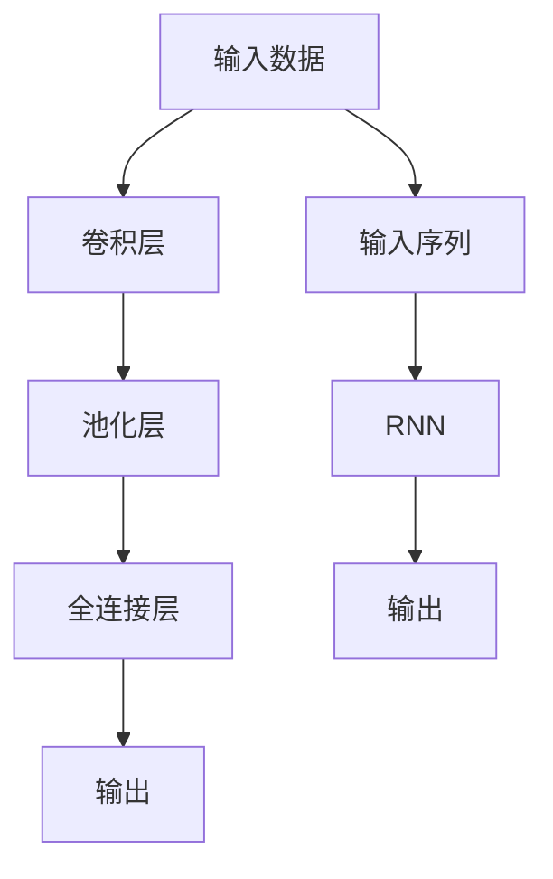

                 

关键词：人工智能、深度学习、未来趋势、技术发展、挑战与展望

> 摘要：本文将探讨人工智能领域当前的发展趋势，深度学习技术的进步，以及未来可能面临的技术挑战和机遇。通过分析现有技术的应用场景和潜在的发展方向，本文试图为读者提供一幅人工智能发展的蓝图，并展望其可能带来的深远影响。

## 1. 背景介绍

人工智能（AI）是计算机科学的一个分支，旨在开发能够执行需要人类智能的任务的算法和系统。自1950年代以来，人工智能经历了多个发展阶段，从最初的逻辑推理和知识表示，到最近的机器学习和深度学习技术，每一次突破都极大地扩展了AI的应用范围。

深度学习作为机器学习的一个重要分支，得益于大规模数据和高性能计算资源的支持，取得了惊人的成果。图像识别、自然语言处理、自动驾驶等领域都取得了显著进展。然而，随着技术的快速发展，人工智能的未来趋势也变得越来越复杂和多样化。

本文将首先回顾深度学习的发展历程，然后探讨当前的核心算法和理论，分析数学模型和公式，最后讨论实际应用场景、未来应用展望以及面临的挑战和机遇。

## 2. 核心概念与联系

### 2.1 深度学习的发展历程

深度学习的历史可以追溯到1986年，当Geoffrey Hinton首次提出了反向传播算法（Backpropagation），这是一种训练神经网络的有效方法。然而，由于计算资源的限制，深度学习在接下来的几十年里进展缓慢。

直到2012年，AlexNet在ImageNet比赛中取得了突破性的成绩，这标志着深度学习进入了新纪元。自那时以来，深度学习技术得到了迅速发展和广泛应用。

### 2.2 神经网络的基本原理

神经网络是模仿人脑结构和功能的计算模型。它由多层节点（称为神经元）组成，每层节点都与下一层节点相连接。通过前向传播和反向传播，神经网络可以从数据中学习特征，并进行分类、回归等任务。

### 2.3 卷积神经网络（CNN）与循环神经网络（RNN）

卷积神经网络（CNN）是用于图像识别和计算机视觉的常用模型。它利用卷积层提取图像的特征，并通过池化层降低计算复杂度。循环神经网络（RNN）则擅长处理序列数据，如文本和语音。

下面是一个简单的Mermaid流程图，展示了CNN和RNN的基本架构：



## 3. 核心算法原理 & 具体操作步骤

### 3.1 算法原理概述

深度学习算法的核心在于通过大量的数据训练神经网络，使其能够自动提取特征并完成任务。这个过程包括以下几个步骤：

1. **数据预处理**：将数据转换为神经网络可以处理的格式。
2. **前向传播**：输入数据通过神经网络，逐层计算输出。
3. **损失函数**：计算预测值与真实值之间的差异。
4. **反向传播**：通过梯度下降等优化算法更新网络权重。
5. **迭代训练**：重复上述过程，直到满足停止条件（如达到一定精度或迭代次数）。

### 3.2 算法步骤详解

1. **数据预处理**：
   - **标准化**：将输入数据缩放至特定范围，如[-1, 1]或[0, 1]。
   - **归一化**：根据数据特征进行特征缩放。
   - **数据增强**：通过旋转、翻转、裁剪等操作增加数据的多样性。

2. **前向传播**：
   - **激活函数**：如ReLU、Sigmoid、Tanh等，用于引入非线性。
   - **层间连接**：通过矩阵乘法实现层间传递。
   - **权重初始化**：如随机初始化、高斯分布初始化等。

3. **损失函数**：
   - **均方误差（MSE）**：常用于回归任务。
   - **交叉熵损失（Cross-Entropy Loss）**：常用于分类任务。

4. **反向传播**：
   - **计算梯度**：通过链式法则计算各层权重的梯度。
   - **梯度下降**：更新权重，减小损失函数。

5. **迭代训练**：
   - **批量训练**：每次迭代使用全部数据。
   - **小批量训练**：每次迭代使用部分数据。

### 3.3 算法优缺点

**优点**：
- **自动特征提取**：无需人工设计特征。
- **强大的学习能力**：能够处理复杂的数据模式。

**缺点**：
- **计算资源需求高**：需要大量的数据和计算资源。
- **过拟合问题**：可能导致模型泛化能力不足。

### 3.4 算法应用领域

- **计算机视觉**：图像识别、目标检测、图像生成。
- **自然语言处理**：文本分类、机器翻译、情感分析。
- **语音识别**：语音合成、语音识别。
- **推荐系统**：个性化推荐、商品推荐。
- **游戏AI**：围棋、国际象棋、自动驾驶游戏。

## 4. 数学模型和公式 & 详细讲解 & 举例说明

### 4.1 数学模型构建

深度学习中的数学模型主要包括以下几个部分：

1. **线性变换**：矩阵乘法实现。
2. **激活函数**：如ReLU、Sigmoid、Tanh等。
3. **损失函数**：如MSE、交叉熵损失等。
4. **优化算法**：如梯度下降、随机梯度下降等。

### 4.2 公式推导过程

以MSE损失函数为例，其公式为：

$$
MSE = \frac{1}{n}\sum_{i=1}^{n}(y_i - \hat{y}_i)^2
$$

其中，$y_i$ 为真实值，$\hat{y}_i$ 为预测值，$n$ 为样本数量。

### 4.3 案例分析与讲解

假设我们有一个简单的线性回归问题，目标是通过输入特征 $x$ 预测输出值 $y$。我们可以构建一个线性模型：

$$
\hat{y} = wx + b
$$

其中，$w$ 为权重，$b$ 为偏置。

通过训练数据，我们可以最小化MSE损失函数：

$$
J(w, b) = \frac{1}{n}\sum_{i=1}^{n}(y_i - wx_i - b)^2
$$

然后，通过梯度下降法更新权重和偏置：

$$
w = w - \alpha \frac{\partial J}{\partial w}
$$

$$
b = b - \alpha \frac{\partial J}{\partial b}
$$

其中，$\alpha$ 为学习率。

## 5. 项目实践：代码实例和详细解释说明

### 5.1 开发环境搭建

为了运行深度学习项目，我们需要安装以下工具：

- Python 3.6及以上版本
- TensorFlow 2.0及以上版本
- Jupyter Notebook 或 PyCharm

### 5.2 源代码详细实现

以下是一个简单的深度学习项目，使用TensorFlow实现一个线性回归模型：

```python
import tensorflow as tf

# 模型参数
w = tf.Variable(0.0, name="weights")
b = tf.Variable(0.0, name="biases")

# 输入和输出
x = tf.placeholder(tf.float32, shape=[1], name="x")
y = tf.placeholder(tf.float32, shape=[1], name="y")

# 线性模型
y_pred = w * x + b

# 损失函数
loss = tf.reduce_mean(tf.square(y - y_pred))

# 优化器
optimizer = tf.train.GradientDescentOptimizer(learning_rate=0.5)
train_op = optimizer.minimize(loss)

# 初始化全局变量
init = tf.global_variables_initializer()

# 训练数据
x_train = [1, 2, 3, 4]
y_train = [2, 4, 6, 8]

# 训练过程
with tf.Session() as sess:
    sess.run(init)
    for i in range(1000):
        sess.run(train_op, feed_dict={x: x_train, y: y_train})
        if i % 100 == 0:
            print("Step:", i, "Loss:", loss.eval(feed_dict={x: x_train, y: y_train}))

    # 测试
    print("Test:", sess.run(y_pred, feed_dict={x: [5]}))
```

### 5.3 代码解读与分析

上述代码实现了一个简单的线性回归模型，通过梯度下降法训练模型参数，以最小化损失函数。主要步骤如下：

1. **定义模型参数**：使用tf.Variable创建权重和偏置变量。
2. **定义输入和输出**：使用tf.placeholder定义输入和输出。
3. **构建模型**：通过线性组合实现预测。
4. **定义损失函数**：使用MSE损失函数计算预测值与真实值之间的差异。
5. **定义优化器**：使用tf.train.GradientDescentOptimizer创建优化器。
6. **初始化全局变量**：使用tf.global_variables_initializer初始化变量。
7. **训练过程**：通过迭代更新模型参数，并打印训练过程中的损失值。
8. **测试**：使用训练好的模型进行预测。

## 6. 实际应用场景

### 6.1 计算机视觉

计算机视觉是深度学习应用最为广泛的领域之一。从图像识别、目标检测到图像生成，深度学习模型在各种任务中都取得了显著成果。例如，人脸识别系统利用深度学习技术实现了高精度的身份验证。

### 6.2 自然语言处理

自然语言处理（NLP）是深度学习领域的另一个重要应用方向。从机器翻译、文本分类到情感分析，深度学习模型在NLP任务中展现出了强大的能力。例如，谷歌的神经网络翻译系统（GNMT）基于深度学习技术，实现了高质量的机器翻译。

### 6.3 语音识别

语音识别技术利用深度学习模型从语音信号中提取特征，并转换为文本。这种技术在智能助手、语音助手等领域具有广泛的应用。例如，苹果的Siri和亚马逊的Alexa都基于深度学习技术实现了语音识别功能。

### 6.4 自动驾驶

自动驾驶技术是深度学习在现实世界中的典型应用。通过深度学习模型，自动驾驶系统可以实时处理来自摄像头、雷达和激光雷达的数据，实现车辆的自我驾驶。例如，特斯拉的自动驾驶系统基于深度学习技术，实现了高级辅助驾驶功能。

## 7. 工具和资源推荐

### 7.1 学习资源推荐

1. **《深度学习》（Deep Learning）**：Goodfellow、Bengio和Courville合著的经典教材。
2. **吴恩达的深度学习课程**：通过Coursera平台提供的免费在线课程，适合初学者。
3. **TensorFlow官方文档**：提供详细的API文档和教程，适合开发者。

### 7.2 开发工具推荐

1. **TensorFlow**：Google开源的深度学习框架，广泛应用于各种深度学习项目。
2. **PyTorch**：Facebook开源的深度学习框架，提供灵活的动态计算图。
3. **Keras**：基于TensorFlow和PyTorch的高层API，简化了深度学习模型的搭建和训练。

### 7.3 相关论文推荐

1. **AlexNet：一种用于图像分类的深层卷积神经网络**：Alex Krizhevsky等，2012。
2. **深度神经网络中的Dropout**：Geoffrey Hinton等，2012。
3. **循环神经网络：序列建模和语言学习的新动力**：Yoshua Bengio等，1994。

## 8. 总结：未来发展趋势与挑战

### 8.1 研究成果总结

近年来，深度学习技术在计算机视觉、自然语言处理、语音识别等领域取得了显著成果。这些成果不仅推动了人工智能的发展，也为实际应用场景提供了强大的支持。

### 8.2 未来发展趋势

- **硬件加速**：随着计算能力的提升，深度学习模型的训练速度将进一步提高。
- **小样本学习**：减少对大规模数据集的依赖，实现更高效的学习方法。
- **多模态学习**：结合不同类型的数据（如文本、图像、语音），提高模型的泛化能力。
- **强化学习**：结合深度学习和强化学习，实现更智能的决策和规划。

### 8.3 面临的挑战

- **计算资源**：深度学习模型对计算资源的需求仍然很高，需要更多高效的算法和硬件支持。
- **数据隐私**：数据安全和隐私保护是深度学习应用的一个重要挑战。
- **模型可解释性**：深度学习模型的决策过程通常难以解释，需要开发更透明的方法。

### 8.4 研究展望

未来，深度学习技术将继续发展，并在更多领域实现突破。同时，如何解决现有的挑战，推动人工智能技术的发展，将是未来研究的重要方向。

## 9. 附录：常见问题与解答

### 9.1 什么是深度学习？

深度学习是机器学习的一个分支，通过多层神经网络自动提取特征，实现各种复杂的任务。

### 9.2 深度学习和传统机器学习的区别是什么？

传统机器学习依赖于手动设计的特征，而深度学习通过自动提取特征，减少了手动设计的工作量。

### 9.3 深度学习对计算资源的要求有多高？

深度学习模型通常需要大量的计算资源和数据集，随着模型复杂度的增加，对计算资源的要求也相应提高。

### 9.4 深度学习在哪些领域有广泛应用？

深度学习在计算机视觉、自然语言处理、语音识别、推荐系统等领域有广泛应用。

### 9.5 深度学习模型如何防止过拟合？

通过正则化、Dropout、数据增强等方法，可以减少过拟合的风险。

---

作者：禅与计算机程序设计艺术 / Zen and the Art of Computer Programming

本文旨在介绍人工智能领域的发展趋势，深度学习技术的原理和应用，以及未来可能面临的挑战和机遇。通过对现有技术的分析，我们看到了人工智能的巨大潜力和广阔前景。然而，随着技术的不断发展，我们还需要关注计算资源、数据隐私和模型可解释性等挑战。未来，深度学习技术将继续发展，并在更多领域实现突破，为人类带来更多的便利和创新。让我们一起期待人工智能的明天。

