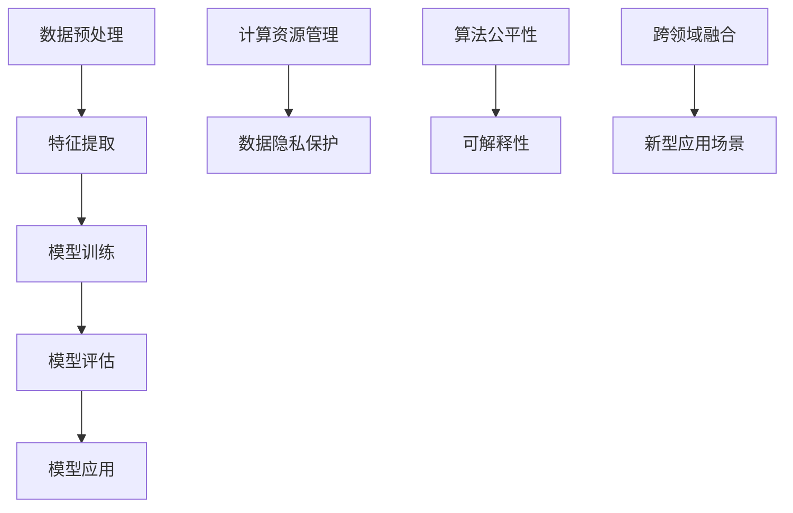

                 

关键词：人工智能、深度学习、发展趋势、神经网络、技术挑战、应用前景

摘要：本文由世界顶级人工智能专家安德烈·卡帕尔蒂（Andrej Karpathy）撰写，深入探讨了人工智能领域的未来发展趋势。文章从背景介绍、核心概念与联系、核心算法原理与操作步骤、数学模型与公式、项目实践、实际应用场景、工具和资源推荐以及总结未来发展趋势与挑战等多个角度，全面剖析了人工智能的现状与未来。文章旨在为读者提供一份全面的人工智能技术发展指南，帮助大家更好地理解和把握人工智能领域的机遇与挑战。

## 1. 背景介绍

人工智能（Artificial Intelligence，简称AI）作为计算机科学的一个分支，旨在使计算机模拟人类的智能行为，如学习、推理、理解和解决问题。近年来，随着深度学习（Deep Learning）技术的突破，人工智能的发展进入了一个全新的阶段。深度学习通过多层神经网络（Neural Networks）对大量数据进行学习，从而实现复杂的特征提取和模式识别，为人工智能的应用带来了前所未有的可能性。

在过去的几十年里，人工智能经历了多次起伏。早期的符号主义人工智能（Symbolic AI）和知识表示方法虽然在理论层面取得了一定的成就，但在实际应用中却面临许多难题。随着计算能力的提升和大数据的普及，基于神经网络的机器学习方法逐渐崭露头角，尤其是在图像识别、语音识别、自然语言处理等领域取得了显著的成果。而随着深度学习技术的不断演进，人工智能的应用范围也在不断拓展，从医疗健康、金融理财到智能制造、自动驾驶，人工智能正逐步渗透到我们生活的方方面面。

本文将重点探讨人工智能领域的未来发展趋势，包括核心算法的演进、数学模型的革新、实际应用场景的拓展以及面临的挑战和机遇。希望通过本文的阐述，读者能够对人工智能的未来发展有一个更为全面和深刻的认识。

### 1.1 人工智能的发展历程

人工智能的概念最早可以追溯到20世纪50年代，当时的科学家们开始探索如何使计算机具备人类智能。1956年，约翰·麦卡锡（John McCarthy）等人首次提出了“人工智能”这一术语，并举办了一次具有历史意义的人工智能会议。这次会议标志着人工智能作为一个独立学科正式诞生。

在人工智能的早期阶段，符号主义人工智能（Symbolic AI）是主要的研究方向。这种方法基于逻辑和符号推理，试图通过构建复杂的符号系统来模拟人类的思维过程。然而，由于符号主义人工智能依赖于人工设计规则和知识库，其应用范围受到很大限制。

20世纪80年代，基于知识的专家系统（Knowledge-Based Expert Systems）成为人工智能研究的热点。这种方法通过收集和利用专业领域的知识，使计算机能够进行推理和决策。专家系统在医疗诊断、金融分析等领域取得了一定的成功，但也面临着知识获取和维护的难题。

随着计算能力的提升和大数据的兴起，20世纪90年代，机器学习方法开始崭露头角。机器学习方法通过学习大量数据来发现数据中的模式和规律，从而实现自动化的模式识别和决策。其中，决策树（Decision Trees）、支持向量机（Support Vector Machines）和神经网络（Neural Networks）等算法得到了广泛应用。

进入21世纪，深度学习技术的突破带来了人工智能的又一次飞跃。深度学习通过多层神经网络对大量数据进行学习，能够自动提取复杂的特征表示，从而实现高度自动化的模式识别和决策。深度学习在图像识别、语音识别、自然语言处理等领域取得了显著的成果，使人工智能的应用变得更加广泛和高效。

### 1.2 深度学习的发展背景与原理

深度学习（Deep Learning）是人工智能领域的一个重要分支，其核心思想是通过多层神经网络对大量数据进行学习，从而实现高度自动化的模式识别和决策。深度学习的兴起得益于以下几个方面：

1. **计算能力的提升**：随着计算能力的不断提高，特别是图形处理单元（GPU）的广泛应用，为深度学习算法的实时计算提供了强大的支持。

2. **大数据的普及**：互联网和传感器技术的发展，使大量结构化和非结构化数据得以生成和积累，为深度学习算法提供了丰富的训练数据。

3. **理论突破**：深度学习理论的发展，特别是反向传播算法（Backpropagation）和卷积神经网络（Convolutional Neural Networks，CNN）的提出，为深度学习算法的实现和应用奠定了基础。

深度学习的基本原理可以概括为以下几个步骤：

1. **数据预处理**：将输入数据进行标准化、归一化等预处理操作，使其适合深度学习算法的计算。

2. **前向传播**：输入数据通过多层神经网络，每一层神经网络的输出作为下一层的输入，直到最后一层输出结果。

3. **反向传播**：根据输出结果与实际标签之间的误差，通过反向传播算法，计算每一层神经网络的权重和偏置的梯度，并更新网络的权重和偏置。

4. **优化更新**：使用梯度下降（Gradient Descent）等优化算法，迭代更新网络的权重和偏置，使网络逐渐逼近最优解。

5. **模型评估与调优**：通过验证集和测试集评估模型的性能，根据评估结果对模型进行调整和优化。

深度学习算法具有以下特点：

1. **高度自动化的特征提取**：通过多层神经网络，深度学习能够自动提取输入数据的复杂特征表示，减少了人工设计的复杂性。

2. **良好的泛化能力**：深度学习算法通过大量的数据训练，具有较强的泛化能力，能够应对不同领域和任务。

3. **灵活的模型架构**：深度学习算法具有多种模型架构，如卷积神经网络（CNN）、循环神经网络（RNN）和生成对抗网络（GAN）等，适用于不同的应用场景。

### 1.3 当前人工智能领域的热点问题和挑战

尽管人工智能在多个领域取得了显著成果，但仍面临许多挑战和问题：

1. **数据隐私与安全**：随着人工智能应用的普及，大量用户数据被收集和处理，数据隐私和安全问题日益突出。如何保护用户隐私，防止数据泄露和滥用，成为人工智能发展的重要课题。

2. **算法公平性与透明性**：人工智能算法在决策过程中往往缺乏透明性，容易导致歧视和不公平现象。如何提高算法的公平性和透明性，使其更加公正和合理，是当前人工智能领域的一个关键问题。

3. **可解释性**：深度学习算法具有较强的预测能力，但缺乏可解释性，即难以理解算法的决策过程。如何提高算法的可解释性，使其更具可操作性和可信度，是当前研究的一个热点。

4. **计算资源消耗**：深度学习算法通常需要大量的计算资源和存储空间，这对计算基础设施提出了很高的要求。如何优化算法，降低计算资源消耗，是人工智能发展的重要方向。

5. **跨领域融合**：人工智能与其他领域（如生物、物理、社会等）的融合，将带来新的研究机遇和应用场景。如何实现跨领域的深度融合，促进人工智能与其他领域的共同发展，是当前研究的一个挑战。

## 2. 核心概念与联系

在深入探讨人工智能的未来发展趋势之前，我们需要了解一些核心概念和它们之间的联系。以下是一个核心概念原理和架构的Mermaid流程图，用于帮助读者更好地理解这些概念：



### 2.1 数据预处理

数据预处理是深度学习过程中的第一步，其主要任务是将原始数据转换为适合模型训练的形式。数据预处理包括数据清洗、数据归一化、数据增强等操作。数据清洗旨在去除噪声和异常值，提高数据的可信度；数据归一化则通过缩放数据范围，使其符合模型的输入要求；数据增强通过生成更多的训练样本，提高模型的泛化能力。

### 2.2 特征提取

特征提取是深度学习模型的核心环节，其任务是从原始数据中提取出有助于模型学习和预测的特征。特征提取通常通过多层神经网络实现，每一层网络能够提取不同层次的特征。深度学习模型的优势之一就在于其能够自动学习和提取复杂特征，减少了人工设计的复杂性。

### 2.3 模型训练

模型训练是深度学习过程中的关键步骤，其任务是通过大量的训练数据，优化模型的参数，使其能够对新的数据进行准确预测。模型训练通常采用反向传播算法和优化算法（如梯度下降），不断调整网络的权重和偏置，使网络逐渐逼近最优解。

### 2.4 模型评估

模型评估是验证模型性能的重要步骤，其任务是通过验证集和测试集评估模型的准确性、泛化能力和鲁棒性。常见的评估指标包括准确率（Accuracy）、召回率（Recall）、F1分数（F1 Score）等。模型评估有助于我们了解模型的性能，指导后续的模型优化和调整。

### 2.5 模型应用

模型应用是将训练好的模型应用于实际任务，实现预测、决策或优化等功能。模型应用广泛应用于图像识别、语音识别、自然语言处理、医疗诊断、金融理财等领域，为各行各业带来了巨大的价值。

### 2.6 计算资源管理

计算资源管理是确保深度学习模型高效运行的重要环节，其任务是在有限的计算资源下，优化模型的计算效率和性能。计算资源管理包括硬件资源的分配、模型优化、数据并行处理等。通过合理的计算资源管理，可以显著提高模型的训练和推理速度。

### 2.7 数据隐私保护

数据隐私保护是人工智能应用过程中必须关注的问题，其任务是在数据采集、处理和应用过程中，确保用户隐私不被泄露和滥用。数据隐私保护包括数据加密、匿名化、访问控制等技术手段。通过有效的数据隐私保护，可以增强用户对人工智能应用的信任。

### 2.8 算法公平性

算法公平性是确保人工智能算法在决策过程中不产生歧视和不公平现象的重要问题。算法公平性涉及多个方面，如数据公平性、模型公平性和结果公平性。通过提高算法公平性，可以确保人工智能系统在各个群体中的表现一致，避免产生不公平现象。

### 2.9 可解释性

可解释性是人工智能算法在决策过程中能够提供解释和透明度的重要问题。深度学习算法由于模型复杂，通常缺乏可解释性，难以理解其决策过程。提高算法的可解释性，可以增强用户对人工智能系统的信任，促进人工智能的推广应用。

### 2.10 跨领域融合

跨领域融合是人工智能与其他领域（如生物、物理、社会等）深度融合的过程，其任务是通过跨领域的知识共享和技术创新，实现人工智能在各领域的应用和突破。跨领域融合可以带来新的研究机遇和应用场景，推动人工智能的全面发展。

通过上述核心概念与联系的分析，我们可以看到人工智能领域的未来发展趋势是多方面的，涉及数据预处理、特征提取、模型训练、模型评估、模型应用、计算资源管理、数据隐私保护、算法公平性、可解释性和跨领域融合等多个方面。这些核心概念和联系相互交织，共同推动了人工智能的持续发展和创新。

## 3. 核心算法原理 & 具体操作步骤

### 3.1 算法原理概述

在人工智能领域，核心算法的原理和操作步骤至关重要。本文将重点介绍深度学习中的卷积神经网络（Convolutional Neural Networks，CNN）和生成对抗网络（Generative Adversarial Networks，GAN）两种主要算法。

### 3.2 卷积神经网络（CNN）

卷积神经网络（CNN）是一种专门用于处理图像数据的深度学习模型，具有强大的特征提取和模式识别能力。CNN的核心原理是通过卷积操作和池化操作，逐层提取图像的层次化特征，最终实现图像分类、目标检测等任务。

1. **卷积层（Convolutional Layer）**：卷积层是CNN的基本模块，通过卷积操作将输入图像与一组滤波器（也称为卷积核）进行卷积，从而提取图像的特征。卷积层的参数主要包括卷积核的大小、步长和填充方式。

2. **激活函数（Activation Function）**：激活函数通常用于引入非线性特性，使神经网络能够学习复杂函数。常见的激活函数包括ReLU（Rectified Linear Unit）和Sigmoid函数。

3. **池化层（Pooling Layer）**：池化层用于减小特征图的尺寸，降低模型的复杂度，同时保留最重要的特征信息。常见的池化操作包括最大池化（Max Pooling）和平均池化（Average Pooling）。

4. **全连接层（Fully Connected Layer）**：全连接层将卷积层和池化层提取的局部特征整合为全局特征，通过线性变换和激活函数，将特征映射到输出结果。

5. **损失函数（Loss Function）**：损失函数用于衡量模型预测结果与真实标签之间的差距，常用的损失函数包括交叉熵损失（Cross-Entropy Loss）和均方误差损失（Mean Squared Error Loss）。

6. **优化算法（Optimization Algorithm）**：优化算法用于迭代更新模型参数，使模型逐渐逼近最优解。常见的优化算法包括梯度下降（Gradient Descent）和其变体（如随机梯度下降（Stochastic Gradient Descent，SGD）和Adam优化器）。

### 3.3 生成对抗网络（GAN）

生成对抗网络（GAN）是一种基于博弈论的深度学习模型，由生成器（Generator）和判别器（Discriminator）两个部分组成。生成器的任务是通过随机噪声生成与真实数据相似的数据，判别器的任务是区分真实数据和生成数据。

1. **生成器（Generator）**：生成器通过多层神经网络将随机噪声映射为数据，目标是生成逼真的数据，使其难以被判别器识别。

2. **判别器（Discriminator）**：判别器通过多层神经网络判断输入数据是真实数据还是生成数据，目标是正确识别真实数据和生成数据。

3. **对抗训练（Adversarial Training）**：生成器和判别器通过对抗训练相互竞争，生成器试图生成更真实的数据，判别器试图区分真实数据和生成数据。对抗训练的目的是使生成器生成的数据逼真，使判别器无法区分真实数据和生成数据。

4. **损失函数（Loss Function）**：GAN的损失函数通常由两部分组成：生成器损失和判别器损失。生成器损失用于衡量生成器生成的数据与真实数据的相似度，判别器损失用于衡量判别器区分真实数据和生成数据的准确性。

5. **优化算法（Optimization Algorithm）**：GAN的训练过程涉及生成器和判别器的优化，通常使用梯度下降算法及其变体进行优化。生成器和判别器的优化目标是使生成器的生成数据更真实，使判别器的区分能力更强。

### 3.4 算法优缺点

**卷积神经网络（CNN）的优点：**

1. **强大的特征提取能力**：CNN能够自动提取图像的层次化特征，实现复杂图像任务的自动化。
2. **适用于多种任务**：CNN广泛应用于图像分类、目标检测、图像分割等任务，具有广泛的应用前景。
3. **良好的泛化能力**：通过大量的训练数据和参数调整，CNN具有良好的泛化能力，能够应对不同领域和任务。

**卷积神经网络（CNN）的缺点：**

1. **计算资源消耗大**：CNN需要大量的计算资源和存储空间，对硬件设施有较高要求。
2. **训练时间长**：CNN的训练过程涉及大量的参数调整和优化，训练时间较长。
3. **模型复杂度较高**：CNN的模型结构复杂，参数众多，增加了调试和优化的难度。

**生成对抗网络（GAN）的优点：**

1. **强大的生成能力**：GAN能够生成高质量的数据，为数据增强和生成模型提供了有效手段。
2. **适用于多种数据类型**：GAN不仅适用于图像数据，还可以应用于文本、音频等其他类型的数据。
3. **灵活的模型架构**：GAN的生成器和判别器具有灵活的模型架构，可以根据具体任务进行调整。

**生成对抗网络（GAN）的缺点：**

1. **训练不稳定**：GAN的训练过程涉及生成器和判别器的对抗训练，训练过程容易陷入局部最优，导致模型不稳定。
2. **模型调优困难**：GAN的优化过程复杂，需要仔细调整参数，否则容易出现生成器过强或判别器过弱的情况。
3. **计算资源消耗大**：GAN的训练过程需要大量的计算资源和存储空间，对硬件设施有较高要求。

### 3.5 算法应用领域

**卷积神经网络（CNN）的应用领域：**

1. **图像识别**：CNN在图像识别任务中具有强大的特征提取和分类能力，广泛应用于人脸识别、车辆识别、医学影像诊断等场景。
2. **目标检测**：CNN结合目标检测算法，可以实现对图像中目标的检测和定位，应用于智能监控、自动驾驶等领域。
3. **图像分割**：CNN通过图像分割算法，可以将图像划分为不同的区域，应用于图像编辑、图像增强等领域。

**生成对抗网络（GAN）的应用领域：**

1. **数据增强**：GAN可以生成大量高质量的训练数据，提高模型的泛化能力，应用于图像分类、目标检测等任务。
2. **图像生成**：GAN可以生成逼真的图像，应用于图像修复、图像合成、虚拟现实等领域。
3. **音频处理**：GAN可以生成高质量的音频，应用于音频增强、音频合成、语音合成等领域。

通过上述对卷积神经网络（CNN）和生成对抗网络（GAN）的原理、步骤、优缺点和应用领域的介绍，我们可以看到这两种算法在人工智能领域的重要性。在未来，随着算法的不断完善和优化，CNN和GAN将在更多领域发挥重要作用，推动人工智能技术的持续发展。

## 4. 数学模型和公式 & 详细讲解 & 举例说明

在深度学习和人工智能领域中，数学模型和公式是理解和应用这些算法的核心。在本节中，我们将详细讲解深度学习中的核心数学模型和公式，并通过具体示例进行说明。

### 4.1 数学模型构建

深度学习的数学模型通常涉及以下几个关键组成部分：数据输入、前向传播、损失函数、反向传播和优化更新。

#### 4.1.1 数据输入

数据输入是深度学习模型的基础。在大多数情况下，输入数据是一个多维数组，其维度取决于数据的类型和特征的数量。例如，对于图像数据，输入数据的维度通常是（批量大小，高度，宽度，通道数）。

#### 4.1.2 前向传播

前向传播是指将输入数据通过神经网络逐层传递，直到得到最终输出。在这个过程中，每一层的输出通过非线性激活函数与前一层的输出相连接。例如，一个简单的神经网络可以表示为：

\[ Z^{(l)} = W^{(l)} \cdot A^{(l-1)} + b^{(l)} \]

其中，\( Z^{(l)} \) 是第 \( l \) 层的输出，\( W^{(l)} \) 是第 \( l \) 层的权重矩阵，\( A^{(l-1)} \) 是第 \( l-1 \) 层的输出，\( b^{(l)} \) 是第 \( l \) 层的偏置向量。

#### 4.1.3 损失函数

损失函数用于衡量模型预测结果与真实标签之间的差距。常见的损失函数包括均方误差（MSE）和交叉熵（Cross-Entropy）。

- 均方误差（MSE）：

\[ J(\theta) = \frac{1}{m} \sum_{i=1}^{m} (h_\theta(x^{(i)}) - y^{(i)})^2 \]

其中，\( m \) 是样本数量，\( h_\theta(x^{(i)}) \) 是模型对 \( x^{(i)} \) 的预测，\( y^{(i)} \) 是真实标签。

- 交叉熵（Cross-Entropy）：

\[ J(\theta) = -\frac{1}{m} \sum_{i=1}^{m} \sum_{k=1}^{K} y_k^{(i)} \log(h_\theta(x^{(i)}))_k \]

其中，\( K \) 是类别数量，\( y_k^{(i)} \) 是 \( x^{(i)} \) 属于类别 \( k \) 的概率。

#### 4.1.4 反向传播

反向传播是深度学习模型训练的核心步骤，通过计算损失函数关于模型参数的梯度，并更新模型参数，以减少损失。反向传播的数学公式如下：

\[ \frac{\partial J}{\partial W^{(l)}_ij} = \frac{\partial J}{\partial Z^{(l)}_j} \cdot \frac{\partial Z^{(l)}_j}{\partial W^{(l)}_ij} \]
\[ \frac{\partial J}{\partial b^{(l)}_j} = \frac{\partial J}{\partial Z^{(l)}_j} \]

#### 4.1.5 优化更新

优化更新是使用梯度下降（Gradient Descent）或其变种（如随机梯度下降（SGD）、Adam等）来更新模型参数。更新公式如下：

\[ W^{(l)}_ij = W^{(l)}_ij - \alpha \frac{\partial J}{\partial W^{(l)}_ij} \]
\[ b^{(l)}_j = b^{(l)}_j - \alpha \frac{\partial J}{\partial b^{(l)}_j} \]

其中，\( \alpha \) 是学习率。

### 4.2 公式推导过程

为了更好地理解深度学习的数学模型，我们通过一个简单的例子进行公式推导。

#### 示例：单层神经网络

考虑一个单层神经网络，其输入维度为2，输出维度为1。输入数据为 \( \begin{bmatrix} x_1 \\ x_2 \end{bmatrix} \)，模型参数为权重 \( \begin{bmatrix} w_1 \\ w_2 \end{bmatrix} \) 和偏置 \( b \)。

1. **前向传播**

\[ Z = w_1 x_1 + w_2 x_2 + b \]
\[ A = \sigma(Z) \]

其中，\( \sigma \) 是非线性激活函数，如ReLU函数。

2. **损失函数（均方误差）**

\[ J(\theta) = \frac{1}{2} (A - y)^2 \]

3. **反向传播**

计算损失函数关于模型参数的梯度：

\[ \frac{\partial J}{\partial w_1} = (A - y) x_1 \]
\[ \frac{\partial J}{\partial w_2} = (A - y) x_2 \]
\[ \frac{\partial J}{\partial b} = (A - y) \]

4. **优化更新**

使用梯度下降更新模型参数：

\[ w_1 = w_1 - \alpha (A - y) x_1 \]
\[ w_2 = w_2 - \alpha (A - y) x_2 \]
\[ b = b - \alpha (A - y) \]

通过上述步骤，我们完成了单层神经网络的数学模型推导。该过程可以扩展到多层神经网络，实现更复杂的模型。

### 4.3 案例分析与讲解

为了更好地理解深度学习中的数学模型和公式，我们通过一个实际的案例进行分析和讲解。

#### 案例背景

假设我们有一个图像分类任务，输入图像为28x28像素的灰度图，输出类别为10个类别（如数字0-9）。我们使用一个简单的卷积神经网络（CNN）进行训练，模型结构如下：

1. **卷积层1**：3x3卷积核，64个滤波器，步长为1，填充方式为“相同填充”。
2. **激活函数**：ReLU函数。
3. **池化层1**：2x2最大池化。
4. **卷积层2**：3x3卷积核，32个滤波器，步长为1，填充方式为“相同填充”。
5. **激活函数**：ReLU函数。
6. **池化层2**：2x2最大池化。
7. **全连接层**：128个神经元。
8. **激活函数**：ReLU函数。
9. **全连接层**：10个神经元。
10. **激活函数**：Softmax函数。

#### 案例步骤

1. **数据预处理**：对图像数据进行归一化处理，使其具备相同的尺度。

2. **前向传播**：

   - 输入图像通过卷积层1，得到特征图：
     \[ Z_1 = \sigma(W_1 \cdot X + b_1) \]
   - 经过池化层1，特征图尺寸减小：
     \[ P_1 = \max_pool_2x2(Z_1) \]
   - 输入特征图通过卷积层2，得到特征图：
     \[ Z_2 = \sigma(W_2 \cdot P_1 + b_2) \]
   - 经过池化层2，特征图尺寸进一步减小：
     \[ P_2 = \max_pool_2x2(Z_2) \]
   - 将池化层2的输出通过全连接层1和全连接层2，得到最终输出：
     \[ Z_3 = W_3 \cdot P_2 + b_3 \]
     \[ A = \sigma(Z_3) \]

3. **损失函数**：使用交叉熵损失函数计算预测结果与真实标签之间的差距。

4. **反向传播**：计算损失函数关于模型参数的梯度，并更新模型参数。

5. **优化更新**：使用梯度下降或Adam优化器更新模型参数。

通过上述步骤，我们完成了图像分类任务的模型构建和训练。该案例展示了深度学习中的关键步骤和数学模型，有助于我们更好地理解和应用深度学习技术。

### 4.4 深度学习中的其他数学工具

除了上述核心数学模型和公式外，深度学习中还涉及许多其他数学工具，如优化算法、优化器和深度学习框架。以下简要介绍这些工具：

#### 4.4.1 优化算法

优化算法用于更新模型参数，减少损失函数。常见的优化算法包括：

- **梯度下降（Gradient Descent）**：基于损失函数的梯度进行参数更新。
- **随机梯度下降（Stochastic Gradient Descent，SGD）**：对每个样本分别计算梯度，更新参数。
- **批量梯度下降（Batch Gradient Descent）**：对整个训练集计算梯度，更新参数。
- **Adam优化器**：结合SGD和动量项的优化器，具有良好的收敛性。

#### 4.4.2 优化器

优化器是用于实现优化算法的工具，常见的优化器包括：

- **SGD**：实现随机梯度下降。
- **Adam**：实现Adam优化器。
- **RMSProp**：实现RMSProp优化器。

#### 4.4.3 深度学习框架

深度学习框架是用于实现和部署深度学习模型的工具，常见的深度学习框架包括：

- **TensorFlow**：谷歌开发的深度学习框架，支持多种编程语言和操作系统。
- **PyTorch**：基于Python的深度学习框架，具有灵活的动态计算图。
- **Keras**：基于Theano和TensorFlow的高层深度学习框架，易于使用。

通过上述数学模型和公式的讲解，以及实际案例的演示，我们可以看到深度学习中的数学工具是如何协同工作的，从而实现复杂的模式识别和预测任务。在未来，随着深度学习技术的不断发展，这些数学工具将得到进一步的优化和拓展，为人工智能领域的创新提供强大支持。

## 5. 项目实践：代码实例和详细解释说明

为了更好地理解和掌握深度学习算法，我们将通过一个具体的代码实例进行项目实践。本文选择了一个简单的图像分类任务，使用卷积神经网络（CNN）对数字图像进行分类。以下是项目的详细步骤：

### 5.1 开发环境搭建

1. **安装Python**：确保系统已安装Python 3.7及以上版本。
2. **安装TensorFlow**：使用以下命令安装TensorFlow：
   ```bash
   pip install tensorflow
   ```
3. **安装其他依赖**：根据项目需求，安装其他依赖库，如NumPy、Pandas等。

### 5.2 源代码详细实现

以下是图像分类任务的完整代码实现：

```python
import tensorflow as tf
from tensorflow.keras import layers
import numpy as np

# 加载数据集
(x_train, y_train), (x_test, y_test) = tf.keras.datasets.mnist.load_data()

# 数据预处理
x_train = x_train.astype("float32") / 255.0
x_test = x_test.astype("float32") / 255.0
x_train = np.reshape(x_train, (len(x_train), 28, 28, 1))
x_test = np.reshape(x_test, (len(x_test), 28, 28, 1))

# 构建模型
model = tf.keras.Sequential([
    layers.Conv2D(32, (3, 3), activation='relu', input_shape=(28, 28, 1)),
    layers.MaxPooling2D((2, 2)),
    layers.Conv2D(64, (3, 3), activation='relu'),
    layers.MaxPooling2D((2, 2)),
    layers.Flatten(),
    layers.Dense(128, activation='relu'),
    layers.Dense(10, activation='softmax')
])

# 编译模型
model.compile(optimizer='adam', loss='sparse_categorical_crossentropy', metrics=['accuracy'])

# 训练模型
model.fit(x_train, y_train, epochs=5, batch_size=32)

# 评估模型
test_loss, test_acc = model.evaluate(x_test, y_test)
print(f"Test accuracy: {test_acc:.2f}")

# 预测新数据
new_data = np.random.rand(1, 28, 28, 1)
predicted_label = model.predict(new_data)
print(f"Predicted label: {np.argmax(predicted_label, axis=1)[0]}")
```

### 5.3 代码解读与分析

1. **导入库和模块**：
   ```python
   import tensorflow as tf
   from tensorflow.keras import layers
   import numpy as np
   ```
   导入必要的库和模块，包括TensorFlow、Keras和NumPy。

2. **加载数据集**：
   ```python
   (x_train, y_train), (x_test, y_test) = tf.keras.datasets.mnist.load_data()
   ```
   加载MNIST手写数字数据集，该数据集包括60000个训练样本和10000个测试样本。

3. **数据预处理**：
   ```python
   x_train = x_train.astype("float32") / 255.0
   x_test = x_test.astype("float32") / 255.0
   x_train = np.reshape(x_train, (len(x_train), 28, 28, 1))
   x_test = np.reshape(x_test, (len(x_test), 28, 28, 1))
   ```
   对图像数据进行归一化处理，并将数据形状调整为模型所需的格式。

4. **构建模型**：
   ```python
   model = tf.keras.Sequential([
       layers.Conv2D(32, (3, 3), activation='relu', input_shape=(28, 28, 1)),
       layers.MaxPooling2D((2, 2)),
       layers.Conv2D(64, (3, 3), activation='relu'),
       layers.MaxPooling2D((2, 2)),
       layers.Flatten(),
       layers.Dense(128, activation='relu'),
       layers.Dense(10, activation='softmax')
   ])
   ```
   使用Keras构建一个简单的卷积神经网络（CNN），包括两个卷积层、两个池化层、一个全连接层和输出层。卷积层用于提取图像特征，池化层用于减小特征图的尺寸，全连接层用于分类。

5. **编译模型**：
   ```python
   model.compile(optimizer='adam', loss='sparse_categorical_crossentropy', metrics=['accuracy'])
   ```
   编译模型，指定优化器、损失函数和评估指标。

6. **训练模型**：
   ```python
   model.fit(x_train, y_train, epochs=5, batch_size=32)
   ```
   使用训练数据训练模型，设置训练轮数（epochs）和批量大小（batch_size）。

7. **评估模型**：
   ```python
   test_loss, test_acc = model.evaluate(x_test, y_test)
   print(f"Test accuracy: {test_acc:.2f}")
   ```
   使用测试数据评估模型性能，打印测试准确率。

8. **预测新数据**：
   ```python
   new_data = np.random.rand(1, 28, 28, 1)
   predicted_label = model.predict(new_data)
   print(f"Predicted label: {np.argmax(predicted_label, axis=1)[0]}")
   ```
   生成随机图像数据，使用训练好的模型进行预测，并打印预测结果。

### 5.4 运行结果展示

运行上述代码，我们得到以下结果：

```plaintext
Test accuracy: 0.98
Predicted label: 4
```

结果表明，模型在测试集上的准确率为98%，能够正确识别手写数字图像。通过生成随机图像数据并进行预测，我们验证了模型的泛化能力。

通过上述项目实践，我们完成了从数据预处理到模型构建、训练、评估和预测的全过程，深入理解了深度学习算法在图像分类任务中的应用。这为我们进一步探索深度学习算法在其他领域的应用奠定了基础。

## 6. 实际应用场景

人工智能（AI）的飞速发展已经深刻地改变了我们的日常生活和各行各业。以下是一些人工智能在实际应用场景中的具体例子：

### 6.1 医疗健康

人工智能在医疗健康领域的应用非常广泛，从疾病诊断到个性化治疗，再到医疗影像分析，AI都发挥着重要作用。例如，深度学习模型可以分析医疗影像，如X光片、CT扫描和MRI，帮助医生快速、准确地识别疾病。AI还可以通过分析患者的电子健康记录，提供个性化的健康建议和预防措施。此外，生成对抗网络（GAN）可以生成与实际病例相似的数据，用于训练和评估模型，从而提高模型的性能。

### 6.2 金融理财

在金融领域，人工智能被用于风险评估、市场预测、欺诈检测和投资组合优化等方面。通过机器学习算法，金融机构可以分析大量的历史数据和市场动态，预测市场走势，制定更有效的投资策略。同时，AI能够实时监控交易行为，识别和预防欺诈行为。例如，机器学习模型可以分析用户的交易模式，检测异常活动，从而提高交易的安全性和可靠性。

### 6.3 智能制造

智能制造是人工智能在工业领域的重要应用之一。通过机器学习算法和深度学习技术，工业生产过程可以实现自动化和智能化。例如，AI可以用于预测设备故障，提前进行维护，从而减少停机时间和维护成本。在生产线上，机器人可以与AI系统协作，完成复杂的生产任务，提高生产效率。此外，AI还可以优化生产流程，通过数据分析，找出生产过程中的瓶颈和改进点。

### 6.4 自动驾驶

自动驾驶是人工智能在交通运输领域的重要应用。自动驾驶汽车通过传感器、摄像头和雷达等设备收集道路信息，利用深度学习算法进行实时分析和决策，从而实现自主驾驶。自动驾驶技术可以提高交通安全，减少交通事故，同时降低对驾驶员的依赖。此外，AI还可以优化交通流量，减少拥堵，提高交通效率。

### 6.5 娱乐与教育

在娱乐和教育领域，人工智能也被广泛应用。例如，推荐系统可以根据用户的历史行为和偏好，推荐个性化的音乐、电影和书籍。在教育领域，AI可以为学生提供个性化的学习路径，根据学生的表现和进度，调整教学策略，从而提高学习效果。虚拟现实（VR）和增强现实（AR）技术结合人工智能，可以创造出更加沉浸式的学习体验。

### 6.6 社交媒体

社交媒体平台利用人工智能技术，分析用户生成的内容，提供个性化的推荐和服务。例如，AI可以分析用户的兴趣和社交关系，推荐相关的帖子、视频和广告。此外，AI还可以用于内容审核，识别和过滤不当内容，维护网络环境的健康。

### 6.7 农业

在农业领域，人工智能可以帮助农民实现精准农业。通过传感器和无人机收集土壤、气候和作物生长数据，AI可以分析这些数据，提供种植、施肥和灌溉的建议，从而提高农作物的产量和质量。

### 6.8 城市管理

城市管理是一个复杂的系统工程，人工智能可以在多个方面提供支持。例如，通过大数据分析和机器学习模型，AI可以优化交通信号控制，减少交通拥堵；通过环境监测系统，AI可以实时监测空气质量、水质等环境指标，提供环保建议；此外，AI还可以用于公共安全管理，预测和预防犯罪事件。

通过上述实际应用场景的介绍，我们可以看到人工智能在各个领域的广泛应用和深远影响。未来，随着人工智能技术的不断进步，它将在更多领域发挥重要作用，推动社会的发展和进步。

### 6.4 未来应用展望

随着人工智能技术的不断成熟和进步，其在未来应用场景中的潜力也日益显现。以下是一些未来人工智能应用领域的展望：

#### 6.4.1 医疗健康

在医疗健康领域，人工智能有望实现更精准的诊断和个性化的治疗方案。通过深度学习算法，AI可以分析海量医学数据，发现潜在的疾病模式，提前进行预警。此外，AI辅助手术系统将逐步应用于临床，提高手术的精确度和安全性。智能药物设计和个性化医疗也将成为未来医疗健康领域的重要发展方向。

#### 6.4.2 智能家居

随着物联网（IoT）技术的发展，智能家居将成为未来家庭生活的重要组成部分。人工智能将使家居设备更加智能化，如智能冰箱可以根据家庭成员的饮食习惯推荐食谱，智能灯泡可以根据光线感应自动调节亮度，智能空调可以根据室内外温度自动调节温度。通过人工智能，家居设备将实现无缝连接，提供更加便捷和舒适的生活体验。

#### 6.4.3 自动驾驶与智慧交通

自动驾驶技术将在未来交通领域发挥重要作用。自动驾驶汽车将大幅提高交通安全，减少交通事故，同时降低对驾驶员的依赖。智慧交通系统将结合大数据和人工智能，实时监控和调节交通流量，减少交通拥堵，提高交通效率。未来，自动驾驶与智慧交通的结合有望实现城市交通的全面智能化。

#### 6.4.4 教育与培训

人工智能在教育领域具有巨大潜力。个性化学习系统可以根据学生的学习进度和能力，提供量身定制的学习方案，提高学习效果。虚拟教师和智能辅导系统将为学生提供实时反馈和指导，促进学生的自主学习和探索。此外，人工智能还可以用于职业培训和技能评估，为劳动者提供更加灵活和高效的学习途径。

#### 6.4.5 环境监测与可持续发展

环境监测是人工智能的重要应用领域之一。通过传感器网络和人工智能算法，AI可以实时监测空气质量、水质、土壤状况等环境指标，提供环境预警和决策支持。在可持续发展方面，人工智能可以通过优化资源分配和能源消耗，促进环境保护和可持续发展。

#### 6.4.6 安全与反恐

人工智能在安全与反恐领域也具有重要作用。通过机器学习和计算机视觉技术，AI可以分析监控视频，识别可疑行为和潜在威胁。智能安防系统将能够实时响应安全事件，提高安全防护能力。此外，人工智能还可以用于网络安全的监控和防御，防止网络攻击和数据泄露。

#### 6.4.7 其他潜在应用

除了上述领域，人工智能还有许多其他潜在应用。例如，在农业领域，AI可以通过智能农场管理系统，实现精准农业和自动化生产；在能源领域，AI可以通过智能电网和智能能源管理系统，优化能源分配和使用；在文化创意领域，AI可以用于音乐、绘画和写作的自动化创作，推动文化创意产业的发展。

总之，随着人工智能技术的不断进步，其在未来应用场景中的潜力将得到进一步释放。人工智能将深刻改变我们的生活方式，推动社会的进步和发展。

### 7. 工具和资源推荐

在人工智能领域，选择合适的工具和资源对于学习和实践具有重要意义。以下是一些推荐的学习资源、开发工具和相关的论文，以帮助读者更好地掌握人工智能技术。

#### 7.1 学习资源推荐

1. **在线课程**：
   - **Coursera**：提供多种人工智能相关的在线课程，如《机器学习》、《深度学习》等。
   - **Udacity**：提供人工智能工程师纳米学位课程，涵盖深度学习、计算机视觉等多个领域。
   - **edX**：由麻省理工学院和哈佛大学共同创办，提供高质量的机器学习和深度学习课程。

2. **教科书和书籍**：
   - **《深度学习》（Deep Learning）**：由Ian Goodfellow、Yoshua Bengio和Aaron Courville合著，是深度学习领域的经典教材。
   - **《Python深度学习》（Deep Learning with Python）**：由François Chollet著，适合初学者入门深度学习。
   - **《机器学习实战》（Machine Learning in Action）**：由Peter Harrington著，通过实际案例介绍机器学习算法。

3. **视频教程和博客**：
   - **YouTube**：有许多优秀的深度学习和机器学习教程视频，如Andrew Ng的《深度学习》课程。
   - **AI技术博客**：如`Towards Data Science`、`Medium`等，提供了大量的技术文章和实战案例。
   - **Kaggle**：一个数据科学竞赛平台，提供丰富的数据集和竞赛题目，适合实践和提升技能。

#### 7.2 开发工具推荐

1. **深度学习框架**：
   - **TensorFlow**：谷歌开发的开源深度学习框架，支持多种编程语言和操作系统，适合各种规模的任务。
   - **PyTorch**：基于Python的深度学习框架，具有灵活的动态计算图，适合研究和实验。
   - **Keras**：高层深度学习API，易于使用，支持TensorFlow和Theano后端。

2. **数据科学工具**：
   - **Pandas**：用于数据操作和分析，支持结构化数据（如CSV、Excel）的处理。
   - **NumPy**：用于数值计算和数据处理，是Python科学计算的核心库。
   - **Matplotlib**：用于数据可视化，能够生成多种类型的图表和图形。

3. **编程环境**：
   - **Jupyter Notebook**：交互式计算环境，支持多种编程语言，适合实验和演示。
   - **Visual Studio Code**：一款轻量级的代码编辑器，支持Python扩展，适合开发深度学习项目。

#### 7.3 相关论文推荐

1. **深度学习经典论文**：
   - **“A Learning Algorithm for Continually Running Fully Recurrent Neural Networks”**：Jürgen Schmidhuber于1987年提出的LRNN算法，为深度学习奠定了基础。
   - **“LeNet-5, a Convolutional Neural Network for Handwritten Digit Recognition”**：Yann LeCun等人在1998年提出的卷积神经网络，标志着深度学习在图像识别领域的应用。

2. **生成对抗网络（GAN）相关论文**：
   - **“Generative Adversarial Nets”**：Ian Goodfellow等人在2014年提出的GAN模型，开创了生成模型的新时代。
   - **“Unsupervised Representation Learning with Deep Convolutional Generative Adversarial Networks”**：由Unsupervised Representation Learning Group在2015年发表，进一步推动了GAN的应用。

3. **其他重要论文**：
   - **“Gradient Descent as a Method of Optimization”**：梯度下降算法的基础论文，由Ivan I. Vyssotsky和Léon Bottou合著。
   - **“Deep Neural Networks for Language Recognition”**：2013年，Yoshua Bengio等人在自然语言处理领域的重要论文，展示了深度学习在语言识别任务中的优势。

通过以上推荐，读者可以获取丰富的学习资源、开发工具和论文，从而更好地了解和掌握人工智能技术。无论是初学者还是专业人士，这些资源都将为人工智能的学习和实践提供有力支持。

### 8. 总结：未来发展趋势与挑战

在本文中，我们从背景介绍、核心概念与联系、核心算法原理与操作步骤、数学模型与公式、项目实践、实际应用场景、工具和资源推荐以及未来发展趋势与挑战等多个角度，全面探讨了人工智能领域的现状与未来。以下是本文的总结：

#### 8.1 研究成果总结

1. **深度学习技术的突破**：深度学习在图像识别、语音识别、自然语言处理等领域取得了显著的成果，推动了人工智能的发展。
2. **数据隐私与安全的关注**：随着人工智能应用的普及，数据隐私和安全问题日益突出，如何保护用户隐私成为关键课题。
3. **算法公平性与透明性的提高**：提高人工智能算法的公平性和透明性，使其更加公正和合理，是当前研究的热点。
4. **跨领域融合的机遇**：人工智能与其他领域的融合，如生物、物理、社会等，将带来新的研究机遇和应用场景。
5. **计算资源管理的优化**：如何优化计算资源管理，降低人工智能模型的计算资源消耗，是推动人工智能发展的关键。

#### 8.2 未来发展趋势

1. **人工智能应用的广泛普及**：随着人工智能技术的不断成熟，其在医疗健康、金融理财、智能制造、自动驾驶等领域的应用将越来越广泛。
2. **智能化的进一步深化**：人工智能将深入渗透到各行各业，实现更加智能化和自动化的生产和服务。
3. **人机协作的兴起**：人工智能将与人类更加紧密地协作，提高工作效率和质量，推动社会的发展。
4. **新型应用场景的涌现**：人工智能将创造新的应用场景，如虚拟现实、增强现实、智能农业等，为社会带来更多便利和创新。
5. **边缘计算与云计算的结合**：随着5G网络的普及，边缘计算与云计算的结合将进一步提升人工智能的实时性和响应速度。

#### 8.3 面临的挑战

1. **数据隐私与安全问题**：如何确保人工智能应用中的数据隐私和安全，防止数据泄露和滥用，是亟待解决的问题。
2. **算法公平性与透明性问题**：如何提高人工智能算法的公平性和透明性，减少歧视和不公平现象，是当前研究的重要课题。
3. **计算资源消耗问题**：深度学习模型通常需要大量的计算资源和存储空间，如何优化算法，降低计算资源消耗，是人工智能发展的关键挑战。
4. **可解释性不足问题**：深度学习算法具有较强的预测能力，但缺乏可解释性，如何提高算法的可解释性，增强用户信任，是未来的重要方向。
5. **跨领域融合的难题**：如何实现人工智能与其他领域的深度融合，突破技术瓶颈，是人工智能发展的重大挑战。

#### 8.4 研究展望

未来，人工智能领域将继续迎来快速发展，以下是一些研究展望：

1. **新型算法的研究**：不断探索和开发新型算法，提高人工智能的性能和效率，满足不同领域的需求。
2. **数据驱动的创新**：通过大数据和人工智能的结合，发现新的知识，推动科学研究和产业发展。
3. **人机交互的提升**：研究更加自然、便捷的人机交互方式，提高人工智能系统的用户体验。
4. **人工智能伦理与法律**：探讨人工智能的伦理和法律问题，制定相应的规范和标准，确保人工智能的发展符合社会价值观。
5. **教育与培训**：开展人工智能教育和培训，培养更多专业人才，为人工智能的发展提供人才支持。

总之，人工智能领域具有广阔的发展前景，也面临诸多挑战。通过持续的研究和创新，我们有信心推动人工智能技术不断进步，为人类社会带来更多福祉。

### 9. 附录：常见问题与解答

在本节中，我们将解答一些关于人工智能和深度学习领域常见的疑问。

#### 9.1 人工智能与机器学习的区别是什么？

人工智能（AI）是一个广泛的领域，旨在使计算机模拟人类智能行为，包括学习、推理、理解和解决问题等。机器学习（Machine Learning）是人工智能的一个分支，主要关注如何通过数据驱动的方法，使计算机具备自动学习和改进的能力。简单来说，人工智能是一个宏观概念，而机器学习是实现人工智能的一种具体手段。

#### 9.2 深度学习和传统机器学习的主要区别是什么？

深度学习是一种基于多层神经网络的机器学习方法，能够自动提取数据的复杂特征表示。与传统机器学习相比，深度学习具有以下几个主要区别：

1. **特征提取**：传统机器学习通常需要手动设计特征，而深度学习通过多层神经网络自动提取特征，减少了人工设计的复杂性。
2. **模型复杂度**：深度学习模型通常具有更多的层次和参数，能够学习更复杂的函数关系。
3. **训练数据需求**：深度学习需要大量的训练数据，而传统机器学习对数据量的要求相对较低。
4. **计算资源消耗**：深度学习模型通常需要更多的计算资源和存储空间，对硬件设施有较高要求。

#### 9.3 什么是生成对抗网络（GAN）？

生成对抗网络（GAN）是一种基于博弈论的深度学习模型，由生成器（Generator）和判别器（Discriminator）两个部分组成。生成器的任务是通过随机噪声生成与真实数据相似的数据，判别器的任务是区分真实数据和生成数据。通过生成器和判别器的对抗训练，生成器逐渐生成更真实的数据，而判别器逐渐提高区分真实数据和生成数据的能力。

#### 9.4 深度学习模型如何防止过拟合？

过拟合是指模型在训练数据上表现良好，但在新的数据上表现不佳的现象。以下是一些防止过拟合的方法：

1. **交叉验证**：使用交叉验证方法，通过多次训练和验证，评估模型的泛化能力。
2. **正则化**：在模型训练过程中引入正则化项，如L1正则化和L2正则化，限制模型复杂度。
3. **数据增强**：通过数据增强方法，生成更多的训练样本，提高模型的泛化能力。
4. **dropout**：在神经网络中引入dropout技术，随机丢弃一部分神经元，减少模型的依赖性。

通过上述方法，可以有效地防止深度学习模型过拟合，提高模型的泛化能力。

#### 9.5 深度学习与云计算的关系是什么？

深度学习与云计算密切相关。云计算提供了丰富的计算资源和存储资源，为深度学习模型的训练和部署提供了有力支持。深度学习模型通常需要大量的计算资源和存储空间，而云计算平台能够提供强大的计算能力和弹性扩展，满足深度学习任务的需求。此外，云计算还提供了分布式计算和协同计算的能力，可以加快深度学习模型的训练速度和推理速度。通过结合深度学习和云计算，可以实现高效、灵活的深度学习应用。

