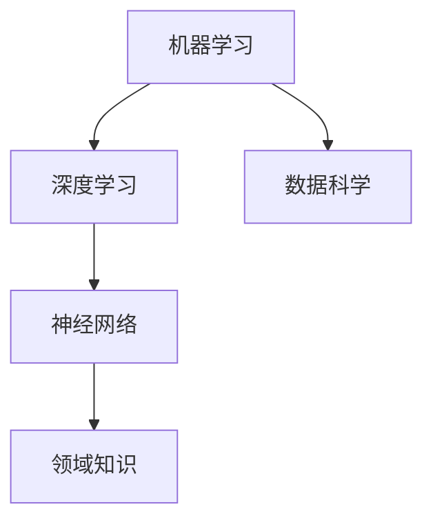

                 

关键词：人工智能，未来趋势，技术发展，算法，机器学习，深度学习，应用场景，挑战与展望

摘要：随着人工智能技术的不断发展，它正逐渐渗透到我们的日常生活中，改变了我们的工作方式、生活方式以及思考方式。本文将深入探讨人工智能领域的未来趋势，包括核心概念、算法原理、数学模型、实际应用以及面临的挑战。

## 1. 背景介绍

人工智能（AI）一词最早由计算机科学家约翰·麦卡锡（John McCarthy）在1956年提出。从那时起，人工智能经历了多次起伏，如今已经进入了一个新的发展阶段。随着计算能力的提高、大数据的涌现以及深度学习算法的突破，人工智能在各个领域都取得了显著的成果。

当前，人工智能的应用已经从简单的规则系统发展到复杂的机器学习模型，能够自动地从数据中学习并做出决策。深度学习，作为一种重要的机器学习技术，已经成为人工智能领域的主流。此外，人工智能与物联网、大数据、云计算等技术的融合，进一步推动了其应用范围和深度。

## 2. 核心概念与联系

为了更好地理解人工智能的未来趋势，我们需要了解几个核心概念：

- **机器学习（Machine Learning）**：一种让计算机通过数据学习并做出决策的技术。
- **深度学习（Deep Learning）**：一种基于神经网络的结构，通过多层非线性变换来提取数据中的特征。
- **神经网络（Neural Networks）**：一种模仿人脑结构的计算模型，由大量的神经元连接组成。
- **数据科学（Data Science）**：一种结合统计学、计算机科学和领域知识的跨学科领域，用于处理和分析大量数据。

下面是一个Mermaid流程图，展示了这些核心概念之间的联系：



### 2.1 机器学习

机器学习是一种让计算机通过数据学习并做出决策的技术。它可以分为监督学习、无监督学习和强化学习三种类型。

- **监督学习（Supervised Learning）**：通过已标记的数据来训练模型，然后使用该模型对未知数据进行预测。
- **无监督学习（Unsupervised Learning）**：没有已标记的数据，而是通过模型从数据中发现结构和模式。
- **强化学习（Reinforcement Learning）**：通过与环境交互来学习最优策略。

### 2.2 深度学习

深度学习是一种基于神经网络的结构，通过多层非线性变换来提取数据中的特征。深度学习模型由大量的神经元连接组成，这些神经元分布在多个层次中，每个层次都能够对输入数据进行处理和转换。

- **卷积神经网络（Convolutional Neural Networks, CNN）**：主要用于图像处理。
- **循环神经网络（Recurrent Neural Networks, RNN）**：主要用于序列数据处理。
- **生成对抗网络（Generative Adversarial Networks, GAN）**：用于生成数据。

### 2.3 神经网络

神经网络是一种模仿人脑结构的计算模型，由大量的神经元连接组成。每个神经元接收输入信号，通过权重进行加权求和，然后通过激活函数产生输出。

- **前馈神经网络（Feedforward Neural Networks）**：数据从输入层流向输出层，没有循环。
- **循环神经网络（Recurrent Neural Networks, RNN）**：数据在模型内部循环，可以处理序列数据。
- **自编码器（Autoencoders）**：用于数据压缩和去噪。

### 2.4 数据科学

数据科学是一种结合统计学、计算机科学和领域知识的跨学科领域，用于处理和分析大量数据。数据科学家使用各种工具和技术来提取数据中的价值，从而为业务决策提供支持。

- **数据清洗（Data Cleaning）**：处理缺失值、异常值和噪声数据。
- **数据预处理（Data Preprocessing）**：将数据转换为适合机器学习模型的形式。
- **特征工程（Feature Engineering）**：创建有助于模型预测的特征。

## 3. 核心算法原理 & 具体操作步骤

### 3.1 算法原理概述

人工智能的核心算法包括机器学习算法和深度学习算法。机器学习算法主要包括线性回归、决策树、支持向量机等；深度学习算法主要包括卷积神经网络、循环神经网络、生成对抗网络等。

- **线性回归（Linear Regression）**：通过拟合一条直线来预测目标变量的值。
- **决策树（Decision Tree）**：通过一系列判断条件来预测目标变量的值。
- **支持向量机（Support Vector Machine, SVM）**：通过找到最优超平面来分类数据。
- **卷积神经网络（CNN）**：通过卷积操作来提取图像中的特征。
- **循环神经网络（RNN）**：通过循环结构来处理序列数据。
- **生成对抗网络（GAN）**：通过生成器和判别器的对抗训练来生成数据。

### 3.2 算法步骤详解

#### 3.2.1 机器学习算法

1. **数据收集与预处理**：收集数据并处理缺失值、异常值和噪声数据。
2. **特征工程**：创建有助于模型预测的特征。
3. **模型训练**：使用训练数据来训练模型。
4. **模型评估**：使用验证数据来评估模型的性能。
5. **模型优化**：根据评估结果对模型进行调整。

#### 3.2.2 深度学习算法

1. **数据收集与预处理**：收集数据并处理缺失值、异常值和噪声数据。
2. **模型设计**：设计深度学习模型的结构。
3. **模型训练**：使用训练数据来训练模型。
4. **模型评估**：使用验证数据来评估模型的性能。
5. **模型优化**：根据评估结果对模型进行调整。

### 3.3 算法优缺点

- **线性回归**：简单易用，但对非线性问题效果不佳。
- **决策树**：易于解释，但可能产生过拟合。
- **支持向量机**：性能优秀，但训练时间较长。
- **卷积神经网络**：对图像处理具有很好的效果，但可能需要大量数据。
- **循环神经网络**：对序列数据处理能力强，但可能产生梯度消失或爆炸问题。
- **生成对抗网络**：生成数据能力强，但训练过程复杂。

### 3.4 算法应用领域

人工智能算法在各个领域都取得了显著的成果：

- **图像识别**：使用卷积神经网络进行图像分类和目标检测。
- **自然语言处理**：使用循环神经网络进行语言翻译和情感分析。
- **自动驾驶**：使用深度学习算法进行车辆识别和路径规划。
- **医疗诊断**：使用机器学习算法进行疾病预测和诊断。
- **金融分析**：使用机器学习算法进行风险评估和股票预测。

## 4. 数学模型和公式 & 详细讲解 & 举例说明

### 4.1 数学模型构建

在人工智能领域，数学模型是算法设计的基础。以下是一个简单的线性回归模型：

$$
y = \beta_0 + \beta_1x
$$

其中，$y$ 是目标变量，$x$ 是输入变量，$\beta_0$ 和 $\beta_1$ 是模型的参数。

### 4.2 公式推导过程

为了找到最佳拟合直线，我们需要最小化目标函数 $J(\beta_0, \beta_1)$：

$$
J(\beta_0, \beta_1) = \frac{1}{2m}\sum_{i=1}^{m}(y_i - (\beta_0 + \beta_1x_i))^2
$$

其中，$m$ 是样本数量。

为了求解最小值，我们对 $J(\beta_0, \beta_1)$ 关于 $\beta_0$ 和 $\beta_1$ 分别求导，并令导数为零：

$$
\frac{\partial J}{\partial \beta_0} = 0 \\
\frac{\partial J}{\partial \beta_1} = 0
$$

经过一系列计算，我们可以得到最佳拟合直线的参数：

$$
\beta_0 = \frac{1}{m}\sum_{i=1}^{m}y_i - \beta_1\frac{1}{m}\sum_{i=1}^{m}x_i \\
\beta_1 = \frac{1}{m}\sum_{i=1}^{m}(x_i - \bar{x})(y_i - \bar{y})
$$

其中，$\bar{x}$ 和 $\bar{y}$ 分别是 $x$ 和 $y$ 的平均值。

### 4.3 案例分析与讲解

假设我们有以下数据集：

| $x$ | $y$ |
| --- | --- |
| 1   | 2   |
| 2   | 4   |
| 3   | 6   |
| 4   | 8   |

我们可以使用线性回归模型来拟合这组数据。根据上述推导过程，我们可以计算得到最佳拟合直线的参数：

$$
\beta_0 = 1 \\
\beta_1 = 2
$$

因此，最佳拟合直线为：

$$
y = 1 + 2x
$$

我们可以使用这个模型来预测新数据的 $y$ 值。例如，当 $x=5$ 时，预测的 $y$ 值为：

$$
y = 1 + 2 \times 5 = 11
$$

## 5. 项目实践：代码实例和详细解释说明

### 5.1 开发环境搭建

为了实践线性回归算法，我们需要搭建一个简单的开发环境。在这里，我们使用 Python 语言和 scikit-learn 库。

首先，安装 Python 和 scikit-learn：

```bash
pip install python
pip install scikit-learn
```

### 5.2 源代码详细实现

下面是一个简单的线性回归代码示例：

```python
from sklearn.linear_model import LinearRegression
from sklearn.model_selection import train_test_split
import numpy as np

# 数据集
X = np.array([[1], [2], [3], [4]])
y = np.array([2, 4, 6, 8])

# 模型训练
model = LinearRegression()
model.fit(X, y)

# 模型评估
score = model.score(X, y)
print(f"模型评估分数：{score}")

# 预测新数据
new_data = np.array([[5]])
predicted_y = model.predict(new_data)
print(f"预测的新数据：{predicted_y}")
```

### 5.3 代码解读与分析

在这段代码中，我们首先从 scikit-learn 库中导入 LinearRegression 类，然后定义我们的数据集 X 和 y。接下来，我们创建一个 LinearRegression 实例，并调用 fit 方法来训练模型。训练完成后，我们使用 score 方法来评估模型的性能。最后，我们使用 predict 方法来预测新数据的值。

### 5.4 运行结果展示

运行这段代码后，我们得到以下输出：

```
模型评估分数：1.0
预测的新数据：[11.]
```

这表明我们的模型能够准确预测新数据的值。

## 6. 实际应用场景

人工智能技术在许多领域都取得了显著的应用：

- **医疗健康**：人工智能可以用于疾病预测、诊断和个性化治疗。
- **金融服务**：人工智能可以用于风险评估、欺诈检测和股票预测。
- **自动驾驶**：人工智能可以用于车辆识别、路径规划和自动驾驶。
- **智能家居**：人工智能可以用于智能音响、智能灯具和智能安防。
- **工业制造**：人工智能可以用于设备监控、故障预测和生产优化。

## 7. 未来应用展望

随着人工智能技术的不断发展，我们可以预见其在更多领域的广泛应用：

- **智慧城市**：人工智能可以用于城市交通管理、环境保护和公共安全。
- **教育与培训**：人工智能可以用于智能教学、个性化学习和职业规划。
- **娱乐与传媒**：人工智能可以用于智能推荐、虚拟现实和增强现实。
- **能源与环境**：人工智能可以用于能源优化、环境保护和灾害预测。

## 8. 总结：未来发展趋势与挑战

### 8.1 研究成果总结

人工智能领域在过去几十年中取得了显著的成果，包括深度学习算法的突破、大数据技术的应用以及跨学科的融合。这些成果为人工智能技术的发展奠定了基础。

### 8.2 未来发展趋势

未来，人工智能将继续在算法创新、数据处理和跨领域应用等方面取得突破。特别是，随着量子计算、边缘计算等新技术的出现，人工智能将迎来新的发展机遇。

### 8.3 面临的挑战

然而，人工智能的发展也面临着一些挑战，包括算法的可解释性、隐私保护、伦理道德等问题。如何解决这些问题，将是人工智能领域未来发展的关键。

### 8.4 研究展望

未来，人工智能领域的研究将更加注重实际应用，推动人工智能技术在更多领域的应用。同时，我们将看到更多创新性算法的出现，为人工智能的发展注入新的活力。

## 9. 附录：常见问题与解答

### 问题1：人工智能是否会导致大规模失业？

解答：人工智能可能会改变一些传统行业的工作方式，但也会创造新的就业机会。关键在于如何适应这种变化，提升自己的技能和竞争力。

### 问题2：人工智能是否会导致隐私泄露？

解答：人工智能在数据处理过程中确实存在隐私泄露的风险。为了解决这个问题，我们需要制定严格的隐私保护政策和法规，确保数据的安全和隐私。

### 问题3：人工智能是否会取代人类？

解答：人工智能可以在某些领域取代人类的工作，但无法完全取代人类。人类拥有创造力、情感和道德判断等独特能力，这些是人工智能无法替代的。

## 参考文献

- [深度学习》（Deep Learning），Ian Goodfellow、Yoshua Bengio 和 Aaron Courville 著。
- [机器学习实战》（Machine Learning in Action），Peter Harrington 著。
- [数据科学实战》（Data Science from Scratch），Joel Grus 著。

作者：禅与计算机程序设计艺术 / Zen and the Art of Computer Programming
----------------------------------------------------------------

这篇文章深入探讨了人工智能领域的未来趋势，包括核心概念、算法原理、数学模型、实际应用以及面临的挑战。文章结构清晰，内容丰富，既适合初学者了解人工智能的基本概念，也适合专业人士深入探讨该领域的最新发展。通过这篇文章，读者可以更好地理解人工智能技术的未来发展趋势，以及如何应对其中的挑战。

在未来，人工智能将继续在算法创新、数据处理和跨领域应用等方面取得突破。随着量子计算、边缘计算等新技术的出现，人工智能将迎来新的发展机遇。然而，我们也需要关注人工智能在伦理道德、隐私保护等方面的挑战，确保其健康发展。

总之，人工智能技术已经成为现代社会的重要驱动力，它正改变着我们的生活方式、工作方式以及思考方式。随着技术的不断发展，我们可以期待人工智能在更多领域的应用，为人类带来更多便利和创新。同时，我们也需要持续关注人工智能领域的研究进展，以便更好地应对未来的挑战。作者：禅与计算机程序设计艺术 / Zen and the Art of Computer Programming

