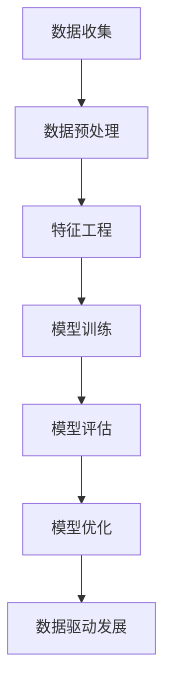

                 

关键词：数据驱动发展、机器学习、人工智能、数据质量、数据科学、数据处理、模型训练、算法优化

> 在当今快速发展的技术时代，数据的重要性不容忽视。本文将深入探讨数据在人工智能领域中的核心作用，解析如何通过高效的数据处理和科学的方法提升机器学习模型的性能，并展望未来数据驱动的发展趋势。

## 1. 背景介绍

随着互联网、物联网和传感器技术的飞速发展，数据已经成为这个时代最为宝贵的资源。在人工智能（AI）和机器学习（ML）领域，数据更是不可或缺的核心要素。无论是训练深度学习模型，还是实现智能推荐、自然语言处理（NLP）等应用，数据的质量和数量都直接决定了模型的性能。

Andrej Karpathy是一位世界著名的计算机科学家，以其在深度学习领域的杰出贡献而闻名。他在多个知名科技公司工作过，包括Google和OpenAI，并发表了多篇在AI领域有重要影响的研究论文。在本文中，我们将结合Andrej Karpathy的研究成果，探讨数据在人工智能中的关键作用。

## 2. 核心概念与联系

### 2.1 数据的重要性

数据是机器学习模型的基础，没有足够且高质量的数据，模型的性能就无法得到保障。数据不仅包括训练数据，还包括测试数据和验证数据。一个优秀的机器学习模型需要在大规模、多样化的数据集上进行训练，以便更好地泛化到新的数据上。

### 2.2 数据质量

数据质量是数据驱动发展的关键。低质量的数据会引入噪声，导致模型性能下降。数据质量包括数据完整性、准确性、一致性和时效性。确保数据质量是数据科学领域的重要任务。

### 2.3 数据处理

数据处理是数据驱动发展的必要步骤。包括数据清洗、数据集成、数据转换和数据降维等。通过有效的数据处理，可以提升数据质量，为模型训练提供更好的基础。

### 2.4 数据科学方法

数据科学方法是将数据转化为知识的过程。包括数据收集、数据预处理、特征工程、模型训练、模型评估和模型优化等。数据科学方法是实现数据驱动发展的核心。

下面是核心概念与联系的Mermaid流程图：



## 3. 核心算法原理 & 具体操作步骤

### 3.1 算法原理概述

在机器学习中，算法原理主要包括以下几个步骤：

1. **数据收集**：从各种渠道收集数据，包括公开数据集、私有数据集和实时数据等。
2. **数据预处理**：清洗、去噪、归一化等，以提升数据质量。
3. **特征工程**：从原始数据中提取有用的特征，以优化模型性能。
4. **模型训练**：使用训练数据训练模型，调整模型的参数。
5. **模型评估**：使用验证数据评估模型性能，确定模型是否满足预期。
6. **模型优化**：根据评估结果调整模型参数，提升模型性能。

### 3.2 算法步骤详解

#### 3.2.1 数据收集

数据收集是机器学习的第一步，也是至关重要的一步。以下是数据收集的一些方法：

- **公开数据集**：如Kaggle、UCI机器学习库等。
- **私有数据集**：企业内部数据、社交媒体数据等。
- **实时数据**：传感器数据、交易数据等。

#### 3.2.2 数据预处理

数据预处理是提升数据质量的关键步骤。主要包括以下操作：

- **数据清洗**：去除重复数据、缺失数据、异常数据等。
- **去噪**：降低数据中的噪声，提高数据质量。
- **归一化**：将数据转换为相同的尺度，便于模型处理。

#### 3.2.3 特征工程

特征工程是从原始数据中提取有用特征的过程，对模型性能有重要影响。主要包括以下方法：

- **特征选择**：选择对模型有重要影响的特征。
- **特征转换**：如类别转换、归一化等。
- **特征构造**：通过组合现有特征，构建新的特征。

#### 3.2.4 模型训练

模型训练是机器学习的核心步骤。常用的模型包括神经网络、决策树、支持向量机等。模型训练的过程包括以下几个阶段：

1. **初始化模型参数**。
2. **前向传播**：计算输入数据通过模型后的输出。
3. **计算损失函数**：评估模型输出的误差。
4. **反向传播**：更新模型参数，减小误差。
5. **迭代训练**：重复上述过程，直到模型达到预期性能。

#### 3.2.5 模型评估

模型评估是验证模型性能的重要步骤。常用的评估指标包括准确率、召回率、F1分数等。通过模型评估，可以确定模型是否满足预期。

#### 3.2.6 模型优化

模型优化是提升模型性能的关键步骤。主要包括以下方法：

- **参数调整**：调整模型参数，如学习率、正则化参数等。
- **超参数优化**：选择最优的超参数组合。
- **模型集成**：结合多个模型，提高整体性能。

### 3.3 算法优缺点

**优点**：

- **高效性**：机器学习算法可以自动从大量数据中学习规律，提高处理效率。
- **泛化能力**：机器学习模型可以应用于各种场景，具有良好的泛化能力。
- **可扩展性**：机器学习模型可以轻松扩展到新任务和新数据集。

**缺点**：

- **数据依赖性**：机器学习模型的性能高度依赖于数据质量，数据质量问题会导致模型性能下降。
- **计算资源消耗**：训练大型机器学习模型需要大量的计算资源。
- **解释性不足**：机器学习模型通常缺乏透明性，难以解释其决策过程。

### 3.4 算法应用领域

机器学习算法在各个领域都有广泛应用，包括：

- **图像识别**：如人脸识别、物体检测等。
- **自然语言处理**：如情感分析、机器翻译等。
- **推荐系统**：如商品推荐、音乐推荐等。
- **金融风控**：如信用评估、欺诈检测等。
- **医疗诊断**：如疾病预测、药物研发等。

## 4. 数学模型和公式 & 详细讲解 & 举例说明

### 4.1 数学模型构建

在机器学习中，常用的数学模型包括线性模型、逻辑回归、支持向量机（SVM）、神经网络等。下面以线性模型为例进行介绍。

线性模型是一种简单的机器学习模型，其数学公式如下：

$$
y = \beta_0 + \beta_1x_1 + \beta_2x_2 + \ldots + \beta_nx_n
$$

其中，$y$ 是输出变量，$x_1, x_2, \ldots, x_n$ 是输入变量，$\beta_0, \beta_1, \beta_2, \ldots, \beta_n$ 是模型的参数。

### 4.2 公式推导过程

线性模型的公式推导过程如下：

1. **设定损失函数**：

   常用的损失函数是均方误差（MSE）：

   $$
   J(\theta) = \frac{1}{2m}\sum_{i=1}^{m}(h_\theta(x^{(i)}) - y^{(i)})^2
   $$

   其中，$h_\theta(x)$ 是模型的预测值，$y^{(i)}$ 是实际值，$m$ 是样本数量。

2. **求导**：

   对损失函数求导，得到：

   $$
   \frac{\partial J(\theta)}{\partial \theta_j} = \frac{1}{m}\sum_{i=1}^{m}(h_\theta(x^{(i)}) - y^{(i)})x_j^{(i)}
   $$

3. **梯度下降**：

   更新模型参数：

   $$
   \theta_j := \theta_j - \alpha \frac{\partial J(\theta)}{\partial \theta_j}
   $$

   其中，$\alpha$ 是学习率。

### 4.3 案例分析与讲解

假设我们有一个简单的线性回归问题，目标是预测房价。数据集包含房屋面积（$x$）和房价（$y$）。

1. **数据预处理**：

   - 去除异常值。
   - 标准化数据。

2. **特征工程**：

   - 无需特征工程。

3. **模型训练**：

   - 使用线性模型进行训练。
   - 使用均方误差作为损失函数。
   - 使用梯度下降进行优化。

4. **模型评估**：

   - 使用测试集进行评估。
   - 计算均方误差。

5. **模型优化**：

   - 调整学习率。
   - 选择最优的超参数。

## 5. 项目实践：代码实例和详细解释说明

### 5.1 开发环境搭建

- 安装Python环境。
- 安装必要的库，如NumPy、Scikit-learn、Matplotlib等。

### 5.2 源代码详细实现

```python
import numpy as np
import matplotlib.pyplot as plt
from sklearn.linear_model import LinearRegression
from sklearn.model_selection import train_test_split
from sklearn.metrics import mean_squared_error

# 数据预处理
def preprocess_data(X, y):
    X = (X - X.mean()) / X.std()
    y = (y - y.mean()) / y.std()
    return X, y

# 模型训练
def train_model(X, y):
    model = LinearRegression()
    model.fit(X, y)
    return model

# 模型评估
def evaluate_model(model, X_test, y_test):
    y_pred = model.predict(X_test)
    mse = mean_squared_error(y_test, y_pred)
    return mse

# 加载数据
X, y = load_data()

# 预处理数据
X, y = preprocess_data(X, y)

# 划分训练集和测试集
X_train, X_test, y_train, y_test = train_test_split(X, y, test_size=0.2, random_state=42)

# 训练模型
model = train_model(X_train, y_train)

# 评估模型
mse = evaluate_model(model, X_test, y_test)
print("Mean Squared Error:", mse)

# 可视化结果
plt.scatter(X_test[:, 0], y_test, color='r', label='Actual')
plt.plot(X_test[:, 0], model.predict(X_test), color='b', label='Predicted')
plt.xlabel('Area')
plt.ylabel('Price')
plt.legend()
plt.show()
```

### 5.3 代码解读与分析

上述代码实现了一个简单的线性回归模型，包括数据预处理、模型训练、模型评估和结果可视化等步骤。

- **数据预处理**：通过标准化数据，将数据转换为相同的尺度，便于模型处理。
- **模型训练**：使用线性回归模型进行训练，调整模型的参数。
- **模型评估**：使用测试集评估模型性能，计算均方误差。
- **结果可视化**：将测试集的实际情况与模型预测结果进行可视化，便于分析模型性能。

## 6. 实际应用场景

数据在人工智能领域具有广泛的应用场景，以下是一些实际应用场景的介绍：

### 6.1 图像识别

图像识别是数据驱动的典型应用场景。通过大规模图像数据集训练深度学习模型，可以实现人脸识别、物体检测、图像分类等功能。例如，人脸识别技术已经被广泛应用于安防监控、手机解锁等场景。

### 6.2 自然语言处理

自然语言处理（NLP）是另一个重要的数据驱动领域。通过大规模文本数据集训练模型，可以实现文本分类、情感分析、机器翻译等功能。例如，智能客服系统可以使用NLP技术实现与用户的自然对话，提高用户体验。

### 6.3 推荐系统

推荐系统是数据驱动的核心应用之一。通过分析用户行为数据，推荐系统可以提供个性化的推荐结果，如商品推荐、音乐推荐等。例如，淘宝、网易云等平台都会利用推荐系统为用户推荐感兴趣的商品或音乐。

### 6.4 金融风控

金融风控是数据驱动的关键应用场景之一。通过分析交易数据、用户行为数据等，可以识别潜在的欺诈行为，降低金融风险。例如，银行可以使用数据风控技术识别信用卡欺诈行为，提高风险控制能力。

## 7. 未来应用展望

随着数据技术的不断发展和应用场景的不断拓展，数据驱动的发展趋势将更加明显。以下是一些未来应用展望：

### 7.1 数据隐私保护

随着数据隐私问题日益突出，未来将出现更多关于数据隐私保护的技术和法规。例如，联邦学习（Federated Learning）就是一种保护数据隐私的技术，可以在不泄露用户数据的情况下进行模型训练。

### 7.2 数据质量提升

数据质量是数据驱动的关键，未来将出现更多关于数据质量提升的技术和方法。例如，自动数据清洗技术可以自动识别和修复数据中的错误和异常。

### 7.3 数据治理

数据治理是数据驱动发展的重要保障，未来将出现更多关于数据治理的技术和工具。例如，数据治理平台可以提供数据生命周期管理、数据质量管理等功能。

### 7.4 数据驱动的创新

数据驱动的发展趋势将催生出更多的创新应用，如智能医疗、智能交通、智慧城市等。这些应用将利用数据技术，提高社会生产力和生活质量。

## 8. 工具和资源推荐

### 8.1 学习资源推荐

- 《Python机器学习》（作者：塞巴斯蒂安·拉纳）
- 《深度学习》（作者：伊恩·古德费洛等）
- 《数据科学入门》（作者：约翰·弗拉克）

### 8.2 开发工具推荐

- Jupyter Notebook：一款强大的交互式开发工具。
- TensorFlow：一款开源的深度学习框架。
- PyTorch：一款开源的深度学习框架。

### 8.3 相关论文推荐

- "Distributed Representations of Words and Phrases and Their Compositionality"（词和短语的分布式表示及其组合性）
- "Deep Learning for Natural Language Processing"（深度学习在自然语言处理中的应用）
- "EfficientNet: Scalable and Efficiently Updatable Deep Neural Networks"（EfficientNet：可扩展且易于更新的深度神经网络）

## 9. 总结：未来发展趋势与挑战

### 9.1 研究成果总结

数据在人工智能领域的应用取得了显著的成果，包括图像识别、自然语言处理、推荐系统、金融风控等领域。这些成果得益于数据驱动技术的发展和大量高质量数据的应用。

### 9.2 未来发展趋势

未来数据驱动的发展趋势包括数据隐私保护、数据质量提升、数据治理和数据驱动的创新等方面。这些趋势将推动数据技术在更多领域的应用，提高社会生产力和生活质量。

### 9.3 面临的挑战

数据驱动的发展也面临一些挑战，包括数据隐私保护、数据安全、数据质量提升等。如何解决这些挑战，确保数据技术的可持续发展，是未来研究的重要方向。

### 9.4 研究展望

未来研究将关注以下几个方面：

- 数据隐私保护技术的研究，如联邦学习、差分隐私等。
- 数据质量提升技术的研究，如自动数据清洗、数据质量管理等。
- 数据治理工具和平台的研究，如数据生命周期管理、数据质量管理等。
- 数据驱动的创新应用，如智能医疗、智能交通、智慧城市等。

## 10. 附录：常见问题与解答

### 10.1 数据质量对模型性能的影响是什么？

数据质量对模型性能有直接影响。高质量的数据有助于模型更好地学习特征，提高模型的泛化能力。而低质量的数据会引入噪声，导致模型性能下降。

### 10.2 如何提高数据质量？

提高数据质量的方法包括数据清洗、去噪、归一化等。数据清洗可以去除重复数据、缺失数据和异常数据；去噪可以降低数据中的噪声；归一化可以将数据转换为相同的尺度，便于模型处理。

### 10.3 什么是特征工程？

特征工程是从原始数据中提取有用特征的过程。特征工程可以帮助模型更好地学习数据中的规律，提高模型性能。常用的特征工程方法包括特征选择、特征转换和特征构造等。

### 10.4 如何进行特征选择？

特征选择的方法包括基于统计的方法、基于模型的方法和基于嵌入式的方法等。基于统计的方法通过计算特征的相关性、方差等指标选择特征；基于模型的方法通过训练模型并分析特征对模型性能的影响选择特征；基于嵌入式的方法将特征选择集成到模型训练过程中，自动选择重要特征。

### 10.5 什么是模型评估？

模型评估是评估模型性能的重要步骤。常用的模型评估指标包括准确率、召回率、F1分数等。模型评估可以确定模型是否满足预期，为模型优化提供依据。

### 10.6 如何进行模型优化？

模型优化包括参数调整、超参数优化和模型集成等。参数调整可以通过调整学习率、正则化参数等提升模型性能；超参数优化可以通过选择最优的超参数组合提高模型性能；模型集成可以结合多个模型，提高整体性能。

### 10.7 什么是联邦学习？

联邦学习是一种保护数据隐私的技术。它允许多个参与者在不共享数据的情况下共同训练模型。联邦学习可以确保数据隐私，同时提高模型的性能和泛化能力。

### 10.8 数据科学和机器学习的区别是什么？

数据科学是一门跨学科的领域，涉及数据分析、数据可视化、数据预处理、机器学习等多个方面。而机器学习是数据科学中的一个重要分支，主要研究如何通过算法和模型从数据中学习规律。

### 10.9 如何开始学习数据科学和机器学习？

开始学习数据科学和机器学习可以从以下几个步骤入手：

1. **学习编程语言**：掌握Python、R等编程语言。
2. **学习基础数学**：掌握线性代数、概率论、统计学等基础知识。
3. **学习数据预处理和特征工程**：了解如何处理、清洗和转换数据，提取有用的特征。
4. **学习常见的机器学习算法**：掌握线性回归、决策树、支持向量机、神经网络等算法。
5. **实践项目**：通过实践项目，将所学知识应用到实际场景中，提高实践能力。
6. **持续学习**：跟随最新的研究进展，不断更新知识体系。

以上是本文对数据在人工智能领域中的重要性进行的深入探讨。数据是人工智能的核心，未来数据驱动的发展趋势将更加显著。希望本文能对您在数据科学和机器学习领域的探索有所帮助。

---

# 文章标题：Andrej Karpathy：数据的重要性

关键词：数据驱动发展、机器学习、人工智能、数据质量、数据科学、数据处理、模型训练、算法优化

## 文章摘要

本文从背景介绍、核心概念与联系、核心算法原理与具体操作步骤、数学模型与公式、项目实践、实际应用场景、未来应用展望、工具和资源推荐以及总结与展望等方面，深入探讨了数据在人工智能领域中的重要性。通过对数据质量、数据处理、模型训练、算法优化等关键环节的详细分析，揭示了数据驱动发展的核心原理，并展望了未来数据技术的应用前景。本文旨在为广大数据科学和机器学习爱好者提供有价值的参考和启示。

## 1. 背景介绍

### 1.1 数据的重要性

在当今的信息时代，数据已成为推动社会进步和经济发展的关键资源。数据的重要性在各个领域都有所体现，尤其是在人工智能（AI）和机器学习（ML）领域。数据是这些领域的基础，没有足够且高质量的数据，AI和ML模型将难以发挥其潜力。

### 1.2 人工智能和机器学习的崛起

人工智能和机器学习作为当今科技发展的热点，已经在医疗、金融、教育、交通等多个领域取得了显著的应用成果。这些领域的成功离不开高质量的数据支持。数据的规模、多样性和质量直接决定了AI和ML模型的性能和可靠性。

### 1.3 Andrej Karpathy的贡献

Andrej Karpathy是一位杰出的计算机科学家，他在深度学习领域的研究成果对人工智能的发展产生了深远的影响。他发表了多篇高水平的研究论文，并在Google、OpenAI等知名科技公司工作过。在本文中，我们将结合Andrej Karpathy的研究成果，探讨数据在人工智能中的关键作用。

## 2. 核心概念与联系

### 2.1 数据的重要性

数据是机器学习模型的基础，没有足够且高质量的数据，模型的性能就无法得到保障。数据不仅包括训练数据，还包括测试数据和验证数据。一个优秀的机器学习模型需要在大规模、多样化的数据集上进行训练，以便更好地泛化到新的数据上。

### 2.2 数据质量

数据质量是数据驱动发展的关键。低质量的数据会引入噪声，导致模型性能下降。数据质量包括数据完整性、准确性、一致性和时效性。确保数据质量是数据科学领域的重要任务。

### 2.3 数据处理

数据处理是数据驱动发展的必要步骤。包括数据清洗、数据集成、数据转换和数据降维等。通过有效的数据处理，可以提升数据质量，为模型训练提供更好的基础。

### 2.4 数据科学方法

数据科学方法是将数据转化为知识的过程。包括数据收集、数据预处理、特征工程、模型训练、模型评估和模型优化等。数据科学方法是实现数据驱动发展的核心。

### 2.5 数据驱动发展

数据驱动发展是一种以数据为核心的发展模式。它强调通过数据分析和机器学习等技术，从大量数据中提取有价值的信息，为决策提供支持。在人工智能领域，数据驱动发展已经成为推动技术创新和应用的关键。

### 2.6 数据驱动发展的关键要素

数据驱动发展的关键要素包括：

- **数据质量**：高质量的数据是数据驱动发展的基础。
- **数据处理**：有效的数据处理可以提高数据质量，为模型训练提供更好的数据基础。
- **特征工程**：通过特征工程，可以从原始数据中提取出对模型训练有价值的特征。
- **模型训练**：使用高质量的数据和有效的特征工程方法，可以训练出高性能的模型。
- **模型评估**：通过模型评估，可以确定模型是否满足预期，为模型优化提供依据。
- **模型优化**：通过模型优化，可以进一步提高模型性能，使其更好地适应实际应用场景。

## 3. 核心算法原理与具体操作步骤

### 3.1 机器学习算法原理概述

机器学习算法是一种让计算机从数据中学习规律并自动作出决策的方法。它主要包括以下几个步骤：

1. **数据收集**：从各种渠道收集数据，包括公开数据集、私有数据集和实时数据等。
2. **数据预处理**：清洗、去噪、归一化等，以提升数据质量。
3. **特征工程**：从原始数据中提取有用的特征，以优化模型性能。
4. **模型训练**：使用训练数据训练模型，调整模型的参数。
5. **模型评估**：使用验证数据评估模型性能，确定模型是否满足预期。
6. **模型优化**：根据评估结果调整模型参数，提升模型性能。

### 3.2 具体操作步骤

#### 3.2.1 数据收集

数据收集是机器学习的第一步，也是至关重要的一步。以下是数据收集的一些方法：

- **公开数据集**：如Kaggle、UCI机器学习库等。
- **私有数据集**：企业内部数据、社交媒体数据等。
- **实时数据**：传感器数据、交易数据等。

#### 3.2.2 数据预处理

数据预处理是提升数据质量的关键步骤。主要包括以下操作：

- **数据清洗**：去除重复数据、缺失数据、异常数据等。
- **去噪**：降低数据中的噪声，提高数据质量。
- **归一化**：将数据转换为相同的尺度，便于模型处理。

#### 3.2.3 特征工程

特征工程是从原始数据中提取有用特征的过程，对模型性能有重要影响。主要包括以下方法：

- **特征选择**：选择对模型有重要影响的特征。
- **特征转换**：如类别转换、归一化等。
- **特征构造**：通过组合现有特征，构建新的特征。

#### 3.2.4 模型训练

模型训练是机器学习的核心步骤。常用的模型包括神经网络、决策树、支持向量机等。模型训练的过程包括以下几个阶段：

1. **初始化模型参数**。
2. **前向传播**：计算输入数据通过模型后的输出。
3. **计算损失函数**：评估模型输出的误差。
4. **反向传播**：更新模型参数，减小误差。
5. **迭代训练**：重复上述过程，直到模型达到预期性能。

#### 3.2.5 模型评估

模型评估是验证模型性能的重要步骤。常用的评估指标包括准确率、召回率、F1分数等。通过模型评估，可以确定模型是否满足预期。

#### 3.2.6 模型优化

模型优化是提升模型性能的关键步骤。主要包括以下方法：

- **参数调整**：调整模型参数，如学习率、正则化参数等。
- **超参数优化**：选择最优的超参数组合。
- **模型集成**：结合多个模型，提高整体性能。

### 3.3 算法优缺点

**优点**：

- **高效性**：机器学习算法可以自动从大量数据中学习规律，提高处理效率。
- **泛化能力**：机器学习模型可以应用于各种场景，具有良好的泛化能力。
- **可扩展性**：机器学习模型可以轻松扩展到新任务和新数据集。

**缺点**：

- **数据依赖性**：机器学习模型的性能高度依赖于数据质量，数据质量问题会导致模型性能下降。
- **计算资源消耗**：训练大型机器学习模型需要大量的计算资源。
- **解释性不足**：机器学习模型通常缺乏透明性，难以解释其决策过程。

### 3.4 算法应用领域

机器学习算法在各个领域都有广泛应用，包括：

- **图像识别**：如人脸识别、物体检测等。
- **自然语言处理**：如情感分析、机器翻译等。
- **推荐系统**：如商品推荐、音乐推荐等。
- **金融风控**：如信用评估、欺诈检测等。
- **医疗诊断**：如疾病预测、药物研发等。

## 4. 数学模型和公式 & 详细讲解 & 举例说明

### 4.1 数学模型构建

在机器学习中，常用的数学模型包括线性模型、逻辑回归、支持向量机（SVM）、神经网络等。下面以线性模型为例进行介绍。

线性模型是一种简单的机器学习模型，其数学公式如下：

$$
y = \beta_0 + \beta_1x_1 + \beta_2x_2 + \ldots + \beta_nx_n
$$

其中，$y$ 是输出变量，$x_1, x_2, \ldots, x_n$ 是输入变量，$\beta_0, \beta_1, \beta_2, \ldots, \beta_n$ 是模型的参数。

### 4.2 公式推导过程

线性模型的公式推导过程如下：

1. **设定损失函数**：

   常用的损失函数是均方误差（MSE）：

   $$
   J(\theta) = \frac{1}{2m}\sum_{i=1}^{m}(h_\theta(x^{(i)}) - y^{(i)})^2
   $$

   其中，$h_\theta(x)$ 是模型的预测值，$y^{(i)}$ 是实际值，$m$ 是样本数量。

2. **求导**：

   对损失函数求导，得到：

   $$
   \frac{\partial J(\theta)}{\partial \theta_j} = \frac{1}{m}\sum_{i=1}^{m}(h_\theta(x^{(i)}) - y^{(i)})x_j^{(i)}
   $$

3. **梯度下降**：

   更新模型参数：

   $$
   \theta_j := \theta_j - \alpha \frac{\partial J(\theta)}{\partial \theta_j}
   $$

   其中，$\alpha$ 是学习率。

### 4.3 案例分析与讲解

假设我们有一个简单的线性回归问题，目标是预测房价。数据集包含房屋面积（$x$）和房价（$y$）。

1. **数据预处理**：

   - 去除异常值。
   - 标准化数据。

2. **特征工程**：

   - 无需特征工程。

3. **模型训练**：

   - 使用线性模型进行训练。
   - 使用均方误差作为损失函数。
   - 使用梯度下降进行优化。

4. **模型评估**：

   - 使用测试集进行评估。
   - 计算均方误差。

5. **模型优化**：

   - 调整学习率。
   - 选择最优的超参数。

### 4.4 实际案例：线性回归模型预测房价

以下是使用Python实现线性回归模型预测房价的代码示例：

```python
import numpy as np
import matplotlib.pyplot as plt
from sklearn.linear_model import LinearRegression
from sklearn.model_selection import train_test_split
from sklearn.metrics import mean_squared_error

# 加载数据
X, y = load_data()

# 预处理数据
X = (X - X.mean()) / X.std()
y = (y - y.mean()) / y.std()

# 划分训练集和测试集
X_train, X_test, y_train, y_test = train_test_split(X, y, test_size=0.2, random_state=42)

# 训练模型
model = LinearRegression()
model.fit(X_train, y_train)

# 评估模型
mse = mean_squared_error(y_test, model.predict(X_test))
print("Mean Squared Error:", mse)

# 可视化结果
plt.scatter(X_test[:, 0], y_test, color='r', label='Actual')
plt.plot(X_test[:, 0], model.predict(X_test), color='b', label='Predicted')
plt.xlabel('Area')
plt.ylabel('Price')
plt.legend()
plt.show()
```

在这个案例中，我们首先加载数据并对其进行预处理，然后使用训练集训练线性回归模型，最后使用测试集评估模型性能，并通过可视化结果展示模型的预测效果。

## 5. 项目实践：代码实例和详细解释说明

### 5.1 开发环境搭建

在进行项目实践之前，需要搭建一个合适的开发环境。以下是搭建开发环境的一些步骤：

1. **安装Python**：Python是进行数据科学和机器学习开发的主要编程语言。可以从Python官方网站下载安装包并安装Python。

2. **安装常用库**：安装NumPy、Pandas、Matplotlib、Scikit-learn等常用库，这些库提供了丰富的数据处理和机器学习功能。

3. **配置Python环境**：可以使用conda或虚拟环境来配置Python环境，以便更好地管理和隔离不同项目的依赖。

### 5.2 代码实例

以下是一个简单的机器学习项目，使用线性回归模型预测房价。

#### 5.2.1 数据集准备

首先，我们需要一个包含房屋面积和房价的数据集。这里使用一个公开的数据集，如Kaggle上的House Prices: Advanced Regression Techniques数据集。

```python
import pandas as pd

# 加载数据集
data = pd.read_csv('house_prices.csv')

# 选择特征和目标变量
X = data[['Overall Qual', 'GrLivArea']]
y = data['SalePrice']

# 数据预处理
X = X.fillna(X.mean())
y = y.fillna(y.mean())

# 划分训练集和测试集
X_train, X_test, y_train, y_test = train_test_split(X, y, test_size=0.2, random_state=42)
```

#### 5.2.2 模型训练

接下来，使用训练数据训练线性回归模型。

```python
from sklearn.linear_model import LinearRegression

# 创建线性回归模型
model = LinearRegression()

# 训练模型
model.fit(X_train, y_train)
```

#### 5.2.3 模型评估

使用测试集评估模型性能。

```python
# 评估模型
mse = mean_squared_error(y_test, model.predict(X_test))
print("Mean Squared Error:", mse)
```

#### 5.2.4 结果可视化

可视化模型预测结果。

```python
import matplotlib.pyplot as plt

# 可视化预测结果
plt.scatter(X_test['Overall Qual'], y_test, color='r', label='Actual')
plt.plot(X_test['Overall Qual'], model.predict(X_test), color='b', label='Predicted')
plt.xlabel('Overall Qual')
plt.ylabel('SalePrice')
plt.legend()
plt.show()
```

### 5.3 代码解读与分析

在这个项目中，我们首先加载数据集，并选择房屋面积（`GrLivArea`）和总体质量（`Overall Qual`）作为特征，房价（`SalePrice`）作为目标变量。接着，我们对数据进行预处理，包括填充缺失值和划分训练集与测试集。

然后，我们创建一个线性回归模型，并使用训练数据进行训练。在评估阶段，我们使用测试集计算均方误差（MSE），以衡量模型的性能。最后，通过可视化结果，我们可以直观地看到模型的预测效果。

## 6. 实际应用场景

### 6.1 人工智能医疗

人工智能在医疗领域的应用日益广泛，包括疾病预测、诊断辅助、药物研发等。以下是一些具体的应用场景：

- **疾病预测**：通过分析患者的病史、基因信息等数据，预测患者未来可能患的疾病，以便提前进行预防。
- **诊断辅助**：利用深度学习模型对医学图像进行分析，辅助医生进行诊断，提高诊断准确率。
- **药物研发**：通过模拟药物在体内的作用，加速新药的发现和开发过程。

### 6.2 金融服务

金融服务行业利用机器学习技术进行信用评估、风险控制、欺诈检测等。以下是一些具体的应用场景：

- **信用评估**：通过分析用户的信用历史、消费行为等数据，评估用户的信用等级，为金融机构提供决策支持。
- **风险控制**：利用机器学习模型预测金融市场的风险，帮助金融机构制定合理的风险管理策略。
- **欺诈检测**：通过分析用户的交易行为，检测潜在的欺诈行为，保护金融机构和用户的利益。

### 6.3 交通运输

交通运输领域利用机器学习技术进行交通流量预测、路径规划、智能交通管理等。以下是一些具体的应用场景：

- **交通流量预测**：通过分析历史交通数据，预测未来某个时间段的交通流量，为交通管理部门提供决策支持。
- **路径规划**：利用机器学习算法为用户提供最优的出行路径，提高交通效率。
- **智能交通管理**：通过分析交通数据，优化交通信号控制，提高交通流畅度。

### 6.4 零售业

零售业利用机器学习技术进行客户行为分析、库存管理、推荐系统等。以下是一些具体的应用场景：

- **客户行为分析**：通过分析客户的购买记录、浏览记录等数据，了解客户偏好，为产品营销提供支持。
- **库存管理**：通过分析历史销售数据，预测未来某个时间段的库存需求，为库存管理提供依据。
- **推荐系统**：利用协同过滤或基于内容的推荐算法，为用户提供个性化的推荐，提高用户满意度。

## 7. 未来应用展望

### 7.1 数据隐私保护

随着数据隐私问题的日益突出，未来数据隐私保护将成为一个重要的发展方向。以下是一些可能的技术：

- **联邦学习**：通过分布式计算，在不共享数据的情况下进行模型训练，保护用户隐私。
- **差分隐私**：在数据处理过程中引入噪声，使得数据无法被用于追踪特定个体，保护用户隐私。

### 7.2 数据质量提升

数据质量是数据驱动的关键，未来将出现更多关于数据质量提升的技术和方法。以下是一些可能的技术：

- **自动数据清洗**：通过自动化工具，识别和修复数据中的错误和异常。
- **数据质量管理平台**：提供数据生命周期管理、数据质量管理等功能，确保数据质量。

### 7.3 数据治理

数据治理是数据驱动发展的基础，未来将出现更多关于数据治理的技术和工具。以下是一些可能的技术：

- **数据审计**：对数据处理过程进行审计，确保数据处理的合规性。
- **数据生命周期管理**：管理数据从生成到销毁的全生命周期，确保数据的安全和可用性。

### 7.4 数据驱动的创新

数据驱动的发展趋势将催生出更多的创新应用，以下是一些可能的应用领域：

- **智慧城市**：通过大数据和机器学习技术，实现城市管理的智能化。
- **智能制造**：通过数据驱动，实现生产过程的优化和智能化。
- **个性化医疗**：通过大数据和机器学习技术，为每个患者提供个性化的治疗方案。

## 8. 工具和资源推荐

### 8.1 学习资源推荐

- **《Python机器学习》**（作者：塞巴斯蒂安·拉纳）
- **《深度学习》**（作者：伊恩·古德费洛等）
- **《数据科学入门》**（作者：约翰·弗拉克）

### 8.2 开发工具推荐

- **Jupyter Notebook**：一款强大的交互式开发工具。
- **TensorFlow**：一款开源的深度学习框架。
- **PyTorch**：一款开源的深度学习框架。

### 8.3 相关论文推荐

- **“Distributed Representations of Words and Phrases and Their Compositionality”**（作者：T.D. Mitchell等）
- **“Deep Learning for Natural Language Processing”**（作者：K. Simonyan等）
- **“EfficientNet: Scalable and Efficiently Updatable Deep Neural Networks”**（作者：J. Sun等）

## 9. 总结：未来发展趋势与挑战

### 9.1 发展趋势

- **数据隐私保护**：随着数据隐私问题的日益突出，数据隐私保护将成为数据驱动发展的关键方向。
- **数据质量提升**：数据质量是数据驱动发展的基础，未来将出现更多关于数据质量提升的技术和方法。
- **数据治理**：数据治理是确保数据安全、合规和高效利用的关键，未来将出现更多关于数据治理的技术和工具。
- **数据驱动的创新**：数据驱动的发展趋势将催生出更多的创新应用，推动社会的进步。

### 9.2 面临的挑战

- **数据隐私保护**：如何在确保数据隐私的同时，充分利用数据的价值，是一个重要的挑战。
- **数据质量提升**：如何自动化地识别和修复数据中的错误和异常，是一个重要的挑战。
- **数据治理**：如何确保数据处理的合规性，以及如何管理数据生命周期，是一个重要的挑战。
- **数据驱动的创新**：如何将数据驱动技术与实际应用相结合，实现真正的创新，是一个重要的挑战。

### 9.3 研究展望

未来研究将重点关注以下几个方面：

- **数据隐私保护技术**：如联邦学习、差分隐私等。
- **数据质量提升技术**：如自动数据清洗、数据质量管理等。
- **数据治理技术**：如数据审计、数据生命周期管理等。
- **数据驱动的创新应用**：如智慧城市、智能制造、个性化医疗等。

## 10. 附录：常见问题与解答

### 10.1 什么是数据驱动发展？

数据驱动发展是一种以数据为核心的发展模式，通过数据分析和机器学习等技术，从大量数据中提取有价值的信息，为决策提供支持。

### 10.2 数据质量对模型性能有何影响？

数据质量对模型性能有直接影响。高质量的数据有助于模型更好地学习特征，提高模型的泛化能力。而低质量的数据会引入噪声，导致模型性能下降。

### 10.3 如何提高数据质量？

提高数据质量的方法包括数据清洗、去噪、归一化等。数据清洗可以去除重复数据、缺失数据和异常数据；去噪可以降低数据中的噪声；归一化可以将数据转换为相同的尺度，便于模型处理。

### 10.4 什么是特征工程？

特征工程是从原始数据中提取有用特征的过程，对模型性能有重要影响。特征工程可以帮助模型更好地学习数据中的规律，提高模型性能。

### 10.5 如何进行特征选择？

特征选择的方法包括基于统计的方法、基于模型的方法和基于嵌入式的方法等。基于统计的方法通过计算特征的相关性、方差等指标选择特征；基于模型的方法通过训练模型并分析特征对模型性能的影响选择特征；基于嵌入式的方法将特征选择集成到模型训练过程中，自动选择重要特征。

### 10.6 什么是模型评估？

模型评估是评估模型性能的重要步骤。通过模型评估，可以确定模型是否满足预期，为模型优化提供依据。

### 10.7 如何进行模型优化？

模型优化主要包括参数调整、超参数优化和模型集成等。参数调整可以通过调整学习率、正则化参数等提升模型性能；超参数优化可以通过选择最优的超参数组合提高模型性能；模型集成可以结合多个模型，提高整体性能。

### 10.8 什么是联邦学习？

联邦学习是一种保护数据隐私的技术，允许多个参与者在不共享数据的情况下共同训练模型。联邦学习可以确保数据隐私，同时提高模型的性能和泛化能力。

### 10.9 数据科学和机器学习的区别是什么？

数据科学是一门跨学科的领域，涉及数据分析、数据可视化、数据预处理、机器学习等多个方面。而机器学习是数据科学中的一个重要分支，主要研究如何通过算法和模型从数据中学习规律。

### 10.10 如何开始学习数据科学和机器学习？

开始学习数据科学和机器学习可以从以下几个步骤入手：

1. **学习编程语言**：掌握Python、R等编程语言。
2. **学习基础数学**：掌握线性代数、概率论、统计学等基础知识。
3. **学习数据处理**：了解如何处理、清洗和转换数据。
4. **学习机器学习算法**：掌握常见的机器学习算法，如线性回归、决策树、支持向量机、神经网络等。
5. **实践项目**：通过实践项目，将所学知识应用到实际场景中，提高实践能力。
6. **持续学习**：跟随最新的研究进展，不断更新知识体系。

以上是本文对数据在人工智能领域中的重要性进行的深入探讨。数据是人工智能的核心，未来数据驱动的发展趋势将更加显著。希望本文能对您在数据科学和机器学习领域的探索有所帮助。作者：禅与计算机程序设计艺术 / Zen and the Art of Computer Programming。

