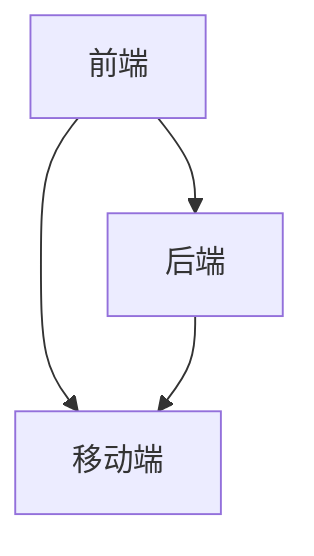

                 

在移动应用开发领域，Android系统凭借其庞大的用户基础和开源特性，成为了开发者们的首选平台。而全栈开发，这一涵盖前端、后端和移动端的全链条开发模式，正成为当前技术发展的一个重要趋势。本文将全面探讨Android全栈开发的核心技术、最佳实践和未来趋势。

> 关键词：Android全栈开发、前端、后端、移动应用、开发模式、最佳实践、未来趋势

> 摘要：本文将带领读者深入理解Android全栈开发的核心理念，详细解析其前端与后端技术架构，并通过实际项目实践，展示全栈开发的实际操作过程。同时，文章还将探讨全栈开发在实际应用场景中的效果，并展望其未来发展。

## 1. 背景介绍

Android全栈开发，即指开发者在单个项目中同时掌握前端、后端和移动端的开发技能，从而实现应用的全链条开发。这种模式有助于提升开发效率、优化用户体验，并在项目管理上实现更好的协调与控制。

### Android生态系统

Android系统自2008年推出以来，已经发展成为全球最大的移动操作系统。其开源特性、灵活的定制能力和庞大的用户群体，使得Android成为移动应用开发的热门选择。

### 前端技术发展

随着HTML5、CSS3和JavaScript等前端技术的快速发展，现代前端开发已经能够实现丰富的用户交互和强大的功能。React、Vue、Angular等前端框架的兴起，使得前端开发更加高效和模块化。

### 后端技术的发展

后端技术也在不断演进，Node.js、Django、Spring Boot等框架的出现，大大提升了后端开发的效率。云计算和微服务架构的普及，也为后端开发提供了更多的可能性。

### 移动应用的崛起

随着智能手机的普及，移动应用市场需求持续增长。无论是消费者应用还是企业应用，移动化已经成为企业战略的重要组成部分。

## 2. 核心概念与联系

在Android全栈开发中，前端、后端和移动端紧密联系，共同构建了一个完整的系统。

### 前端

前端是用户直接交互的部分，它负责展示应用界面和实现用户交互逻辑。Android全栈开发中，前端通常使用HTML、CSS和JavaScript编写，并借助React、Vue等框架实现复杂的功能。

### 后端

后端是应用程序的核心，负责处理业务逻辑、存储数据和提供API接口。在Android全栈开发中，后端可以采用Node.js、Django、Spring Boot等框架，实现高性能的服务端处理。

### 移动端

移动端是Android全栈开发的重要组成部分，它负责与用户直接交互，并通过网络与后端进行数据通信。Android全栈开发中，移动端通常使用Java或Kotlin语言，结合Android SDK开发应用程序。

### Mermaid 流程图



## 3. 核心算法原理 & 具体操作步骤

### 3.1 算法原理概述

Android全栈开发中，前端、后端和移动端各司其职，通过API接口和数据通信实现协同工作。前端负责数据展示和用户交互，后端处理业务逻辑和数据存储，移动端则实现本地数据和网络的交互。

### 3.2 算法步骤详解

1. **前端**：使用React或Vue框架构建前端界面，通过HTTP请求与后端进行数据通信。
2. **后端**：使用Node.js或Django框架搭建后端服务，提供API接口处理前端请求，并存储数据。
3. **移动端**：使用Android SDK开发移动应用，通过HTTP请求与后端进行数据通信，实现本地功能。

### 3.3 算法优缺点

**优点**：
- 提高开发效率：全栈开发使开发者能够在一个项目中同时处理多个层次的任务，提高开发效率。
- 优化用户体验：全栈开发能够实现更快速的应用响应和更好的用户体验。
- 简化项目管理：全栈开发减少了项目中的依赖关系，简化了项目管理。

**缺点**：
- 技术栈复杂：全栈开发需要开发者掌握多种技术，对开发者的技能要求较高。
- 维护成本高：全栈应用在后期维护中可能会面临技术栈更新和兼容性的问题。

### 3.4 算法应用领域

全栈开发广泛应用于各类移动应用开发，如社交媒体、电子商务、企业应用等。尤其在需要高效、稳定和复杂功能的场景中，全栈开发具有显著优势。

## 4. 数学模型和公式 & 详细讲解 & 举例说明

### 4.1 数学模型构建

在Android全栈开发中，数学模型主要用于数据处理和算法优化。以下是一个简单的线性回归模型：

$$y = bx + a$$

其中，$y$ 是因变量，$x$ 是自变量，$b$ 是斜率，$a$ 是截距。

### 4.2 公式推导过程

线性回归模型的推导基于最小二乘法，目标是找到最佳拟合线，使实际值与预测值之间的误差最小。

### 4.3 案例分析与讲解

假设我们有一个销售数据集，包含产品销售额和广告费用。我们可以使用线性回归模型预测不同广告费用下的销售额。

```latex
y = 0.5x + 100
```

根据这个模型，当广告费用为1000元时，预测销售额为：

$$y = 0.5 \times 1000 + 100 = 600$$

## 5. 项目实践：代码实例和详细解释说明

### 5.1 开发环境搭建

在开始项目实践前，需要搭建完整的开发环境。以下是一个简单的搭建步骤：

1. 安装Android Studio。
2. 安装Node.js。
3. 安装React Native开发工具。

### 5.2 源代码详细实现

以下是一个简单的React Native应用的代码示例：

```javascript
import React from 'react';
import { View, Text, StyleSheet } from 'react-native';

const App = () => {
  return (
    <View style={styles.container}>
      <Text style={styles.welcome}>Hello, World!</Text>
    </View>
  );
};

const styles = StyleSheet.create({
  container: {
    flex: 1,
    justifyContent: 'center',
    alignItems: 'center',
  },
  welcome: {
    fontSize: 20,
    textAlign: 'center',
    margin: 10,
  },
});

export default App;
```

### 5.3 代码解读与分析

上述代码创建了一个简单的React Native应用，显示一个“Hello, World!”文本。`<View>`组件是容器组件，用于布局；`<Text>`组件用于显示文本。

### 5.4 运行结果展示

在Android模拟器中运行上述代码，可以看到一个显示“Hello, World!”文本的界面。

## 6. 实际应用场景

Android全栈开发在多个领域具有广泛应用，以下是一些实际应用场景：

### 社交媒体

社交媒体应用如Facebook、Instagram等，采用全栈开发模式，实现实时数据推送、用户互动和消息推送等功能。

### 电子商务

电子商务平台如Amazon、阿里巴巴等，通过全栈开发实现快速的商品搜索、购物车管理和订单处理。

### 企业应用

企业内部应用如CRM系统、ERP系统等，通过全栈开发实现高效的数据处理和业务流程管理。

## 7. 工具和资源推荐

### 学习资源推荐

- 《React Native官方文档》：了解React Native的详细用法和最佳实践。
- 《Android官方文档》：掌握Android SDK的使用和开发技巧。
- 《Node.js官方文档》：深入学习Node.js和Express框架。

### 开发工具推荐

- Android Studio：Android开发的首选IDE。
- Visual Studio Code：跨平台的前端开发IDE。
- Postman：API接口测试工具。

### 相关论文推荐

- 《全栈开发模式在移动应用开发中的应用研究》
- 《基于React Native的移动应用全栈开发实践》
- 《Node.js在后端开发中的应用与挑战》

## 8. 总结：未来发展趋势与挑战

### 8.1 研究成果总结

Android全栈开发在提高开发效率、优化用户体验和简化项目管理方面取得了显著成果。随着技术的不断发展，全栈开发模式将更具优势。

### 8.2 未来发展趋势

随着5G、人工智能和区块链等技术的应用，全栈开发将在更多领域得到推广。同时，前端、后端和移动端的技术融合也将进一步优化开发体验。

### 8.3 面临的挑战

全栈开发对开发者的技能要求较高，技术栈复杂，维护成本高。此外，随着技术的更新，全栈开发项目需要持续迭代和优化。

### 8.4 研究展望

未来，全栈开发将在更广泛的领域得到应用，并推动移动应用开发的持续创新。通过不断优化开发流程和技术栈，全栈开发将为开发者带来更多便利和机遇。

## 9. 附录：常见问题与解答

**Q：什么是全栈开发？**

A：全栈开发是指开发者同时掌握前端、后端和移动端的开发技能，实现应用的全链条开发。

**Q：全栈开发的优势是什么？**

A：全栈开发可以提高开发效率、优化用户体验和简化项目管理。同时，全栈开发使开发者能够更好地控制整个项目，提升协作效率。

**Q：如何学习全栈开发？**

A：可以从学习前端技术（如HTML、CSS、JavaScript）开始，然后逐步学习后端技术（如Node.js、Django、Spring Boot）和移动端技术（如Android SDK）。此外，可以参加相关课程和项目实践，积累实际经验。

**Q：全栈开发的未来发展趋势是什么？**

A：未来，全栈开发将在5G、人工智能和区块链等新兴技术的推动下，得到更广泛的应用。同时，前端、后端和移动端的技术融合也将进一步优化开发体验。

---

作者：禅与计算机程序设计艺术 / Zen and the Art of Computer Programming
----------------------------------------------------------------
这篇文章详细探讨了Android全栈开发的核心技术、最佳实践和未来趋势。通过分析前端、后端和移动端的技术架构，以及实际项目实践，读者可以全面了解Android全栈开发的操作过程和应用场景。同时，文章还展望了全栈开发的发展趋势，为开发者提供了有益的启示。希望这篇文章能够对您在Android全栈开发领域的学习和实践有所帮助。

