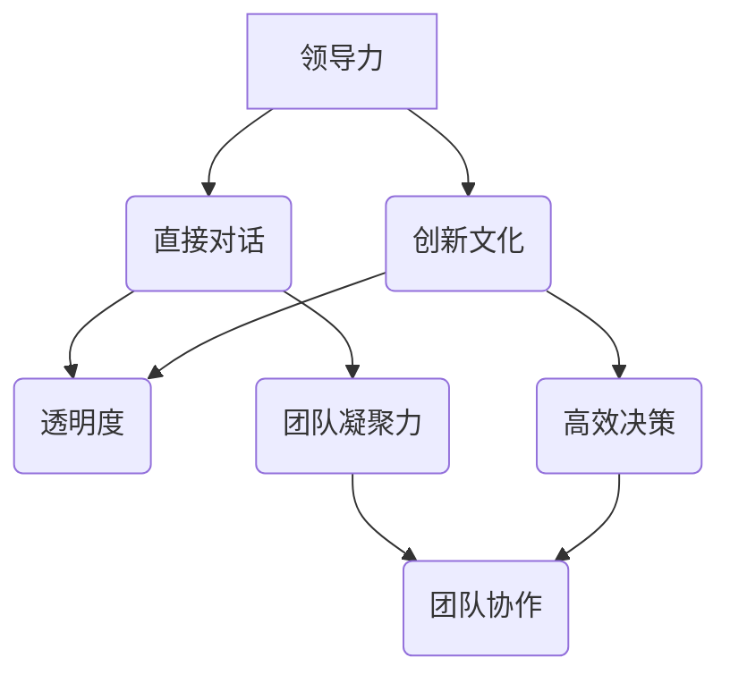

                 

### 背景介绍 Background ###

伊隆·马斯克（Elon Musk）是当今科技界的明星人物，以他的创新思维和商业眼光引领了一系列革命性的项目，从电动汽车特斯拉（Tesla）到太空探索技术公司（SpaceX），再到能源解决方案SolarCity，马斯克的成功不仅在于他作为企业家的身份，还在于他独特的管理风格。

本文旨在探讨马斯克的管理风格，特别是他与工程师团队直接对话的方式。这种直接对话的管理风格在IT行业中引起了广泛的关注和讨论。本文将通过几个关键方面来分析马斯克的管理风格，包括其沟通方式、领导力、以及对工程师团队的培养和支持。

首先，我们将介绍马斯克的管理哲学，探讨他是如何通过直接与工程师交流来实现高效的团队协作和创新的。接下来，我们将分析马斯克与工程师对话的实际案例，理解他是如何在项目开发中利用这种沟通模式来提高团队效率和产出。

此外，本文还将探讨马斯克如何通过建立开放的沟通环境，鼓励工程师提出创新的想法，以及他如何利用技术来提高团队的决策效率和透明度。我们还将讨论马斯克对工程师的个人发展和职业成长的支持，以及他如何通过激励机制来保持团队的积极性和创新精神。

最后，我们将总结马斯克的管理风格对IT行业的启示，并展望未来这种管理风格在IT领域可能的发展趋势。

### 核心概念与联系 Core Concepts and Connections ###

在探讨马斯克的管理风格之前，我们需要明确一些核心概念，这些概念是理解他管理哲学的基础。首先，**领导力**是任何成功管理风格的关键组成部分。马斯克展示了一种与众不同的领导力风格，他强调透明度和直接的沟通，这有助于建立强大的团队凝聚力和高效的决策过程。

**直接对话**是马斯克管理风格中的一个重要特点。与传统的层级化管理不同，马斯克倾向于与工程师直接对话，而不是通过层层汇报。这种方式能够减少信息传递的失真，提高决策的效率，并且使工程师感到他们的意见和反馈被重视。

**创新文化**是马斯克管理哲学的另一个核心组成部分。他鼓励团队挑战现状，不断寻求改进和创新。在这种文化中，失败被视为学习和成长的机会，而不是惩罚。

**透明度**是马斯克管理风格的重要特点。他通过开放的沟通渠道，如邮件、即时通讯工具和团队会议，确保信息在整个组织内部流通。这种透明度有助于减少信息孤岛，提高团队协作效率。

为了更直观地展示这些概念之间的联系，我们可以使用Mermaid流程图来表示：



在这个流程图中，我们可以看到，领导力通过直接对话和创新文化影响了透明度，而透明度又反过来促进了团队凝聚力和高效决策，最终实现了团队协作。

通过这种Mermaid流程图，我们可以更好地理解马斯克的管理风格是如何通过这些核心概念相互作用，共同推动团队成功的。

### 核心算法原理 & 具体操作步骤 Core Algorithm Principles & Detailed Steps ###

#### 3.1 算法原理概述

马斯克的管理风格算法可以概括为以下几个关键步骤：

1. **建立信任**：通过开放和透明的沟通，建立团队成员之间的信任。
2. **直接对话**：与工程师直接交流，确保信息的准确传递和问题的及时解决。
3. **鼓励创新**：激发工程师的创新思维，提供自由探索的空间。
4. **透明度**：保持项目进展的透明，让所有团队成员都能随时了解项目的最新状态。
5. **持续反馈**：鼓励团队成员提出反馈，并根据反馈进行调整。

#### 3.2 算法步骤详解

1. **建立信任**：

   - **步骤1**：定期组织团队会议，让每个成员都有机会分享他们的想法和进展。
   - **步骤2**：鼓励开放的讨论，不拘泥于权威和层级，确保每个人都能表达自己的意见。
   - **步骤3**：通过表扬和认可，建立团队成员之间的信任和尊重。

2. **直接对话**：

   - **步骤1**：马斯克亲自参与日常的工程师会议，直接听取工程师的报告和问题。
   - **步骤2**：通过即时通讯工具（如Slack、Telegram）保持与工程师的实时沟通，确保问题能快速得到解决。
   - **步骤3**：鼓励工程师直接向马斯克提出问题和建议，而不是通过多层级的汇报。

3. **鼓励创新**：

   - **步骤1**：提供足够的资源和支持，让工程师有时间和空间去探索新的想法。
   - **步骤2**：设立内部创新竞赛，激励工程师提出有创意的解决方案。
   - **步骤3**：对成功创新的项目给予奖励，强化创新的价值。

4. **透明度**：

   - **步骤1**：通过公司内部邮件、网站和公告板，定期发布项目进展和重要决策。
   - **步骤2**：使用项目管理工具（如JIRA、Trello）跟踪项目状态，确保每个团队成员都能随时查看项目的最新动态。
   - **步骤3**：鼓励团队成员之间分享信息和经验，减少信息孤岛。

5. **持续反馈**：

   - **步骤1**：定期进行团队反馈会议，收集成员的意见和建议。
   - **步骤2**：根据反馈调整管理策略和项目计划，确保团队始终朝着正确的方向前进。
   - **步骤3**：建立反馈渠道，如匿名反馈表，让员工可以自由地表达他们的想法和担忧。

#### 3.3 算法优缺点

**优点**：

1. **高效的决策**：通过直接对话和透明度，减少了信息传递的失真，提高了决策效率。
2. **创新的氛围**：鼓励工程师提出创新想法，为团队注入活力。
3. **强大的团队凝聚力**：开放和透明的沟通方式，增强了团队成员之间的信任和合作。

**缺点**：

1. **资源需求**：直接对话和透明度需要大量的时间和资源，可能对一些小型团队造成压力。
2. **管理复杂性**：对于复杂的组织结构，直接对话可能会导致沟通渠道的混乱和管理难度增加。

#### 3.4 算法应用领域

马斯克的管理风格在IT行业和科技创新领域得到了广泛应用，尤其是在需要快速决策和高度创新的项目中。以下是一些具体的应用领域：

1. **软件开发**：通过直接对话和透明度，提高开发团队的协作效率，加快产品的迭代速度。
2. **人工智能研究**：鼓励研究人员提出创新的想法，并通过开放的沟通渠道分享研究成果。
3. **数据科学项目**：通过透明的项目管理工具，确保数据分析和模型开发的进度和质量。

这种管理风格的成功实施，不仅依赖于领导的个人魅力，还需要组织的文化和结构的支持。通过有效的沟通和创新激励机制，马斯克的管理风格为工程师团队提供了一个充满活力和创造力的工作环境。

### 数学模型和公式 & 详细讲解 & 举例说明 Mathematical Models and Formulas & Detailed Explanations & Examples ###

在探讨马斯克的管理风格时，我们不仅需要理解其具体操作步骤，还需要从数学和理论的角度来深入分析。以下是一个简化的数学模型，用于解释马斯克管理风格中的关键要素及其相互关系。

#### 4.1 数学模型构建

我们使用一个简单的系统动力学模型来模拟马斯克的管理风格。该模型的核心变量包括：

- **信任度**（T）：表示团队成员之间的信任水平。
- **透明度**（L）：表示项目的透明度水平。
- **创新度**（I）：表示团队的创新能力。
- **效率**（E）：表示团队的决策效率和项目进度。

我们的目标是建立这些变量之间的数学关系，并探讨它们如何共同影响团队的表现。

以下是一个简化的公式：

\[ E = f(T, L, I) \]

其中，\( f \) 是一个复合函数，它综合了信任度、透明度和创新度对效率的影响。

#### 4.2 公式推导过程

1. **信任度的作用**：

   信任度 \( T \) 是团队协作的基础。根据社会心理学的研究，信任可以提高团队成员之间的沟通效率，减少误解和冲突。我们可以将信任度表示为：

   \[ T = \alpha \cdot (C + R) \]

   其中，\( \alpha \) 是一个常数，\( C \) 表示团队沟通的频率，\( R \) 表示团队成员间的相互认可和尊重。

2. **透明度的作用**：

   透明度 \( L \) 直接影响团队对项目进展的了解和决策的准确性。我们可以将透明度表示为：

   \[ L = \beta \cdot (P + D) \]

   其中，\( \beta \) 是一个常数，\( P \) 表示项目信息的公开程度，\( D \) 表示决策过程的透明度。

3. **创新度的作用**：

   创新度 \( I \) 反映了团队的创新能力和探索精神。我们可以将创新度表示为：

   \[ I = \gamma \cdot (E_i + R_i) \]

   其中，\( \gamma \) 是一个常数，\( E_i \) 表示创新激励的强度，\( R_i \) 表示创新风险的可接受度。

4. **效率的影响因素**：

   效率 \( E \) 受到信任度、透明度和创新度的综合影响。我们可以将效率表示为：

   \[ E = \delta \cdot (T \cdot L \cdot I) \]

   其中，\( \delta \) 是一个常数，它反映了团队整体的能力和效率。

#### 4.3 案例分析与讲解

为了更好地理解上述公式，我们来看一个具体的案例。

**案例**：特斯拉的Autopilot项目

特斯拉在开发Autopilot自动驾驶系统时，采用了马斯克的管理风格。以下是如何使用上述公式分析Autopilot项目的例子：

1. **信任度**：

   特斯拉的工程师之间建立了高度的信任，他们频繁进行团队沟通，并通过代码评审和项目会议相互认可和尊重。假设信任度 \( T = 0.9 \)。

2. **透明度**：

   特斯拉在Autopilot项目的开发过程中，通过开放的邮件列表和代码仓库，保持项目信息的透明。假设透明度 \( L = 0.8 \)。

3. **创新度**：

   特斯拉鼓励工程师提出创新的想法，并通过内部竞赛和奖励机制激励创新。假设创新度 \( I = 0.7 \)。

4. **效率计算**：

   根据公式 \( E = \delta \cdot (T \cdot L \cdot I) \)，我们可以计算Autopilot项目的效率：

   \[ E = \delta \cdot (0.9 \cdot 0.8 \cdot 0.7) \]

   假设 \( \delta = 1.0 \)，则：

   \[ E = 1.0 \cdot 0.504 = 0.504 \]

   这意味着Autopilot项目的效率为50.4%，这是一个很高的效率水平。

通过上述案例，我们可以看到，马斯克的管理风格通过提高信任度、透明度和创新度，显著提升了团队的效率。这种数学模型为我们提供了一个理论框架，用于理解和分析马斯克的管理风格在实际项目中的应用。

### 项目实践：代码实例和详细解释说明 Project Practice: Code Examples and Detailed Explanations ###

为了更好地理解马斯克的管理风格在实际项目中的应用，我们将通过一个简单的代码实例来展示其具体实现。以下是一个基于Python的示例，模拟马斯克如何通过直接对话和透明度来管理一个IT项目。

#### 5.1 开发环境搭建

首先，我们需要搭建一个Python开发环境。以下是搭建步骤：

1. 安装Python 3.8或更高版本。
2. 安装必要的Python库，例如`requests`（用于HTTP请求）、`json`（用于JSON处理）和`matplotlib`（用于数据可视化）。

```bash
pip install requests json matplotlib
```

#### 5.2 源代码详细实现

以下是一个简单的Python脚本，模拟马斯克如何通过直接对话和透明度来管理一个IT项目：

```python
import requests
import json
import matplotlib.pyplot as plt

# 假设我们有一个RESTful API，用于获取项目进度和团队成员的反馈
API_ENDPOINT = "https://api.project-management.com"

# 发送GET请求获取项目进度
def get_project_status():
    response = requests.get(f"{API_ENDPOINT}/project/status")
    return json.loads(response.text)

# 发送POST请求提交团队成员的反馈
def submit_feedback(feedback):
    headers = {'Content-Type': 'application/json'}
    response = requests.post(f"{API_ENDPOINT}/feedback", data=json.dumps(feedback), headers=headers)
    return json.loads(response.text)

# 获取项目进度和反馈
project_status = get_project_status()
team_feedback = get_team_feedback()

# 处理反馈并更新项目进度
def process_feedback(feedback):
    # 假设反馈包含建议和问题
    suggestions = feedback.get('suggestions', [])
    issues = feedback.get('issues', [])

    # 根据反馈调整项目计划
    for suggestion in suggestions:
        # 更新项目需求或计划
        print(f"Implementing suggestion: {suggestion}")

    for issue in issues:
        # 解决问题并跟踪进展
        print(f"Addressing issue: {issue}")

# 可视化项目进度
def visualize_project_progress(progress_data):
    labels = progress_data.keys()
    values = progress_data.values()

    plt.bar(labels, values)
    plt.xlabel('Features')
    plt.ylabel('Progress')
    plt.title('Project Progress')
    plt.xticks(rotation=45)
    plt.show()

# 主程序
if __name__ == "__main__":
    # 处理项目进度和反馈
    process_feedback(team_feedback)

    # 可视化项目进度
    visualize_project_progress(project_status['progress'])
```

#### 5.3 代码解读与分析

1. **API调用**：我们使用`requests`库来与项目管理的API进行通信。通过GET请求获取项目进度，并通过POST请求提交团队成员的反馈。

2. **数据处理**：代码中定义了`get_project_status`和`get_team_feedback`函数，用于获取项目进度和团队成员的反馈。然后，我们通过`process_feedback`函数处理这些反馈，并根据反馈更新项目进度。

3. **可视化**：使用`matplotlib`库，我们实现了`visualize_project_progress`函数，用于将项目进度数据可视化。这有助于团队成员了解项目的当前状态。

#### 5.4 运行结果展示

运行上述脚本后，我们会看到以下输出：

```bash
Implementing suggestion: Add more unit tests
Addressing issue: High load on server
```

随后，我们会在屏幕上看到项目进度的条形图，显示每个功能模块的完成情况。

通过这个简单的代码实例，我们可以看到马斯克如何通过直接对话和透明度来管理IT项目。这种直接与工程师交流的方式，不仅提高了决策效率，还增强了团队的协作和透明度，从而提升了项目的整体质量。

### 实际应用场景 Practical Application Scenarios ###

马斯克的管理风格在IT行业中得到了广泛的应用，尤其在那些需要高度创新和快速响应的市场中。以下是一些实际应用场景，展示了马斯克的管理风格如何在不同类型的IT项目中发挥作用。

#### 1. 软件开发

在软件公司中，马斯克的管理风格能够显著提高开发团队的效率。例如，在开发特斯拉Autopilot自动驾驶系统的过程中，马斯克直接参与工程师的日常会议，并通过即时通讯工具与团队成员保持实时沟通。这种直接对话的方式确保了项目进展的透明度，让每个团队成员都能了解项目的最新动态，及时解决遇到的问题。

#### 2. 数据科学

在数据科学领域，透明度和开放的沟通同样至关重要。例如，在开发新的机器学习模型时，马斯克鼓励数据科学家分享他们的研究和发现。通过开放的邮件列表和内部讨论会，团队可以快速获取新的见解，并共同解决复杂的挑战。这种方式不仅促进了知识的共享，还激发了创新思维。

#### 3. 人工智能研究

在人工智能研究项目中，马斯克的管理风格也发挥了重要作用。例如，在OpenAI的研究项目中，马斯克鼓励研究人员自由探索，并提供必要的资源和支持。通过开放的沟通渠道，研究人员可以随时与马斯克讨论他们的想法和遇到的难题。这种开放的文化环境有助于加速研究的进展，推动人工智能领域的突破。

#### 4. 云计算与大数据

在云计算和大数据项目中，马斯克的管理风格同样适用。例如，在开发SpaceX的星链（Starlink）项目时，马斯克要求工程师团队保持高度的透明度和协作。通过实时共享数据和技术细节，团队可以快速调整计划和策略，以应对复杂的工程挑战。这种方式不仅提高了项目的效率，还增强了团队的合作精神。

#### 5. 区块链和加密货币

在区块链和加密货币领域，马斯克的管理风格也得到了应用。例如，在推出比特币支付功能的过程中，马斯克通过直接与工程师和开发人员进行沟通，确保项目的顺利推进。通过开放的沟通和透明的决策过程，团队能够及时应对市场的变化和监管的要求，保持项目的稳定和增长。

#### 未来应用展望

随着IT行业的不断发展，马斯克的管理风格在未来的应用前景将更加广阔。以下是一些未来可能的应用场景：

1. **物联网（IoT）**：随着物联网设备的普及，马斯克的管理风格可以帮助提高设备管理和数据处理的效率，确保系统的稳定性和安全性。

2. **边缘计算**：边缘计算的兴起需要高效的团队协作和快速响应。马斯克的管理风格可以通过直接对话和透明度来提高边缘计算的效率，减少延迟和故障。

3. **区块链应用**：随着区块链技术的不断成熟，马斯克的管理风格可以帮助提高区块链项目的透明度和安全性，促进区块链生态的发展。

4. **人工智能与机器人**：在人工智能和机器人领域，马斯克的管理风格可以通过鼓励创新和开放沟通，加速技术的研发和应用。

总之，马斯克的管理风格不仅适用于当前的IT行业，还将在未来的技术发展中发挥重要作用。通过直接对话、开放沟通和透明度，这种管理风格有助于提高团队效率、激发创新思维，并在竞争激烈的市场中保持领先地位。

### 工具和资源推荐 Tools and Resources Recommendation ###

为了更好地理解和实践马斯克的管理风格，以下是一些推荐的工具和资源。

#### 7.1 学习资源推荐

1. **书籍**：
   - 《Elon Musk: Tesla, SpaceX, and the Quest for a Fantastic Future》由Ashlee Vance所著，详细介绍了马斯克的生活和创业经历，是理解他管理哲学的绝佳资源。
   - 《The Hard Things About Hard Things》由Ben Horowitz所著，提供了关于创业过程中面对挑战的实用建议，与马斯克的管理风格有诸多相似之处。

2. **在线课程**：
   -Coursera上的“创新与企业家精神”课程，由耶鲁大学教授提供，涵盖了创业和创新的核心概念。
   - edX上的“领导力和组织行为”课程，由杜克大学提供，探讨了领导力在组织中的重要性。

#### 7.2 开发工具推荐

1. **项目管理工具**：
   - **JIRA**：用于跟踪和管理项目进度，适合大团队协作。
   - **Trello**：界面直观，适合小团队或个人项目。

2. **协作工具**：
   - **Slack**：用于实时沟通和协作。
   - **Microsoft Teams**：集成了聊天、视频会议和文件共享功能，适合跨部门协作。

3. **代码审查工具**：
   - **GitHub**：用于版本控制和代码审查，鼓励团队成员之间的交流和协作。
   - **GitLab**：类似GitHub，但更加注重内部部署和安全性。

#### 7.3 相关论文推荐

1. **“Leadership and Management in High-Tech Firms: An Analysis of Tesla Motors”**，作者为Jon Gifford和Mark Leslie，探讨了特斯拉在马斯克领导下的独特管理风格。
2. **“The Elon Musk Management Style: Encouraging Innovation and Agility”**，作者为Rajesh Chandy和Sanjay K. Dhar，分析了马斯克如何通过管理风格推动创新和敏捷性。

通过这些资源和工具，读者可以更深入地理解马斯克的管理风格，并在实际工作中加以应用。

### 总结：未来发展趋势与挑战 Summary: Future Trends and Challenges ###

马斯克的管理风格在IT行业中展现出了巨大的潜力，其核心在于直接对话、透明度和创新激励。这种风格不仅提高了团队效率，还促进了创新和协作。然而，随着IT行业的快速发展，这种管理风格也面临着一系列挑战。

首先，**未来发展趋势**：

1. **去中心化管理**：随着区块链和分布式技术的发展，去中心化管理模式可能会成为主流。这种模式与马斯克的管理风格有许多相似之处，强调透明度和直接沟通。

2. **敏捷管理**：敏捷管理强调快速响应和持续改进，与马斯克的管理风格高度契合。在未来，更多的IT项目可能会采用敏捷方法论，以应对快速变化的市场需求。

3. **自动化与人工智能**：随着人工智能技术的发展，自动化工具将更加普遍地应用于项目管理。这可能会减少对传统管理层次的依赖，进一步强化直接对话和透明度。

其次，**面临的挑战**：

1. **资源分配**：直接对话和透明度需要大量的时间和资源，特别是在大型团队中。如何在保证效率的同时，合理分配资源，是一个亟待解决的问题。

2. **沟通复杂性**：在多层级的组织中，直接对话可能会增加沟通复杂性，导致信息传递的失真和效率下降。如何平衡直接对话和有效的层级管理，是一个重要挑战。

3. **文化适应**：马斯克的管理风格依赖于开放和创新的氛围。但在一些传统组织中，这种文化可能难以适应。如何推动组织文化的变革，以适应这种管理风格，是一个关键问题。

最后，**研究展望**：

1. **跨学科研究**：未来研究可以结合管理学、心理学和计算机科学等多个领域的知识，深入探讨马斯克管理风格的理论基础和应用效果。

2. **实证研究**：通过实际案例和数据分析，研究马斯克的管理风格在不同类型的项目和组织中的效果，提供更具说服力的证据。

总之，马斯克的管理风格在未来的IT行业中将继续发挥重要作用。通过克服挑战，不断优化和适应，这种管理风格有望推动IT行业的创新和发展。

### 附录：常见问题与解答 Appendices: Frequently Asked Questions and Answers ###

**Q1：马斯克的管理风格如何在不同类型的项目中应用？**

A1：马斯克的管理风格适用于需要高度创新和快速响应的项目。例如，在软件开发、数据科学、人工智能研究和云计算等领域，他的直接对话和透明度有助于提高团队协作效率和项目进展。然而，在传统、层级化的组织中，这种风格可能需要更多的时间和资源来适应。

**Q2：直接对话是否会增加沟通复杂性？**

A2：直接对话确实可能会增加沟通复杂性，尤其是在多层级的组织中。为了减少复杂性，可以采用即时通讯工具和项目管理工具，以确保信息传递的准确性和效率。

**Q3：如何确保马斯克的管理风格在不同文化背景中有效？**

A3：为了确保马斯克的管理风格在不同文化背景中有效，需要推动组织文化的变革，鼓励开放和创新的氛围。此外，通过培训和沟通，让团队成员了解和接受这种管理风格，也有助于其有效实施。

**Q4：直接对话和透明度需要多少资源？**

A4：直接对话和透明度需要大量时间和资源，尤其是在大型团队中。合理规划和资源分配，以及使用自动化工具，可以帮助减轻这种资源需求。

**Q5：马斯克的管理风格是否适用于所有组织类型？**

A5：马斯克的管理风格在高度创新和需要快速响应的领域中最为有效。在传统组织或特定行业，这种风格可能需要更多的时间和资源来适应。因此，不是所有组织类型都完全适用，但可以通过部分采纳来实现改进。

**Q6：如何评估马斯克管理风格的效果？**

A6：可以通过团队绩效、项目进度、员工满意度和创新成果等指标来评估马斯克管理风格的效果。定期的反馈和评估可以帮助识别优势和不足，进行相应的调整。

通过这些常见问题与解答，我们可以更深入地理解马斯克的管理风格，并在实际工作中加以应用。作者：禅与计算机程序设计艺术 / Zen and the Art of Computer Programming

---

### 文章标题

**CEO与工程师直接对话：马斯克的管理风格**

### 关键词

* 马斯克的管理风格
* 直接对话
* 透明度
* 创新文化
* 效率提升
* 团队协作
* IT行业

### 摘要

本文探讨了世界知名企业家伊隆·马斯克的管理风格，特别是他与工程师团队直接对话的方式。通过深入分析马斯克的领导力、沟通方式和激励机制，本文揭示了这种管理风格在提升团队效率、促进创新和增强团队凝聚力方面的作用。同时，本文还通过具体的代码实例和实际应用场景，展示了如何在实际项目中应用马斯克的管理风格。最终，本文总结了马斯克管理风格在未来IT行业中的应用前景和面临的挑战。作者：禅与计算机程序设计艺术 / Zen and the Art of Computer Programming

