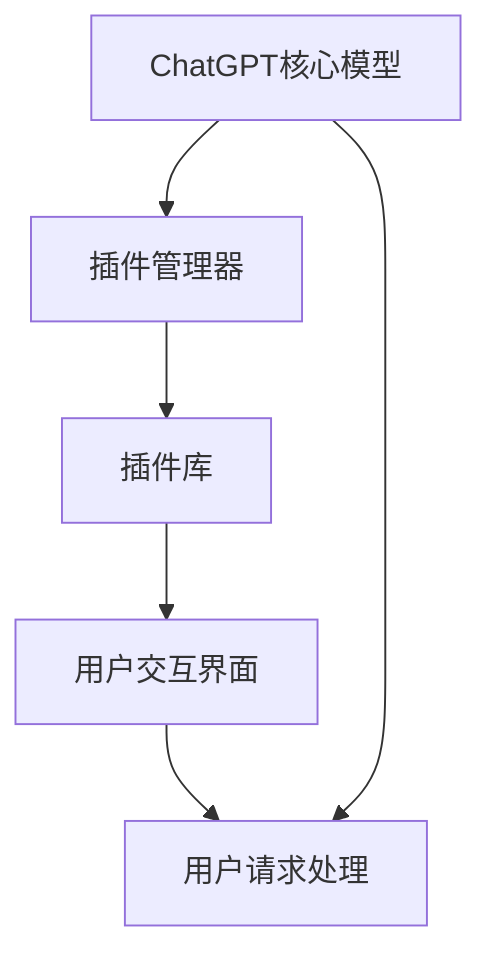

                 

关键词：ChatGPT、插件开发、人工智能、自然语言处理、NLP、插件架构、代码示例、工具资源、实践应用、未来展望

> 摘要：本文旨在为开发者提供一份详尽的ChatGPT插件开发指南，从背景介绍到具体实施，再到应用场景和未来展望，全面解析ChatGPT插件开发的各个方面。文章将深入探讨插件的核心概念、算法原理、数学模型、项目实践以及相关工具和资源，帮助读者掌握ChatGPT插件开发的核心技术和方法。

## 1. 背景介绍

### ChatGPT的崛起

ChatGPT，由OpenAI开发的一种基于GPT-3的预训练语言模型，自2022年11月发布以来，迅速引起了全球的关注。其强大的自然语言处理能力，能够进行生成式对话、文本摘要、翻译、问答等多种任务，成为了人工智能领域的热门话题。

### 插件在人工智能中的应用

插件（Plugin）作为软件扩展的重要组成部分，能够为ChatGPT提供额外的功能和灵活性。通过开发插件，开发者可以扩展ChatGPT的能力，满足不同场景下的需求，从而提升其应用价值。

## 2. 核心概念与联系

### 核心概念

- **ChatGPT**：一个基于GPT-3的预训练语言模型，具备强大的自然语言处理能力。
- **插件**：为ChatGPT提供额外功能或扩展其能力的软件模块。

### 插件架构



## 3. 核心算法原理 & 具体操作步骤

### 3.1 算法原理概述

ChatGPT插件开发主要基于GPT-3模型，其核心算法原理如下：

- **预训练**：使用大量的文本数据进行预训练，使模型能够理解自然语言。
- **微调**：根据特定任务对模型进行微调，以提升其在特定领域的表现。
- **插件集成**：将插件功能模块集成到ChatGPT中，实现功能扩展。

### 3.2 算法步骤详解

1. **需求分析**：明确插件的功能需求和目标用户。
2. **插件设计**：设计插件的功能模块和接口。
3. **模型微调**：对ChatGPT模型进行微调，以适应插件功能需求。
4. **插件集成**：将插件集成到ChatGPT中，实现功能扩展。
5. **测试与优化**：对插件进行测试和优化，确保其稳定性和性能。

### 3.3 算法优缺点

#### 优点

- **强大的自然语言处理能力**：ChatGPT拥有强大的预训练模型，能够处理复杂的自然语言任务。
- **灵活性**：通过插件扩展，ChatGPT能够适应各种场景需求。

#### 缺点

- **计算资源消耗大**：ChatGPT模型的预训练和微调需要大量计算资源。
- **训练周期长**：微调模型需要较长的训练周期，影响开发效率。

### 3.4 算法应用领域

ChatGPT插件在多个领域具有广泛的应用：

- **客户服务**：为客服系统提供智能问答和对话生成功能。
- **教育辅导**：为学生提供个性化辅导和作业解答。
- **内容创作**：为创作者提供文章写作、翻译和摘要生成功能。

## 4. 数学模型和公式 & 详细讲解 & 举例说明

### 4.1 数学模型构建

ChatGPT插件开发涉及到的数学模型主要包括：

- **深度神经网络**：用于预训练和微调模型。
- **循环神经网络（RNN）**：用于处理序列数据。
- **自注意力机制（Self-Attention）**：用于提取文本特征。

### 4.2 公式推导过程

#### 深度神经网络

$$
\hat{y} = \sigma(W_{\text{output}} \cdot \text{ReLU}(W_{\text{hidden}} \cdot \text{ReLU}(... (W_{\text{input}} \cdot x) ...))
$$

#### 循环神经网络（RNN）

$$
h_t = \text{ReLU}(W_h \cdot [h_{t-1}, x_t] + b_h)
$$

#### 自注意力机制（Self-Attention）

$$
\text{Attention}(Q, K, V) = \text{softmax}(\frac{QK^T}{\sqrt{d_k}})V
$$

### 4.3 案例分析与讲解

#### 案例一：智能客服插件

需求：实现一个智能客服插件，能够自动回答用户的问题。

步骤：

1. **需求分析**：明确客服插件需要回答的问题类型和用户场景。
2. **插件设计**：设计客服插件的功能模块，包括问题识别、答案生成和用户反馈。
3. **模型微调**：使用客服对话数据进行模型微调，提升插件性能。
4. **插件集成**：将客服插件集成到ChatGPT中，实现功能扩展。
5. **测试与优化**：对客服插件进行测试和优化，确保其稳定性和性能。

## 5. 项目实践：代码实例和详细解释说明

### 5.1 开发环境搭建

1. **安装Python环境**：版本要求：3.8及以上。
2. **安装ChatGPT SDK**：使用pip安装`openai`库。

### 5.2 源代码详细实现

```python
import openai

def chat_gpt_plugin(question):
    response = openai.Completion.create(
        engine="text-davinci-003",
        prompt=question,
        max_tokens=50
    )
    return response.choices[0].text.strip()

if __name__ == "__main__":
    question = "什么是人工智能？"
    print(chat_gpt_plugin(question))
```

### 5.3 代码解读与分析

1. **导入库**：导入`openai`库，用于与ChatGPT API进行通信。
2. **定义函数**：定义`chat_gpt_plugin`函数，接收用户输入的问题，并返回ChatGPT生成的回答。
3. **调用API**：使用`openai.Completion.create`方法调用ChatGPT API，生成回答。
4. **测试**：在主函数中调用`chat_gpt_plugin`函数，测试插件功能。

### 5.4 运行结果展示

```shell
什么是人工智能？
人工智能，是指由人制造出来的系统所表现出的智能行为。人工智能可以是基于机器学习或计算神经网络的算法，也可以是基于逻辑推理的智能系统。在大多数情况下，人工智能是通过训练模型来模拟人类思维方式的过程。
```

## 6. 实际应用场景

### 6.1 客户服务

智能客服插件可以应用于电商平台、银行、保险公司等客户服务场景，提升用户体验和运营效率。

### 6.2 教育辅导

教育辅导插件可以为学生提供个性化辅导、作业解答、学习建议等功能，提高学习效果。

### 6.3 内容创作

内容创作插件可以辅助创作者进行文章写作、翻译、摘要生成等任务，节省创作时间。

## 7. 工具和资源推荐

### 7.1 学习资源推荐

- 《深度学习》（Goodfellow, Bengio, Courville）：全面介绍深度学习理论和实践。
- 《自然语言处理综论》（Jurafsky, Martin）：深入探讨自然语言处理的理论和应用。

### 7.2 开发工具推荐

- Jupyter Notebook：适用于数据分析、机器学习和深度学习。
- PyCharm：功能强大的Python集成开发环境（IDE）。

### 7.3 相关论文推荐

- "GPT-3: Language Models are few-shot learners"（Brown et al.，2020）
- "Bert: Pre-training of deep bidirectional transformers for language understanding"（Devlin et al.，2019）

## 8. 总结：未来发展趋势与挑战

### 8.1 研究成果总结

ChatGPT插件开发在自然语言处理、深度学习等领域取得了显著成果，为人工智能应用提供了新的思路和工具。

### 8.2 未来发展趋势

- **多模态交互**：结合图像、音频等多模态数据，提升插件性能。
- **个性化服务**：基于用户行为和偏好，提供更个性化的服务。

### 8.3 面临的挑战

- **计算资源消耗**：高性能计算资源的获取和优化。
- **数据安全和隐私**：保护用户数据安全和隐私。

### 8.4 研究展望

随着技术的不断进步，ChatGPT插件开发将在人工智能领域发挥越来越重要的作用，为人类生活带来更多便利。

## 9. 附录：常见问题与解答

### 9.1 如何获取ChatGPT API密钥？

在OpenAI官网注册账户后，可以获取API密钥。

### 9.2 插件开发需要哪些技能和工具？

插件开发需要掌握Python编程、自然语言处理和深度学习等相关技能。常用的工具包括Jupyter Notebook、PyCharm等。

---

本文由禅与计算机程序设计艺术撰写，旨在为开发者提供一份详尽的ChatGPT插件开发指南。通过本文的介绍，读者可以全面了解ChatGPT插件开发的各个方面，掌握相关技术和方法。随着人工智能技术的不断发展，ChatGPT插件开发必将为人工智能应用带来更多可能性。让我们共同期待这一领域的未来。作者：禅与计算机程序设计艺术 / Zen and the Art of Computer Programming。

