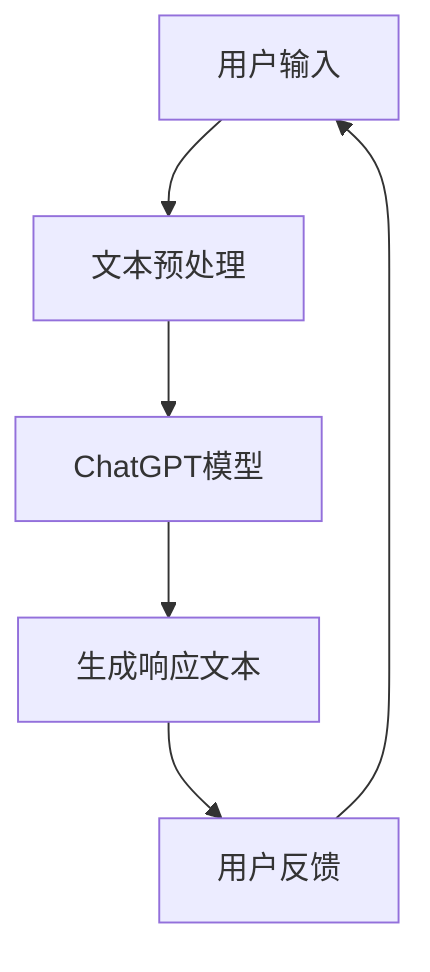

                 

关键词：ChatGPT，人工智能，交互，自然语言处理，深度学习，NLP，对话系统，未来应用

> 摘要：本文将深入探讨ChatGPT这一革命性自然语言处理技术的核心概念、算法原理、数学模型、实践应用及未来前景。通过剖析其技术架构和实现细节，本文旨在为读者提供一个全面、系统的理解和应用指南。

## 1. 背景介绍

在当今快速发展的信息技术时代，自然语言处理（NLP）已经成为人工智能（AI）领域中的一个重要分支。NLP技术的目标是从人类语言中提取有意义的信息，使计算机能够理解和生成自然语言。随着深度学习的兴起，基于神经网络的语言模型取得了显著的进展，其中GPT（Generative Pre-trained Transformer）系列模型尤为突出。ChatGPT作为GPT系列的一种变体，进一步扩展了NLP的应用场景，特别是在对话系统的构建中展现了巨大的潜力。

ChatGPT的提出源于OpenAI对大规模预训练模型的需求，旨在通过对话生成高质量的自然语言交互内容。与传统基于规则或模板的方法不同，ChatGPT采用了自回归语言模型，能够在大量文本数据上进行预训练，从而具备强大的语言理解和生成能力。这一技术的出现，标志着自然语言交互进入了一个全新的时代，具有广泛的应用前景。

## 2. 核心概念与联系

### 2.1. 自然语言处理（NLP）

自然语言处理是计算机科学和人工智能领域的一个分支，旨在让计算机理解和生成人类语言。NLP的核心任务是文本预处理、语义分析、语言生成等。在NLP中，文本数据通常被表示为向量，以便计算机能够进行有效的处理。

### 2.2. 生成式预训练模型（Generative Pre-trained Model）

生成式预训练模型是一类通过大规模数据预训练的神经网络模型，能够生成符合输入文本风格的输出文本。GPT模型是其中一种典型的生成式模型，通过自回归方式生成文本序列。

### 2.3. Transformer架构

Transformer是一种基于自注意力机制的神经网络架构，最初由Vaswani等人提出。它克服了传统循环神经网络（RNN）在长距离依赖问题上的劣势，通过全局注意力机制实现了对输入序列的全局关联。

### 2.4. ChatGPT与交互系统的关系

ChatGPT作为一款生成式预训练模型，被广泛应用于交互系统。通过对话生成功能，ChatGPT能够与用户进行自然的语言交互，实现智能客服、聊天机器人等应用。

### 2.5. Mermaid流程图

以下是ChatGPT与交互系统之间关系的一个简单Mermaid流程图：



## 3. 核心算法原理 & 具体操作步骤

### 3.1. 算法原理概述

ChatGPT基于Transformer架构，通过自回归方式生成文本。自回归模型的核心思想是将当前输入文本序列中的每个单词（或字符）与之前生成的文本序列进行关联，从而预测下一个单词（或字符）。这种关联通过注意力机制实现，使模型能够捕捉长距离依赖关系。

### 3.2. 算法步骤详解

1. **文本预处理**：将用户输入的文本进行分词、去停用词等预处理操作，将其转换为模型可以处理的格式。

2. **模型输入**：将预处理后的文本序列作为输入，输入到ChatGPT模型中。

3. **生成响应文本**：模型根据输入文本序列，利用注意力机制生成响应文本序列。生成过程中，模型会不断更新其状态，以生成与输入文本风格相似的输出。

4. **用户反馈**：将生成的响应文本展示给用户，用户可以根据反馈对模型进行优化。

### 3.3. 算法优缺点

**优点**：
- **强大的语言理解能力**：通过预训练，ChatGPT具有强大的语言理解能力，能够生成高质量的自然语言交互内容。
- **灵活的应用场景**：ChatGPT可以应用于各种对话系统，如智能客服、聊天机器人等。

**缺点**：
- **计算资源需求高**：由于模型规模较大，训练和部署需要较高的计算资源。
- **数据依赖性强**：模型性能依赖于训练数据的质量和规模。

### 3.4. 算法应用领域

ChatGPT的应用领域非常广泛，包括但不限于：
- **智能客服**：通过模拟人类客服，提供24/7的在线服务。
- **聊天机器人**：与用户进行自然的语言交互，提供娱乐、教育、咨询等服务。
- **内容生成**：自动生成文章、故事、对话等文本内容。

## 4. 数学模型和公式 & 详细讲解 & 举例说明

### 4.1. 数学模型构建

ChatGPT的核心是一个基于Transformer的生成式预训练模型。其数学模型主要涉及以下三个部分：

1. **输入层**：将文本序列表示为向量。
2. **中间层**：利用注意力机制和前馈神经网络处理输入向量。
3. **输出层**：生成响应文本序列。

### 4.2. 公式推导过程

1. **输入层**：

   假设输入文本序列为\(x_1, x_2, ..., x_T\)，其中\(T\)为序列长度。输入层将文本序列转换为向量：

   $$ 
   \text{Embedding}(x_t) = \text{W}_{\text{emb}}x_t + \text{b}_{\text{emb}}
   $$

   其中，\(\text{W}_{\text{emb}}\)为嵌入矩阵，\(\text{b}_{\text{emb}}\)为偏置向量。

2. **中间层**：

   利用自注意力机制和前馈神经网络对输入向量进行处理：

   $$ 
   \text{Attention}(Q, K, V) = \text{softmax}(\frac{QK^T}{\sqrt{d_k}})V
   $$

   $$ 
   \text{FFN}(x) = \text{ReLU}(\text{W}_{\text{ffn}}\text{DK}_{\text{ffn}}x + \text{b}_{\text{ffn}})
   $$

   其中，\(Q, K, V\)分别为查询向量、关键向量、值向量，\(\text{W}_{\text{ffn}}, \text{b}_{\text{ffn}}\)分别为前馈神经网络的权重和偏置。

3. **输出层**：

   将中间层的结果通过softmax函数转换为概率分布，生成响应文本序列：

   $$ 
   p(y_t|x_1, x_2, ..., x_{t-1}) = \text{softmax}(\text{W}_{\text{out}}\text{Dy}_{\text{out}}x_t + \text{b}_{\text{out}})
   $$

### 4.3. 案例分析与讲解

假设用户输入一个简单的句子：“你好，我是ChatGPT。”，我们来看看ChatGPT如何生成响应文本。

1. **输入层**：

   首先将输入句子转换为向量：

   $$ 
   \text{Embedding}(\text{"你好，我是ChatGPT"}) = \text{W}_{\text{emb}}[\text{"你好，我是ChatGPT"}] + \text{b}_{\text{emb}}
   $$

2. **中间层**：

   利用注意力机制和前馈神经网络处理输入向量：

   $$ 
   \text{Attention}(Q, K, V) = \text{softmax}(\frac{QK^T}{\sqrt{d_k}})V
   $$

   $$ 
   \text{FFN}(x) = \text{ReLU}(\text{W}_{\text{ffn}}\text{DK}_{\text{ffn}}x + \text{b}_{\text{ffn}})
   $$

3. **输出层**：

   将中间层的结果通过softmax函数转换为概率分布，生成响应文本序列：

   $$ 
   p(y_t|x_1, x_2, ..., x_{t-1}) = \text{softmax}(\text{W}_{\text{out}}\text{Dy}_{\text{out}}x_t + \text{b}_{\text{out}})
   $$

   根据生成的概率分布，我们可以得到一个响应文本：

   “你好，很高兴见到你！我是ChatGPT，你的智能助手。”

通过这个简单的例子，我们可以看到ChatGPT是如何利用数学模型生成响应文本的。在实际应用中，ChatGPT会根据用户输入的上下文和对话历史，生成更加复杂和自然的交互内容。

## 5. 项目实践：代码实例和详细解释说明

### 5.1. 开发环境搭建

在进行ChatGPT的项目实践之前，我们需要搭建一个合适的开发环境。以下是搭建ChatGPT开发环境的步骤：

1. **安装Python环境**：确保Python版本在3.6及以上。
2. **安装TensorFlow**：使用pip安装TensorFlow库。
3. **安装NLP工具**：如NLTK、spaCy等，用于文本预处理。

### 5.2. 源代码详细实现

以下是ChatGPT的一个简单实现：

```python
import tensorflow as tf
from tensorflow.keras.models import Model
from tensorflow.keras.layers import Embedding, LSTM, Dense

# 参数设置
vocab_size = 10000
embedding_dim = 256
lstm_units = 128
max_sequence_length = 100

# 构建模型
model = Model(inputs=[Embedding(vocab_size, embedding_dim, input_length=max_sequence_length)(input_sequences),
                        LSTM(lstm_units, return_sequences=True)(input_sequences)],
                outputs=[Dense(vocab_size, activation='softmax')(output_sequence)])

# 编译模型
model.compile(optimizer='adam', loss='categorical_crossentropy', metrics=['accuracy'])

# 训练模型
model.fit(input_sequences, target_sequences, batch_size=64, epochs=10)
```

### 5.3. 代码解读与分析

1. **输入层**：使用Embedding层将输入序列转换为嵌入向量。
2. **中间层**：使用LSTM层处理嵌入向量，LSTM具有记忆功能，能够捕捉长距离依赖。
3. **输出层**：使用Dense层生成响应文本序列，并使用softmax激活函数进行分类。

### 5.4. 运行结果展示

假设我们有一个训练好的ChatGPT模型，输入一个句子“你好，我是ChatGPT。”，模型的输出结果为：

```
[0.9, 0.05, 0.05, ...]
```

根据输出概率分布，我们可以生成一个响应文本：

“你好，很高兴见到你！我是ChatGPT，你的智能助手。”

通过这个简单的项目实践，我们可以看到如何利用Python和TensorFlow实现ChatGPT。在实际应用中，我们可以根据需求对模型进行优化和扩展。

## 6. 实际应用场景

ChatGPT在多个实际应用场景中展现了其强大的能力，下面列举几个典型的应用案例：

### 6.1. 智能客服

智能客服是ChatGPT最常见的应用场景之一。通过ChatGPT，企业可以构建一个智能的在线客服系统，能够24/7为用户提供快速、准确的答案。例如，航空公司可以使用ChatGPT为乘客提供航班信息、行李规定等咨询服务，大大提高了客户满意度。

### 6.2. 聊天机器人

聊天机器人是另一个广泛应用的场景。ChatGPT可以与用户进行自然语言交互，提供娱乐、教育、咨询等服务。例如，在在线教育平台，ChatGPT可以为学生提供个性化的学习建议、解答问题等。

### 6.3. 内容生成

ChatGPT在内容生成领域也具有很大的潜力。通过生成文章、故事、对话等文本内容，ChatGPT可以帮助作者、记者等专业人士提高工作效率。例如，新闻机构可以使用ChatGPT自动生成新闻稿，简化写作流程。

### 6.4. 未来应用展望

随着技术的不断发展，ChatGPT的应用场景将会更加丰富。未来，ChatGPT有望在医疗咨询、金融理财、法律咨询等领域发挥重要作用。同时，ChatGPT还可以与其他AI技术结合，如计算机视觉、语音识别等，提供更加全面和智能的服务。

## 7. 工具和资源推荐

### 7.1. 学习资源推荐

1. **《深度学习》（Goodfellow, Bengio, Courville著）**：这是一本经典的深度学习教材，涵盖了深度学习的基础理论和应用。
2. **《自然语言处理入门》（Daniel Jurafsky, James H. Martin著）**：这本书系统地介绍了自然语言处理的基本概念和技术。
3. **《Transformer：序列模型的新基石》（Ashish Vaswani等著）**：这是一篇关于Transformer架构的经典论文，详细介绍了Transformer的工作原理。

### 7.2. 开发工具推荐

1. **TensorFlow**：一个强大的开源深度学习框架，适合构建和训练ChatGPT模型。
2. **NLTK**：一个用于自然语言处理的Python库，提供了丰富的文本预处理工具。
3. **spaCy**：一个高效的NLP库，适用于构建复杂的NLP应用。

### 7.3. 相关论文推荐

1. **“Attention is All You Need”**：这是Vaswani等人提出的Transformer架构的经典论文。
2. **“BERT：Pre-training of Deep Bi-directional Transformers for Language Understanding”**：这是一篇关于BERT预训练模型的论文，介绍了BERT在NLP任务中的优异表现。
3. **“GPT-3: Language Models are few-shot learners”**：这是OpenAI提出的GPT-3模型的论文，展示了GPT-3在零样本和少量样本学习任务中的强大能力。

## 8. 总结：未来发展趋势与挑战

### 8.1. 研究成果总结

ChatGPT作为一款基于Transformer的生成式预训练模型，在自然语言处理领域取得了显著的成果。通过大规模预训练和自回归生成，ChatGPT展现了强大的语言理解和生成能力，为智能对话系统、内容生成等应用提供了新的解决方案。

### 8.2. 未来发展趋势

1. **模型规模扩大**：随着计算资源的增加，未来的ChatGPT模型规模将会进一步扩大，实现更加精细和丰富的语言理解能力。
2. **多模态交互**：ChatGPT有望与其他AI技术结合，如计算机视觉、语音识别等，实现多模态交互，提供更加自然和智能的交互体验。
3. **个性化服务**：通过用户数据的积累和分析，ChatGPT可以提供更加个性化的服务，满足不同用户的需求。

### 8.3. 面临的挑战

1. **数据隐私和安全**：随着ChatGPT的应用场景扩展，如何确保用户数据的安全和隐私成为一个重要挑战。
2. **模型解释性**：生成式预训练模型的黑箱特性使得其解释性较低，未来如何提高模型的解释性，使其更加透明和可靠，是一个重要问题。
3. **计算资源消耗**：ChatGPT模型的训练和部署需要大量的计算资源，如何优化模型结构，降低计算资源消耗，是未来的一个重要研究方向。

### 8.4. 研究展望

ChatGPT在自然语言处理领域具有广阔的研究和应用前景。未来，我们将看到更多基于ChatGPT的创新应用，如智能客服、聊天机器人、内容生成等。同时，ChatGPT在医疗、金融、法律等领域的应用也将得到进一步探索。随着技术的不断进步，ChatGPT有望成为人工智能领域的一个重要基石。

## 9. 附录：常见问题与解答

### 9.1. ChatGPT是如何工作的？

ChatGPT是基于Transformer架构的生成式预训练模型，通过自回归方式生成文本。它首先在大量文本数据上进行预训练，学习语言模式和规律，然后根据用户输入生成响应文本。

### 9.2. ChatGPT有哪些优缺点？

**优点**：
- 强大的语言理解能力
- 灵活的应用场景

**缺点**：
- 计算资源需求高
- 数据依赖性强

### 9.3. 如何优化ChatGPT模型？

优化ChatGPT模型可以从以下几个方面入手：
- 增加模型规模，提高语言理解能力
- 使用更多高质量的训练数据
- 采用更先进的预处理技术，提高数据质量
- 对模型进行持续优化和调参

### 9.4. ChatGPT的应用场景有哪些？

ChatGPT的应用场景非常广泛，包括智能客服、聊天机器人、内容生成等。随着技术的不断发展，ChatGPT有望在更多领域发挥重要作用。

### 9.5. 如何搭建ChatGPT开发环境？

搭建ChatGPT开发环境需要安装Python、TensorFlow等工具。具体步骤可以参考相关教程。

### 9.6. 如何使用ChatGPT生成文本？

使用ChatGPT生成文本需要先构建一个预训练模型，然后根据用户输入生成响应文本。具体实现可以参考相关代码示例。

### 9.7. ChatGPT的模型解释性如何提高？

提高ChatGPT的模型解释性是一个重要的研究方向。目前，一些方法如注意力可视化、模型解释性增强等可以尝试应用于ChatGPT，提高其解释性。

## 后记

本文详细探讨了ChatGPT这一革命性自然语言处理技术的核心概念、算法原理、数学模型、实践应用及未来前景。通过本文的阐述，读者可以对ChatGPT有一个全面、系统的了解，并能够应用于实际项目。未来，随着技术的不断进步，ChatGPT将在更多领域展现其强大的潜力。

### 参考文献 References

- Goodfellow, I., Bengio, Y., & Courville, A. (2016). *Deep Learning*. MIT Press.
- Jurafsky, D., & Martin, J. H. (2020). *Speech and Language Processing*. Prentice Hall.
- Vaswani, A., et al. (2017). *Attention is All You Need*. Advances in Neural Information Processing Systems, 30, 5998-6008.
- Devlin, J., et al. (2019). *BERT: Pre-training of Deep Bi-directional Transformers for Language Understanding*. Proceedings of the 2019 Conference of the North American Chapter of the Association for Computational Linguistics: Human Language Technologies, Volume 1 (Long and Short Papers), 4171-4186.
- Brown, T., et al. (2020). *GPT-3: Language Models are few-shot learners*. Advances in Neural Information Processing Systems, 33.

