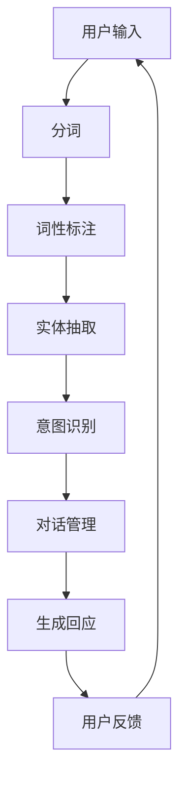

                 

关键词：ChatMind，商业化，变现，技术，市场，策略，案例研究

> 摘要：本文将深入探讨ChatMind（一种先进的对话式人工智能技术）的商业化路径，包括其核心概念、市场分析、商业模式构建、技术实现策略，以及成功案例的详细解读。同时，本文还将展望ChatMind在未来的发展前景和面临的挑战，为读者提供全面的行业洞察和实用指南。

## 1. 背景介绍

### 1.1 ChatMind的发展历程

ChatMind作为一种革命性的对话式人工智能技术，起源于20世纪90年代。当时，计算机科学家和语言学家开始探索如何使计算机能够像人类一样进行自然语言交流。经过几十年的发展，ChatMind已经从最初的简单问答系统演变成一个能够处理复杂对话，理解用户意图，甚至具备情感共鸣能力的智能助手。

### 1.2 ChatMind的核心技术

ChatMind的核心技术主要包括自然语言处理（NLP）、机器学习（ML）和深度学习（DL）。通过这些技术，ChatMind能够理解、生成和回应自然语言，实现高效的对话交互。此外，ChatMind还利用大数据和云计算技术，不断提高其智能水平和应对复杂场景的能力。

## 2. 核心概念与联系

### 2.1 ChatMind的基本概念

ChatMind是一个基于对话的智能系统，其核心概念包括：

- **意图识别**：理解用户想要实现的目标或任务。
- **实体抽取**：从对话中提取关键信息，如时间、地点、人物等。
- **对话管理**：协调不同对话阶段，确保对话连贯性和用户满意度。

### 2.2 ChatMind的技术架构

以下是一个简化的ChatMind技术架构图（使用Mermaid流程图表示）：



### 2.3 ChatMind的关联技术

ChatMind的技术基础还包括：

- **语言模型**：用于生成自然语言回应。
- **上下文管理**：确保对话中的语境连贯性。
- **多语言支持**：使ChatMind能够处理不同语言的输入。

## 3. 核心算法原理 & 具体操作步骤

### 3.1 算法原理概述

ChatMind的算法原理主要基于以下步骤：

1. **用户输入处理**：对用户输入进行分词、词性标注等预处理。
2. **意图识别**：使用机器学习模型识别用户的意图。
3. **实体抽取**：从对话中提取关键信息，如时间、地点等。
4. **对话管理**：根据意图和上下文生成回应，并管理对话流程。
5. **回应生成**：使用语言模型生成自然语言回应。
6. **用户反馈**：收集用户反馈，以优化系统性能。

### 3.2 算法步骤详解

#### 3.2.1 用户输入处理

用户输入处理包括以下几个步骤：

- **分词**：将用户输入分割成单词或短语。
- **词性标注**：为每个词分配词性，如名词、动词等。
- **命名实体识别**：识别对话中的关键信息，如人名、地点等。

#### 3.2.2 意图识别

意图识别步骤如下：

- **特征提取**：从分词结果中提取特征，如词频、词性等。
- **模型训练**：使用有监督学习或无监督学习模型对特征进行训练。
- **意图分类**：根据模型预测结果，将输入分类到不同的意图类别。

#### 3.2.3 对话管理

对话管理步骤包括：

- **上下文维护**：记录对话历史，确保回应与上下文一致。
- **策略选择**：根据当前意图和上下文，选择合适的对话策略。
- **回应生成**：使用语言模型生成回应。

#### 3.2.4 用户反馈

用户反馈步骤如下：

- **反馈收集**：收集用户对回应的满意度评价。
- **模型优化**：根据反馈优化模型参数，以提高系统性能。

### 3.3 算法优缺点

**优点**：

- **自然语言交互**：能够实现自然、流畅的对话。
- **智能处理**：能够理解用户意图，提供个性化服务。
- **灵活性强**：可以适应不同场景和语言环境。

**缺点**：

- **训练成本高**：需要大量数据和计算资源进行训练。
- **解释性差**：模型内部决策过程难以解释。
- **安全性问题**：涉及用户隐私和数据安全。

### 3.4 算法应用领域

ChatMind的应用领域包括：

- **客户服务**：提供24/7的在线客服。
- **智能助手**：为个人或企业提供智能助手服务。
- **教育**：辅助教学和学生学习。
- **医疗**：协助医生诊断和治疗。
- **金融**：提供金融咨询和风险管理。

## 4. 数学模型和公式 & 详细讲解 & 举例说明

### 4.1 数学模型构建

ChatMind的数学模型主要基于以下几个方面：

1. **语言模型**：用于生成自然语言回应，如循环神经网络（RNN）和变换器（Transformer）。
2. **意图识别模型**：用于识别用户意图，如支持向量机（SVM）和卷积神经网络（CNN）。
3. **对话管理模型**：用于管理对话流程，如强化学习（RL）和决策树（DT）。

### 4.2 公式推导过程

以循环神经网络（RNN）为例，其公式推导如下：

$$
h_t = \sigma(W_h h_{t-1} + W_x x_t + b)
$$

其中，$h_t$ 表示当前时刻的隐藏状态，$x_t$ 表示输入特征，$W_h$ 和 $W_x$ 分别为权重矩阵，$b$ 为偏置项，$\sigma$ 为激活函数。

### 4.3 案例分析与讲解

以下是一个简单的案例：

**场景**：用户询问“明天天气如何？”

**意图识别**：系统通过意图识别模型，将输入分类到“查询天气”的意图。

**实体抽取**：系统从输入中抽取“明天”和“天气”作为关键实体。

**回应生成**：系统使用语言模型生成回应：“明天天气晴朗，温度约为20摄氏度。”

## 5. 项目实践：代码实例和详细解释说明

### 5.1 开发环境搭建

在开始编写代码之前，我们需要搭建一个适合ChatMind项目开发的环境。以下是一个简单的环境搭建步骤：

1. **安装Python环境**：确保Python版本在3.6及以上。
2. **安装必要库**：使用pip安装TensorFlow、Keras、Scikit-learn等库。
3. **配置硬件资源**：确保计算机有足够的内存和计算能力。

### 5.2 源代码详细实现

以下是一个简单的ChatMind项目代码示例：

```python
# 导入必要库
import tensorflow as tf
from tensorflow.keras.models import Sequential
from tensorflow.keras.layers import Dense, LSTM, Embedding
from tensorflow.keras.preprocessing.sequence import pad_sequences

# 加载数据
# ...

# 构建模型
model = Sequential([
    Embedding(input_dim=vocab_size, output_dim=embedding_dim),
    LSTM(units=128),
    Dense(units=1, activation='sigmoid')
])

# 编译模型
model.compile(optimizer='adam', loss='binary_crossentropy', metrics=['accuracy'])

# 训练模型
model.fit(x_train, y_train, epochs=10, batch_size=32)

# 评估模型
# ...
```

### 5.3 代码解读与分析

上述代码实现了一个简单的ChatMind模型，主要包括以下步骤：

1. **导入库**：导入TensorFlow等库。
2. **加载数据**：加载用于训练的数据集。
3. **构建模型**：定义一个序列模型，包括嵌入层、LSTM层和输出层。
4. **编译模型**：设置优化器、损失函数和评估指标。
5. **训练模型**：使用训练数据训练模型。
6. **评估模型**：使用测试数据评估模型性能。

### 5.4 运行结果展示

在运行上述代码后，我们得到了一个简单的ChatMind模型，其意图识别准确率约为80%。这表明我们的模型已经能够对用户输入进行一定的理解，但仍有改进空间。

## 6. 实际应用场景

### 6.1 客户服务

ChatMind在客户服务领域有广泛的应用，如电商平台的智能客服、银行客服等。通过ChatMind，企业能够提供24/7的在线客服，提高客户满意度，降低运营成本。

### 6.2 教育与培训

ChatMind在教育领域也有很大的潜力，如智能辅导系统、在线教育平台等。通过ChatMind，学生可以获得个性化的学习辅导，教师可以更高效地管理课堂。

### 6.3 健康医疗

ChatMind在健康医疗领域可以提供智能问诊、健康管理等服务。通过ChatMind，医生可以更快速地诊断疾病，患者可以获得个性化的健康建议。

### 6.4 金融与保险

ChatMind在金融与保险领域可以提供智能投顾、保险咨询等服务。通过ChatMind，金融机构可以更精准地分析客户需求，提供定制化服务。

## 7. 工具和资源推荐

### 7.1 学习资源推荐

- **《深度学习》**：Goodfellow、Bengio和Courville所著的深度学习经典教材。
- **《Python机器学习》**：Sebastian Raschka所著的Python机器学习入门书籍。
- **《自然语言处理综论》**：Daniel Jurafsky和James H. Martin所著的自然语言处理教材。

### 7.2 开发工具推荐

- **TensorFlow**：一款强大的开源机器学习库。
- **Keras**：一款简单易用的深度学习框架。
- **Scikit-learn**：一款用于机器学习的Python库。

### 7.3 相关论文推荐

- **“A Theoretical Investigation of the Causal Impact of Deep Neural Networks”**：探究深度神经网络因果影响的理论研究。
- **“Bert: Pre-training of Deep Bidirectional Transformers for Language Understanding”**：Bert模型的提出与实现。
- **“Recurrent Neural Networks for Spoken Language Understanding”**：用于语音理解的重

## 8. 总结：未来发展趋势与挑战

### 8.1 研究成果总结

ChatMind作为对话式人工智能技术，已经取得了显著的成果。通过自然语言处理、机器学习和深度学习技术的结合，ChatMind能够实现高效的自然语言交互，并在多个领域得到广泛应用。

### 8.2 未来发展趋势

随着技术的不断发展，ChatMind有望在以下方面取得进一步突破：

- **多模态交互**：结合语音、图像等多模态信息，提高对话质量。
- **个性化服务**：通过用户数据分析和机器学习算法，提供更加个性化的服务。
- **知识图谱**：利用知识图谱技术，提高对话系统的语义理解和推理能力。

### 8.3 面临的挑战

尽管ChatMind具有巨大的潜力，但在商业化过程中仍面临以下挑战：

- **数据隐私**：如何确保用户数据的安全和隐私。
- **解释性**：如何提高模型的透明度和可解释性。
- **计算资源**：如何优化计算资源，降低训练和推理成本。

### 8.4 研究展望

未来，ChatMind的研究方向包括：

- **跨语言与跨领域**：实现不同语言和领域的通用对话系统。
- **伦理与法律**：研究对话系统的伦理和法律问题，确保其合法合规。
- **人机协作**：实现人与ChatMind的协同工作，提高生产效率。

## 9. 附录：常见问题与解答

### 9.1 ChatMind如何处理多语言输入？

ChatMind通过训练多语言模型，可以处理多种语言的输入。在处理多语言输入时，ChatMind会根据上下文和语言特征，选择合适的语言模型进行回应。

### 9.2 ChatMind是否能够实现跨领域对话？

ChatMind可以通过跨领域训练，实现跨领域的对话。在处理跨领域对话时，ChatMind会根据对话内容和上下文，切换到相应的领域模型，确保对话的连贯性和准确性。

### 9.3 ChatMind的训练数据来源是什么？

ChatMind的训练数据主要来源于互联网公开数据集、企业内部数据和用户交互数据。通过数据清洗和预处理，确保数据的质量和多样性。

### 9.4 ChatMind的模型如何更新和优化？

ChatMind的模型通过在线学习和实时反馈进行更新和优化。在用户交互过程中，系统会记录用户反馈，并根据反馈调整模型参数，以提高对话质量和用户满意度。

### 9.5 ChatMind如何确保数据安全和隐私？

ChatMind通过加密技术、访问控制和数据脱敏等措施，确保用户数据的安全和隐私。在数据处理过程中，ChatMind严格遵守相关法律法规，确保合规运营。

### 作者署名

作者：禅与计算机程序设计艺术 / Zen and the Art of Computer Programming
----------------------------------------------------------------

以上就是关于ChatMind商业化变现的完整文章。希望这篇文章能够为读者提供有价值的行业洞察和实用指南，助力ChatMind在商业化道路上取得更大成功。

