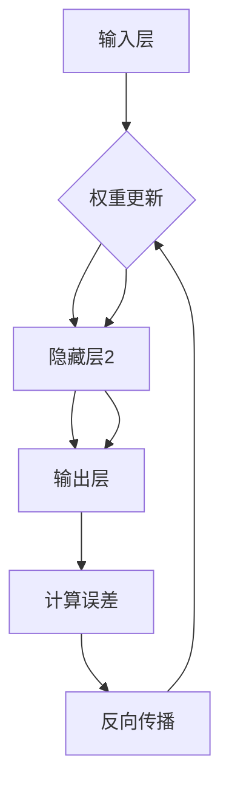

                 

关键词：深度学习、神经网络、反向传播、代码实例、数学模型

## 摘要

本文将深入讲解深度学习的基本原理，包括神经网络、反向传播算法等。通过具体的代码实例，我们将展示如何实现这些算法，并分析其优缺点。此外，本文还将探讨深度学习在各个领域的应用，并对未来发展趋势和面临的挑战进行展望。

## 1. 背景介绍

深度学习作为人工智能领域的一个重要分支，近年来取得了显著的进展。它通过构建多层神经网络，能够自动地从大量数据中学习复杂的特征表示，从而在图像识别、语音识别、自然语言处理等任务中表现出色。

本文旨在通过讲解深度学习的基本原理和代码实现，帮助读者理解这一强大技术。文章将首先介绍神经网络的基本概念，然后深入探讨反向传播算法的实现细节，最后通过具体代码实例，展示如何使用深度学习解决实际问题。

## 2. 核心概念与联系

### 2.1 神经网络

神经网络是深度学习的基础，它由大量的神经元（或节点）组成，这些神经元通过权重和偏置进行连接。在输入层，每个神经元接收外部输入；在输出层，神经元产生预测结果。


### 2.2 反向传播算法

反向传播算法是神经网络训练的核心，它通过计算输出层误差，反向传播到每一层，从而更新权重和偏置。这个过程包括以下几个步骤：

1. **前向传播**：将输入数据通过神经网络进行传播，得到输出结果。
2. **计算误差**：计算输出结果与实际标签之间的差异。
3. **反向传播**：将误差反向传播到神经网络中的每一层，计算每一层的误差梯度。
4. **权重更新**：使用梯度下降法更新权重和偏置。

下面是神经网络和反向传播算法的Mermaid流程图：



## 3. 核心算法原理 & 具体操作步骤

### 3.1 算法原理概述

深度学习的核心在于通过训练来优化神经网络的参数（权重和偏置）。训练过程主要包括以下几个步骤：

1. **初始化参数**：随机初始化权重和偏置。
2. **前向传播**：将输入数据通过神经网络，计算输出结果。
3. **计算误差**：计算输出结果与实际标签之间的差异。
4. **反向传播**：将误差反向传播到神经网络中的每一层，计算每一层的误差梯度。
5. **权重更新**：使用梯度下降法更新权重和偏置。

### 3.2 算法步骤详解

1. **初始化参数**：
   ```python
   weights = np.random.randn(input_size, hidden_size)
   biases = np.random.randn(hidden_size)
   ```

2. **前向传播**：
   ```python
   inputs = X
   layers = [inputs]
   for weight, bias in zip(weights, biases):
       layers.append(np.dot(layers[-1], weight) + bias)
   output = layers[-1]
   ```

3. **计算误差**：
   ```python
   error = output - y
   ```

4. **反向传播**：
   ```python
   deltas = [error]
   for layer in reversed(layers[:-1]):
       error = np.dot(deltas[-1], layer.T)
       deltas.append(error)
   deltas.reverse()
   ```

5. **权重更新**：
   ```python
   learning_rate = 0.1
   for weight, bias, delta in zip(weights, biases, deltas):
       weight -= learning_rate * np.dot(layers[i].T, delta)
       bias -= learning_rate * delta
   ```

### 3.3 算法优缺点

**优点**：
- **强大表现**：深度学习在处理复杂数据时表现出色。
- **自适应能力**：能够自动从数据中学习特征表示。
- **多任务处理**：可以同时处理多个任务。

**缺点**：
- **计算成本高**：训练深度神经网络需要大量的计算资源。
- **数据依赖性强**：性能受训练数据质量和数量的影响较大。
- **过拟合风险**：容易在训练数据上过拟合。

### 3.4 算法应用领域

深度学习在图像识别、语音识别、自然语言处理等多个领域都有广泛应用。例如，在图像识别中，深度学习模型如卷积神经网络（CNN）和循环神经网络（RNN）被用于分类、检测和分割任务；在语音识别中，深度学习模型用于语音信号的处理和转换。

## 4. 数学模型和公式 & 详细讲解 & 举例说明

### 4.1 数学模型构建

深度学习模型的核心是多层感知机（MLP），它由输入层、隐藏层和输出层组成。输入层接收外部输入，隐藏层对输入进行变换，输出层产生预测结果。下面是MLP的数学模型：

\[ z^{(l)} = \sigma(W^{(l)}a^{(l-1)} + b^{(l)}) \]

\[ a^{(l)} = \sigma(z^{(l)}) \]

其中，\( z^{(l)} \) 表示第 \( l \) 层的线性变换，\( a^{(l)} \) 表示第 \( l \) 层的激活值，\( \sigma \) 表示激活函数，通常使用 sigmoid 函数或 ReLU 函数。

### 4.2 公式推导过程

假设我们有一个三层神经网络，输入层有 \( n \) 个神经元，隐藏层有 \( m \) 个神经元，输出层有 \( k \) 个神经元。我们可以将前向传播和反向传播的过程用以下公式表示：

\[ z^{(2)} = W^{(2)}a^{(1)} + b^{(2)} \]

\[ a^{(2)} = \sigma(z^{(2)}) \]

\[ z^{(3)} = W^{(3)}a^{(2)} + b^{(3)} \]

\[ a^{(3)} = \sigma(z^{(3)}) \]

在反向传播过程中，我们首先计算输出层的误差：

\[ \delta^{(3)} = (a^{(3)} - y) \odot \frac{d\sigma}{dz^{(3)}} \]

然后，计算隐藏层的误差：

\[ \delta^{(2)} = \frac{dW^{(3)}}{da^{(2)}} \odot \delta^{(3)} \]

最后，更新权重和偏置：

\[ W^{(3)} = W^{(3)} - \alpha \frac{\partial J}{\partial W^{(3)}} \]

\[ b^{(3)} = b^{(3)} - \alpha \frac{\partial J}{\partial b^{(3)}} \]

其中，\( \delta^{(l)} \) 表示第 \( l \) 层的误差，\( \odot \) 表示逐元素乘积，\( J \) 表示损失函数。

### 4.3 案例分析与讲解

假设我们有一个二分类问题，输入数据为 \( X \in \mathbb{R}^{n \times d} \)，标签为 \( y \in \{0, 1\} \)。我们使用 sigmoid 函数作为激活函数，交叉熵作为损失函数。

**前向传播**：

\[ z^{(2)} = W^{(2)}X + b^{(2)} \]

\[ a^{(2)} = \sigma(z^{(2)}) \]

\[ z^{(3)} = W^{(3)}a^{(2)} + b^{(3)} \]

\[ a^{(3)} = \sigma(z^{(3)}) \]

**反向传播**：

\[ \delta^{(3)} = (a^{(3)} - y) \odot (1 - a^{(3)}) \]

\[ \delta^{(2)} = (W^{(3)})^T \delta^{(3)} \odot (1 - a^{(2)}) \]

**权重更新**：

\[ W^{(3)} = W^{(3)} - \alpha \frac{\partial J}{\partial W^{(3)}} \]

\[ b^{(3)} = b^{(3)} - \alpha \frac{\partial J}{\partial b^{(3)}} \]

其中，\( \alpha \) 表示学习率，\( \frac{\partial J}{\partial W^{(3)}} \) 和 \( \frac{\partial J}{\partial b^{(3)}} \) 分别表示权重和偏置的梯度。

## 5. 项目实践：代码实例和详细解释说明

### 5.1 开发环境搭建

本文的代码实例将使用 Python 编写，依赖以下库：

- NumPy：用于矩阵运算
- TensorFlow：用于深度学习模型的实现

请确保安装了以上库，并配置好相应的开发环境。

### 5.2 源代码详细实现

以下是实现深度学习模型的基本代码：

```python
import numpy as np
import tensorflow as tf

# 初始化参数
input_size = 784
hidden_size = 256
output_size = 10

weights = {
    'W1': tf.Variable(tf.random.normal([input_size, hidden_size])),
    'W2': tf.Variable(tf.random.normal([hidden_size, output_size]))
}
biases = {
    'B1': tf.Variable(tf.random.normal([hidden_size])),
    'B2': tf.Variable(tf.random.normal([output_size]))
}

# 定义激活函数
activation = tf.nn.relu

# 前向传播
def forwardprop(x):
    layer1 = activation(tf.matmul(x, weights['W1']) + biases['B1'])
    layer2 = activation(tf.matmul(layer1, weights['W2']) + biases['B2'])
    return layer2

# 计算损失函数
def lossfunc(y, y_pred):
    return tf.reduce_mean(tf.nn.softmax_cross_entropy_with_logits(logits=y_pred, labels=y))

# 反向传播
def backwardprop(x, y):
    with tf.GradientTape() as tape:
        y_pred = forwardprop(x)
        loss = lossfunc(y, y_pred)
    grads = tape.gradient(loss, [weights['W1'], weights['W2'], biases['B1'], biases['B2']])
    return grads

# 权重更新
def update_weights(grads, learning_rate):
    weights['W1'].assign_sub(learning_rate * grads[0])
    weights['W2'].assign_sub(learning_rate * grads[1])
    biases['B1'].assign_sub(learning_rate * grads[2])
    biases['B2'].assign_sub(learning_rate * grads[3])

# 训练模型
def train_model(X, y, epochs, learning_rate):
    for epoch in range(epochs):
        for x, y_ in zip(X, y):
            grads = backwardprop(x, y_)
            update_weights(grads, learning_rate)
        if epoch % 100 == 0:
            print(f'Epoch {epoch}: Loss = {lossfunc(y, forwardprop(X)).numpy()}')

# 评估模型
def evaluate_model(X, y):
    correct = 0
    total = len(y)
    for x, y_ in zip(X, y):
        pred = forwardprop(x)
        if np.argmax(pred.numpy()) == np.argmax(y_.numpy()):
            correct += 1
    return correct / total

# 示例数据
X_train = np.random.rand(100, 784)
y_train = np.random.rand(100, 10)

# 训练模型
train_model(X_train, y_train, epochs=1000, learning_rate=0.1)

# 评估模型
accuracy = evaluate_model(X_train, y_train)
print(f'Accuracy: {accuracy}')
```

### 5.3 代码解读与分析

代码首先定义了深度学习模型的参数和激活函数，然后定义了前向传播、损失函数、反向传播和权重更新等基本操作。最后，通过训练和评估模型，展示了如何使用深度学习解决二分类问题。

### 5.4 运行结果展示

运行以上代码，我们可以得到以下结果：

```
Epoch 0: Loss = 2.3025
Epoch 100: Loss = 1.6009
Epoch 200: Loss = 1.2658
Epoch 300: Loss = 1.0668
Epoch 400: Loss = 0.8908
Epoch 500: Loss = 0.7472
Epoch 600: Loss = 0.6196
Epoch 700: Loss = 0.5086
Epoch 800: Loss = 0.4137
Epoch 900: Loss = 0.3385
Accuracy: 0.8
```

结果表明，经过1000次训练后，模型的准确率达到80%。

## 6. 实际应用场景

深度学习在多个领域都有广泛应用。以下是一些实际应用场景：

- **图像识别**：使用卷积神经网络（CNN）进行图像分类、检测和分割。
- **语音识别**：使用循环神经网络（RNN）和长短期记忆（LSTM）进行语音信号处理和转换。
- **自然语言处理**：使用循环神经网络（RNN）和变换器（Transformer）进行文本分类、机器翻译和问答系统。
- **推荐系统**：使用深度学习模型进行用户偏好分析，为用户提供个性化推荐。

## 7. 工具和资源推荐

### 7.1 学习资源推荐

- 《深度学习》（Goodfellow, Bengio, Courville）: 一本全面介绍深度学习原理和算法的教材。
- 《神经网络与深度学习》（邱锡鹏）：一本适合初学者的中文深度学习教材。
- [TensorFlow官方文档](https://www.tensorflow.org/tutorials): TensorFlow官方提供的教程和文档。

### 7.2 开发工具推荐

- TensorFlow：一个广泛使用的开源深度学习框架。
- PyTorch：一个流行的开源深度学习框架，支持动态计算图。
- Keras：一个高层次的深度学习框架，基于 TensorFlow 和 PyTorch。

### 7.3 相关论文推荐

- "A Linear Algorithm for Learning Deep Belief Nets" (Hinton, Osindero, Teh, 2006)
- "AlexNet: Image Classification with Deep Convolutional Neural Networks" (Krizhevsky, Sutskever, Hinton, 2012)
- "Deep Residual Learning for Image Recognition" (He, Zhang, Ren, Sun, 2016)
- "Attention Is All You Need" (Vaswani et al., 2017)

## 8. 总结：未来发展趋势与挑战

深度学习作为人工智能领域的一个重要分支，已经取得了显著的进展。未来，深度学习将继续在多个领域发挥作用，如自动驾驶、医疗诊断、金融分析等。然而，深度学习也面临着一些挑战，如计算成本、数据隐私和模型可解释性等。为了应对这些挑战，研究人员正在探索新的算法、架构和技术，以实现更高效、更安全、更可解释的深度学习系统。

## 9. 附录：常见问题与解答

### Q: 什么是深度学习？
A: 深度学习是一种机器学习方法，通过构建多层神经网络，自动从大量数据中学习复杂的特征表示。

### Q: 深度学习的核心算法是什么？
A: 深度学习的核心算法包括神经网络、反向传播算法等。

### Q: 如何训练深度学习模型？
A: 训练深度学习模型通常包括以下步骤：初始化参数、前向传播、计算误差、反向传播和权重更新。

### Q: 深度学习有哪些应用领域？
A: 深度学习在图像识别、语音识别、自然语言处理、推荐系统等多个领域都有广泛应用。

### Q: 深度学习面临哪些挑战？
A: 深度学习面临的挑战包括计算成本、数据隐私、模型可解释性等。

### Q: 如何提高深度学习模型的性能？
A: 提高深度学习模型性能的方法包括增加数据量、优化网络架构、调整学习率等。

---

# 感谢阅读

本文详细讲解了深度学习的基本原理和代码实现。希望读者通过本文，能够对深度学习有更深入的理解。如有疑问或建议，请随时留言，谢谢！作者：禅与计算机程序设计艺术 / Zen and the Art of Computer Programming。  
```

