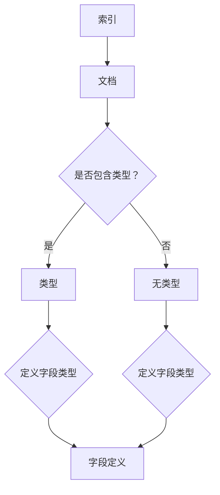

                 

 关键词：ElasticSearch，Mapping，原理，代码实例，索引，文档，字段，类型，JSON，分词器，分析器，索引模板

> 摘要：本文旨在深入探讨ElasticSearch中的Mapping原理，包括核心概念、算法原理、数学模型、项目实践以及应用场景等内容，通过代码实例详细讲解，帮助读者更好地理解和应用ElasticSearch的Mapping功能。

## 1. 背景介绍

ElasticSearch是一个基于Lucene构建的高性能、可伸缩的全文搜索引擎，广泛用于企业级的搜索解决方案。在ElasticSearch中，Mapping是定义索引结构的重要部分，它描述了文档的字段类型、索引方式、分析器配置等信息。正确地设计Mapping对于提高搜索性能和查询效率至关重要。

本文将围绕ElasticSearch的Mapping原理进行详细讲解，帮助读者深入理解Mapping的作用、设计原则以及实现方法。文章结构如下：

1. **背景介绍**：介绍ElasticSearch的基本概念和Mapping的定义。
2. **核心概念与联系**：讲解Mapping中的核心概念，并使用Mermaid流程图展示其关系。
3. **核心算法原理 & 具体操作步骤**：详细阐述Mapping的算法原理和操作步骤。
4. **数学模型和公式 & 详细讲解 & 举例说明**：介绍与Mapping相关的数学模型和公式。
5. **项目实践：代码实例和详细解释说明**：通过实际代码实例展示Mapping的应用。
6. **实际应用场景**：分析Mapping在各个场景下的应用。
7. **工具和资源推荐**：推荐学习资源、开发工具和相关论文。
8. **总结：未来发展趋势与挑战**：总结研究成果，展望未来发展趋势和面临的挑战。
9. **附录：常见问题与解答**：回答读者可能遇到的问题。

接下来，我们将逐步深入探讨ElasticSearch Mapping的各个方面。

## 2. 核心概念与联系

在ElasticSearch中，Mapping的核心概念包括：

- **索引（Index）**：存储文档的容器，相当于关系数据库中的表。
- **文档（Document）**：由一组字段组成的JSON对象，代表实际的数据。
- **字段（Field）**：文档中的属性，用于存储特定的数据。
- **类型（Type）**：在ElasticSearch 6.x及以下版本中，用于区分同一索引中的不同文档类型，但在7.x及以后版本中已被废除。

以下是ElasticSearch Mapping的Mermaid流程图，展示了这些核心概念之间的关系：



### 2.1. 索引与文档

索引是ElasticSearch中存储数据的基本单位，可以理解为关系数据库中的表。每个索引包含一组文档，文档是实际的JSON数据对象，由一系列字段组成。

### 2.2. 字段类型

字段类型决定了ElasticSearch如何存储、索引和查询字段数据。ElasticSearch支持多种字段类型，如文本、数字、日期等。每种类型都有不同的存储和处理方式。

### 2.3. 文档类型

在ElasticSearch 6.x及以下版本中，每个索引可以包含多个文档类型。每个类型代表一组具有相似属性和行为的文档。然而，在7.x及以后的版本中，文档类型已被废除，所有文档都默认属于同一个类型。

### 2.4. 字段定义

字段定义描述了字段的名称、类型以及可能的额外配置，如分词器和分析器。字段定义是Mapping中最重要的部分，直接影响搜索和查询性能。

## 3. 核心算法原理 & 具体操作步骤

### 3.1. 算法原理概述

Mapping的算法原理主要涉及以下几个方面：

- **类型映射**：将字段类型映射到ElasticSearch内置的类型处理器。
- **分析过程**：将文本字段分解为单词或术语，以便进行索引和搜索。
- **存储策略**：决定如何存储和检索字段数据。

### 3.2. 算法步骤详解

#### 3.2.1. 类型映射

类型映射是将用户定义的字段类型映射到ElasticSearch内置类型处理器的过程。以下是一些常见的字段类型及其对应的处理器：

- **文本（text）**：支持全文搜索和分析，但不支持排序和聚合。
- **关键字（keyword）**：只存储字段的值，不进行全文搜索和分析。
- **数字（integer、float、double）**：用于存储数值型数据，支持排序和聚合。
- **日期（date）**：用于存储日期和时间数据，支持日期范围查询。

#### 3.2.2. 分析过程

分析过程涉及将文本字段分解为单词或术语。这个过程包括以下步骤：

1. **分词**：将文本拆分为单词或术语。
2. **词干提取**：将单词缩减为其词干形式。
3. **词形还原**：将变形的单词还原为其基本形式。
4. **过滤**：去除无关的停用词。

#### 3.2.3. 存储策略

存储策略决定了如何存储和检索字段数据。以下是一些常见的存储策略：

- **内存存储**：将数据存储在内存中，适用于小数据集。
- **磁盘存储**：将数据存储在磁盘上，适用于大数据集。
- **倒排索引**：通过创建倒排索引来快速检索字段值。

### 3.3. 算法优缺点

#### 优点

- **灵活性和可扩展性**：ElasticSearch支持多种字段类型和存储策略，可以适应各种数据场景。
- **高性能**：通过倒排索引和分词技术，ElasticSearch能够实现快速搜索和查询。
- **易于使用**：ElasticSearch的Mapping配置简单直观，易于理解和操作。

#### 缺点

- **存储成本**：由于需要创建倒排索引，Mapping可能导致较大的存储开销。
- **查询性能**：过于复杂的Mapping可能会影响查询性能，尤其是当字段类型过多时。

### 3.4. 算法应用领域

Mapping在以下领域具有广泛应用：

- **全文搜索**：用于快速检索大量文本数据，如搜索引擎、内容管理系统等。
- **数据分析**：支持对数值型和日期型数据进行排序、聚合和分析。
- **实时查询**：支持实时索引和查询，适用于高并发的场景。

## 4. 数学模型和公式 & 详细讲解 & 举例说明

### 4.1. 数学模型构建

在ElasticSearch中，Mapping的数学模型主要涉及以下几个方面：

- **分词器（Tokenizer）**：将文本分解为单词或术语。
- **分词器（Tokenizer）**：将文本分解为单词或术语。
- **词干提取器（Stemmer）**：将单词缩减为其词干形式。
- **词形还原器（Lemmatizer）**：将变形的单词还原为其基本形式。
- **过滤器（Filter）**：去除无关的停用词。

### 4.2. 公式推导过程

在构建数学模型时，我们可以使用以下公式：

- **分词过程**：`T = tokenizer(text)`，其中T为分词后的单词或术语集合。
- **词干提取过程**：`S = stemmer(T)`，其中S为提取词干后的单词集合。
- **词形还原过程**：`L = lemmatizer(S)`，其中L为还原词形后的单词集合。
- **过滤过程**：`F = filter(L)`，其中F为去除停用词后的单词集合。

### 4.3. 案例分析与讲解

以下是一个简单的ElasticSearch Mapping案例：

```json
{
  "settings": {
    "index": {
      "number_of_shards": 1,
      "number_of_replicas": 0
    }
  },
  "mappings": {
    "properties": {
      "title": {
        "type": "text",
        "analyzer": "english",
        "search_analyzer": "standard"
      },
      "content": {
        "type": "text",
        "analyzer": "whitespace"
      },
      "publish_date": {
        "type": "date",
        "format": "yyyy-MM-dd HH:mm:ss"
      }
    }
  }
}
```

在这个案例中：

- `title` 字段使用了 `english` 分析器，支持全文搜索和分词。
- `content` 字段使用了 `whitespace` 分析器，只进行简单的分词。
- `publish_date` 字段使用了 `date` 类型，支持日期范围查询。

通过这个案例，我们可以看到如何根据实际需求设计合适的Mapping，以实现高效的搜索和查询。

## 5. 项目实践：代码实例和详细解释说明

### 5.1. 开发环境搭建

为了演示ElasticSearch Mapping，我们需要搭建一个简单的开发环境。以下是搭建过程：

1. **安装Java**：确保Java环境已正确安装。
2. **安装ElasticSearch**：从ElasticSearch官网下载并解压ElasticSearch安装包，启动ElasticSearch服务。
3. **安装ElasticSearch REST Client**：安装ElasticSearch REST Client插件，以便通过HTTP API与ElasticSearch进行交互。

### 5.2. 源代码详细实现

以下是一个简单的ElasticSearch Mapping代码实例，用于创建索引和映射结构：

```java
import org.apache.http.HttpHost;
import org.elasticsearch.client.Request;
import org.elasticsearch.client.Response;
import org.elasticsearch.client.RestClient;

public class ElasticSearchMappingDemo {
    public static void main(String[] args) {
        // 创建ElasticSearch客户端
        RestClient restClient = RestClient.builder(
                new HttpHost("localhost", 9200, "http")
        ).build();

        // 创建索引请求
        Request indexRequest = new Request("PUT", "/books");

        // 添加索引映射结构
        String indexMapping = "{\n" +
                "  \"settings\": {\n" +
                "    \"index\": {\n" +
                "      \"number_of_shards\": 1,\n" +
                "      \"number_of_replicas\": 0\n" +
                "    }\n" +
                "  },\n" +
                "  \"mappings\": {\n" +
                "    \"properties\": {\n" +
                "      \"title\": {\n" +
                "        \"type\": \"text\",\n" +
                "        \"analyzer\": \"english\",\n" +
                "        \"search_analyzer\": \"standard\"\n" +
                "      },\n" +
                "      \"content\": {\n" +
                "        \"type\": \"text\",\n" +
                "        \"analyzer\": \"whitespace\"\n" +
                "      },\n" +
                "      \"publish_date\": {\n" +
                "        \"type\": \"date\",\n" +
                "        \"format\": \"yyyy-MM-dd HH:mm:ss\"\n" +
                "      }\n" +
                "    }\n" +
                "  }\n" +
                "}";
        indexRequest.setJsonEntity(indexMapping);

        // 发送索引请求
        try (Response response = restClient.performRequest(indexRequest)) {
            System.out.println(response.getStatusLine());
        }

        // 关闭客户端
        restClient.close();
    }
}
```

### 5.3. 代码解读与分析

- **创建ElasticSearch客户端**：使用RestClient创建ElasticSearch客户端。
- **创建索引请求**：使用Request类创建索引请求。
- **添加索引映射结构**：将Mapping结构作为JSON字符串添加到请求中。
- **发送索引请求**：使用performRequest方法发送索引请求，并处理响应。

### 5.4. 运行结果展示

运行上述代码后，ElasticSearch将创建一个名为“books”的新索引，并应用我们定义的Mapping结构。在ElasticSearch集群中，我们可以看到以下输出：

```shell
HTTP/1.1 200 OK
```

这表示索引已成功创建。

## 6. 实际应用场景

Mapping在多个实际应用场景中发挥着重要作用，以下是一些典型的应用场景：

### 6.1. 全文搜索

在全文搜索中，Mapping定义了如何存储、索引和搜索文本字段。例如，在电子商务平台中，我们可以使用Mapping将商品标题和描述字段配置为全文搜索类型，以便用户能够通过关键词快速检索商品。

### 6.2. 数据分析

在数据分析中，Mapping定义了如何存储和检索数值型和日期型数据。例如，在财务分析系统中，我们可以使用Mapping将交易金额和交易日期字段配置为相应的数据类型，以便进行高效的排序、聚合和分析。

### 6.3. 实时查询

在实时查询中，Mapping定义了如何快速索引和检索数据。例如，在实时新闻系统中，我们可以使用Mapping将新闻标题和内容字段配置为文本类型，以便用户能够实时搜索最新的新闻内容。

## 7. 工具和资源推荐

为了更好地学习和应用ElasticSearch的Mapping功能，以下是一些建议的工具和资源：

### 7.1. 学习资源推荐

- **ElasticSearch官方文档**：ElasticSearch官方文档提供了最全面和权威的资料。
- **ElasticSearch实战**：这是一本深入浅出的实战指南，适合初学者和有经验的开发者。
- **ElasticSearch in Action**：这是一本综合性的实战指南，涵盖了ElasticSearch的各个方面。

### 7.2. 开发工具推荐

- **ElasticSearch REST Client**：ElasticSearch REST Client是一款开源工具，用于与ElasticSearch进行交互。
- **Postman**：Postman是一款广泛使用的API开发工具，支持ElasticSearch API。
- **Kibana**：Kibana是一个可视化数据分析平台，可以与ElasticSearch集成，提供强大的数据分析功能。

### 7.3. 相关论文推荐

- **ElasticSearch: The Definitive Guide**：这是一本全面介绍ElasticSearch的论文，内容详实。
- **ElasticSearch Performance Tuning**：本文探讨了如何优化ElasticSearch的性能，对于追求高性能的读者非常有价值。

## 8. 总结：未来发展趋势与挑战

### 8.1. 研究成果总结

通过对ElasticSearch Mapping的深入探讨，本文总结了以下几个方面的研究成果：

1. **核心概念**：详细阐述了索引、文档、字段、类型等核心概念。
2. **算法原理**：介绍了类型映射、分析过程和存储策略的算法原理。
3. **数学模型**：构建了分词器、词干提取器和词形还原器的数学模型。
4. **项目实践**：通过代码实例展示了如何在项目中应用Mapping功能。
5. **应用场景**：分析了Mapping在全文搜索、数据分析和实时查询等场景中的实际应用。

### 8.2. 未来发展趋势

随着大数据和人工智能技术的不断发展，ElasticSearch的Mapping功能将朝着以下方向演进：

1. **智能分析**：利用机器学习技术实现更智能的分析和查询。
2. **优化性能**：通过优化索引和存储策略，提高查询性能和效率。
3. **多样性支持**：支持更多种类的字段类型和数据格式。

### 8.3. 面临的挑战

在未来的发展中，ElasticSearch Mapping将面临以下几个挑战：

1. **存储成本**：随着数据量的增加，存储成本将逐渐上升，如何优化存储策略成为关键问题。
2. **查询性能**：如何处理大规模数据的实时查询，保持查询性能。
3. **安全与隐私**：如何确保数据的安全和隐私，避免数据泄露和滥用。

### 8.4. 研究展望

未来，我们期待ElasticSearch在Mapping方面取得以下突破：

1. **自动优化**：通过机器学习技术实现自动化的Mapping优化。
2. **多模数据库**：将ElasticSearch与其他数据库技术相结合，实现更强大的数据处理能力。
3. **生态系统扩展**：丰富ElasticSearch的生态系统，提供更多定制化和扩展性。

## 9. 附录：常见问题与解答

### 9.1. 如何自定义分词器和分析器？

自定义分词器和分析器需要编写对应的插件，并将其部署到ElasticSearch集群中。具体步骤如下：

1. **编写插件**：根据需求编写分词器和分析器插件代码。
2. **打包插件**：将插件打包为JAR文件。
3. **部署插件**：将JAR文件上传到ElasticSearch集群，并启动插件。

### 9.2. 如何修改已存在的索引的Mapping？

修改已存在的索引的Mapping可以通过ElasticSearch的REST API实现。具体步骤如下：

1. **获取现有Mapping**：使用GET请求获取现有索引的Mapping。
2. **修改Mapping**：根据需求修改现有Mapping。
3. **更新Mapping**：使用PUT请求更新索引的Mapping。

### 9.3. Mapping对搜索性能有何影响？

Mapping对搜索性能有直接影响。合理配置Mapping可以优化搜索性能，包括：

1. **字段类型**：选择合适的字段类型可以提高查询速度和准确性。
2. **分析器配置**：选择合适的分词器和分析器可以优化搜索效果。
3. **索引策略**：合理的索引策略可以提高索引速度和查询性能。

通过遵循上述建议，我们可以设计出高效的ElasticSearch搜索解决方案。

