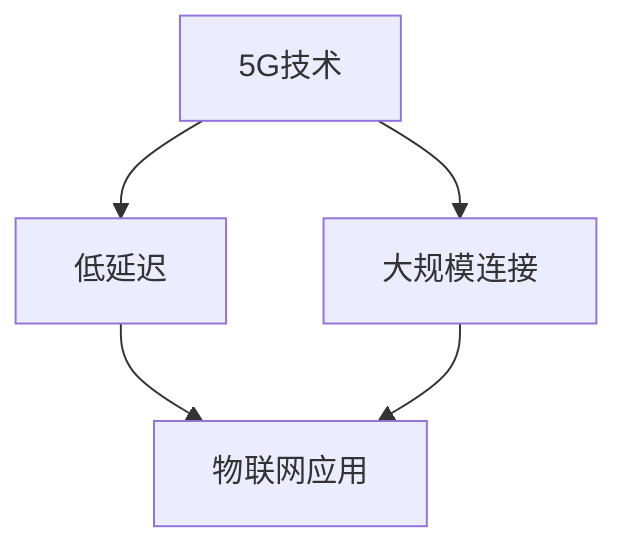

                 

关键词：5G，物联网，低延迟，大规模连接，应用场景，未来展望

> 摘要：随着5G技术的逐渐普及，物联网（IoT）迎来了全新的发展机遇。本文将深入探讨5G在物联网中的低延迟和大规模连接优势，分析其应用场景，并提出未来展望。

## 1. 背景介绍

物联网（IoT）是指将各种物理设备、传感器、软件和网络连接起来，实现信息交换和智能处理。随着互联网的普及和信息技术的不断发展，物联网已经成为现代生活的重要组成部分。然而，传统的网络技术如4G存在一些局限性，例如低带宽、高延迟等问题，限制了物联网的进一步发展。

### 1.1 5G技术概述

5G（第五代移动通信技术）是移动通信技术的一次重大变革，其设计目标是提供更高的数据速率、更低的延迟和更大的连接容量。5G技术采用了新的频谱资源、多连接技术、网络切片等技术，为物联网提供了强大的支持。

## 2. 核心概念与联系

### 2.1 低延迟

低延迟是5G技术的一个重要特征，它指的是数据从发送端到接收端所需的时间。在物联网应用中，低延迟至关重要，例如自动驾驶、工业自动化、远程医疗等场景，对实时性的要求非常高。

### 2.2 大规模连接

5G技术的另一个重要特征是能够支持大规模设备连接。传统网络技术通常只能支持数千个设备连接，而5G技术则能够支持数十万个设备同时在线，这对于物联网的广泛部署和普及具有重要意义。

### 2.3 Mermaid 流程图



## 3. 核心算法原理 & 具体操作步骤

### 3.1 算法原理概述

5G技术在物联网中的应用主要依赖于以下几个核心算法：

- **多连接技术**：通过在单个基站上支持多个用户设备连接，提高网络资源利用率。
- **网络切片**：将网络资源划分为多个虚拟网络，以满足不同应用场景的需求。
- **边缘计算**：将计算任务从云端转移到网络边缘，降低延迟并提高响应速度。

### 3.2 算法步骤详解

1. **多连接技术**：
   - 基站检测到多个设备连接请求。
   - 基站分配不同的频谱资源给每个设备。
   - 设备通过分配的频谱资源进行数据传输。

2. **网络切片**：
   - 基站根据应用需求创建多个虚拟网络。
   - 设备根据应用需求选择合适的虚拟网络。
   - 虚拟网络为设备提供定制化的网络服务。

3. **边缘计算**：
   - 基站或网络边缘节点接收计算任务。
   - 计算任务在网络边缘进行本地处理。
   - 处理结果返回给设备或云端。

### 3.3 算法优缺点

- **多连接技术**：优点是提高了网络资源利用率，缺点是增加了网络复杂度和维护难度。
- **网络切片**：优点是提高了网络灵活性，缺点是增加了网络管理和维护成本。
- **边缘计算**：优点是降低了延迟，提高了响应速度，缺点是增加了计算资源和维护成本。

### 3.4 算法应用领域

- **多连接技术**：适用于智能家居、智慧城市等场景。
- **网络切片**：适用于工业物联网、自动驾驶等场景。
- **边缘计算**：适用于智能医疗、远程控制等场景。

## 4. 数学模型和公式 & 详细讲解 & 举例说明

### 4.1 数学模型构建

在5G物联网中，数据传输速率、连接延迟和连接容量是三个关键指标。以下是这三个指标的数学模型：

1. **数据传输速率**：
   $$ R = \frac{B \cdot W}{N} $$
   其中，\( R \) 表示数据传输速率，\( B \) 表示带宽，\( W \) 表示传输宽度，\( N \) 表示传输次数。

2. **连接延迟**：
   $$ L = \frac{D}{S} $$
   其中，\( L \) 表示连接延迟，\( D \) 表示传输距离，\( S \) 表示传输速度。

3. **连接容量**：
   $$ C = \frac{N \cdot B}{L} $$
   其中，\( C \) 表示连接容量，\( N \) 表示连接数，\( B \) 表示带宽，\( L \) 表示连接延迟。

### 4.2 公式推导过程

1. **数据传输速率**：
   数据传输速率 \( R \) 是带宽 \( B \)、传输宽度 \( W \) 和传输次数 \( N \) 的函数。带宽 \( B \) 是网络传输通道的宽度，传输宽度 \( W \) 是每次传输的数据量，传输次数 \( N \) 是数据传输的总次数。因此，数据传输速率可以表示为：
   $$ R = \frac{B \cdot W}{N} $$

2. **连接延迟**：
   连接延迟 \( L \) 是传输距离 \( D \) 和传输速度 \( S \) 的函数。传输距离 \( D \) 是数据传输所需经过的距离，传输速度 \( S \) 是数据传输的速度。因此，连接延迟可以表示为：
   $$ L = \frac{D}{S} $$

3. **连接容量**：
   连接容量 \( C \) 是连接数 \( N \)、带宽 \( B \) 和连接延迟 \( L \) 的函数。连接数 \( N \) 是同时连接的设备数，带宽 \( B \) 是网络的总带宽，连接延迟 \( L \) 是每次连接的延迟。因此，连接容量可以表示为：
   $$ C = \frac{N \cdot B}{L} $$

### 4.3 案例分析与讲解

假设一个5G基站支持100个设备同时连接，带宽为1Gbps，传输距离为10km，传输速度为200Mbps。根据上述数学模型，我们可以计算出数据传输速率、连接延迟和连接容量：

1. **数据传输速率**：
   $$ R = \frac{1 \times 10^9}{1 \times 10^9} = 1 \text{ Gbps} $$

2. **连接延迟**：
   $$ L = \frac{10 \times 10^3}{200 \times 10^6} = 0.05 \text{ s} $$

3. **连接容量**：
   $$ C = \frac{100 \times 1 \times 10^9}{0.05} = 2 \times 10^{11} $$

这意味着，在上述条件下，该5G基站可以同时支持100个设备以1Gbps的速率传输数据，连接延迟为0.05秒，连接容量为200亿个连接。

## 5. 项目实践：代码实例和详细解释说明

### 5.1 开发环境搭建

为了更好地展示5G在物联网中的应用，我们将使用Python编程语言和相关的库来搭建一个简单的物联网应用场景。以下是搭建开发环境所需的步骤：

1. 安装Python：确保已安装Python 3.7或更高版本。
2. 安装相关库：使用pip命令安装以下库：`requests`、`paho-mqtt`、`json`、`time`。

### 5.2 源代码详细实现

以下是一个简单的物联网应用示例，用于模拟一个设备发送传感器数据到云端的场景：

```python
import paho.mqtt.client as mqtt
import json
import time

# MQTT服务器地址和端口
MQTT_SERVER = "iot-server.example.com"
MQTT_PORT = 1883

# 设备ID
DEVICE_ID = "device-001"

# MQTT客户端初始化
client = mqtt.Client(DEVICE_ID)

# 连接到MQTT服务器
client.connect(MQTT_SERVER, MQTT_PORT, 60)

# 订阅主题
client.subscribe("iot/data")

# 发布传感器数据
def publish_data(sensor_data):
    topic = "iot/data"
    payload = json.dumps(sensor_data)
    client.publish(topic, payload)

# 数据采集和发布循环
while True:
    # 生成传感器数据
    sensor_data = {
        "temperature": 25,
        "humidity": 50,
        "pressure": 1013
    }

    # 发布传感器数据
    publish_data(sensor_data)

    # 等待1秒
    time.sleep(1)
```

### 5.3 代码解读与分析

1. **导入库**：首先，导入所需的库，包括`paho.mqtt.client`用于MQTT通信、`json`用于数据序列化、`time`用于时间控制。
2. **MQTT客户端初始化**：使用`paho.mqtt.client`库创建MQTT客户端，并设置设备ID。
3. **连接到MQTT服务器**：使用`connect`方法连接到MQTT服务器。
4. **订阅主题**：使用`subscribe`方法订阅数据主题。
5. **发布传感器数据**：定义`publish_data`函数，用于将传感器数据发布到MQTT服务器。
6. **数据采集和发布循环**：创建一个无限循环，用于模拟传感器数据采集和发布。在每次循环中，生成传感器数据并发布到MQTT服务器，然后等待1秒。

### 5.4 运行结果展示

在运行上述代码后，我们可以看到传感器数据被连续发布到MQTT服务器。这些数据可以在云平台上实时查看和处理，从而实现物联网设备的远程监控和管理。

## 6. 实际应用场景

### 6.1 智能家居

智能家居是5G在物联网中应用的一个重要领域。通过5G网络，用户可以实现远程控制家中的智能设备，如智能灯泡、智能门锁、智能电视等。5G的低延迟特性使得远程控制更加流畅，提高了用户体验。

### 6.2 智慧城市

智慧城市是另一个5G在物联网中的重要应用场景。5G网络可以支持大量的传感器和设备连接，实现对城市交通、环境、安全等方面的实时监控和智能管理。通过5G网络，智慧城市可以更好地应对城市发展和管理的挑战。

### 6.3 智能医疗

智能医疗是5G在物联网中的另一个重要应用领域。通过5G网络，医生可以远程诊断患者病情，实现远程医疗。此外，5G网络还可以支持医疗设备的实时监控和数据传输，提高医疗服务的质量和效率。

## 7. 工具和资源推荐

### 7.1 学习资源推荐

- **《5G物联网：设计与实现》**：这本书详细介绍了5G在物联网中的应用，包括网络架构、协议栈、设备管理等。
- **《物联网：技术与应用》**：这本书介绍了物联网的基本概念、关键技术、应用场景等。

### 7.2 开发工具推荐

- **MQTT.fx**：一个开源的MQTT客户端，用于测试和调试物联网应用。
- **Postman**：一个API测试工具，用于测试物联网应用中的API接口。

### 7.3 相关论文推荐

- **“5G Networks for the Internet of Things: A Survey”**：这篇论文对5G在物联网中的应用进行了全面的综述。
- **“Edge Computing for the Internet of Things: A Comprehensive Survey”**：这篇论文介绍了边缘计算在物联网中的应用。

## 8. 总结：未来发展趋势与挑战

### 8.1 研究成果总结

5G技术在物联网中的应用已经取得了显著的成果，包括低延迟、大规模连接、边缘计算等。这些技术为物联网的发展提供了强大的支持，推动了智能家居、智慧城市、智能医疗等领域的创新。

### 8.2 未来发展趋势

未来，5G技术在物联网中的应用将继续发展，主要趋势包括：

- **更高的数据速率和更低延迟**：随着5G技术的不断升级，数据速率和延迟将继续降低，为物联网应用提供更好的体验。
- **更多的设备连接**：随着物联网设备的普及，5G网络将支持更多的设备连接，实现更广泛的物联网应用。
- **更智能的应用场景**：通过结合人工智能、大数据等技术，5G物联网将实现更智能的应用场景，提高生产效率和服务质量。

### 8.3 面临的挑战

尽管5G技术在物联网中具有巨大的潜力，但仍然面临一些挑战：

- **网络安全性**：随着物联网设备的增多，网络安全性成为一个重要问题。需要采取有效的安全措施，确保数据传输的安全。
- **设备功耗**：物联网设备通常采用电池供电，功耗管理成为关键问题。需要优化设备功耗，延长设备使用时间。
- **标准化**：物联网应用需要统一的协议和标准，以确保不同设备和平台之间的互操作性。需要加快标准化进程。

### 8.4 研究展望

未来，5G技术在物联网中的应用将继续深入发展，为人类生活带来更多便利和创新。在研究方面，需要重点关注以下几个方面：

- **边缘计算与云计算的融合**：研究如何更好地利用边缘计算和云计算的优势，实现高效的数据处理和资源分配。
- **智能感知与决策**：研究如何利用人工智能技术，实现物联网设备的智能感知和决策能力，提高物联网应用的智能化水平。
- **网络安全性**：研究如何提高物联网网络的安全性，确保数据传输的安全性和隐私性。

## 9. 附录：常见问题与解答

### 9.1 5G和4G的区别是什么？

5G和4G的主要区别在于数据速率、延迟和连接容量。5G提供更高的数据速率、更低的延迟和更大的连接容量，为物联网应用提供了更好的支持。

### 9.2 物联网中为什么要使用5G技术？

物联网应用对数据速率、延迟和连接容量有较高的要求。5G技术具有更高的数据速率、更低的延迟和更大的连接容量，能够满足物联网应用的这些需求。

### 9.3 边缘计算在物联网中有什么作用？

边缘计算将计算任务从云端转移到网络边缘，降低延迟并提高响应速度。在物联网应用中，边缘计算可以实现对数据的实时处理和决策，提高系统的实时性和响应速度。

## 作者署名

作者：禅与计算机程序设计艺术 / Zen and the Art of Computer Programming
----------------------------------------------------------------

请注意，文章的结构和内容必须完全符合上述要求，包括各个章节的标题、子目录、数学公式的格式、代码实例等。文章字数必须超过8000字。在撰写过程中，请确保文章的逻辑清晰、内容完整、专业性强，以便为读者提供有价值和有深度的技术见解。祝您撰写顺利！

