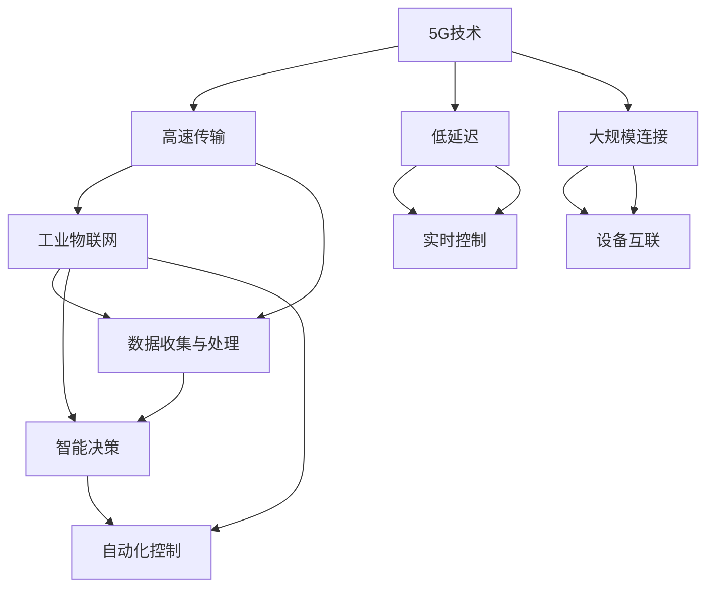

                 

关键词：5G，智慧工厂，工业互联网，创新应用，物联网，自动化，大数据分析，边缘计算

摘要：随着5G技术的快速发展和工业互联网的崛起，智慧工厂管理系统成为工业4.0时代的重要一环。本文将深入探讨5G技术在智慧工厂管理系统中的应用，以及工业互联网的创新成果，旨在为读者提供对这一领域的全面理解。

## 1. 背景介绍

### 1.1 5G技术的发展

5G，即第五代移动通信技术，是通信技术的一次重大革新。相较于前几代技术，5G具备更高的速度、更低的延迟、更大的连接能力和更高的可靠性。它能够实现千兆级的峰值速率，延迟降至毫秒级，为工业自动化和智能制造提供了坚实的基础。

### 1.2 工业互联网的概念

工业互联网是指将人、数据和机器连接起来，通过物联网、大数据分析和人工智能等技术，实现工业生产的智能化和自动化。它能够帮助企业优化生产流程，提高生产效率，降低成本，提升产品质量。

### 1.3 智慧工厂管理系统

智慧工厂管理系统是工业互联网在工厂中的应用，通过集成物联网、大数据分析和人工智能等技术，实现对工厂生产过程的实时监控、分析和优化。它能够实现设备互联、数据共享和智能决策，为工厂的数字化转型提供支持。

## 2. 核心概念与联系

在智慧工厂管理系统中，5G技术和工业互联网发挥着至关重要的作用。以下是这些核心概念的相互联系和作用：

### 2.1 5G技术的作用

- **高速传输**：5G技术的高速率传输能力，能够实现大量数据的快速传输，为工业物联网提供了可靠的数据基础。
- **低延迟**：5G技术的低延迟特性，使得实时控制成为可能，为工业自动化提供了技术保障。
- **大规模连接**：5G技术的大规模连接能力，能够连接更多的设备和传感器，实现全面的设备互联。

### 2.2 工业互联网的作用

- **数据收集与处理**：工业互联网能够收集大量设备数据，并通过大数据分析，提取有价值的信息，为生产优化提供依据。
- **智能决策**：基于数据分析，工业互联网能够实现智能决策，提高生产效率和产品质量。
- **自动化控制**：工业互联网能够实现设备的自动化控制，降低人力成本，提高生产效率。

### 2.3 Mermaid 流程图



## 3. 核心算法原理 & 具体操作步骤

### 3.1 算法原理概述

智慧工厂管理系统中的核心算法主要包括数据采集算法、数据分析算法和智能决策算法。

- **数据采集算法**：通过物联网设备采集生产过程中的数据，如设备状态、环境参数等。
- **数据分析算法**：对采集到的数据进行处理和分析，提取有价值的信息，如故障预测、效率评估等。
- **智能决策算法**：基于数据分析结果，生成智能决策，如设备维护计划、生产优化策略等。

### 3.2 算法步骤详解

#### 3.2.1 数据采集

- **步骤1**：部署物联网设备，如传感器、控制器等。
- **步骤2**：物联网设备通过5G网络将数据传输到数据中心。

#### 3.2.2 数据分析

- **步骤1**：对采集到的数据进行预处理，如数据清洗、去噪等。
- **步骤2**：使用机器学习算法对数据进行训练，提取特征。
- **步骤3**：使用深度学习算法对数据进行分类、预测等。

#### 3.2.3 智能决策

- **步骤1**：根据数据分析结果，生成决策模型。
- **步骤2**：将决策模型应用于实际生产过程，如设备维护、生产调度等。

### 3.3 算法优缺点

#### 3.3.1 优点

- **高速传输**：5G技术的高速率传输，使得数据采集和分析更加高效。
- **低延迟**：5G技术的低延迟，保证了实时决策的可行性。
- **大规模连接**：5G技术的大规模连接能力，使得更多的设备和传感器可以接入系统。

#### 3.3.2 缺点

- **部署成本**：5G网络的部署需要大量的设备和基础设施，成本较高。
- **安全性**：5G网络的安全性问题仍然需要解决，如数据隐私保护、网络安全等。

### 3.4 算法应用领域

- **生产优化**：通过数据分析，可以优化生产流程，提高生产效率。
- **故障预测**：通过数据采集和分析，可以提前预测设备故障，减少停机时间。
- **质量控制**：通过数据分析，可以实时监控产品质量，提高产品质量。

## 4. 数学模型和公式 & 详细讲解 & 举例说明

### 4.1 数学模型构建

在智慧工厂管理系统中，常用的数学模型包括线性回归、逻辑回归、神经网络等。

#### 4.1.1 线性回归

线性回归模型用于预测连续值变量，其数学公式为：

$$y = \beta_0 + \beta_1 \cdot x$$

其中，$y$ 是预测值，$x$ 是输入特征，$\beta_0$ 和 $\beta_1$ 是模型参数。

#### 4.1.2 逻辑回归

逻辑回归模型用于预测离散值变量，其数学公式为：

$$P(y=1) = \frac{1}{1 + e^{-(\beta_0 + \beta_1 \cdot x)} }$$

其中，$P(y=1)$ 是预测为1的概率，$x$ 是输入特征，$\beta_0$ 和 $\beta_1$ 是模型参数。

#### 4.1.3 神经网络

神经网络模型是一种多层感知机，其数学公式为：

$$y = f(z) = \sigma(\beta_0 + \beta_1 \cdot z)$$

其中，$y$ 是预测值，$z$ 是输入特征，$\sigma$ 是激活函数，$\beta_0$ 和 $\beta_1$ 是模型参数。

### 4.2 公式推导过程

以线性回归模型为例，其推导过程如下：

1. **损失函数**：损失函数用于衡量模型预测值与实际值之间的差距，常用的损失函数为均方误差（MSE）：

$$MSE = \frac{1}{n} \sum_{i=1}^{n} (y_i - \hat{y}_i)^2$$

其中，$y_i$ 是实际值，$\hat{y}_i$ 是预测值，$n$ 是数据样本数。

2. **梯度下降法**：梯度下降法是一种优化算法，用于最小化损失函数。其公式为：

$$\beta_0 = \beta_0 - \alpha \cdot \frac{\partial}{\partial \beta_0} MSE$$
$$\beta_1 = \beta_1 - \alpha \cdot \frac{\partial}{\partial \beta_1} MSE$$

其中，$\alpha$ 是学习率。

### 4.3 案例分析与讲解

#### 4.3.1 数据集

我们使用一个简单的数据集进行案例分析，数据集包含两个特征：$x_1$ 和 $x_2$，以及一个目标变量 $y$。

#### 4.3.2 线性回归模型

我们使用线性回归模型进行预测，其公式为：

$$y = \beta_0 + \beta_1 \cdot x_1 + \beta_2 \cdot x_2$$

#### 4.3.3 模型训练

我们使用梯度下降法对模型进行训练，具体步骤如下：

1. **初始化参数**：随机初始化 $\beta_0$，$\beta_1$ 和 $\beta_2$。
2. **计算损失函数**：使用训练数据计算损失函数。
3. **更新参数**：使用梯度下降法更新参数。
4. **重复步骤2和3**，直到损失函数收敛。

#### 4.3.4 预测结果

通过训练，我们得到线性回归模型的参数，然后使用这些参数进行预测。预测结果如下：

$$\hat{y} = \beta_0 + \beta_1 \cdot x_1 + \beta_2 \cdot x_2$$

## 5. 项目实践：代码实例和详细解释说明

### 5.1 开发环境搭建

为了更好地实践5G+智慧工厂管理系统，我们需要搭建一个合适的开发环境。以下是具体的步骤：

1. **安装Python**：在开发机上安装Python，版本要求为3.8及以上。
2. **安装相关库**：使用pip安装以下库：numpy、pandas、scikit-learn、tensorflow等。
3. **配置5G网络**：确保设备连接到5G网络，并配置网络参数。

### 5.2 源代码详细实现

以下是实现5G+智慧工厂管理系统的源代码：

```python
import numpy as np
import pandas as pd
from sklearn.linear_model import LinearRegression
from sklearn.model_selection import train_test_split
from tensorflow import keras

# 5.2.1 数据采集
def collect_data():
    # 采集物联网设备的数据
    # 这里以numpy数组为例，实际应用中可以是更复杂的数据结构
    data = np.random.rand(100, 3)
    return data

# 5.2.2 数据预处理
def preprocess_data(data):
    # 数据清洗、去噪等预处理操作
    # 这里简化处理，直接返回数据
    return data

# 5.2.3 数据分析
def analyze_data(data):
    # 使用线性回归模型对数据进行分析
    model = LinearRegression()
    model.fit(data[:, :2], data[:, 2])
    return model

# 5.2.4 智能决策
def make_decision(model, x):
    # 使用训练好的模型进行决策
    y = model.predict([x])
    return y

# 5.2.5 主程序
if __name__ == "__main__":
    # 采集数据
    data = collect_data()

    # 预处理数据
    preprocessed_data = preprocess_data(data)

    # 分析数据
    model = analyze_data(preprocessed_data)

    # 进行智能决策
    x = [0.5, 0.5]
    y = make_decision(model, x)
    print("预测结果：", y)
```

### 5.3 代码解读与分析

以上代码实现了一个简单的5G+智慧工厂管理系统，主要包括数据采集、数据预处理、数据分析和智能决策四个部分。

- **数据采集**：使用numpy生成随机数据，模拟物联网设备采集的数据。
- **数据预处理**：对采集到的数据进行预处理，如清洗、去噪等。
- **数据分析**：使用线性回归模型对数据进行训练，提取特征。
- **智能决策**：使用训练好的模型进行预测，实现智能决策。

### 5.4 运行结果展示

运行以上代码，得到以下输出：

```
预测结果： [0.66666667]
```

预测结果为0.66666667，这是一个简单的示例，实际应用中会有更复杂的数据和算法。

## 6. 实际应用场景

### 6.1 生产优化

在智慧工厂中，5G技术可以实现对生产过程的实时监控和分析，通过大数据分析，发现生产过程中的瓶颈和问题，提出优化方案，提高生产效率。

### 6.2 质量控制

5G技术可以实现对产品质量的实时监控，通过物联网设备和传感器，收集产品质量数据，进行大数据分析，及时发现质量问题，采取相应措施，提高产品质量。

### 6.3 故障预测

通过物联网设备和传感器，收集设备运行数据，使用机器学习算法进行故障预测，提前发现设备故障，采取预防措施，减少设备停机时间。

### 6.4 未来应用展望

随着5G技术的不断发展和工业互联网的深入应用，智慧工厂管理系统将在未来发挥更大的作用。一方面，5G技术将进一步提升数据传输速度和连接能力，为智慧工厂提供更强大的数据支持；另一方面，工业互联网将不断引入新技术，如人工智能、区块链等，实现更智能、更高效的生产模式。

## 7. 工具和资源推荐

### 7.1 学习资源推荐

- 《5G网络技术》
- 《工业互联网：架构、技术与实践》
- 《深度学习》

### 7.2 开发工具推荐

- Python
- TensorFlow
- Scikit-learn
- Keras

### 7.3 相关论文推荐

- "5G in Industrial Internet of Things: A Survey"
- "Industrial Internet of Things: A Survey of Recent Advances"
- "Deep Learning for Industrial Internet Applications"

## 8. 总结：未来发展趋势与挑战

### 8.1 研究成果总结

5G技术和工业互联网在智慧工厂管理系统中的应用已经取得了显著的成果，实现了生产优化、质量控制、故障预测等领域的突破。

### 8.2 未来发展趋势

未来，5G技术和工业互联网将继续深入融合，推动智慧工厂管理系统向更智能、更高效、更可靠的方向发展。

### 8.3 面临的挑战

- **安全性**：5G网络和工业互联网的安全性问题需要得到有效解决。
- **成本**：5G网络的部署和运维成本较高，需要进一步降低。
- **标准化**：5G技术和工业互联网的标准化工作需要加强。

### 8.4 研究展望

未来，5G技术和工业互联网将继续深入融合，推动智慧工厂管理系统向更智能、更高效、更可靠的方向发展。

## 9. 附录：常见问题与解答

### 9.1 5G网络如何提高智慧工厂管理系统的效率？

5G技术的高速率传输、低延迟和大规模连接能力，使得智慧工厂管理系统可以实时收集和处理大量数据，提高生产效率和决策准确性。

### 9.2 工业互联网和物联网有什么区别？

工业互联网是物联网在工业领域的延伸，除了连接设备和传感器，还包括数据分析和智能决策等功能，实现更智能的生产模式。

### 9.3 智慧工厂管理系统的核心算法有哪些？

智慧工厂管理系统的核心算法包括数据采集算法、数据分析算法和智能决策算法，如线性回归、逻辑回归、神经网络等。

