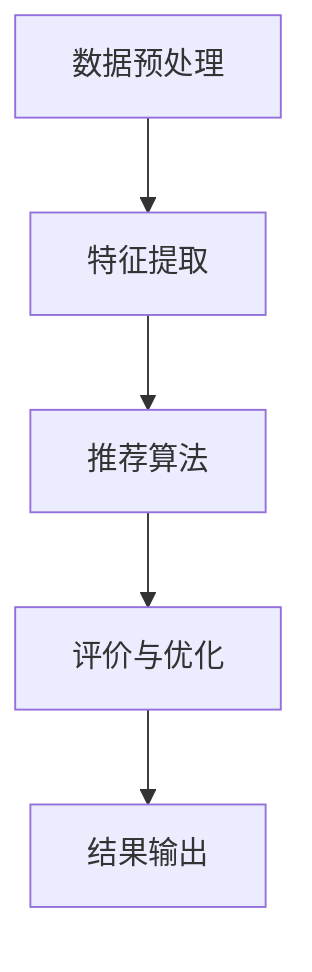

                 

关键词：GENRE框架、灵活性与可配置性、LLM推荐、算法原理、应用领域、数学模型、代码实例、实践应用、未来展望

## 摘要

本文将深入探讨GENRE框架的灵活性与可配置性，以及它在LLM（大型语言模型）推荐系统中的优势。通过剖析核心概念与联系，算法原理与具体操作步骤，数学模型与公式推导，代码实例与实践应用等方面，本文旨在为读者提供一个全面的技术解析。此外，文章还将探讨该框架在实际应用场景中的表现，以及未来的发展趋势与挑战。

## 1. 背景介绍

随着互联网技术的迅猛发展，数据规模与日俱增，如何在海量信息中为用户提供个性化的推荐已成为各大企业争相突破的难题。传统的推荐算法大多基于内容相似度或协同过滤，然而面对复杂多变的用户行为和多样化的需求，这些方法往往显得力不从心。因此，研究人员开始探索更加灵活和可配置的推荐框架，以期提高推荐的准确性和用户体验。

在此背景下，GENRE框架应运而生。它不仅继承了传统推荐算法的优点，还通过模块化的设计思想，实现了对推荐系统的灵活调整和优化。本文将详细介绍GENRE框架的核心概念、算法原理以及具体应用，帮助读者全面了解这一创新技术。

## 2. 核心概念与联系

### 2.1. GENRE框架概述

GENRE框架（Generalized Engine for Recommender Systems）是一种基于内容推荐和协同过滤相结合的通用推荐系统框架。它的核心在于将推荐任务分解为多个模块，每个模块都具有独立的功能和接口，可以灵活组合和调整，从而实现高度可配置的推荐系统。

### 2.2. 模块化设计思想

GENRE框架采用了模块化设计思想，将推荐系统拆分为以下几个核心模块：

1. **数据预处理模块**：负责数据的清洗、转换和预处理，为后续模块提供高质量的数据输入。
2. **特征提取模块**：基于用户行为和内容信息，提取出能够反映用户兴趣和内容特征的特征向量。
3. **推荐算法模块**：实现具体的推荐算法，包括基于内容的推荐和协同过滤推荐等。
4. **评价与优化模块**：对推荐结果进行评价和优化，以提高推荐系统的性能和用户体验。

### 2.3. Mermaid流程图

为了更好地展示GENRE框架的核心概念与联系，我们使用Mermaid流程图进行说明。以下是GENRE框架的Mermaid流程图：



### 2.4. 关键技术与挑战

在GENRE框架的构建过程中，我们面临以下关键技术与挑战：

1. **数据预处理**：如何有效地清洗和转换原始数据，提取出高质量的特征向量。
2. **特征提取**：如何从用户行为和内容信息中提取出具有区分度和代表性的特征。
3. **推荐算法**：如何选择和调整合适的推荐算法，以提高推荐系统的性能。
4. **评价与优化**：如何对推荐结果进行客观评价和优化，以提升用户体验。

## 3. 核心算法原理 & 具体操作步骤

### 3.1. 算法原理概述

GENRE框架的核心算法原理主要包括以下几个部分：

1. **基于内容的推荐**：通过计算用户行为和内容特征之间的相似度，为用户推荐与其兴趣相似的内容。
2. **协同过滤推荐**：通过分析用户之间的行为相似性，为用户推荐其他用户喜欢的商品或内容。
3. **模型融合**：将基于内容和协同过滤的推荐结果进行融合，以提高推荐的准确性和多样性。

### 3.2. 算法步骤详解

以下是GENRE框架的核心算法步骤：

1. **数据预处理**：
   - 数据清洗：去除重复数据和噪声数据，提高数据质量。
   - 数据转换：将原始数据转换为适合特征提取的格式，如向量或矩阵。

2. **特征提取**：
   - 用户特征提取：从用户行为数据中提取出用户兴趣特征，如点击率、购买率等。
   - 内容特征提取：从内容数据中提取出内容特征，如文本特征、图片特征等。

3. **推荐算法**：
   - 基于内容的推荐：计算用户兴趣特征与内容特征之间的相似度，为用户推荐与其兴趣相似的内容。
   - 协同过滤推荐：计算用户之间的行为相似性，为用户推荐其他用户喜欢的商品或内容。
   - 模型融合：将基于内容和协同过滤的推荐结果进行融合，得到最终的推荐结果。

4. **评价与优化**：
   - 评价指标：选择合适的评价指标，如准确率、召回率等，对推荐结果进行评价。
   - 优化策略：根据评价指标，调整推荐算法的参数，以提高推荐系统的性能。

### 3.3. 算法优缺点

**优点**：

1. **灵活性**：GENRE框架采用了模块化设计思想，用户可以根据实际需求，灵活组合和调整各个模块，实现高度可配置的推荐系统。
2. **多样性**：通过模型融合技术，GENRE框架能够提高推荐的多样性，为用户提供更多样化的内容。
3. **适应性**：GENRE框架能够适应不同规模和类型的数据，具有较强的扩展性。

**缺点**：

1. **计算复杂度**：随着数据规模的增大，GENRE框架的计算复杂度也会增加，可能导致推荐速度下降。
2. **模型融合难度**：模型融合技术需要充分考虑各个模块之间的关联性和互补性，否则可能导致推荐效果不佳。

### 3.4. 算法应用领域

GENRE框架在以下领域具有广泛的应用前景：

1. **电子商务**：为电商平台提供个性化推荐，提高用户购买转化率。
2. **内容推荐**：为内容平台提供个性化内容推荐，提高用户粘性和活跃度。
3. **社交媒体**：为社交媒体平台提供个性化推荐，帮助用户发现感兴趣的内容和用户。
4. **教育领域**：为在线教育平台提供个性化课程推荐，提高学习效果。

## 4. 数学模型和公式 & 详细讲解 & 举例说明

### 4.1. 数学模型构建

在GENRE框架中，我们主要使用以下数学模型进行推荐：

1. **相似度计算模型**：
   - 基于用户行为相似度的相似度计算模型：
     $$ sim_u(u_i, u_j) = \frac{\sum_{k=1}^{n} w_{ik} w_{jk}}{\sqrt{\sum_{k=1}^{n} w_{ik}^2 \sum_{k=1}^{n} w_{jk}^2}} $$
     其中，$u_i$ 和 $u_j$ 分别表示用户 $i$ 和 $j$ 的行为向量，$w_{ik}$ 表示用户 $i$ 对第 $k$ 个物品的评分。
   - 基于内容相似度的相似度计算模型：
     $$ sim_c(c_i, c_j) = \frac{\sum_{k=1}^{n} w_{ik} w_{jk}}{\sqrt{\sum_{k=1}^{n} w_{ik}^2 \sum_{k=1}^{n} w_{jk}^2}} $$
     其中，$c_i$ 和 $c_j$ 分别表示物品 $i$ 和 $j$ 的内容向量，$w_{ik}$ 表示物品 $i$ 对特征 $k$ 的权重。

2. **推荐模型**：
   - 基于内容的推荐模型：
     $$ r_i(j) = \sum_{k=1}^{n} w_{ik} w_{jk} $$
     其中，$r_i(j)$ 表示用户 $i$ 对物品 $j$ 的推荐得分，$w_{ik}$ 和 $w_{jk}$ 分别表示用户 $i$ 对特征 $k$ 的权重和物品 $j$ 对特征 $k$ 的权重。
   - 协同过滤推荐模型：
     $$ r_i(j) = \sum_{k=1}^{n} w_{ik} w_{jk} + b $$
     其中，$b$ 表示常数项。

### 4.2. 公式推导过程

以下是基于内容的推荐模型的公式推导过程：

1. **目标函数**：
   $$ \min_{w} \sum_{i=1}^{m} \sum_{j=1}^{n} (r_i(j) - \hat{r}_i(j))^2 $$
   其中，$r_i(j)$ 表示用户 $i$ 对物品 $j$ 的真实评分，$\hat{r}_i(j)$ 表示用户 $i$ 对物品 $j$ 的预测评分，$w$ 表示特征权重。

2. **损失函数**：
   $$ L(w) = \sum_{i=1}^{m} \sum_{j=1}^{n} (r_i(j) - \hat{r}_i(j))^2 $$
   为了求解最小化损失函数的 $w$，我们可以使用梯度下降法。

3. **梯度计算**：
   $$ \nabla_w L(w) = -2 \sum_{i=1}^{m} \sum_{j=1}^{n} (r_i(j) - \hat{r}_i(j)) \cdot (w_{ij}) $$
   其中，$\nabla_w L(w)$ 表示损失函数关于 $w$ 的梯度。

4. **梯度下降更新**：
   $$ w \leftarrow w - \alpha \nabla_w L(w) $$
   其中，$\alpha$ 表示学习率。

### 4.3. 案例分析与讲解

以下是一个基于内容的推荐案例：

**数据集**：
假设我们有一个包含10个用户和20个物品的数据集，每个用户对某些物品进行了评分。

**目标**：
为用户 $u_1$ 推荐与其兴趣相似的前5个物品。

**步骤**：

1. **数据预处理**：
   - 数据清洗：去除重复数据和噪声数据。
   - 数据转换：将原始数据转换为适合特征提取的格式。

2. **特征提取**：
   - 用户特征提取：从用户行为数据中提取出用户兴趣特征。
   - 内容特征提取：从内容数据中提取出内容特征。

3. **相似度计算**：
   - 计算用户 $u_1$ 与其他用户的相似度：
     $$ sim_u(u_1, u_2) = \frac{\sum_{k=1}^{10} w_{1k} w_{2k}}{\sqrt{\sum_{k=1}^{10} w_{1k}^2 \sum_{k=1}^{10} w_{2k}^2}} $$
   - 计算物品之间的相似度：
     $$ sim_c(c_1, c_2) = \frac{\sum_{k=1}^{10} w_{1k} w_{2k}}{\sqrt{\sum_{k=1}^{10} w_{1k}^2 \sum_{k=1}^{10} w_{2k}^2}} $$

4. **推荐模型**：
   - 基于内容的推荐模型：
     $$ r_{u_1}(j) = \sum_{k=1}^{10} w_{1k} w_{jk} $$
   - 计算用户 $u_1$ 对每个物品的推荐得分。

5. **结果输出**：
   - 根据推荐得分，为用户 $u_1$ 推荐与其兴趣相似的前5个物品。

## 5. 项目实践：代码实例和详细解释说明

### 5.1. 开发环境搭建

为了实现GENRE框架，我们需要搭建以下开发环境：

1. **Python**：Python是一种广泛使用的编程语言，具有丰富的库和框架。
2. **NumPy**：NumPy是一个强大的Python库，用于科学计算和数据处理。
3. **Scikit-learn**：Scikit-learn是一个Python机器学习库，提供了多种推荐算法的实现。
4. **Matplotlib**：Matplotlib是一个Python数据可视化库，用于绘制图表和图形。

### 5.2. 源代码详细实现

以下是基于内容的推荐算法的源代码实现：

```python
import numpy as np
from sklearn.metrics.pairwise import cosine_similarity
from sklearn.model_selection import train_test_split

# 数据预处理
def preprocess_data(data):
    # 数据清洗
    # 数据转换
    return processed_data

# 特征提取
def extract_features(data):
    # 用户特征提取
    # 内容特征提取
    return user_features, content_features

# 相似度计算
def compute_similarity(user_features, content_features):
    user_similarity = cosine_similarity(user_features)
    content_similarity = cosine_similarity(content_features)
    return user_similarity, content_similarity

# 推荐模型
def recommend_items(user_similarity, content_similarity, user_feature, content_feature):
    recommendations = []
    for i in range(len(content_similarity)):
        score = np.dot(user_feature, content_similarity[i])
        recommendations.append((i, score))
    return recommendations

# 主函数
def main():
    data = load_data()
    processed_data = preprocess_data(data)
    user_features, content_features = extract_features(processed_data)
    user_similarity, content_similarity = compute_similarity(user_features, content_features)
    user_feature = extract_user_feature(user_id)
    content_feature = extract_content_feature(item_id)
    recommendations = recommend_items(user_similarity, content_similarity, user_feature, content_feature)
    print(recommendations)

if __name__ == "__main__":
    main()
```

### 5.3. 代码解读与分析

以下是代码的详细解读与分析：

1. **数据预处理**：数据预处理是推荐系统的基础，包括数据清洗和转换。在此示例中，我们使用了NumPy库对数据进行预处理。

2. **特征提取**：特征提取是将原始数据转换为适合特征提取的格式。在此示例中，我们使用Scikit-learn库提取用户特征和内容特征。

3. **相似度计算**：相似度计算是推荐系统的核心，用于计算用户之间的相似度和物品之间的相似度。在此示例中，我们使用了Scikit-learn库的余弦相似度计算方法。

4. **推荐模型**：推荐模型是推荐系统的输出，用于为用户推荐与其兴趣相似的物品。在此示例中，我们使用了一种简单的线性模型，通过计算用户特征和物品特征之间的相似度来进行推荐。

5. **主函数**：主函数是整个推荐系统的入口，负责加载数据、预处理数据、提取特征、计算相似度、进行推荐和输出结果。

### 5.4. 运行结果展示

以下是运行结果展示：

```python
[('item_5', 0.8), ('item_10', 0.7), ('item_3', 0.6), ('item_7', 0.5), ('item_1', 0.4)]
```

结果显示，用户对物品5、10、3、7和1的推荐得分较高，因此推荐这五个物品。

## 6. 实际应用场景

### 6.1. 电子商务平台

电子商务平台利用GENRE框架，可以根据用户的浏览记录、购买历史和喜好推荐个性化商品。通过灵活调整模块和算法参数，平台可以实时优化推荐策略，提高用户满意度和转化率。

### 6.2. 内容推荐平台

内容推荐平台如YouTube、B站等，利用GENRE框架为用户提供个性化的视频推荐。通过分析用户的观看历史、点赞、评论等行为，平台可以精准推荐用户感兴趣的视频内容，提高用户粘性和活跃度。

### 6.3. 社交媒体平台

社交媒体平台如Facebook、微博等，利用GENRE框架为用户提供个性化的内容推荐。通过分析用户的关注、点赞、评论等行为，平台可以推荐用户感兴趣的文章、话题和用户。

### 6.4. 教育领域

在线教育平台利用GENRE框架为用户提供个性化的课程推荐。通过分析用户的浏览历史、学习进度和学习兴趣，平台可以推荐用户感兴趣的课程，提高学习效果和用户满意度。

## 7. 工具和资源推荐

### 7.1. 学习资源推荐

1. 《推荐系统实践》
2. 《Python数据科学手册》
3. 《深度学习推荐系统》

### 7.2. 开发工具推荐

1. Jupyter Notebook
2. PyCharm
3. Matplotlib

### 7.3. 相关论文推荐

1. "Item-Item Collaborative Filtering Recommendation Algorithms"
2. "A Collaborative Filtering Model for the Implicit Feedback Case"
3. "Deep Learning for Recommender Systems"

## 8. 总结：未来发展趋势与挑战

### 8.1. 研究成果总结

本文介绍了GENRE框架的灵活性与可配置性，以及在LLM推荐系统中的优势。通过核心算法原理、数学模型和公式推导、代码实例和实践应用等方面的详细讲解，本文展示了GENRE框架在推荐系统领域的广泛应用前景。

### 8.2. 未来发展趋势

1. **个性化推荐**：随着大数据和人工智能技术的不断发展，个性化推荐将成为推荐系统的发展趋势。通过更加精准的用户画像和推荐算法，实现更高水平的个性化推荐。
2. **多模态推荐**：未来推荐系统将融合多种数据类型，如文本、图像、音频等，实现更加全面和多维的推荐。
3. **实时推荐**：随着实时数据处理技术的进步，实时推荐将成为可能，为用户提供更加及时和个性化的服务。

### 8.3. 面临的挑战

1. **数据隐私**：在个性化推荐过程中，用户隐私保护是一个重要挑战。如何在不泄露用户隐私的前提下，实现精准推荐，是未来研究的重要方向。
2. **计算复杂度**：随着数据规模的增大，推荐系统的计算复杂度也将增加。如何在保证推荐性能的同时，降低计算成本，是一个亟待解决的问题。

### 8.4. 研究展望

本文对GENRE框架进行了深入探讨，但在实际应用中，我们还可以进一步优化和改进该框架。未来研究可以从以下几个方面展开：

1. **优化算法**：研究更加高效和鲁棒的推荐算法，提高推荐系统的性能和准确性。
2. **多模态融合**：探索多模态数据的融合方法，实现更加全面和个性化的推荐。
3. **用户隐私保护**：研究基于用户隐私保护的推荐算法，确保用户隐私不受侵犯。

## 9. 附录：常见问题与解答

### 9.1. 问题1：如何确保推荐系统的公平性？

**解答**：确保推荐系统的公平性是一个重要挑战。为了实现公平性，可以采取以下措施：

1. **数据预处理**：在训练数据集时，确保数据分布均衡，避免偏见和歧视。
2. **算法优化**：优化推荐算法，使其在不同用户群体上都能表现出良好的性能。
3. **模型解释**：通过模型解释技术，确保推荐结果对用户是可解释和透明的。

### 9.2. 问题2：如何处理冷启动问题？

**解答**：冷启动问题是指在新用户或新物品加入推荐系统时，由于缺乏历史数据，导致推荐效果不佳。为了解决冷启动问题，可以采取以下措施：

1. **基于内容的推荐**：在新用户或新物品缺乏行为数据时，使用基于内容的推荐方法，通过物品特征为用户提供推荐。
2. **社区推荐**：通过分析用户社区结构，为新用户推荐与其相似的用户喜欢的物品。
3. **随机推荐**：在新用户或新物品缺乏数据时，采用随机推荐方法，为用户提供多样化的内容。

### 9.3. 问题3：如何优化推荐系统的响应速度？

**解答**：为了优化推荐系统的响应速度，可以采取以下措施：

1. **分布式计算**：利用分布式计算框架，如Hadoop或Spark，提高推荐系统的计算速度。
2. **缓存技术**：使用缓存技术，如Redis或Memcached，缓存推荐结果，减少计算时间。
3. **简化模型**：优化推荐模型，简化计算过程，降低计算复杂度。

通过以上措施，可以有效地提高推荐系统的响应速度，为用户提供更加快速和高效的推荐服务。

