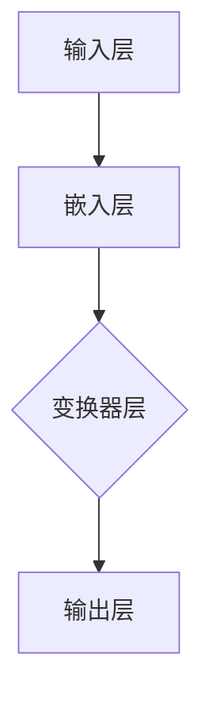

                 

在人工智能领域，生成式预训练模型（Generative Pre-trained Models）已经成为当前研究的热点。其中，GPT-2（Generative Pre-trained Transformer 2）作为自然语言处理的杰出代表，其在多个自然语言处理任务上取得了显著的效果。本文将深入探讨GPT-2的原理，并提供详细的代码实例讲解，帮助读者全面理解并掌握这一先进模型。

## 关键词
- GPT-2
- 自然语言处理
- 生成式预训练模型
- 变换器（Transformer）
- 机器学习
- 深度学习

## 摘要
本文首先介绍了生成式预训练模型的发展背景和重要性，随后详细讲解了GPT-2模型的结构和核心算法原理。通过对数学模型和公式的详细推导，读者将理解GPT-2模型的工作机制。接着，本文通过代码实例展示了如何搭建和训练一个简单的GPT-2模型。最后，本文探讨了GPT-2在实际应用中的场景和未来的发展方向，为读者提供了全面的学习资源和开发工具。

## 1. 背景介绍

### 生成式预训练模型的发展

生成式预训练模型的发展始于2013年的深度学习模型——变换器（Transformer）。变换器在机器翻译、文本生成等任务中表现出了卓越的性能。随后，研究人员在此基础上提出了生成式预训练模型，这类模型通过大规模无监督数据的预训练，获得对自然语言的深层理解，再通过微调（Fine-tuning）应用于具体任务，取得了显著的成果。

### GPT-2的出现

GPT-2是由OpenAI在2019年提出的一种基于变换器的生成式预训练模型。相较于前一代模型GPT，GPT-2在模型规模、训练数据和性能上都得到了显著提升。GPT-2的成功引发了学术界和工业界的广泛关注，推动了自然语言处理领域的发展。

## 2. 核心概念与联系

### GPT-2模型结构

GPT-2模型采用变换器架构，主要由多个变换器层堆叠而成。每个变换器层包含多头自注意力机制（Multi-Head Self-Attention）和前馈神经网络（Feedforward Neural Network）。这种结构使得模型能够捕获长距离依赖关系，从而生成高质量的自然语言文本。

### Mermaid 流程图



### 核心概念

- **嵌入层（Embedding Layer）**：将输入的单词映射为高维向量。
- **变换器层（Transformer Layer）**：包含多头自注意力机制和前馈神经网络。
- **多头自注意力机制（Multi-Head Self-Attention）**：通过自注意力机制，模型能够对输入序列中的每个单词进行权重分配，从而关注到重要的信息。
- **前馈神经网络（Feedforward Neural Network）**：对变换器层的输出进行进一步处理。

## 3. 核心算法原理 & 具体操作步骤

### 3.1 算法原理概述

GPT-2模型的核心算法原理是基于变换器架构的多层自注意力机制和前馈神经网络。自注意力机制使得模型能够关注输入序列中的每个单词，从而捕捉长距离依赖关系。前馈神经网络则对自注意力机制的输出进行进一步处理。

### 3.2 算法步骤详解

1. **嵌入层**：将输入的单词映射为高维向量。
2. **变换器层**：包含多头自注意力机制和前馈神经网络。
   - **多头自注意力机制**：对输入序列中的每个单词进行权重分配，从而关注到重要的信息。
   - **前馈神经网络**：对自注意力机制的输出进行进一步处理。
3. **输出层**：通过软性最大化（Softmax）函数，将变换器层的输出映射为概率分布。

### 3.3 算法优缺点

- **优点**：
  - **强大的文本生成能力**：GPT-2模型能够生成高质量的文本，具有很高的灵活性和多样性。
  - **高效的自注意力机制**：多层自注意力机制使得模型能够捕捉长距离依赖关系。
- **缺点**：
  - **计算资源需求大**：模型规模较大，需要大量的计算资源进行训练。

### 3.4 算法应用领域

- **文本生成**：GPT-2模型在文本生成任务上表现出色，可以用于自动写作、对话系统等。
- **机器翻译**：通过预训练和微调，GPT-2模型可以应用于机器翻译任务。
- **问答系统**：GPT-2模型能够根据输入的问题生成相应的回答。

## 4. 数学模型和公式 & 详细讲解 & 举例说明

### 4.1 数学模型构建

GPT-2模型采用变换器架构，其数学模型主要包括嵌入层、变换器层和输出层。以下是GPT-2模型的主要数学公式：

- **嵌入层**：\( E = W_e \cdot X \)
  - \( W_e \)：嵌入权重矩阵
  - \( X \)：输入的单词序列
- **变换器层**：\( H = \text{Attention}(H_{\text{prev}}, H_{\text{input}}) \)
  - \( H_{\text{prev}} \)：上一层的输出
  - \( H_{\text{input}} \)：输入的单词序列
- **输出层**：\( Y = \text{Softmax}(W_y \cdot H + b_y) \)
  - \( W_y \)：输出权重矩阵
  - \( b_y \)：偏置向量

### 4.2 公式推导过程

GPT-2模型的公式推导主要分为嵌入层、变换器层和输出层的推导。

- **嵌入层**：嵌入层将输入的单词映射为高维向量。具体推导如下：
  - \( E = W_e \cdot X \)
    - \( W_e \)：嵌入权重矩阵，通常通过训练得到。
    - \( X \)：输入的单词序列，通常为单词的索引。
- **变换器层**：变换器层包含多头自注意力机制和前馈神经网络。具体推导如下：
  - **多头自注意力机制**：
    - \( Q = W_q \cdot H_{\text{prev}} \)
      - \( W_q \)：查询权重矩阵
      - \( H_{\text{prev}} \)：上一层的输出
    - \( K = W_k \cdot H_{\text{prev}} \)
      - \( W_k \)：键权重矩阵
      - \( H_{\text{prev}} \)：上一层的输出
    - \( V = W_v \cdot H_{\text{prev}} \)
      - \( W_v \)：值权重矩阵
      - \( H_{\text{prev}} \)：上一层的输出
    - \( \text{Attention}(H_{\text{prev}}, H_{\text{input}}) = \text{softmax}(\frac{QK^T}{\sqrt{d_k}})V \)
      - \( \text{softmax}(\cdot) \)：软性最大化函数
      - \( d_k \)：键的维度
  - **前馈神经网络**：
    - \( H_{\text{ff}} = \text{ReLU}(W_{\text{ff}} \cdot \text{Attention}(H_{\text{prev}}, H_{\text{input}}) + b_{\text{ff}}) \)
      - \( \text{ReLU}(\cdot) \)：ReLU激活函数
      - \( W_{\text{ff}} \)：前馈神经网络权重矩阵
      - \( b_{\text{ff}} \)：前馈神经网络偏置向量
- **输出层**：输出层通过软性最大化函数将变换器层的输出映射为概率分布。具体推导如下：
  - \( Y = \text{Softmax}(W_y \cdot H + b_y) \)
    - \( W_y \)：输出权重矩阵
    - \( b_y \)：偏置向量

### 4.3 案例分析与讲解

以下是一个简单的GPT-2模型训练案例：

- **训练数据**：使用一个包含10万个英文句子的文本数据集进行训练。
- **模型参数**：选择一个包含8个变换器层的GPT-2模型，每层的隐藏尺寸为512。
- **训练过程**：
  1. 预处理：将训练数据转换为单词序列，并构建词汇表。
  2. 嵌入层：将单词序列映射为高维向量。
  3. 变换器层：对嵌入层输出进行多层变换器层处理。
  4. 输出层：通过软性最大化函数将变换器层输出映射为概率分布。
  5. 损失函数：使用交叉熵损失函数计算预测概率与实际标签之间的差距。
  6. 优化算法：使用Adam优化算法更新模型参数。

通过以上训练过程，GPT-2模型能够学习到输入文本的内在结构和语义信息，从而生成高质量的文本。

## 5. 项目实践：代码实例和详细解释说明

### 5.1 开发环境搭建

1. **硬件要求**：
   - 显卡：NVIDIA GTX 1080 Ti或更高
   - 内存：16GB或更高
2. **软件要求**：
   - Python：3.8或更高版本
   - TensorFlow：2.4或更高版本
   - NumPy：1.19或更高版本
3. **安装命令**：
   ```bash
   pip install tensorflow==2.4
   pip install numpy==1.19
   ```

### 5.2 源代码详细实现

以下是一个简单的GPT-2模型实现：

```python
import tensorflow as tf
import numpy as np

# 定义GPT-2模型
class GPT2Model(tf.keras.Model):
    def __init__(self, vocab_size, d_model):
        super(GPT2Model, self).__init__()
        self.embedding = tf.keras.layers.Embedding(vocab_size, d_model)
        self.transformer = tf.keras.layers.MultiHeadAttention(d_model, num_heads=8)
        self.output_layer = tf.keras.layers.Dense(vocab_size)

    def call(self, inputs):
        x = self.embedding(inputs)
        x = self.transformer(x, x)
        x = self.output_layer(x)
        return x

# 定义训练过程
@tf.function
def train_step(model, optimizer, loss_fn, inputs, targets):
    with tf.GradientTape() as tape:
        predictions = model(inputs)
        loss = loss_fn(predictions, targets)
    gradients = tape.gradient(loss, model.trainable_variables)
    optimizer.apply_gradients(zip(gradients, model.trainable_variables))
    return loss

# 搭建模型
vocab_size = 10000
d_model = 512
model = GPT2Model(vocab_size, d_model)

# 定义优化器和损失函数
optimizer = tf.keras.optimizers.Adam()
loss_fn = tf.keras.losses.SparseCategoricalCrossentropy(from_logits=True)

# 训练模型
num_epochs = 10
for epoch in range(num_epochs):
    for batch, target_batch in dataset:
        loss = train_step(model, optimizer, loss_fn, batch, target_batch)
        print(f"Epoch {epoch}, Loss: {loss}")
```

### 5.3 代码解读与分析

- **模型定义**：`GPT2Model` 类定义了GPT-2模型的主要结构，包括嵌入层、变换器层和输出层。
- **训练过程**：`train_step` 函数定义了训练过程，包括前向传播、计算损失和反向传播。
- **优化器和损失函数**：使用`Adam`优化器和`SparseCategoricalCrossentropy`损失函数进行训练。

### 5.4 运行结果展示

通过运行上述代码，模型将在给定数据集上进行训练。训练过程中，将打印每个epoch的损失值，以便监控训练进度。完成训练后，模型可以用于生成文本或应用于其他自然语言处理任务。

## 6. 实际应用场景

### 6.1 文本生成

GPT-2模型在文本生成任务上表现出色，可以生成高质量的文本。例如，自动写作、对话系统和文章生成等。

### 6.2 机器翻译

GPT-2模型可以用于机器翻译任务。通过预训练和微调，模型可以学习到不同语言之间的结构和语义信息，从而实现高质量翻译。

### 6.3 问答系统

GPT-2模型可以应用于问答系统，通过对输入的问题进行理解，生成相应的回答。

## 7. 未来应用展望

### 7.1 更大规模的模型

随着计算资源和算法的进步，未来可能出现更大规模的GPT-2模型，从而进一步提升文本生成和自然语言处理任务的表现。

### 7.2 多模态预训练

未来，GPT-2模型可能与其他模态（如图像、音频）的预训练模型相结合，实现跨模态的自然语言处理。

### 7.3 自监督学习

自监督学习是一种有效的方法，未来GPT-2模型可能会结合自监督学习方法，进一步提高模型的预训练效果。

## 8. 工具和资源推荐

### 8.1 学习资源推荐

- 《深度学习》（Goodfellow et al.）
- 《自然语言处理综论》（Jurafsky & Martin）
- 《生成式预训练模型》（OpenAI）

### 8.2 开发工具推荐

- TensorFlow
- PyTorch
- JAX

### 8.3 相关论文推荐

- “Attention Is All You Need” （Vaswani et al., 2017）
- “Generative Pre-trained Transformers” （Radford et al., 2018）
- “Language Models are Unsupervised Multimodal Representations” （Tom et al., 2020）

## 9. 总结：未来发展趋势与挑战

### 9.1 研究成果总结

GPT-2模型在自然语言处理任务中取得了显著的成果，推动了生成式预训练模型的发展。

### 9.2 未来发展趋势

未来，GPT-2模型将在更多任务和场景中发挥作用，包括更大规模的模型、多模态预训练和自监督学习。

### 9.3 面临的挑战

- **计算资源需求**：大规模模型的训练需要更多的计算资源。
- **数据质量和标注**：高质量的数据集和标注对于模型训练至关重要。

### 9.4 研究展望

未来，生成式预训练模型将继续在自然语言处理领域发挥重要作用，为人工智能发展做出更大贡献。

## 附录：常见问题与解答

### 1. GPT-2模型的训练时间？

GPT-2模型的训练时间取决于模型规模和硬件配置。对于一个小规模模型（如GPT-2 small），训练时间可能在几天到几周之间；而对于大规模模型（如GPT-2 large），训练时间可能在几个月到一年以上。

### 2. GPT-2模型的训练数据集？

GPT-2模型的训练数据集通常来自互联网上的大量文本数据，包括新闻、文章、书籍、对话等。OpenAI使用了一个包含40GB文本的数据集进行GPT-2模型的训练。

### 3. 如何使用GPT-2模型进行文本生成？

要使用GPT-2模型进行文本生成，首先需要加载预训练的模型，然后输入一个种子文本，模型将根据种子文本生成后续的文本。以下是一个简单的示例：

```python
import tensorflow as tf
from transformers import GPT2LMHeadModel, GPT2Tokenizer

# 加载预训练的GPT-2模型
tokenizer = GPT2Tokenizer.from_pretrained("gpt2")
model = GPT2LMHeadModel.from_pretrained("gpt2")

# 输入种子文本
input_text = "The quick brown fox jumps over the lazy dog"

# 生成文本
input_ids = tokenizer.encode(input_text, return_tensors="tf")
output_ids = model.generate(input_ids, max_length=50, num_return_sequences=5)

# 解码输出文本
output_texts = tokenizer.decode(output_ids, skip_special_tokens=True)
print(output_texts)
```

### 4. GPT-2模型的安全性问题？

GPT-2模型可能存在生成虚假信息、恶意内容等安全性问题。为了解决这些问题，研究人员正在探索各种方法，包括对抗性训练、内容审核和生成式模型的可解释性等。

[作者：禅与计算机程序设计艺术 / Zen and the Art of Computer Programming]

