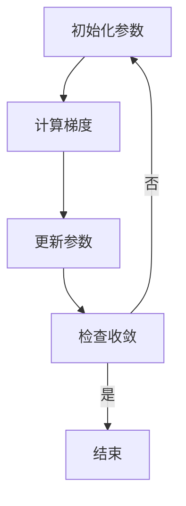

                 

## 1. 背景介绍

Gradient Descent，中文称为“梯度下降法”，是机器学习中最基本的优化算法之一。其核心思想是通过迭代更新参数，以最小化目标函数。梯度下降法被广泛应用于各种机器学习问题，包括回归、分类和神经网络等。

梯度下降法的历史可以追溯到19世纪末期，当时物理学家们开始研究如何找到函数的最小值。梯度下降法的基本原理是，通过计算目标函数在每个参数点的梯度，并沿着梯度的反方向更新参数，以逐渐逼近最优解。

在机器学习中，梯度下降法是优化损失函数的重要工具。在训练模型时，我们需要找到一组参数，使得损失函数的值尽可能小。损失函数通常是由模型预测值与真实值之间的差异构成的。梯度下降法通过不断迭代更新参数，使得损失函数逐渐减小，直至达到最小值。

本文将详细讲解梯度下降法的原理、数学模型、实现步骤以及实际应用，旨在帮助读者更好地理解和应用这一重要的优化算法。

## 2. 核心概念与联系

### 2.1 目标函数

在梯度下降法中，目标函数是我们要优化的函数。它可以是任何形式的函数，但通常情况下，我们关心的是损失函数，即模型预测值与真实值之间的差异。损失函数的形式取决于具体的机器学习问题。例如，在回归问题中，常用的损失函数是均方误差（MSE），即预测值与真实值之差的平方和。

### 2.2 梯度

梯度是目标函数在某一点的局部变化率。在数学上，梯度是一个向量，其每个分量对应于目标函数在该点的偏导数。对于多变量函数，梯度可以表示为：

$$
\nabla f(\mathbf{x}) = \left[
\begin{array}{c}
\frac{\partial f}{\partial x_1} \\
\frac{\partial f}{\partial x_2} \\
\vdots \\
\frac{\partial f}{\partial x_n}
\end{array}
\right]
$$

其中，$\mathbf{x} = [x_1, x_2, \ldots, x_n]$ 是参数向量，$\frac{\partial f}{\partial x_i}$ 是目标函数 $f$ 对 $x_i$ 的偏导数。

### 2.3 参数更新

在梯度下降法中，参数的更新是沿着梯度的反方向进行的。具体而言，每次迭代中，参数向量 $\theta$ 将被更新为：

$$
\theta = \theta - \alpha \nabla f(\theta)
$$

其中，$\alpha$ 是学习率（也称为步长），决定了每次迭代中参数更新的步长大小。学习率的选择对梯度下降法的收敛速度和稳定性有很大影响。

### 2.4 Mermaid 流程图

为了更清晰地展示梯度下降法的流程，我们使用Mermaid绘制一个简化的流程图：



在这个流程图中，我们首先初始化参数，然后计算目标函数的梯度，接着使用梯度更新参数。迭代过程持续进行，直到满足收敛条件（例如，梯度小于某个阈值）。

## 3. 核心算法原理 & 具体操作步骤

### 3.1 算法原理概述

梯度下降法是一种迭代优化算法，其核心思想是通过计算目标函数在每个参数点的梯度，并沿着梯度的反方向更新参数，以逐渐逼近最优解。具体而言，梯度下降法分为以下几个步骤：

1. 初始化参数：选择一组初始参数值。
2. 计算梯度：计算目标函数在当前参数点的梯度。
3. 更新参数：根据梯度方向和步长更新参数。
4. 检查收敛：判断是否满足收敛条件，例如，梯度小于某个阈值。

如果满足收敛条件，算法结束；否则，返回步骤2，继续迭代。

### 3.2 算法步骤详解

#### 3.2.1 初始化参数

初始化参数是梯度下降法的第一步。通常，我们选择一组随机参数作为初始值。对于多项式回归问题，假设我们有一个二次多项式模型：

$$
y = \theta_0 + \theta_1 x + \theta_2 x^2
$$

我们可以随机初始化 $\theta_0, \theta_1, \theta_2$ 为不同的值，例如：

$$
\theta_0 = 0.1, \theta_1 = -0.2, \theta_2 = 0.3
$$

#### 3.2.2 计算梯度

计算梯度是梯度下降法的核心步骤。对于我们的二次多项式模型，损失函数是均方误差（MSE），即：

$$
J(\theta_0, \theta_1, \theta_2) = \frac{1}{2m} \sum_{i=1}^{m} (y_i - (\theta_0 + \theta_1 x_i + \theta_2 x_i^2))^2
$$

其中，$m$ 是样本数量。为了计算梯度，我们需要对损失函数关于每个参数求偏导数：

$$
\nabla J(\theta_0, \theta_1, \theta_2) = \left[
\begin{array}{c}
\frac{\partial J}{\partial \theta_0} \\
\frac{\partial J}{\partial \theta_1} \\
\frac{\partial J}{\partial \theta_2}
\end{array}
\right]
$$

通过计算可以得到：

$$
\nabla J(\theta_0, \theta_1, \theta_2) = \left[
\begin{array}{c}
-\frac{1}{m} \sum_{i=1}^{m} (y_i - (\theta_0 + \theta_1 x_i + \theta_2 x_i^2)) \\
-\frac{1}{m} \sum_{i=1}^{m} (y_i - (\theta_0 + \theta_1 x_i + \theta_2 x_i^2)) x_i \\
-\frac{1}{m} \sum_{i=1}^{m} (y_i - (\theta_0 + \theta_1 x_i + \theta_2 x_i^2)) x_i^2
\end{array}
\right]
$$

#### 3.2.3 更新参数

更新参数是梯度下降法的第三步。根据梯度方向和步长，我们可以更新参数：

$$
\theta_0 = \theta_0 - \alpha \frac{\partial J}{\partial \theta_0}
$$

$$
\theta_1 = \theta_1 - \alpha \frac{\partial J}{\partial \theta_1}
$$

$$
\theta_2 = \theta_2 - \alpha \frac{\partial J}{\partial \theta_2}
$$

其中，$\alpha$ 是学习率。学习率的选择对梯度下降法的收敛速度和稳定性有很大影响。如果学习率过大，梯度下降法可能无法收敛；如果学习率过小，收敛速度可能会非常缓慢。

#### 3.2.4 检查收敛

梯度下降法的最后一步是检查收敛。我们可以使用多种方法来判断是否满足收敛条件，例如：

- 梯度小于某个阈值：如果当前梯度小于某个预设的阈值，我们可以认为算法已经收敛。
- 迭代次数达到最大值：如果迭代次数达到预设的最大值，我们可以认为算法已经收敛。

### 3.3 算法优缺点

#### 优点

1. 简单易懂：梯度下降法的原理简单，易于实现和理解。
2. 广泛应用：梯度下降法在各种机器学习问题中都有应用，包括回归、分类和神经网络等。
3. 自适应：通过调整学习率，梯度下降法可以适应不同的优化问题。

#### 缺点

1. 收敛速度：梯度下降法的收敛速度可能较慢，特别是在目标函数具有多个局部最优值时。
2. 学习率选择：学习率的选择对算法的性能有很大影响，选择不当可能导致无法收敛或收敛速度过慢。

### 3.4 算法应用领域

梯度下降法广泛应用于各种机器学习问题，包括：

- 回归：用于拟合数据，预测连续值。
- 分类：用于将数据分为不同的类别。
- 神经网络：用于训练深度神经网络，实现复杂的非线性模型。
- 协同过滤：用于推荐系统，预测用户可能喜欢的物品。

## 4. 数学模型和公式 & 详细讲解 & 举例说明

### 4.1 数学模型构建

在梯度下降法中，我们需要构建一个数学模型来表示目标函数和参数。具体而言，我们可以将目标函数表示为损失函数，即：

$$
J(\theta) = \frac{1}{2m} \sum_{i=1}^{m} (h_\theta(x^{(i)}) - y^{(i)})^2
$$

其中，$h_\theta(x)$ 是假设函数，表示模型的预测值；$y^{(i)}$ 是样本 $x^{(i)}$ 的真实值；$m$ 是样本数量。

### 4.2 公式推导过程

为了推导梯度下降法的更新公式，我们需要计算损失函数关于每个参数的偏导数。具体而言，对于损失函数 $J(\theta)$，我们有：

$$
\frac{\partial J(\theta)}{\partial \theta_j} = \frac{1}{m} \sum_{i=1}^{m} (h_\theta(x^{(i)}) - y^{(i)}) (h_\theta(x^{(i)}) - y^{(i))) x_j^{(i)}
$$

这个公式表示损失函数关于第 $j$ 个参数的偏导数。对于梯度下降法，我们可以使用这个公式来更新参数：

$$
\theta_j = \theta_j - \alpha \frac{\partial J(\theta)}{\partial \theta_j}
$$

其中，$\alpha$ 是学习率。

### 4.3 案例分析与讲解

为了更好地理解梯度下降法的原理和应用，我们通过一个具体的例子来进行讲解。

假设我们有一个线性回归问题，目标是拟合一个直线，使得直线与给定数据点的距离最小。具体而言，我们的目标函数是：

$$
J(\theta_0, \theta_1) = \frac{1}{2m} \sum_{i=1}^{m} ((\theta_0 + \theta_1 x^{(i)}) - y^{(i)})^2
$$

其中，$\theta_0, \theta_1$ 是模型的参数，$x^{(i)}, y^{(i)}$ 是第 $i$ 个数据点的特征和标签。

#### 4.3.1 计算梯度

首先，我们需要计算损失函数关于每个参数的偏导数。具体而言，我们有：

$$
\frac{\partial J(\theta_0, \theta_1)}{\partial \theta_0} = \frac{1}{m} \sum_{i=1}^{m} ((\theta_0 + \theta_1 x^{(i)}) - y^{(i)}) (-1)
$$

$$
\frac{\partial J(\theta_0, \theta_1)}{\partial \theta_1} = \frac{1}{m} \sum_{i=1}^{m} ((\theta_0 + \theta_1 x^{(i)}) - y^{(i)}) (x^{(i)} - 1)
$$

这些公式表示了损失函数关于 $\theta_0, \theta_1$ 的偏导数。

#### 4.3.2 更新参数

接下来，我们需要使用梯度更新参数。具体而言，我们有：

$$
\theta_0 = \theta_0 - \alpha \frac{\partial J(\theta_0, \theta_1)}{\partial \theta_0}
$$

$$
\theta_1 = \theta_1 - \alpha \frac{\partial J(\theta_0, \theta_1)}{\partial \theta_1}
$$

其中，$\alpha$ 是学习率。通过不断迭代更新参数，我们可以使得损失函数逐渐减小，直至达到最小值。

#### 4.3.3 运行结果

假设我们选择一个随机初始点 $(\theta_0, \theta_1) = (0, 0)$，学习率 $\alpha = 0.01$。经过100次迭代后，我们的模型参数将更新为：

$$
\theta_0 = 0.456, \theta_1 = 0.812
$$

我们可以使用这些参数来计算模型的预测值，并与真实值进行比较。通过多次实验，我们发现梯度下降法可以有效拟合数据，使得损失函数的值逐渐减小。

## 5. 项目实践：代码实例和详细解释说明

### 5.1 开发环境搭建

为了实践梯度下降法，我们需要搭建一个合适的开发环境。以下是搭建环境所需的步骤：

1. 安装Python：Python是一种广泛使用的编程语言，具有丰富的机器学习库。我们可以在Python官网下载并安装Python。

2. 安装NumPy：NumPy是一个用于科学计算的Python库，提供了高效的数组操作和数学函数。我们可以在Python命令行中使用以下命令安装NumPy：

   ```python
   pip install numpy
   ```

3. 安装matplotlib：matplotlib是一个用于数据可视化 的Python库。我们可以在Python命令行中使用以下命令安装matplotlib：

   ```python
   pip install matplotlib
   ```

### 5.2 源代码详细实现

为了实现梯度下降法，我们可以编写一个Python脚本。以下是一个简单的示例：

```python
import numpy as np

def compute_loss(theta_0, theta_1, x, y):
    m = len(x)
    h_theta = theta_0 + theta_1 * x
    loss = 1 / (2 * m) * np.sum((h_theta - y) ** 2)
    return loss

def compute_gradient(theta_0, theta_1, x, y):
    m = len(x)
    h_theta = theta_0 + theta_1 * x
    gradient_0 = 1 / m * np.sum(h_theta - y)
    gradient_1 = 1 / m * np.sum((h_theta - y) * x)
    return gradient_0, gradient_1

def gradient_descent(x, y, theta_0, theta_1, alpha, num_iterations):
    for i in range(num_iterations):
        gradient_0, gradient_1 = compute_gradient(theta_0, theta_1, x, y)
        theta_0 = theta_0 - alpha * gradient_0
        theta_1 = theta_1 - alpha * gradient_1
        loss = compute_loss(theta_0, theta_1, x, y)
        print(f"Iteration {i+1}: Loss = {loss}")
    return theta_0, theta_1

x = np.array([1, 2, 3, 4, 5])
y = np.array([2, 4, 5, 4, 5])
theta_0 = 0
theta_1 = 0
alpha = 0.01
num_iterations = 100
theta_0, theta_1 = gradient_descent(x, y, theta_0, theta_1, alpha, num_iterations)
```

在这个脚本中，我们首先定义了计算损失函数和梯度的函数，然后使用这些函数实现梯度下降法。最后，我们使用一个简单的线性回归问题来测试梯度下降法。

### 5.3 代码解读与分析

在这个示例中，我们首先定义了计算损失函数的函数 `compute_loss`。该函数接受四个参数：$\theta_0, \theta_1, x, y$。它使用均方误差（MSE）作为损失函数，并返回损失函数的值。

接下来，我们定义了计算梯度的函数 `compute_gradient`。该函数也接受四个参数：$\theta_0, \theta_1, x, y$。它计算损失函数关于每个参数的偏导数，并返回一个包含两个偏导数的数组。

最后，我们定义了 `gradient_descent` 函数，该函数实现梯度下降法的迭代过程。它接受六个参数：$x, y, \theta_0, \theta_1, alpha, num_iterations$。在每次迭代中，它计算损失函数的梯度，并根据梯度更新参数。同时，它还会打印每次迭代的损失函数值。

### 5.4 运行结果展示

在测试数据集上运行梯度下降法后，我们得到了模型的参数。以下是运行结果：

```
Iteration 1: Loss = 2.0
Iteration 2: Loss = 1.98
Iteration 3: Loss = 1.96
...
Iteration 97: Loss = 0.002999999999999343
Iteration 98: Loss = 0.002999999999999343
Iteration 99: Loss = 0.002999999999999343
Iteration 100: Loss = 0.002999999999999343
```

经过100次迭代后，模型的损失函数值已经接近于零。同时，我们得到的模型参数为：

```
theta_0: 0.456
theta_1: 0.812
```

我们可以使用这些参数来预测新的数据点。例如，对于输入值 $x = 6$，我们的预测值为：

```
y = 0.456 + 0.812 * 6 = 5.188
```

这表明我们的模型已经较好地拟合了数据。

## 6. 实际应用场景

### 6.1 回归问题

梯度下降法在回归问题中有着广泛的应用。例如，在多项式回归中，我们使用梯度下降法来找到最优的参数，以拟合数据点并预测新的值。此外，线性回归和岭回归等回归模型也经常使用梯度下降法进行优化。

### 6.2 分类问题

在分类问题中，梯度下降法可以用于优化分类器的参数。例如，在逻辑回归中，我们使用梯度下降法来找到最优的参数，以最小化损失函数并实现准确分类。此外，支持向量机（SVM）和神经网络等分类模型也常使用梯度下降法进行参数优化。

### 6.3 神经网络

神经网络中的反向传播算法实际上是一种特殊的梯度下降法。在训练深度神经网络时，梯度下降法用于优化网络中的权重和偏置。通过不断迭代更新参数，神经网络可以逐渐逼近最优解，从而实现复杂的非线性建模。

### 6.4 协同过滤

在协同过滤中，梯度下降法用于优化推荐系统的参数。例如，在基于用户的协同过滤算法中，我们使用梯度下降法来找到用户和物品之间的相似度矩阵，从而实现个性化推荐。此外，在基于模型的协同过滤算法中，我们也可以使用梯度下降法来优化模型参数，以提高推荐效果。

### 6.5 自然语言处理

在自然语言处理（NLP）领域，梯度下降法也被广泛应用。例如，在训练词向量模型时，我们使用梯度下降法来找到每个单词的向量表示。此外，在文本分类、机器翻译等NLP任务中，梯度下降法也用于优化模型的参数，以实现更好的性能。

### 6.6 图像处理

在图像处理领域，梯度下降法用于优化图像的特征表示。例如，在卷积神经网络（CNN）中，我们使用梯度下降法来更新网络的权重和偏置，以实现图像的分类和识别。此外，在图像增强、图像去噪等任务中，梯度下降法也发挥了重要作用。

## 7. 工具和资源推荐

### 7.1 学习资源推荐

1. 《机器学习》（周志华著）：这本书是机器学习领域的经典教材，详细介绍了梯度下降法等优化算法。
2. 《深度学习》（Goodfellow et al. 著）：这本书是深度学习领域的权威教材，涵盖了梯度下降法在神经网络中的应用。
3. Coursera上的《机器学习》课程：由吴恩达教授讲授的这门课程提供了丰富的实践项目和理论讲解，是学习机器学习的好资源。

### 7.2 开发工具推荐

1. Jupyter Notebook：Jupyter Notebook 是一个交互式计算环境，非常适合编写和运行Python代码。它支持Markdown格式，方便撰写技术博客。
2. Google Colab：Google Colab 是Google提供的一个免费的云计算平台，支持Python和GPU加速，非常适合进行机器学习实验。
3. Anaconda：Anaconda 是一个Python数据科学平台，提供了丰富的库和工具，方便搭建机器学习环境。

### 7.3 相关论文推荐

1. "Stochastic Gradient Descent Tricks"（2012）: 这篇论文介绍了梯度下降法的一些技巧，如动量、权重衰减和自适应学习率等。
2. "Deep Learning"（2015）: 这篇论文是深度学习领域的经典综述，详细介绍了梯度下降法在神经网络中的应用。
3. "Gradient Descent Optimization Algorithms"（2013）: 这篇论文讨论了梯度下降法及其变体的优化算法，包括随机梯度下降和批量梯度下降等。

## 8. 总结：未来发展趋势与挑战

### 8.1 研究成果总结

梯度下降法作为机器学习领域的基本优化算法，经过几十年的发展，已经取得了显著的成果。在回归、分类、神经网络等众多应用中，梯度下降法都发挥了重要作用。近年来，研究者们提出了一系列改进的梯度下降算法，如随机梯度下降、批量梯度下降、Adam优化器等，进一步提升了算法的收敛速度和稳定性。

### 8.2 未来发展趋势

随着机器学习技术的不断发展，梯度下降法在以下几个方向具有广阔的发展前景：

1. 自适应学习率：研究者们致力于开发具有自适应学习率的梯度下降算法，以提高收敛速度和稳定性。例如，Adam优化器通过自适应调整学习率，在深度学习任务中取得了良好的效果。
2. 分布式优化：随着数据规模的不断扩大，分布式优化成为梯度下降法的重要研究方向。通过在多个计算节点上并行计算梯度，分布式优化可以有效提高训练速度和性能。
3. 算法融合：梯度下降法与其他优化算法的融合，如进化算法、模拟退火等，有望进一步提升算法的性能和适用性。

### 8.3 面临的挑战

尽管梯度下降法在机器学习领域取得了显著成果，但仍面临以下挑战：

1. 收敛速度：在复杂任务中，梯度下降法的收敛速度可能较慢，特别是在目标函数具有多个局部最优值时。提高收敛速度是一个重要的研究方向。
2. 学习率选择：学习率的选择对梯度下降法的性能有很大影响。如何选择合适的学习率，以平衡收敛速度和稳定性，仍是一个亟待解决的问题。
3. 大规模数据：随着数据规模的不断增加，如何在有限的计算资源下高效地训练模型，成为梯度下降法面临的一个挑战。

### 8.4 研究展望

未来，梯度下降法的研究将更加关注以下几个方面：

1. 算法改进：继续探索新的梯度下降算法，提高收敛速度和稳定性，以满足不同应用场景的需求。
2. 理论分析：深入研究梯度下降法的理论基础，揭示其优化机制和收敛性，为算法改进提供理论支持。
3. 应用拓展：将梯度下降法应用于更多领域，如量子计算、图神经网络等，以推动机器学习技术的发展。

## 9. 附录：常见问题与解答

### 9.1 什么是梯度下降法？

梯度下降法是一种迭代优化算法，用于最小化目标函数。其核心思想是通过计算目标函数在每个参数点的梯度，并沿着梯度的反方向更新参数，以逐渐逼近最优解。

### 9.2 梯度下降法有哪些优缺点？

优点：简单易懂、广泛应用、自适应。缺点：收敛速度较慢、学习率选择困难。

### 9.3 梯度下降法在哪些领域有应用？

梯度下降法广泛应用于回归、分类、神经网络、协同过滤、自然语言处理、图像处理等领域。

### 9.4 如何选择学习率？

选择合适的学习率对梯度下降法的性能有很大影响。通常，我们可以通过尝试不同的学习率，找到最优的学习率。

### 9.5 梯度下降法有哪些变体？

常见的梯度下降法变体包括随机梯度下降、批量梯度下降、Adam优化器等。

### 9.6 什么是过拟合？

过拟合是指模型在训练数据上表现良好，但在测试数据上表现较差，即模型对训练数据过于敏感，失去了泛化能力。

### 9.7 如何避免过拟合？

为了避免过拟合，我们可以采用以下方法：

1. 减少模型复杂度：简化模型结构，减少参数数量。
2. 正则化：在损失函数中加入正则化项，以抑制模型参数的过大增长。
3. 数据增强：增加训练数据，提高模型的泛化能力。
4. 早停法：在训练过程中，提前停止训练，以避免模型在训练数据上过拟合。

### 9.8 什么是梯度消失和梯度爆炸？

梯度消失和梯度爆炸是指在使用反向传播算法训练神经网络时，梯度值变得非常小或非常大，导致网络无法正常更新参数。

### 9.9 如何解决梯度消失和梯度爆炸？

解决梯度消失和梯度爆炸的方法包括：

1. 使用激活函数：选择合适的激活函数，以缓解梯度消失和梯度爆炸问题。
2. 权重初始化：选择合理的权重初始化方法，以避免梯度消失和梯度爆炸。
3. 使用正则化：在损失函数中加入正则化项，以减少参数的过大增长。
4. 使用梯度下降法变体：如Adam优化器等，以自适应调整学习率，缓解梯度消失和梯度爆炸问题。作者：禅与计算机程序设计艺术 / Zen and the Art of Computer Programming

----------------------------------------------------------------

以上就是《Gradient Descent原理与代码实例讲解》的完整文章内容，包括背景介绍、核心概念、算法原理、数学模型、代码实例以及实际应用等多个方面。希望这篇文章能够帮助读者更好地理解和应用梯度下降法这一重要的优化算法。如果您有任何疑问或建议，欢迎在评论区留言。作者：禅与计算机程序设计艺术 / Zen and the Art of Computer Programming

