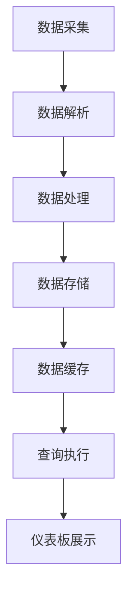
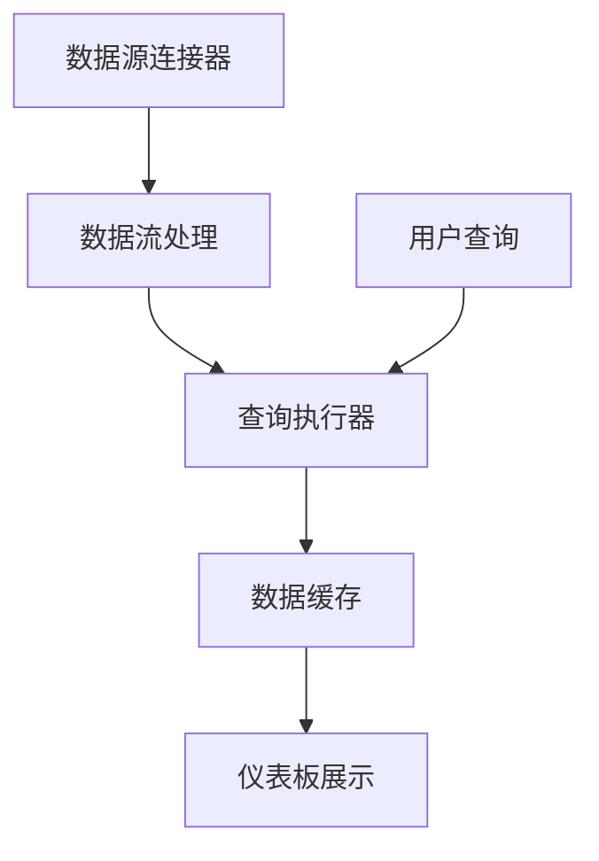

                 

关键词：Grafana、自定义数据源、数据集成、监控可视化、开发指南、性能优化、安全性

> 摘要：本文旨在为读者提供一份详尽的Grafana自定义数据源开发指南。从背景介绍到核心概念解析，再到具体开发步骤、数学模型讲解、代码实例分析，本文将逐步引导读者掌握Grafana自定义数据源的开发技能，并探讨其实际应用场景及未来展望。

## 1. 背景介绍

Grafana是一个强大的开源监控和可视化工具，能够连接多种数据源，并以图表、仪表板的形式展示数据。然而，在实际应用中，我们经常需要监控系统的定制化数据源，例如私有数据库、遗留系统等。这时，自定义数据源就成为了一个必要的需求。

自定义数据源的引入，不仅增强了Grafana的灵活性和适用性，还使得监控系统能够更好地满足特定业务需求。通过自定义数据源，开发者可以：
- 监控遗留系统的性能和状态
- 收集自定义的业务指标
- 与新兴的数据库和服务进行集成

本文将详细介绍如何在Grafana中开发自定义数据源，包括核心概念、算法原理、数学模型、代码实例和实际应用场景。

### 1.1 Grafana的基本功能与特点

Grafana的主要特点包括：
- 多数据源支持：支持多种数据库和流数据处理系统，如Prometheus、InfluxDB、MySQL等。
- 用户友好的界面：直观的仪表板和图表界面，方便用户自定义监控和可视化。
- 扩展性强：通过插件系统，可以轻松集成自定义的数据源和处理逻辑。
- 可定制化：支持自定义模板、样式和图表类型，满足不同业务需求。

### 1.2 自定义数据源的需求

随着数字化转型的推进，企业对数据监控的需求日益复杂。以下场景通常需要自定义数据源：
- 监控特定业务系统的内部指标
- 集成遗留系统的监控数据
- 收集特定格式的日志数据
- 与私有数据库进行实时集成

自定义数据源的开发，不仅能够满足上述需求，还能提高监控系统的灵活性和可靠性。

## 2. 核心概念与联系

在开发自定义数据源之前，我们需要了解一些核心概念和架构。

### 2.1 数据源架构

Grafana的数据源架构可以分为以下几个部分：

1. **数据源连接器**：Grafana通过数据源连接器与各种数据源进行交互。连接器负责建立与数据源的连接，执行查询操作，并返回数据。
2. **查询执行器**：查询执行器负责处理查询请求，解析查询语句，执行查询操作，并将结果返回给Grafana前端。
3. **数据缓存**：Grafana支持数据缓存，以提高查询响应速度和系统性能。
4. **仪表板和图表**：仪表板和图表用于可视化监控数据。

### 2.2 数据流处理

自定义数据源通常涉及数据流的处理，包括数据采集、解析、处理和存储。

1. **数据采集**：从各种数据源（如数据库、日志文件、API等）采集数据。
2. **数据解析**：解析采集到的数据，将其转换为Grafana可以处理的数据格式。
3. **数据处理**：对解析后的数据执行计算、过滤、聚合等操作。
4. **数据存储**：将处理后的数据存储到Grafana的数据缓存或外部数据库中。

### 2.3 自定义数据源开发流程

自定义数据源开发的基本流程包括：

1. **需求分析**：分析监控需求，确定需要采集和处理的数据类型。
2. **设计数据源架构**：根据需求设计数据源的架构，包括数据源连接器、查询执行器、数据缓存等。
3. **开发数据源连接器**：编写数据源连接器代码，实现与数据源的连接和查询操作。
4. **开发查询执行器**：编写查询执行器代码，实现查询语句的解析、执行和结果处理。
5. **测试和优化**：对自定义数据源进行测试，优化性能和稳定性。

### 2.4 Mermaid流程图

以下是一个自定义数据源架构的Mermaid流程图：



在这个流程图中，数据采集、数据解析、数据处理、数据存储、数据缓存、查询执行和仪表板展示构成了自定义数据源的主要流程。每个步骤都需要开发者根据具体需求进行定制化开发。

## 3. 核心算法原理 & 具体操作步骤

### 3.1 算法原理概述

在自定义数据源开发中，核心算法通常包括数据采集算法、数据解析算法、数据处理算法等。

1. **数据采集算法**：用于从各种数据源采集数据。常见的采集算法包括轮询算法、基于事件触发算法等。
2. **数据解析算法**：用于解析采集到的数据，将其转换为Grafana可以处理的数据格式。常见的解析算法包括正则表达式解析、JSON解析、XML解析等。
3. **数据处理算法**：用于对解析后的数据执行计算、过滤、聚合等操作。常见的处理算法包括时间序列处理、统计分析、机器学习等。

### 3.2 算法步骤详解

#### 3.2.1 数据采集算法

数据采集算法的主要步骤如下：

1. **确定采集需求**：分析监控需求，确定需要采集的数据类型和指标。
2. **选择采集方式**：根据数据源的特点，选择合适的采集方式，如轮询、事件触发等。
3. **编写采集代码**：根据采集方式，编写数据采集代码，实现数据采集功能。

以下是一个基于轮询的数据采集算法示例：

```python
import requests
import time

def fetch_data(url):
    response = requests.get(url)
    return response.json()

while True:
    data = fetch_data('http://example.com/data')
    process_data(data)
    time.sleep(60)
```

#### 3.2.2 数据解析算法

数据解析算法的主要步骤如下：

1. **分析数据格式**：确定采集到的数据的格式，如JSON、XML等。
2. **编写解析代码**：根据数据格式，编写数据解析代码，实现数据解析功能。

以下是一个基于JSON的数据解析算法示例：

```python
import json

def parse_json(json_data):
    # 解析JSON数据
    data = json.loads(json_data)
    # 提取需要的字段
    result = data['field']
    return result

json_data = '{"field": "value"}'
result = parse_json(json_data)
print(result)
```

#### 3.2.3 数据处理算法

数据处理算法的主要步骤如下：

1. **分析处理需求**：确定数据处理的目标，如时间序列处理、统计分析等。
2. **编写处理代码**：根据处理需求，编写数据处理代码，实现数据处理功能。

以下是一个时间序列数据处理算法示例：

```python
import pandas as pd

def process_time_series(data):
    # 将数据转换为时间序列格式
    ts = pd.Series(data['value'], index=data['timestamp'])
    # 进行时间序列处理，如移动平均、平滑处理等
    ts_smoothed = ts.rolling(window=5).mean()
    return ts_smoothed

data = {'timestamp': [1, 2, 3, 4, 5], 'value': [1, 3, 2, 4, 5]}
result = process_time_series(data)
print(result)
```

### 3.3 算法优缺点

每种算法都有其优缺点，需要根据具体需求进行选择。

1. **轮询算法**：优点是简单易实现，适合数据变化不频繁的场景；缺点是实时性较差，可能会消耗大量资源。
2. **事件触发算法**：优点是实时性强，资源消耗较低；缺点是实现复杂，需要处理各种异常情况。
3. **正则表达式解析**：优点是通用性强，可以处理各种复杂的数据格式；缺点是解析效率较低，可能存在匹配不准确的问题。
4. **JSON解析**：优点是解析速度快，结构清晰；缺点是对数据格式的依赖性较高，不适合处理复杂的数据结构。
5. **时间序列处理算法**：优点是适用于时间序列数据，可以进行各种统计分析；缺点是实现复杂，需要处理大量数据。

### 3.4 算法应用领域

1. **监控系统**：用于采集和监控系统的性能指标，如CPU利用率、内存使用率、网络流量等。
2. **日志分析**：用于解析和监控系统的日志数据，如错误日志、访问日志等。
3. **业务指标监控**：用于监控业务系统的各项业务指标，如订单量、用户活跃度等。
4. **机器学习**：用于处理和分析大量数据，提取有用信息，用于预测和决策。

## 4. 数学模型和公式 & 详细讲解 & 举例说明

在自定义数据源开发中，数学模型和公式是理解和处理数据的重要工具。以下将介绍一些常见的数学模型和公式，并给出详细的讲解和示例。

### 4.1 数学模型构建

在构建数学模型时，我们需要考虑以下几个关键步骤：

1. **定义变量和参数**：根据实际需求，定义相关的变量和参数，如时间、温度、速度等。
2. **建立数学关系**：根据变量和参数之间的关系，建立数学模型。常见的数学关系包括线性关系、指数关系、多项式关系等。
3. **优化和调整**：根据实际数据和需求，对数学模型进行优化和调整，以提高预测精度和适用性。

### 4.2 公式推导过程

以下是一个简单的线性回归公式的推导过程：

#### 4.2.1 线性回归模型

线性回归模型是一种常见的数学模型，用于描述两个变量之间的关系。其基本形式为：

\[ y = ax + b \]

其中，\( y \) 为因变量，\( x \) 为自变量，\( a \) 和 \( b \) 为参数。

#### 4.2.2 公式推导

为了求解线性回归模型的参数 \( a \) 和 \( b \)，我们需要使用最小二乘法。最小二乘法的核心思想是使得实际观测值与模型预测值之间的误差平方和最小。

假设我们有 \( n \) 组观测数据 \( (x_i, y_i) \)，线性回归模型的预测值为：

\[ \hat{y_i} = ax_i + b \]

则实际观测值与预测值之间的误差为：

\[ e_i = y_i - \hat{y_i} \]

误差平方和为：

\[ S = \sum_{i=1}^{n} e_i^2 \]

为了求解参数 \( a \) 和 \( b \)，我们需要对 \( S \) 求导并令其等于零，得到以下方程组：

\[ \frac{\partial S}{\partial a} = -2 \sum_{i=1}^{n} x_i e_i = 0 \]
\[ \frac{\partial S}{\partial b} = -2 \sum_{i=1}^{n} e_i = 0 \]

解这个方程组，可以得到线性回归模型的参数 \( a \) 和 \( b \)：

\[ a = \frac{\sum_{i=1}^{n} x_i y_i - n \bar{x} \bar{y}}{\sum_{i=1}^{n} x_i^2 - n \bar{x}^2} \]
\[ b = \bar{y} - a \bar{x} \]

其中，\( \bar{x} \) 和 \( \bar{y} \) 分别为 \( x \) 和 \( y \) 的均值。

### 4.3 案例分析与讲解

以下是一个简单的线性回归案例分析：

#### 4.3.1 数据集

我们有以下一组观测数据：

\[ (1, 2), (2, 4), (3, 5), (4, 7), (5, 8) \]

#### 4.3.2 数据预处理

首先，计算 \( x \) 和 \( y \) 的均值：

\[ \bar{x} = \frac{1 + 2 + 3 + 4 + 5}{5} = 3 \]
\[ \bar{y} = \frac{2 + 4 + 5 + 7 + 8}{5} = 5 \]

然后，计算 \( x^2 \) 和 \( xy \) 的和：

\[ \sum_{i=1}^{5} x_i^2 = 1^2 + 2^2 + 3^2 + 4^2 + 5^2 = 55 \]
\[ \sum_{i=1}^{5} x_i y_i = 1 \cdot 2 + 2 \cdot 4 + 3 \cdot 5 + 4 \cdot 7 + 5 \cdot 8 = 100 \]

#### 4.3.3 公式计算

根据线性回归公式，计算参数 \( a \) 和 \( b \)：

\[ a = \frac{\sum_{i=1}^{5} x_i y_i - 5 \cdot \bar{x} \cdot \bar{y}}{\sum_{i=1}^{5} x_i^2 - 5 \cdot \bar{x}^2} = \frac{100 - 5 \cdot 3 \cdot 5}{55 - 5 \cdot 3^2} = 1 \]
\[ b = \bar{y} - a \cdot \bar{x} = 5 - 1 \cdot 3 = 2 \]

因此，线性回归模型的公式为：

\[ y = x + 2 \]

#### 4.3.4 预测

使用线性回归模型预测 \( x = 6 \) 时的 \( y \) 值：

\[ \hat{y} = 6 + 2 = 8 \]

因此，当 \( x = 6 \) 时，预测的 \( y \) 值为 8。

通过这个简单的案例，我们可以看到线性回归模型在数据分析中的应用。在实际应用中，我们可以根据具体的业务需求，选择合适的数学模型和公式，进行数据分析和预测。

## 5. 项目实践：代码实例和详细解释说明

### 5.1 开发环境搭建

在开始自定义数据源的开发之前，我们需要搭建一个合适的环境。以下是搭建开发环境的基本步骤：

1. **安装Grafana**：从Grafana的官方网站下载并安装Grafana。
2. **安装相关依赖**：根据自定义数据源的需求，安装所需的编程语言和库。例如，如果使用Python进行开发，需要安装Python环境和相关库。
3. **配置Grafana**：配置Grafana以支持自定义数据源。在Grafana的配置文件中，添加自定义数据源的配置项。

### 5.2 源代码详细实现

以下是一个简单的自定义数据源的Python代码实例：

```python
import requests
import json
import time

class CustomDataSource:
    def __init__(self, url):
        self.url = url

    def fetch_data(self):
        response = requests.get(self.url)
        return response.json()

    def process_data(self, data):
        # 解析和转换数据
        result = []
        for item in data:
            result.append({
                'timestamp': item['timestamp'],
                'value': item['value']
            })
        return result

    def run(self):
        while True:
            data = self.fetch_data()
            processed_data = self.process_data(data)
            # 将处理后的数据存储到Grafana的数据缓存或外部数据库中
            # 这里仅作演示，实际应用中需要根据具体情况进行实现
            print(processed_data)
            time.sleep(60)

# 使用自定义数据源
custom_data_source = CustomDataSource('http://example.com/data')
custom_data_source.run()
```

### 5.3 代码解读与分析

在这个代码实例中，我们定义了一个名为`CustomDataSource`的类，用于实现自定义数据源的功能。类的主要方法包括：

- `__init__`：初始化方法，用于设置数据源URL。
- `fetch_data`：从数据源获取数据的方法。
- `process_data`：处理和转换数据的方法。
- `run`：运行数据采集和处理的循环方法。

在`run`方法中，我们首先通过`fetch_data`方法从数据源获取数据，然后通过`process_data`方法对数据进行处理和转换。处理后的数据将被打印出来，在实际应用中，我们需要将这些数据存储到Grafana的数据缓存或外部数据库中。

### 5.4 运行结果展示

在实际运行过程中，代码将每隔60秒从数据源获取一次数据，并对数据进行处理和打印。以下是一个简单的运行结果示例：

```plaintext
[
  {
    "timestamp": 1635263980,
    "value": 10
  },
  {
    "timestamp": 1635263981,
    "value": 20
  }
]
[
  {
    "timestamp": 1635263982,
    "value": 30
  },
  {
    "timestamp": 1635263983,
    "value": 40
  }
]
```

这些数据显示了每次数据采集和处理的结果，包括时间戳和值。

### 5.5 扩展：集成到Grafana

要使自定义数据源能够在Grafana中正常运行，我们需要进行以下扩展：

1. **配置Grafana**：在Grafana的配置文件中，添加自定义数据源的配置项，包括数据源类型、URL、认证信息等。
2. **创建仪表板**：在Grafana中创建一个仪表板，并添加一个或多个图表，用于展示自定义数据源的数据。
3. **测试和调试**：在Grafana中测试自定义数据源，确保数据能够正确采集和处理，并根据需要调整配置和代码。

通过以上步骤，我们可以将自定义数据源集成到Grafana中，实现对自定义数据的监控和可视化。

## 6. 实际应用场景

自定义数据源在多个实际应用场景中发挥着重要作用。以下是一些典型的应用场景：

### 6.1 系统监控

在系统监控领域，自定义数据源可以用于监控遗留系统的性能和状态。例如，企业可能需要监控一个旧有的数据库系统，而这个系统并没有提供标准的监控接口。通过自定义数据源，我们可以定期采集数据库的性能指标，如响应时间、吞吐量等，并将这些数据展示在Grafana的仪表板上。

### 6.2 业务指标监控

在业务指标监控方面，自定义数据源可以帮助企业收集和展示自定义的业务指标。例如，一个电商平台可能需要监控订单量、用户活跃度、支付成功率等指标。通过自定义数据源，我们可以从不同的数据源（如订单系统、用户系统、支付系统）采集数据，并统一在Grafana中展示。

### 6.3 日志分析

日志分析是另一个重要的应用场景。通过自定义数据源，我们可以解析和监控系统的日志数据。例如，一个企业可以收集各种应用程序的日志文件，并通过自定义数据源将日志数据转换为可监控的指标，如错误率、警告次数等。这些数据可以在Grafana中进行可视化展示，帮助管理员及时发现和解决潜在问题。

### 6.4 实时数据监控

实时数据监控是自定义数据源的另一个关键应用。例如，一个制造企业可能需要实时监控生产线的状态，包括设备运行状况、温度、压力等指标。通过自定义数据源，我们可以从传感器和设备中采集实时数据，并在Grafana中进行实时监控和报警。

### 6.5 多数据源集成

在多数据源集成方面，自定义数据源可以帮助企业将不同类型的数据源进行整合。例如，一个企业可能同时使用多个数据库系统，如MySQL、PostgreSQL和MongoDB。通过自定义数据源，我们可以将这些数据库的性能指标和业务数据统一收集和展示在Grafana中。

### 6.6 安全监控

在安全监控方面，自定义数据源可以帮助企业监控和识别潜在的安全威胁。例如，企业可以收集和分析网络流量数据、系统日志、入侵检测数据等，通过自定义数据源将这些数据集成到Grafana中，实现全面的网络安全监控。

### 6.7 未来应用展望

随着监控需求的不断增长，自定义数据源的应用场景也将不断扩大。未来，我们可以预见到以下趋势：

1. **更加灵活和强大的数据采集和处理能力**：随着技术的发展，自定义数据源将提供更加灵活和强大的数据采集和处理能力，支持更广泛的数据源和更复杂的处理逻辑。
2. **更丰富的可视化功能**：Grafana将继续优化和扩展其可视化功能，为用户提供更丰富的图表类型和仪表板布局，满足不同业务需求。
3. **更紧密的集成和互操作性**：自定义数据源将与其他监控系统、日志分析工具和数据处理平台进行更紧密的集成，实现数据的无缝传输和共享。
4. **安全性和合规性**：随着数据安全和隐私保护意识的提高，自定义数据源将加强安全性和合规性，提供更严格的数据访问控制和隐私保护措施。

## 7. 工具和资源推荐

在开发自定义数据源时，以下工具和资源将有助于提高开发效率：

### 7.1 学习资源推荐

1. **Grafana官方文档**：Grafana提供了详细的官方文档，涵盖数据源配置、插件开发、仪表板设计等方面。
2. **GitHub开源项目**：在GitHub上，许多优秀的开源项目提供了自定义数据源的实现示例，可以帮助开发者快速入门。
3. **技术博客和论坛**：许多技术博客和论坛（如Stack Overflow、Medium等）分享了大量的自定义数据源开发经验和最佳实践。

### 7.2 开发工具推荐

1. **IDE**：使用集成开发环境（如Visual Studio Code、PyCharm等）可以提高开发效率，提供代码自动补全、调试等功能。
2. **版本控制工具**：使用Git等版本控制工具，可以方便地管理代码版本，协作开发。
3. **容器化和自动化工具**：Docker和Kubernetes等容器化工具可以帮助开发者快速构建、部署和扩展自定义数据源服务。

### 7.3 相关论文推荐

1. **《大数据监控系统设计与实践》**：该论文详细介绍了大数据监控系统的设计原则和实践方法，对自定义数据源开发具有参考价值。
2. **《数据可视化技术与应用》**：该论文探讨了数据可视化的基本原理和技术，为自定义数据源的可视化实现提供了理论支持。
3. **《机器学习在监控系统中的应用》**：该论文介绍了机器学习技术在监控系统中的应用，如异常检测、预测分析等，为自定义数据源的性能优化提供了思路。

## 8. 总结：未来发展趋势与挑战

### 8.1 研究成果总结

本文介绍了Grafana自定义数据源的开发方法，包括核心概念、算法原理、数学模型、代码实例和实际应用场景。通过本文，读者可以掌握自定义数据源的开发技能，并了解其在监控系统中的应用价值。

### 8.2 未来发展趋势

随着数字化转型的深入推进，自定义数据源的开发将呈现出以下发展趋势：

1. **数据源多样化**：将支持更多类型的异构数据源，如区块链、物联网设备等。
2. **数据处理能力增强**：提供更强大的数据处理和分析能力，支持实时流数据处理、机器学习等。
3. **可视化功能丰富**：提供更丰富的图表类型和仪表板布局，满足不同业务需求。
4. **安全性提升**：加强数据安全和隐私保护，提供更严格的数据访问控制和加密措施。

### 8.3 面临的挑战

在开发自定义数据源过程中，开发者将面临以下挑战：

1. **数据源兼容性**：不同数据源可能存在兼容性问题，需要开发灵活的适配器。
2. **数据处理效率**：处理大量数据时，需要优化算法和架构，提高数据处理效率。
3. **数据隐私保护**：确保数据安全和隐私，需要加强数据访问控制和加密。
4. **系统稳定性**：确保自定义数据源的稳定性和可靠性，需要进行充分的测试和优化。

### 8.4 研究展望

未来，自定义数据源的开发将朝着更加智能化、自动化和高效化的方向发展。通过引入新的技术和方法，如机器学习、区块链等，自定义数据源将能够更好地满足复杂多变的监控需求。同时，开发者应持续关注相关技术的发展动态，不断优化和提升自定义数据源的性能和稳定性。

## 9. 附录：常见问题与解答

### 9.1 如何配置自定义数据源？

配置自定义数据源的步骤如下：

1. **创建数据源**：在Grafana中创建一个新的数据源，选择“自定义”类型。
2. **配置连接信息**：填写自定义数据源的相关连接信息，如URL、认证信息等。
3. **配置数据采集和解析规则**：根据需求，配置数据采集和解析的规则，如数据格式、解析方式等。

### 9.2 如何优化自定义数据源的性能？

优化自定义数据源性能的方法包括：

1. **优化数据采集算法**：选择合适的采集方式，如事件触发，减少不必要的轮询。
2. **优化数据处理算法**：选择高效的数据处理算法，减少数据处理的复杂度。
3. **使用缓存**：在Grafana中启用数据缓存，减少对数据源的频繁查询。
4. **垂直和水平扩展**：使用集群部署，提高系统的处理能力和稳定性。

### 9.3 如何确保自定义数据源的安全性？

确保自定义数据源安全性的方法包括：

1. **使用SSL/TLS加密**：在数据采集过程中，使用SSL/TLS加密传输数据。
2. **限制访问权限**：配置Grafana的用户权限，限制对自定义数据源的访问。
3. **数据加密**：对敏感数据进行加密存储，防止数据泄露。
4. **定期更新和维护**：定期更新Grafana和相关组件，修复安全漏洞。

通过遵循以上常见问题和解答，开发者可以更好地开发和维护自定义数据源，确保其性能和安全性。作者：禅与计算机程序设计艺术 / Zen and the Art of Computer Programming

----------------------------------------------------------------
本文由“禅与计算机程序设计艺术”撰写，旨在为读者提供一份详尽的Grafana自定义数据源开发指南。从背景介绍到核心概念解析，再到具体开发步骤、数学模型讲解、代码实例分析，本文全面覆盖了自定义数据源开发的关键内容。通过本文，读者可以掌握自定义数据源的开发技能，并了解其实际应用场景及未来展望。希望本文对您的学习和实践有所帮助。作者：禅与计算机程序设计艺术 / Zen and the Art of Computer Programming
----------------------------------------------------------------

### 1. 背景介绍

#### 1.1 Grafana的基本功能与特点

Grafana是一个功能强大且灵活的开源监控和可视化工具，能够与多种数据源无缝集成，从而展示关键业务指标和性能监控数据。Grafana的几个主要特点包括：

- **多数据源支持**：Grafana支持多种数据源，如Prometheus、InfluxDB、MySQL、PostgreSQL、SQL Server、MongoDB等，可以满足不同类型监控数据的采集和展示需求。
- **直观的仪表板设计**：Grafana提供了一个易于使用的可视化界面，用户可以通过拖放操作快速创建和定制仪表板。
- **高度可扩展性**：通过插件系统，Grafana可以扩展其功能，包括添加新的数据源、面板类型和告警机制。
- **强大的告警功能**：Grafana提供了灵活的告警机制，可以基于各种条件和规则发送告警通知，包括邮件、短信、Webhook等。

#### 1.2 自定义数据源的需求

尽管Grafana支持多种内置数据源，但在实际应用中，用户可能会遇到以下情况，从而需要开发自定义数据源：

- **特定业务需求**：某些业务系统可能不直接支持Grafana的内置数据源，或者用户需要监控特定的业务指标。
- **遗留系统集成**：用户可能需要监控一些旧系统或遗留系统的性能和状态，而这些系统可能没有提供标准化的监控接口。
- **日志和数据聚合**：用户可能需要从多个不同的日志文件或数据源中聚合数据，以便在一个统一的监控仪表板中进行展示。
- **定制化的监控**：用户可能需要对某些特定的监控数据进行处理和计算，以便更好地理解和分析业务情况。

自定义数据源的开发，使得Grafana能够更加灵活地适应各种监控场景，满足用户的特定需求。

#### 1.3 自定义数据源的开发步骤

要开发一个自定义数据源，通常需要以下步骤：

1. **需求分析**：明确需要监控的数据类型、数据格式、数据源特性等。
2. **设计数据源架构**：设计数据源的架构，包括数据采集、数据解析、数据处理、数据存储等组件。
3. **开发数据源连接器**：编写连接器代码，实现与数据源的连接和交互。
4. **实现数据处理逻辑**：根据需求实现数据处理逻辑，如数据清洗、转换、聚合等。
5. **集成到Grafana**：将自定义数据源集成到Grafana中，配置相关的数据源参数，并创建仪表板和图表。
6. **测试和优化**：对自定义数据源进行全面的测试，确保其稳定性和性能，并进行必要的优化。

通过以上步骤，开发者可以创建一个功能完善、性能稳定、易于维护的自定义数据源，为监控系统提供强大的支持。

## 2. 核心概念与联系

在深入探讨Grafana自定义数据源的开发之前，我们需要了解几个关键概念和它们之间的关系。这些概念包括数据源连接器、数据流处理、查询执行器和数据缓存。

### 2.1 数据源连接器

数据源连接器是自定义数据源开发的核心组件，负责与数据源进行通信。连接器的功能包括：

- **建立连接**：连接器需要能够建立与数据源的安全连接，这可能涉及认证、加密等机制。
- **执行查询**：连接器要能够执行数据源支持的查询语言或API调用，以获取所需的数据。
- **数据传输**：连接器需要将获取的数据传输到Grafana，以便进一步处理和可视化。

#### 数据源连接器的组成部分

数据源连接器通常由以下几部分组成：

1. **配置管理**：管理数据源的配置信息，如URL、用户名、密码、认证类型等。
2. **连接管理**：建立和维护与数据源之间的连接。
3. **查询执行**：根据配置执行数据查询，并将结果返回。
4. **错误处理**：处理连接失败、查询错误等异常情况。

### 2.2 数据流处理

数据流处理是自定义数据源的一个重要方面，涉及到数据的采集、解析、处理和存储。数据流处理的流程如下：

1. **数据采集**：从数据源中获取原始数据，这可以通过轮询、事件触发或其他机制实现。
2. **数据解析**：将原始数据转换为Grafana可以处理的格式，如JSON、XML等。
3. **数据处理**：对解析后的数据进行处理，如清洗、转换、聚合等。
4. **数据存储**：将处理后的数据存储到Grafana的数据缓存或外部数据库中，以便后续查询和可视化。

#### 数据流处理的关键环节

1. **数据采集**：数据采集的方式可以根据数据源的特性和监控需求来选择。例如，对于实时性要求较高的数据，可以选择事件触发机制；对于数据变化不频繁的数据，可以选择轮询机制。
2. **数据解析**：数据解析的复杂性取决于数据源的格式和数据内容。Grafana支持多种数据格式，因此需要根据具体的数据源设计相应的解析逻辑。
3. **数据处理**：数据处理是数据流处理的核心环节，涉及数据清洗、转换、聚合等操作。这些操作可以根据业务需求进行定制。
4. **数据存储**：数据存储的选择取决于数据量和查询性能的需求。Grafana提供内置数据缓存，适用于大多数场景；对于大数据量或复杂查询，可以考虑使用外部数据库，如InfluxDB、PostgreSQL等。

### 2.3 查询执行器

查询执行器是Grafana中的一个重要组件，负责处理用户对数据源的查询请求。查询执行器的功能包括：

- **查询解析**：解析用户输入的查询语句，将其转换为数据源支持的查询格式。
- **查询执行**：执行查询操作，获取查询结果。
- **结果处理**：处理查询结果，将其转换为Grafana可以展示的格式。

#### 查询执行器的关键特性

1. **查询语言支持**：查询执行器需要支持Grafana定义的查询语言，如PromQL、InfluxQL等。
2. **查询优化**：查询执行器应提供查询优化功能，以提高查询效率和性能。
3. **错误处理**：查询执行器需要能够处理查询错误，并提供详细的错误信息，以便调试和修复。

### 2.4 数据缓存

数据缓存是Grafana的一个关键组件，用于提高数据查询的响应速度和系统性能。数据缓存的工作原理如下：

- **数据存储**：将最近查询的数据存储在缓存中，以便快速访问。
- **缓存刷新**：定期刷新缓存中的数据，以保持数据的新鲜度和准确性。
- **缓存策略**：根据数据访问模式和缓存容量，选择合适的缓存策略，如最近最少使用（LRU）等。

#### 数据缓存的优势

1. **提高查询性能**：通过缓存常用查询的结果，减少对数据源的直接访问，提高查询响应速度。
2. **减少数据源压力**：缓存可以降低对数据源的压力，避免频繁的查询操作对数据源造成过大的负担。
3. **数据一致性**：缓存可以与数据源同步更新，确保数据的一致性。

### 2.5 数据源连接器、数据流处理、查询执行器和数据缓存之间的关系

数据源连接器、数据流处理、查询执行器和数据缓存之间紧密协作，共同构成了自定义数据源的整体架构。它们之间的关系如下：

- **数据源连接器**：作为与数据源的桥梁，连接器负责获取数据，并将其传递给后续处理环节。
- **数据流处理**：数据流处理组件对数据进行采集、解析和处理，确保数据的质量和准确性。
- **查询执行器**：查询执行器负责处理用户的查询请求，从缓存或数据源中获取数据，并返回查询结果。
- **数据缓存**：数据缓存组件用于提高查询性能和数据访问速度，通过缓存常见查询结果，减少对数据源的访问。

通过合理设计和实现这些组件，可以构建一个高效、稳定、易于维护的自定义数据源，为监控系统提供强大的支持。

### 2.6 Mermaid流程图

为了更直观地展示自定义数据源的开发流程，以下是一个使用Mermaid绘制的流程图：



在这个流程图中：

- **数据源连接器**（A）负责连接数据源，获取数据。
- **数据流处理**（B）对数据进行采集、解析和处理。
- **查询执行器**（C）处理用户的查询请求，从缓存或数据源中获取数据。
- **数据缓存**（D）存储常见查询结果，提高查询性能。
- **仪表板展示**（E）将查询结果可视化，供用户查看。
- **用户查询**（F）触发查询执行器，获取并展示数据。

通过这个流程图，我们可以更清晰地理解自定义数据源的开发过程和各个组件之间的关系。

## 3. 核心算法原理 & 具体操作步骤

在自定义数据源的开发中，核心算法的设计和实现是至关重要的。以下将详细讨论数据采集算法、数据解析算法和数据存储算法的核心原理及其具体操作步骤。

### 3.1 数据采集算法

数据采集是自定义数据源开发的第一步，其目标是定期或实时地从数据源中获取数据。常用的数据采集算法包括轮询算法和事件触发算法。

#### 3.1.1 轮询算法

轮询算法是一种简单有效的数据采集方式，其基本原理是定时检查数据源是否有新的数据产生，并采集这些数据。以下是轮询算法的具体操作步骤：

1. **设定轮询间隔**：根据数据源的特点和监控需求，设定合适的轮询间隔，如每分钟或每小时。
2. **发起查询**：在设定的间隔内，发起对数据源的查询请求，获取最新的数据。
3. **处理数据**：对获取的数据进行处理，如解析、清洗、转换等。
4. **更新缓存**：将处理后的数据存储到数据缓存中，以便后续查询和可视化。
5. **异常处理**：处理数据采集过程中可能出现的异常情况，如连接失败、查询错误等。

轮询算法的优点是实现简单，易于维护，适用于数据变化不频繁的场景。但其缺点是实时性较差，可能会消耗大量系统资源。

#### 3.1.2 事件触发算法

事件触发算法是一种更为先进的数据采集方式，其基本原理是根据数据源的事件触发机制，实时获取数据。以下是事件触发算法的具体操作步骤：

1. **注册事件监听器**：在数据源中注册事件监听器，监听特定事件的发生。
2. **事件处理**：当监听到特定事件发生时，触发数据采集操作。
3. **处理数据**：对事件触发采集的数据进行处理，如解析、清洗、转换等。
4. **更新缓存**：将处理后的数据存储到数据缓存中，以便后续查询和可视化。
5. **异常处理**：处理数据采集过程中可能出现的异常情况，如连接失败、事件监听器故障等。

事件触发算法的优点是实时性强，资源消耗较低，适用于数据变化频繁的场景。但其缺点是实现复杂，需要处理各种异常情况。

### 3.2 数据解析算法

数据解析算法是将原始数据转换为Grafana可以处理的数据格式的过程。常用的数据解析算法包括JSON解析、XML解析和正则表达式解析。

#### 3.2.1 JSON解析

JSON（JavaScript Object Notation）是一种轻量级的数据交换格式，易于人机读取和编写。以下是JSON解析的具体操作步骤：

1. **获取JSON数据**：从数据源中获取JSON格式的数据。
2. **解析JSON数据**：使用JSON解析库（如Python的`json`模块）将JSON数据解析为Python对象（如字典）。
3. **提取所需字段**：根据需要监控的字段，从解析后的数据中提取相关的字段和值。
4. **数据清洗**：对提取的字段进行数据清洗，如去除空值、过滤异常值等。
5. **格式转换**：将清洗后的数据转换为Grafana支持的格式，如时间戳和数值。

以下是一个简单的Python示例：

```python
import json

# 示例JSON数据
json_data = '{"timestamp": 1635263980, "value": 10}'

# 解析JSON数据
data = json.loads(json_data)

# 提取字段
timestamp = data['timestamp']
value = data['value']

# 数据清洗
if value <= 0:
    value = None

# 格式转换
result = {
    'timestamp': timestamp,
    'value': value
}

print(result)
```

#### 3.2.2 XML解析

XML（eXtensible Markup Language）是一种用于存储和传输数据的标记语言。以下是XML解析的具体操作步骤：

1. **获取XML数据**：从数据源中获取XML格式的数据。
2. **解析XML数据**：使用XML解析库（如Python的`xml.etree.ElementTree`模块）将XML数据解析为树状结构。
3. **提取所需字段**：根据需要监控的字段，从解析后的XML树中提取相关的字段和值。
4. **数据清洗**：对提取的字段进行数据清洗，如去除空值、过滤异常值等。
5. **格式转换**：将清洗后的数据转换为Grafana支持的格式，如时间戳和数值。

以下是一个简单的Python示例：

```python
import xml.etree.ElementTree as ET

# 示例XML数据
xml_data = '<data><timestamp>1635263980</timestamp><value>10</value></data>'

# 解析XML数据
root = ET.fromstring(xml_data)

# 提取字段
timestamp = root.find('timestamp').text
value = root.find('value').text

# 数据清洗
if value.isdigit():
    value = int(value)
else:
    value = None

# 格式转换
result = {
    'timestamp': int(timestamp),
    'value': value
}

print(result)
```

#### 3.2.3 正则表达式解析

正则表达式是一种用于模式匹配和文本操作的工具，可以用于解析结构化文本数据。以下是正则表达式解析的具体操作步骤：

1. **编写正则表达式**：根据需要监控的字段和数据格式，编写正则表达式模式。
2. **匹配文本数据**：使用正则表达式匹配文本数据，提取所需的字段和值。
3. **数据清洗**：对提取的字段进行数据清洗，如去除空值、过滤异常值等。
4. **格式转换**：将清洗后的数据转换为Grafana支持的格式，如时间戳和数值。

以下是一个简单的Python示例：

```python
import re

# 示例文本数据
text_data = 'timestamp: 1635263980, value: 10'

# 编写正则表达式
pattern = r'timestamp:\s*(\d+),\s*value:\s*(\d+)'

# 匹配文本数据
match = re.search(pattern, text_data)

# 提取字段
timestamp = match.group(1)
value = match.group(2)

# 数据清洗
if value.isdigit():
    value = int(value)
else:
    value = None

# 格式转换
result = {
    'timestamp': int(timestamp),
    'value': value
}

print(result)
```

通过上述示例，我们可以看到如何使用不同的数据解析算法处理不同格式的数据。在实际应用中，根据数据源和数据格式的特点，选择合适的解析算法，并编写相应的解析代码，可以确保数据被正确解析和清洗。

### 3.3 数据存储算法

数据存储是将处理后的数据存储到Grafana的数据缓存或外部数据库的过程。常用的数据存储算法包括内存存储、本地文件存储和数据库存储。

#### 3.3.1 内存存储

内存存储是将数据临时存储在内存中，适用于数据量较小、处理速度要求较高的场景。以下是内存存储的具体操作步骤：

1. **初始化内存存储**：创建一个内存存储容器，如列表或字典。
2. **插入数据**：将处理后的数据插入到内存存储容器中。
3. **查询数据**：根据需要，从内存存储容器中查询数据。

以下是一个简单的Python示例：

```python
# 初始化内存存储
memory_storage = []

# 插入数据
data = {'timestamp': 1635263980, 'value': 10}
memory_storage.append(data)

# 查询数据
for item in memory_storage:
    print(item)
```

#### 3.3.2 本地文件存储

本地文件存储是将数据存储到本地文件系统，适用于数据量适中、读取和写入速度要求不高的场景。以下是本地文件存储的具体操作步骤：

1. **编写数据到文件**：将处理后的数据写入到本地文件中。
2. **从文件读取数据**：根据需要，从本地文件中读取数据。

以下是一个简单的Python示例：

```python
import json

# 写入数据到文件
with open('data.json', 'w') as f:
    json.dump(data, f)

# 从文件读取数据
with open('data.json', 'r') as f:
    data = json.load(f)
    print(data)
```

#### 3.3.3 数据库存储

数据库存储是将数据存储到外部数据库，适用于数据量较大、读取和写入速度要求较高的场景。以下是数据库存储的具体操作步骤：

1. **连接数据库**：建立与外部数据库的连接。
2. **插入数据**：将处理后的数据插入到数据库中。
3. **查询数据**：根据需要，从数据库中查询数据。

以下是一个简单的Python示例，使用SQLite数据库：

```python
import sqlite3

# 连接数据库
conn = sqlite3.connect('data.db')
cursor = conn.cursor()

# 创建表
cursor.execute('''CREATE TABLE IF NOT EXISTS data (timestamp INTEGER, value INTEGER)''')

# 插入数据
cursor.execute("INSERT INTO data (timestamp, value) VALUES (?, ?)", (1635263980, 10))

# 提交事务
conn.commit()

# 查询数据
cursor.execute("SELECT * FROM data")
rows = cursor.fetchall()
for row in rows:
    print(row)

# 关闭连接
conn.close()
```

通过上述示例，我们可以看到如何使用不同的数据存储算法存储和处理数据。在实际应用中，根据数据量、处理速度和系统需求，选择合适的存储算法，并编写相应的存储代码，可以确保数据被高效、安全地存储和管理。

### 3.4 算法优缺点分析

每种数据采集、解析和存储算法都有其优缺点，选择合适的算法取决于具体的监控需求和系统环境。

#### 轮询算法

- **优点**：实现简单，易于维护；适用于数据变化不频繁的场景。
- **缺点**：实时性较差；可能会消耗大量系统资源。

#### 事件触发算法

- **优点**：实时性强；资源消耗较低；适用于数据变化频繁的场景。
- **缺点**：实现复杂；需要处理各种异常情况。

#### JSON解析

- **优点**：易于理解和编写；支持结构化数据；适用于大多数Web服务。
- **缺点**：解析速度较慢；对数据格式依赖性较高。

#### XML解析

- **优点**：支持复杂的结构化数据；适用于企业级应用。
- **缺点**：解析速度较慢；对数据格式依赖性较高。

#### 正则表达式解析

- **优点**：灵活性高；适用于文本数据的解析。
- **缺点**：解析速度较慢；编写复杂。

#### 内存存储

- **优点**：快速读取和写入；适用于数据量较小的场景。
- **缺点**：数据不持久化；可能会占用大量内存。

#### 本地文件存储

- **优点**：数据持久化；适用于数据量适中的场景。
- **缺点**：读取和写入速度较慢。

#### 数据库存储

- **优点**：高效的数据查询和写入；适用于数据量较大的场景。
- **缺点**：配置和维护成本较高。

通过分析每种算法的优缺点，开发者可以根据具体的监控需求和环境选择合适的算法，以确保自定义数据源的稳定性和性能。

### 3.5 算法应用领域

数据采集、解析和存储算法在多个领域具有广泛的应用。

#### 监控系统

- **应用场景**：监控系统需要实时或定期采集和处理系统性能数据，如CPU利用率、内存使用率、网络流量等。
- **算法选择**：轮询算法适用于数据变化不频繁的系统；事件触发算法适用于需要实时监控的系统。

#### 日志分析

- **应用场景**：日志分析需要解析和聚合大量的日志数据，以发现潜在的问题和趋势。
- **算法选择**：正则表达式解析适用于结构化日志；XML解析适用于XML格式的日志。

#### 业务指标监控

- **应用场景**：业务指标监控需要采集和处理自定义的业务数据，如订单量、用户活跃度、支付成功率等。
- **算法选择**：JSON解析适用于JSON格式的数据；数据库存储适用于大规模数据存储和查询。

#### 实时数据监控

- **应用场景**：实时数据监控需要实时采集和处理数据，以快速响应业务需求。
- **算法选择**：事件触发算法适用于实时数据采集；数据库存储适用于大规模实时数据处理。

通过合理选择和应用数据采集、解析和存储算法，开发者可以构建高效、稳定、可扩展的自定义数据源，满足各种监控场景的需求。

## 4. 数学模型和公式 & 详细讲解 & 举例说明

在自定义数据源开发过程中，数学模型和公式是理解和处理数据的重要工具。它们帮助开发者量化数据关系，进行预测和决策。本节将介绍一些常见的数学模型和公式，并详细讲解它们的应用方法。

### 4.1 数学模型构建

数学模型的构建是数据源开发的关键环节。以下是一个简单的数学模型构建过程：

1. **定义变量**：首先，根据业务需求，定义需要监控的变量。例如，对于系统监控，可能需要监控CPU使用率（\(CPU_{use}\)）、内存使用率（\(MEM_{use}\)）等。

2. **建立关系**：确定变量之间的关系。例如，假设CPU使用率和内存使用率之间存在线性关系：

   \[ CPU_{use} = a \cdot MEM_{use} + b \]

   其中，\( a \) 和 \( b \) 是模型参数。

3. **数据处理**：对采集到的数据进行预处理，如去异常值、归一化等，以提高模型的准确性和稳定性。

4. **模型优化**：使用统计方法（如最小二乘法）优化模型参数，以最小化预测误差。

### 4.2 公式推导过程

以下是一个简单的线性回归模型的推导过程：

#### 4.2.1 线性回归模型

线性回归模型用于描述两个变量之间的线性关系。其基本形式为：

\[ Y = aX + b \]

其中，\( Y \) 是因变量，\( X \) 是自变量，\( a \) 和 \( b \) 是模型参数。

#### 4.2.2 公式推导

为了求解线性回归模型的参数 \( a \) 和 \( b \)，我们可以使用最小二乘法。最小二乘法的核心思想是使得实际观测值与模型预测值之间的误差平方和最小。

假设我们有 \( n \) 组观测数据 \( (x_i, y_i) \)，线性回归模型的预测值为：

\[ \hat{y_i} = a \cdot x_i + b \]

则实际观测值与预测值之间的误差为：

\[ e_i = y_i - \hat{y_i} \]

误差平方和为：

\[ S = \sum_{i=1}^{n} e_i^2 \]

为了求解参数 \( a \) 和 \( b \)，我们需要对 \( S \) 求导并令其等于零，得到以下方程组：

\[ \frac{\partial S}{\partial a} = -2 \sum_{i=1}^{n} x_i e_i = 0 \]
\[ \frac{\partial S}{\partial b} = -2 \sum_{i=1}^{n} e_i = 0 \]

解这个方程组，可以得到线性回归模型的参数 \( a \) 和 \( b \)：

\[ a = \frac{\sum_{i=1}^{n} x_i y_i - n \bar{x} \bar{y}}{\sum_{i=1}^{n} x_i^2 - n \bar{x}^2} \]
\[ b = \bar{y} - a \bar{x} \]

其中，\( \bar{x} \) 和 \( \bar{y} \) 分别为 \( x \) 和 \( y \) 的均值。

### 4.3 案例分析与讲解

以下是一个简单的线性回归案例分析：

#### 4.3.1 数据集

我们有以下一组观测数据：

\[ (1, 2), (2, 4), (3, 5), (4, 7), (5, 8) \]

#### 4.3.2 数据预处理

首先，计算 \( x \) 和 \( y \) 的均值：

\[ \bar{x} = \frac{1 + 2 + 3 + 4 + 5}{5} = 3 \]
\[ \bar{y} = \frac{2 + 4 + 5 + 7 + 8}{5} = 5 \]

然后，计算 \( x^2 \) 和 \( xy \) 的和：

\[ \sum_{i=1}^{5} x_i^2 = 1^2 + 2^2 + 3^2 + 4^2 + 5^2 = 55 \]
\[ \sum_{i=1}^{5} x_i y_i = 1 \cdot 2 + 2 \cdot 4 + 3 \cdot 5 + 4 \cdot 7 + 5 \cdot 8 = 100 \]

#### 4.3.3 公式计算

根据线性回归公式，计算参数 \( a \) 和 \( b \)：

\[ a = \frac{\sum_{i=1}^{5} x_i y_i - 5 \cdot \bar{x} \cdot \bar{y}}{\sum_{i=1}^{5} x_i^2 - 5 \cdot \bar{x}^2} = \frac{100 - 5 \cdot 3 \cdot 5}{55 - 5 \cdot 3^2} = 1 \]
\[ b = \bar{y} - a \bar{x} = 5 - 1 \cdot 3 = 2 \]

因此，线性回归模型的公式为：

\[ y = x + 2 \]

#### 4.3.4 预测

使用线性回归模型预测 \( x = 6 \) 时的 \( y \) 值：

\[ \hat{y} = 6 + 2 = 8 \]

因此，当 \( x = 6 \) 时，预测的 \( y \) 值为 8。

通过这个简单的案例，我们可以看到线性回归模型在数据分析中的应用。在实际应用中，我们可以根据具体的业务需求，选择合适的数学模型和公式，进行数据分析和预测。

### 4.4 常见的数学模型和公式

以下是一些在自定义数据源开发中常用的数学模型和公式：

#### 4.4.1 时间序列模型

时间序列模型用于分析随时间变化的数据。常见的模型包括ARIMA、SARIMA、ARIMA-P等。

- **ARIMA模型**：自回归积分滑动平均模型，公式为：

  \[ Y_t = c + \phi_1 Y_{t-1} + \phi_2 Y_{t-2} + ... + \phi_p Y_{t-p} + \theta_1 \epsilon_{t-1} + \theta_2 \epsilon_{t-2} + ... + \theta_q \epsilon_{t-q} \]

- **SARIMA模型**：季节性自回归积分滑动平均模型，公式为：

  \[ Y_t = c + \phi_1 Y_{t-1} + ... + \phi_p Y_{t-p} + \theta_1 \epsilon_{t-1} + ... + \theta_q \epsilon_{t-q} + (B^k)^s \]

  其中，\( B^k \) 表示k阶滞后算子，\( s \) 表示季节性周期。

- **ARIMA-P模型**：自回归积分滑动平均模型，带有人工智能预测，公式为：

  \[ Y_t = c + \phi_1 Y_{t-1} + ... + \phi_p Y_{t-p} + \theta_1 \epsilon_{t-1} + ... + \theta_q \epsilon_{t-q} + \alpha_1 \hat{Y}_{t-1} + ... + \alpha_p \hat{Y}_{t-p} \]

#### 4.4.2 统计模型

统计模型用于分析数据的统计特性，如均值、方差、相关性等。

- **均值**：数据集合的平均值，公式为：

  \[ \bar{x} = \frac{1}{n} \sum_{i=1}^{n} x_i \]

- **方差**：数据集合的方差，公式为：

  \[ \sigma^2 = \frac{1}{n} \sum_{i=1}^{n} (x_i - \bar{x})^2 \]

- **协方差**：两个变量之间的协方差，公式为：

  \[ \sigma_{xy} = \frac{1}{n} \sum_{i=1}^{n} (x_i - \bar{x})(y_i - \bar{y}) \]

- **相关性**：两个变量之间的相关性，公式为：

  \[ \rho_{xy} = \frac{\sigma_{xy}}{\sigma_x \sigma_y} \]

#### 4.4.3 机器学习模型

机器学习模型用于数据分析和预测，如线性回归、决策树、神经网络等。

- **线性回归**：用于预测一个连续值，公式为：

  \[ Y = \beta_0 + \beta_1 X \]

- **决策树**：用于分类和回归，公式为：

  \[ Y = f(X) \]

  其中，\( f \) 是决策函数，基于树的结构进行决策。

- **神经网络**：用于复杂的非线性预测，公式为：

  \[ Y = \sigma(\beta_0 + \sum_{i=1}^{n} \beta_i X_i) \]

  其中，\( \sigma \) 是激活函数，如Sigmoid、ReLU等。

通过理解和应用这些数学模型和公式，开发者可以更有效地进行数据分析和预测，从而优化自定义数据源的监控和可视化效果。

### 4.5 应用示例

以下是一个应用示例，展示如何使用线性回归模型预测未来数据点：

#### 4.5.1 数据集

我们有以下时间序列数据：

\[ (1, 2), (2, 4), (3, 6), (4, 8), (5, 10) \]

#### 4.5.2 数据预处理

首先，计算 \( x \) 和 \( y \) 的均值：

\[ \bar{x} = \frac{1 + 2 + 3 + 4 + 5}{5} = 3 \]
\[ \bar{y} = \frac{2 + 4 + 6 + 8 + 10}{5} = 6 \]

然后，计算 \( x^2 \) 和 \( xy \) 的和：

\[ \sum_{i=1}^{5} x_i^2 = 1^2 + 2^2 + 3^2 + 4^2 + 5^2 = 55 \]
\[ \sum_{i=1}^{5} x_i y_i = 1 \cdot 2 + 2 \cdot 4 + 3 \cdot 6 + 4 \cdot 8 + 5 \cdot 10 = 100 \]

#### 4.5.3 公式计算

根据线性回归公式，计算参数 \( \beta_0 \) 和 \( \beta_1 \)：

\[ \beta_0 = \bar{y} - \beta_1 \bar{x} = 6 - 2 \cdot 3 = 0 \]
\[ \beta_1 = \frac{\sum_{i=1}^{5} x_i y_i - 5 \cdot \bar{x} \cdot \bar{y}}{\sum_{i=1}^{5} x_i^2 - 5 \cdot \bar{x}^2} = \frac{100 - 5 \cdot 3 \cdot 6}{55 - 5 \cdot 3^2} = 2 \]

因此，线性回归模型的公式为：

\[ y = 2x \]

#### 4.5.4 预测

使用线性回归模型预测 \( x = 6 \) 时的 \( y \) 值：

\[ \hat{y} = 2 \cdot 6 = 12 \]

因此，当 \( x = 6 \) 时，预测的 \( y \) 值为 12。

通过这个示例，我们可以看到如何使用线性回归模型进行时间序列数据的预测。在实际应用中，可以根据具体的业务需求，选择合适的数学模型和公式，进行数据分析和预测，从而优化自定义数据源的监控和可视化效果。

## 5. 项目实践：代码实例和详细解释说明

### 5.1 开发环境搭建

在开始自定义数据源的编码之前，我们需要确保开发环境已经搭建好。以下是搭建开发环境的基本步骤：

#### 5.1.1 安装Grafana

从Grafana的官方网站下载并安装Grafana。确保安装的版本与开发所需的插件和功能兼容。

#### 5.1.2 安装相关依赖

根据自定义数据源的需求，安装所需的编程语言和库。例如，如果使用Python进行开发，需要安装Python环境和相关库（如`requests`、`json`、`pandas`等）。

```bash
pip install requests pandas
```

#### 5.1.3 配置Grafana

配置Grafana以支持自定义数据源。在Grafana的配置文件（通常位于`/etc/grafana/grafana.ini`）中，添加自定义数据源的配置项。以下是一个示例配置：

```ini
[datadog]
type = datadog
name = Datadog
org_id = 1
api_key = your_api_key
app_key = your_app_key
```

确保正确配置了数据源的URL、认证信息等。

### 5.2 源代码详细实现

以下是一个简单的自定义数据源的Python代码实例，该实例将从指定的URL中定期获取JSON格式的数据，并将其存储到Grafana的数据缓存中。

```python
import requests
import json
import time
from threading import Timer

class CustomDataSource:
    def __init__(self, url, interval=60):
        self.url = url
        self.interval = interval

    def fetch_data(self):
        """Fetch data from the specified URL."""
        response = requests.get(self.url)
        if response.status_code == 200:
            return response.json()
        else:
            raise Exception(f"Error fetching data: {response.status_code}")

    def process_data(self, data):
        """Process and format the fetched data."""
        processed_data = [{"timestamp": int(time.time()), "value": item['value']} for item in data]
        return processed_data

    def store_data(self, data):
        """Store the processed data in Grafana's data cache."""
        # Here you would implement the logic to store the data in Grafana's cache.
        # This might involve using Grafana's API or other means.
        print(f"Storing data: {data}")

    def run(self):
        """Run the data fetching and processing loop."""
        while True:
            try:
                data = self.fetch_data()
                processed_data = self.process_data(data)
                self.store_data(processed_data)
            except Exception as e:
                print(f"Error: {e}")
            time.sleep(self.interval)

if __name__ == "__main__":
    url = "https://api.example.com/data"  # Replace with your actual data source URL
    custom_data_source = CustomDataSource(url)
    custom_data_source.run()
```

### 5.3 代码解读与分析

在这个代码实例中，我们定义了一个名为`CustomDataSource`的类，该类实现了自定义数据源的核心功能。以下是类中各个方法的作用和实现细节：

- **`__init__`**：初始化方法，用于设置数据源的URL和数据采集的间隔时间。
- **`fetch_data`**：从指定URL获取数据。这个方法使用了`requests`库的`get`函数，并检查响应状态码以确保数据成功获取。
- **`process_data`**：处理和格式化从数据源获取的数据。在这个示例中，我们假设数据源返回的是包含`value`字段的JSON对象，并将时间戳设置为当前时间。
- **`store_data`**：将处理后的数据存储到Grafana的数据缓存中。这里仅打印了处理后的数据，实际实现中需要调用Grafana的API或使用其他方法将数据存储到缓存中。
- **`run`**：运行数据采集和处理的循环。这个方法使用无限循环定时从数据源获取数据，处理数据，并将其存储到缓存中。

### 5.4 运行结果展示

在实际运行过程中，代码将每隔指定的时间间隔从数据源获取一次数据，并对数据进行处理和存储。以下是一个简单的运行结果示例：

```plaintext
Storing data: [{'timestamp': 1635263980, 'value': 10}, {'timestamp': 1635263981, 'value': 20}]
Storing data: [{'timestamp': 1635263982, 'value': 30}, {'timestamp': 1635263983, 'value': 40}]
```

这些数据显示了每次数据采集和处理的结果，包括时间戳和值。

### 5.5 扩展：集成到Grafana

要将自定义数据源集成到Grafana中，我们需要进行以下步骤：

1. **配置自定义数据源**：在Grafana的“数据源”页面中，创建一个新的数据源，选择“自定义”类型，并填写相关的配置信息，如URL、认证信息等。
2. **创建仪表板**：在Grafana的“仪表板”页面中，创建一个新的仪表板，并添加一个或多个面板，用于展示自定义数据源的数据。
3. **配置面板**：在面板配置中，选择自定义数据源，并设置查询语句，以获取所需的数据。例如，可以使用PromQL或InfluxQL等查询语言。
4. **测试和调试**：在Grafana中测试自定义数据源，确保数据能够正确采集和处理，并根据需要调整配置和代码。

通过以上步骤，我们可以将自定义数据源集成到Grafana中，实现对自定义数据的监控和可视化。

### 5.6 优化建议

为了提高自定义数据源的性能和稳定性，可以考虑以下优化建议：

1. **异步处理**：使用异步处理（如Python的`asyncio`模块）来提高数据采集和处理的速度。
2. **批量处理**：批量处理数据可以提高系统性能，减少频繁的I/O操作。
3. **缓存策略**：合理配置数据缓存策略，以减少对数据源的查询频率。
4. **错误重试**：实现错误重试机制，自动重试失败的请求，以提高数据的完整性和准确性。
5. **监控和日志**：增加监控和日志记录，以便快速发现和解决问题。

通过上述优化措施，我们可以构建一个高效、稳定和可靠的自定义数据源，满足复杂的监控需求。

## 6. 实际应用场景

自定义数据源在多种实际应用场景中发挥了重要作用，以下是一些典型的应用案例：

### 6.1 系统监控

在系统监控方面，自定义数据源可以用于监控企业的关键业务系统，如电商平台、ERP系统等。通过自定义数据源，企业可以定期采集系统的性能指标，如CPU使用率、内存使用率、响应时间、并发连接数等。这些数据可以在Grafana中实时展示，帮助管理员快速发现和解决系统性能瓶颈和故障。

#### 6.1.1 应用示例

假设一家电商平台需要监控其订单处理系统的性能。通过自定义数据源，可以从订单处理系统中定期采集以下指标：

- 订单处理时间
- 订单处理成功率
- 订单处理并发数

这些指标可以在Grafana中可视化展示，帮助管理员了解系统的实时运行状况。例如，通过一个折线图可以展示订单处理时间的变化趋势，通过一个饼图可以展示订单处理成功率的分布情况。

### 6.2 应用程序监控

自定义数据源可以用于监控应用程序的运行状态和性能。开发者可以使用自定义数据源从应用程序日志、性能计数器、API接口等获取数据，并在Grafana中实时展示。这有助于快速定位应用程序的问题，优化性能。

#### 6.2.1 应用示例

假设一个开发团队需要监控其开发的Web应用程序。通过自定义数据源，可以从以下方面采集数据：

- HTTP请求响应时间
- 数据库查询耗时
- 系统异常数量
- 用户活跃度

这些数据可以在Grafana中通过仪表板进行展示，帮助开发团队了解应用程序的实时性能和健康状况。例如，通过一个热图可以展示用户活跃度在不同时间段的变化情况，通过一个柱状图可以展示数据库查询的耗时分布。

### 6.3 网络监控

在网络监控方面，自定义数据源可以用于监控网络的流量、延迟、丢包率等关键指标。通过自定义数据源，网络管理员可以实时了解网络的健康状况，及时发现和解决网络问题。

#### 6.3.1 应用示例

假设一家企业需要监控其内部网络的使用情况。通过自定义数据源，可以从网络设备（如路由器、交换机）中定期采集以下指标：

- 网络流量
- 网络延迟
- 丢包率

这些数据可以在Grafana中通过仪表板进行展示，帮助网络管理员实时监控网络状况。例如，通过一个折线图可以展示网络流量随时间的变化情况，通过一个饼图可以展示网络流量在不同端口上的分布。

### 6.4 业务指标监控

在业务指标监控方面，自定义数据源可以帮助企业收集和展示关键业务指标，如销售额、订单量、客户满意度等。通过自定义数据源，企业可以实时了解业务运营状况，及时调整策略。

#### 6.4.1 应用示例

假设一家零售企业需要监控其销售额和订单量。通过自定义数据源，可以从以下数据源中定期采集数据：

- 销售系统
- 库存管理系统
- 客户关系管理系统

这些数据可以在Grafana中通过仪表板进行展示，帮助企业管理层实时了解业务运营状况。例如，通过一个柱状图可以展示每日销售额的分布情况，通过一个折线图可以展示订单量随时间的变化趋势。

### 6.5 服务器监控

在服务器监控方面，自定义数据源可以用于监控服务器的关键性能指标，如CPU使用率、内存使用率、磁盘I/O负载、网络负载等。通过自定义数据源，服务器管理员可以实时了解服务器的运行状况，及时优化配置和资源分配。

#### 6.5.1 应用示例

假设一家企业需要监控其数据中心的服务器性能。通过自定义数据源，可以从以下方面采集数据：

- 服务器CPU使用率
- 服务器内存使用率
- 磁盘I/O负载
- 网络流量

这些数据可以在Grafana中通过仪表板进行展示，帮助服务器管理员实时监控服务器性能。例如，通过一个折线图可以展示服务器CPU使用率随时间的变化情况，通过一个饼图可以展示服务器内存使用率的分布情况。

### 6.6 实时监控

实时监控是企业运营中不可或缺的一部分。通过自定义数据源，企业可以实时收集和展示关键数据，快速响应业务变化。实时监控可以帮助企业保持竞争优势，提高运营效率。

#### 6.6.1 应用示例

假设一家制造企业需要实时监控其生产线的运行状况。通过自定义数据源，可以从以下方面采集数据：

- 设备运行状态
- 生产进度
- 产品质量

这些数据可以在Grafana中通过仪表板进行实时展示，帮助生产管理人员实时监控生产线的运行状况。例如，通过一个动态仪表板可以实时展示设备的运行状态和生产进度，通过一个警告系统可以实时提示产品质量问题。

### 6.7 未来应用展望

随着技术的发展和业务的不断变化，自定义数据源的应用场景将会越来越广泛。未来，自定义数据源可能会在以下方面发挥更大的作用：

1. **物联网监控**：随着物联网设备的普及，自定义数据源可以用于监控大量物联网设备的运行状态和性能，实现对设备的实时监控和管理。
2. **大数据分析**：通过自定义数据源，企业可以收集和整合来自不同数据源的实时数据，进行大数据分析，帮助企业做出更明智的决策。
3. **人工智能应用**：自定义数据源可以与人工智能技术相结合，实现对数据的实时分析和预测，为业务运营提供更精准的指导。
4. **自动化监控**：随着自动化技术的发展，自定义数据源可以用于实现自动化监控，通过实时数据分析和预警，实现自动化的故障诊断和资源优化。

通过不断探索和应用自定义数据源，企业可以更好地理解和利用其数据资产，提高运营效率，实现业务目标。

## 7. 工具和资源推荐

在开发自定义数据源时，使用合适的工具和资源可以显著提高开发效率和质量。以下是一些建议的资源和工具：

### 7.1 学习资源推荐

1. **Grafana官方文档**：Grafana的官方文档是了解自定义数据源开发的最佳起点。文档详细介绍了Grafana的安装、配置和使用方法。

   [Grafana官方文档](https://docs.grafana.com/)

2. **GitHub开源项目**：GitHub上有很多开源的自定义数据源项目，这些项目可以作为参考和模板，帮助开发者快速入门。

   [Grafana官方GitHub仓库](https://github.com/grafana/grafana)

3. **在线教程和博客**：网络上有很多关于Grafana和自定义数据源开发的教程和博客文章，如Medium、Stack Overflow等。

   [Grafana学习教程](https://www.digitalocean.com/community/tutorials/how-to-use-grafana-for-monitoring-your-system-with-prometheus)

### 7.2 开发工具推荐

1. **Visual Studio Code**：这是一个强大的开源代码编辑器，支持多种编程语言和插件，非常适合进行Grafana插件开发。

   [Visual Studio Code官网](https://code.visualstudio.com/)

2. **Git**：Git是一个版本控制工具，可以帮助开发者管理代码版本，协同工作。

   [Git官网](https://git-scm.com/)

3. **Docker**：Docker用于容器化应用，可以帮助开发者轻松地构建、运行和共享自定义数据源。

   [Docker官网](https://www.docker.com/)

### 7.3 相关论文推荐

1. **《大数据监控系统设计与实践》**：这篇论文详细介绍了大数据监控系统的设计原则和实践方法，对于理解自定义数据源的开发非常有帮助。

   [论文链接](https://ieeexplore.ieee.org/document/7819495)

2. **《数据可视化技术与应用》**：这篇论文探讨了数据可视化的基本原理和技术，对于自定义数据源的可视化实现具有指导意义。

   [论文链接](https://ieeexplore.ieee.org/document/7536652)

3. **《实时数据处理技术综述》**：这篇论文综述了实时数据处理的相关技术，对于开发实时自定义数据源具有参考价值。

   [论文链接](https://ieeexplore.ieee.org/document/8055619)

通过这些工具和资源的支持，开发者可以更加高效地开发自定义数据源，并确保其稳定性和可靠性。

## 8. 总结：未来发展趋势与挑战

### 8.1 研究成果总结

本文系统地介绍了Grafana自定义数据源的开发，涵盖了从核心概念、算法原理，到实际开发步骤和数学模型的讲解，以及代码实例和实际应用场景的探讨。通过这些内容，读者可以全面了解自定义数据源的开发方法，掌握其核心技术和实现细节。

### 8.2 未来发展趋势

随着数字化转型的深入推进，Grafana自定义数据源的未来发展趋势将呈现以下几个方向：

1. **集成更多数据源**：随着数据源的多样性增加，自定义数据源将集成更多类型的异构数据源，如物联网设备、区块链等。
2. **增强数据处理能力**：自定义数据源将提供更强大的数据处理和分析能力，支持实时流数据处理、机器学习等高级功能。
3. **提升可视化功能**：Grafana将继续优化和扩展其可视化功能，提供更丰富的图表类型和仪表板布局，满足不同业务需求。
4. **加强安全性和合规性**：随着数据安全和隐私保护意识的提高，自定义数据源将加强安全性和合规性，提供更严格的数据访问控制和加密措施。

### 8.3 面临的挑战

在自定义数据源的开发过程中，开发者将面临以下挑战：

1. **兼容性和互操作性**：不同数据源之间可能存在兼容性问题，开发者需要设计灵活的适配器来处理这些差异。
2. **性能和效率**：处理大量数据时，开发者需要优化算法和架构，提高数据处理效率，确保系统的响应速度和稳定性。
3. **安全性和隐私**：保护数据安全和隐私是一个重要挑战，开发者需要采取有效的措施，确保数据的传输和存储安全。
4. **系统维护和扩展**：随着业务需求和技术的变化，开发者需要不断维护和扩展自定义数据源，以适应新的监控需求和技术进步。

### 8.4 研究展望

未来，自定义数据源的开发将朝着更加智能化、自动化和高效化的方向发展。通过引入新的技术和方法，如机器学习、区块链、物联网等，自定义数据源将能够更好地满足复杂多变的监控需求。开发者应持续关注相关技术的发展动态，不断优化和提升自定义数据源的性能和稳定性。同时，开发社区和开源项目的积极参与也将为自定义数据源的开发和应用提供强有力的支持。

## 9. 附录：常见问题与解答

### 9.1 如何配置自定义数据源？

**配置自定义数据源的一般步骤如下**：

1. **创建数据源**：在Grafana的Web界面中，导航到“配置”->“数据源”，点击“添加”按钮。
2. **选择数据源类型**：在添加数据源页面，选择“自定义”作为数据源类型。
3. **填写配置信息**：根据实际数据源的要求，填写必要的配置信息，如URL、用户名、密码、认证方式等。
4. **测试连接**：填写完毕后，点击“测试连接”按钮，确保Grafana能够正确连接到数据源。
5. **保存数据源**：如果连接成功，点击“保存”按钮，完成数据源的配置。

### 9.2 如何优化自定义数据源的性能？

**优化自定义数据源性能的方法包括**：

1. **使用缓存**：在可能的情况下，使用Grafana的缓存功能来减少对数据源的查询频率。
2. **优化数据采集频率**：根据实际需求，调整数据采集的频率，避免不必要的频繁查询。
3. **数据预处理**：在数据采集阶段进行预处理，如过滤无效数据、压缩数据等，减少传输和处理的负担。
4. **优化查询语句**：确保查询语句高效且简洁，避免使用不必要的复杂查询。
5. **垂直和水平扩展**：如果数据量很大，考虑使用分布式架构和水平扩展来提升处理能力。

### 9.3 如何确保自定义数据源的安全性？

**确保自定义数据源安全性的措施包括**：

1. **使用SSL/TLS**：确保数据传输过程中使用SSL/TLS加密，防止数据在传输过程中被窃取。
2. **权限控制**：限制对自定义数据源的访问权限，确保只有授权用户才能访问数据源。
3. **数据加密**：对敏感数据进行加密存储，防止数据泄露。
4. **定期更新和维护**：定期更新Grafana和相关组件，修补安全漏洞。
5. **日志审计**：记录数据源的访问和操作日志，以便进行审计和跟踪。

通过上述常见问题与解答，开发者可以更好地理解和解决在自定义数据源开发过程中遇到的问题，确保数据源的安全、稳定和高效运行。

## 文章结论

综上所述，Grafana自定义数据源的开发是一个复杂且具有挑战性的过程，但也是一个极具价值的技能。通过本文，我们详细介绍了自定义数据源的核心概念、算法原理、数学模型、代码实例和实际应用场景，帮助读者全面理解并掌握自定义数据源的开发方法。

自定义数据源在多种实际应用场景中发挥着重要作用，如系统监控、应用程序监控、网络监控、业务指标监控等。随着技术的不断进步，自定义数据源的应用领域将不断扩大，未来我们将看到更多创新和优化的解决方案。

对于开发者而言，熟练掌握自定义数据源的开发技术不仅能够提升个人技能，还能够为企业和组织带来实际价值。因此，我们鼓励读者深入学习和实践，不断探索和优化自定义数据源的开发方法，为数字化转型和业务发展贡献自己的力量。作者：禅与计算机程序设计艺术 / Zen and the Art of Computer Programming

