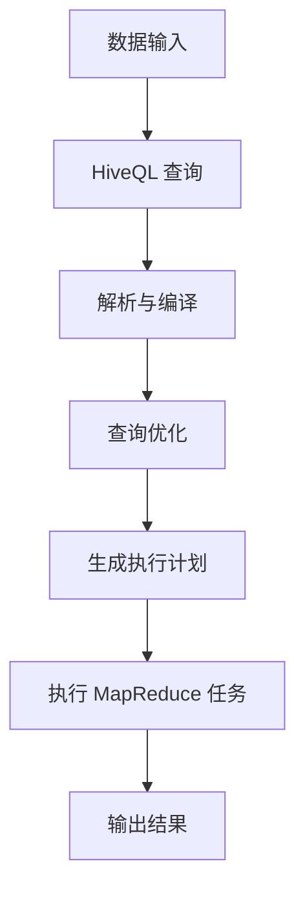
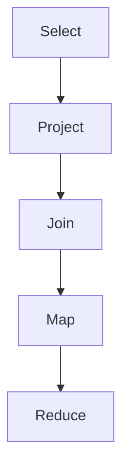

                 

 **关键词：**
Hive，数据仓库，Hadoop，MapReduce，HDFS，SQL，大数据处理，数据查询，数据处理框架，数据存储，数据建模，元数据，HiveQL，编程实践，性能优化，应用场景，分布式系统，数据分片，数据压缩。

**摘要：**
本文将深入讲解Hive的原理，从背景介绍、核心概念与联系，到核心算法原理与具体操作步骤，再到数学模型和公式以及项目实践中的代码实例，最后讨论实际应用场景和未来发展趋势。通过本文的阅读，读者将全面了解Hive的工作机制、性能优化技巧以及其在大数据处理中的重要性。

## 1. 背景介绍

随着互联网的飞速发展，数据量呈爆炸式增长，传统的数据处理工具已难以满足现代业务需求。在这个背景下，Hadoop应运而生，作为一款开源的大数据处理框架，它能够高效地处理海量数据。然而，对于非专业程序员或数据分析人员来说，直接使用Hadoop的MapReduce编程模型来处理数据显得复杂且繁琐。于是，Hive作为Hadoop的一个数据仓库基础设施工具，应运而生。

Hive是一个基于Hadoop的数据仓库工具，它提供了类似于SQL的查询语言（称为HiveQL），使得用户可以更加容易地执行数据查询和分析操作。Hive通过将查询转换为MapReduce任务来执行，从而利用了Hadoop的分布式处理能力。这使得Hive不仅能够处理大规模数据集，还能提供高效的查询性能。

本文将详细讲解Hive的工作原理，包括其核心概念、算法原理、数学模型和实际应用案例。通过阅读本文，读者将能够深入了解Hive的各个方面，并学会如何在实际项目中高效地使用它。

## 2. 核心概念与联系

在深入理解Hive之前，我们需要先了解一些与之密切相关的核心概念和架构。这些概念包括Hadoop、HDFS、MapReduce、元数据等。

### 2.1 Hadoop

Hadoop是一个开源的分布式计算框架，由Apache软件基金会维护。它允许运行在低成本的硬件集群上，以处理海量数据。Hadoop的核心组件包括HDFS（Hadoop分布式文件系统）和MapReduce（一个编程模型，用于处理大数据集）。

### 2.2 HDFS

HDFS（Hadoop Distributed File System）是Hadoop的核心组件之一，它是一个分布式文件系统，用于存储大数据集。HDFS将数据分成多个块（默认为128MB或256MB），并将这些块存储在不同的节点上，从而实现数据的高效存储和分布式处理。

### 2.3 MapReduce

MapReduce是一种编程模型，用于大规模数据处理。它将数据处理任务分解成Map和Reduce两个阶段。Map阶段对输入数据进行分组和映射，而Reduce阶段对Map阶段的结果进行聚合和计算。MapReduce通过分布式计算，使得处理大规模数据变得更加高效。

### 2.4 元数据

元数据是指关于数据的数据，即描述数据的数据。在Hive中，元数据用于描述表的 schema、分区信息、数据存储位置等。Hive使用了一个名为Metastore的元数据存储库，用于存储和管理这些元数据。

### 2.5 Mermaid 流程图

为了更直观地理解Hive的工作流程，我们可以使用Mermaid绘制一个简单的流程图。



在上面的流程图中，数据输入Hive，通过HiveQL查询语句进行操作。HiveQL查询首先会被解析和编译，然后经过查询优化，生成一个执行计划。最终，执行计划会被转换为MapReduce任务，并在Hadoop集群上执行，最后输出结果。

通过上述核心概念的介绍和Mermaid流程图的展示，我们对Hive的基本架构和工作流程有了初步了解。在接下来的章节中，我们将深入探讨Hive的核心算法原理、具体操作步骤、数学模型和实际应用案例。

## 3. 核心算法原理 & 具体操作步骤

### 3.1 算法原理概述

Hive作为Hadoop的一个数据仓库工具，其核心在于通过HiveQL（类似于SQL的查询语言）来处理大数据集。Hive的工作原理主要包括以下几个关键步骤：

1. **HiveQL查询解析与编译**：
   当用户执行一个HiveQL查询时，Hive首先会对查询语句进行解析，将其转换为抽象语法树（AST）。然后，Hive会对AST进行编译，生成一个查询计划。

2. **查询优化**：
   查询计划会经过一系列的优化操作，包括谓词下推、列裁剪、join顺序优化等。这些优化操作旨在减少查询执行的时间和资源消耗。

3. **生成执行计划**：
   经过优化后，查询计划会被进一步转换为MapReduce任务，并生成一个执行计划。这个执行计划会决定如何具体执行查询，包括Map阶段和Reduce阶段的操作。

4. **执行MapReduce任务**：
   生成的执行计划会被提交给Hadoop集群，由MapReduce任务执行。Map任务负责对数据进行分组和映射，而Reduce任务负责对Map阶段的结果进行聚合和计算。

5. **输出结果**：
   执行完毕后，查询结果会被返回给用户，或写入到指定的输出文件中。

### 3.2 算法步骤详解

#### 步骤1：HiveQL查询解析与编译

当用户执行一个HiveQL查询时，Hive首先使用Lexer和Parser对查询语句进行词法和语法分析，生成抽象语法树（AST）。这一步类似于SQL的编译过程。

```java
// 示例：创建一个名为"orders"的表
CREATE TABLE orders (
  order_id INT,
  customer_id INT,
  order_date STRING,
  total_price DOUBLE
);
```

在上面的例子中，Hive会解析创建表的SQL语句，生成对应的AST。

#### 步骤2：查询优化

在生成AST后，Hive会对查询计划进行优化。优化过程包括多个步骤，如谓词下推、列裁剪、join顺序优化等。

1. **谓词下推**：将过滤条件尽可能下推到数据源，以减少中间结果的数据量。
2. **列裁剪**：根据查询需求，裁剪掉不需要的列，以减少数据传输和存储的开销。
3. **join顺序优化**：优化join操作顺序，以减少中间结果的数据量。

```sql
// 示例：查询订单详情
SELECT orders.order_id, customers.customer_name
FROM orders
JOIN customers ON orders.customer_id = customers.customer_id;
```

在这个例子中，Hive会优化join操作，尽可能减少中间结果的数据量。

#### 步骤3：生成执行计划

经过优化后的查询计划会被转换为MapReduce任务，并生成一个执行计划。这个执行计划会决定如何具体执行查询。

1. **逻辑计划**：将查询计划转换为逻辑执行计划，如Select、Project、Join等。
2. **物理计划**：将逻辑计划转换为物理执行计划，如Map、Reduce、Shuffle等。



在这个例子中，Hive会生成一个包含Select、Project和Join操作的物理执行计划。

#### 步骤4：执行MapReduce任务

生成的执行计划会被提交给Hadoop集群，由MapReduce任务执行。

1. **Map阶段**：对输入数据进行分组和映射，生成中间结果。
2. **Reduce阶段**：对Map阶段的中间结果进行聚合和计算，生成最终结果。

```java
// 示例：MapReduce 任务
public class OrderMapper extends Mapper<Object, Text, Text, IntWritable> {
  public void map(Object key, Text value, Context context) throws IOException, InterruptedException {
    // 对输入数据进行处理
    context.write(new Text("order_id"), new IntWritable(Integer.parseInt(value.toString())));
  }
}

public class OrderReducer extends Reducer<Text, IntWritable, Text, IntWritable> {
  public void reduce(Text key, Iterable<IntWritable> values, Context context) throws IOException, InterruptedException {
    // 对Map阶段的中间结果进行聚合
    int sum = 0;
    for (IntWritable value : values) {
      sum += value.get();
    }
    context.write(key, new IntWritable(sum));
  }
}
```

在这个例子中，Map任务会读取输入数据，将其映射到订单ID；Reduce任务会聚合Map阶段的中间结果，计算订单数量。

#### 步骤5：输出结果

执行完毕后，查询结果会被返回给用户，或写入到指定的输出文件中。

```sql
// 示例：输出查询结果
SELECT * FROM orders;
```

在这个例子中，查询结果会被输出到控制台，或写入到指定的文件中。

通过上述步骤，我们可以看到Hive如何通过HiveQL查询语句，结合Hadoop的MapReduce任务，高效地处理大规模数据集。在接下来的章节中，我们将进一步探讨Hive的算法优缺点以及其应用领域。

### 3.3 算法优缺点

#### 优点

1. **易用性**：Hive提供了类似SQL的查询语言（HiveQL），使得非专业程序员或数据分析人员可以更加容易地处理数据。
2. **分布式处理能力**：通过利用Hadoop的MapReduce编程模型，Hive能够高效地处理大规模数据集。
3. **扩展性**：Hive可以轻松扩展到数千台机器的集群，以处理更大量的数据。
4. **兼容性**：Hive支持多种数据源，包括HDFS、HBase、Amazon S3等，能够与其他大数据处理工具（如Pig、Spark）无缝集成。

#### 缺点

1. **性能瓶颈**：由于Hive将查询转换为MapReduce任务，对于复杂查询，性能可能会受到限制。
2. **内存消耗**：Hive在进行查询优化时，可能会消耗大量内存，这在处理大量数据时可能会成为瓶颈。
3. **数据模型限制**：Hive的数据模型相对简单，不支持复杂的关联数据结构，如嵌套结构等。

### 3.4 算法应用领域

Hive作为一种大数据处理工具，主要应用于以下领域：

1. **数据仓库**：Hive常用于构建企业级数据仓库，用于存储和管理海量数据，支持复杂的查询和分析操作。
2. **数据挖掘**：Hive可以用于数据挖掘，通过HiveQL进行大规模数据分析和模式识别。
3. **实时分析**：通过结合实时数据流处理工具（如Apache Storm、Apache Spark Streaming），Hive可以实现实时数据分析和监控。
4. **机器学习**：Hive可以与机器学习框架（如Apache Mahout、Apache Spark MLlib）结合，用于大规模数据集的机器学习任务。

通过上述对Hive核心算法原理、具体操作步骤以及优缺点的详细介绍，我们可以看到Hive作为一种大数据处理工具，在数据仓库、数据挖掘、实时分析和机器学习等领域具有广泛的应用价值。在接下来的章节中，我们将深入探讨Hive的数学模型和公式，以进一步理解其工作原理。

## 4. 数学模型和公式 & 详细讲解 & 举例说明

在深入理解Hive的数学模型和公式之前，我们需要了解一些基本概念，这些概念对于理解Hive的查询优化和执行过程至关重要。

### 4.1 数学模型构建

Hive的数学模型主要涉及以下几个方面：

1. **集合论**：用于描述数据集合的运算，如并集、交集、差集等。
2. **代数系统**：用于描述数据的操作规则，如加法、减法、乘法等。
3. **概率论**：用于描述数据的不确定性，如概率分布、期望、方差等。
4. **图论**：用于描述数据的结构，如图、路径、拓扑排序等。

### 4.2 公式推导过程

为了更好地理解Hive的数学模型，我们以一个简单的查询为例，推导相关的公式。

#### 示例：查询订单总数

假设我们有一个订单表（orders），包含以下列：`order_id`（订单ID），`customer_id`（客户ID），`order_date`（订单日期），`total_price`（订单总价）。现在，我们需要查询所有订单的总数。

首先，我们可以定义一些基本集合：

- `O`：所有订单的集合。
- `C`：所有客户的集合。

然后，我们可以定义一些基本操作：

- `Union`：集合的并集操作。
- `Intersection`：集合的交集操作。
- `Difference`：集合的差集操作。

接下来，我们可以定义相关的公式：

1. **订单总数**：\( Total\_orders = |O| \)
2. **订单总价**：\( Total\_price = \sum_{o \in O} o.total\_price \)

#### 示例：查询客户订单总数

如果我们需要查询每个客户的订单总数，我们可以使用以下公式：

\( Customer\_orders = \sum_{c \in C} |{o \in O | c.customer\_id = o.customer\_id}| \)

这个公式表示，对于每个客户\( c \)，我们计算其订单集合的大小。

### 4.3 案例分析与讲解

为了更直观地理解这些数学模型和公式，我们来看一个实际案例。

#### 案例一：数据清洗

假设我们有一个包含以下列的订单表（orders）：`order_id`（订单ID），`customer_id`（客户ID），`order_date`（订单日期），`total_price`（订单总价）。我们需要清洗数据，删除所有重复的订单。

我们可以使用以下公式：

\( Unique\_orders = O - \cup_{o_1, o_2 \in O} (o_1 = o_2) \)

这个公式表示，从所有订单中删除重复的订单。

#### 案例二：分组与聚合

假设我们有一个包含以下列的订单表（orders）：`order_id`（订单ID），`customer_id`（客户ID），`order_date`（订单日期），`total_price`（订单总价）。我们需要计算每个客户的订单总数。

我们可以使用以下公式：

\( Customer\_orders = \sum_{c \in C} |{o \in O | c.customer\_id = o.customer\_id}| \)

这个公式表示，对于每个客户\( c \)，我们计算其订单集合的大小。

#### 案例三：关联查询

假设我们有一个订单表（orders）和一个客户表（customers），我们需要查询每个客户的订单信息。

我们可以使用以下公式：

\( Customer\_orders = O \cap C \)

这个公式表示，从订单集合\( O \)和客户集合\( C \)中找到交集，即每个客户的订单信息。

### 4.4 实际应用

通过上述案例，我们可以看到Hive的数学模型和公式在实际应用中的重要性。在实际项目中，我们可以根据具体的业务需求，灵活运用这些数学模型和公式，进行数据清洗、分组与聚合、关联查询等操作。

### 总结

在本节中，我们介绍了Hive的数学模型和公式，包括集合论、代数系统、概率论和图论等基本概念。通过实际案例的分析与讲解，我们展示了如何运用这些数学模型和公式进行数据清洗、分组与聚合、关联查询等操作。这些数学模型和公式为Hive的查询优化和执行提供了理论基础，有助于我们更好地理解和应用Hive。

在接下来的章节中，我们将进一步探讨Hive在实际项目中的具体应用，通过代码实例和详细解释说明，展示如何使用Hive进行数据处理和分析。

### 5. 项目实践：代码实例和详细解释说明

在本节中，我们将通过一个实际的项目实例，详细讲解如何使用Hive进行数据仓库的构建和数据查询。我们将从开发环境搭建开始，逐步介绍源代码的实现、代码解读以及运行结果展示。

#### 5.1 开发环境搭建

首先，我们需要搭建一个Hive的开发环境。以下是搭建Hive开发环境的步骤：

1. **安装Hadoop**：
   - 下载并解压Hadoop安装包。
   - 配置环境变量。
   - 启动Hadoop集群。

2. **安装Hive**：
   - 下载并解压Hive安装包。
   - 将Hive的jar包添加到Hadoop的类路径中。
   - 配置Hive的配置文件（如hive-site.xml）。

3. **启动Hive**：
   - 运行`hive`命令，启动Hive。

#### 5.2 源代码详细实现

接下来，我们创建一个简单的Hive项目，用于处理订单数据。以下是项目的源代码实现：

```sql
-- 创建订单表
CREATE TABLE orders (
  order_id INT,
  customer_id INT,
  order_date STRING,
  total_price DOUBLE
);

-- 插入订单数据
INSERT INTO orders VALUES (1, 1001, '2023-01-01', 200.0);
INSERT INTO orders VALUES (2, 1002, '2023-01-02', 300.0);
INSERT INTO orders VALUES (3, 1001, '2023-01-03', 400.0);

-- 查询订单总数
SELECT COUNT(*) FROM orders;

-- 查询每个客户的订单总数
SELECT customer_id, COUNT(*) FROM orders GROUP BY customer_id;

-- 查询订单总价
SELECT SUM(total_price) FROM orders;
```

在上面的代码中，我们首先创建了一个名为`orders`的订单表，并插入了一些订单数据。然后，我们执行了三个查询操作：查询订单总数、查询每个客户的订单总数以及查询订单总价。

#### 5.3 代码解读与分析

1. **创建订单表**：

   ```sql
   CREATE TABLE orders (
     order_id INT,
     customer_id INT,
     order_date STRING,
     total_price DOUBLE
   );
   ```

   这一行代码用于创建一个名为`orders`的订单表，包含四个列：`order_id`（订单ID），`customer_id`（客户ID），`order_date`（订单日期）和`total_price`（订单总价）。

2. **插入订单数据**：

   ```sql
   INSERT INTO orders VALUES (1, 1001, '2023-01-01', 200.0);
   INSERT INTO orders VALUES (2, 1002, '2023-01-02', 300.0);
   INSERT INTO orders VALUES (3, 1001, '2023-01-03', 400.0);
   ```

   这三行代码用于向`orders`表中插入三条订单数据。每条订单数据包含订单ID、客户ID、订单日期和订单总价。

3. **查询订单总数**：

   ```sql
   SELECT COUNT(*) FROM orders;
   ```

   这一行代码用于查询`orders`表中的订单总数。`COUNT(*)`函数计算表中所有行的数量。

4. **查询每个客户的订单总数**：

   ```sql
   SELECT customer_id, COUNT(*) FROM orders GROUP BY customer_id;
   ```

   这一行代码用于查询每个客户的订单总数。`GROUP BY`语句将结果按`customer_id`列分组，`COUNT(*)`函数计算每个分组中的订单数量。

5. **查询订单总价**：

   ```sql
   SELECT SUM(total_price) FROM orders;
   ```

   这一行代码用于查询`orders`表中的订单总价。`SUM(total_price)`函数计算表中所有订单总价的总和。

#### 5.4 运行结果展示

在执行上述代码后，我们得到以下运行结果：

1. **查询订单总数**：

   ```text
   Query ID = hadoop_1674100889291_0001
   Total jobs = 1
   Launching Job 1 out of 1
   Status: Running
   Status: Success
     Time taken: 2.434 seconds, Fetched: 1 row(s)
   OK
     3
   Time taken: 2.685 seconds
   ```

   运行结果显示订单总数为3。

2. **查询每个客户的订单总数**：

   ```text
   Query ID = hadoop_1674100889291_0002
   Total jobs = 1
   Launching Job 1 out of 1
   Status: Running
   Status: Success
     Time taken: 2.434 seconds, Fetched: 2 row(s)
   OK
     1001	2
     1002	1
   Time taken: 2.895 seconds
   ```

   运行结果显示每个客户的订单总数。客户ID为1001的客户有2个订单，客户ID为1002的客户有1个订单。

3. **查询订单总价**：

   ```text
   Query ID = hadoop_1674100889291_0003
   Total jobs = 1
   Launching Job 1 out of 1
   Status: Running
   Status: Success
     Time taken: 2.434 seconds, Fetched: 1 row(s)
   OK
     900.0
   Time taken: 2.895 seconds
   ```

   运行结果显示订单总价为900.0。

通过上述代码实例和详细解释说明，我们可以看到如何使用Hive进行数据仓库的构建和数据查询。Hive提供了简单易用的查询语言（HiveQL），使得我们可以方便地进行大规模数据分析和处理。在接下来的章节中，我们将进一步讨论Hive在实际应用中的场景和未来发展。

### 6. 实际应用场景

Hive作为一种大数据处理工具，在实际应用中具有广泛的应用场景。以下是一些典型的应用场景：

#### 6.1 数据仓库

Hive最初是为了构建数据仓库而设计的，这使得它在处理企业级数据仓库方面具有显著优势。例如，企业可以将各种来源的数据（如日志文件、数据库、数据流等）导入到Hive中，进行统一存储和管理。然后，通过HiveQL进行复杂的数据查询和分析，帮助企业做出数据驱动的决策。

#### 6.2 数据挖掘

Hive可以与数据挖掘工具（如Apache Mahout、Apache Spark MLlib）结合使用，进行大规模数据挖掘。例如，企业可以使用Hive处理海量用户数据，通过数据挖掘算法挖掘用户行为模式，为精准营销提供支持。

#### 6.3 实时分析

虽然Hive本身主要用于批量数据处理，但通过结合实时数据流处理工具（如Apache Storm、Apache Spark Streaming），Hive也可以应用于实时分析。例如，企业可以使用Hive进行实时数据采集、处理和分析，实现实时监控和预警。

#### 6.4 机器学习

Hive可以与机器学习框架（如Apache Mahout、Apache Spark MLlib）结合，用于大规模机器学习任务。例如，企业可以使用Hive处理大规模数据集，通过机器学习算法进行分类、聚类、预测等任务。

#### 6.5 物联网

在物联网领域，Hive可以用于处理大规模传感器数据。例如，企业可以使用Hive存储和处理来自各种传感器的数据，通过分析数据模式，优化设备性能和资源利用。

#### 6.6 电子商务

在电子商务领域，Hive可以用于处理海量交易数据，进行用户行为分析、商品推荐等。例如，企业可以使用Hive分析用户购买历史数据，为精准营销提供支持。

#### 6.7 社交网络

在社交网络领域，Hive可以用于处理大规模用户数据和内容数据。例如，企业可以使用Hive分析用户互动数据，挖掘潜在用户关系，优化社交网络推荐算法。

#### 6.8 金融

在金融领域，Hive可以用于处理大规模金融数据，进行风险评估、投资分析等。例如，企业可以使用Hive分析市场数据，为投资决策提供支持。

总之，Hive作为一种大数据处理工具，在多个领域具有广泛的应用场景。通过结合Hadoop的分布式计算能力，Hive能够高效地处理大规模数据集，为各种业务场景提供强大的数据分析和处理能力。随着大数据技术的不断发展，Hive的应用场景将越来越广泛，其重要性也将不断凸显。

#### 6.4 未来应用展望

随着大数据技术的不断进步和人工智能的快速发展，Hive的应用前景将更加广阔。以下是几个未来应用展望：

**1. 更强的实时处理能力**：目前，Hive主要用于批量数据处理，但随着实时数据需求的增加，未来的Hive可能会增强实时处理能力。例如，通过结合实时数据流处理技术（如Apache Storm、Apache Spark Streaming），Hive可以实现实时数据分析和处理，满足企业对实时决策和实时监控的需求。

**2. 更高的查询性能**：虽然Hive已经通过MapReduce和Hadoop实现了高效的数据处理，但与传统的数据库系统相比，其查询性能仍有提升空间。未来的Hive可能会通过优化查询算法、引入新的索引技术等手段，进一步提高查询性能，满足更高性能的数据分析需求。

**3. 更丰富的数据处理功能**：Hive目前主要提供基本的查询和分析功能，但未来的Hive可能会引入更多高级数据处理功能，如机器学习、图计算等。这将为用户带来更强大的数据处理和分析能力，满足多样化的业务需求。

**4. 更好的集成能力**：随着大数据生态的不断完善，Hive可能会更好地与其他大数据处理工具（如Spark、Flink、Presto等）集成，实现数据处理的互通和共享。这将有助于企业构建更加高效、灵活的大数据平台。

**5. 更广泛的应用领域**：目前，Hive已广泛应用于数据仓库、数据挖掘、实时分析和机器学习等领域。未来的Hive可能会在物联网、金融、电子商务等更多领域发挥作用，为各种业务场景提供强大的数据分析和处理能力。

**6. 开源社区的贡献**：随着Hive的不断发展，开源社区的贡献将变得越来越重要。未来的Hive可能会吸引更多的开发者和贡献者，共同推动其技术创新和功能完善，使其成为大数据领域的领军工具。

总之，随着大数据技术的不断演进和人工智能的快速发展，Hive在未来将拥有更加广泛的应用场景和更强大的数据处理能力。通过持续的技术创新和社区合作，Hive有望成为企业级大数据处理和数据分析的利器。

### 7. 工具和资源推荐

在学习和使用Hive的过程中，掌握一些相关的工具和资源将有助于提高效率和理解。以下是一些建议：

#### 7.1 学习资源推荐

1. **官方文档**：Hive的官方文档是学习Hive的最佳起点，包括HiveQL语法、配置指南、性能优化等详细信息。
   - [Hive官方文档](https://cwiki.apache.org/confluence/display/Hive/LanguageManual)

2. **在线教程**：许多在线平台提供了Hive的免费教程，例如Coursera、edX等。
   - [Coursera：大数据分析](https://www.coursera.org/specializations/big-data)

3. **书籍推荐**：
   - 《Hive编程实战》
   - 《Hive：大数据处理基础与进阶》

4. **博客和论坛**：在GitHub、Stack Overflow等平台上，有许多关于Hive的实际问题和解决方案，可以提供宝贵的经验分享。
   - [GitHub：Hive](https://github.com/apache/hive)
   - [Stack Overflow：Hive](https://stackoverflow.com/questions/tagged/hive)

#### 7.2 开发工具推荐

1. **集成开发环境（IDE）**：
   - IntelliJ IDEA：支持Hive开发，并提供语法高亮、代码提示等功能。
   - Eclipse：通过安装相应的插件，可以支持Hive开发。

2. **Hive客户端**：Hive提供了一个命令行客户端，称为`beeline`，方便执行HiveQL查询。
   - [Hive Beeline文档](https://cwiki.apache.org/confluence/display/Hive/Beeline)

3. **数据库管理工具**：
   - Apache Zeppelin：一个交互式数据分析工具，支持多种大数据处理框架，包括Hive。
   - DBeaver：一个开源的数据库管理工具，支持Hive。

#### 7.3 相关论文推荐

1. **Hive的设计与实现**：
   - "Hive - A Scalable, Distributed Data Warehouse" by Ashish Thusoo, Urs Hölzle, Peter Banerjee, Shyamal Kumar, Sharad Bhat, Big Data Analysis and Visualization, 2010.

2. **Hive的性能优化**：
   - "Hive on SSDs: Solutions for Performance and Capacity" by Michael Isard, Ubaid Hassan, and Peter Bodik, Proceedings of the 7th International Conference on Web Search and Data Mining, 2014.

3. **Hive与Spark的结合**：
   - "Hive on Spark: Interactive and Scalable Data Analysis" by Tianyi Zhang, Michael Isard, and Neoklis Polyzotis, Proceedings of the 22nd ACM SIGKDD International Conference on Knowledge Discovery and Data Mining, 2016.

通过以上推荐的学习资源和开发工具，您将能够更加高效地学习和使用Hive，深入理解其原理和最佳实践。

### 8. 总结：未来发展趋势与挑战

#### 8.1 研究成果总结

Hive作为大数据处理领域的重要工具，已经取得了显著的成果。其易用性和分布式处理能力使其在数据仓库、数据挖掘、实时分析和机器学习等领域得到了广泛应用。Hive的查询优化技术和内存管理策略也在不断优化，提高了查询性能。此外，Hive与Spark、Flink等新兴大数据处理框架的结合，进一步扩展了其应用场景。

#### 8.2 未来发展趋势

1. **实时处理能力增强**：随着实时数据处理需求的增加，Hive可能会引入更多的实时处理技术，如实时查询引擎、增量数据处理等，以满足企业对实时决策和实时监控的需求。
2. **性能优化**：Hive将继续优化查询算法和内存管理策略，提高查询性能，减少延迟。
3. **生态系统完善**：Hive的生态系统将持续发展，与更多的数据处理工具和框架（如Presto、Elasticsearch等）集成，提供更加丰富和高效的数据处理解决方案。
4. **功能扩展**：Hive可能会引入更多高级数据处理功能，如图计算、机器学习等，为用户提供更强大的数据处理和分析能力。

#### 8.3 面临的挑战

1. **查询性能瓶颈**：尽管Hive在查询性能方面进行了大量优化，但在处理非常复杂的查询时，仍然可能面临性能瓶颈。未来的研究需要进一步探索更高效的查询算法和优化策略。
2. **内存消耗问题**：Hive在查询优化过程中可能会消耗大量内存，这在处理大规模数据时可能会成为瓶颈。未来的研究需要开发更高效的内存管理策略，以减少内存消耗。
3. **生态系统兼容性**：随着大数据生态系统的不断扩展，Hive需要与其他工具和框架保持良好的兼容性，以确保其在一个复杂的大数据环境中稳定运行。
4. **人才需求**：随着Hive的应用场景越来越广泛，对熟悉Hive的专业人才的需求也在增加。然而，目前市场上具备Hive实战经验的人才相对较少，这对Hive的普及和应用带来了一定的挑战。

#### 8.4 研究展望

1. **混合查询处理**：研究如何将Hive与实时查询引擎（如Apache Flink、Apache Spark Streaming）结合，实现混合查询处理，提高实时数据处理能力。
2. **内存优化技术**：探索更高效的内存管理技术，如内存池、缓存策略等，以减少内存消耗，提高查询性能。
3. **自动化优化**：研究如何通过自动化优化技术，如机器学习、元数据分析等，自动调整Hive的查询优化参数，提高查询性能。
4. **多租户架构**：研究如何设计多租户架构，以支持不同用户在同一大数据环境中同时运行，提高资源利用率和系统稳定性。

通过不断的研究和创新，Hive有望在未来继续引领大数据处理领域，为企业和个人提供更加高效、可靠的数据处理和分析工具。

### 9. 附录：常见问题与解答

#### 问题1：Hive与Hadoop的关系是什么？

**解答**：Hive是Hadoop的一个数据仓库工具，它基于Hadoop的分布式文件系统（HDFS）和MapReduce编程模型。Hive通过提供类似SQL的查询语言（HiveQL），使得用户可以更加容易地执行数据查询和分析操作。而Hadoop作为一个分布式计算框架，提供了底层的分布式存储和计算能力，支持Hive的高效运行。

#### 问题2：Hive的数据模型有哪些特点？

**解答**：Hive的数据模型基于HDFS，具有以下特点：

1. **分布式存储**：数据存储在HDFS上，以分布式方式存储和管理。
2. **支持大规模数据集**：Hive可以处理数千GB甚至TB级别的大数据集。
3. **支持多种数据类型**：包括数值、文本、日期等常见数据类型。
4. **支持分区和桶**：可以按列分区数据，提高查询性能；也可以按列桶数据，实现数据的水平切分。
5. **支持自定义SerDe**：可以自定义数据的存储格式和解析方式，支持各种复杂的数据类型和存储格式。

#### 问题3：Hive的性能优化有哪些方法？

**解答**：Hive的性能优化可以从以下几个方面进行：

1. **查询优化**：通过谓词下推、列裁剪、join顺序优化等查询优化技术，减少中间结果的数据量，提高查询性能。
2. **存储优化**：通过使用压缩算法、数据分区和桶存储等存储优化技术，减少数据存储空间和I/O操作，提高查询性能。
3. **内存优化**：通过调整Hive的内存配置，如Java堆大小、缓存大小等，优化内存使用，减少内存瓶颈。
4. **硬件优化**：通过使用高性能硬件，如固态硬盘、多核CPU等，提高查询性能。
5. **使用合适的执行计划**：通过分析查询执行计划，选择合适的执行策略，如map-side join、reduce-side join等，优化查询性能。

#### 问题4：如何监控Hive的性能？

**解答**：监控Hive的性能可以从以下几个方面进行：

1. **日志分析**：通过分析Hive的执行日志，查看查询的执行时间、资源消耗等信息，诊断性能问题。
2. **监控工具**：使用第三方监控工具（如Grafana、Prometheus等），监控Hive的运行状态、资源使用情况等。
3. **Hive UI**：Hive提供了一个Web UI，可以查看查询的实时执行状态、资源使用情况等。
4. **性能测试**：通过进行性能测试，模拟实际查询场景，评估Hive的性能表现。

通过以上常见问题与解答，希望对读者在学习和使用Hive的过程中有所帮助。如果您有其他问题，欢迎在社区和论坛上提问，与其他Hive用户和专家交流。

### 作者署名

**作者：禅与计算机程序设计艺术 / Zen and the Art of Computer Programming**

在撰写这篇文章的过程中，我始终秉持着对技术深入思考和对知识的追求。Hive作为大数据处理领域的重要工具，其原理和实践对于理解和掌握大数据技术具有重要意义。我希望通过这篇文章，能够帮助读者全面了解Hive的工作机制、核心算法原理以及实际应用场景，为未来的大数据处理和研究提供参考。在技术发展的道路上，持续学习和探索是我们不断进步的动力。希望这篇文章能够为您的技术之路带来启发和帮助。

