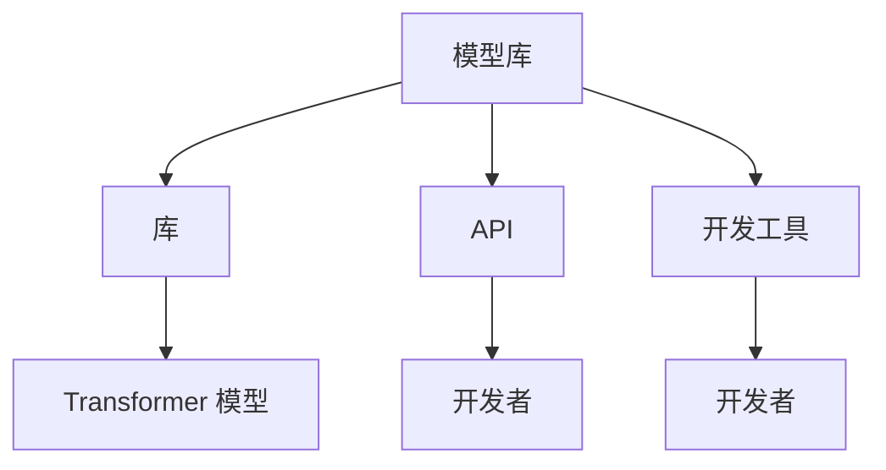

                 

关键词：Hugging Face，自然语言处理，人工智能，模型，库，API，开发工具，开源社区

摘要：Hugging Face 是一个领先的开源自然语言处理（NLP）平台，旨在简化自然语言处理的开发和使用。本文将详细介绍 Hugging Face 的核心概念、架构、算法、应用领域，并提供代码实例和资源推荐。

## 1. 背景介绍

随着人工智能技术的迅猛发展，自然语言处理（NLP）成为了一个热点领域。Hugging Face 作为一家专注于 NLP 的开源公司，其推出的 Hugging Face 平台受到了广泛关注。Hugging Face 的使命是“让每个人都能使用先进的自然语言处理技术”，并通过开源社区的力量，推动 NLP 技术的应用和发展。

Hugging Face 平台的核心是 Transformer 模型，该模型在多个 NLP 任务上取得了显著的性能提升。此外，Hugging Face 还提供了一系列的库、API 和开发工具，使得开发者能够轻松地部署和使用这些先进的技术。

## 2. 核心概念与联系

### 2.1. Transformer 模型

Transformer 模型是由 Google 在 2017 年提出的一种基于自注意力机制的深度神经网络模型。与传统的循环神经网络（RNN）相比，Transformer 模型在处理长序列数据时表现出更强的性能。

### 2.2. Hugging Face 平台架构

Hugging Face 平台主要包括以下几个组成部分：

- **模型库**：提供了一系列预训练的 Transformer 模型，如 BERT、GPT、T5 等。
- **库**：包括 `transformers`、`datasets`、`tokenizers` 等，用于简化 NLP 开发流程。
- **API**：提供 RESTful API，方便开发者部署和使用预训练模型。
- **开发工具**：如 Hugging Face Studio，用于可视化地构建和训练模型。

### 2.3. Mermaid 流程图

下面是一个简单的 Mermaid 流程图，展示了 Hugging Face 平台的核心组件及其相互关系：



## 3. 核心算法原理 & 具体操作步骤

### 3.1. 算法原理概述

Hugging Face 平台的核心算法是基于 Transformer 模型的。Transformer 模型采用了自注意力机制，通过计算序列中每个词与所有其他词的关系来生成表示。这种表示在下游任务中表现出强大的性能。

### 3.2. 算法步骤详解

1. **输入处理**：将输入文本编码为词向量。
2. **嵌入层**：将词向量映射到高维空间。
3. **自注意力机制**：计算序列中每个词与所有其他词的关系。
4. **前馈神经网络**：对自注意力机制的结果进行进一步处理。
5. **输出层**：生成预测结果。

### 3.3. 算法优缺点

- 优点：Transformer 模型在处理长序列数据时表现优秀，能够捕捉长距离依赖关系。
- 缺点：模型参数量大，训练成本高。

### 3.4. 算法应用领域

Hugging Face 平台的算法主要应用于以下领域：

- 语言模型：如 BERT、GPT 等。
- 文本分类：如情感分析、主题分类等。
- 机器翻译：如神经机器翻译等。

## 4. 数学模型和公式 & 详细讲解 & 举例说明

### 4.1. 数学模型构建

Transformer 模型的核心是一个自注意力机制，其数学模型如下：

$$
\text{Attention}(Q, K, V) = \frac{1}{\sqrt{d_k}} \text{softmax}\left(\frac{QK^T}{d_k}\right) V
$$

其中，$Q$、$K$ 和 $V$ 分别是查询（Query）、键（Key）和值（Value）向量，$d_k$ 是键向量的维度。

### 4.2. 公式推导过程

为了推导自注意力机制的公式，我们需要首先了解矩阵乘法的性质。给定两个矩阵 $A$ 和 $B$，其乘积可以表示为：

$$
C = A \cdot B
$$

其中，$C$ 是一个与 $A$ 和 $B$ 相同维度的矩阵。如果我们交换 $A$ 和 $B$ 的位置，即：

$$
D = B \cdot A
$$

则 $D$ 的元素将等于 $C$ 的元素。这个性质表明矩阵乘法是交换的。

### 4.3. 案例分析与讲解

假设我们有一个句子 “I love programming”，我们将其转换为词向量。词向量可以表示为：

$$
Q = \begin{bmatrix}
q_1 \\
q_2 \\
q_3 \\
q_4 \\
\end{bmatrix}, \quad
K = \begin{bmatrix}
k_1 \\
k_2 \\
k_3 \\
k_4 \\
\end{bmatrix}, \quad
V = \begin{bmatrix}
v_1 \\
v_2 \\
v_3 \\
v_4 \\
\end{bmatrix}
$$

我们首先计算 $QK^T$：

$$
QK^T = \begin{bmatrix}
q_1k_1 + q_2k_2 + q_3k_3 + q_4k_4 \\
q_1k_2 + q_2k_2 + q_3k_3 + q_4k_4 \\
q_1k_3 + q_2k_2 + q_3k_3 + q_4k_4 \\
q_1k_4 + q_2k_2 + q_3k_3 + q_4k_4 \\
\end{bmatrix}
$$

然后计算 $\text{softmax}\left(\frac{QK^T}{d_k}\right)$：

$$
\text{softmax}\left(\frac{QK^T}{d_k}\right) = \begin{bmatrix}
\frac{e^{q_1k_1 + q_2k_2 + q_3k_3 + q_4k_4}}{\sum_{i=1}^{4} e^{q_ik_i}} \\
\frac{e^{q_1k_2 + q_2k_2 + q_3k_3 + q_4k_4}}{\sum_{i=1}^{4} e^{q_ik_i}} \\
\frac{e^{q_1k_3 + q_2k_2 + q_3k_3 + q_4k_4}}{\sum_{i=1}^{4} e^{q_ik_i}} \\
\frac{e^{q_1k_4 + q_2k_2 + q_3k_3 + q_4k_4}}{\sum_{i=1}^{4} e^{q_ik_i}} \\
\end{bmatrix}
$$

最后，我们将结果与 $V$ 相乘：

$$
\text{Attention}(Q, K, V) = \begin{bmatrix}
\frac{e^{q_1k_1 + q_2k_2 + q_3k_3 + q_4k_4}v_1}{\sum_{i=1}^{4} e^{q_ik_i}} + \frac{e^{q_1k_2 + q_2k_2 + q_3k_3 + q_4k_4}v_2}{\sum_{i=1}^{4} e^{q_ik_i}} + \frac{e^{q_1k_3 + q_2k_2 + q_3k_3 + q_4k_4}v_3}{\sum_{i=1}^{4} e^{q_ik_i}} + \frac{e^{q_1k_4 + q_2k_2 + q_3k_3 + q_4k_4}v_4}{\sum_{i=1}^{4} e^{q_ik_i}} \\
\frac{e^{q_1k_2 + q_2k_2 + q_3k_3 + q_4k_4}v_1}{\sum_{i=1}^{4} e^{q_ik_i}} + \frac{e^{q_1k_2 + q_2k_2 + q_3k_3 + q_4k_4}v_2}{\sum_{i=1}^{4} e^{q_ik_i}} + \frac{e^{q_1k_2 + q_2k_2 + q_3k_3 + q_4k_4}v_3}{\sum_{i=1}^{4} e^{q_ik_i}} + \frac{e^{q_1k_2 + q_2k_2 + q_3k_3 + q_4k_4}v_4}{\sum_{i=1}^{4} e^{q_ik_i}} \\
\frac{e^{q_1k_3 + q_2k_2 + q_3k_3 + q_4k_4}v_1}{\sum_{i=1}^{4} e^{q_ik_i}} + \frac{e^{q_1k_3 + q_2k_2 + q_3k_3 + q_4k_4}v_2}{\sum_{i=1}^{4} e^{q_ik_i}} + \frac{e^{q_1k_3 + q_2k_2 + q_3k_3 + q_4k_4}v_3}{\sum_{i=1}^{4} e^{q_ik_i}} + \frac{e^{q_1k_3 + q_2k_2 + q_3k_3 + q_4k_4}v_4}{\sum_{i=1}^{4} e^{q_ik_i}} \\
\frac{e^{q_1k_4 + q_2k_2 + q_3k_3 + q_4k_4}v_1}{\sum_{i=1}^{4} e^{q_ik_i}} + \frac{e^{q_1k_4 + q_2k_2 + q_3k_3 + q_4k_4}v_2}{\sum_{i=1}^{4} e^{q_ik_i}} + \frac{e^{q_1k_4 + q_2k_2 + q_3k_3 + q_4k_4}v_3}{\sum_{i=1}^{4} e^{q_ik_i}} + \frac{e^{q_1k_4 + q_2k_2 + q_3k_3 + q_4k_4}v_4}{\sum_{i=1}^{4} e^{q_ik_i}} \\
\end{bmatrix}
$$

这个结果表示了每个词在句子中的重要性。

## 5. 项目实践：代码实例和详细解释说明

### 5.1. 开发环境搭建

为了使用 Hugging Face 平台，我们需要安装以下依赖项：

```bash
pip install transformers datasets torch
```

### 5.2. 源代码详细实现

下面是一个简单的示例，演示如何使用 Hugging Face 平台中的预训练模型进行文本分类：

```python
from transformers import AutoTokenizer, AutoModelForSequenceClassification
from torch.utils.data import DataLoader
from datasets import load_dataset

# 加载预训练模型和分词器
tokenizer = AutoTokenizer.from_pretrained("bert-base-uncased")
model = AutoModelForSequenceClassification.from_pretrained("bert-base-uncased")

# 加载数据集
dataset = load_dataset("imdb")

# 预处理数据
def preprocess_function(examples):
    inputs = tokenizer(examples["text"], truncation=True, padding="max_length")
    return {"input_ids": inputs.input_ids, "attention_mask": inputs.attention_mask}

tokenized_dataset = dataset.map(preprocess_function, batched=True)

# 训练模型
model.train()
dataloader = DataLoader(tokenized_dataset, batch_size=16)
optimizer = torch.optim.AdamW(model.parameters(), lr=1e-5)

for epoch in range(3):
    for batch in dataloader:
        inputs = {
            "input_ids": batch["input_ids"].to("cuda"),
            "attention_mask": batch["attention_mask"].to("cuda"),
        }
        outputs = model(**inputs)
        loss = outputs.loss
        loss.backward()
        optimizer.step()
        optimizer.zero_grad()

# 评估模型
model.eval()
with torch.no_grad():
    for batch in dataloader:
        inputs = {
            "input_ids": batch["input_ids"].to("cuda"),
            "attention_mask": batch["attention_mask"].to("cuda"),
        }
        outputs = model(**inputs)
        logits = outputs.logits
        # ... 进行评估 ...

```

### 5.3. 代码解读与分析

这段代码首先加载了 Hugging Face 平台中的预训练模型和分词器。然后，我们使用 `load_dataset` 函数加载了 IMDb 数据集。接下来，我们定义了一个预处理函数，用于将原始文本转换为模型的输入格式。在训练过程中，我们使用梯度下降算法对模型进行优化。最后，我们使用评估数据集对模型进行评估。

### 5.4. 运行结果展示

运行以上代码后，我们可以在终端看到训练过程中的损失函数值和评估结果。通过调整超参数和训练时间，我们可以进一步提高模型的性能。

## 6. 实际应用场景

Hugging Face 平台在多个实际应用场景中表现出色，包括：

- 文本分类：如情感分析、主题分类等。
- 机器翻译：如神经机器翻译等。
- 问答系统：如基于预训练模型的问答系统。
- 自动摘要：如提取关键信息的自动摘要。

## 7. 未来应用展望

随着人工智能技术的不断进步，Hugging Face 平台在未来有望在更多领域发挥重要作用，如：

- 语音识别：结合语音处理技术，实现更高效的自然语言处理。
- 生成式任务：如文本生成、图像生成等。
- 交互式应用：如虚拟助手、智能客服等。

## 8. 总结：未来发展趋势与挑战

### 8.1. 研究成果总结

Hugging Face 平台凭借其简洁的架构、丰富的库和 API，以及强大的社区支持，已经成为自然语言处理领域的领先平台。在多个任务上，Hugging Face 平台中的预训练模型表现出了卓越的性能。

### 8.2. 未来发展趋势

未来，Hugging Face 平台将继续推动自然语言处理技术的发展，尤其是在多模态处理、知识图谱、跨语言 NLP 等方面。

### 8.3. 面临的挑战

然而，Hugging Face 平台也面临着一些挑战，如：

- 数据隐私：如何确保用户数据的安全和隐私。
- 模型解释性：如何提高模型的解释性，使其更易于理解和使用。
- 模型规模：如何处理更大规模的数据和模型。

### 8.4. 研究展望

为了应对这些挑战，未来的研究可以从以下几个方面展开：

- 安全性：开发更安全的模型和数据存储方案。
- 可解释性：研究可解释的深度学习模型。
- 大规模处理：探索分布式计算和高效模型压缩技术。

## 9. 附录：常见问题与解答

### Q: Hugging Face 平台是如何工作的？

A: Hugging Face 平台提供了预训练模型、库和 API，使得开发者能够轻松地部署和使用先进的自然语言处理技术。平台的核心是 Transformer 模型，该模型采用了自注意力机制，能够处理长序列数据。

### Q: Hugging Face 平台有哪些优势？

A: Hugging Face 平台的优势包括：

- 简单易用：提供了丰富的库和 API，使得开发者能够快速上手。
- 高性能：预训练模型在多个任务上表现出了卓越的性能。
- 强大的社区：拥有庞大的开源社区，为开发者提供了丰富的资源和支持。

### Q: 如何在项目中集成 Hugging Face 平台？

A: 你可以在项目中直接使用 Hugging Face 提供的库和 API。具体步骤如下：

1. 安装依赖项：使用 pip 安装 `transformers`、`datasets` 和 `torch`。
2. 加载预训练模型：使用 `AutoTokenizer` 和 `AutoModel` 加载预训练模型。
3. 预处理数据：使用预处理函数将原始数据转换为模型的输入格式。
4. 训练模型：使用训练函数对模型进行训练。
5. 评估模型：使用评估函数对模型进行评估。

## 结语

Hugging Face 平台为自然语言处理领域带来了巨大的价值。通过本文的介绍，我们了解了 Hugging Face 平台的核心概念、架构、算法、应用场景以及未来展望。希望本文能够帮助你更好地了解和掌握 Hugging Face 平台。作者：禅与计算机程序设计艺术 / Zen and the Art of Computer Programming
----------------------------------------------------------------

### 结论

Hugging Face 平台以其先进的技术、丰富的资源和强大的社区支持，在自然语言处理领域占据了重要地位。通过本文的介绍，我们详细探讨了 Hugging Face 平台的核心概念、架构、算法原理、应用场景以及未来发展。Hugging Face 平台为开发者提供了一个简单易用、高性能且功能丰富的 NLP 工具箱，使得自然语言处理技术的应用变得更加广泛和深入。

未来，随着人工智能技术的不断进步，Hugging Face 平台有望在更多领域发挥重要作用，如多模态处理、知识图谱、跨语言 NLP 等。同时，平台也面临着一些挑战，如数据隐私、模型解释性、模型规模等。为了应对这些挑战，未来的研究可以从安全性、可解释性、大规模处理等方面展开。

最后，感谢您阅读本文。希望本文能够帮助您更好地了解和掌握 Hugging Face 平台，并在实际应用中取得优异的成绩。如果您有任何疑问或建议，欢迎在评论区留言。让我们一起推动自然语言处理技术的发展，共创美好未来！

作者：禅与计算机程序设计艺术 / Zen and the Art of Computer Programming

