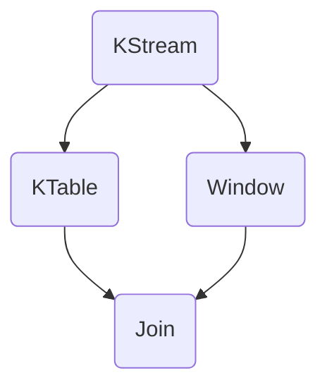

                 

 在大数据领域，Apache Kafka 早已成为流处理系统的基石。而 Kafka Streams 是 Kafka 官方提供的实时流处理库，它将 Kafka 的强大分布式消息系统与 Java 的简洁语法相结合，使得开发高效的实时流处理应用变得更加容易。本文将深入探讨 Kafka Streams 的原理，并借助实例代码，详细讲解其使用方法。

## 关键词

- Apache Kafka
- Kafka Streams
- 实时流处理
- Java API
- 分布式系统

## 摘要

本文将系统地介绍 Kafka Streams 的原理、核心概念、算法原理与数学模型，并通过实际代码实例展示如何使用 Kafka Streams 进行实时数据处理。此外，还将分析 Kafka Streams 的应用场景、未来展望以及相关学习资源和工具推荐。

## 1. 背景介绍

### Apache Kafka 的诞生

Apache Kafka 是一款分布式流处理平台，由 LinkedIn 开源并于 2010 年贡献给 Apache 软件基金会。Kafka 的设计初衷是为了解决大规模日志聚合和实时数据流处理的需求。其核心优势在于高吞吐量、可扩展性以及数据持久化能力。

### Kafka Streams 的推出

随着 Kafka 的广泛应用，社区迫切需要一款易于使用的流处理库。于是，Kafka Streams 应运而生。Kafka Streams 提供了一个基于 Java 的 API，使得开发者可以轻松地构建实时流处理应用，而无需复杂的分布式系统知识。

## 2. 核心概念与联系

### Kafka Streams 的核心概念

Kafka Streams 的核心概念主要包括：

- **KStream**：代表可处理的流数据。
- **KTable**：代表可处理的表数据。
- **Window**：用于定义数据的滑动窗口。
- **Join**：允许在两个或多个 KStream 或 KTable 之间进行关联。
- **Aggregation**：支持数据聚合操作。

### Kafka Streams 的架构

Kafka Streams 的架构主要包括三个主要组件：KStream、KTable 和 Window。以下是一个简化的 Mermaid 流程图，展示了它们之间的关联：



在这个流程图中，KStream 可以转换成 KTable，也可以与 Window 结合使用。KTable 可以与其他 KTable 或 KStream 进行 Join 操作，而 Window 则为流处理提供了时间维度上的抽象。

## 3. 核心算法原理 & 具体操作步骤

### 3.1 算法原理概述

Kafka Streams 的核心算法是基于状态机模型。每个 KStream 或 KTable 都维护一个状态，通过处理输入事件来更新状态，并生成输出事件。

### 3.2 算法步骤详解

1. **初始化状态**：每个 KStream 或 KTable 在初始化时都会设置一个初始状态。
2. **处理输入事件**：当输入事件到来时，Kafka Streams 会根据当前状态和事件类型进行状态更新。
3. **生成输出事件**：状态更新完成后，Kafka Streams 会生成新的输出事件。
4. **维护状态**：Kafka Streams 会持续维护状态，以便在后续事件处理中使用。

### 3.3 算法优缺点

**优点**：

- **高性能**：基于状态机模型，Kafka Streams 可以高效地处理大量流数据。
- **易用性**：提供了简单的 Java API，使得开发者可以轻松构建实时流处理应用。

**缺点**：

- **依赖 Kafka**：Kafka Streams 强依赖 Kafka，需要维护 Kafka 集群。
- **内存占用**：由于状态机模型，Kafka Streams 可能会占用较多内存。

### 3.4 算法应用领域

Kafka Streams 可以广泛应用于实时数据处理领域，如：

- **日志聚合**：处理大规模日志数据，进行实时统计和分析。
- **实时搜索**：基于实时数据流进行实时搜索和推荐。
- **实时监控**：对实时数据进行监控和分析，及时发现异常。

## 4. 数学模型和公式 & 详细讲解 & 举例说明

### 4.1 数学模型构建

在 Kafka Streams 中，常用的数学模型包括：

- **窗口函数**：用于将流数据划分为不同的时间窗口，常见的窗口函数包括 `tumblingWindow` 和 `slidingWindow`。
- **聚合函数**：用于对数据进行聚合操作，如 `sum`、`max` 和 `min`。

### 4.2 公式推导过程

以 `slidingWindow` 为例，其公式推导过程如下：

$$
Window(start, end) = \{x \in D \mid start + k \leq x < end + k\}
$$

其中，$D$ 表示流数据集合，$start$ 和 $end$ 分别表示窗口的起始和结束时间，$k$ 表示窗口的滑动步长。

### 4.3 案例分析与讲解

假设我们要对一段时间范围内的温度数据进行实时统计，可以使用 Kafka Streams 实现如下：

```java
KStream<String, Integer> temperatureStream = builder.stream("temperature_topic");
KTable<String, Integer> temperatureTable = temperatureStream
    .windowedBy(TimeWindows.of(Duration.ofHours(1)))
    .sum("temperature");
```

这个例子中，我们使用了 `slidingWindow` 对温度数据进行实时聚合，每 1 小时生成一次统计数据。通过这个案例，我们可以看到 Kafka Streams 如何将数学模型应用于实际数据处理中。

## 5. 项目实践：代码实例和详细解释说明

### 5.1 开发环境搭建

要开始使用 Kafka Streams，首先需要搭建 Kafka 集群和开发环境。以下是搭建步骤：

1. **安装 Kafka**：从 [Kafka 官网](http://kafka.apache.org/) 下载并解压 Kafka 安装包。
2. **启动 Kafka 集群**：运行 `bin/kafka-server-start.sh` 启动 Kafka 集群。
3. **配置开发环境**：在开发环境中安装 Maven，并将 Kafka 的依赖添加到项目的 `pom.xml` 文件中。

### 5.2 源代码详细实现

以下是一个简单的 Kafka Streams 应用示例，用于统计实时消息数量：

```java
Properties props = new Properties();
props.put(StreamsConfig.APPLICATION_ID_CONFIG, "kafka-streams-examples");
props.put(StreamsConfig.BOOTSTRAP_SERVERS_CONFIG, "localhost:9092");

StreamsBuilder builder = new StreamsBuilder();

KStream<String, String> textLines = builder.stream("text-input-topic");

KTable<String, Long> wordCounts = textLines
    .flatMapValues(line -> Arrays.asList(line.split(" ")).stream())
    .groupByKey()
    .count("count");

wordCounts.toStream().to("word-counts-output-topic");

StreamsConfig config = props;
KafkaStreams streams = new KafkaStreams(builder.build(), config);
streams.start();

// Shut down the streams application on SIGTERM (i.e., ctrl-c)
Runtime.getRuntime().addShutdownHook(new Thread(streams::close));
```

### 5.3 代码解读与分析

上述代码中，我们首先配置了 Kafka Streams 的属性，然后使用 `StreamsBuilder` 构建了流处理逻辑。具体来说：

1. **创建 KStream**：我们从输入主题 `text-input-topic` 中读取消息。
2. **数据处理**：使用 `flatMapValues` 将每条消息分割成单词，然后使用 `groupByKey` 和 `count` 进行计数。
3. **输出结果**：将计数结果输出到输出主题 `word-counts-output-topic`。
4. **启动流处理**：启动 Kafka Streams，并注册关闭钩子以在程序退出时关闭流处理。

通过这个示例，我们可以看到如何使用 Kafka Streams 进行简单的实时数据处理。

### 5.4 运行结果展示

在运行上述代码后，我们可以通过 Kafka 的消费者工具查看输出主题 `word-counts-output-topic` 中的数据，以验证实时处理结果。

## 6. 实际应用场景

Kafka Streams 在多个实际应用场景中表现出色，以下列举几个典型场景：

- **实时日志分析**：处理大规模日志数据，实时统计系统运行状态。
- **实时数据监控**：对实时数据进行监控，及时发现异常并报警。
- **实时推荐系统**：基于实时用户行为数据，提供个性化推荐。

## 7. 工具和资源推荐

### 7.1 学习资源推荐

- **官方文档**：[Kafka Streams 官方文档](https://kafka.apache.org/streams/) 提供了详细的 API 和使用指南。
- **教程和博客**：在 [GitHub](https://github.com/) 和 [Medium](https://medium.com/) 等平台上，可以找到大量关于 Kafka Streams 的教程和博客文章。

### 7.2 开发工具推荐

- **IntelliJ IDEA**：优秀的 Java IDE，支持 Maven 和 Kafka Streams 插件。
- **Kafka Manager**：方便的 Kafka 集群管理和监控工具。

### 7.3 相关论文推荐

- "Kafka: A Distributed Streaming Platform"，介绍了 Kafka 的基本原理和架构。
- "Building Real-Time Applications with Kafka Streams" ，详细讲解了 Kafka Streams 的应用场景和实现方法。

## 8. 总结：未来发展趋势与挑战

### 8.1 研究成果总结

Kafka Streams 作为 Kafka 的官方流处理库，在实时数据处理领域取得了显著的成果。它提供了简单易用的 API，使得开发者可以轻松构建高效、可靠的实时流处理应用。

### 8.2 未来发展趋势

随着大数据和实时处理需求的增长，Kafka Streams 在未来将继续发展，可能的方向包括：

- **性能优化**：提高 Kafka Streams 的性能和可扩展性。
- **生态扩展**：与其他大数据技术（如 Hadoop、Spark）集成，提供更全面的解决方案。

### 8.3 面临的挑战

Kafka Streams 在发展过程中也面临一些挑战：

- **依赖复杂**：需要依赖 Kafka 集群，对集群维护要求较高。
- **内存消耗**：状态机模型可能导致内存消耗较大，需要优化内存管理。

### 8.4 研究展望

未来，Kafka Streams 可以通过以下方式进一步提升：

- **优化内存管理**：引入内存压缩等技术，降低内存消耗。
- **扩展支持**：支持更多的数据处理算法和模型，满足更广泛的应用需求。

## 9. 附录：常见问题与解答

### 9.1 如何配置 Kafka Streams 的环境变量？

答：在开发环境中，可以通过 `~/.bashrc` 或 `~/.zshrc` 文件配置 Kafka Streams 的环境变量，例如：

```bash
export KAFKA_HOME=/path/to/kafka
export KAFKA_STREAMS_HOME=/path/to/kafka-streams
export PATH=$PATH:$KAFKA_HOME/bin:$KAFKA_STREAMS_HOME/bin
```

### 9.2 Kafka Streams 支持哪些窗口函数？

答：Kafka Streams 支持以下窗口函数：

- `tumblingWindow`：固定大小的窗口。
- `slidingWindow`：可滑动的窗口。
- `sessionWindow`：基于事件的窗口。

### 9.3 如何处理 Kafka Streams 中的异常数据？

答：在 Kafka Streams 中，可以通过设置 `DeserializationException` 处理器来处理异常数据。例如：

```java
props.put(StreamsConfig.DEFAULT_KEY_SERDE_CLASS_CONFIG, Serdes.String().getClass());
props.put(StreamsConfig.DEFAULT_VALUE_SERDE_CLASS_CONFIG, Serdes.String().getClass());
props.put(StreamsConfig.ERROR_HANDLER_CLASS_CONFIG, DeserializationExceptionHandler.class);

DeserializationExceptionHandler handler = new DeserializationExceptionHandler();
handler.configure(props);
streams.setUncaughtExceptionHandler(handler);
```

通过以上配置，当发生序列化异常时，将调用 `DeserializationExceptionHandler` 处理器进行处理。

----------------------------------------------------------------

### 文章标题

《Kafka Streams原理与代码实例讲解》

### 关键词

- Apache Kafka
- Kafka Streams
- 实时流处理
- Java API
- 分布式系统

### 摘要

本文深入讲解了 Kafka Streams 的原理，包括核心概念、算法原理、数学模型等，并通过实际代码实例展示了如何使用 Kafka Streams 进行实时数据处理。文章还分析了 Kafka Streams 的应用场景、未来展望以及相关学习资源和工具推荐，为开发者提供了全面的指南。

