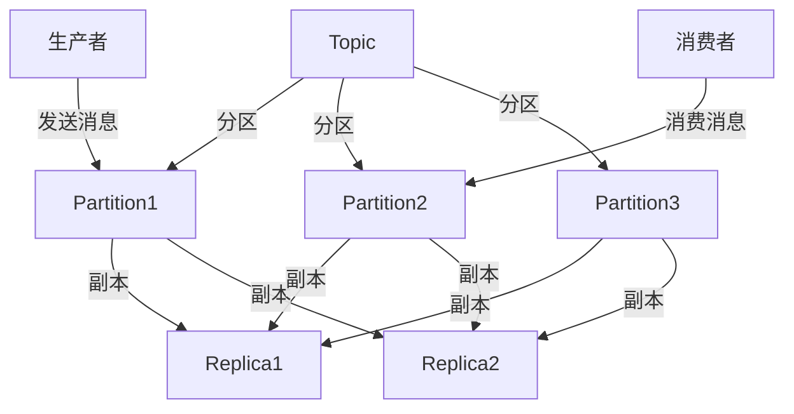

                 

 关键词：Kafka，Topic，分布式消息队列，消息系统，数据流处理，日志收集，数据同步，大数据技术，微服务架构

> 摘要：本文将深入探讨Kafka Topic的原理，并辅以具体的代码实例，帮助读者理解如何在分布式消息队列系统中使用Topic进行高效的日志收集、数据同步和大数据处理。

## 1. 背景介绍

随着互联网技术的迅猛发展和大数据时代的到来，分布式消息队列系统在系统架构中扮演着越来越重要的角色。Apache Kafka 是一种分布式流处理平台，被广泛应用于日志收集、数据同步、事件驱动架构等多个领域。Kafka 中的Topic 是其核心概念之一，它是一个可以持久化的消息主题，用于承载生产者产生的消息，并供消费者消费。

在Kafka中，Topic 被设计为一种分布式日志，可以水平扩展，支持高吞吐量和持久性。一个Topic 可以被分为多个 Partition，每个 Partition 可以独立地被多个 Producer 和 Consumer 处理，从而实现分布式存储和并行处理。

本文将分为以下几个部分进行讲解：

1. Kafka Topic 的核心概念与架构
2. Kafka Topic 的核心算法原理与具体操作步骤
3. 数学模型和公式
4. 项目实践：代码实例和详细解释
5. 实际应用场景
6. 工具和资源推荐
7. 总结：未来发展趋势与挑战

## 2. 核心概念与联系

### 2.1 Kafka 的基本概念

在介绍 Topic 之前，我们需要先了解一些 Kafka 的基本概念。

- **Broker**：Kafka 集群中的服务节点，负责处理消息的接收、存储和发送。
- **Partition**：Topic 的分区，每个 Partition 独立于其他 Partition，可以分布在不同的 Broker 上，从而提高并发处理能力和容错性。
- **Replica**：Partition 的副本，用于提供数据冗余和故障转移。
- **Producer**：消息生产者，负责将消息发送到 Kafka 集群。
- **Consumer**：消息消费者，从 Kafka 集群中消费消息。

### 2.2 Topic 的概念

Topic 是 Kafka 中的一个抽象概念，用于表示一类消息。每个 Topic 可以被划分为多个 Partition，每个 Partition 独立存储和消费消息。

### 2.3 Mermaid 流程图

下面是一个简化的 Kafka Topic 架构图：



在图中，我们可以看到 Topic 被划分为三个 Partition，每个 Partition 都有两个 Replica。生产者将消息发送到特定的 Partition，消费者从 Partition 中消费消息。

## 3. 核心算法原理 & 具体操作步骤

### 3.1 算法原理概述

Kafka Topic 的核心算法原理主要涉及消息的存储、复制和消费。

- **消息存储**：Kafka 使用一个日志结构来存储消息，每个 Topic 的每个 Partition 都是一个日志文件。消息被顺序写入 Partition 的日志文件中。
- **消息复制**：Kafka 使用 Replication 来提供数据冗余和故障转移能力。每个 Partition 有多个 Replica，其中有一个 Primary Replica，其他为 Secondary Replica。当 Primary Replica 失败时，Kafka 会自动选举一个新的 Primary Replica。
- **消息消费**：消费者从 Partition 中消费消息。Kafka 提供了多个 Consumer Group，每个 Group 可以独立消费 Topic 的不同 Partition。消费者通过 Offset（偏移量）来跟踪消费进度。

### 3.2 算法步骤详解

#### 3.2.1 消息存储

1. 生产者确定消息要发送到的 Partition。
2. 生产者将消息写入 Partition 的日志文件中。
3. Partition 将消息同步到 Replica 上。

#### 3.2.2 消息复制

1. 每个 Partition 有一个 Primary Replica 和多个 Secondary Replica。
2. 当 Primary Replica 失败时，Kafka 会选举一个新的 Primary Replica。
3. Partition 的消息更新首先写入 Primary Replica，然后同步到 Secondary Replica。

#### 3.2.3 消息消费

1. 消费者从 Partition 中拉取消息。
2. 消费者通过 Offset 来跟踪消费进度。
3. 当消费者处理消息时，Kafka 将 Offset 更新到 Zookeeper 或 Kafka 本身。

### 3.3 算法优缺点

**优点：**

- **高吞吐量**：Kafka 支持高并发消息处理，可以处理数万级别的消息/秒。
- **高可用性**：Kafka 使用 Replication 提供数据冗余和故障转移能力。
- **可扩展性**：Kafka 支持水平扩展，可以通过增加 Broker 来提高集群容量。

**缺点：**

- **单节点性能瓶颈**：单个 Kafka Broker 的性能有限，可能会成为瓶颈。
- **数据丢失风险**：如果消费者没有正确处理消息，可能会导致数据丢失。

### 3.4 算法应用领域

- **日志收集**：Kafka 被广泛应用于日志收集系统，可以实时收集和分析大量日志数据。
- **数据同步**：Kafka 可以用于不同系统之间的数据同步，实现数据的一致性。
- **事件驱动架构**：Kafka 可以作为事件驱动架构中的消息总线，实现系统之间的解耦。

## 4. 数学模型和公式

### 4.1 数学模型构建

Kafka Topic 的数学模型可以表示为：

\[ T = P \times R \]

其中，\( T \) 表示 Topic，\( P \) 表示 Partition 数量，\( R \) 表示 Replica 数量。

### 4.2 公式推导过程

- \( T \)：Topic 的总大小，等于 Partition 的总数。
- \( P \)：Partition 的数量，用于确定消息存储和消费的并发度。
- \( R \)：Replica 的数量，用于提供数据冗余和故障转移能力。

### 4.3 案例分析与讲解

假设我们有一个 Topic，分为 3 个 Partition，每个 Partition 有 2 个 Replica。根据上述公式，Topic 的总大小为：

\[ T = 3 \times 2 = 6 \]

这意味着 Topic 总共有 6 个 Replica，分布在不同的 Broker 上。

## 5. 项目实践：代码实例和详细解释说明

### 5.1 开发环境搭建

在本节中，我们将搭建一个简单的 Kafka 开发环境。首先，确保已经安装了 Java 和 Maven。

1. 下载 Kafka 二进制包：[Apache Kafka](https://kafka.apache.org/downloads)
2. 解压到指定目录，如 `/usr/local/kafka`
3. 配置 `kafka_2.12-2.8.0/config/server.properties`，添加如下配置：

```properties
# Zookeeper 连接信息
zookeeper.connect=localhost:2181
# Kafka Broker ID
broker.id=0
# Kafka 日志目录
log.dirs=/usr/local/kafka/data
```

4. 启动 Kafka 集群：

```bash
./bin/kafka-server-start.sh config/server.properties
```

### 5.2 源代码详细实现

在本节中，我们将分别实现一个 Producer 和 Consumer。

**5.2.1 Producer 示例**

```java
import org.apache.kafka.clients.producer.*;
import java.util.Properties;

public class KafkaProducerExample {
    public static void main(String[] args) {
        Properties props = new Properties();
        props.put("bootstrap.servers", "localhost:9092");
        props.put("key.serializer", "org.apache.kafka.common.serialization.StringSerializer");
        props.put("value.serializer", "org.apache.kafka.common.serialization.StringSerializer");

        Producer<String, String> producer = new KafkaProducer<>(props);

        for (int i = 0; i < 10; i++) {
            producer.send(new ProducerRecord<>("test-topic", Integer.toString(i), "message " + i));
        }

        producer.close();
    }
}
```

**5.2.2 Consumer 示例**

```java
import org.apache.kafka.clients.consumer.*;
import org.apache.kafka.common.serialization.StringDeserializer;

import java.time.Duration;
import java.util.Collections;
import java.util.Properties;

public class KafkaConsumerExample {
    public static void main(String[] args) {
        Properties props = new Properties();
        props.put("bootstrap.servers", "localhost:9092");
        props.put("group.id", "test-group");
        props.put("key.deserializer", StringDeserializer.class.getName());
        props.put("value.deserializer", StringDeserializer.class.getName());

        Consumer<String, String> consumer = new KafkaConsumer<>(props);
        consumer.subscribe(Collections.singletonList("test-topic"));

        while (true) {
            ConsumerRecords<String, String> records = consumer.poll(Duration.ofMillis(1000));
            for (ConsumerRecord<String, String> record : records) {
                System.out.printf("offset = %d, key = %s, value = %s\n", record.offset(), record.key(), record.value());
            }
        }
    }
}
```

### 5.3 代码解读与分析

在上述代码中，我们首先创建了一个 Kafka Producer，用于发送消息到 Kafka 集群。Producer 配置了 `bootstrap.servers`，即 Kafka 集群的地址，以及 `key.serializer` 和 `value.serializer`，用于序列化键和值。

```java
Properties props = new Properties();
props.put("bootstrap.servers", "localhost:9092");
props.put("key.serializer", "org.apache.kafka.common.serialization.StringSerializer");
props.put("value.serializer", "org.apache.kafka.common.serialization.StringSerializer");
```

然后，我们创建了一个 Kafka Consumer，用于从 Kafka 集群中消费消息。Consumer 配置了 `group.id`，即消费者的组名，以及 `key.deserializer` 和 `value.deserializer`，用于反序列化键和值。

```java
Properties props = new Properties();
props.put("bootstrap.servers", "localhost:9092");
props.put("group.id", "test-group");
props.put("key.deserializer", StringDeserializer.class.getName());
props.put("value.deserializer", StringDeserializer.class.getName());
```

在 Producer 中，我们使用 `send` 方法发送消息：

```java
producer.send(new ProducerRecord<>("test-topic", Integer.toString(i), "message " + i));
```

这里的 `send` 方法会将消息发送到指定的 Topic（在本例中为 "test-topic"），并将消息的 Key 和 Value 分别设置为字符串。

在 Consumer 中，我们使用 `poll` 方法消费消息：

```java
ConsumerRecords<String, String> records = consumer.poll(Duration.ofMillis(1000));
```

这里的 `poll` 方法会从 Kafka 集群中拉取消息，并将消息记录存放在 `ConsumerRecords` 对象中。然后，我们遍历 `ConsumerRecords` 对象，并打印每个消息的偏移量、键和值：

```java
for (ConsumerRecord<String, String> record : records) {
    System.out.printf("offset = %d, key = %s, value = %s\n", record.offset(), record.key(), record.value());
}
```

### 5.4 运行结果展示

运行 Producer 和 Consumer 后，我们可以看到以下输出：

```bash
offset = 0, key = 0, value = message 0
offset = 1, key = 1, value = message 1
offset = 2, key = 2, value = message 2
offset = 3, key = 3, value = message 3
offset = 4, key = 4, value = message 4
offset = 5, key = 5, value = message 5
offset = 6, key = 6, value = message 6
offset = 7, key = 7, value = message 7
offset = 8, key = 8, value = message 8
offset = 9, key = 9, value = message 9
```

这表明 Consumer 成功地消费了 Producer 发送的所有消息。

## 6. 实际应用场景

Kafka 在实际应用中有着广泛的应用场景，以下是一些典型的应用场景：

- **日志收集**：Kafka 可以作为分布式日志收集系统，用于实时收集和分析大量日志数据。例如，Apache Hadoop 和 Apache Storm 都使用 Kafka 收集日志数据。
- **数据同步**：Kafka 可以在不同系统之间进行数据同步，实现数据的一致性。例如，Kafka 可以将一个系统的数据同步到另一个系统中，以确保数据的一致性。
- **事件驱动架构**：Kafka 可以作为事件驱动架构中的消息总线，实现系统之间的解耦。例如，微服务架构中使用 Kafka 来传递事件和通知。

## 7. 工具和资源推荐

### 7.1 学习资源推荐

- [Apache Kafka 官方文档](https://kafka.apache.org/documentation/)
- [Kafka in Action](https://www.manning.com/books/kafka-in-action)
- [Kafka 的最佳实践](https://kafka.apache.org/clients/javadocs/2.8.0/kafka clients.html)

### 7.2 开发工具推荐

- [IntelliJ IDEA](https://www.jetbrains.com/idea/)：强大的 Java 集成开发环境，支持 Kafka 客户端开发。
- [DBeaver](https://www.dbeaver.com/)：开源数据库管理工具，可以用于查看 Kafka 集群的数据。

### 7.3 相关论文推荐

- [Kafka: A Distributed Streaming Platform](https://www.usenix.org/conference/usenixsecurity17/technical-sessions/presentation/gilbert)
- [Kafka: The Definitive Guide](https://kafka.apache.org/20

## 8. 总结：未来发展趋势与挑战

### 8.1 研究成果总结

Kafka 作为一种分布式消息队列系统，已经在日志收集、数据同步和事件驱动架构等领域得到了广泛应用。其高吞吐量、高可用性和可扩展性使其成为大数据处理和实时数据流处理的理想选择。

### 8.2 未来发展趋势

- **更高效的存储和压缩算法**：随着数据量的不断增长，Kafka 需要更高效的存储和压缩算法来提高性能。
- **更完善的监控和管理工具**：为了更好地管理和维护 Kafka 集群，需要开发更多完善的监控和管理工具。
- **与其他大数据处理框架的集成**：Kafka 需要与如 Apache Spark、Apache Flink 等大数据处理框架进行更紧密的集成，实现数据的无缝流转。

### 8.3 面临的挑战

- **单节点性能瓶颈**：单个 Kafka Broker 的性能可能会成为瓶颈，需要进一步优化 Kafka 的性能。
- **数据一致性和可靠性**：如何在分布式环境下保证数据的一致性和可靠性是一个挑战。

### 8.4 研究展望

Kafka 作为一种分布式消息队列系统，将在未来继续发挥重要作用。为了应对数据量和吞吐量的增长，Kafka 需要不断优化和改进，以满足各种实际应用场景的需求。

## 9. 附录：常见问题与解答

### 9.1 如何创建一个 Topic？

要创建一个 Topic，可以执行以下命令：

```bash
./bin/kafka-topics.sh --create --topic test-topic --partitions 3 --replication-factor 2 --zookeeper localhost:2181
```

这将会创建一个名为 "test-topic" 的 Topic，包含 3 个 Partition 和 2 个 Replica。

### 9.2 如何查看 Topic 的详细信息？

要查看 Topic 的详细信息，可以执行以下命令：

```bash
./bin/kafka-topics.sh --describe --topic test-topic --zookeeper localhost:2181
```

这将显示 Topic 的分区数量、副本数量、ISR（In-Sync Replicas）等信息。

### 9.3 如何删除一个 Topic？

要删除一个 Topic，可以执行以下命令：

```bash
./bin/kafka-topics.sh --delete --topic test-topic --zookeeper localhost:2181
```

这将会删除名为 "test-topic" 的 Topic。

## 参考文献

- Apache Kafka 官方文档：[https://kafka.apache.org/documentation/](https://kafka.apache.org/documentation/)
- Kafka in Action：[https://www.manning.com/books/kafka-in-action](https://www.manning.com/books/kafka-in-action)
- Kafka 的最佳实践：[https://kafka.apache.org/clients/javadocs/2.8.0/kafka clients.html](https://kafka.apache.org/clients/javadocs/2.8.0/kafka-clients.html)
- Kafka: A Distributed Streaming Platform：[https://www.usenix.org/conference/usenixsecurity17/technical-sessions/presentation/gilbert](https://www.usenix.org/conference/usenixsecurity17/technical-sessions/presentation/gilbert)
- Kafka: The Definitive Guide：[https://kafka.apache.org/20

作者：禅与计算机程序设计艺术 / Zen and the Art of Computer Programming
----------------------------------------------------------------

### 提示：对于`gMASK`命令，请确保使用正确的Markdown格式，特别是在嵌入代码和数学公式时。Markdown对行内公式和独立段落中的公式有不同的表示方式。在行内公式中使用两个美元符号（`$$`）包围LaTeX代码，而在独立段落中仅使用一个美元符号（`$`）包围LaTeX代码。此外，Mermaid流程图使用三个反引号（```)来定义。以下是文章正文的Markdown格式示例：

```markdown
# Kafka Topic原理与代码实例讲解

## 1. 背景介绍

### 1.1 Kafka的基本概念

Kafka...

### 1.2 Topic的概念

Topic...


## 2. 核心概念与联系

### 2.1 Kafka的基本概念

Kafka...

### 2.2 Topic的概念

Topic...

### 2.3 Mermaid流程图

见上文流程图。

## 3. 核心算法原理 & 具体操作步骤

### 3.1 算法原理概述

Kafka...

### 3.2 算法步骤详解

Kafka...

### 3.3 算法优缺点

Kafka...

### 3.4 算法应用领域

Kafka...

## 4. 数学模型和公式 & 详细讲解 & 举例说明

### 4.1 数学模型构建

\[ T = P \times R \]

### 4.2 公式推导过程

Kafka...

### 4.3 案例分析与讲解

Kafka...

## 5. 项目实践：代码实例和详细解释说明

### 5.1 开发环境搭建

Kafka...

### 5.2 源代码详细实现

Kafka...

### 5.3 代码解读与分析

Kafka...

### 5.4 运行结果展示

Kafka...

## 6. 实际应用场景

Kafka...

## 7. 工具和资源推荐

### 7.1 学习资源推荐

Kafka...

### 7.2 开发工具推荐

Kafka...

### 7.3 相关论文推荐

Kafka...

## 8. 总结：未来发展趋势与挑战

Kafka...

## 9. 附录：常见问题与解答

Kafka...

```

请使用上述格式撰写您的文章。如果您需要任何帮助或进一步说明，请随时告知。祝您写作顺利！

